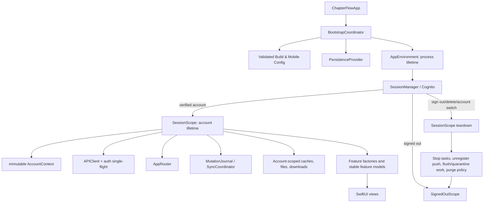
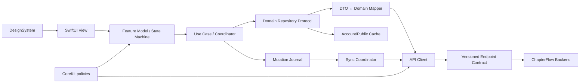
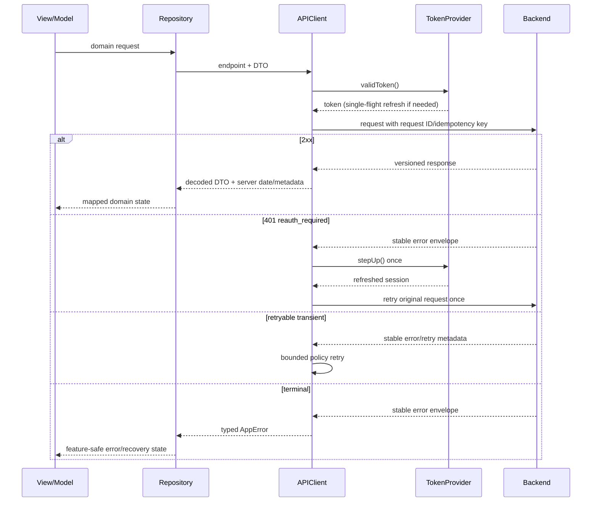
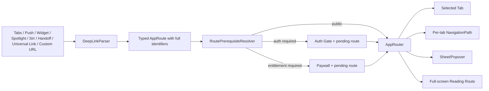
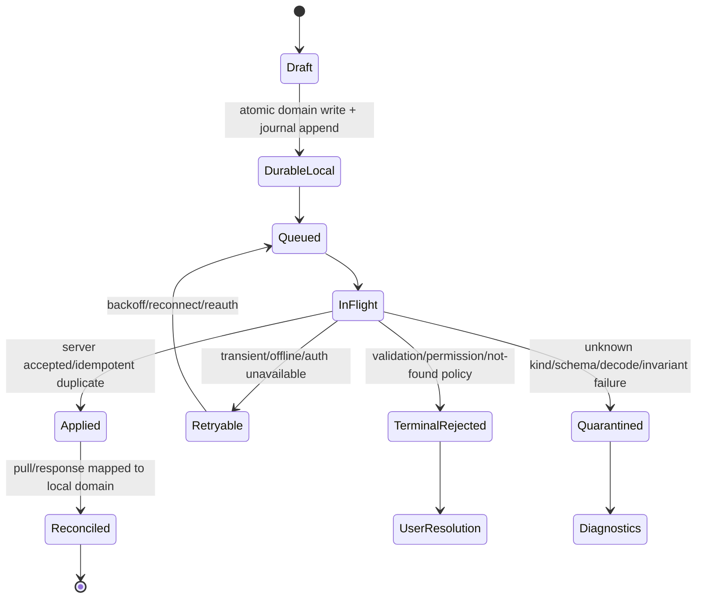
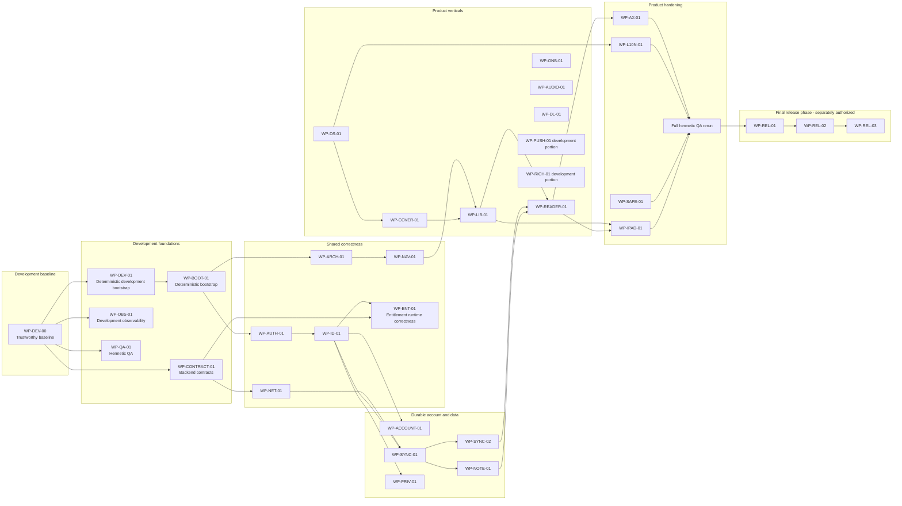
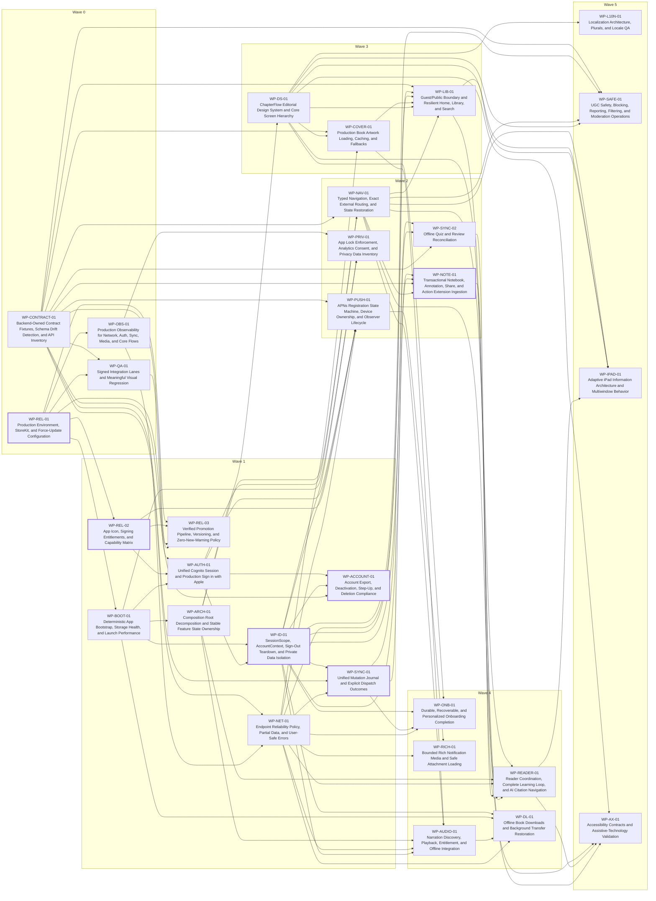

# ChapterFlow iOS S-Tier Implementation Playbook

**Document type:** Execution-ready implementation plan; no production changes are included
**Prepared:** 2026-07-11; product-development sequencing amended 2026-07-13
**iOS repository:** `WillSoltani/Chapterflow-IOS`
**iOS revision inspected:** `03747305819eccc8bb3c738a21e79d78a82d587d`
**Backend repository:** `WillSoltani/ChapterFlow`
**Backend revision inspected by WP-DEV-00:** `968ff67ecafbed7e8e1d4c7b77badf507cfc5aee`
**Audit incorporated:** `ChapterFlow_iOS_Audit_Report.md`, 57 findings
**Execution scope:** iOS client product development, backend contracts, QA, accessibility, security, and observability. All release engineering is deferred to the final release phase.
**Implementation status:** Planning only. This document does not authorize a commit, deploy, schema migration, App Store change, or production feature enablement.

> This playbook is self-contained. Future implementation and verification agents are expected to have only the two repositories above and this file. They must re-read current code before editing because paths and line numbers are evidence from the pinned revisions, not permission to edit blindly.

## 0. Authoritative Product-Development Amendment

This amendment supersedes every release-first dependency, wave assignment, ownership rule, prompt prerequisite, and sequencing statement later in this inherited playbook. The app is in product development, not release preparation.

### Scope guard

- Begin with `WP-DEV-00`, then execute application-correctness and product packages.
- No development package depends on `WP-REL-01`, `WP-REL-02`, or `WP-REL-03`.
- All `WP-REL-*` packages are final-release work. They must not begin until development and product hardening are complete and the owner records a separate release authorization.
- App Store Connect metadata, TestFlight upload, StoreKit Sandbox attestation, release evidence, production deployment, release labeling, and release PR merging are prohibited during the development phase.
- PR #117 and `codex/wp-rel-01` are frozen, immutable reference material. Reusable logic must be logically ported onto current main in new focused PRs; do not cherry-pick the mixed branch or mutate the deferred PR.
- The inherited findings and standalone prompts retain their authoring-time backend evidence baseline `94428c5f5c575773c7df9804c172a9508e427c0f`. WP-DEV-00 verified backend `main` at `968ff67ecafbed7e8e1d4c7b77badf507cfc5aee`. Every backend-dependent package must revalidate historical paths, line numbers, request/response shapes, and deployment assumptions against the current backend revision or its successor.
- Live command results belong in `docs/ios/DEVELOPMENT_EXECUTION_STATUS.md`; PR #117 disposition belongs in `docs/ios/PR117_EXTRACTION_MATRIX.md`. Historical claims in this playbook are not fresh execution evidence.

### WP-DEV-00 - Trustworthy Development Baseline

**Objective.** Pin the exact repository state, preserve unrelated work, run the existing deterministic gates, reproduce only what the available environment can prove, and create the extraction plan before production implementation changes.

**Acceptance criteria.** All of the following are required:

1. Record exact iOS main, backend main when verifiable, PR #117 base/head, its 19 commits, and its complete changed-file inventory.
2. Use an isolated clean worktree from exact iOS main. Capture the original checkout and WP-REL worktree status before and after; neither may change.
3. Record Xcode, Swift, SwiftLint, simulator runtime/device type, and physical-device discovery without publishing device identifiers or personal data.
4. Run current-main strict lint, the full package-test loop, Debug simulator build, and the CI-defined UI command verbatim. If CI does not define a requested selector, record the conflict instead of weakening the harness.
5. Record runtime checks as `PASS`, `FAIL`, `BLOCKED`, or `NOT RUN`; never infer a result from source or a neighboring test.
6. For each reproduced failure, record environment, account state, preconditions, observed/expected results, reproducibility, evidence, and owning work package.
7. Make no production-source change. Report any harness-only blocker before changing the harness.
8. Confirm no release, deployment, App Store Connect, TestFlight, StoreKit Sandbox attestation, PR merge/close/relabel, or push action occurred during the baseline.

### Development-first work-package order

1. Baseline: `WP-DEV-00`.
2. **First implementation PR:** `WP-DEV-01 - Deterministic Development Bootstrap`, the focused extraction slice that feeds `WP-BOOT-01`.
3. Development foundations: `WP-CONTRACT-01`, `WP-BOOT-01`, development-only `WP-OBS-01`, and hermetic/visual development portions of `WP-QA-01`.
4. Shared correctness: `WP-NET-01`, `WP-AUTH-01`, `WP-ARCH-01`, `WP-ID-01`, `WP-NAV-01`, then `WP-ENT-01` for StoreKit and entitlement runtime correctness without release identities or attestation.
5. Account and durable data: `WP-ACCOUNT-01`, `WP-SYNC-01`, `WP-SYNC-02`, `WP-NOTE-01`, `WP-PRIV-01`.
6. Product verticals: `WP-DS-01`, `WP-COVER-01`, `WP-LIB-01`, `WP-READER-01`, `WP-ONB-01`, `WP-AUDIO-01`, `WP-DL-01`, and development portions of `WP-PUSH-01` and `WP-RICH-01`.
7. Product hardening: `WP-L10N-01`, `WP-SAFE-01`, `WP-IPAD-01`, `WP-AX-01`, and the full hermetic QA rerun.
8. Final release phase only: `WP-REL-01`, `WP-REL-02`, `WP-REL-03`, followed by separately authorized signed-service, Sandbox, TestFlight, App Store, deployment, metadata, and release-evidence gates.

`WP-ENT-01` is the non-release destination for server-authoritative entitlement state, account/session binding, verify-before-finish transaction handling, unfinished-transaction replay, restore correctness, coalescing, cancellation, and exactly-once invalidation. It excludes production product identifiers, App Store listing identity, release manifests, archive/IPA inspection, Sandbox/TestFlight attestation, deployment, and release evidence.

## How to use this playbook

1. Pin or record the actual iOS and backend revisions at the start of each work package.
2. Read the package's dependencies, invariants, acceptance criteria, implementation prompt, and verification prompt.
3. Revalidate the cited code and backend contract before changing anything.
4. Keep each implementation package on an isolated branch or change set. Preserve unrelated user work.
5. Do not merge a package until its independent verification result is **Pass** or an explicitly accepted **Conditional Pass**.
6. Re-run the integration gates whenever a shared contract, persistence schema, navigation type, entitlement, or design-system interface changes.
7. Treat every stop/escalation condition as intentional. Do not invent a backend contract or product decision merely to finish a task.

## Evidence labels

- **Confirmed:** Directly established by source, committed configuration, contract code, build/release workflow, test implementation, or the documented physical-device symptom.
- **Probable:** Strongly supported by source and architecture, but full runtime reproduction or production-service access is still required.
- **Hypothesis requiring validation:** Plausible and material, but the available source did not prove the behavior across every relevant surface.

## Severity

- **P0 — Release blocker:** Security compromise, data loss, persistent crash, invalid release artifact, or core app unusable.
- **P1 — Critical:** Major flow broken, serious integration mismatch, or widespread functional failure.
- **P2 — High:** Substantial reliability, UX, accessibility, performance, privacy, testability, or maintainability problem.
- **P3 — Medium:** Noticeable defect, inconsistency, or important polish debt.


## 1. Executive Summary

### Current state

ChapterFlow has unusually broad first-version scope: a SwiftUI app shell, modular Swift packages, authentication, a public and personalized library, reader and quiz flows, offline persistence, a mutation sync engine, StoreKit subscriptions, notifications, widgets, Live Activities, Siri/App Intents, Share and Action extensions, social features, AI assistance, analytics, crash reporting, and a backend with corresponding route families.

The breadth is not yet matched by integration reliability. The current release is a **no-go** because several systems report success without completing their obligation, production release configuration is not trustworthy, account and session ownership are fragmented, external routes lose destination identity, and visible product affordances exist without complete production wiring. The most serious failures are not visual polish issues. They are release integrity, data loss, authentication consistency, account deletion, and cross-account isolation defects.

### Target S-tier state

An S-tier ChapterFlow release is a coherent applied-reading product, not a collection of feature demos. A user should move naturally from discovering a book, to reading, understanding, applying, reviewing, and retaining it. The product must remain truthful under slow networks, expired authentication, partial backend failure, offline use, relaunch, and account switching. Every user-authored artifact must be durable. Every external entry point must reach its exact destination. Every visible control must have a complete state machine and production implementation.

The technical destination is incremental:

- Keep the existing feature-package investment.
- Introduce explicit process, session, and feature lifetimes.
- Replace fallback identities with an immutable `AccountContext`.
- Replace fragmented navigation with one typed `AppRouter`.
- Replace multiple outboxes with one versioned mutation journal and explicit outcomes.
- Treat backend wire models as transport DTOs and map them to domain models.
- Make configuration, contracts, capabilities, and release provenance mechanically verifiable.
- Establish one editorial design language and shared state components after correctness foundations are stable.
- Use signed-device, two-account, offline/relaunch, accessibility, and production-contract lanes as mandatory release evidence.

### Most consequential gaps

1. **Release artifacts are not trustworthy.** The committed workflow copies placeholder configuration, the AppIcon catalog lacks assigned files, and upload is not gated by full quality checks.
2. **Data can be acknowledged and lost.** Extension items are cleared without import, unknown/incomplete sync mutations can be deleted, and offline quiz payloads do not match the replay decoder.
3. **Account identity and teardown are not authoritative.** Apple sign-in, Amplify session restoration, Keychain entitlements, caches, observers, push tokens, and queued mutations use inconsistent ownership rules.
4. **Account deletion is not executable.** The iOS request body does not satisfy the backend confirmation contract and the product copy does not fully align with backend retention semantics.
5. **Backend contract safety is incomplete.** Tolerant decoding fixed known drift, but authenticated live fixtures and route-by-route contract ownership remain incomplete.
6. **Core product promises are incomplete.** Real covers are decoded but never rendered; narration and downloads have infrastructure without complete production entry and lifecycle wiring; several reader and external-route actions stop short of their intended destination.
7. **The UI is tokenized but not yet product-distinctive.** It needs real artwork, an editorial information hierarchy, calm reader chrome, and truthful loading/partial/offline/sync components.
8. **Quality evidence is too mock-heavy.** Stubbed UI tests and nonempty render guards do not prove signed authentication, real services, semantic accessibility, visual correctness, or App Store capability behavior.

### Primary architectural risks

- `AppModel` currently combines process bootstrap, session services, feature construction, routing, external events, and release services.
- Process-long objects own account-private state that should be created and destroyed with a verified session.
- Several repositories tolerate empty or anonymous identity.
- Multiple persistence and outbox mechanisms have incompatible retry, failure, and purge semantics.
- Navigation state is split across tab selection, unused/partial routers, sheets, pending IDs, and feature-local stacks.
- Transport models and error descriptions leak too far into UI decisions.
- Synchronous persistent-container construction and swallowed initialization errors make degraded states invisible.

### Primary product-design risks

- The current visual language can feel like generic SwiftUI surfaces despite a design-token package.
- Book artwork, the strongest visual identity in a reading app, is absent from actual rendering.
- Home and Library collapse too much data into all-or-nothing states.
- Reader, AI, quiz, review, annotation, audio, and application flows do not yet feel like one learning loop.
- iPad is declared without a deliberate wide-layout information architecture.
- Accessibility and localization evidence focus more on rendering than semantics and task completion.

### Backend-integration risks

- The deployed backend shape previously drifted substantially from the documented model contract.
- The public contract fixture lane exists, but authenticated production fixture capture remains incomplete.
- Source `main`, deployed production revision, and mobile release configuration may not advance together.
- Endpoint-specific idempotency, timeout, retry, partial-data, and cache policies are not centrally declared.
- Account deletion, Apple purchase verification, audio-plan deployment, APNs device registration, and mobile-config destinations need signed/staging/production proof, not static source confidence alone.

### Recommended transformation strategy

Execute vertical slices behind stable development foundations. First establish `WP-DEV-00`, contracts, bootstrap, authentication, account identity, routing, mutation semantics, observability, and hermetic QA. Then complete the highest-value user flows: public browsing, real covers, reader/learning coordination, notebook, quiz/review reconciliation, audio, downloads, and notifications. Apply the editorial design system to those working flows, then complete accessibility, localization, iPad adaptation, and safety. Release artifacts and signed end-to-end release gates are final-phase work only.

This is not a rewrite. Existing packages, repositories, tolerant models, StoreKit verify-then-finish design, SwiftData schemas, notification infrastructure, and design tokens should be retained where they satisfy the new invariants.

### Ten highest-leverage actions

1. Establish the deterministic `WP-DEV-00` baseline and extract reusable PR #117 logic through `WP-DEV-01` and later focused development packages.
2. Establish one verified Cognito session and immutable account identity for all sign-in methods.
3. Implement deterministic `SessionScope` construction and teardown, including account-scoped persistence and sign-out cleanup.
4. Replace silent sync success with a unified mutation journal and explicit applied/retry/terminal/quarantine outcomes.
5. Fix account deletion end to end, including step-up auth, request body, backend semantics, SIWA revocation, subscription messaging, and local purge.
6. Freeze route contracts with backend-owned fixtures and mandatory authenticated drift checks.
7. Introduce one typed router for tabs, stacks, sheets, reader, and external destinations.
8. Render real book artwork through a shared bounded image pipeline and use it to redefine Library, Home, detail, widgets, and audio identity.
9. Complete the reading-to-learning vertical slice: reader controls, annotations, Ask citations, quiz/review reconciliation, next chapter, audio, and downloaded content.
10. Make signed-device integration, two-account isolation, accessibility task completion, visual regression, performance budgets, and App Store checks mandatory promotion gates.

### Transformation inventory

| Measure | Count |
|---|---:|
| Valid audit findings | 57 |
| Findings mapped | 57 |
| Work packages | 30 |
| Standalone implementation prompts | 30 |
| Independent verification prompts | 30 |
| Parallel execution lanes | 14 |
| Backend contract rows | 29 |
| Unmapped findings | 0 |


## 2. Source Material and Scope

### Source audit

- Audit used: `ChapterFlow_iOS_Audit_Report.md`, prepared 2026-07-11.
- The audit is not required to execute this playbook. All valid findings, evidence, root causes, work-package mappings, acceptance criteria, and prompts are reproduced here.
- Audit result: 57 findings: 7 P0, 25 P1, 23 P2, and 2 P3. Confidence: 45 Confirmed, 11 Probable, and 1 Hypothesis requiring validation.

### Repositories and revisions inspected

| Repository | Revision | Revalidation result |
|---|---|---|
| `WillSoltani/Chapterflow-IOS` | `03747305819eccc8bb3c738a21e79d78a82d587d` | Audited baseline and current iOS `main` verified by WP-DEV-00 on 2026-07-13. |
| `WillSoltani/ChapterFlow` | `94428c5f5c575773c7df9804c172a9508e427c0f` | Historical authoring baseline retained by the inherited audit and prompts; no longer current. |
| `WillSoltani/ChapterFlow` | `968ff67ecafbed7e8e1d4c7b77badf507cfc5aee` | Backend `main` verified by WP-DEV-00 on 2026-07-13. Source-main status does not prove deployment. |

Revision links:

- `https://github.com/WillSoltani/Chapterflow-IOS/commit/03747305819eccc8bb3c738a21e79d78a82d587d`
- `https://github.com/WillSoltani/ChapterFlow/commit/94428c5f5c575773c7df9804c172a9508e427c0f`
- `https://github.com/WillSoltani/ChapterFlow/commit/968ff67ecafbed7e8e1d4c7b77badf507cfc5aee`

### iOS scope covered

- Main `ChapterFlow` app target.
- `ChapterFlowUITests`.
- Notification Service and Notification Content extensions.
- Widget/Live Activity target.
- Share and Action extensions.
- Swift packages including `AppFeature`, `AuthKit`, `CoreKit`, `DesignSystem`, `Models`, `Networking`, `Persistence`, `LibraryFeature`, `ReaderFeature`, `QuizFeature`, `AIFeature`, `PaywallFeature`, `EngagementFeature`, `SocialFeature`, `NotificationsFeature`, `OnboardingFeature`, `SettingsFeature`, `SyncEngine`, and test/fixture support.
- Build settings, xcconfig handling, entitlements, Info.plists, privacy manifest, AppIcon catalog, release workflow, package tests, UI-test infrastructure, localization catalog, performance/visual-QA documentation, and release artifacts declared in source.

### Backend scope covered

- Public catalog, search, book detail, chapter, quiz, and AI routes.
- Authenticated progress, saved, state, entitlements, purchases, settings, notifications, devices, notebook, reviews, commitments, social, pairs, gifts, referrals, onboarding, export, account lifecycle, analytics, audio, reading sessions, and mobile configuration.
- Authentication/step-up behavior, Cognito integration, Apple transaction verification, public S3 cover URL generation, error envelopes, serializers, deployment/source drift, and contract fixtures.

### Evidence available

- Exact source paths and line ranges captured in the audit and carried into the finding register.
- Connected-repository source at the pinned revisions.
- The documented physical-device symptoms from the original audit context.
- Existing repository tests, fixtures, PR verification notes, performance budget, visual-QA matrix, privacy manifest, and release workflow.
- Backend route and serializer source.

### Evidence not available during the audit or playbook authoring

- A macOS/Xcode environment for an independent full build, signed archive, simulator run, or physical-device reproduction.
- App Store Connect product state, Apple Developer capability state, provisioning-profile contents, production APNs delivery, Cognito hosted configuration, Sentry project configuration, AASA deployment, TestFlight storefront behavior, or production tokens.
- Independent production authenticated API captures for every route.
- Production telemetry proving crash-free, hang-free, latency, image, sync, and auth rates.
- The final product decisions listed in Section 19.

These limitations do not invalidate the Confirmed static findings. They define the runtime and service checks that implementation and verification agents must perform.

### Findings revised or rejected after revalidation

No finding was rejected solely because of repository drift. iOS `main` remained at the audited revision during WP-DEV-00, while backend `main` advanced from `94428c5f...` to `968ff67e...`. Therefore, every backend-dependent finding and work package must revalidate historical path/line evidence and contract behavior before implementation.

Clarifications preserved in this playbook:

- **CF-011:** The current cover failure is narrowed to a Confirmed client rendering omission. The backend emits a public HTTPS `coverImage`, the model preserves it, and the shared cover view ignores it. ATS, authentication, and request cancellation are not current root causes because the app makes no cover request.
- **CF-010:** Known deployed-shape reconciliation is already present, but authenticated live fixture capture and mandatory production drift protection remain incomplete.
- **CF-030:** Source capability configuration and production capability verification are separate. The source gap is Confirmed; actual Apple service state still requires signed/TestFlight validation.
- **CF-055:** UGC safety remains a Hypothesis requiring validation across every social/user-content surface and backend moderation operation. Do not present it as a confirmed absence until the inventory is executed.
- **CF-056:** The fallback update URL risk remains Probable because the exact App Store product identity was not available for live validation.

### Official Apple requirements used

The following official Apple sources were checked on 2026-07-11. Implementation agents must recheck them if requirements may have changed.

| Reference | Requirement applied in this playbook | Official source |
|---|---|---|
| `APPLE-ARG-2.1` | Submissions must be complete, tested on device, use live backend services, and expose functional IAP for review. | `https://developer.apple.com/app-store/review/guidelines/` §2.1 |
| `APPLE-ARG-1.2` | UGC/social services need filtering, reporting and timely response, blocking, and published contact information. | `https://developer.apple.com/app-store/review/guidelines/` §1.2 |
| `APPLE-ARG-3.1.1` | Digital feature/content unlocks use In-App Purchase and restorable purchases need restore behavior. | `https://developer.apple.com/app-store/review/guidelines/` §3.1.1 |
| `APPLE-ARG-3.1.2` | Auto-renewable subscriptions must provide ongoing value and clear duration/value/price information. | `https://developer.apple.com/app-store/review/guidelines/` §3.1.2 |
| `APPLE-ARG-4.8` | Login-service requirements apply when third-party/social login is used, subject to listed exceptions. | `https://developer.apple.com/app-store/review/guidelines/` §4.8 |
| `APPLE-ARG-5.1.1` | Privacy policy, consent/withdrawal, purpose strings, data minimization, and in-app account deletion requirements. | `https://developer.apple.com/app-store/review/guidelines/` §5.1.1 |
| `APPLE-DELETE` | Apps with account creation must let users initiate full account deletion in-app; reauthentication is allowed; SIWA tokens should be revoked. | `https://developer.apple.com/support/offering-account-deletion-in-your-app/` |
| `APPLE-PRIVACY` | App Store privacy answers must include first- and third-party collection, remain accurate, and disclose data collected for functionality as applicable. | `https://developer.apple.com/app-store/app-privacy-details/` |
| `APPLE-PRIVACY-MANIFEST` | Required-reason API and privacy-manifest declarations must match runtime use and included SDKs. | `https://developer.apple.com/documentation/bundleresources/privacy-manifest-files` |
| `APPLE-ASSOCIATED-DOMAINS` | Universal Links require matching entitlements, valid AASA files, domains, paths, and signed-app validation. | `https://developer.apple.com/documentation/xcode/supporting-associated-domains` |
| `APPLE-HIG-AX` | Accessibility is a design and interaction contract, not only a rendering check. | `https://developer.apple.com/design/human-interface-guidelines/accessibility` |


## 3. S-Tier Product Definition

“S-tier” is a release quality bar, not a visual adjective. It means ChapterFlow is trustworthy under normal and adverse conditions, has a distinctive and coherent product experience, and can be operated safely after release. The targets below are release gates unless a documented product decision explicitly changes them.

### Quality targets

| Dimension | Observable target state | Measurable acceptance gate |
|---|---|---|
| Launch reliability | Every launch reaches usable signed-out, signed-in, maintenance, or explicit recoverable bootstrap-failure UI. No indefinite spinner and no swallowed configuration/persistence failure. | 100% of launch-state branches covered; cold launch ≤1.5 s on iPhone 15 Pro reference device; zero main-thread stalls >250 ms; bootstrap failures carry a support code. |
| Core-flow completion | A user can authenticate, discover a book, start/continue reading, complete a chapter/quiz, save learning artifacts, manage subscription, and delete the account without dead ends. | 100% of release-critical happy paths pass signed-device E2E tests; every visible action either works or is feature-flagged/removed. |
| Crash and hang quality | No known deterministic crash, data-corrupting path, or blocking deadlock. Failures degrade to explicit UI. | Crash-free sessions ≥99.95% and hang-free sessions ≥99.9% during staged rollout; zero open P0/P1 crash findings. |
| API correctness | Transport DTOs match versioned backend contracts and map into stable domain models. Unknown additive fields do not break screens; missing load-bearing fields fail visibly. | 100% of consumed routes represented in the contract inventory; public fixtures always run; authenticated fixture lane runs before release; zero silent decoding fallbacks for security/gating fields. |
| Image loading | Real cover artwork loads independently of metadata, is cached, cancellable, memory-bounded, and has branded deterministic fallbacks. | Cache hit first paint <100 ms P95; network cover first paint <1.5 s P95 on reference Wi-Fi; failed image never blocks metadata; no full-size decode above display target; cover error rate observable. |
| Offline behavior | Read-capable content clearly distinguishes cached/stale/downloaded states. Mutations are durable before UI success and never silently discarded. | Every mutation reaches applied, retryable, terminal-rejected, or quarantined; zero implicit success; two-account, kill/relaunch, and reconnect suites pass. |
| Loading and errors | Every async surface has first-use, loading, partial, empty, stale/offline, error, retry, and cancellation semantics appropriate to the feature. | State matrix tests for every release-critical screen; raw transport/debug text never reaches customers; retry preserves user input. |
| Interaction performance | Scrolling, navigation, typing, and reader controls remain responsive under realistic content volume. | Reader hitch budget <5 ms/s at 120 Hz; chapter cache lookup ≤2 ms; library+reader memory ≤120 MB and three downloaded/cached books ≤180 MB on the reference device. |
| Accessibility | VoiceOver, Dynamic Type, contrast, Reduce Motion, Reduce Transparency, Switch Control, keyboard navigation, and touch target behavior are first-class contracts. | No critical/high accessibility defects; all actionable controls have semantic labels/traits/hints where needed; 44×44 pt minimum target; AX5 without clipping; complete VoiceOver paths for ten top flows. |
| Visual consistency | ChapterFlow has one editorial design language, not per-feature styling. Real content, typography, hierarchy, and feedback states feel deliberate in light/dark and compact/regular widths. | Shared component adoption on all top screens; visual regression references for stable primitives and approved top-screen states; no hard-coded semantic colors outside audited exceptions. |
| Navigation clarity | One typed route owns tabs, stacks, sheets, full-screen reader, and all external entry points. Destination identity survives auth and entitlement gates. | Every documented custom/universal/push/widget/Spotlight/Siri route lands on the exact destination in cold, warm, signed-out, expired-session, and restored-navigation tests. |
| Reader engagement | Reading is calm and content-first; progress, depth/tone, audio, annotations, Ask, quiz, and next-step transitions form one coherent loop. | No unreachable reader action; chapter completion updates all dependent surfaces; reader controls remain operable at AX5/VoiceOver and after background/foreground. |
| Learning interactions | Quiz, review, AI citations, commitments, notes, and highlights preserve user work and explain pending/grading/sync states. | No local grading that bypasses server authority; no user-authored content loss under offline/relaunch; citation destinations verified; review scheduling reconciles to server truth. |
| Privacy and security | Tokens and account data are correctly scoped, protected, purged, and disclosed. Optional analytics honors consent. Destructive actions use step-up authentication. | No secret in source/artifacts/logs; Keychain entitlements validated in signed build; account deletion passes backend and Apple requirements; privacy manifest/App Store label generated from a reviewed data inventory. |
| Observability | Operators can distinguish configuration, auth, contract, network, image, sync, persistence, crash, and feature failures without PII. | Release dashboard covers core funnel and subsystem health; request IDs and nonsecret route/status metadata correlate client/backend; alert thresholds and rollback triggers documented. |
| Testability | Critical behavior is deterministic under unit, contract, integration, UI, accessibility, performance, and signed-device lanes. | All P0/P1 fixes have regression tests at the lowest useful layer plus an integration test; no release gate relies solely on mocks or nonempty render guards. |
| Maintainability | Feature modules own domain behavior; process/session/feature lifetimes are explicit; infrastructure policies are centralized and replaceable. | No new service-locator growth; UI does not depend directly on wire DTOs; new mutations use one journal; new routes use one router; Swift 6 concurrency warnings treated as release failures. |
| App Store readiness | The submitted binary, metadata, services, entitlements, purchases, privacy answers, support links, and review notes describe the actual final experience. | Signed Release archive passes automated preflight and TestFlight matrix; zero placeholder values; IAP visible and restorable; deletion functional; backend live; App Review demo access and notes complete. |

### Global product invariants

1. **No false success.** A success UI means the local and/or server obligation represented by that UI has actually been durably completed. A queued state is labeled queued.
2. **No silent data loss.** User-authored text, answers, annotations, progress, and extension inputs survive network failure, process death, reauthentication, and safe retries.
3. **Server authority remains intact.** The client never grants Pro, unlocks chapters, marks quizzes passed, awards points, or finalizes moderation outcomes without authoritative server state.
4. **Identity is mandatory for private state.** No account-private cache, file, mutation, notification, token registration, analytics user binding, or background task uses `""`, `"anon"`, `"local"`, or another fallback identity in production.
5. **Public and private data are separate.** Public catalog/search/detail data may be shared safely; personalized progress, saved state, downloads, notebooks, AI history, notifications, reviews, and mutations are account-scoped.
6. **One route owns navigation.** Feature code emits typed destinations; it does not independently mutate unrelated tab, sheet, and stack state.
7. **UI is domain-driven.** Views and feature models do not branch directly on HTTP status, wire JSON keys, raw SDK errors, or storage implementation details.
8. **Cancellation is expected.** Navigation, search, images, chapter changes, and repeated actions cancel stale work without surfacing cancellation as an error.
9. **Cached does not mean synchronized.** Freshness, offline, downloaded, queued, and conflict states are represented truthfully.
10. **Accessibility is part of done.** A screen is incomplete until its task can be completed with VoiceOver and large Dynamic Type, with nonmotion and high-contrast behavior.
11. **Release configuration is code-reviewed evidence.** A signed archive must be traceable to approved environment values, source revisions, capabilities, products, and service endpoints.
12. **Operational diagnosis is privacy-safe.** Logs and telemetry identify subsystem, route template, status, request ID, retry state, and build provenance without request bodies, tokens, user content, email, or private URLs.

### Performance reference budgets

The repository’s existing `docs/PerfBudget.md` is retained as the minimum baseline:

- Cold launch: at or below 1.5 seconds on the iPhone 15 Pro reference device.
- Reader scroll hitch rate: below 5 ms/s at 120 Hz.
- Memory: at or below 120 MB for Library plus one large open book and 180 MB with three large books cached.
- SwiftData chapter cache lookup: at or below 2 ms.
- No main-thread stall above 250 ms.

Every package that changes launch, storage, image decoding, reader layout, background work, or list rendering must remeasure the affected budget rather than relying only on unit tests.


## 4. Target Product Experience

The table defines the complete state contract for the principal user flows. “Partial” means some valid data is available while another dependency failed. “Expired” means authentication is no longer usable. Product and implementation agents may refine copy and visual treatment, but may not remove a state without proving it cannot occur.

| Flow | First-use | Populated | Loading | Empty | Partial data | Error | Offline | Expired session | Recovery | Accessibility |
|---|---|---|---|---|---|---|---|---|---|---|
| First launch | Show branded launch only while bootstrap resolves. Validate environment, initialize storage off the critical main-thread path, load last-good mobile config, and resolve auth. | Land on restored signed-in destination, onboarding, or signed-out welcome without flashing the wrong state. | One bounded bootstrap state with progress semantics and no nested spinners. | Not applicable; missing required configuration/storage becomes explicit bootstrap failure. | If optional services such as analytics or Spotlight fail, continue with a nonblocking diagnostic; if durable storage fails, disable affected actions visibly rather than pretending success. | Dedicated recovery surface with retry, reset-local-data only when safe, support code, and no raw error. | Use last-good mobile config and cached session rules; never invent authentication or entitlement. | Present reauthentication over preserved context; do not destroy local work. | Retry idempotently; no duplicate observers/services; restore pending route after successful auth. | VoiceOver announces app name and current bootstrap state once; focus moves to recovery heading/action. |
| Onboarding | Explain ChapterFlow’s reading-to-application loop, ask only for choices that immediately personalize the product, and defer system permission prompts until context is clear. | Resume at the server-confirmed step with locally saved selections reconciled. | Show step content immediately from local draft; indicate save progress without blocking navigation unnecessarily. | Interest/category absence has a useful default and a skip path. | Locally saved but server-pending choices carry a pending state. | Preserve all selections; explain that setup could not be confirmed and provide retry or continue-locally only when product policy permits. | Allow reversible local choices; final completion remains pending and is not silently marked server-complete. | Pause and reauthenticate, then resume exact step and values. | Idempotent complete request; reconcile local/server flags on next launch. | Logical headings, progress value, large controls, no motion-only meaning, and notification choice fully operable with VoiceOver. |
| Authentication | Offer email and Sign in with Apple through one Cognito-backed session model; explain guest browsing scope. | Return to the exact gated action after successful sign-in. | Disable duplicate submission, preserve entered identifiers, and show operation-specific progress. | Validation guidance appears before network submission without revealing account existence unnecessarily. | Additional verification, password reset, Apple relay email, or step-up auth has a dedicated state. | Map Cognito/backend codes to safe actionable copy; never expose SDK text. | Explain sign-in requires connectivity; keep nonsecret form values and guest option. | Single-flight refresh; if refresh fails, transition to reauth while preserving route and durable work. | Successful auth creates the same Amplify-managed session for every method and hydrates a nonempty immutable account identity. | Autofill, one-time-code semantics, proper keyboard types, clear errors, focus movement, and no color-only validation. |
| Home and discovery | A calm Today surface shows next best action, recent progress, due reviews, and a compact discovery entry rather than an undifferentiated feed. | Prioritize Continue Reading, daily goal, due reviews, saved items, then discovery shelves. | Independent skeletons per section; cached sections render while others refresh. | Explain how to start a first book and offer curated discovery. | One failed endpoint never collapses unrelated sections; stale sections show provenance. | Section-level retry plus full refresh; no technical text. | Render account-scoped cached progress/catalog with an offline banner and disable only network-required actions. | Keep cached content visible under a blocking reauth sheet for private actions. | Refresh failed sections only; preserve scroll position and navigation. | Headings form a navigable hierarchy; shelves expose collection counts and book actions without duplicate decorative labels. |
| Library | Show curated categories, saved shelf, and a clear search/discovery affordance. | Real cover art, title, author, progress, saved/downloaded indicators, and stable sort/filter behavior. | Grid/list skeletons use final geometry to avoid layout shift. | Differentiate no catalog, no saved books, and no filter results. | Metadata renders if cover fails; stale catalog is labeled, not hidden. | Retry catalog or saved-state independently. | Public catalog and account-scoped saved/progress cache remain browsable; unavailable detail is explained. | Public browsing continues; private saved/progress actions trigger reauth and replay. | Pull-to-refresh and automatic reconnect refresh retain current filters. | List/grid alternatives remain understandable; cover images have concise labels only when informative; swipe/context actions have accessible alternatives. |
| Search | Show recent searches or curated prompts without forcing text entry. | Debounced local index search across title, author, category, tags, and chapter titles with deterministic ranking. | Initial index load and remote enrichment are separate; typing never blocks. | Suggest spelling/category alternatives and clear filters. | Use last-good index while refresh fails; identify stale index only when materially old. | Retry index load without clearing query. | Full local search over cached public index. | Public results remain available; opening private content follows auth gate. | Cancellation prevents stale query results replacing newer ones. | Search field has clear label and cancel action; result announcements are not excessively chatty; Dynamic Type rows expand. |
| Book details | Public metadata and chapter outline load without authenticated personalization where product policy allows. | Editorial hero with real cover, synopsis, author/category, progress, primary Start/Continue action, secondary Listen/Download/Save actions only when operational, and chapter learning state. | Metadata skeleton and independent private-state loading. | Missing synopsis/artwork/chapter metadata uses intentional fallback, not blank space. | Private state failure does not masquerade as not started; show metadata plus explicit state-unavailable notice. | 404, entitlement, auth, and transient failure have distinct recovery. | Downloaded/cached detail clearly marks available chapters and actions. | Public metadata remains; private action invokes reauth and resumes. | Retry only failed data; primary action is disabled until its prerequisites are known. | Primary action first in focus order after identity; chapter lock reasons are spoken; all card actions have 44-point targets. |
| Book-cover presentation | Show aspect-correct branded placeholder with reserved geometry. | Load backend `coverImage` over HTTPS, downsample to target size, cache memory/disk, and preserve authored aspect ratio. | Subtle skeleton or low-fidelity placeholder; no spinner inside every cell. | Use generated emoji/color fallback only when URL is absent. | Bad image never blocks book text, progress, navigation, or accessibility. | Fallback plus optional retry on detail view; list cells retry through cache policy, not infinite loops. | Use disk cache or deterministic fallback. | Not auth-coupled for public images; if future protected assets are introduced, signed URL refresh is isolated from metadata. | Deduplicate requests, honor cancellation and view identity, validate MIME/status/size, and retry bounded transient failures. | Decorative covers are hidden when adjacent text names the book; standalone cover conveys title/author and never exposes filename/URL. |
| Chapter reading | Open exact requested chapter/depth/tone, restore position only when content version matches, and immediately prioritize text. | Serif reading typography, stable margins, unobtrusive progress, reachable annotation/Ask/audio/preferences controls, and next-step affordance. | Cached chapter first, then refresh; skeleton matches text layout. | A content-missing state is explicit and reportable, not a blank reader. | Annotations/audio/AI failures do not block reading; each auxiliary control reports its own state. | Locked, not found, auth, decode, and offline-cache-miss states differ. | Downloaded chapters, local annotations, and queued progress work; network-only AI states explain limits. | Continue reading cached content; sensitive mutation/upload waits for reauth. | Cancel prior chapter tasks on navigation; retain local position/notes; retry failed auxiliary services. | VoiceOver rotor-friendly headings, adjustable line spacing/font, no gesture-only action, Reduce Motion transitions, and keyboard/iPad support. |
| Reading progress | Zero state explains what counts and avoids false percentages. | Server-authoritative completion, local cursor, quiz/application axes, daily goal, and sync freshness are distinct. | Show last-known progress with refresh indicator instead of replacing it. | No started books or no activity is intentionally framed. | Queued local cursor is labeled pending; it never appears server-confirmed. | Preserve last-known data and show retry/diagnostic status. | Accept durable cursor/session mutations and show queued count. | Queue only permitted local work; block server-authoritative transitions until reauth. | Reconcile by revision/idempotency; server gating truth wins without discarding user-authored artifacts. | Progress values have textual equivalents; rings/bars are not color-only. |
| Quizzes and reviews | Explain purpose and grading authority before first submission/review session. | Responsive question/card flow, clear progress, meaningful feedback, and next learning action. | Quiz load, answer check, submit, pending grading, and deck refresh are distinct. | Caught-up reviews and no-quiz chapter states offer next action. | Offline quiz can be taken only under the approved product rule; submission remains visibly pending until server result. | Preserve answers; terminal validation differs from retryable outage; duplicate submit is idempotent. | Durably queue versioned submission/grade with account/session identity; never grade access locally. | Pause submit/replay for step-up sign-in; retain answers/card state. | Reconcile server result, clear pending badge only after acceptance, and refresh dependent progress. | Question groups, selected state, card front/back, grade semantics, timers, and results are fully spoken and keyboard operable. |
| Highlights, notes, bookmarks, and Notebook | Teach selection/long-press affordances with accessible alternatives. | Immediate local save, account-scoped source of truth, clear saved/pending/error state, searchable Notebook, and exact return-to-passage. | Local data renders immediately; server reconciliation is secondary. | Offer examples and a direct route back to reading. | Pending or conflicted entries remain visible and editable; no false synced state. | User text is never discarded; retry/quarantine information is actionable. | All supported mutations commit atomically to local domain state plus the unified journal. | Retain and queue local work under original account; require reauth before upload. | Idempotent import/upload/delete; extension outbox clears only after transactional main-app import. | Selection actions available without context-menu-only discovery; note editor labels, character limits, sync state, and delete confirmation are accessible. |
| AI features | Explain that answers are grounded in the book and may require connectivity; disclose on-device behavior when active. | Conversation history, citations, remaining quota, save/share, and return-to-chapter work consistently. | Preserve submitted question and show cancellable request state. | Prompt with useful book-specific starter questions. | Display usable partial/cached history while a new request fails; mark on-device answers. | Rate limit, safety refusal, unavailable service, auth, and generic outage have distinct messages. | Use on-device path only when explicitly available and grounded in downloaded chapter text; otherwise show offline limitation. | Reauthenticate and optionally retry the retained question once. | Cancellation prevents duplicate answers; citations validate against manifest before navigation. | Chat order, question/answer roles, citation buttons, quota, and progress announcements are concise and navigable. |
| Notifications | Prime at a relevant moment, explain benefit, then request OS permission. | Preferences, quiet hours, inbox, push actions, local reminders, and exact deep links agree. | Registration and settings save have observable states. | Inbox empty state points to meaningful app activity, not permission pressure. | Permission granted but backend registration failed shows retry; cached inbox is labeled offline. | Token registration, settings save, media attachment, and routing failures are separately diagnosable. | Local reminders still function; backend token/settings operations retry durably. | Push tap preserves destination through reauth; unregister/sign-out semantics are account-safe. | One observer set, token rotation state machine, backend acknowledgment before local success. | Notification settings labels explain current status; rich content has text fallback; actions are concise. |
| Widgets, Live Activities, Share/Action extensions, Siri, and Spotlight | Extensions explain sign-in or unavailable content rather than silently dropping intent. | Every external surface reflects a bounded shared snapshot and routes to exact content. | Extension time budgets have immediate fallback; no indefinite loading. | Widgets show purposeful empty state; share/action handles unsupported payloads explicitly. | Missing artwork uses fallback; stale snapshot includes last-updated semantics where useful. | Outbox/import/open-app failure remains recoverable and does not claim success. | Shared snapshot and extension outbox work without opening main SwiftData store; imports remain durable. | Extension identifies expired session and opens app to reauth without losing submitted content. | Main app transactionally imports then clears; external route replays after prerequisites. | Widgets and extension controls have concise labels, sufficient contrast, Dynamic Type, and nondecorative content order. |
| Settings | Organize by Account, Subscription, Reading, Downloads, Notifications, Privacy, Accessibility, Data, Support, and About. | Every toggle is backed by real behavior and reflects local/server source of truth. | Section-level activity; Form remains navigable. | Unavailable optional sections are hidden or explain prerequisite; no inert control. | Pending preference save and stale subscription/download data are labeled. | Inline section error with retry; destructive actions use dedicated confirmation surfaces. | Local preferences work; server-synced settings show queued state where supported. | Step-up for sensitive actions without losing form context. | Debounced writes expose failures and retry; sign-out/account deletion perform full SessionScope teardown. | Native Form semantics, descriptive toggles, adjustable sliders with values, and no destructive action adjacent to routine controls. |
| Account management | Show identity, linked sign-in methods, subscription source, data export, deactivate, delete, and sign out. | Export is shareable protected data; deactivation/deletion copy matches backend semantics and subscription consequences. | Sensitive operation locks duplicate actions and keeps cancellation rules clear. | Missing email/name does not block account controls. | Deletion requiring recent auth enters step-up flow; export generation can continue only under a defined background policy. | Backend error codes are translated safely; no local purge before confirmed deletion. | Destructive server operations require connectivity; local sign-out remains available with unsynced-work warning policy. | Step-up is expected and returns to the exact operation. | Deletion sends exact confirmation contract, revokes SIWA server token, cancels/reconciles subscription according to source, then tears down local state. | Consequences are grouped and read before confirmation; typed phrase has explicit instructions; status is announced. |
| Subscription and paywall | Show value, eligible plans, localized StoreKit price/period, trial eligibility, restore, terms/privacy, and dismissal. | Server entitlement remains authoritative; current source, renewal status, grace/billing retry, and management route are clear. | Product, entitlement, benefits, and offer loading are independent; CTA unavailable until a real product is selected. | No products shows a recoverable unavailable state, never a fake plan. | Benefits may fall back to bundled copy while price remains StoreKit-only. | Unverified transaction, backend verification failure, already claimed, pending approval, cancellation, and restore-no-entitlement are distinct. | Existing entitlement may display last-known status; new purchase/restore explains connectivity requirement. | Reauthenticate before backend verification while retaining the StoreKit transaction for retry; never finish before grant. | Transaction updates and restore use the same verify-then-finish path; refresh all gated surfaces after success. | Price/period/trial/renewal disclosures form one understandable label; AX5 buttons grow; success motion respects Reduce Motion. |
| Offline and degraded network | No global offline promise beyond cached/downloaded features; the app communicates exactly what is available. | Offline banner, stale timestamps, downloaded badges, queued mutation count, and retry status are consistent across features. | Connectivity changes do not restart all tasks or erase visible data. | Cache miss explains that content was not downloaded and offers recovery. | Cached public/private content remains clearly scoped; optional failures do not collapse core reading. | Timeout, no network, server outage, decoding, auth, and cancellation stay distinct internally and map to safe UI. | Every supported mutation is durable, account-bound, idempotent, and observable. | Queued work remains bound to original account and cannot replay under another identity. | Reconnect triggers serialized drain; failures back off; terminal/quarantined items remain inspectable; refreshed server state reconciles. | Offline/status messages are announced once, do not steal focus repeatedly, and have text plus icon. |

### Experience sequencing principles

- **Today before inventory:** Home should answer “What should I do next?” before presenting the full catalog.
- **Reading before controls:** Reader content receives the visual emphasis; controls become discoverable without becoming continuously dominant.
- **Learning loop continuity:** Chapter completion should lead naturally to quiz, application/commitment, review scheduling, and next chapter without making the user rediscover each feature.
- **Artwork as identity:** Real cover art anchors Library, detail, continue-reading, audio, widgets, Spotlight, and sharing. Emoji/color remains an intentional fallback, not the primary cover system.
- **Progress is multidimensional:** Reading cursor, knowledge completion, application state, review due state, and sync state are distinct and must not be collapsed into one misleading percentage.
- **Truthful degraded states:** Offline, stale, queued, pending grading, retrying, and failed are product states with clear language, not debug conditions.
- **No feature-shaped dead ends:** Audio, download, App Lock, privacy controls, notifications, extensions, and social actions either have complete behavior and recovery or are hidden behind a disabled feature flag until complete.


## 5. Target Technical Architecture

### 5.1 Lifetime model

The current feature-package structure is retained, but ownership changes from one process-long service locator to explicit lifetimes.



**Process lifetime:**

- Validated static configuration and build provenance.
- Reachability.
- Non-user-bound crash reporter transport.
- Public catalog/search cache.
- Image cache that contains only public artwork.
- Mobile-config service and feature-flag definitions.
- Persistence provider/factory, not a silently optional container.
- Root bootstrap state.

**Session lifetime:**

- `AccountContext` containing nonempty stable user ID, environment, auth method, and session generation.
- Token provider and API client.
- Entitlement and StoreKit reconciliation.
- APNs registration ownership.
- Account-scoped repositories, caches, files, downloaded content, mutation journal, notification inbox, AI history, annotations, reviews, and analytics user binding.
- Typed router and feature state that may contain private destinations.
- Background task registrations/handlers bound to the current account generation.

**Feature lifetime:**

- Stable `@Observable` models created by factories and retained by the route/screen lifetime.
- Cancellable tasks owned by the model or explicit coordinator.
- No repository/service construction inside `body`.
- No feature model may outlive its `SessionScope` if it can access private data.

### 5.2 Dependency direction



Rules:

- `Networking` owns transport mechanics, endpoint descriptors, wire DTOs, error-envelope decoding, retry/timeout policy, and request diagnostics.
- Feature/domain packages own domain models, mapping, use cases, state machines, and user-facing error classification.
- `Persistence` owns account namespaces, schema migrations, journal records, cache records, file protection, and purge APIs.
- `AppFeature` composes interfaces but does not absorb feature logic.
- `DesignSystem` owns visual/interaction components and accessibility contracts, not domain decisions.
- Backend source owns canonical schemas and fixtures. iOS-generated types or fixture-backed adapters consume those contracts.

### 5.3 Networking and contract model

Every endpoint descriptor should declare:

- Method and route template.
- Authentication requirement and allowed guest behavior.
- Request DTO version.
- Response DTO version or fixture.
- Timeout class: interactive, standard, upload/download, long-running.
- Retry class: none, safe idempotent, idempotency-key required.
- Cache class: none, public SWR, account SWR, downloaded immutable/versioned.
- Expected success statuses and empty-body policy.
- Error codes meaningful to the feature.
- Cancellation behavior.
- Observability name with path parameters removed.
- Whether partial/lossy decoding is permitted and which identity/gating fields are fail-closed.



### 5.4 Authentication and token refresh

- Email and Sign in with Apple must converge into the same Cognito/Amplify session and restoration path.
- Token refresh and step-up are single-flight per `SessionScope`.
- A new session generation invalidates tasks, caches, observers, and background work from the previous account.
- The Keychain stores the minimum token set with correct signed entitlements and accessibility class.
- Extensions may read only the explicitly approved shared credential or signed-in sentinel. The policy is a product/security decision in Section 19.
- No feature constructs its own token URL exchange or stores a parallel session unless a documented Cognito integration requires it and restoration is proven.
- Auth expiration preserves current route and unsaved/durable work, then replays the blocked action exactly once after reauthentication.

### 5.5 Typed navigation



`AppRoute` must retain all destination identity, including book ID, chapter number/ID, journey/event ID, pair/referral/gift code, notification target, notebook entry, review session, paywall context, and optional source attribution. Route resolution is idempotent and testable without SwiftUI.

### 5.6 Image loading and caching

A shared `CoverArtworkPipeline` or equivalent actor should:

- Accept a validated remote URL plus semantic cache key/version.
- Reject non-HTTPS production URLs unless an explicitly documented local/test exception exists.
- Deduplicate concurrent requests.
- Use `URLCache` or a bounded disk cache with cache-control/ETag support.
- Downsample before decoding into display memory.
- Validate HTTP status, MIME type, nonempty body, and byte/pixel limits.
- Cancel when the requesting identity disappears, without canceling a shared in-flight request still used elsewhere.
- Expose loading, image, deterministic fallback, stale-cache, and failure outcomes.
- Record privacy-safe latency, cache-hit, byte-size, decode, and error metrics.
- Keep public cover cache independent of account teardown.
- Supply app-group-safe reduced artwork or fallback snapshots to widgets rather than letting extensions run an unbounded network pipeline.

### 5.7 Persistence and offline synchronization

All private storage keys begin with an immutable account namespace and environment. New code must not query private records by book/chapter alone.



Required journal properties:

- Stable mutation ID and schema version.
- Account ID, environment, session generation, feature kind, resource identity, idempotency key, payload checksum, creation time, retry count, next retry, and last safe error code.
- Explicit dispatch result enum. Returning from a dispatcher is never equivalent to applied unless the result says so.
- Transactional local domain write and journal append where the feature promises offline durability.
- Ordered or coalesced replay rules per mutation kind.
- Quarantine for unknown or malformed payloads; never delete unknown data.
- Migration adapters for old outboxes and malformed quiz rows.
- Two-account protection: a journal only drains under its owning account.
- Sign-out policy: flush when safe, otherwise preserve/quarantine/prompt according to the decision log. Never replay under a different account.
- Backend idempotency for every mutation that can be retried after uncertain delivery.

### 5.8 State ownership and error modeling

Use a domain state model appropriate to each feature, typically:

```swift
enum LoadState<Value: Sendable>: Sendable {
    case idle
    case loading(previous: Value?)
    case loaded(Value, freshness: Freshness)
    case partial(Value, issues: [DomainIssue])
    case empty
    case failed(UserFacingError, previous: Value?)
}
```

This is illustrative, not a mandate to introduce a generic abstraction everywhere. The invariant is that previous/cached data and freshness are not erased merely because refresh failed.

`UserFacingError` should contain:

- Stable localization key.
- Recovery action kind.
- Whether authentication, retry, support, or user correction is needed.
- Optional privacy-safe diagnostic code.
- No raw `localizedDescription`, URL, request body, token, server stack trace, or user content.

### 5.9 Analytics, logging, and observability

- Compose `APIClientObserver` in production.
- Correlate route template, method, status, request ID, retry count, latency bucket, build provenance, environment, and subsystem.
- Emit auth refresh/reauth health, session teardown completion, mutation backlog/age/outcome, cover cache/error, audio plan/segment, download restoration, push registration, bootstrap/storage, and core-flow funnel metrics.
- Keep event properties allowlisted and non-PII.
- Analytics consent is read before event persistence and applies to queued events.
- Operational diagnostics required for security/reliability may be separated from optional product analytics only after privacy/legal review and explicit disclosure.
- Define dashboards and alerts before staged rollout; Section 17 specifies gates.

### 5.10 Feature flags and environment configuration

- Build-time environment determines immutable service identity.
- Runtime mobile config may disable optional features, soft-nudge updates, or enter maintenance, but must not rewrite security-sensitive service identity.
- Flag definitions include owner, default, environments, expiry/review date, telemetry, rollback behavior, and whether state/data migration is required.
- A feature with incomplete production wiring is off by default in Release rather than rendered as an inert control.
- Hard update gates require an exact validated App Store product URL and last-good-config behavior.

### 5.11 Swift concurrency

- Use actors for shared mutable infrastructure and `@MainActor` only for UI-observable state.
- Avoid `nonisolated(unsafe)` unless a documented lifecycle invariant and stress test justify it.
- Store long-lived tasks, cancel them deterministically, and make `start()` idempotent.
- Do not launch unstructured work from a view without ownership or cancellation semantics.
- Do not perform synchronous persistent-store creation, image decode, JSON transformation of large payloads, or filesystem scans on the main actor.
- Swift 6 strict-concurrency warnings are development quality failures under the zero-new-warning policy; they do not wait for WP-REL-03.

### 5.12 Testing architecture

- Pure domain/state tests at package level.
- Backend-generated and captured contract tests.
- Repository integration tests with URLProtocol/test server and real persistence.
- Signed staging integration tests for auth, SIWA, Keychain, APNs, IAP, AASA, background transfer, and account lifecycle.
- UI tests for critical tasks and state matrices.
- Accessibility task-completion tests plus manual assistive-technology passes.
- Stable pixel snapshots for owned visual primitives and approved top-screen reference states; render guards remain supplemental.
- Performance tests tied to the existing budget.
- Production smoke and staged-rollout health checks.

### 5.13 Incremental migration path

1. Freeze contracts, release provenance, and observability seams without moving feature code.
2. Introduce `BootstrapCoordinator`, `PersistenceProvider`, and `SessionScope` alongside `AppModel`.
3. Route new or migrated features through `SessionScope` factories; keep compatibility adapters for untouched packages.
4. Introduce `AccountContext` and reject fallback identity at repository boundaries.
5. Introduce `AppRouter`; adapt one external route family and one tab at a time.
6. Introduce the unified journal; migrate one mutation kind at a time with dual-read/single-write or explicit migration, never indefinite dual-write.
7. Separate DTO mapping from domain models as each route is contract-tested.
8. Apply shared async/error/offline components and the editorial design system to completed vertical slices.
9. Remove compatibility adapters, duplicate outboxes, old route state, and process-long account services only after telemetry and migrations prove no active data remains.


## 6. Backend Contract Plan

### Contract governance rules

1. The backend repository owns canonical route schemas, stable error codes, and representative fixtures.
2. iOS tests consume generated schemas or copied fixtures with recorded backend revision and provenance.
3. Public contract fixtures run on every relevant pull request and on a schedule.
4. Authenticated route captures run against staging before release; they must not silently skip when credentials are absent.
5. A source deployment manifest records the deployed backend commit, API contract version, mobile-config revision, Cognito environment, Apple bundle ID, and allowed StoreKit product IDs.
6. Additive backend fields remain tolerated. Removal/rename of a load-bearing field requires a versioned migration or a compatibility window.
7. Security/gating fields fail closed. Cosmetic arrays may decode lossily only with diagnostics.
8. Error responses use one stable envelope with `code`, safe `message`, optional `requestId`, optional field errors, and optional retry metadata.
9. Retryable writes require server idempotency. The client never guesses that a write failed merely because the response was lost.
10. Cache policy and auth policy are contract metadata, not undocumented repository behavior.

### Contract matrix

| Feature | iOS caller | Backend endpoint | Method | Auth | Request | Response | Error contract | Cache policy | Status | Required change | Change classification |
|---|---|---|---|---|---|---|---|---|---|---|---|
| Catalog | LiveLibraryRepository.getCatalog -> Endpoints.getBooks | /book/books | GET | No | None | BooksResponse -> [BookCatalogItem], tolerant canonical/web shape | Canonical `AppError` envelope; decode failures produce a contract metric and cached fallback, not a blank Home. | Public catalog: ETag/Last-Modified or explicit TTL; stale-while-revalidate; metadata must be usable without cover success. | Partial: decoder reconciled; Home remains all-or-nothing | WP-CONTRACT-01 freezes production fixtures; WP-NET-01 adds partial-failure policy; WP-LIB-01 removes Home all-or-nothing composition. | iOS additive; backend additive if ETag/cache headers are added; safe staged rollout. |
| Search index | LiveLibraryRepository.getSearchIndex | /book/search-index | GET | No | None | SearchIndexResponse | Public typed error envelope for service failures; malformed individual entries are lossy with diagnostics. | Versioned public disk cache with TTL and background refresh; search remains usable from last-good index. | Generally aligned; no independent live run | Add fixture/contract tests and large-index performance tests; retain local-search behavior. | No breaking contract expected; additive tests/cache metadata only. |
| Book detail/manifest | LiveBookDetailRepository.getBook -> Endpoints.getBook | /book/books/{bookId} | GET | iOS Yes; backend content intended public | Path bookId | BookManifest/deployed detail shape | 404 means missing book; 401 means auth required only for private content; other failures remain failures. | Public metadata cache separate from private state; chapter content cache is account-scoped. | Defect/risk: auth policy mismatch for guest | Align public/guest auth policy between `Endpoints.getBook`, backend route, and product scope; never trigger private personalization in guest mode. | Prefer backward-compatible public GET or additive public-detail route; staged behind guest feature flag if auth policy changes. |
| Entitlements/paywall | BookDetailRepository, EntitlementService, PaywallModel | /book/me/entitlements | GET | Yes | None | EntitlementResponse + paywall | Server entitlement error codes remain authoritative; StoreKit-unavailable and backend-unavailable are distinct UI states. | Short-lived last-known entitlement for presentation only; every gated action rechecks authoritative state when needed. | Contract reconciled; release config unverified | Production product/config validation, verification contract smoke tests, and lifecycle reconciliation. | No breaking API change expected; additive diagnostics/config validation. |
| Progress overview | LiveLibraryRepository.getProgressOverview | /book/me/progress | GET | Yes | None | ProgressOverviewResponse tolerant deployed shape | Partial malformed items are dropped with diagnostics; complete decode failure uses stale account-scoped cache. | Account-scoped disk cache with freshness timestamp; stale label required. | Reconciled in PR #115; staging smoke required | Authenticated captured fixtures and smoke lane; Home renders other sections if progress fails. | iOS additive; backend no change unless missing version metadata is introduced additively. |
| Saved books | LiveLibraryRepository.getSaved/toggleSaved | /book/me/saved | GET, POST | Yes | POST {bookId,saved} | SavedBooksResponse/deployed saved items | Optimistic toggle rolls back or stays queued with visible status; conflict uses server truth. | Account-scoped cache and unified mutation journal; no anonymous fallback. | Fixed at frozen baseline by PR #116; high regression priority | Protect PR #116 shape with live fixture tests and migrate saved toggles to WP-SYNC-01. | No breaking change; iOS migration-dependent local persistence change. |
| Start book | LiveBookDetailRepository.startBook | /book/me/books/{bookId}/start | POST | Yes | {} | BookStateResponse | Entitlement/quota/auth/conflict errors have distinct stable codes and user-safe messages. | No speculative ownership cache; accepted server state is cached account-scoped. | Route aligned; state/error UX needs hardening | Typed start outcome and resilient error/retry UI; idempotency key if backend does not already make start idempotent. | Backend additive if request idempotency is added; otherwise iOS-only. |
| Book state/cursor/preferences | BookDetailRepository, ReaderRepository, SyncEngine | /book/me/books/{bookId}/state | GET, PATCH | Yes | Cursor/preferredVariant | State + applicationStates | Only 404 maps to not-started; 401/403/5xx/decoding remain explicit failures. | Account-scoped state cache with revision/freshness; cursor writes use unified mutation journal. | Defect: non-404 failures treated as not started | WP-NET-01 fixes error semantics; WP-SYNC-01 unifies cursor persistence; contract tests cover all status codes. | iOS behavior change, backward compatible; optional additive revision field. |
| Chapter content | LiveReaderRepository.getChapter | /book/books/{bookId}/chapters/{n} | GET | Yes | Path; optional mode | ChapterResponse | Locked/forbidden/not-found/offline/decode errors remain distinct; cached content shows stale/offline provenance. | Account-scoped chapter cache with content version; eviction governed by download/storage policy. | Decoder reconciled; device/offline matrix required | Device/offline matrix, cancellation, cache-version tests, and reader partial-state UI. | No breaking contract required; additive content version/checksum recommended. |
| Quiz load/check/events | LiveQuizRepository | /book/books/{bookId}/chapters/{n}/quiz (+ check/events) | GET, POST | Yes | Tone/choice/event payloads | Quiz/check/event responses | Pending grading, locked, exhausted attempts, auth, offline, and malformed quiz are typed outcomes. | Account-scoped quiz cache keyed by stable session/book/chapter identity. | Online mostly aligned; offline unsafe | WP-SYNC-02 removes fallback identity and reconciles all quiz event paths. | Local migration dependent; backend additive if session metadata/idempotency is incomplete. |
| Quiz submit | LiveQuizRepository.submit / SyncEngine | /book/books/{bookId}/chapters/{n}/quiz/submit | POST | Yes | Answers + sessionId/idempotency | QuizAttemptResult | Every submission ends applied, durable-retry, terminal-rejected, or quarantined; never silent success. | Unified mutation journal stores the exact versioned request including `sessionId`. | Broken offline: producer omits sessionId | Producer/consumer schema alignment, idempotency contract, migration of old malformed rows, reconciliation UI. | iOS migration-dependent and behavior-correcting; backend additive only if idempotency response codes need standardization. |
| Ask the Book | LiveAIRepository.ask | /book/books/{bookId}/ask | POST | Yes | question, context, tone, history | answer, citations, remaining quota | Rate limit, unavailable model, unsafe request, offline, and auth expiration are typed; original question is recoverable on retry. | Account/book-scoped conversation history with explicit local/on-device/server provenance. | API aligned; citation navigation incomplete | Wire citations to typed chapter navigation; add contract tests for history, limits, unknown citations, and partial answers. | iOS additive; backend additive if citation objects gain stable chapter IDs. |
| Audio narration plan | LiveAudioRepository / DownloadManager | /book/books/{bookId}/chapters/{n}/audio | GET | Yes | Path | AudioNarrationPlan with presigned URLs | Plan unavailable, presigned URL expired, no entitlement, and segment failure are distinct; URL refresh is automatic once. | Plan metadata short-lived; downloaded segments have checksum/version and account ownership. | Client exists; ordinary playback entry is unreachable | Ship a visible playback entry, validate deployed plan mode, refresh expired URLs, and integrate downloads/background audio. | Potential backend deployment prerequisite; source contract should remain additive/backward compatible. |
| Reading sessions | LiveReaderRepository / AudioPlayer | /book/me/reading-sessions | POST | Yes | start/heartbeat/end fields | Acknowledgment | Session events are idempotent and observable; terminal rejection is not endlessly retried. | Durable account-scoped journal for start/heartbeat/end with coalescing rules. | Implemented; teardown/idempotency/device tests needed | Unify reader/audio session lifecycle and terminate cleanly on sign-out/background. | iOS migration-dependent; backend additive if event idempotency keys or acknowledgments are missing. |
| Notebook | NotebookRepository, AnnotationRepository, SyncEngine | /book/me/notebook and /{entryId} | GET, POST, PATCH, DELETE | Yes | Entry/anchor/update | List/create/update acknowledgments | Create/update/delete return stable IDs/revisions; conflicts and validation are explicit; no operation is dropped. | One account-scoped local source of truth plus one mutation journal. | Fragmented across multiple outbox/import paths | WP-NOTE-01 consolidates repository, annotations, AI save, Share/Action import, and sync semantics. | Local migration required; backend additive revision/idempotency fields recommended, no breaking rename. |
| FSRS reviews | ReviewsRepository | /book/me/reviews and /{cardId} | GET, POST | Yes | rating 1-4 | Due cards / updated card | Grade result, conflict, stale card, offline queue, and terminal rejection are explicit. | Account-scoped card cache and unified mutation journal; server schedule wins after reconciliation. | API present; offline/account lifecycle risk | Migrate separate pending-grade outbox and add deterministic replay/reconciliation tests. | Local migration dependent; backend contract remains backward compatible. |
| Commitments | CommitmentRepository / SyncEngine | /book/me/commitments and /{id} | GET, POST, PATCH | Yes | if/then/follow-up/outcome/reflection | Commitment wrapper | Incomplete payloads quarantine rather than return success; validation errors preserve user text. | Account-scoped domain cache and unified mutation journal. | Incomplete mutations can be falsely deleted | Version payloads, require complete create fields, and implement explicit terminal/retry outcomes. | iOS migration-dependent; backend no breaking change expected. |
| Profile/social | LiveSocialRepository | /book/me/profile; /book/users/{id}/profile | GET, PATCH | Yes | Profile fields | Own/Public profile deployed shapes | Privacy/blocked/not-found/auth/moderation errors remain distinct and safe. | Private profile cache account-scoped; public profile cache excludes hidden fields and honors server privacy. | Decoder reconciled; safety coverage unproven | Complete UGC safety inventory, privacy tests, and account teardown. | Potential additive moderation/status fields; feature-flag any new social surface. |
| Reading pairs | LiveSocialRepository | /book/me/pairs* | GET, POST, DELETE | Yes | Invite/accept/partner IDs | Pair/partner shapes | Expired invite, already paired, blocked user, forbidden, and not-found are stable outcomes. | Account-scoped pair state; no cross-account cache reuse. | Contract reconciled; route/account tests needed | Contract tests for singular deployed pair shape, routing to exact invite/partner, and sign-out purge. | No breaking change expected; additive tests and routing. |
| Gifts/referrals | LiveSocialRepository / AppModel routes | /book/me/gifts* and referral routes | GET, POST | Yes | Codes/type | Gift/invite/claim acknowledgment | Invalid, expired, already claimed, wrong account, and auth expiration are explicit. | Codes are ephemeral; accepted entitlement is re-fetched, not granted locally. | API present; prerequisite routing fragmented | Typed destination routing and end-to-end entitlement refresh; document deferred-link limitation. | iOS additive; backend no breaking change expected. |
| Notification inbox | LiveNotificationInboxRepository | /book/me/notifications; /read-all | GET, POST | Yes | None | Notifications/read acknowledgment | Fetch and mark-all-read failures retain cached data and correctly mark it stale; no cross-account fallback. | Account-scoped encrypted/appropriate cache with unread revision and purge on sign-out. | Contract reconciled; cache/account risk | Migrate cache ownership, exact deep-link routing, and partial-decode diagnostics. | Local migration dependent; backend no breaking change expected. |
| Notification preferences | LiveNotificationPreferencesRepository | /book/me/settings | GET, PATCH | Yes | notifications subobject | Settings | Optimistic changes expose save failure and retry; PATCH does not erase unrelated settings. | Account-scoped settings snapshot with server revision or last-updated time. | Implemented; partial-update/failure tests needed | Contract tests for partial update and account isolation; integrate analytics/privacy choices. | Backward-compatible iOS hardening; optional additive revision field. |
| APNs device registration | LiveDeviceRegistrationRepository | /book/me/devices/register; /unregister | POST | Yes | token,bundleId,locale,timeZone | Acknowledgment | Register/unregister return success/failure; local state changes only after backend acknowledgment. | Account+environment+bundle scoped token registration state; retry journal for failures. | Broken failure semantics: false local success | WP-PUSH-01 introduces an explicit registration state machine and observer lifecycle. | Protocol behavior change in iOS; backend acknowledgment can remain compatible. |
| Onboarding | LiveOnboardingRepository | /book/me/onboarding/progress; /complete | GET, POST | Yes | step/preferences/reminder | Progress/ack | Each save/complete has durable pending/confirmed/failed state; completion never diverges silently. | Account-scoped draft with version and pending server acknowledgment. | API present; local/server atomicity unproven | Transactional completion, resume reconciliation, and user-visible retry for final failure. | Local migration dependent; backend additive status/revision only if needed. |
| Apple purchase verification | StoreKitService / EntitlementService | /book/me/billing/apple/verify | POST | Yes | StoreKit transaction/JWS fields | Verified entitlement/status | Unverified, expired, revoked, already claimed, auth, and server unavailable are distinct; transaction is finished only after backend grant. | No client grant cache; last-known entitlement for display only. | Route exists; release IDs/sandbox unverified | Production IDs/config, sandbox/TestFlight matrix, restore/refund/renewal tests, and monitoring. | No breaking API change expected; deployment/config prerequisite. |
| Data export | LiveSettingsRepository.exportData | /book/me/export | GET | Yes | None | Raw JSON export bytes | Step-up/auth, size, generation pending, timeout, and unavailable errors are typed; export is never logged. | Temporary protected file with expiry and cleanup; no long-lived raw export in UserDefaults. | Present; size/background/privacy tests needed | Large-export/background/share tests and privacy-safe cleanup/observability. | Potential additive async export job if payload size requires it; otherwise iOS-only. |
| Account deactivation | LiveSettingsRepository | /book/me/account/deactivate | POST | Yes | {} | Acknowledgment | Recent-auth requirement, subscription impact, success, and failure are explicit. | On success, SessionScope teardown and account cache purge run deterministically. | Recent-auth/semantics require verification | Verify backend semantics, add step-up flow, and reconcile subscription messaging. | Potential iOS request/UX change; backend source already supports route. |
| Account deletion | Endpoints.deleteAccount | /book/me/account/delete | POST | Yes + recent auth | Backend requires {confirm:"DELETE"}; iOS sends {} | {success,redirectTo} | `reauth_required`, `confirmation_required`, successful deletion, and server failure are typed and recoverable. | After confirmed server success, revoke local session, purge account data, clear push/Spotlight/extension state. | Broken contract: release blocker | Send `{confirm:"DELETE"}`, execute step-up authentication, align deletion semantics and UI copy, and verify SIWA revocation. | iOS request change; backend semantics decision may be breaking from current user copy and must be coordinated. |
| Mobile config | AppConfigService | /book/config/ios | GET | No/implementation dependent | App version/platform | Maintenance/minimum version/flags | Fetch failure uses last-good config or fail-open by policy; invalid hard-gate destination cannot strand users. | Versioned last-good config with freshness and environment binding. | Implemented; production listing/config validation needed | Production endpoint/deployment proof, exact App Store URL, feature-flag ownership, and gate observability. | Backend additive configuration; safe staged rollout with kill switch. |

### Confirmed contract mismatches and integration defects

#### Account deletion

- iOS `Packages/Networking/Sources/Networking/Endpoint+Account.swift:22-27` constructs an empty POST body for `/book/me/account/delete`.
- Backend `app/app/api/book/me/account/delete/route.ts:19-60` requires recent authentication and `{ "confirm": "DELETE" }`.
- Backend source describes a soft-delete/non-self-reactivatable state at `route.ts:23-31`, while iOS deletion copy states that all data is immediately and permanently removed. The product, legal, backend, and UI semantics must be aligned before implementation.
- Required package: `WP-ACCOUNT-01`.
- Classification: iOS request fix is backward compatible with current backend. Any change from soft-delete to physical/anonymizing deletion is migration- and policy-dependent and may be breaking operationally.

#### Guest book detail

- iOS `Packages/Networking/Sources/Networking/Endpoint.swift:90-93` marks `GET /book/books/{bookId}` as authenticated.
- Guest views intentionally construct public Home/Library surfaces and attempt to expose metadata.
- Required package: `WP-LIB-01`.
- Classification: Prefer an additive/public-compatible auth policy. Do not make a private route public without reviewing content rights, personalization, and abuse controls.

#### Book covers

- Backend `app/app/api/book/_lib/library-catalog.ts:36-38, 78-99` constructs public HTTPS S3 URLs in `coverImage`.
- iOS `Packages/Models/Sources/Models/Book/BookCatalogItem.swift:21-24, 69-99` retains `coverImage`/`coverImageURL`.
- iOS `Packages/LibraryFeature/Sources/LibraryFeature/Views/BookCoverView.swift:7-31` renders only emoji/color and makes no image request.
- Required package: `WP-COVER-01`.
- Classification: iOS additive. Backend change is unnecessary unless cache metadata, dimensions, checksum, or image variants are added.

#### Offline quiz replay

- Producer `Packages/QuizFeature/Sources/QuizFeature/Repository/LiveQuizRepository.swift:120-150` persists book ID, chapter number, and answers.
- Consumer `Packages/SyncEngine/Sources/SyncEngine/SyncEngine+Dispatch.swift:57-72` requires a `sessionId` for idempotent submit.
- Required package: `WP-SYNC-02`.
- Classification: Local persistence migration required. Backend idempotency/error standardization may be additive.

#### Silent mutation success

- `Packages/SyncEngine/Sources/SyncEngine/SyncEngine+Dispatch.swift:17-20` returns for unknown mutation kinds.
- `Packages/SyncEngine/Sources/SyncEngine/SyncEngine.swift:169-180` deletes a mutation after any nonthrowing dispatcher return.
- Incomplete commitment payloads also return at `SyncEngine+Dispatch.swift:174-180`.
- Required package: `WP-SYNC-01`.
- Classification: Client behavior correction and journal migration; no breaking backend change required.

#### APNs false success

- `Packages/NotificationsFeature/Sources/NotificationsFeature/DeviceRegistrationRepository.swift:34-56` catches register/unregister errors and returns no failure.
- `APNSRegistrationManager.swift:79-108` clears or stores local token state after those calls.
- Required package: `WP-PUSH-01`.
- Classification: iOS protocol behavior change. Backend acknowledgement shape can remain compatible.

#### Apple purchase verification

- iOS uses verify-then-finish and posts the StoreKit JWS through `StoreKitService`.
- Backend `app/app/api/book/me/billing/apple/verify/route.ts:28-52, 74-147` validates the JWS, bundle ID, active/nonrevoked transaction, account ownership, and returns the entitlement.
- The source contract is directionally aligned. The release risk is production bundle/product configuration and signed sandbox/TestFlight proof.
- Required development packages: `WP-ENT-01`, `WP-AUTH-01`, and the hermetic portion of `WP-QA-01`. Production product identity and signed Sandbox/TestFlight proof remain deferred to the final WP-REL phase.

### Missing or recommended additive contract metadata

The following additions are recommended where the current backend lacks equivalent information. Implementation agents must confirm existing behavior before adding them.

- `contractVersion` or equivalent deployment manifest identifier.
- `ETag`/`Last-Modified` and explicit cache-control for public catalog, search, detail, and artwork.
- Stable content version/checksum for manifests, chapters, quizzes, audio plans, and downloaded media.
- Idempotency key support and duplicate-accepted outcome for retryable writes.
- Resource revision/conflict metadata for notebook, settings, state, and other editable resources.
- Pagination cursor/limit/hasMore for any collection that can grow beyond bounded first-version size, including notebook, notifications, social history, analytics/operator views, and potentially catalog/search. Do not add pagination merely for symmetry; add it when bounded-size evidence or backend limits require it.
- Standard retry metadata for rate limits and transient service unavailability.
- Image dimensions, variant URLs, content type, or checksum if the current S3 object metadata is insufficient for bounded client loading.
- Server date on time-sensitive review, streak, entitlement, reminder, and offer responses where device-clock skew matters.

### Staged backend rollout policy

- Additive response fields may deploy before the iOS client.
- New required request fields deploy only after existing clients are accepted or a versioned route/compatibility window exists.
- Error-code standardization must preserve current status semantics during the compatibility window.
- Schema migrations must have backfill, dual-read, rollback, and operator verification plans.
- Mobile config and feature flags must keep incomplete features disabled until the corresponding signed-client validation gate passes.
- Production deploy must be followed by the manual authenticated contract-drift workflow before an iOS release is promoted.


## 7. Design-System and UI Modernization Plan

### 7.1 Design thesis

ChapterFlow should feel like an **editorial learning companion**: focused enough for sustained reading, structured enough for deliberate practice, and warm enough to make progress feel personal. It should not imitate a bookstore, a generic dashboard, or a gamified education template.

The design language has three layers:

1. **Editorial layer:** real cover art, serif reading typography, authored hierarchy, generous whitespace, category/author context, and restrained material.
2. **Learning layer:** visible chapter state, questions, citations, review cards, commitments, notes, and progress with precise language.
3. **Operational truth layer:** cached, downloaded, queued, stale, pending grading, syncing, failed, and retry states that never compete with the content but are never hidden.

### 7.2 Brand expression

- Use book artwork and typography as the primary emotional identity.
- Keep the ChapterFlow accent as a guide/action color, not a surface fill used everywhere.
- Use illustration sparingly for onboarding, empty states, and milestone moments. Do not replace actual book identity with generic emoji when artwork exists.
- Celebrate meaningful learning transitions, not routine taps. Completion motion must respect Reduce Motion.
- Copy should be calm, specific, and nonjudgmental. Avoid guilt language for streaks and goals.
- “Flow” should be expressed through continuity between reading, quiz, application, review, and return, not through excessive gradients or animation.

### 7.3 Typography

- **Reader body:** system serif/New York via Dynamic Type metrics; user-controlled scale and line spacing.
- **Editorial hero/title:** serif or rounded editorial treatment only where it reinforces book/content identity.
- **UI/navigation:** SF Pro/system text styles.
- **Data/status:** tabular digits where values change; never reduce accessibility size to preserve a layout.
- Use semantic Dynamic Type styles rather than fixed point sizes. Any custom scaled font must document the text style it tracks.
- Default line length on regular-width reader surfaces should be constrained to a comfortable reading measure rather than spanning the full iPad width.
- AX5 acceptance is content expansion, not truncation.

### 7.4 Color roles

Define and test semantic roles rather than feature-local colors:

- `background`, `groupedBackground`, `elevatedBackground`.
- `label`, `secondaryLabel`, `tertiaryLabel`.
- `accent`, `accentMuted`, `onAccent`.
- `separator`, `fill`, `selectedFill`, `focusRing`.
- `success`, `warning`, `danger`, `info`.
- `offline`, `queued`, `stale`, `downloaded`, `locked`.
- Reader themes: system/light, dark, sepia/warm if product-approved, each with tested text/selection/highlight contrast.
- Highlight colors must retain semantic distinction with high contrast, grayscale, and Reduce Transparency.

Do not encode meaning only through hue. Every semantic status includes text, icon, shape, or trait.

### 7.5 Spacing and layout grid

- Retain a 4-point base grid.
- Core tokens: 4, 8, 12, 16, 20, 24, 32, 40, 48, and 64 points, with named semantic aliases for page inset, section gap, card padding, and control gap.
- Compact iPhone page inset generally begins at 16 or 20 points; regular width uses bounded content columns rather than simply increasing inset.
- Reader margins are user- and width-aware and must preserve comfortable line length.
- Lists and cards align title, artwork, metadata, and actions across Home/Library/Notebook/Reviews.
- Safe-area insets must account for tab bar, mini player, keyboard, home indicator, and reader overlays without stacking duplicate padding.

### 7.6 Corner radii, elevation, and material

- Use a small, documented radius scale: 8, 12, 16, and 24 points plus capsule.
- Use large radius only for substantial surfaces, not every row.
- Default surfaces are flat with separation through spacing, background, and border. Shadows are reserved for artwork, floating controls, and modal elevation.
- System material is used where translucency conveys layering; provide an opaque semantic fallback under Reduce Transparency.
- Avoid multiple nested rounded rectangles and materials that make all hierarchy equivalent.

### 7.7 Iconography

- Use SF Symbols for actions/status unless a branded glyph carries unique meaning.
- Pick one symbol weight and scale per component family.
- Never expose SF Symbol names as accessibility labels.
- Icons supporting text are normally hidden from VoiceOver.
- Decorative emoji remain fallback artwork only. User-generated/avatar emoji may be meaningful and labeled appropriately.

### 7.8 Book covers and artwork

- Use a consistent editorial ratio while preserving source artwork. Reserve geometry before load.
- Define crop policy separately for shelf thumbnail, hero, widget, audio artwork, and share card.
- Add a subtle border/shadow tuned for light/dark backgrounds; avoid heavy card chrome.
- Generated fallback uses book title/category-derived palette or backend emoji/color, with stable output.
- Every cover-bearing component consumes `CFBookCover`; feature code does not implement ad hoc `AsyncImage`.
- Cover loading does not control metadata loading, navigation, saved state, or accessibility.
- Copyright/licensing provenance for production cover assets must be confirmed before App Store screenshots and release.

### 7.9 Motion and haptics

- Motion tokens should cover immediate feedback, standard transitions, and celebratory transitions. Suggested starting points: approximately 100–150 ms, 200–250 ms, and 350–500 ms, subject to device testing.
- Prefer opacity/position/scale changes with continuity. Do not animate layout continuously during reading.
- Reduce Motion replaces large movement/confetti with crossfade/static success.
- Haptics: selection for meaningful option changes, light impact for primary activation when useful, success/warning only for completed outcomes. No haptic on every scroll/list tap.
- Motion and haptic behavior is centralized and testable.

### 7.10 Navigation and tab structure

- Keep a five-tab structure only if product validation supports each tab’s daily value. The default proposal is Home, Library, Reviews, Profile, Settings.
- Home is a personalized “Today” surface, not a second Library.
- Search belongs naturally in Library/Discover with system search behavior.
- Reader opens as an immersive route but remains restorable and externally addressable.
- Notifications may present as a sheet or stack destination from Home, but route identity remains in `AppRouter`.
- iPad uses sidebar/split-view adaptation rather than a stretched iPhone tab presentation.
- Sheets are used for contained tasks; deep content and externally addressable destinations use navigation routes.

### 7.11 Forms, dialogs, and destructive actions

- Use native form controls unless a custom control provides clear product value.
- Field labels persist independently of placeholder text.
- Validation is inline and associated with the field.
- Save actions reflect actual persistence state.
- Destructive account/delete/download operations use a dedicated confirmation surface, explain consequences, and require step-up or typed confirmation where appropriate.
- Dialog copy must match backend semantics exactly.

### 7.12 Shared component catalog

| Component | Purpose | Variants and states | Interaction behavior | Accessibility contract | Owner | Adoption | Acceptance criteria |
|---|---|---|---|---|---|---|---|
| CFPageScaffold | Standard screen background, safe-area, width, and section rhythm. | scrolling/static; compact/regular width; optional toolbar/overlay | loading, loaded, empty, partial, error, offline | Owns max content width and adaptive padding; never nests competing global scroll containers. | Landmark heading and predictable VoiceOver order. | DesignSystem | Home, Library, Detail, Profile, Settings, dashboards | All adopting screens align to the same width/spacing rules at SE, Pro Max, iPad split, and AX5. |
| CFEditorialHeader | Establish page identity and next action with restrained editorial hierarchy. | large/inline/hero; optional subtitle, metadata, action | default, condensed on scroll, error badge | Avoids decorative duplication with navigation title; supports matched transitions only when Reduce Motion permits. | Heading trait; action follows title/summary. | DesignSystem | Home, Library, Detail, Reviews, Notebook, Profile | A user can identify screen purpose and primary action within the first VoiceOver rotor heading. |
| CFBookCover | Render remote artwork with deterministic fallback and shared cache policy. | thumbnail, shelf, hero, widget snapshot, audio artwork | placeholder, loading, image, fallback, stale-cache, retryable failure | Aspect-fit/fill rules are explicit; request cancellation follows identity; metadata is independent. | Decorative next to title; standalone label includes book title/author. | DesignSystem + Images/Media | Every book-bearing surface | Same URL produces same cached/fallback result; no layout shift; no full-resolution decode above target. |
| CFCard | Reusable content surface with semantic elevation and hit behavior. | plain, interactive, selected, status, destructive | normal, pressed, focused, disabled, loading, error | Whole-card tap only when one action; multiple actions require explicit controls. | Correct button/group traits; no nested ambiguous controls. | DesignSystem | Home modules, stats, paywall, profile, reader summaries | Pressed/focus/disabled states are visually and semantically distinct in light/dark/high contrast. |
| CFPrimaryButton / CFSecondaryButton / CFTertiaryButton | Unified action hierarchy. | icon/text, full/fit width, destructive, loading | normal, pressed, focused, disabled, loading, success | Minimum height, not fixed height; duplicate taps suppressed during operation. | 44×44 minimum, label/hint/value, progress announced once. | DesignSystem | All feature screens | AX5 labels do not clip; enabled state mirrors real prerequisites; no inert production button. |
| CFIconButton | Compact toolbar and inline action control. | standard, prominent, destructive, selected | normal, pressed, focused, disabled | 44-point content shape even when glyph is smaller; uses SF Symbols where appropriate. | Never relies on glyph name; explicit label and selected state. | DesignSystem | Reader chrome, detail, search, notifications | Touch target and VoiceOver label verified; no icon-only ambiguity. |
| CFListRow | Consistent navigation, action, value, and status rows. | navigation, toggle, action, value, progress, destructive | normal, selected, disabled, loading, error, queued | Chevron only for navigation; row tap area does not conflict with trailing controls. | Combined or contained semantics chosen per variant. | DesignSystem | Settings, chapter list, notebook, downloads, notifications | Rows communicate destination/action/status without depending on position or color. |
| CFStatusPill | Compact, noninteractive state indicator. | new, saved, downloaded, queued, stale, locked, pro, warning | default, high-contrast | Never masquerades as a button; labels are product-language, not transport terms. | Textual label included; decorative icon hidden. | DesignSystem | Library, detail, reader, settings, sync | All statuses remain understandable in grayscale and VoiceOver. |
| CFProgressView | Progress ring/bar/value with shared semantics. | determinate, indeterminate, goal, chapter, download | active, paused, complete, error | Animation is subtle and disabled/reduced when requested. | Accessible value in natural language; never color-only. | DesignSystem | Home, reader, detail, reviews, downloads | Value clamps 0–100%; state updates do not flood VoiceOver. |
| CFAsyncContent | Shared state switch for data-bearing surfaces. | full-screen, section, inline | idle, loading, content, empty, partial, error, offline-cache, cache-miss | Makes stale/partial provenance explicit and provides scoped retry. | Focus moves only on meaningful state changes; error heading/action grouped. | DesignSystem + CoreKit | All network-backed features | Every top screen demonstrates applicable states in previews/tests. |
| CFSkeleton | Geometry-stable perceived-performance placeholder. | text, row, card, cover, hero | active, reduce-motion | No shimmer under Reduce Motion; final layout dimensions reserved. | Hidden from accessibility tree with one parent loading announcement. | DesignSystem | Home, Library, Detail, Profile, Paywall | No content reflow greater than approved tolerance when data arrives. |
| CFEmptyState | Actionable absence, not generic blank UI. | first-use, no-results, caught-up, filter-empty, no-download | default, offline variation | One clear explanation and at most two actions. | Heading, description, primary action; decorative art hidden. | DesignSystem | Library, Search, Reviews, Notebook, Notifications | Copy distinguishes user-empty from service failure. |
| CFErrorState | User-safe scoped failure with retry/support. | inline, section, full-screen, bootstrap | retryable, terminal, auth-required, maintenance | Never displays raw NSError/AppError descriptions; preserves user input/content. | Error heading, concise cause, clear action; focus moves appropriately. | DesignSystem + CoreKit | All features | Known error code maps to approved localized copy and diagnostic metadata. |
| CFOfflineBanner / CFQueuedState | Consistent degraded-network and pending-write communication. | global banner, section badge, row status, toast | offline, reconnecting, queued count, sync failed, stale | Does not cover navigation controls or repeatedly animate; links to sync details when useful. | Announced once per transition; dismissibility/status exposed. | DesignSystem + SyncEngine | App shell, reader, settings, mutations | Cached data is never presented as freshly synchronized. |
| CFFormField | Consistent text, secure, code, note, search, and validation input. | text, secure, email, code, multiline, search | normal, focused, invalid, disabled, loading | Uses content type/autofill/keyboard; validation preserves entered data. | Label not placeholder-only; error associated with field; return action clear. | DesignSystem | Auth, notes, profile, report, account deletion | Keyboard, VoiceOver, Switch Control, and AX5 behavior pass. |
| CFChoiceControl | Picker/chip/segmented/radio behavior for small option sets. | single, multiple, horizontal-wrap, menu fallback | normal, selected, disabled, error | Wraps or changes presentation at large type/compact width; selection has haptic only when meaningful. | Selected state and group label exposed. | DesignSystem | Onboarding, reader preferences, filters, quiz | No clipped chips; all options reachable without horizontal precision. |
| CFSheetScaffold | Shared sheet hierarchy, detents, dismissal, and keyboard behavior. | information, form, confirmation, destructive, immersive | idle, loading, success, failure | Interactive dismissal disabled only when data loss/destructive operation requires it; unsaved changes handled. | Initial focus, close label, heading, escape gesture behavior. | DesignSystem | Paywall, Ask, notes, preferences, account actions | No conflicting sheets; keyboard never obscures primary action. |
| CFToast / CFTransientBanner | Brief confirmation without becoming the only evidence of state. | success, queued, warning, info | appearing, visible, dismissed | Auto-dismiss duration respects content; persistent problems use nontransient UI. | VoiceOver announcement plus persistent state elsewhere when consequential. | DesignSystem | Save, sync, extension import, network recovery | No data-loss workflow relies solely on a disappearing toast. |
| CFReaderChrome | Calm reader-specific top/bottom controls and progress. | compact, expanded, audio-active, annotation mode | visible, auto-hidden, focused, offline, error | Content remains primary; auto-hide never traps controls; gestures have button alternatives. | Rotor/navigation labels, logical order, minimum targets, Reduce Motion. | ReaderFeature + DesignSystem | Reader and reading full-screen flow | All reader actions reachable in one hand, VoiceOver, keyboard, and after background/foreground. |
| CFPlanOption | Subscription plan selection with truthful StoreKit data. | monthly, annual, win-back, current plan | loading, selected, unavailable, eligible trial, ineligible, pending | Only live Product data supplies price/period; selection and CTA remain synchronized. | Combined label includes plan, price, period, trial/renewal terms, selected state. | PaywallFeature + DesignSystem | Paywall, subscription management | No hardcoded price; AX5 grows vertically; unavailable plan cannot be purchased. |

### 7.13 Screen modernization sequence

Do not redesign every screen in parallel. Apply the language in this order:

1. Design-system foundations and shared state components.
2. `CFBookCover` and image pipeline.
3. Home/Library/Search/Book Detail as one discovery vertical.
4. Reader/quiz/AI/annotations/audio as one learning vertical.
5. Reviews/Notebook/Progress as retention surfaces.
6. Paywall/subscription and onboarding.
7. Profile/social/settings.
8. Widgets/extensions/notifications.
9. iPad adaptation and final visual/accessibility matrix.

### 7.14 Design acceptance gate

A redesigned screen is complete only when:

- It uses domain data and complete state semantics, not preview-only ideal data.
- Its primary hierarchy is recognizable in five seconds and through VoiceOver headings.
- It works in light, dark, increased contrast, Reduce Transparency, Reduce Motion, and AX5.
- It works on the smallest supported iPhone and regular-width iPad/split view when supported.
- All actions are functional or intentionally unavailable with explanation.
- Loading, empty, partial, error, offline, stale, queued, and success states use shared components.
- Stable owned visuals have approved regression references.
- Instrumentation confirms no material scroll, memory, image, or launch regression.


## 8. Master Finding Register

Every valid audit finding appears exactly once in this register. Consolidation occurs only at the work-package layer; original IDs remain independently traceable.

| Finding ID | Severity | Area | Problem | Evidence | Root cause | User impact | Recommended solution | Work package | Confidence |
|---|---|---|---|---|---|---|---|---|---|
| CF-001 | P0 | Release configuration | Release archives use placeholder API/Cognito/StoreKit configuration | .github/workflows/release.yml:70-72 copies Secrets.example.xcconfig to Secrets.xcconfig; Secrets.example.xcconfig:12-16 and 23-29 contain example API, Cognito, and product values. | A developer template is treated as production configuration. | A submitted binary can launch against an invalid host, fail authentication, and expose a nonfunctional paywall. | Generate xcconfig from protected environment-specific inputs and fail pre-archive on placeholders, empty required values, or nonproduction IDs. | WP-REL-01 | Confirmed |
| CF-002 | P0 | App Store assets | The AppIcon catalog has no assigned image filenames | ChapterFlow/Assets.xcassets/AppIcon.appiconset/Contents.json:4-31 declares universal, dark, and tinted 1024x1024 slots without filename keys. | The icon metadata exists but production artwork was never assigned. | Archive validation can fail or the installed app can have a blank/missing icon. | Add final light/dark/tinted 1024 artwork, assign filenames, and run Validate App. | WP-REL-02 | Confirmed |
| CF-003 | P0 | Account lifecycle | Account deletion cannot satisfy the backend request contract | Endpoint+Account.swift:22-27 sends an empty body; backend app/app/api/book/me/account/delete/route.ts:19-60 requires recent auth and {confirm:"DELETE"}, and implements soft deletion. | The mobile endpoint was not reconciled with the deployed destructive-action guard. | Users cannot complete in-app deletion; the route returns confirmation_required or reauth_required. | Send the confirmation field, implement step-up reauthentication/retry, align copy with retention semantics, and purge local data only after server success. | WP-ACCOUNT-01 | Confirmed |
| CF-004 | P0 | Authentication and Keychain | The default Keychain access group is missing from main-app entitlements | Keychain.swift:23-50 sets kSecAttrAccessGroup to group.com.chapterflow and documents the entitlement requirement; Config/ChapterFlow.entitlements:7-25 has no keychain-access-groups entry. | An App Group identifier was reused as a Keychain access group without the correctly prefixed entitlement/provisioning. | Physical-device SecItem operations can fail with errSecMissingEntitlement, breaking token persistence and relaunch. | Define one valid application-identifier-prefixed group across intended targets, or stop sharing auth tokens with extensions; surface failures explicitly. | WP-REL-02 | Confirmed |
| CF-005 | P0 | Share and Action extensions | Extension outbox items are cleared without import | ExtensionOutboxWriter.swift:41-57 appends App Group items; AppModel+Extensions.swift:20-29 reads all items, clears the outbox, and only shows a count banner. | The integration stops at transport acknowledgement; no transactional importer creates domain data. | Content reported as saved to Notebook or Ask is permanently discarded. | Decode, validate, persist, enqueue server work, and remove each item only after durable acceptance; retain failed items with retry state. | WP-NOTE-01 | Confirmed |
| CF-006 | P0 | Offline synchronization | SyncEngine deletes mutations it never applied | SyncDispatch.swift:17-20 treats unknown kinds as success and 174-180 returns for incomplete commitment payloads; SyncEngine.swift:169-180 deletes any mutation after a nonthrowing dispatch. | The drain equates no thrown error with server application; forward compatibility is a no-op rather than quarantine. | Offline writes can be silently lost while UI reports synchronization. | Return explicit applied/alreadyApplied/retryable/terminal/quarantined outcomes and never delete unknown or invalid payloads. | WP-SYNC-01 | Confirmed |
| CF-007 | P0 | Data isolation | Persistent private data is not consistently account-scoped or purged | Multiple repositories use global/fallback identity such as "anon" (for example LiveQuizRepository.swift:83-100,125-150). AppModel.signOut at 201-209 does not centrally clear all caches, widgets, downloads, notifications, extensions, analytics identity, or pending work. | Each feature invents its own namespace and teardown instead of using a mandatory session-bound account context. | One account can inherit another account's cached content or pending writes; writes may replay under the wrong account. | Create nonoptional AccountContext/storage namespace; construct private repositories only after stable subject; cancel and purge/quarantine deterministically at sign-out. | WP-ID-01 | Confirmed |
| CF-008 | P1 | Sign in with Apple | Apple sign-in writes tokens without creating an Amplify session | AuthService.swift:44-112 exchanges the Apple code, writes TokenStore, and emits signedIn with empty userId; 149-187 later refreshes/relaunches through Amplify.Auth. Main entitlements omit Sign in with Apple. | Two independent auth state machines are used: manual token exchange and Amplify-managed session. | Sign-in can appear successful but fail refresh, relaunch, background work, deletion step-up, and account scoping. | Use one supported Cognito/Amplify federation/hosted flow, add entitlement and provider configuration, stable subject mapping, and revocation handling. | WP-AUTH-01 | Confirmed |
| CF-009 | P1 | Launch state | Fatal configuration errors are swallowed | AppRootView calls model.configure() through try?; AppModel.configure at 179-184 can throw during Amplify/session setup. | Launch initialization is a side effect rather than an explicit state machine with a terminal error. | A malformed build can remain in an indeterminate launch/auth state without actionable diagnostics. | Add AppLaunchState with booting/ready/recoverable/fatal/maintenance/update states and a deterministic support screen. | WP-BOOT-01 | Confirmed |
| CF-010 | P1 | API contracts | Authenticated contract-drift protection remains incomplete | PR #115 reconciled many deployed wire shapes and PR #116 immediately fixed a missed saved-books shape; docs/API-CONTRACT-MISMATCH-AND-RECONCILIATION-PLAN.md records canonical versus deployed divergence; real-API smoke is optional/token-dependent. | The backend has route-specific web shapes while iOS historically assumed a canonical schema; no one authoritative mobile schema covers all routes. | A route can compile and pass fixtures but fail for signed-in users at runtime. | Generate versioned OpenAPI/JSON Schema or fixtures from backend serializers for every mobile route and require protected staging smoke in CI. | WP-CONTRACT-01 | Confirmed |
| CF-011 | P1 | Book covers | The backend cover URL is decoded but never rendered | Backend library-catalog.ts:78-85 returns public HTTPS coverImage; BookCatalogItem.swift:22-24,69-99 decodes coverImageURL; BookCoverView.swift:7-31 renders only emoji/gradient and starts no request. | The response model kept the URL, but the shared component API/call sites were not updated. | Real covers never display, harming recognition and making every book surface look generic. | Create a shared cached CoverArtwork source (remote/generated/placeholder), pass URL everywhere, and implement loading/failure/retry/offline/cancellation/prefetch/accessibility. | WP-COVER-01 | Confirmed |
| CF-012 | P1 | Guest experience | Guest browsing is coupled to authenticated personalization | HomeModel.swift:74-90 loads catalog, progress, and saved in one throwing task group; private routes require auth. Endpoint.swift:90-93 marks GET /book/books/{id} authenticated while guest browsing reuses the same shell. | Public catalog and private personalization share one state/result. | Guests can see a full-screen error or auth prompt instead of public catalog/detail content. | Split PublicCatalogState from AccountLibraryState, render public data first, and gate only private overlays/actions. | WP-LIB-01 | Confirmed |
| CF-013 | P1 | Deep links and navigation | Routing drops destination identifiers for several deep links | DeepLink.swift:35-58 parses book/chapter/journey/event/pair/gift/notification IDs; AppModel.handle(deepLink:) at 72-117 often only selects a tab instead of pushing the identified destination. | Routing is tab selection plus scattered pending fields rather than one typed destination pipeline. | Widgets, Spotlight, Handoff, push, email, and universal links open the wrong place or stop at a tab root. | Introduce AppRoute with payload and auth/entitlement prerequisites; preserve it through sign-in/paywall and navigate to exact destination. | WP-NAV-01 | Confirmed |
| CF-014 | P1 | Extensions | Extension item kinds exceed the main-app importer contract | ExtensionOutboxWriter.swift:18-37 defines text/link/askQuery; AppModel+Extensions.swift:20-29 does not branch by kind or route a destination; extension auth also depends on CF-004. | The shared protocol is manually duplicated and lacks a versioned importer/auth policy. | Ask and saved-link actions are acknowledged without reaching a usable feature. | Move schema into a shared target, add schemaVersion/idempotency, implement per-kind importers, and decide local-only versus authenticated extension behavior. | WP-NOTE-01 | Confirmed |
| CF-015 | P1 | Reader flow | Reader actions are not fully wired through production composition | ReaderModel/ReaderView expose quiz, next-chapter, annotation, and related callbacks; ReadingFlowView/AppRootView provide only a subset, leaving optional closures nil or locally routed. | Optional no-op callbacks allow incomplete wiring to compile and render. | Visible reader controls can do nothing or fail to continue the learning loop. | Make required production actions nonoptional, inject one ReadingCoordinator, and hide controls when a capability is unavailable. | WP-READER-01 | Confirmed |
| CF-016 | P1 | Audio narration | Audio infrastructure exists but no current screen starts playback | AppModel.swift:148-155 owns AudioPlayerModel and AppRootView renders MiniPlayerBar; current BookDetailView/ReaderView expose no ordinary action calling play/load. | A refactor retained the long-lived service but dropped the launch action/dependency threading. | Narration is unreachable while an empty mini-player capability remains in the product graph. | Add Listen/Resume in detail and Reader, route intents to it, enforce entitlement/offline states, and hide mini-player when empty. | WP-AUDIO-01 | Confirmed |
| CF-017 | P1 | Offline downloads | Book Detail shows Download without a DownloadManager or user ID | BookDetailView.swift:34-57 creates BookDetailModel without downloadManager/userId; BookDetailModel.swift:113-125 defaults nil/empty and 313-321 no-ops; AppRootView:206-243 does not inject them. | The model supports a capability that the composition root never supplies. | The visible Download control does nothing, falsely promising offline availability. | Inject a required Downloading capability and AccountContext, or hide the control; surface start errors rather than guard-return. | WP-DL-01 | Confirmed |
| CF-018 | P1 | Background downloads | Background URLSession work cannot reliably reattach after termination | DownloadManager.swift:16-79 stores CheckedContinuation objects only in memory while using a background URLSession; no AppDelegate restoration path reconnects system completion events to persistent download records. | A foreground async wrapper was placed around a background session without persistent task-domain mapping. | Downloads can stall or never complete after suspension/termination despite being labeled background-capable. | Persist task IDs/metadata, implement handleEventsForBackgroundURLSession, rebuild state at launch, validate responses, and define cancellation/resume semantics. | WP-DL-01 | Confirmed |
| CF-019 | P1 | Offline quiz | Queued quiz payload cannot be decoded by SyncEngine | LiveQuizRepository.swift:120-139 enqueues bookId/chapterNumber/answers; SyncDispatch.swift:57-72 decodes QuizSubmitPayload requiring sessionId. | Producer and consumer define separate, incompatible payload types. | Offline submissions remain pending forever and cannot update progress or unlock content. | Use one shared versioned QuizSubmitMutation and persist sessionId before offline submission; migrate or quarantine old rows. | WP-SYNC-02 | Confirmed |
| CF-020 | P1 | Quiz persistence | Quiz cache and fallback identity are not safely account-scoped | LiveQuizRepository.swift:54-63 queries by book/chapter rather than user-scoped rowId; 83-100 and 125-150 use userId() ?? "anon"; nil container can produce pendingGrading without persistence. | Identity exists in row design but is omitted from lookup; durability is optional while UI assumes it. | Users can inherit another account's quiz state and be told an answer was saved when it was not. | Require AccountContext/storage for offline capability, query user-scoped keys, and return storageUnavailable instead of pendingGrading when enqueue fails. | WP-SYNC-02 | Confirmed |
| CF-021 | P1 | Spaced repetition | Review grades use a separate optimistic outbox with reconciliation risk | ReviewsRepository.swift maintains cached cards and PendingReviewGrade outside SyncEngine; ReviewsModel advances optimistically before upload completes. | Feature-local outbox semantics diverge from central account/retry/idempotency rules. | Grades can disappear, duplicate, or replay under the wrong account, corrupting the review schedule. | Migrate to the shared mutation journal or enforce identical account, idempotency, retry, quarantine, and teardown rules. | WP-SYNC-02 | Probable |
| CF-022 | P1 | Notebook | Notebook mutations are fragmented across repository, SyncEngine, annotations, and extensions | NotebookRepository.swift owns feature-local cache/pending behavior; SyncEngine separately supports notebook/highlight writes; annotations and extensions use additional queues. | There is no single domain identity and mutation journal for notebook content. | Notes/highlights can exist on one surface but not another, fail to sync, or disappear on account change. | Make one NotebookRepository the source of truth with one local ID and one versioned create/update/delete/import journal. | WP-NOTE-01 | Probable |
| CF-023 | P1 | Annotations | Annotation persistence lacks mandatory account namespace and robust delete reconciliation | LiveAnnotationRepository.swift and LocalAnnotation.swift maintain local/outbox state independently of the central session/sync lifecycle. | Annotation state is feature-local and optional rather than session-bound. | Highlights/notes can leak across accounts or reappear after a failed delete. | Add accountId to every key/predicate, use tombstones and idempotent mutations, and explicitly reconcile conflicts. | WP-NOTE-01 | Probable |
| CF-024 | P1 | Push registration | APNs register/unregister failures are recorded as success | DeviceRegistrationRepository.swift:34-56 catches and logs errors; APNSRegistrationManager.swift:101-108 stores a token after the nonthrowing call and 79-84 clears it after nonthrowing unregister. | Repository methods erase failure from their type. | A transient register failure can suppress retries; failed logout unregister can leave a signed-out device subscribed to the previous account. | Make operations throw typed outcomes, persist lastConfirmedToken only after success, and retain/retry pending unregister. | WP-PUSH-01 | Confirmed |
| CF-025 | P1 | Notification inbox | Notification cache is not proven account-scoped | NotificationInboxRepository.swift caches inbox data independently; AppModel.signOut does not explicitly clear inbox model/cache. | Feature cache lifecycle is not bound to authenticated account lifecycle. | A new account can see stale titles, links, or unread counts from the previous user. | Namespace by userId, clear in-memory state immediately on auth transition, and render private cache only after account match. | WP-ID-01 | Probable |
| CF-026 | P1 | Session lifecycle | Sign-out does not terminate and clear all account-owned state | AppModel.swift:201-209 clears userId, attempts APNs unregister, stops SyncEngine, signs out, exits guest, and clears Spotlight, but does not centrally stop audio/live activities/downloads, reset feature models, clear widgets/App Group state, cancel all tasks, or purge caches. | There is no session-scoped dependency container with deterministic teardown. | Private data/media can remain visible or active after logout; background work can continue under an invalid/new session. | Create SessionScope with stop/clear semantics and destroy it before signed-out UI; create a new scope only after stable identity. | WP-ID-01 | Confirmed |
| CF-027 | P1 | StoreKit and entitlement | Release StoreKit IDs and verification cannot be trusted in the committed pipeline | Secrets.example.xcconfig:23-29 contains example product IDs and is copied by release.yml; StoreKitService/EntitlementService rely on them and /book/me/billing/apple/verify. | Store configuration is not environment-bound or preflight-validated. | Products can fail to load and purchase/restore verification can show misleading availability/status. | Inject protected production IDs, validate in internal builds, separate verification outage from no entitlement, and refresh after every transaction/restore. | WP-REL-01 | Confirmed |
| CF-028 | P1 | Security UX | App Lock is exposed without enforcement | Settings persists appLockEnabled, but no LocalAuthentication import or lock coordinator was found in AppRootView/scene lifecycle. | A preference/UI row shipped before the security boundary. | Users are promised protection while the app remains accessible after background/relaunch. | Remove/feature-flag for v1 or implement LocalAuthentication, grace period, obscured switcher snapshot, fallback/recovery, and lifecycle handling. | WP-PRIV-01 | Confirmed |
| CF-029 | P1 | Privacy controls | Analytics privacy setting is not connected to AnalyticsClient | AnalyticsClient supports setOptedOut, but no Settings path was found that invokes it or hydrates consent before capture. | Settings and analytics have separate state with no authoritative privacy service. | A user-visible privacy choice can be ineffective. | Create PrivacySettingsService that owns persistence and configures analytics/crash behavior before any event; distinguish necessary diagnostics from optional analytics. | WP-PRIV-01 | Confirmed |
| CF-030 | P1 | Capabilities and production services | Production APNs, universal links, Keychain, and SIWA are not release-verified | ChapterFlow.entitlements:11-24 hardcodes aps-environment=development and declares associated domains while omitting Keychain group/SIWA; external AASA/profiles/Apple service configuration were unavailable. | Source entitlements are not validated against final App ID, profiles, AASA, and provider setup. | Push may fail in TestFlight, links may open Safari, and auth/token sharing may fail despite simulator success. | Generate config-specific entitlements, assert signed entitlements in CI, validate AASA, and run production-service smoke before submission. | WP-REL-02 | Confirmed |
| CF-031 | P1 | Book state reliability | Private book-state failures are treated as not started | BookDetailModel.swift:223-230 treats 404 as nil but also catches every other error and sets stateResponse=nil, then renders loaded state. | Partial failure is collapsed into the same semantic value as authoritative absence. | Auth expiry/server/decode errors can make an in-progress book appear unstarted and show the wrong CTA. | Model loaded/absent/unavailable/stale separately and show inline retry without deriving destructive actions from nil. | WP-NET-01 | Confirmed |
| CF-032 | P1 | Push lifecycle | APNs manager can install duplicate foreground observers | APNSRegistrationManager.start at 69-72 assigns a new didBecomeActive Task without cancelling an existing statusObserverTask; start can run on repeated signed-in transitions. | start is not idempotent and overwrites the stored task before cancellation. | Duplicate requests/retained tasks accumulate across reauthentication. | Guard started state or cancel/replace; add stop and call it during session teardown. | WP-PUSH-01 | Confirmed |
| CF-033 | P2 | Networking | Endpoint-specific timeout, retry, and idempotency policy is missing | APIClient.swift:73-88 uses shared URLSession/global retry; 141-215 retries selected transport failures without endpoint-level timeout/idempotency policy. | Endpoint describes method/path/body/auth, leaving reliability semantics implicit. | Slow requests hold UI too long and reliability behavior cannot safely vary between reads and critical writes. | Add timeout, retry class, idempotency key, cache/priority/empty-response/background policy to Endpoint; keep writes nonretryable unless idempotent. | WP-NET-01 | Confirmed |
| CF-034 | P2 | Error UX | Raw technical error descriptions reach UI | BookDetailModel.swift:241-245 and other models fall back to localizedDescription/server code; BookDetailView.swift:115-121 renders the string directly. | Typed AppError exists but views bypass a shared presentation model. | Users see inconsistent, unactionable technical messages and possible backend wording. | Create UserFacingError with title/message/recovery/support code and separately logged detail; never render raw decoding/transport text in production. | WP-NET-01 | Confirmed |
| CF-035 | P2 | Architecture | AppModel is an oversized service locator and composition root | AppModel.swift owns auth, all repositories, persistence, sync, downloads, analytics, crash reporting, StoreKit, push, routing, Spotlight, background tasks, and presentation flags. | Modular packages are recomposed without process/session/feature scopes or coordinators. | Changes have broad regression scope, initialization is difficult to test, and feature availability degrades into optionals/no-ops. | Incrementally split AppEnvironment, SessionScope, AppRouter, and feature factories while retaining existing packages/protocols. | WP-ARCH-01 | Confirmed |
| CF-036 | P2 | Architecture | Multiple outboxes use incompatible lifecycle semantics | The codebase has PendingMutation/SyncEngine plus feature-local queues for annotations, reviews, commitments/scenarios, downloads, and extensions, with different account/retry/delete/conflict rules. | Offline support was added feature by feature instead of one mutation protocol. | Offline guarantees differ by feature and schema changes are unsafe. | Adopt a shared mutation-journal protocol/outcome model while retaining domain-specific payload adapters. | WP-SYNC-01 | Confirmed |
| CF-037 | P2 | Identity propagation | Repositories can observe empty or fallback identity | Repositories capture mutable UserIdBox populated after auth hydration; several fall back to empty/anon; current SIWA emits empty userId. | Identity is an optional mutable side channel instead of a required session constructor value. | Writes/cache keys can be created under unstable identity and later leak or become unreachable. | Create SessionIdentity only after verified token subject and construct account repositories afterward; remove private anon fallback. | WP-ID-01 | Probable |
| CF-038 | P2 | Persistence degradation | SwiftData initialization failure silently disables durable features | AppModel.swift:59,115-130 uses try? for PersistenceController; on failure annotationRepository, SyncEngine, and DownloadManager become nil without a recovery state. | Storage is treated as optional even where UI promises durability. | The app can appear functional while saves/downloads/annotations silently no-op. | Model StorageHealth explicitly; block/hide durable actions and provide recovery/export/reset plus redacted diagnostics. | WP-BOOT-01 | Confirmed |
| CF-039 | P2 | SwiftUI state ownership | Some feature models are constructed inside tab rendering | AppRootView.swift:250-263 creates ReviewsModel and SettingsModel inside tabContent(for:) while other models are stable. | State ownership is inconsistent and not tied explicitly to session identity. | In-flight state/tasks can reset when root recomputes, depending on child identity. | Create stable models in SessionScope or a State-backed factory keyed to session. | WP-ARCH-01 | Probable |
| CF-040 | P2 | Home and Library states | Home loading is all-or-nothing | HomeModel.swift:74-90 awaits catalog/progress/saved in one throwing group and uses one error state. | Independent domains are collapsed into one load result. | A saved/progress outage hides otherwise usable public catalog content. | Use independent load states and stale-while-revalidate; render catalog first with inline retry for personalization. | WP-LIB-01 | Confirmed |
| CF-041 | P2 | AI experience | Ask citations are not wired to chapter navigation from Book Detail | BookDetailView.swift:66-69 presents AskTheBookSheet(model:) without a chapter-jump callback even though citations support destinations. | Composition omitted the host navigation callback. | Citations cannot take users to supporting text from this entry point. | Pass a typed citation destination through ReadingCoordinator and preserve the thread on return. | WP-READER-01 | Confirmed |
| CF-042 | P2 | Notification extension performance | Rich notification images are fully buffered without a size budget | NotificationService/AttachmentBuilder.swift:22-39 uses URLSession.shared.data(from:), holds all bytes, then writes to disk with no explicit size limit in the layer. | Convenience data loading is unbounded. | Large/corrupt payloads can exceed extension memory/time limits and terminate delivery. | Use bounded download with Content-Length/MIME/HTTPS/host/timeout/dimension checks and cleanup. | WP-RICH-01 | Confirmed |
| CF-043 | P2 | Observability | API request observer exists but is not composed | APIClient.swift:55-61,219-238 supports status/requestId observer; AppModel constructs APIClient without one. | Observability is optional injection that production never supplies. | Device-only integration failures are difficult to correlate with backend logs. | Inject a privacy-reviewed observer recording route template/status/latency/retry/requestId/version, never bodies/tokens/query PII. | WP-OBS-01 | Confirmed |
| CF-044 | P2 | Launch performance | SwiftData container creation blocks the main actor at launch | docs/PerfBudget.md:74-84 records roughly 80-150 ms fresh-install cost; @MainActor AppModel creates the container synchronously. | Repositories require synchronous container availability. | Cold launch budget is consumed before interactivity and worsens with migrations. | Introduce asynchronous ContainerProvider/StorageHealth and render a lightweight shell before enabling storage-backed features. | WP-BOOT-01 | Confirmed |
| CF-045 | P2 | Navigation architecture | Routers exist but navigation/restoration remain fragmented | AppModel owns five Router instances while flows also use local NavigationStack state, sheets, pending IDs/codes, fullScreenCover reader, and tab selection. | Navigation evolved through several unrelated state representations. | Back behavior, restoration, deep links, and simultaneous global presentations become inconsistent. | Use one AppRouter with per-tab paths, modal enum, and pending prerequisite route; persist only safe validated identifiers. | WP-NAV-01 | Confirmed |
| CF-046 | P2 | Onboarding | Local and server onboarding completion can diverge | OnboardingRepository saves progress/completion remotely while AppPreferences independently gates local onboarding; no single atomic success/retry boundary was established. | Local navigation and server persistence are separate authorities. | Users can be trapped, skip permanently without server preferences, or diverge across devices. | Make server completion authoritative with a durable local pending-completion record and explicit queued state. | WP-ONB-01 | Probable |
| CF-047 | P2 | Localization | The app is effectively English-only | Localizable.xcstrings declares sourceLanguage en and inspected catalog has no complete additional locale; feature views include direct English strings. | Extraction exists without a supported-locale strategy/completion gate. | Non-English/RTL users receive incomplete localization and future text can clip or format incorrectly. | Declare v1 languages, move all UI strings into String Catalog with plurals/comments/variations, and gate pseudolocalization/RTL. | WP-L10N-01 | Confirmed |
| CF-048 | P2 | Accessibility | Render coverage does not establish semantic accessibility | docs/VISUAL-QA.md emphasizes rendering across size/theme/RTL; BookCoverView.swift:30-31 hides cover semantics and relies on parents; custom cards/charts/reader gestures require manual verification. | Visual checks exist, but semantic acceptance criteria are not enforced centrally. | VoiceOver/Switch/Voice Control/keyboard/low-vision users may encounter unlabeled, duplicate, nonactionable, or misordered elements. | Define accessibility contracts for shared components, labels/values/hints/traits/actions/grouping/focus/rotors, and no color/motion-only state. | WP-AX-01 | Probable |
| CF-049 | P2 | Adaptive UI | iPad support is declared without a deliberate wide-layout architecture | project.pbxproj targets families 1,2 and uses adaptable tabs, but key flows remain full-screen/single-column and no coherent split-view workflow was established. | Adaptive chrome was adopted without redesigning information architecture. | iPad can feel sparse, modal-heavy, and inefficient in landscape/multitasking. | Use NavigationSplitView for library/notebook domains, readable-width caps, inspectors/side panels, compact/regular variants, and persistent selection. | WP-IPAD-01 | Probable |
| CF-050 | P2 | Product design | The tokenized UI lacks a distinctive editorial hierarchy | DesignSystem has tokens/components, but core discovery uses emoji-gradient covers, generic cards/list/sheets, and similar visual weight across sections; physical-device feedback matches the static composition. | Tokens preceded a product-specific editorial system and content hierarchy. | The app feels like a feature prototype and users cannot immediately identify the next meaningful action. | Adopt the report redesign: real artwork, Today-first Home, editorial shelves, stronger typography, restrained depth, and one learning-loop narrative. | WP-DS-01 | Confirmed |
| CF-051 | P2 | Release engineering | Release workflow uploads without mandatory quality gates | release.yml archives/exports/uploads but does not require tests, UI tests, lint, contracts, privacy, icons, or config validation in the promotion workflow. | Release is an upload script, not promotion of a verified immutable artifact. | A tagged commit can reach TestFlight despite failed tests, missing assets, drift, or invalid config. | Make release depend on protected checks and validate config/entitlements/assets/privacy/dependencies/tests/archive before upload. | WP-REL-03 | Confirmed |
| CF-052 | P2 | Testing | UI tests primarily bypass real auth and use stub networking | ChapterFlowUITests.swift:9-17 defines stub/auth-bypass/optional real API modes; 44-55 defaults to stubs and preseeded auth. | Determinism is not complemented by a mandatory integration lane. | Tests can pass while Cognito, Keychain, signed capabilities, live contracts, images, StoreKit, APNs, and background behavior fail. | Keep hermetic tests and add protected staging/sandbox lanes for auth/contracts/covers/purchases/push/links/downloads/migrations/account lifecycle. | WP-QA-01 | Confirmed |
| CF-053 | P2 | Visual QA | Top-screen visual tests only assert a nonempty render | docs/VISUAL-QA.md:48-65 says top screens use ImageRenderer nonempty bitmap guards and commit no reference images; pixel comparison is limited to DesignSystem. | Flake avoidance removed meaningful whole-screen comparison without semantic replacement. | Major spacing/hierarchy/content/aesthetic regressions can pass. | Add stable app-owned region snapshots, hierarchy assertions, and curated manual release approval while excluding unstable system chrome. | WP-QA-01 | Confirmed |
| CF-054 | P2 | Privacy and App Store metadata | Privacy manifest is not mechanically reconciled with runtime collection/disclosures | PrivacyInfo.xcprivacy lists account/user-content/product-interaction/crash/performance/diagnostics, while analytics, Sentry, AI, social, and purchases span services; no CI comparison to App Store answers/vendor manifests was found. | Privacy documentation is manually maintained across code and external portals. | Incorrect disclosure can delay review or create regulatory/trust exposure. | Create a feature-owned data inventory with purpose/retention/processor/linkage/consent and require review on every relevant change. | WP-PRIV-01 | Probable |
| CF-055 | P2 | Social safety | UGC moderation/report/block coverage is not proven across social surfaces | The app includes profiles, pairs, community scenarios, reflections and other user content; static inspection did not establish one consistent report/block/filter/moderation-feedback path everywhere. | Controls may exist in isolated areas but were not demonstrated end to end. | Unsafe content can be shown without user remedy, creating safety and review risk. | Complete a UGC safety matrix and hide unready social surfaces from v1. | WP-SAFE-01 | Hypothesis |
| CF-056 | P3 | Force update | Force-update recovery path is not proven product-specific | AppConfigService/force-update UI rely on remote update behavior; a final numeric App Store ID/product-specific validated path was not established in committed config. | Listing identity is not treated as validated release configuration. | A hard-blocked user may be unable to reach the correct listing. | Use numeric App Store app ID or StoreKit product page, validate before hard block, retain support/maintenance fallback. | WP-REL-01 | Probable |
| CF-057 | P3 | Build quality policy | Warnings and release version metadata are not centrally enforced | project.pbxproj sets GCC_TREAT_WARNINGS_AS_ERRORS=NO and SWIFT_TREAT_WARNINGS_AS_ERRORS=NO; CURRENT_PROJECT_VERSION=1 and MARKETING_VERSION=1.0 are static. | Quality/version policy is not centralized in CI. | Concurrency/deprecation warnings accumulate and build traceability can become manual/error-prone. | Adopt a zero-new-warning baseline and derive unique build/version metadata from release pipeline while preserving semantic version control. | WP-REL-03 | Confirmed |


## 9. Work-Package Catalog

The catalog is ordered by dependency/topology, not by visual appeal. Work packages within the same wave may still have explicit sequencing. Every package is intended for one focused implementation session or tightly coordinated change set. If a package expands beyond its stated boundary, split follow-up work rather than silently turning it into a rewrite.

<a id="work-package-wp-rel-01"></a>
### WP-REL-01 — Production Environment, StoreKit, and Force-Update Configuration
#### Identification
| Field | Value |
|---|---|
| Work-package ID | `WP-REL-01` |
| Priority | P0 |
| Execution wave | Final release phase only |
| Parallel lane | App Store and release |
| Complexity | M |
| Original audit findings | `CF-001`, `CF-027`, `CF-056` |
| Dependencies | None |
| Directly blocks | `WP-REL-02`, `WP-REL-03` only |
| Affected repositories | `WillSoltani/Chapterflow-IOS`, `WillSoltani/ChapterFlow` |
| Expected file ownership | `.github/workflows/release.yml`, `Secrets.example.xcconfig`, `Config/Info.plist`, `Packages/CoreKit/Sources/CoreKit/AppConfig.swift`, `Packages/PaywallFeature/Sources/PaywallFeature/StoreKitConfig.swift`, `Packages/AppFeature/Sources/AppFeature/AppConfigService.swift`, `Config/ExportOptions.plist`, `docs/ios/SIGNING-AND-RELEASE.md` |

#### Problem definition
**Current behavior.** The current repositories do not yet guarantee this package objective: **Make every archive environment-bound, placeholder-proof, product-specific, and inspectable before signing or upload.** The scoped findings establish:

- **CF-001 — Release archives use placeholder API/Cognito/StoreKit configuration (Confirmed):** .github/workflows/release.yml:70-72 copies Secrets.example.xcconfig to Secrets.xcconfig; Secrets.example.xcconfig:12-16 and 23-29 contain example API, Cognito, and product values.
- **CF-027 — Release StoreKit IDs and verification cannot be trusted in the committed pipeline (Confirmed):** Secrets.example.xcconfig:23-29 contains example product IDs and is copied by release.yml; StoreKitService/EntitlementService rely on them and /book/me/billing/apple/verify.
- **CF-056 — Force-update recovery path is not proven product-specific (Probable):** AppConfigService/force-update UI rely on remote update behavior; a final numeric App Store ID/product-specific validated path was not established in committed config.

**Expected behavior.**

- Debug, staging, and production values are supplied through explicit configurations; production never inherits the example template.
- Archive preflight fails before xcodebuild when the API host, Cognito identifiers, StoreKit product identifiers, Sentry policy, App Store listing identifier, or bundle identity are absent, malformed, or nonproduction.
- The installed binary exposes a redacted build diagnostics record containing configuration name, API host, bundle ID, semantic version, build number, and commit SHA, but never secrets or tokens.
- StoreKit product lookup and server verification use the exact production subscription group and fail with a recoverable configuration error rather than an empty paywall.
- A hard force-update action always opens the exact product listing and retains a support path when the listing cannot be opened.

**Root cause.**

- A developer template is treated as production configuration.
- Store configuration is not environment-bound or preflight-validated.
- Listing identity is not treated as validated release configuration.

**User impact and business/release impact.**

- A submitted binary can launch against an invalid host, fail authentication, and expose a nonfunctional paywall.
- Every archive created by the committed release workflow.
- Products can fail to load and purchase/restore verification can show misleading availability/status.
- TestFlight/App Store purchase, restore, upgrade, expiration, and server outage.
- A hard-blocked user may be unable to reach the correct listing.
- Minimum-version enforcement before/after store launch and across storefronts.

**Failure and edge cases to design explicitly.**

- Slow connection, timeout, connection loss after the server may have accepted a request, and reconnect during an in-flight operation.
- Authentication expiration or step-up requirement while preserving the exact pending operation and user input.
- Smallest supported iPhone, iPad split view where applicable, Dark Mode, AX5 Dynamic Type, VoiceOver, Reduce Motion, Reduce Transparency, and keyboard appearance.
- Incorrect protected values can still be internally consistent; require owner-signed manifest review.
- Storefront availability and product state cannot be fully proven without App Store Connect/TestFlight access.

#### Recommended solution

**iOS changes**

- Create environment-specific xcconfig layering, for example Base.xcconfig plus Debug, Staging, and Release files, with Secrets.xcconfig used only as a local override.
- Add a build-time validation script that rejects template domains, X placeholders, empty required variables, non-HTTPS production API URLs, and product IDs outside the approved allowlist.
- Expose typed AppConfig validation results and prevent AppModel construction when required production values are invalid.
- Move the numeric App Store app ID/product URL into validated configuration and remove search-based fallback for hard gates.
- Add a StoreKit preflight screen or diagnostics check in non-App-Store internal builds that lists loaded product IDs and server verification availability without allowing client-side entitlement grants.
- Generate build metadata from tag/commit/run number and embed a nonsecret provenance file in the archive.

**Backend changes**

- Confirm and document the production base URL, Cognito app client and redirect configuration, Apple bundle ID, Apple verification bundle ID, StoreKit product allowlist, and mobile-config App Store URL.
- Make `/book/config/ios` return a product-specific HTTPS or `itms-apps` URL and validate that value server-side.
- Add a nonsecret deployment manifest or operator checklist tying backend environment, Apple bundle ID, product IDs, and deployed commit together.
- No backend contract change is required for `/book/me/billing/apple/verify` unless current product IDs are not allowlisted; any change should be additive and backward compatible.

**Contract changes**

- `IOSAppConfig.appStoreURL` becomes a required production deployment value for hard-gate use, while decoding remains tolerant for older servers.
- Release configuration gains a versioned manifest schema consumed only by build validation, not by runtime business logic.

**State-management changes**

- Represent configuration as `unvalidated`, `valid(environment:)`, or `invalid([ConfigurationIssue])` instead of raw strings assumed valid.
- Do not start auth, analytics, StoreKit, or backend requests until production-required configuration passes validation.

**UI/UX requirements**

- Fatal configuration failures use the bootstrap failure surface from WP-BOOT-01 with a support code and no misleading login/paywall UI.
- Internal diagnostics are hidden from production users and never display secrets.
- Paywall product-unavailable copy distinguishes App Store configuration failure, network outage, and temporary StoreKit unavailability.

**Design-system dependencies**

- Use or extend the Section 7 shared components. Do not create feature-local duplicates for async, error, offline, button, sheet, status, or cover behavior.
- Any new shared primitive belongs in `Packages/DesignSystem`; domain-specific composition remains in the feature package.

**Persistence or migration requirements**

None.

**Error and recovery behavior**

- Misconfigured production builds fail closed before archive upload; internal builds show actionable diagnostic codes.
- Force-update falls back to a support/maintenance surface if the exact listing cannot be opened rather than trapping the user.

**Offline behavior**

None.

**Analytics and observability**

- Emit one privacy-safe `app_configuration_validated` diagnostic with environment, bundle ID, version, and boolean subsystem readiness.
- Record StoreKit product-count and verification endpoint health in internal/TestFlight diagnostics.

**Security and privacy**

- Secrets remain in protected CI secrets or local ignored files; generated xcconfig files and logs must not be uploaded as artifacts without redaction.
- Validation must never print full Cognito client secrets, DSNs with credentials, tokens, or private URLs.

**Accessibility**

- Configuration and update-required screens expose a clear heading, status text, primary action, support action, and VoiceOver focus order.

**Backward compatibility**

- Additive to runtime code; build pipeline change is intentionally strict and may block previously allowed invalid archives.
- Backend mobile-config change is additive if `appStoreURL` already remains optional for older clients.

**Rollout strategy**

- Land validation in warning-only mode on non-release branches, then make it mandatory for Release/TestFlight.
- Validate on an internal signed archive before enabling tag-triggered upload.

**Rollback strategy**

- Rollback by reverting the release workflow to the previous artifact only after manually proving the archived values; never restore copying the example template.
- Mobile-config can temporarily disable hard gates if the listing URL is invalid.

<a id="invariants-wp-rel-01"></a>
#### Invariants — WP-REL-01

- Production archives must never source values from `Secrets.example.xcconfig`.
- StoreKit entitlement remains server-authoritative; product lookup success alone never grants Pro.
- Configuration logs and artifacts contain no secrets.
- A hard update gate cannot be enabled without a validated exact App Store destination.

<a id="acceptance-wp-rel-01"></a>
#### Acceptance criteria — WP-REL-01

**Package-specific criteria**

- Given a Release archive job with any placeholder or empty required value, when preflight runs, then the job fails before archive creation with a nonsecret issue list.
- Given valid protected values, when the archive is inspected, then bundle ID, API host, Cognito identifiers, product IDs, semantic version, build number, and commit provenance match the approved production manifest.
- Given StoreKit returns no configured products, when the paywall opens, then the app shows a retryable product-availability state and does not offer a fake price or grant access.
- Given a hard update gate, when Update is selected on a device in a supported storefront, then the exact ChapterFlow listing opens; failure leaves a visible support route.
- Given logs and CI artifacts, when scanned for known secret patterns and template values, then no secret or placeholder is present.

**Required state coverage**

| State | Deterministic criterion |
|---|---|
| Happy path | All package-specific acceptance criteria below pass with production-equivalent configuration and real domain data. |
| Loading / in progress | Every new user-visible operation exposes a bounded, nonduplicating progress state; non-UI jobs expose an inspectable CI/migration state. |
| Empty / missing input | Missing optional data uses an intentional fallback. Missing required identity, configuration, contract, or payload fails explicitly and never becomes success. |
| Partial data / degradation | Valid prior or independent data remains usable with freshness/issue indicators; failure of one dependency does not erase unrelated content. |
| Failure | Use package-defined safe errors and recovery. Preserve user input and durable records. Never show raw SDK/transport text. |
| Offline | No offline guarantee is introduced. Network-required actions fail safely without mutating success state. |
| Retry | Retry is bounded and idempotent; an uncertain write is resolved through idempotency/reconciliation rather than blind duplication. |
| Cancellation / repeated action | Cancellation is not surfaced as failure, stale results cannot replace newer state, and repeated taps/calls do not create duplicate work or observers. |
| Authentication expiration | The exact operation is preserved through single-flight refresh/step-up/reauth and cannot run under a different account. |
| Accessibility | All package-specific accessibility requirements pass with VoiceOver and AX5; status and action meaning never depends only on color, motion, or position. |
| Performance | No statistically or instrumentally material regression in applicable launch, interaction, memory, CPU, or network budgets. |
| Analytics / diagnostics | Required events and diagnostics are emitted once with allowlisted non-PII properties and are verified in tests or staging telemetry. |
| Regression | Existing supported behavior, public contracts, server-authoritative gating, and unrelated package tests remain green. |

<a id="tests-wp-rel-01"></a>
#### Required tests — WP-REL-01

**Unit tests**

- State machine, validation, mapping, idempotency, cancellation, and error-classification tests for all new branches.

**Integration tests**

- Exercise the real repository/service boundary with injected URLProtocol/test transport and real temporary persistence where applicable.

**Contract tests**

- Revalidate affected routes against backend source and versioned fixtures; test stable error codes and additive unknown fields.

**Snapshot / visual tests**

- Add stable visual references for owned components/states changed by this package; use render guards only as supplemental crash/layout checks.

**UI tests**

- Automate the scoped happy path and at least one failure/recovery path in a production-like app composition.

**Accessibility tests**

- Verify labels, traits, values, focus order, Dynamic Type AX5, Reduce Motion, contrast/noncolor semantics, and keyboard/Switch Control where relevant.

**Performance tests**

- Measure only affected budgets and retain raw Instruments/MetricKit evidence for release-significant changes.

**Manual device checks**

- Run on a physical iPhone with production-like signing/capabilities and adverse-network scenarios; use TestFlight/staging where Apple services are involved.

**Backend tests**

- Run affected backend route/unit/integration tests and verify deployment compatibility before enabling the client behavior.

**Monitoring / production validation**

- Define the package health metric, staged-rollout threshold, and rollback trigger before production enablement.

**Package-specific test requirements**

- Unit tests for every AppConfig validation rule and redaction path.
- Workflow tests or shell tests that inject each invalid value and assert pre-archive failure.
- Archive inspection using `xcodebuild -showBuildSettings`, `plutil`, `codesign`, and `otool`/bundle inspection as applicable.
- StoreKit configuration tests with StoreKit Test configuration, missing products, and backend verification outage.
- Manual TestFlight validation of product lookup, purchase, restore, update link, and storefront behavior.

**Commands**

```bash
swift test --package-path Packages/CoreKit
```
```bash
swift test --package-path Packages/PaywallFeature
```
```bash
xcodebuild -project ChapterFlow.xcodeproj -scheme ChapterFlow -configuration Release -destination 'generic/platform=iOS' build CODE_SIGNING_ALLOWED=NO
```
```bash
swiftlint lint --strict
```

**Definition of done for this package**

- All package-specific and cross-state acceptance criteria pass.
- The lowest useful regression tests exist for every original finding in scope.
- A production-like integration path proves the scoped behavior; mocks alone are insufficient for P0/P1 outcomes.
- Documentation, fixtures, migrations, feature flags, telemetry, and rollback instructions are updated.
- No unrelated change, broad rewrite, secret, generated build artifact, or unreviewed product decision is included.
- An independent verifier executes Section 11 and returns Pass or an accepted Conditional Pass.


<a id="work-package-wp-contract-01"></a>
### WP-CONTRACT-01 — Backend-Owned Contract Fixtures, Schema Drift Detection, and API Inventory
#### Identification
| Field | Value |
|---|---|
| Work-package ID | `WP-CONTRACT-01` |
| Priority | P1 |
| Execution wave | Wave 0 |
| Parallel lane | Backend contracts and data |
| Complexity | L |
| Original audit findings | `CF-010` |
| Dependencies | None |
| Directly blocks | `WP-ACCOUNT-01`, `WP-COVER-01`, `WP-LIB-01`, `WP-NAV-01`, `WP-NET-01`, `WP-NOTE-01`, `WP-PUSH-01`, `WP-QA-01`, `WP-REL-03`, `WP-SAFE-01`, `WP-SYNC-01`, `WP-SYNC-02` |
| Affected repositories | `WillSoltani/Chapterflow-IOS`, `WillSoltani/ChapterFlow` |
| Expected file ownership | `docs/API-CONTRACT-MISMATCH-AND-RECONCILIATION-PLAN.md`, `.github/workflows/contract-drift.yml`, `scripts/refresh-fixtures.sh`, `Packages/Models/Tests/ModelsTests/Resources/*`, `Packages/Models/Tests/ModelsTests/*ContractTests.swift`, `Packages/Networking/Sources/Networking/Endpoint*.swift`, `backend app/app/api/book/**/route.ts`, `backend serializers/schema sources` |

#### Problem definition
**Current behavior.** The current repositories do not yet guarantee this package objective: **Establish a versioned, backend-owned source of truth for every native API route and make authenticated drift impossible to merge or deploy silently.** The scoped findings establish:

- **CF-010 — Authenticated contract-drift protection remains incomplete (Confirmed):** PR #115 reconciled many deployed wire shapes and PR #116 immediately fixed a missed saved-books shape; docs/API-CONTRACT-MISMATCH-AND-RECONCILIATION-PLAN.md records canonical versus deployed divergence; real-API smoke is optional/token-dependent.

**Expected behavior.**

- Every route in the 29-row integration matrix has canonical request, success, and documented error fixtures generated from backend serializers or a schema definition tied to a backend commit.
- iOS contract tests decode real deployed/staging shapes and encode request bodies exactly; fixtures are not hand-authored copies of Swift models.
- Authenticated fixture capture is mandatory in protected CI or replaced by deterministic backend-generated fixtures with provenance.
- Breaking changes require explicit versioning/migration and consumer approval; additive fields remain tolerated.
- Production deployment and iOS release both report the contract bundle version they validated.

**Root cause.**

- The backend has route-specific web shapes while iOS historically assumed a canonical schema; no one authoritative mobile schema covers all routes.

**User impact and business/release impact.**

- A route can compile and pass fixtures but fail for signed-in users at runtime.
- Every authenticated route with independently evolving backend serializers.

**Failure and edge cases to design explicitly.**

- Slow connection, timeout, connection loss after the server may have accepted a request, and reconnect during an in-flight operation.
- Authentication expiration or step-up requirement while preserving the exact pending operation and user input.
- Cold launch versus warm launch, signed-out versus signed-in, multiple simultaneous external routes, and destination prerequisites changing while routing.
- Smallest supported iPhone, iPad split view where applicable, Dark Mode, AX5 Dynamic Type, VoiceOver, Reduce Motion, Reduce Transparency, and keyboard appearance.
- Backend route handlers may not currently expose reusable serializers; extracting them must preserve behavior.
- Authenticated capture depends on stable staging seed data and secret management.

#### Recommended solution

**iOS changes**

- Create one contract-test target/library that enumerates all Endpoint factories, request bodies, response decoders, error envelopes, dates, optional fields, and alternate deployed keys.
- Retain tolerant domain decoding where appropriate, but map wire DTOs to domain models and fail tests when required identity/authority fields disappear.
- Add contract provenance metadata to fixtures: backend commit, route, method, auth, generator version, captured/generated date, schema version.
- Make the current optional authenticated tier a required protected check for release branches, with explicit skip failure rather than silent green.
- Add negative fixtures for malformed/partial arrays, unknown enum values, empty bodies, 204, and every relevant HTTP error.

**Backend changes**

- Provide a deterministic contract-export command that executes route serializers or emits JSON Schema/OpenAPI-compatible fixtures without requiring production user data.
- Define stable error envelope with code, message, requestId, details, and Retry-After behavior.
- Add route-level tests that compare actual handler outputs against exported contracts.
- Version breaking routes or deploy additive compatibility windows; do not reshape existing responses in place without a migration plan.
- Publish contract artifact in CI for iOS consumption and deployment provenance.

**Contract changes**

- Contract bundle covers method, path template, auth class, query/body schema, success status/body, empty body policy, error codes, idempotency, pagination, cache headers, and asset URL semantics.
- Current tolerant aliases remain documented as compatibility keys, not accidental permanent API.

**State-management changes**

- Separate wire DTOs from domain entities for routes with unstable web-shaped payloads.
- Model authoritative absence versus unavailable/partial responses explicitly.

**UI/UX requirements**

- None directly; feature UIs must use typed errors/states produced by verified adapters.
- Contract failure in internal builds may show a redacted diagnostic code, never raw JSON.

**Design-system dependencies**

- Use or extend the Section 7 shared components. Do not create feature-local duplicates for async, error, offline, button, sheet, status, or cover behavior.
- Any new shared primitive belongs in `Packages/DesignSystem`; domain-specific composition remains in the feature package.

**Persistence or migration requirements**

- Cached canonical encodings receive a schema/version marker so old and new wire adapters do not corrupt disk data.
- Contract tests include decode of every currently supported cache version.

**Error and recovery behavior**

- CI failure identifies route, field/key/status, fixture provenance, and owning backend/iOS module.
- Runtime decoder failure logs route template and request ID via observability without body content.

**Offline behavior**

- Fixtures verify cache encodings separately from network responses; offline domain data never depends on a live wire wrapper.

**Analytics and observability**

- Release dashboard reports contract coverage percentage, last authenticated capture age, backend commit, and drift failures.
- Alert when production deployment contract version differs from the latest release-tested bundle.

**Security and privacy**

- Fixture generation must use synthetic/redacted data; never commit tokens, emails, real user content, signed purchase JWS, or private URLs.
- Authenticated capture secret remains protected and responses are sanitized.

**Accessibility**

- Not directly applicable, except runtime contract errors must surface through accessible shared error UI.

**Backward compatibility**

- Primarily additive test/tooling work.
- Any backend normalization that removes legacy keys is breaking and must wait until minimum supported clients no longer require them.

**Rollout strategy**

- Start with all 29 existing routes and current backend commit; fail only missing coverage initially.
- Then enforce no-drift on PRs and deployment, then require fresh staging capture before release.

**Rollback strategy**

- Never disable the protected drift gate to land a breaking change; version the contract or update both repos in coordinated branches.
- Generator failures may fall back to the last known bundle only for local development, not release.

<a id="invariants-wp-contract-01"></a>
#### Invariants — WP-CONTRACT-01

- Fixtures come from backend behavior/schema, not Swift model imagination.
- Every authenticated route has protected contract coverage.
- Authority fields for entitlement, unlocks, grades, identity, and deletion fail closed.
- No production/private user data is committed.
- Breaking changes are versioned or coordinated.

<a id="acceptance-wp-contract-01"></a>
#### Acceptance criteria — WP-CONTRACT-01

**Package-specific criteria**

- Given the 29-row matrix, when contract coverage is calculated, then every row has request, success, and error fixtures with backend-commit provenance.
- Given a backend key rename or envelope change, when CI runs, then the affected backend and iOS contract tests fail before merge/deploy.
- Given additive unknown fields or enum values, then tolerant clients continue decoding and tests prove safety.
- Given a removed authority field, then decoding or domain validation fails closed rather than granting access/defaulting success.
- Given release promotion, then the mobile and backend contract bundle versions are recorded and compatible.

**Required state coverage**

| State | Deterministic criterion |
|---|---|
| Happy path | All package-specific acceptance criteria below pass with production-equivalent configuration and real domain data. |
| Loading / in progress | Every new user-visible operation exposes a bounded, nonduplicating progress state; non-UI jobs expose an inspectable CI/migration state. |
| Empty / missing input | Missing optional data uses an intentional fallback. Missing required identity, configuration, contract, or payload fails explicitly and never becomes success. |
| Partial data / degradation | Valid prior or independent data remains usable with freshness/issue indicators; failure of one dependency does not erase unrelated content. |
| Failure | Use package-defined safe errors and recovery. Preserve user input and durable records. Never show raw SDK/transport text. |
| Offline | All declared offline behaviors in this package pass. |
| Retry | Retry is bounded and idempotent; an uncertain write is resolved through idempotency/reconciliation rather than blind duplication. |
| Cancellation / repeated action | Cancellation is not surfaced as failure, stale results cannot replace newer state, and repeated taps/calls do not create duplicate work or observers. |
| Authentication expiration | The exact operation is preserved through single-flight refresh/step-up/reauth and cannot run under a different account. |
| Accessibility | All package-specific accessibility requirements pass with VoiceOver and AX5; status and action meaning never depends only on color, motion, or position. |
| Performance | No statistically or instrumentally material regression in applicable launch, interaction, memory, CPU, or network budgets. |
| Analytics / diagnostics | Required events and diagnostics are emitted once with allowlisted non-PII properties and are verified in tests or staging telemetry. |
| Regression | Existing supported behavior, public contracts, server-authoritative gating, and unrelated package tests remain green. |

<a id="tests-wp-contract-01"></a>
#### Required tests — WP-CONTRACT-01

**Unit tests**

- State machine, validation, mapping, idempotency, cancellation, and error-classification tests for all new branches.

**Integration tests**

- Exercise the real repository/service boundary with injected URLProtocol/test transport and real temporary persistence where applicable.

**Contract tests**

- Revalidate affected routes against backend source and versioned fixtures; test stable error codes and additive unknown fields.

**Snapshot / visual tests**

- Add stable visual references for owned components/states changed by this package; use render guards only as supplemental crash/layout checks.

**UI tests**

- Automate the scoped happy path and at least one failure/recovery path in a production-like app composition.

**Accessibility tests**

- Verify labels, traits, values, focus order, Dynamic Type AX5, Reduce Motion, contrast/noncolor semantics, and keyboard/Switch Control where relevant.

**Performance tests**

- Measure only affected budgets and retain raw Instruments/MetricKit evidence for release-significant changes.

**Manual device checks**

- Run on a physical iPhone with production-like signing/capabilities and adverse-network scenarios; use TestFlight/staging where Apple services are involved.

**Backend tests**

- Run affected backend route/unit/integration tests and verify deployment compatibility before enabling the client behavior.

**Monitoring / production validation**

- Define the package health metric, staged-rollout threshold, and rollback trigger before production enablement.

**Package-specific test requirements**

- Backend generator/serializer tests for every route.
- iOS request-encoding, response-decoding, error-mapping, and cache-compatibility tests.
- Authenticated staging smoke for every route category using synthetic seeded accounts.
- Secret/PII scan of generated fixtures.
- Intentional drift canary test proving protected workflow fails.

**Commands**

```bash
bash scripts/refresh-fixtures.sh
```
```bash
swift test --package-path Packages/Models
```
```bash
swift test --package-path Packages/Networking
```
```bash
swift test --package-path Packages/SocialFeature
```
```bash
swiftlint lint --strict
```

**Definition of done for this package**

- All package-specific and cross-state acceptance criteria pass.
- The lowest useful regression tests exist for every original finding in scope.
- A production-like integration path proves the scoped behavior; mocks alone are insufficient for P0/P1 outcomes.
- Documentation, fixtures, migrations, feature flags, telemetry, and rollback instructions are updated.
- No unrelated change, broad rewrite, secret, generated build artifact, or unreviewed product decision is included.
- An independent verifier executes Section 11 and returns Pass or an accepted Conditional Pass.


<a id="work-package-wp-rel-02"></a>
### WP-REL-02 — App Icon, Signing Entitlements, and Capability Matrix
#### Identification
| Field | Value |
|---|---|
| Work-package ID | `WP-REL-02` |
| Priority | P0 |
| Execution wave | Final release phase only |
| Parallel lane | App Store and release |
| Complexity | M |
| Original audit findings | `CF-002`, `CF-004`, `CF-030` |
| Dependencies | `WP-REL-01` |
| Directly blocks | `WP-REL-03` only |
| Affected repositories | `WillSoltani/Chapterflow-IOS` |
| Expected file ownership | `ChapterFlow/Assets.xcassets/AppIcon.appiconset/Contents.json`, `Config/ChapterFlow.entitlements`, `ChapterFlow.xcodeproj/project.pbxproj`, `ShareExtension/*.entitlements`, `ActionExtension/*.entitlements`, `NotificationService/*.entitlements`, `NotificationContent/*.entitlements`, `ChapterflowWidgets/*.entitlements`, `Config/Info.plist` |

#### Problem definition
**Current behavior.** The current repositories do not yet guarantee this package objective: **Make every target’s assets, capabilities, and signed entitlements intentional, least-privileged, and verifiable on device and in archives.** The scoped findings establish:

- **CF-002 — The AppIcon catalog has no assigned image filenames (Confirmed):** ChapterFlow/Assets.xcassets/AppIcon.appiconset/Contents.json:4-31 declares universal, dark, and tinted 1024x1024 slots without filename keys.
- **CF-004 — The default Keychain access group is missing from main-app entitlements (Confirmed):** Keychain.swift:23-50 sets kSecAttrAccessGroup to group.com.chapterflow and documents the entitlement requirement; Config/ChapterFlow.entitlements:7-25 has no keychain-access-groups entry.
- **CF-030 — Production APNs, universal links, Keychain, and SIWA are not release-verified (Confirmed):** ChapterFlow.entitlements:11-24 hardcodes aps-environment=development and declares associated domains while omitting Keychain group/SIWA; external AASA/profiles/Apple service configuration were unavailable.

**Expected behavior.**

- The app has final assigned light, dark, and tinted 1024-point icon artwork and archive validation passes.
- Main app and extensions receive only capabilities they actually use; Keychain access groups use the correctly prefixed application identifier.
- Sign in with Apple, APNs environment, App Groups, associated domains, background modes, and extension entitlements match the distribution App ID and provisioning profiles.
- Debug and Release entitlements differ only where platform signing legitimately injects environment-specific values.
- CI inspects the signed archive and fails on missing, unexpected, or development-only production entitlements.

**Root cause.**

- The icon metadata exists but production artwork was never assigned.
- An App Group identifier was reused as a Keychain access group without the correctly prefixed entitlement/provisioning.
- Source entitlements are not validated against final App ID, profiles, AASA, and provider setup.

**User impact and business/release impact.**

- Archive validation can fail or the installed app can have a blank/missing icon.
- Main app in every configuration.
- Physical-device SecItem operations can fail with errSecMissingEntitlement, breaking token persistence and relaunch.
- Signed device builds and any extension attempting shared Keychain access.
- Push may fail in TestFlight, links may open Safari, and auth/token sharing may fail despite simulator success.
- Signed distribution builds and production domains/services.

**Failure and edge cases to design explicitly.**

- Slow connection, timeout, connection loss after the server may have accepted a request, and reconnect during an in-flight operation.
- Authentication expiration or step-up requirement while preserving the exact pending operation and user input.
- Process termination, background suspension, relaunch, migration from existing persisted records, and account switch before reconciliation.
- Duplicate/reordered events, retries after uncertain delivery, malformed legacy payloads, and unknown future schema/kind values.
- Cold launch versus warm launch, signed-out versus signed-in, multiple simultaneous external routes, and destination prerequisites changing while routing.
- Team ID and profile data are external to source and require Apple Developer access.
- Cross-target Keychain sharing is easy to misconfigure; prefer no extension token sharing unless mandatory.

#### Recommended solution

**iOS changes**

- Assign production icon filenames and add the actual 1024x1024 assets; verify alpha, safe area, and dark/tinted appearance.
- Replace ambiguous `group.com.chapterflow` Keychain access-group assumptions with the exact `$(AppIdentifierPrefix)`-prefixed group or remove extension token access per the approved auth policy.
- Add the Sign in with Apple capability to the main target if SIWA remains in scope.
- Configure APNs and background modes through Xcode capabilities/profiles; do not rely on a source-plist `aps-environment` value as proof of production signing.
- Audit associated domains, App Group membership, Keychain groups, background audio, remote notifications, Live Activities, and extension containment for every target.
- Add a machine-readable capability matrix and an archive-entitlement validation script.

**Backend changes**

- None to API schemas.
- Coordinate AASA files, APNs environment/key/topic, Apple service identifiers, and Cognito IdP values with the backend/operations repository; verify hosted files and provider configuration.
- Document which extensions are allowed to read authentication material. Recommended default: extensions enqueue local App Group work and do not receive reusable bearer tokens.

**Contract changes**

- Operational contract only: AASA application identifiers and paths must match the signed team ID and bundle IDs.
- Keychain-sharing contract must name one exact access group and authorized target set.

**State-management changes**

- Expose a debug-only capability diagnostic that reports availability without attempting privileged actions.
- Do not use entitlement presence as runtime authorization; still handle platform API failure.

**UI/UX requirements**

- Icon visual quality is checked on Home Screen, Spotlight, Settings, notifications, tinted mode, and dark appearance.
- Capabilities that are unavailable or unprovisioned must not leave visible controls that promise functionality.

**Design-system dependencies**

- Use or extend the Section 7 shared components. Do not create feature-local duplicates for async, error, offline, button, sheet, status, or cover behavior.
- Any new shared primitive belongs in `Packages/DesignSystem`; domain-specific composition remains in the feature package.

**Persistence or migration requirements**

None.

**Error and recovery behavior**

- Keychain errors surface through typed auth/storage health rather than being swallowed.
- Universal-link failure retains custom-scheme/manual entry fallback without claiming universal links succeeded.

**Offline behavior**

None.

**Analytics and observability**

- Record privacy-safe capability smoke results for internal/TestFlight runs: Keychain CRUD, APNs token receipt, associated-domain route, SIWA authorization availability.

**Security and privacy**

- Use least privilege; no extension receives broader Keychain or App Group access than required.
- Do not include private signing material in repository or artifacts.
- Validate that sensitive Keychain items use `ThisDeviceOnly` accessibility unless a documented background requirement dictates otherwise.

**Accessibility**

- App icon must retain recognizable silhouette and contrast in tinted/dark variants.
- Any fallback UI for unavailable capabilities must be navigable and descriptive.

**Backward compatibility**

- Entitlement/profile changes require regenerated provisioning and may invalidate older local profiles.
- Icon changes are asset-only and backward compatible.

**Rollout strategy**

- Validate Debug on physical devices, then ad hoc/internal distribution, then TestFlight archive.
- Enable SIWA/APNs production only after backend/provider configuration is confirmed.

**Rollback strategy**

- Capabilities can be removed from a target if smoke tests fail, provided corresponding UI is feature-flagged off.
- Do not roll back to an invalid shared Keychain configuration; instead disable cross-process token access.

<a id="invariants-wp-rel-02"></a>
#### Invariants — WP-REL-02

- Every signed target has an explicit, reviewed capability list.
- Main-app token persistence works on a physical device and survives relaunch.
- Extensions cannot access bearer tokens unless explicitly approved.
- Release archive contains no development-only APNs entitlement.
- AppIcon catalog entries reference real files and Validate App passes.

<a id="acceptance-wp-rel-02"></a>
#### Acceptance criteria — WP-REL-02

**Package-specific criteria**

- Given a clean Release archive, when `codesign -d --entitlements :-` is run for every embedded target, then each entitlement matches the approved matrix exactly.
- Given a physical device, when tokens are saved, read, refreshed, and deleted, then Keychain operations succeed without `errSecMissingEntitlement`.
- Given universal-link test URLs, when tapped from Notes/Mail/Safari in installed and terminated states, then the app opens the exact destination or visibly uses the documented fallback.
- Given App Store icon appearances, when installed in standard, dark, and tinted modes, then artwork is present, legible, and consistent.
- Given SIWA is in scope, when the capability diagnostic runs, then Apple authorization can be requested on a signed build.

**Required state coverage**

| State | Deterministic criterion |
|---|---|
| Happy path | All package-specific acceptance criteria below pass with production-equivalent configuration and real domain data. |
| Loading / in progress | Every new user-visible operation exposes a bounded, nonduplicating progress state; non-UI jobs expose an inspectable CI/migration state. |
| Empty / missing input | Missing optional data uses an intentional fallback. Missing required identity, configuration, contract, or payload fails explicitly and never becomes success. |
| Partial data / degradation | Valid prior or independent data remains usable with freshness/issue indicators; failure of one dependency does not erase unrelated content. |
| Failure | Use package-defined safe errors and recovery. Preserve user input and durable records. Never show raw SDK/transport text. |
| Offline | No offline guarantee is introduced. Network-required actions fail safely without mutating success state. |
| Retry | Retry is bounded and idempotent; an uncertain write is resolved through idempotency/reconciliation rather than blind duplication. |
| Cancellation / repeated action | Cancellation is not surfaced as failure, stale results cannot replace newer state, and repeated taps/calls do not create duplicate work or observers. |
| Authentication expiration | The exact operation is preserved through single-flight refresh/step-up/reauth and cannot run under a different account. |
| Accessibility | All package-specific accessibility requirements pass with VoiceOver and AX5; status and action meaning never depends only on color, motion, or position. |
| Performance | No statistically or instrumentally material regression in applicable launch, interaction, memory, CPU, or network budgets. |
| Analytics / diagnostics | Required events and diagnostics are emitted once with allowlisted non-PII properties and are verified in tests or staging telemetry. |
| Regression | Existing supported behavior, public contracts, server-authoritative gating, and unrelated package tests remain green. |

<a id="tests-wp-rel-02"></a>
#### Required tests — WP-REL-02

**Unit tests**

- State machine, validation, mapping, idempotency, cancellation, and error-classification tests for all new branches.

**Integration tests**

- Exercise the real repository/service boundary with injected URLProtocol/test transport and real temporary persistence where applicable.

**Contract tests**

- Revalidate affected routes against backend source and versioned fixtures; test stable error codes and additive unknown fields.

**Snapshot / visual tests**

- Add stable visual references for owned components/states changed by this package; use render guards only as supplemental crash/layout checks.

**UI tests**

- Automate the scoped happy path and at least one failure/recovery path in a production-like app composition.

**Accessibility tests**

- Verify labels, traits, values, focus order, Dynamic Type AX5, Reduce Motion, contrast/noncolor semantics, and keyboard/Switch Control where relevant.

**Performance tests**

- Measure only affected budgets and retain raw Instruments/MetricKit evidence for release-significant changes.

**Manual device checks**

- Run on a physical iPhone with production-like signing/capabilities and adverse-network scenarios; use TestFlight/staging where Apple services are involved.

**Backend tests**

- Run affected backend route/unit/integration tests and verify deployment compatibility before enabling the client behavior.

**Monitoring / production validation**

- Define the package health metric, staged-rollout threshold, and rollback trigger before production enablement.

**Package-specific test requirements**

- Asset-catalog compile and archive validation.
- Physical-device Keychain CRUD/relaunch/background tests for main app; negative tests for unauthorized extensions.
- Signed entitlement snapshot test for every target.
- AASA and universal-link validation against both declared domains.
- APNs development and TestFlight production token/topic checks.
- Home Screen/Spotlight/Settings/notification icon visual checklist.

**Commands**

```bash
xcodebuild -project ChapterFlow.xcodeproj -scheme ChapterFlow -configuration Debug -destination 'generic/platform=iOS Simulator' build CODE_SIGNING_ALLOWED=NO
```
```bash
xcodebuild -project ChapterFlow.xcodeproj -scheme ChapterFlow -configuration Release -destination 'generic/platform=iOS' archive -archivePath "$TMPDIR/ChapterFlow.xcarchive"
```
```bash
codesign -d --entitlements :- "$TMPDIR/ChapterFlow.xcarchive/Products/Applications/ChapterFlow.app"
```
```bash
swiftlint lint --strict
```

**Definition of done for this package**

- All package-specific and cross-state acceptance criteria pass.
- The lowest useful regression tests exist for every original finding in scope.
- A production-like integration path proves the scoped behavior; mocks alone are insufficient for P0/P1 outcomes.
- Documentation, fixtures, migrations, feature flags, telemetry, and rollback instructions are updated.
- No unrelated change, broad rewrite, secret, generated build artifact, or unreviewed product decision is included.
- An independent verifier executes Section 11 and returns Pass or an accepted Conditional Pass.


<a id="work-package-wp-boot-01"></a>
### WP-BOOT-01 — Deterministic App Bootstrap, Storage Health, and Launch Performance
#### Identification
| Field | Value |
|---|---|
| Work-package ID | `WP-BOOT-01` |
| Priority | P1 |
| Execution wave | Wave 1 development |
| Parallel lane | iOS platform architecture |
| Complexity | L |
| Original audit findings | `CF-009`, `CF-038`, `CF-044` |
| Dependencies | `WP-DEV-01` |
| Directly blocks | `WP-ARCH-01`, `WP-AUTH-01`, `WP-DL-01`, `WP-ID-01`, `WP-PRIV-01` |
| Affected repositories | `WillSoltani/Chapterflow-IOS` |
| Expected file ownership | `Packages/AppFeature/Sources/AppFeature/AppRootView.swift`, `Packages/AppFeature/Sources/AppFeature/AppModel.swift`, `Packages/Persistence/Sources/Persistence/SwiftDataStack.swift`, `Packages/Persistence/Sources/Persistence/PersistenceController.swift`, `Packages/AppFeature/Sources/AppFeature/AppConfigService.swift`, `docs/PerfBudget.md` |

#### Problem definition
**Current behavior.** The current repositories do not yet guarantee this package objective: **Replace swallowed launch failures and synchronous storage construction with an explicit, measurable bootstrap state machine.** The scoped findings establish:

- **CF-009 — Fatal configuration errors are swallowed (Confirmed):** AppRootView calls model.configure() through try?; AppModel.configure at 179-184 can throw during Amplify/session setup.
- **CF-038 — SwiftData initialization failure silently disables durable features (Confirmed):** AppModel.swift:59,115-130 uses try? for PersistenceController; on failure annotationRepository, SyncEngine, and DownloadManager become nil without a recovery state.
- **CF-044 — SwiftData container creation blocks the main actor at launch (Confirmed):** docs/PerfBudget.md:74-84 records roughly 80-150 ms fresh-install cost; @MainActor AppModel creates the container synchronously.

**Expected behavior.**

- The first frame renders a lightweight deterministic launch shell while configuration, auth restoration, storage opening/migration, and remote config initialize concurrently under explicit ownership.
- Every terminal condition is represented: ready signed-out, ready signed-in, recoverable network/auth reconnect, storage degraded, maintenance, update required, and fatal configuration.
- No `try?` can turn a required subsystem failure into an indefinite spinner or a visible feature that silently no-ops.
- Storage-backed features are unavailable with an honest recovery surface until storage health is ready; nonstorage public browsing may continue when safe.
- Cold launch meets the documented budget on reference devices and records phase timings.

**Root cause.**

- Launch initialization is a side effect rather than an explicit state machine with a terminal error.
- Storage is treated as optional even where UI promises durability.
- Repositories require synchronous container availability.

**User impact and business/release impact.**

- A malformed build can remain in an indeterminate launch/auth state without actionable diagnostics.
- Invalid/missing Cognito or Amplify configuration.
- The app can appear functional while saves/downloads/annotations silently no-op.
- Migration failure, corruption, disk full, protected data unavailable.
- Cold launch budget is consumed before interactivity and worsens with migrations.
- Fresh install, migration, large store, older hardware.

**Failure and edge cases to design explicitly.**

- Slow connection, timeout, connection loss after the server may have accepted a request, and reconnect during an in-flight operation.
- Authentication expiration or step-up requirement while preserving the exact pending operation and user input.
- Process termination, background suspension, relaunch, migration from existing persisted records, and account switch before reconciliation.
- Duplicate/reordered events, retries after uncertain delivery, malformed legacy payloads, and unknown future schema/kind values.
- Smallest supported iPhone, iPad split view where applicable, Dark Mode, AX5 Dynamic Type, VoiceOver, Reduce Motion, Reduce Transparency, and keyboard appearance.
- SwiftData model-container creation has actor/thread constraints; implementation must follow current Apple APIs rather than blindly using detached tasks.
- Migration fixtures may expose latent schema issues that require a separate scoped follow-up.

#### Recommended solution

**iOS changes**

- Introduce `AppBootstrapCoordinator` and `AppBootstrapState` with phase-specific typed failures.
- Move synchronous `PersistenceController.makeDefault()` off the main actor through a `ContainerProvider`/storage actor while preserving SwiftData actor rules.
- Split process-long environment creation from session creation; do not construct account-private repositories before configuration, identity, and storage prerequisites are known.
- Render a dedicated launch/recovery view for fatal config, corrupt/migration-failed storage, protected-data unavailable, and recoverable service outages.
- Add explicit retry/reset/export/support actions appropriate to each failure; destructive reset requires confirmation and explains unsynced-data consequences.
- Measure configuration, first frame, auth restore, storage open/migration, and session readiness with signposts.

**Backend changes**

- No schema change required.
- Ensure maintenance and minimum-version config can be fetched without authenticated session and has a documented fail-open/fail-closed policy.
- Provide a lightweight health endpoint only if current config/contract probes cannot distinguish backend outage from invalid client configuration.

**Contract changes**

- Define bootstrap subsystem readiness types and storage error taxonomy.
- Remote config remains tolerant; local configuration validation from WP-REL-01 is authoritative before network use.

**State-management changes**

- `AppRootView` switches only on `AppBootstrapState` plus typed session state; it no longer calls `try? model.configure()` as a side effect.
- Storage health is `opening`, `ready(container)`, `protectedDataUnavailable`, `migrationFailed`, `corrupt`, or `resetRequired`.

**UI/UX requirements**

- Launch shell uses brand typography without blocking animation; respect Reduce Motion.
- Fatal and degraded screens explain what works, what does not, and the next action without exposing technical details.
- Storage recovery cannot look like an empty library or signed-out state.

**Design-system dependencies**

- Use or extend the Section 7 shared components. Do not create feature-local duplicates for async, error, offline, button, sheet, status, or cover behavior.
- Any new shared primitive belongs in `Packages/DesignSystem`; domain-specific composition remains in the feature package.

**Persistence or migration requirements**

- Open/migrate the container in a dedicated actor or background-safe factory, then inject it through a stable provider.
- Preserve existing schema and migrations; add no reset fallback that silently deletes user data.
- Record migration version and duration with redacted diagnostics.

**Error and recovery behavior**

- Recoverable auth/network errors offer retry and can retain public shell access.
- Storage migration failure offers support/export/reset paths according to whether the store is readable.
- Protected data before first unlock waits and resumes on protected-data availability.

**Offline behavior**

- Offline launch with valid cached session/config/storage reaches a truthful offline shell.
- Offline launch without prior auth reaches signed-out/public experience rather than a fatal state.

**Analytics and observability**

- MetricKit/os_signpost timing for each bootstrap phase and aggregate p50/p95.
- Crash breadcrumbs include phase and nonsecret error category.
- Alert on bootstrap fatal-rate and storage migration failure rate.

**Security and privacy**

- Fatal diagnostics contain support codes, not raw tokens, paths containing user identifiers, or database contents.
- Do not open private session repositories before verified identity and protected storage availability.

**Accessibility**

- VoiceOver announces phase changes only when meaningful; avoid repeating progress text.
- Recovery screens have one primary action, a clear heading, Dynamic Type support, and hardware-keyboard navigation.

**Backward compatibility**

- Incremental: AppModel can remain a facade while initialization moves behind coordinator/provider protocols.
- Existing feature repository interfaces can accept providers before a full SessionScope migration.

**Rollout strategy**

- Add instrumentation first, then move storage opening behind a feature flag for internal builds.
- Exercise clean install and every historical migration fixture before enabling broadly.

**Rollback strategy**

- Feature flag can restore synchronous storage creation for internal emergency comparison, but fatal errors must still remain explicit.
- Never roll back by reinstating `try?` or silent feature disablement.

<a id="invariants-wp-boot-01"></a>
#### Invariants — WP-BOOT-01

- Bootstrap reaches either a usable or actionable terminal state; no indefinite spinner.
- Main actor performs no synchronous database open/migration.
- Storage failure is never represented as empty user data.
- Account-private services are not created before stable identity.
- No automatic destructive reset.

<a id="acceptance-wp-boot-01"></a>
#### Acceptance criteria — WP-BOOT-01

**Package-specific criteria**

- Given invalid Amplify/Cognito configuration, when the app launches, then a fatal configuration screen appears with a support code and no login spinner.
- Given a corrupt or migration-failing store, when bootstrap runs, then storage-backed actions are disabled, existing data is not deleted, and recovery options are shown.
- Given protected data is unavailable after reboot, when the device is unlocked, then bootstrap resumes without relaunch.
- Given an offline warm launch with cached session and storage, then the shell appears with explicit offline/stale state and no blocking network dependency.
- On the reference device, p95 cold launch to first interactive frame is at or below 1.5 seconds and no main-thread stall exceeds 250 ms.

**Required state coverage**

| State | Deterministic criterion |
|---|---|
| Happy path | All package-specific acceptance criteria below pass with production-equivalent configuration and real domain data. |
| Loading / in progress | Every new user-visible operation exposes a bounded, nonduplicating progress state; non-UI jobs expose an inspectable CI/migration state. |
| Empty / missing input | Missing optional data uses an intentional fallback. Missing required identity, configuration, contract, or payload fails explicitly and never becomes success. |
| Partial data / degradation | Valid prior or independent data remains usable with freshness/issue indicators; failure of one dependency does not erase unrelated content. |
| Failure | Use package-defined safe errors and recovery. Preserve user input and durable records. Never show raw SDK/transport text. |
| Offline | All declared offline behaviors in this package pass. |
| Retry | Retry is bounded and idempotent; an uncertain write is resolved through idempotency/reconciliation rather than blind duplication. |
| Cancellation / repeated action | Cancellation is not surfaced as failure, stale results cannot replace newer state, and repeated taps/calls do not create duplicate work or observers. |
| Authentication expiration | The exact operation is preserved through single-flight refresh/step-up/reauth and cannot run under a different account. |
| Accessibility | All package-specific accessibility requirements pass with VoiceOver and AX5; status and action meaning never depends only on color, motion, or position. |
| Performance | Meet the cold-launch and main-thread-stall budgets. |
| Analytics / diagnostics | Required events and diagnostics are emitted once with allowlisted non-PII properties and are verified in tests or staging telemetry. |
| Regression | Existing supported behavior, public contracts, server-authoritative gating, and unrelated package tests remain green. |

<a id="tests-wp-boot-01"></a>
#### Required tests — WP-BOOT-01

**Unit tests**

- State machine, validation, mapping, idempotency, cancellation, and error-classification tests for all new branches.

**Integration tests**

- Exercise the real repository/service boundary with injected URLProtocol/test transport and real temporary persistence where applicable.

**Contract tests**

- Revalidate affected routes against backend source and versioned fixtures; test stable error codes and additive unknown fields.

**Snapshot / visual tests**

- Add stable visual references for owned components/states changed by this package; use render guards only as supplemental crash/layout checks.

**UI tests**

- Automate the scoped happy path and at least one failure/recovery path in a production-like app composition.

**Accessibility tests**

- Verify labels, traits, values, focus order, Dynamic Type AX5, Reduce Motion, contrast/noncolor semantics, and keyboard/Switch Control where relevant.

**Performance tests**

- Measure only affected budgets and retain raw Instruments/MetricKit evidence for release-significant changes.

**Manual device checks**

- Run on a physical iPhone with production-like signing/capabilities and adverse-network scenarios; use TestFlight/staging where Apple services are involved.

**Backend tests**

- Run affected backend route/unit/integration tests and verify deployment compatibility before enabling the client behavior.

**Monitoring / production validation**

- Define the package health metric, staged-rollout threshold, and rollback trigger before production enablement.

**Package-specific test requirements**

- Unit tests for every bootstrap state transition, retry, cancellation, and precedence between maintenance/update/fatal/storage/auth.
- Migration tests from every persisted schema version plus corrupt-store fixtures.
- UI tests for invalid config, offline warm/cold launch, protected data, storage failure, signed-in and signed-out states.
- Instruments Launch/Hangs measurement on clean install and warm launch.
- Regression test proving `AppRootView` cannot remain in `.unknown` indefinitely.

**Commands**

```bash
swift test --package-path Packages/AppFeature
```
```bash
swift test --package-path Packages/Persistence
```
```bash
xcodebuild -project ChapterFlow.xcodeproj -scheme ChapterFlow -configuration Debug -destination 'platform=iOS Simulator,name=iPhone 16 Pro' test
```
```bash
swiftlint lint --strict
```

**Definition of done for this package**

- All package-specific and cross-state acceptance criteria pass.
- The lowest useful regression tests exist for every original finding in scope.
- A production-like integration path proves the scoped behavior; mocks alone are insufficient for P0/P1 outcomes.
- Documentation, fixtures, migrations, feature flags, telemetry, and rollback instructions are updated.
- No unrelated change, broad rewrite, secret, generated build artifact, or unreviewed product decision is included.
- An independent verifier executes Section 11 and returns Pass or an accepted Conditional Pass.


<a id="work-package-wp-obs-01"></a>
### WP-OBS-01 — Production Observability for Network, Auth, Sync, Media, and Core Flows
#### Identification
| Field | Value |
|---|---|
| Work-package ID | `WP-OBS-01` |
| Priority | P2 |
| Execution wave | Wave 0 |
| Parallel lane | Testing and observability |
| Complexity | L |
| Original audit findings | `CF-043` |
| Dependencies | `WP-DEV-00` |
| Directly blocks | `WP-NET-01`, `WP-PRIV-01` |
| Affected repositories | `WillSoltani/Chapterflow-IOS`, `WillSoltani/ChapterFlow` |
| Expected file ownership | `Packages/Networking/Sources/Networking/APIClient.swift`, `Packages/CoreKit/Sources/CoreKit/Observability/*`, `Packages/CoreKit/Sources/CoreKit/Crash/*`, `Packages/CoreKit/Sources/CoreKit/Analytics/*`, `Packages/AppFeature/Sources/AppFeature/AppModel.swift`, `backend analytics/metrics/logging routes and dashboards` |

#### Problem definition
**Current behavior.** The current repositories do not yet guarantee this package objective: **Compose the existing request observer and create privacy-safe operational telemetry that can prove release health and diagnose failures without bodies, tokens, or user content.** The scoped findings establish:

- **CF-043 — API request observer exists but is not composed (Confirmed):** APIClient.swift:55-61,219-238 supports status/requestId observer; AppModel constructs APIClient without one.

**Expected behavior.**

- Every API exchange emits route template, method, status, latency, retry count, cache source, request ID, app/backend version, and failure category through a composed observer.
- Auth, bootstrap, mutation journal, cover, audio, download, APNs, and navigation health use structured events/metrics with stable schemas and owner dashboards.
- Crash reports include scrubbed breadcrumbs and account correlation only as approved by privacy inventory.
- Release dashboards and alert thresholds distinguish product outage, backend contract drift, auth failure, data loss risk, and client regression.
- Analytics consent controls optional product events, while essential operational diagnostics are minimized, documented, and separately governed.

**Root cause.**

- Observability is optional injection that production never supplies.

**User impact and business/release impact.**

- Device-only integration failures are difficult to correlate with backend logs.
- All production API calls.

**Failure and edge cases to design explicitly.**

- Slow connection, timeout, connection loss after the server may have accepted a request, and reconnect during an in-flight operation.
- Authentication expiration or step-up requirement while preserving the exact pending operation and user input.
- Process termination, background suspension, relaunch, migration from existing persisted records, and account switch before reconciliation.
- Duplicate/reordered events, retries after uncertain delivery, malformed legacy payloads, and unknown future schema/kind values.
- Cold launch versus warm launch, signed-out versus signed-in, multiple simultaneous external routes, and destination prerequisites changing while routing.
- Smallest supported iPhone, iPad split view where applicable, Dark Mode, AX5 Dynamic Type, VoiceOver, Reduce Motion, Reduce Transparency, and keyboard appearance.
- Overinstrumentation can harm privacy/performance; use typed low-cardinality metrics.
- Sentry/backend retention and access require operational governance.

#### Recommended solution

**iOS changes**

- Construct APIClient with a concrete `CrashBreadcrumbAPIObserver`/metrics observer in AppEnvironment.
- Add latency/retry/cache fields to observer callbacks without query/body.
- Define structured logger/event schema and typed feature health events; ban arbitrary property dictionaries outside approved custom cases.
- Wire Sentry user correlation on session creation and clear on teardown.
- Add os_signpost for launch, scrolling, image decode, sync drain, audio start, and downloads.
- Create internal diagnostics screen/export with redacted recent health state, config provenance, contract version, storage health, queue counts, and capability smoke.
- Integrate PrivacySettingsService before optional analytics emission.

**Backend changes**

- Return/propagate request IDs on all responses and logs.
- Create dashboards/metrics for route status/latency, auth verifier, contract errors, mutation idempotency/conflicts, Apple verification, APNs registrations/delivery, cover/media failures, and account deletion.
- Correlate deployment/contract version with mobile release.
- Define retention/access controls for diagnostics.

**Contract changes**

- Stable telemetry event/metric schema with inventory ID, purpose, allowed properties, and privacy classification.
- Request ID header/body contract documented.

**State-management changes**

- Observers are process-long and receive session context through a safe provider; they do not own session lifecycle.
- Health snapshots are bounded.

**UI/UX requirements**

- Internal diagnostics are accessible only in debug/internal builds or protected support mode.
- User-facing support code can be copied without showing raw internals.

**Design-system dependencies**

- Use or extend the Section 7 shared components. Do not create feature-local duplicates for async, error, offline, button, sheet, status, or cover behavior.
- Any new shared primitive belongs in `Packages/DesignSystem`; domain-specific composition remains in the feature package.

**Persistence or migration requirements**

- Durable analytics queue obeys consent and size/age limits.
- Operational breadcrumb buffer bounded and protected; no user content.

**Error and recovery behavior**

- Telemetry failure never blocks core action and is rate-limited/backpressured.
- Queue corruption resets only telemetry queue with diagnostics.

**Offline behavior**

- Bounded diagnostics/optional analytics queue and flush on reconnect according to consent.
- Do not queue high-volume per-scroll events.

**Analytics and observability**

- Core of the package: define SLOs and alerts, including bootstrap fatal >0.1%, core API 5xx >1% for 5 min, auth refresh failure >1%, mutation quarantine >0, cover fallback spike, APNs registration failure spike, crash-free sessions below target.
- Use thresholds as initial defaults and tune from staging/baseline.

**Security and privacy**

- PII/content/token scrubber tests and property allowlists.
- No URL queries, request/response bodies, JWTs, Apple JWS, note/AI text, or raw device tokens.
- Role-based backend dashboard access and retention.

**Accessibility**

- Support diagnostics UI has headings, copy actions, Dynamic Type, and no dense unlabeled charts.

**Backward compatibility**

- Observer injection is additive; feature events migrate incrementally.
- Backend request ID support additive.

**Rollout strategy**

- Instrument without alerting first, validate privacy packet, then enable dashboards, then alerts with conservative thresholds.
- Use internal/TestFlight to establish baselines.

**Rollback strategy**

- Remote-disable optional analytics/individual noisy events; essential error logging remains minimal.
- Observer failure is isolated from APIClient.

<a id="invariants-wp-obs-01"></a>
#### Invariants — WP-OBS-01

- Telemetry never blocks core flows.
- No body/token/user content enters telemetry.
- Every event has owner, purpose, schema, retention, and consent classification.
- Session user correlation is cleared on teardown.
- Release health is attributable to app and backend versions.

<a id="acceptance-wp-obs-01"></a>
#### Acceptance criteria — WP-OBS-01

**Package-specific criteria**

- Given a representative API call, when it succeeds/fails/retries, then one structured record contains route template, status, latency, retry, cache, request ID, and versions without body/query/token.
- Given sign-out/account switch, then crash/analytics user correlation is cleared before new session begins.
- Given analytics opt-out, then optional events stop and queue clears while essential diagnostics remain within disclosed policy.
- Given a contract decode failure or mutation quarantine, then dashboard/alert identifies route/kind and release version without exposing payload.
- Given telemetry backend outage, then core app behavior is unaffected and local queues remain bounded.

**Required state coverage**

| State | Deterministic criterion |
|---|---|
| Happy path | All package-specific acceptance criteria below pass with production-equivalent configuration and real domain data. |
| Loading / in progress | Every new user-visible operation exposes a bounded, nonduplicating progress state; non-UI jobs expose an inspectable CI/migration state. |
| Empty / missing input | Missing optional data uses an intentional fallback. Missing required identity, configuration, contract, or payload fails explicitly and never becomes success. |
| Partial data / degradation | Valid prior or independent data remains usable with freshness/issue indicators; failure of one dependency does not erase unrelated content. |
| Failure | Use package-defined safe errors and recovery. Preserve user input and durable records. Never show raw SDK/transport text. |
| Offline | All declared offline behaviors in this package pass. |
| Retry | Retry is bounded and idempotent; an uncertain write is resolved through idempotency/reconciliation rather than blind duplication. |
| Cancellation / repeated action | Cancellation is not surfaced as failure, stale results cannot replace newer state, and repeated taps/calls do not create duplicate work or observers. |
| Authentication expiration | The exact operation is preserved through single-flight refresh/step-up/reauth and cannot run under a different account. |
| Accessibility | All package-specific accessibility requirements pass with VoiceOver and AX5; status and action meaning never depends only on color, motion, or position. |
| Performance | No statistically or instrumentally material regression in applicable launch, interaction, memory, CPU, or network budgets. |
| Analytics / diagnostics | Required events and diagnostics are emitted once with allowlisted non-PII properties and are verified in tests or staging telemetry. |
| Regression | Existing supported behavior, public contracts, server-authoritative gating, and unrelated package tests remain green. |

<a id="tests-wp-obs-01"></a>
#### Required tests — WP-OBS-01

**Unit tests**

- State machine, validation, mapping, idempotency, cancellation, and error-classification tests for all new branches.

**Integration tests**

- Exercise the real repository/service boundary with injected URLProtocol/test transport and real temporary persistence where applicable.

**Contract tests**

- Revalidate affected routes against backend source and versioned fixtures; test stable error codes and additive unknown fields.

**Snapshot / visual tests**

- Add stable visual references for owned components/states changed by this package; use render guards only as supplemental crash/layout checks.

**UI tests**

- Automate the scoped happy path and at least one failure/recovery path in a production-like app composition.

**Accessibility tests**

- Verify labels, traits, values, focus order, Dynamic Type AX5, Reduce Motion, contrast/noncolor semantics, and keyboard/Switch Control where relevant.

**Performance tests**

- Measure only affected budgets and retain raw Instruments/MetricKit evidence for release-significant changes.

**Manual device checks**

- Run on a physical iPhone with production-like signing/capabilities and adverse-network scenarios; use TestFlight/staging where Apple services are involved.

**Backend tests**

- Run affected backend route/unit/integration tests and verify deployment compatibility before enabling the client behavior.

**Monitoring / production validation**

- Define the package health metric, staged-rollout threshold, and rollback trigger before production enablement.

**Package-specific test requirements**

- Observer composition tests proving callbacks occur and redact.
- Event schema/property allowlist and PII/token/content fuzz tests.
- Queue size/corruption/offline/backpressure tests.
- Backend dashboard/metric synthetic canaries.
- Release dashboard acceptance with TestFlight build.

**Commands**

```bash
swift test --package-path Packages/CoreKit
```
```bash
swift test --package-path Packages/Networking
```
```bash
swift test --package-path Packages/AppFeature
```
```bash
swiftlint lint --strict
```

**Definition of done for this package**

- All package-specific and cross-state acceptance criteria pass.
- The lowest useful regression tests exist for every original finding in scope.
- A production-like integration path proves the scoped behavior; mocks alone are insufficient for P0/P1 outcomes.
- Documentation, fixtures, migrations, feature flags, telemetry, and rollback instructions are updated.
- No unrelated change, broad rewrite, secret, generated build artifact, or unreviewed product decision is included.
- An independent verifier executes Section 11 and returns Pass or an accepted Conditional Pass.


<a id="work-package-wp-qa-01"></a>
### WP-QA-01 — Signed Integration Lanes and Meaningful Visual Regression
#### Identification
| Field | Value |
|---|---|
| Work-package ID | `WP-QA-01` |
| Priority | P2 |
| Execution wave | Wave 0 |
| Parallel lane | Testing and observability |
| Complexity | XL |
| Original audit findings | `CF-052`, `CF-053` |
| Dependencies | `WP-DEV-00`, `WP-CONTRACT-01` |
| Directly blocks | `WP-REL-03` |
| Affected repositories | `WillSoltani/Chapterflow-IOS`, `WillSoltani/ChapterFlow` |
| Expected file ownership | `ChapterFlowUITests/*`, `Packages/*/Tests/*`, `.github/workflows/*`, `docs/VISUAL-QA.md`, `Packages/DesignSystem/Tests/*Snapshot*`, `test fixtures/staging seed scripts` |

#### Problem definition
**Current behavior.** The current repositories do not yet guarantee this package objective: **Keep deterministic hermetic tests while adding mandatory signed staging/device integration and stable whole-screen regression evidence.** The scoped findings establish:

- **CF-052 — UI tests primarily bypass real auth and use stub networking (Confirmed):** ChapterFlowUITests.swift:9-17 defines stub/auth-bypass/optional real API modes; 44-55 defaults to stubs and preseeded auth.
- **CF-053 — Top-screen visual tests only assert a nonempty render (Confirmed):** docs/VISUAL-QA.md:48-65 says top screens use ImageRenderer nonempty bitmap guards and commit no reference images; pixel comparison is limited to DesignSystem.

**Expected behavior.**

- PR CI runs fast deterministic unit/contract/render tests; protected release lanes run signed simulator/device/TestFlight integration against controlled staging/sandbox services.
- Real auth, Keychain, covers, StoreKit, APNs, universal links, background downloads, migrations, account lifecycle, and two-account isolation are exercised before promotion.
- Visual tests compare stable app-owned regions/hierarchy and curated reference images rather than merely nonempty bitmaps or unstable system chrome.
- Test fixtures are backend-generated and seed deterministic accounts/data.
- Failures produce reproducible artifacts, screenshots, logs, configuration/commit provenance, and no secrets.

**Root cause.**

- Determinism is not complemented by a mandatory integration lane.
- Flake avoidance removed meaningful whole-screen comparison without semantic replacement.

**User impact and business/release impact.**

- Tests can pass while Cognito, Keychain, signed capabilities, live contracts, images, StoreKit, APNs, and background behavior fail.
- Release confidence for platform/backend integrations.
- Major spacing/hierarchy/content/aesthetic regressions can pass.
- Top screens across theme, size and state.

**Failure and edge cases to design explicitly.**

- Slow connection, timeout, connection loss after the server may have accepted a request, and reconnect during an in-flight operation.
- Authentication expiration or step-up requirement while preserving the exact pending operation and user input.
- Process termination, background suspension, relaunch, migration from existing persisted records, and account switch before reconciliation.
- Duplicate/reordered events, retries after uncertain delivery, malformed legacy payloads, and unknown future schema/kind values.
- Cold launch versus warm launch, signed-out versus signed-in, multiple simultaneous external routes, and destination prerequisites changing while routing.
- Smallest supported iPhone, iPad split view where applicable, Dark Mode, AX5 Dynamic Type, VoiceOver, Reduce Motion, Reduce Transparency, and keyboard appearance.
- Signed device automation requires Apple/CI infrastructure and secret governance.
- Staging nondeterminism can create false failures; seed/reset and provenance are prerequisites.

#### Recommended solution

**iOS changes**

- Separate test plans/schemes: hermetic PR, contract, visual, accessibility, performance, signed staging smoke, StoreKit sandbox, push/link/device, migration/account isolation.
- Retain CFStubURLProtocol/auth bypass only in hermetic lane; make real integration lane mandatory for release and clearly nonbypassable.
- Add stable accessibility IDs where needed without replacing semantics.
- Implement app launch arguments to select deterministic seeded staging account/state without embedding credentials in source.
- Create app-owned region snapshots/hierarchy assertions for Home, Library, Detail, Reader, Quiz, Paywall, Ask, Profile, Settings, states, and compact/regular layouts.
- Store golden changes behind explicit record mode and reviewer approval; exclude system navigation/material pixels likely to flake.
- Capture xcresult, screenshots, video/log summaries, archive hash, device/OS, backend commit, contract version.

**Backend changes**

- Provide staging seed/reset tooling for empty, populated, large, pro/free, expired, UGC, pending sync, and deletion accounts.
- Expose safe test hooks only in staging, authenticated/isolated and impossible in production.
- Support synthetic APNs/StoreKit/asset fixtures and deterministic route responses where needed.
- Publish backend test/deployment/contract provenance.

**Contract changes**

- Test data/seed schema versioned and tied to contract bundle.
- No production API weakening for tests.

**State-management changes**

- Test launch environment cannot activate in Release/App Store configuration without explicit internal entitlement/config.
- Staging state reset is deterministic.

**UI/UX requirements**

- Snapshot regions cover meaningful hierarchy, spacing, state, and content; manual release review covers system materials and motion.
- Test reports organize failures by core user task.

**Design-system dependencies**

- Use or extend the Section 7 shared components. Do not create feature-local duplicates for async, error, offline, button, sheet, status, or cover behavior.
- Any new shared primitive belongs in `Packages/DesignSystem`; domain-specific composition remains in the feature package.

**Persistence or migration requirements**

- Migration lane installs prior-version stores/builds then upgrades.
- Two-account lane verifies all private storage and shared App Group state.

**Error and recovery behavior**

- Flaky test is quarantined only with owner, issue, expiry, and nonrelease impact; release-critical tests cannot be silently retried to green.
- Staging outage is distinguishable from product failure but still blocks release unless approved.

**Offline behavior**

- Network conditioner/proxy scenarios include offline, high latency, packet loss, connection drop after send, background, and recovery.

**Analytics and observability**

- Test artifacts include privacy-safe request IDs and release provenance.
- Dashboard tracks pass rate, flake rate, duration, coverage by contract/flow/device.

**Security and privacy**

- Credentials from protected secrets; redact xcresult/logs/screenshots; synthetic accounts only.
- Staging test hooks cannot compile/activate in production.

**Accessibility**

- Signed lane includes VoiceOver/manual and automated accessibility audits from WP-AX-01.
- Visual lane includes AX5/RTL/contrast/Reduce Motion variants.

**Backward compatibility**

- Existing hermetic tests remain and may be refactored into test plans.
- Visual references are versioned with explicit review.

**Rollout strategy**

- Create matrices and staging seeds first, then make integration lane advisory, fix failures, and finally make release-blocking.
- Introduce region snapshots screen by screen.

**Rollback strategy**

- Do not remove signed lane after one flaky run; fix infrastructure or temporarily block release.
- Reference images can be reverted with documented design decision.

<a id="invariants-wp-qa-01"></a>
#### Invariants — WP-QA-01

- Hermetic tests do not substitute for signed integration.
- Release uses the exact commit/config/archive tested.
- Visual assertions are meaningful and deterministic.
- Test artifacts contain no secrets or real personal data.
- Release-critical failures cannot be bypassed silently.

<a id="acceptance-wp-qa-01"></a>
#### Acceptance criteria — WP-QA-01

**Package-specific criteria**

- Given a broken Cognito/Keychain/cover/StoreKit/APNs/AASA/download/deletion integration that hermetic stubs miss, when release CI runs, then the signed lane fails before upload.
- Given a major spacing/order/content-state regression that still renders a bitmap, when visual tests run, then a region snapshot or hierarchy assertion fails.
- Given two-account staging run, then no private data crosses accounts across relaunch/offline/background.
- Given a failed test, then artifacts identify app/backend commits, contract version, device/OS, configuration, request IDs, and screenshots without secrets.
- Given release dispatch, then all required plans are green on the same immutable artifact.

**Required state coverage**

| State | Deterministic criterion |
|---|---|
| Happy path | All package-specific acceptance criteria below pass with production-equivalent configuration and real domain data. |
| Loading / in progress | Every new user-visible operation exposes a bounded, nonduplicating progress state; non-UI jobs expose an inspectable CI/migration state. |
| Empty / missing input | Missing optional data uses an intentional fallback. Missing required identity, configuration, contract, or payload fails explicitly and never becomes success. |
| Partial data / degradation | Valid prior or independent data remains usable with freshness/issue indicators; failure of one dependency does not erase unrelated content. |
| Failure | Use package-defined safe errors and recovery. Preserve user input and durable records. Never show raw SDK/transport text. |
| Offline | All declared offline behaviors in this package pass. |
| Retry | Retry is bounded and idempotent; an uncertain write is resolved through idempotency/reconciliation rather than blind duplication. |
| Cancellation / repeated action | Cancellation is not surfaced as failure, stale results cannot replace newer state, and repeated taps/calls do not create duplicate work or observers. |
| Authentication expiration | The exact operation is preserved through single-flight refresh/step-up/reauth and cannot run under a different account. |
| Accessibility | All package-specific accessibility requirements pass with VoiceOver and AX5; status and action meaning never depends only on color, motion, or position. |
| Performance | No statistically or instrumentally material regression in applicable launch, interaction, memory, CPU, or network budgets. |
| Analytics / diagnostics | Required events and diagnostics are emitted once with allowlisted non-PII properties and are verified in tests or staging telemetry. |
| Regression | Existing supported behavior, public contracts, server-authoritative gating, and unrelated package tests remain green. |

<a id="tests-wp-qa-01"></a>
#### Required tests — WP-QA-01

**Unit tests**

- State machine, validation, mapping, idempotency, cancellation, and error-classification tests for all new branches.

**Integration tests**

- Exercise the real repository/service boundary with injected URLProtocol/test transport and real temporary persistence where applicable.

**Contract tests**

- Revalidate affected routes against backend source and versioned fixtures; test stable error codes and additive unknown fields.

**Snapshot / visual tests**

- Add stable visual references for owned components/states changed by this package; use render guards only as supplemental crash/layout checks.

**UI tests**

- Automate the scoped happy path and at least one failure/recovery path in a production-like app composition.

**Accessibility tests**

- Verify labels, traits, values, focus order, Dynamic Type AX5, Reduce Motion, contrast/noncolor semantics, and keyboard/Switch Control where relevant.

**Performance tests**

- Measure only affected budgets and retain raw Instruments/MetricKit evidence for release-significant changes.

**Manual device checks**

- Run on a physical iPhone with production-like signing/capabilities and adverse-network scenarios; use TestFlight/staging where Apple services are involved.

**Backend tests**

- Run affected backend route/unit/integration tests and verify deployment compatibility before enabling the client behavior.

**Monitoring / production validation**

- Define the package health metric, staged-rollout threshold, and rollback trigger before production enablement.

**Package-specific test requirements**

- This package builds the test system; self-test each lane with deliberate canary failures.
- Flake soak over repeated runs and multiple macOS/Xcode workers.
- Staging reset/idempotency tests.
- Golden update workflow/reviewer audit.
- End-to-end RC rehearsal on physical iPhone/iPad and TestFlight.

**Commands**

```bash
xcodebuild -project ChapterFlow.xcodeproj -scheme ChapterFlow -configuration Debug -destination 'platform=iOS Simulator,name=iPhone 16 Pro' test -resultBundlePath "$TMPDIR/ChapterFlow.xcresult"
```
```bash
xcodebuild -project ChapterFlow.xcodeproj -scheme ChapterFlow -configuration Release -destination 'generic/platform=iOS' build CODE_SIGNING_ALLOWED=NO
```
```bash
swiftlint lint --strict
```
```bash
bash scripts/refresh-fixtures.sh
```

**Definition of done for this package**

- All package-specific and cross-state acceptance criteria pass.
- The lowest useful regression tests exist for every original finding in scope.
- A production-like integration path proves the scoped behavior; mocks alone are insufficient for P0/P1 outcomes.
- Documentation, fixtures, migrations, feature flags, telemetry, and rollback instructions are updated.
- No unrelated change, broad rewrite, secret, generated build artifact, or unreviewed product decision is included.
- An independent verifier executes Section 11 and returns Pass or an accepted Conditional Pass.


<a id="work-package-wp-auth-01"></a>
### WP-AUTH-01 — Unified Cognito Session and Production Sign in with Apple
#### Identification
| Field | Value |
|---|---|
| Work-package ID | `WP-AUTH-01` |
| Priority | P1 |
| Execution wave | Wave 1 |
| Parallel lane | Authentication and account |
| Complexity | XL |
| Original audit findings | `CF-008` |
| Dependencies | `WP-BOOT-01`, `WP-CONTRACT-01` |
| Directly blocks | `WP-ACCOUNT-01`, `WP-ID-01`, `WP-NAV-01`, `WP-PUSH-01` |
| Affected repositories | `WillSoltani/Chapterflow-IOS`, `WillSoltani/ChapterFlow` |
| Expected file ownership | `Packages/AuthKit/Sources/AuthKit/AuthService.swift`, `Packages/AuthKit/Sources/AuthKit/SessionManager.swift`, `Packages/Persistence/Sources/Persistence/TokenStore.swift`, `Packages/Persistence/Sources/Persistence/Keychain.swift`, `Packages/AppFeature/Sources/AppFeature/AppModel.swift`, `Config/ChapterFlow.entitlements`, `Config/Info.plist`, `backend Cognito/Apple auth configuration and docs/ios/APPLE-AUTH.md` |

#### Problem definition
**Current behavior.** The current repositories do not yet guarantee this package objective: **Use one supported, refreshable Cognito/Amplify session for every login method, with stable identity, secure token storage, step-up, logout, and Apple revocation.** The scoped findings establish:

- **CF-008 — Apple sign-in writes tokens without creating an Amplify session (Confirmed):** AuthService.swift:44-112 exchanges the Apple code, writes TokenStore, and emits signedIn with empty userId; 149-187 later refreshes/relaunches through Amplify.Auth. Main entitlements omit Sign in with Apple.

**Expected behavior.**

- Email/password and Sign in with Apple both end in the same `SessionIdentity` sourced from a verified Cognito token subject and managed by one refresh mechanism.
- SIWA uses nonce/state/PKCE or the provider-supported equivalent, validates redirects, and never creates a UI-only signed-in state without a refreshable session.
- Relaunch, background refresh, token expiry, password reset, Apple repeat login, revoked Apple credential, and account deletion step-up behave consistently.
- Token refresh is single-flight; concurrent 401s do not trigger multiple refreshes or race session teardown.
- Logout revokes/clears applicable sessions and tokens before presenting signed-out private surfaces.

**Root cause.**

- Two independent auth state machines are used: manual token exchange and Amplify-managed session.

**User impact and business/release impact.**

- Sign-in can appear successful but fail refresh, relaunch, background work, deletion step-up, and account scoping.
- All Apple sign-in users on device.

**Failure and edge cases to design explicitly.**

- Slow connection, timeout, connection loss after the server may have accepted a request, and reconnect during an in-flight operation.
- Authentication expiration or step-up requirement while preserving the exact pending operation and user input.
- Process termination, background suspension, relaunch, migration from existing persisted records, and account switch before reconciliation.
- Duplicate/reordered events, retries after uncertain delivery, malformed legacy payloads, and unknown future schema/kind values.
- Smallest supported iPhone, iPad split view where applicable, Dark Mode, AX5 Dynamic Type, VoiceOver, Reduce Motion, Reduce Transparency, and keyboard appearance.
- Exact Amplify/Cognito SIWA API shape may differ from assumptions; inspect current SDK and provider configuration before editing.
- Existing Apple-linked accounts may require careful subject/link migration and operator support.

#### Recommended solution

**iOS changes**

- Replace the manual Apple token-exchange plus local `eventsContinuation.yield(.signedIn)` path with the approved Amplify/Cognito federation or hosted auth flow.
- Derive `SessionIdentity(userID, email?, displayName?, authMethods, tokenSubject)` from verified token claims and make user ID nonempty/nonoptional.
- Centralize token refresh, step-up reauthentication, session event handling, revocation detection, and logout in `SessionManager`.
- Make TokenStore errors typed and observable through bootstrap/session state; remove hidden fallback paths.
- Add cancellation-safe single-flight refresh and prevent stale refresh completion from resurrecting a signed-out session.
- Persist Apple first-login name only after account binding succeeds; do not treat local display-name storage as identity.
- Wire Sign in with Apple capability and presentation according to WP-REL-02.

**Backend changes**

- Verify Cognito Apple IdP, bundle/service identifiers, redirect URIs, keys, team ID, and token exchange configuration.
- Ensure backend authorizers accept the same intended token type consistently and return stable error codes for unauthenticated, reauth-required, revoked, disabled, and deleted accounts.
- Maintain/verify Apple refresh-token or authorization-code material needed for token revocation on account deletion, with appropriate encryption and retention.
- Add integration tests for Apple account linking, duplicate identities, relay email, revoked credential, and deletion.

**Contract changes**

- Document auth error envelope codes and step-up semantics used by `APIClient`.
- Define one source of truth for user subject and never infer account identity from username/display name.
- Any new backend auth status/error code should be additive and mapped tolerantly by older clients.

**State-management changes**

- Session states include resolving, signedOut, authenticating(method), signedIn(identity), refreshing, reauthRequired, reconnecting, disabled/deleted, and fatal.
- Only `signedIn(identity)` may create SessionScope.

**UI/UX requirements**

- SIWA button uses the system control and is at least as prominent as other third-party login methods when Guideline 4.8 applies.
- Cancellation returns to the prior screen without an error banner; revoked/expired sessions explain reauthentication.
- Account linking conflicts show a safe resolution path without exposing another account’s identifiers.

**Design-system dependencies**

- Use or extend the Section 7 shared components. Do not create feature-local duplicates for async, error, offline, button, sheet, status, or cover behavior.
- Any new shared primitive belongs in `Packages/DesignSystem`; domain-specific composition remains in the feature package.

**Persistence or migration requirements**

- Store token bundle atomically in Keychain with correct accessibility and access group.
- Delete all token copies on logout/deletion; never leave Amplify and custom stores divergent.
- Do not persist raw Apple credentials outside the approved backend/token store.

**Error and recovery behavior**

- One retry after refresh for valid 401 cases; reauth-required suspends the original action and resumes once.
- Revoked/deleted/disabled account forces deterministic teardown rather than retry loops.
- Offline with a still-valid cached session may continue cached private use; expired session becomes reauth-required.

**Offline behavior**

- Do not attempt Apple sign-in offline; explain connectivity requirement.
- Offline token expiry must not silently display data for a different account or grant server-only actions.

**Analytics and observability**

- Privacy-safe auth metrics for method, result category, refresh latency, refresh coalescing, reauth, logout, and revocation; never record token/email.
- Breadcrumb state transitions with stable support codes.

**Security and privacy**

- Validate state/nonce/PKCE and redirect origin; reject replay.
- Keep token refresh single-flight and actor-isolated.
- Never log authorization codes, JWTs, relay emails, or Keychain payloads.
- Use server-side account binding and revocation as authority.

**Accessibility**

- System SIWA control, logical focus, clear verification-code labels, one-time-code support, error announcements, and no color-only password/error state.

**Backward compatibility**

- May require migration from manually stored Apple tokens. Detect legacy state, sign out safely, and request reauthentication rather than attempting unsafe conversion.
- Backend changes should preserve email/password users and existing Cognito subjects.

**Rollout strategy**

- Implement behind an internal auth-flow flag; test against a dedicated nonproduction Cognito pool/app client.
- Migrate TestFlight Apple users by forcing one clear reauthentication if needed.
- Enable production only after first/repeat/revoked/deletion matrix passes.

**Rollback strategy**

- Feature flag can hide SIWA and retain email login if Apple flow is not production-ready.
- Do not fall back to the previous manual token exchange.

<a id="invariants-wp-auth-01"></a>
#### Invariants — WP-AUTH-01

- One session manager owns all auth methods and token refresh.
- Signed-in identity always has a verified nonempty subject.
- Refresh is single-flight and cannot resurrect a terminated session.
- No auth code/JWT/token appears in logs or analytics.
- Account-private services exist only while session state is signed in.

<a id="acceptance-wp-auth-01"></a>
#### Acceptance criteria — WP-AUTH-01

**Package-specific criteria**

- Given first-time SIWA authorization, when Cognito exchange completes, then a stable subject is available, backend calls succeed, and relaunch restores the same managed session.
- Given token expiry with concurrent API requests, when refresh occurs, then exactly one refresh runs and all eligible requests retry once.
- Given Apple authorization cancellation, then no error is shown and no partial token/account state is persisted.
- Given revoked Apple credentials or a deleted backend account, when session validation occurs, then the app tears down private state and presents reauthentication/signed-out UI.
- Given logout during refresh, then no later callback can restore signed-in state.
- Given a physical device reboot/relaunch, Keychain storage and background refresh work with the signed entitlement.

**Required state coverage**

| State | Deterministic criterion |
|---|---|
| Happy path | All package-specific acceptance criteria below pass with production-equivalent configuration and real domain data. |
| Loading / in progress | Every new user-visible operation exposes a bounded, nonduplicating progress state; non-UI jobs expose an inspectable CI/migration state. |
| Empty / missing input | Missing optional data uses an intentional fallback. Missing required identity, configuration, contract, or payload fails explicitly and never becomes success. |
| Partial data / degradation | Valid prior or independent data remains usable with freshness/issue indicators; failure of one dependency does not erase unrelated content. |
| Failure | Use package-defined safe errors and recovery. Preserve user input and durable records. Never show raw SDK/transport text. |
| Offline | All declared offline behaviors in this package pass. |
| Retry | Retry is bounded and idempotent; an uncertain write is resolved through idempotency/reconciliation rather than blind duplication. |
| Cancellation / repeated action | Cancellation is not surfaced as failure, stale results cannot replace newer state, and repeated taps/calls do not create duplicate work or observers. |
| Authentication expiration | The exact operation is preserved through single-flight refresh/step-up/reauth and cannot run under a different account. |
| Accessibility | All package-specific accessibility requirements pass with VoiceOver and AX5; status and action meaning never depends only on color, motion, or position. |
| Performance | No statistically or instrumentally material regression in applicable launch, interaction, memory, CPU, or network budgets. |
| Analytics / diagnostics | Required events and diagnostics are emitted once with allowlisted non-PII properties and are verified in tests or staging telemetry. |
| Regression | Existing supported behavior, public contracts, server-authoritative gating, and unrelated package tests remain green. |

<a id="tests-wp-auth-01"></a>
#### Required tests — WP-AUTH-01

**Unit tests**

- State machine, validation, mapping, idempotency, cancellation, and error-classification tests for all new branches.

**Integration tests**

- Exercise the real repository/service boundary with injected URLProtocol/test transport and real temporary persistence where applicable.

**Contract tests**

- Revalidate affected routes against backend source and versioned fixtures; test stable error codes and additive unknown fields.

**Snapshot / visual tests**

- Add stable visual references for owned components/states changed by this package; use render guards only as supplemental crash/layout checks.

**UI tests**

- Automate the scoped happy path and at least one failure/recovery path in a production-like app composition.

**Accessibility tests**

- Verify labels, traits, values, focus order, Dynamic Type AX5, Reduce Motion, contrast/noncolor semantics, and keyboard/Switch Control where relevant.

**Performance tests**

- Measure only affected budgets and retain raw Instruments/MetricKit evidence for release-significant changes.

**Manual device checks**

- Run on a physical iPhone with production-like signing/capabilities and adverse-network scenarios; use TestFlight/staging where Apple services are involved.

**Backend tests**

- Run affected backend route/unit/integration tests and verify deployment compatibility before enabling the client behavior.

**Monitoring / production validation**

- Define the package health metric, staged-rollout threshold, and rollback trigger before production enablement.

**Package-specific test requirements**

- AuthKit unit tests for state machine, single-flight refresh, stale-task cancellation, step-up, logout race, and legacy token migration.
- Backend integration tests for Apple first/repeat login, relay email, duplicate linking, revoked credential, deletion revocation, and auth error codes.
- Physical-device SIWA matrix and email sign-up/login/reset matrix.
- UI tests for cancel, errors, reauth, and account switch.
- Security test for nonce/state replay and log/token redaction.

**Commands**

```bash
swift test --package-path Packages/AuthKit
```
```bash
swift test --package-path Packages/Persistence
```
```bash
swift test --package-path Packages/Networking
```
```bash
xcodebuild -project ChapterFlow.xcodeproj -scheme ChapterFlow -configuration Debug -destination 'platform=iOS Simulator,name=iPhone 16 Pro' test
```
```bash
swiftlint lint --strict
```

**Definition of done for this package**

- All package-specific and cross-state acceptance criteria pass.
- The lowest useful regression tests exist for every original finding in scope.
- A production-like integration path proves the scoped behavior; mocks alone are insufficient for P0/P1 outcomes.
- Documentation, fixtures, migrations, feature flags, telemetry, and rollback instructions are updated.
- No unrelated change, broad rewrite, secret, generated build artifact, or unreviewed product decision is included.
- An independent verifier executes Section 11 and returns Pass or an accepted Conditional Pass.


<a id="work-package-wp-arch-01"></a>
### WP-ARCH-01 — Composition Root Decomposition and Stable Feature State Ownership
#### Identification
| Field | Value |
|---|---|
| Work-package ID | `WP-ARCH-01` |
| Priority | P2 |
| Execution wave | Wave 1 |
| Parallel lane | iOS platform architecture |
| Complexity | XL |
| Original audit findings | `CF-035`, `CF-039` |
| Dependencies | `WP-BOOT-01` |
| Directly blocks | `WP-AUDIO-01`, `WP-DS-01`, `WP-NAV-01`, `WP-READER-01` |
| Affected repositories | `WillSoltani/Chapterflow-IOS` |
| Expected file ownership | `Packages/AppFeature/Sources/AppFeature/AppModel.swift`, `Packages/AppFeature/Sources/AppFeature/AppRootView.swift`, `Packages/AppFeature/Sources/AppFeature/AppRootView+*.swift`, `all feature model factories and environment injection points` |

#### Problem definition
**Current behavior.** The current repositories do not yet guarantee this package objective: **Reduce AppModel from a process-long service locator into explicit process, session, navigation, and feature scopes without rewriting feature packages.** The scoped findings establish:

- **CF-035 — AppModel is an oversized service locator and composition root (Confirmed):** AppModel.swift owns auth, all repositories, persistence, sync, downloads, analytics, crash reporting, StoreKit, push, routing, Spotlight, background tasks, and presentation flags.
- **CF-039 — Some feature models are constructed inside tab rendering (Probable):** AppRootView.swift:250-263 creates ReviewsModel and SettingsModel inside tabContent(for:) while other models are stable.

**Expected behavior.**

- `AppEnvironment` owns only process-long dependencies; `SessionScope` owns private account dependencies; `AppRouter` owns navigation; feature factories own stable models.
- Views receive the narrow capabilities they use, not a global AppModel or optional closures that silently no-op.
- Feature models have intentional lifetime keyed to process/session/route and are not recreated as incidental computed view content.
- AppRootView becomes a declarative composition of bootstrap, session, router, and presentation state rather than a large side-effect hub.
- Dependency cycles and actor hops are explicit, testable, and compatible with Swift 6 isolation.

**Root cause.**

- Modular packages are recomposed without process/session/feature scopes or coordinators.
- State ownership is inconsistent and not tied explicitly to session identity.

**User impact and business/release impact.**

- Changes have broad regression scope, initialization is difficult to test, and feature availability degrades into optionals/no-ops.
- Whole application lifecycle.
- In-flight state/tasks can reset when root recomputes, depending on child identity.
- Reviews/Settings during tab switching and global state changes.

**Failure and edge cases to design explicitly.**

- Process termination, background suspension, relaunch, migration from existing persisted records, and account switch before reconciliation.
- Duplicate/reordered events, retries after uncertain delivery, malformed legacy payloads, and unknown future schema/kind values.
- Cold launch versus warm launch, signed-out versus signed-in, multiple simultaneous external routes, and destination prerequisites changing while routing.
- Smallest supported iPhone, iPad split view where applicable, Dark Mode, AX5 Dynamic Type, VoiceOver, Reduce Motion, Reduce Transparency, and keyboard appearance.
- Large shared-file collision in AppModel/AppRootView; this package must temporarily own those files and merge before parallel composition-dependent work.
- Lifetime bugs may emerge where feature models assumed process-long ownership.

#### Recommended solution

**iOS changes**

- Introduce protocols/value containers for AppEnvironment, SessionScopeFactory, FeatureFactory, and AppRouter.
- Keep existing package repository protocols; move construction out of AppModel initializer in incremental seams.
- Create stable feature models in SessionScope or route-specific state holders, including ReviewsModel and SettingsModel currently constructed in tab rendering.
- Replace optional production callbacks with capability protocols or required closures when a control is visible.
- Move lifecycle side effects into coordinators: bootstrap, session, background tasks, notifications, media, and external routing.
- Split AppRootView into focused root coordinators/surfaces with one ownership direction.
- Add dependency graph tests or compile-time construction tests for live, preview, and test environments.

**Backend changes**

- None.

**Contract changes**

- Internal dependency contracts only; public feature APIs may gain required capability parameters while retaining compatibility initializers for previews/tests temporarily.

**State-management changes**

- Process scope survives app lifetime; SessionScope survives one authenticated subject; route scope survives one destination; ephemeral view state remains local.
- Models are constructed once per intended scope and cancelled/reset deterministically.

**UI/UX requirements**

- No visual redesign is required, but state persistence across tab switches/navigation must remain stable.
- Controls hidden due to unavailable capability must have a product-approved alternative or explanation.

**Design-system dependencies**

- Use or extend the Section 7 shared components. Do not create feature-local duplicates for async, error, offline, button, sheet, status, or cover behavior.
- Any new shared primitive belongs in `Packages/DesignSystem`; domain-specific composition remains in the feature package.

**Persistence or migration requirements**

- SessionScope receives storage providers and AccountContext, never reaches global mutable identity.
- Preview/test environments use isolated in-memory stores explicitly.

**Error and recovery behavior**

- Dependency creation failure maps to bootstrap/session degraded state rather than nil capability.
- Feature factory can produce an unavailable model with explicit reason only for optional features.

**Offline behavior**

- Offline behavior remains in repositories; architecture must not recreate repositories/models and lose cached state during view recomposition.

**Analytics and observability**

- Add lifecycle breadcrumbs for scope creation/destruction and feature model creation counts in debug builds.
- Detect duplicate long-lived services/models and task leaks.

**Security and privacy**

- Private dependencies cannot be resolved without SessionIdentity.
- AppEnvironment must not retain token strings or user content beyond narrow providers.

**Accessibility**

- Architecture changes preserve focus/restoration; no visual control remains active with a nil action.

**Backward compatibility**

- Use facades/adapters so feature packages migrate gradually.
- Do not rename/rewrite all modules in one change; preserve package boundaries and public APIs where safe.

**Rollout strategy**

- Extract process services, then stable feature factories, then SessionScope, then router integration.
- Use compile-time deprecation warnings for old AppModel accessors before removal.

**Rollback strategy**

- Individual factory migrations can revert while AppEnvironment/SessionScope interfaces remain.
- Do not collapse back into global singletons.

<a id="invariants-wp-arch-01"></a>
#### Invariants — WP-ARCH-01

- Dependency ownership flows process -> session -> feature/route -> view.
- Account-private objects cannot outlive SessionScope.
- Visible production actions never rely on nil/no-op callbacks.
- Feature models are not recreated by body evaluation.
- Swift actor isolation is explicit and no `nonisolated(unsafe)` is added merely to bypass design problems.

<a id="acceptance-wp-arch-01"></a>
#### Acceptance criteria — WP-ARCH-01

**Package-specific criteria**

- Given repeated SwiftUI recomposition and tab switching, then Reviews, Settings, notification, audio, and other intended session models retain identity and state without duplicate network loads.
- Given sign-out, then every SessionScope-owned dependency/model is stopped and deallocated while AppEnvironment remains.
- Given a live feature screen, then every visible action resolves to a required capability or the control is absent with an explicit unavailable state.
- Given preview/unit environments, then dependency graphs build without production services or global state leakage.
- Given concurrency diagnostics, then the app and packages compile under Swift 6 complete checking with no new unsafe isolation escape.

**Required state coverage**

| State | Deterministic criterion |
|---|---|
| Happy path | All package-specific acceptance criteria below pass with production-equivalent configuration and real domain data. |
| Loading / in progress | Every new user-visible operation exposes a bounded, nonduplicating progress state; non-UI jobs expose an inspectable CI/migration state. |
| Empty / missing input | Missing optional data uses an intentional fallback. Missing required identity, configuration, contract, or payload fails explicitly and never becomes success. |
| Partial data / degradation | Valid prior or independent data remains usable with freshness/issue indicators; failure of one dependency does not erase unrelated content. |
| Failure | Use package-defined safe errors and recovery. Preserve user input and durable records. Never show raw SDK/transport text. |
| Offline | All declared offline behaviors in this package pass. |
| Retry | Retry is bounded and idempotent; an uncertain write is resolved through idempotency/reconciliation rather than blind duplication. |
| Cancellation / repeated action | Cancellation is not surfaced as failure, stale results cannot replace newer state, and repeated taps/calls do not create duplicate work or observers. |
| Authentication expiration | The exact operation is preserved through single-flight refresh/step-up/reauth and cannot run under a different account. |
| Accessibility | All package-specific accessibility requirements pass with VoiceOver and AX5; status and action meaning never depends only on color, motion, or position. |
| Performance | No statistically or instrumentally material regression in applicable launch, interaction, memory, CPU, or network budgets. |
| Analytics / diagnostics | Required events and diagnostics are emitted once with allowlisted non-PII properties and are verified in tests or staging telemetry. |
| Regression | Existing supported behavior, public contracts, server-authoritative gating, and unrelated package tests remain green. |

<a id="tests-wp-arch-01"></a>
#### Required tests — WP-ARCH-01

**Unit tests**

- State machine, validation, mapping, idempotency, cancellation, and error-classification tests for all new branches.

**Integration tests**

- Exercise the real repository/service boundary with injected URLProtocol/test transport and real temporary persistence where applicable.

**Contract tests**

- Revalidate affected routes against backend source and versioned fixtures; test stable error codes and additive unknown fields.

**Snapshot / visual tests**

- Add stable visual references for owned components/states changed by this package; use render guards only as supplemental crash/layout checks.

**UI tests**

- Automate the scoped happy path and at least one failure/recovery path in a production-like app composition.

**Accessibility tests**

- Verify labels, traits, values, focus order, Dynamic Type AX5, Reduce Motion, contrast/noncolor semantics, and keyboard/Switch Control where relevant.

**Performance tests**

- Measure only affected budgets and retain raw Instruments/MetricKit evidence for release-significant changes.

**Manual device checks**

- Run on a physical iPhone with production-like signing/capabilities and adverse-network scenarios; use TestFlight/staging where Apple services are involved.

**Backend tests**

- Run affected backend route/unit/integration tests and verify deployment compatibility before enabling the client behavior.

**Monitoring / production validation**

- Define the package health metric, staged-rollout threshold, and rollback trigger before production enablement.

**Package-specific test requirements**

- AppFeature unit tests for scope lifetime, factory identity, deallocation, cancellation, and signed-in/out transitions.
- View/UI regression tests for tab switching and model-state persistence.
- Leak/instrumentation checks for duplicate observers/tasks.
- Compile all feature packages with compatibility adapters.
- Architecture dependency lint/documentation test if introduced.

**Commands**

```bash
swift test --package-path Packages/AppFeature
```
```bash
swift test --package-path Packages/CoreKit
```
```bash
xcodebuild -project ChapterFlow.xcodeproj -scheme ChapterFlow -configuration Debug -destination 'platform=iOS Simulator,name=iPhone 16 Pro' build
```
```bash
swiftlint lint --strict
```

**Definition of done for this package**

- All package-specific and cross-state acceptance criteria pass.
- The lowest useful regression tests exist for every original finding in scope.
- A production-like integration path proves the scoped behavior; mocks alone are insufficient for P0/P1 outcomes.
- Documentation, fixtures, migrations, feature flags, telemetry, and rollback instructions are updated.
- No unrelated change, broad rewrite, secret, generated build artifact, or unreviewed product decision is included.
- An independent verifier executes Section 11 and returns Pass or an accepted Conditional Pass.


<a id="work-package-wp-net-01"></a>
### WP-NET-01 — Endpoint Reliability Policy, Partial Data, and User-Safe Errors
#### Identification
| Field | Value |
|---|---|
| Work-package ID | `WP-NET-01` |
| Priority | P1 |
| Execution wave | Wave 1 |
| Parallel lane | Backend contracts and data |
| Complexity | L |
| Original audit findings | `CF-031`, `CF-033`, `CF-034` |
| Dependencies | `WP-CONTRACT-01`, `WP-OBS-01` |
| Directly blocks | `WP-AUDIO-01`, `WP-COVER-01`, `WP-DL-01`, `WP-LIB-01`, `WP-ONB-01`, `WP-PUSH-01`, `WP-READER-01`, `WP-RICH-01`, `WP-SYNC-01` |
| Affected repositories | `WillSoltani/Chapterflow-IOS`, `WillSoltani/ChapterFlow` |
| Expected file ownership | `Packages/Networking/Sources/Networking/APIClient.swift`, `Packages/Networking/Sources/Networking/Endpoint.swift`, `Packages/CoreKit/Sources/CoreKit/Errors/AppError.swift`, `Packages/DesignSystem/Sources/DesignSystem/Components/*`, `Packages/LibraryFeature/Sources/LibraryFeature/Views/BookDetailModel.swift`, `feature models rendering `localizedDescription`` |

#### Problem definition
**Current behavior.** The current repositories do not yet guarantee this package objective: **Give every endpoint explicit timeout/retry/idempotency/cache/empty-body policy and every feature a domain-safe partial/error presentation.** The scoped findings establish:

- **CF-031 — Private book-state failures are treated as not started (Confirmed):** BookDetailModel.swift:223-230 treats 404 as nil but also catches every other error and sets stateResponse=nil, then renders loaded state.
- **CF-033 — Endpoint-specific timeout, retry, and idempotency policy is missing (Confirmed):** APIClient.swift:73-88 uses shared URLSession/global retry; 141-215 retries selected transport failures without endpoint-level timeout/idempotency policy.
- **CF-034 — Raw technical error descriptions reach UI (Confirmed):** BookDetailModel.swift:241-245 and other models fall back to localizedDescription/server code; BookDetailView.swift:115-121 renders the string directly.

**Expected behavior.**

- Reads and idempotent writes retry only under declared conditions; nonidempotent writes never retry without an idempotency key.
- Each endpoint defines request timeout, resource timeout, retry class, priority, cache policy, authentication, expected success statuses, empty-body behavior, and cancellation semantics.
- HTTP 404 authoritative absence is distinct from server/network/unavailable/stale data; Book Detail never treats arbitrary state failure as not started.
- Views render a `UserFacingError` with title, message, recovery actions, and support code while technical details remain in redacted logs.
- Cancellation is not shown as an error and repeated taps cannot create duplicate side effects.

**Root cause.**

- Partial failure is collapsed into the same semantic value as authoritative absence.
- Endpoint describes method/path/body/auth, leaving reliability semantics implicit.
- Typed AppError exists but views bypass a shared presentation model.

**User impact and business/release impact.**

- Auth expiry/server/decode errors can make an in-progress book appear unstarted and show the wrong CTA.
- GET /book/me/books/{id}/state failures other than 404.
- Slow requests hold UI too long and reliability behavior cannot safely vary between reads and critical writes.
- All routes under slow/lossy/captive/background networks.
- Users see inconsistent, unactionable technical messages and possible backend wording.
- Network/decoding/auth/server failures throughout the app.

**Failure and edge cases to design explicitly.**

- Slow connection, timeout, connection loss after the server may have accepted a request, and reconnect during an in-flight operation.
- Authentication expiration or step-up requirement while preserving the exact pending operation and user input.
- Process termination, background suspension, relaunch, migration from existing persisted records, and account switch before reconciliation.
- Duplicate/reordered events, retries after uncertain delivery, malformed legacy payloads, and unknown future schema/kind values.
- Smallest supported iPhone, iPad split view where applicable, Dark Mode, AX5 Dynamic Type, VoiceOver, Reduce Motion, Reduce Transparency, and keyboard appearance.
- Changing retry behavior can duplicate writes if backend idempotency is incomplete.
- Overgeneric load-state abstractions can obscure domain semantics; use shared vocabulary with feature-specific cases.

#### Recommended solution

**iOS changes**

- Extend Endpoint with policy types such as `RetryPolicy`, `TimeoutPolicy`, `IdempotencyPolicy`, `ResponseBodyPolicy`, `CachePolicy`, and `RequestPriority`.
- Use per-request URLRequest timeout and appropriate URLSession configurations; preserve actor-isolated single-flight auth refresh.
- Add idempotency-key generation/persistence for retry-safe mutations that backend supports.
- Create `UserFacingError`/`RecoveryAction` mapper from AppError plus feature context; remove raw `localizedDescription` from production UI.
- Introduce `PartialResource<T>` or feature-specific load state for available/stale/unavailable/absent rather than overloading nil.
- Fix BookDetailModel state fetch: only `notFound` means not started; other failures create inline unavailable/stale state and disable state-dependent destructive/start actions until resolved.
- Add shared AsyncAction de-duplication/cancellation helper.

**Backend changes**

- Document which writes are idempotent and accept `Idempotency-Key`; implement deduplication for purchase verification, start, quiz submit, notebook create, device registration, account operations, and other retryable writes as appropriate.
- Return consistent error envelopes and Retry-After for 429/transient verifier outages.
- Use meaningful status codes for absence, conflict, expired asset, auth expiry, and validation.
- Add cache headers/ETags for public catalog/search/cover metadata where safe.

**Contract changes**

- Endpoint policy catalog becomes part of the API inventory.
- Idempotency header and duplicate response semantics are additive.
- UserFacingError is a presentation model, not a transport contract.

**State-management changes**

- Standardize load phases: idle, loading(no data), loaded(fresh/stale), refreshing, partial, empty, offline-cache, failed(recoverable/terminal), authExpired.
- Feature models retain last good data on refresh failure and mark it stale.

**UI/UX requirements**

- Inline errors preserve successfully loaded content and place retry near the failed region.
- Full-screen errors are reserved for no usable content.
- Support codes can be copied but do not expose raw backend messages.
- Buttons show loading, disable duplicate activation, and recover after failure.

**Design-system dependencies**

- Use or extend the Section 7 shared components. Do not create feature-local duplicates for async, error, offline, button, sheet, status, or cover behavior.
- Any new shared primitive belongs in `Packages/DesignSystem`; domain-specific composition remains in the feature package.

**Persistence or migration requirements**

- Cache metadata stores fetchedAt, source, schema version, owner, and ETag where relevant.
- Idempotency keys for queued/retryable writes persist until authoritative outcome.

**Error and recovery behavior**

- Cancellation maps to no UI error.
- 401 refresh once; reauth once; 429 honors Retry-After; transient reads use bounded exponential backoff; writes require idempotency.
- Malformed responses become actionable internal diagnostics plus safe user copy.

**Offline behavior**

- Reads use approved cache policy and explicit stale indicators.
- Writes either queue through unified mutation journal or fail before optimistic success; endpoint layer does not invent feature-local offline behavior.

**Analytics and observability**

- Record route template, policy, latency, status, retry count, cancellation, cache result, request ID, and idempotency outcome.
- Dashboards break down user-visible error categories by feature.

**Security and privacy**

- Never include query/body/token in generic logs; route template only.
- Backend messages are not trusted as user-facing HTML/text without mapping.
- Idempotency keys are unguessable and scoped to user/action.

**Accessibility**

- Errors are announced once, retry controls have explicit labels, and focus moves only for blocking failures.
- Loading state does not replace labels with unlabeled spinners.

**Backward compatibility**

- Endpoint policy defaults preserve current behavior during migration, then are made explicit per route.
- Backend idempotency support is additive.

**Rollout strategy**

- Instrument current behavior first, then migrate public reads, authenticated reads, idempotent writes, and finally nonidempotent writes.
- Use feature-level flags for new retry behavior.

**Rollback strategy**

- Per-endpoint policy can revert to no retry while preserving user-safe error mapping.
- Do not rollback partial-state modeling to catch-all nil.

<a id="invariants-wp-net-01"></a>
#### Invariants — WP-NET-01

- Nonidempotent writes are never automatically retried without backend-supported idempotency.
- Only authoritative 404/absence maps to not-started/empty.
- Cancellation is not a user-facing failure.
- Raw technical error strings never reach production UI.
- Last good data is never labeled fresh after refresh failure.

<a id="acceptance-wp-net-01"></a>
#### Acceptance criteria — WP-NET-01

**Package-specific criteria**

- Given a Book State 500 or timeout, when Book Detail loads, then metadata remains visible, state-dependent actions are disabled/qualified, and inline retry appears; the book is not shown as unstarted.
- Given a transient GET timeout, when policy allows retry, then retries are bounded, cancellable, observable, and stop on success.
- Given a POST without idempotency support, when transport fails after send, then the client does not automatically replay and shows an indeterminate/recovery path.
- Given a 429 with Retry-After, then the UI shows appropriate availability copy and retry is not attempted before the interval.
- Given any production error, then user copy is curated and a nonsecret support code/request ID is available.

**Required state coverage**

| State | Deterministic criterion |
|---|---|
| Happy path | All package-specific acceptance criteria below pass with production-equivalent configuration and real domain data. |
| Loading / in progress | Every new user-visible operation exposes a bounded, nonduplicating progress state; non-UI jobs expose an inspectable CI/migration state. |
| Empty / missing input | Missing optional data uses an intentional fallback. Missing required identity, configuration, contract, or payload fails explicitly and never becomes success. |
| Partial data / degradation | Valid prior or independent data remains usable with freshness/issue indicators; failure of one dependency does not erase unrelated content. |
| Failure | Use package-defined safe errors and recovery. Preserve user input and durable records. Never show raw SDK/transport text. |
| Offline | All declared offline behaviors in this package pass. |
| Retry | Retry is bounded and idempotent; an uncertain write is resolved through idempotency/reconciliation rather than blind duplication. |
| Cancellation / repeated action | Cancellation is not surfaced as failure, stale results cannot replace newer state, and repeated taps/calls do not create duplicate work or observers. |
| Authentication expiration | The exact operation is preserved through single-flight refresh/step-up/reauth and cannot run under a different account. |
| Accessibility | All package-specific accessibility requirements pass with VoiceOver and AX5; status and action meaning never depends only on color, motion, or position. |
| Performance | No statistically or instrumentally material regression in applicable launch, interaction, memory, CPU, or network budgets. |
| Analytics / diagnostics | Required events and diagnostics are emitted once with allowlisted non-PII properties and are verified in tests or staging telemetry. |
| Regression | Existing supported behavior, public contracts, server-authoritative gating, and unrelated package tests remain green. |

<a id="tests-wp-net-01"></a>
#### Required tests — WP-NET-01

**Unit tests**

- State machine, validation, mapping, idempotency, cancellation, and error-classification tests for all new branches.

**Integration tests**

- Exercise the real repository/service boundary with injected URLProtocol/test transport and real temporary persistence where applicable.

**Contract tests**

- Revalidate affected routes against backend source and versioned fixtures; test stable error codes and additive unknown fields.

**Snapshot / visual tests**

- Add stable visual references for owned components/states changed by this package; use render guards only as supplemental crash/layout checks.

**UI tests**

- Automate the scoped happy path and at least one failure/recovery path in a production-like app composition.

**Accessibility tests**

- Verify labels, traits, values, focus order, Dynamic Type AX5, Reduce Motion, contrast/noncolor semantics, and keyboard/Switch Control where relevant.

**Performance tests**

- Measure only affected budgets and retain raw Instruments/MetricKit evidence for release-significant changes.

**Manual device checks**

- Run on a physical iPhone with production-like signing/capabilities and adverse-network scenarios; use TestFlight/staging where Apple services are involved.

**Backend tests**

- Run affected backend route/unit/integration tests and verify deployment compatibility before enabling the client behavior.

**Monitoring / production validation**

- Define the package health metric, staged-rollout threshold, and rollback trigger before production enablement.

**Package-specific test requirements**

- APIClient policy matrix tests for timeout, retries, idempotency, empty bodies, cancellation, auth refresh, reauth, and Retry-After.
- Backend idempotency and error-envelope tests.
- Feature model tests for partial/stale/absent/unavailable states, especially Book Detail.
- UI tests ensuring raw error strings never render and retries preserve content.
- Network Link Conditioner/manual tests for slow, lossy, offline, connection-lost-after-send.

**Commands**

```bash
swift test --package-path Packages/Networking
```
```bash
swift test --package-path Packages/CoreKit
```
```bash
swift test --package-path Packages/LibraryFeature
```
```bash
xcodebuild -project ChapterFlow.xcodeproj -scheme ChapterFlow -configuration Debug -destination 'platform=iOS Simulator,name=iPhone 16 Pro' test
```
```bash
swiftlint lint --strict
```

**Definition of done for this package**

- All package-specific and cross-state acceptance criteria pass.
- The lowest useful regression tests exist for every original finding in scope.
- A production-like integration path proves the scoped behavior; mocks alone are insufficient for P0/P1 outcomes.
- Documentation, fixtures, migrations, feature flags, telemetry, and rollback instructions are updated.
- No unrelated change, broad rewrite, secret, generated build artifact, or unreviewed product decision is included.
- An independent verifier executes Section 11 and returns Pass or an accepted Conditional Pass.


<a id="work-package-wp-rel-03"></a>
### WP-REL-03 — Verified Promotion Pipeline, Versioning, and Zero-New-Warning Policy
#### Identification
| Field | Value |
|---|---|
| Work-package ID | `WP-REL-03` |
| Priority | P2 |
| Execution wave | Final release phase only |
| Parallel lane | App Store and release |
| Complexity | M |
| Original audit findings | `CF-051`, `CF-057` |
| Dependencies | `WP-REL-01`, `WP-REL-02`, `WP-CONTRACT-01`, `WP-QA-01` |
| Directly blocks | No direct package; contributes to release gates |
| Affected repositories | `WillSoltani/Chapterflow-IOS` |
| Expected file ownership | `.github/workflows/release.yml`, `.github/workflows/*`, `ChapterFlow.xcodeproj/project.pbxproj`, `Config/ExportOptions.plist`, `scripts/*`, `docs/ios/SIGNING-AND-RELEASE.md` |

#### Problem definition
**Current behavior.** The current repositories do not yet guarantee this package objective: **Turn release from an upload script into promotion of one immutable, fully verified artifact with traceable version metadata.** The scoped findings establish:

- **CF-051 — Release workflow uploads without mandatory quality gates (Confirmed):** release.yml archives/exports/uploads but does not require tests, UI tests, lint, contracts, privacy, icons, or config validation in the promotion workflow.
- **CF-057 — Warnings and release version metadata are not centrally enforced (Confirmed):** project.pbxproj sets GCC_TREAT_WARNINGS_AS_ERRORS=NO and SWIFT_TREAT_WARNINGS_AS_ERRORS=NO; CURRENT_PROJECT_VERSION=1 and MARKETING_VERSION=1.0 are static.

**Expected behavior.**

- A release cannot archive or upload unless protected build, unit, contract, UI, accessibility, privacy, asset, configuration, and warning gates pass on the same commit.
- Marketing version is controlled intentionally; build number is unique and derived from CI while preserving App Store monotonicity.
- Warnings are treated as regressions through a zero-new-warning baseline, including Swift 6 concurrency and deprecation warnings.
- The archive tested is the archive uploaded; provenance includes commit SHA, dependency lock hashes, Xcode version, configuration manifest hash, and test results.
- Rollback means promoting a previously verified build or disabling remote features, not rebuilding an old source revision with unknown inputs.

**Root cause.**

- Release is an upload script, not promotion of a verified immutable artifact.
- Quality/version policy is not centralized in CI.

**User impact and business/release impact.**

- A tagged commit can reach TestFlight despite failed tests, missing assets, drift, or invalid config.
- All tagged/manual releases.
- Concurrency/deprecation warnings accumulate and build traceability can become manual/error-prone.
- All release builds and maintenance.

**Failure and edge cases to design explicitly.**

- Slow connection, timeout, connection loss after the server may have accepted a request, and reconnect during an in-flight operation.
- Authentication expiration or step-up requirement while preserving the exact pending operation and user input.
- Smallest supported iPhone, iPad split view where applicable, Dark Mode, AX5 Dynamic Type, VoiceOver, Reduce Motion, Reduce Transparency, and keyboard appearance.
- CI/macOS image drift can make snapshot or toolchain checks flaky; pin supported Xcode and separate stable app-owned snapshots from system chrome.
- App Store Connect build-number history must be queried before choosing a derivation scheme.

#### Recommended solution

**iOS changes**

- Centralize version/build settings in xcconfig or generated build settings rather than static target literals.
- Add scripts to inspect Info.plist, privacy manifests, entitlements, icon assets, bundle contents, embedded frameworks, and debug artifacts.
- Introduce a warnings baseline file only if the current tree cannot be made clean immediately; every new warning fails CI.
- Ensure release-only compiler optimizations and diagnostics are exercised before archive.

**Backend changes**

- Expose deployment/version provenance needed to pair the mobile build with backend revision and contract fixture set.
- Provide a staging environment and health check consumed by promotion gates; no production mutation is performed by preflight.

**Contract changes**

- Release metadata schema: app commit, backend commit/deployment, contract fixture version, build number, semantic version, Xcode/SDK.
- No user-facing API breaking change.

**State-management changes**

- Release status becomes a sequence of explicit gates with machine-readable outputs rather than implicit workflow success.

**UI/UX requirements**

- None beyond ensuring release-only and production configuration surfaces match tested builds.
- App Review notes and What’s New content must be generated from approved release metadata, then reviewed by a human.

**Design-system dependencies**

- Use or extend the Section 7 shared components. Do not create feature-local duplicates for async, error, offline, button, sheet, status, or cover behavior.
- Any new shared primitive belongs in `Packages/DesignSystem`; domain-specific composition remains in the feature package.

**Persistence or migration requirements**

None.

**Error and recovery behavior**

- Any gate failure blocks upload and preserves logs/artifacts sufficient for diagnosis without exposing secrets.
- Manual dispatch cannot bypass required checks; emergency override requires a separate auditable approval mechanism if the organization chooses to support one.

**Offline behavior**

None.

**Analytics and observability**

- Publish release dashboard artifacts: test summary, contract status, warning count, archive validation, symbol upload, build provenance, and staged rollout health.
- Record TestFlight build number and commit in the backend/operator release log.

**Security and privacy**

- Use short-lived credentials or protected secrets; never echo signing keys.
- Pin or review action versions and verify third-party workflow dependencies.
- Run secret and artifact scans before upload.

**Accessibility**

- Promotion gate includes the accessibility checks defined in WP-AX-01 and blocks unresolved critical failures.

**Backward compatibility**

- Workflow-only change; intentionally breaking for invalid or untested release attempts.
- Versioning migration must preserve a greater build number than all builds already uploaded.

**Rollout strategy**

- First run as a dry-run workflow producing an unsigned archive and reports.
- Then enable signed archive without upload, then internal TestFlight, then tag-triggered production promotion.

**Rollback strategy**

- Revert workflow logic only to a previously reviewed version; never remove mandatory config, contract, or asset gates.
- Use App Store phased release stop and backend feature flags for post-upload rollback.

<a id="invariants-wp-rel-03"></a>
#### Invariants — WP-REL-03

- One commit and one dependency resolution produce the tested and uploaded archive.
- Release cannot copy the example configuration.
- Every build number is unique and monotonic for App Store Connect.
- No new compiler or SwiftLint warning is accepted silently.
- Manual workflow dispatch cannot skip protected gates.

<a id="acceptance-wp-rel-03"></a>
#### Acceptance criteria — WP-REL-03

**Package-specific criteria**

- Given a failing unit, contract, UI, privacy, icon, config, or warnings gate, when release is dispatched, then no archive upload step runs.
- Given a green commit, when the release workflow completes, then the uploaded IPA hash matches the validated export artifact hash.
- Given two consecutive release runs, then build numbers are distinct, monotonic, and traceable to their commits.
- Given a warning introduced in app or package code, then CI fails with the source location and baseline delta.
- Given a release artifact, then a reviewer can recover version, build, commit, backend deployment, dependency locks, Xcode version, and test evidence without source reconstruction.

**Required state coverage**

| State | Deterministic criterion |
|---|---|
| Happy path | All package-specific acceptance criteria below pass with production-equivalent configuration and real domain data. |
| Loading / in progress | Every new user-visible operation exposes a bounded, nonduplicating progress state; non-UI jobs expose an inspectable CI/migration state. |
| Empty / missing input | Missing optional data uses an intentional fallback. Missing required identity, configuration, contract, or payload fails explicitly and never becomes success. |
| Partial data / degradation | Valid prior or independent data remains usable with freshness/issue indicators; failure of one dependency does not erase unrelated content. |
| Failure | Use package-defined safe errors and recovery. Preserve user input and durable records. Never show raw SDK/transport text. |
| Offline | No offline guarantee is introduced. Network-required actions fail safely without mutating success state. |
| Retry | Retry is bounded and idempotent; an uncertain write is resolved through idempotency/reconciliation rather than blind duplication. |
| Cancellation / repeated action | Cancellation is not surfaced as failure, stale results cannot replace newer state, and repeated taps/calls do not create duplicate work or observers. |
| Authentication expiration | The exact operation is preserved through single-flight refresh/step-up/reauth and cannot run under a different account. |
| Accessibility | All package-specific accessibility requirements pass with VoiceOver and AX5; status and action meaning never depends only on color, motion, or position. |
| Performance | No statistically or instrumentally material regression in applicable launch, interaction, memory, CPU, or network budgets. |
| Analytics / diagnostics | Required events and diagnostics are emitted once with allowlisted non-PII properties and are verified in tests or staging telemetry. |
| Regression | Existing supported behavior, public contracts, server-authoritative gating, and unrelated package tests remain green. |

<a id="tests-wp-rel-03"></a>
#### Required tests — WP-REL-03

**Unit tests**

- State machine, validation, mapping, idempotency, cancellation, and error-classification tests for all new branches.

**Integration tests**

- Exercise the real repository/service boundary with injected URLProtocol/test transport and real temporary persistence where applicable.

**Contract tests**

- Revalidate affected routes against backend source and versioned fixtures; test stable error codes and additive unknown fields.

**Snapshot / visual tests**

- Add stable visual references for owned components/states changed by this package; use render guards only as supplemental crash/layout checks.

**UI tests**

- Automate the scoped happy path and at least one failure/recovery path in a production-like app composition.

**Accessibility tests**

- Verify labels, traits, values, focus order, Dynamic Type AX5, Reduce Motion, contrast/noncolor semantics, and keyboard/Switch Control where relevant.

**Performance tests**

- Measure only affected budgets and retain raw Instruments/MetricKit evidence for release-significant changes.

**Manual device checks**

- Run on a physical iPhone with production-like signing/capabilities and adverse-network scenarios; use TestFlight/staging where Apple services are involved.

**Backend tests**

- Run affected backend route/unit/integration tests and verify deployment compatibility before enabling the client behavior.

**Monitoring / production validation**

- Define the package health metric, staged-rollout threshold, and rollback trigger before production enablement.

**Package-specific test requirements**

- Workflow-level failure-injection tests for every gate.
- Archive reproducibility/provenance comparison.
- Version-number monotonicity test against App Store Connect in the signed environment.
- Secret scan and debug-symbol/upload validation.
- Dry-run and internal TestFlight promotion rehearsal.

**Commands**

```bash
swiftlint lint --strict
```
```bash
xcodebuild -project ChapterFlow.xcodeproj -scheme ChapterFlow -configuration Release -destination 'generic/platform=iOS' build CODE_SIGNING_ALLOWED=NO
```
```bash
xcodebuild -project ChapterFlow.xcodeproj -scheme ChapterFlow -configuration Release -destination 'platform=iOS Simulator,name=iPhone 16 Pro' test
```
```bash
plutil -p "$ARCHIVE_PATH/Info.plist"
```

**Definition of done for this package**

- All package-specific and cross-state acceptance criteria pass.
- The lowest useful regression tests exist for every original finding in scope.
- A production-like integration path proves the scoped behavior; mocks alone are insufficient for P0/P1 outcomes.
- Documentation, fixtures, migrations, feature flags, telemetry, and rollback instructions are updated.
- No unrelated change, broad rewrite, secret, generated build artifact, or unreviewed product decision is included.
- An independent verifier executes Section 11 and returns Pass or an accepted Conditional Pass.


<a id="work-package-wp-id-01"></a>
### WP-ID-01 — SessionScope, AccountContext, Sign-Out Teardown, and Private Data Isolation
#### Identification
| Field | Value |
|---|---|
| Work-package ID | `WP-ID-01` |
| Priority | P0 |
| Execution wave | Wave 1 |
| Parallel lane | iOS platform architecture |
| Complexity | XL |
| Original audit findings | `CF-007`, `CF-025`, `CF-026`, `CF-037` |
| Dependencies | `WP-BOOT-01`, `WP-AUTH-01` |
| Directly blocks | `WP-ACCOUNT-01`, `WP-AUDIO-01`, `WP-DL-01`, `WP-LIB-01`, `WP-NOTE-01`, `WP-ONB-01`, `WP-PRIV-01`, `WP-PUSH-01`, `WP-SAFE-01`, `WP-SYNC-01`, `WP-SYNC-02` |
| Affected repositories | `WillSoltani/Chapterflow-IOS` |
| Expected file ownership | `Packages/AppFeature/Sources/AppFeature/AppModel.swift`, `Packages/AppFeature/Sources/AppFeature/AppRootView.swift`, `Packages/Persistence/Sources/Persistence/*`, `Packages/SyncEngine/Sources/SyncEngine/*`, `Packages/QuizFeature/Sources/QuizFeature/*`, `Packages/EngagementFeature/Sources/EngagementFeature/*`, `Packages/NotificationsFeature/Sources/NotificationsFeature/*`, `Packages/LibraryFeature/Sources/LibraryFeature/*` |

#### Current bounded execution slice — WP-ID-01A

`WP-ID-01A — AccountContext, SessionScope, and Deterministic Sign-Out` is the current first slice of
this work package. Its local implementation is based on current green `main`, remains unmerged, and
still requires final integrated validation and independent review. The slice establishes:

- an immutable, redacted `AccountContext` derived only from a verified `SessionIdentity` and
  validated application environment;
- one account-lifetime `SessionScope`, with no private dependency graph in guest or signed-out
  state, same-identity reuse, old-scope teardown before an account switch, and generation checks
  that reject late work;
- deterministic quiesce/finalize behavior for private repositories, persistence, preferences,
  downloads, audio, notifications/APNs, entitlements, analytics, sync/background work, and
  presentation state, with the same scope resumed if Cognito sign-out fails;
- opaque per-account persistence, cache, preference, download, notification, analytics, and
  reflection-outbox namespaces without changing the V8 SwiftData schema; and
- decision `D-05` retention semantics: ordinary sign-out does not delete account-bound unsynced
  records, another account cannot read or drain them, and unknown-owner legacy data is preserved
  without being assigned to the current account.

This slice does not complete all of `WP-ID-01`. `WP-ID-01B` retains ownership of legacy persisted-row
migration/recovery, App Group/widget/extension ownership, signed physical-device two-account proof,
and remaining external-process storage hardening. Current command evidence and outstanding gates are
recorded in `DEVELOPMENT_EXECUTION_STATUS.md`; none of this note is a merge or CI claim.

#### Problem definition
**Current behavior.** The current repositories do not yet guarantee this package objective: **Create one mandatory session-scoped identity and deterministic lifecycle for every private repository, cache, queue, file, task, widget snapshot, and in-memory model.** The scoped findings establish:

- **CF-007 — Persistent private data is not consistently account-scoped or purged (Confirmed):** Multiple repositories use global/fallback identity such as "anon" (for example LiveQuizRepository.swift:83-100,125-150). AppModel.signOut at 201-209 does not centrally clear all caches, widgets, downloads, notifications, extensions, analytics identity, or pending work.
- **CF-025 — Notification cache is not proven account-scoped (Probable):** NotificationInboxRepository.swift caches inbox data independently; AppModel.signOut does not explicitly clear inbox model/cache.
- **CF-026 — Sign-out does not terminate and clear all account-owned state (Confirmed):** AppModel.swift:201-209 clears userId, attempts APNs unregister, stops SyncEngine, signs out, exits guest, and clears Spotlight, but does not centrally stop audio/live activities/downloads, reset feature models, clear widgets/App Group state, cancel all tasks, or purge caches.
- **CF-037 — Repositories can observe empty or fallback identity (Probable):** Repositories capture mutable UserIdBox populated after auth hydration; several fall back to empty/anon; current SIWA emits empty userId.

**Expected behavior.**

- Process-long services contain no account-private data. A `SessionScope` is created only after `SessionIdentity` is stable and destroyed before signed-out UI becomes active.
- Every private row, cache key, file, UserDefaults value, App Group snapshot, notification cache, download, and mutation is either namespaced by account subject or explicitly public.
- Sign-out stops work, prevents new work, resolves unsynced-data policy, clears in-memory state immediately, and purges or securely retains private data according to policy.
- Account A data can never be rendered, replayed, registered, indexed, or notified after Account B signs in.
- No repository uses `"anon"`, empty string, username, display name, or mutable global box as a private storage identity.

**Root cause.**

- Each feature invents its own namespace and teardown instead of using a mandatory session-bound account context.
- Feature cache lifecycle is not bound to authenticated account lifecycle.
- There is no session-scoped dependency container with deterministic teardown.
- Identity is an optional mutable side channel instead of a required session constructor value.

**User impact and business/release impact.**

- One account can inherit another account's cached content or pending writes; writes may replay under the wrong account.
- Account switching, guest conversion, failed identity hydration, SIWA empty userId, and logout.
- A new account can see stale titles, links, or unread counts from the previous user.
- Account switching and signed-out foreground/background transitions.
- Private data/media can remain visible or active after logout; background work can continue under an invalid/new session.
- Logout, deletion, revocation, and forced reauthentication.
- Writes/cache keys can be created under unstable identity and later leak or become unreachable.
- Cold sign-in race, background startup, SIWA, guest conversion, auth restoration.

**Failure and edge cases to design explicitly.**

- Slow connection, timeout, connection loss after the server may have accepted a request, and reconnect during an in-flight operation.
- Authentication expiration or step-up requirement while preserving the exact pending operation and user input.
- Process termination, background suspension, relaunch, migration from existing persisted records, and account switch before reconciliation.
- Duplicate/reordered events, retries after uncertain delivery, malformed legacy payloads, and unknown future schema/kind values.
- Cold launch versus warm launch, signed-out versus signed-in, multiple simultaneous external routes, and destination prerequisites changing while routing.
- Smallest supported iPhone, iPad split view where applicable, Dark Mode, AX5 Dynamic Type, VoiceOver, Reduce Motion, Reduce Transparency, and keyboard appearance.
- Legacy data may not contain enough evidence to identify an owner; quarantine rather than infer.
- Teardown order can deadlock if actors call back into AppModel; define one-way ownership and cancellation.

#### Recommended solution

**iOS changes**

- Introduce immutable `SessionIdentity` and `AccountContext` with stable subject, storage namespace, session epoch, and optional profile metadata.
- Introduce `SessionScope` that owns account repositories, feature models, SyncEngine, DownloadManager, notification managers/cache, shared-state publisher, background work, and teardown token.
- Keep `AppEnvironment` process-long for configuration, reachability, transport factory, analytics/privacy facade, StoreKit client, crash reporter, and router.
- Replace `UserIdBox`/optional closures and fallback identities with constructor-injected AccountContext.
- Define `SessionScope.stop(reason:)` ordering: reject new mutations, stop external callbacks, cancel tasks/audio/live activities/downloads, drain or quarantine according to policy, clear shared snapshots, reset models, unregister APNs, clear caches, then delete tokens/session.
- Add session epoch/generation checks so late async completions cannot write into a new account scope.
- Add a storage inventory and migration for all current private keys/rows/files; quarantine legacy unowned data rather than assigning it to the next user.
- Namespace notification inbox cache and reset unread count on account transition.

**Backend changes**

- No required API schema change.
- Confirm server user identity is always derived from verified token subject and that device registrations/mutations cannot be reassigned by client-supplied user IDs.
- Provide account-scoped cleanup endpoints only if existing deletion/export contracts do not cover all server data.

**Contract changes**

- All private repository protocols accept AccountContext or are created by SessionScope; user ID is removed from ad hoc method parameters where the session already owns it.
- Shared App Group snapshots include owner subject hash/opaque account key and are cleared on scope teardown.
- Background tasks persist a session/account identifier and refuse execution when it no longer matches.

**State-management changes**

- App state owns optional `SessionScope`; feature models are stable members of that scope.
- Auth transition creates/destroys scope atomically on the main actor while long-running teardown occurs through scoped actors.

**UI/UX requirements**

- On sign-out, private screens disappear immediately and show a nonprivate transition state while teardown finishes.
- If unsynced work exists, follow the approved policy: block sign-out with explicit choices, retain encrypted per-account, or discard with confirmation. Never silently replay under another account.
- Settings shows sync/pending status scoped to the current account only.

**Design-system dependencies**

- Use or extend the Section 7 shared components. Do not create feature-local duplicates for async, error, offline, button, sheet, status, or cover behavior.
- Any new shared primitive belongs in `Packages/DesignSystem`; domain-specific composition remains in the feature package.

**Persistence or migration requirements**

- Add account subject/namespace to every private SwiftData model and query predicate where absent.
- Use user-specific cache keys and directories. Public catalog/search/cover caches remain shareable and are marked public.
- Define migration of legacy global caches: delete safe-to-refetch data; quarantine unsynced/user-authored data and require explicit recovery.
- Add a centralized `PrivateDataRegistry`/storage manifest for purge, export, migration, and diagnostics.

**Error and recovery behavior**

- If teardown steps fail, keep a tombstoned scope and retry cleanup; do not reopen it or transfer ownership.
- If APNs unregister is offline, retain a pending unregister tied to old account/device token and retry without exposing old inbox data.
- If storage migration cannot establish ownership, quarantine and surface support/recovery rather than guessing.

**Offline behavior**

- Offline sign-out follows explicit unsynced-data policy and clears UI/shared state immediately.
- Offline account switch cannot access retained encrypted data until the matching account reauthenticates.

**Analytics and observability**

- Record session scope created/stopped, teardown duration, pending mutation count, quarantined item count, and cleanup failures using opaque account correlation.
- Alert on cross-account namespace mismatch or background task rejected for stale session epoch.

**Security and privacy**

- Use verified subject only; never trust client-provided account ID for backend authority.
- Private data at rest follows platform protection; retained per-account offline data must not be readable after account deletion.
- Clear crash/analytics user correlation on teardown before signed-out events.

**Accessibility**

- Sign-out confirmation and unsynced-data choices are fully labeled, focus-safe, and explicit about consequences.
- Account transition does not leave VoiceOver focus on removed private content.

**Backward compatibility**

- Incremental migration: AppModel may vend a SessionScope facade while features move one by one.
- Legacy global data migration must be versioned and idempotent.

**Rollout strategy**

- Add namespace diagnostics and two-account tests before changing deletion behavior.
- Migrate lowest-risk caches first, then mutation-bearing stores, then shared App Group state.
- Gate account switching in TestFlight until inventory reports no unowned private artifacts.

**Rollback strategy**

- Per-feature migration flags may use old storage read-only for one version, but no new global private writes are allowed after cutover.
- Do not rollback by reintroducing fallback identity.

<a id="invariants-wp-id-01"></a>
#### Invariants — WP-ID-01

- Verified account subject is nonoptional for every private read/write.
- Late work from an old session cannot mutate a new session.
- Sign-out clears private in-memory and shared presentation state before signed-out UI.
- Unsynced data is never silently discarded or replayed under another account.
- Public caches are explicitly classified; everything else defaults private.

<a id="acceptance-wp-id-01"></a>
#### Acceptance criteria — WP-ID-01

**Package-specific criteria**

- Given private cached/offline data for user A, when A signs out and user B signs in, then B sees none of A’s rows, files, notifications, widgets, downloads, analytics identity, or pending requests.
- Given sign-out while audio, downloads, APNs registration, sync drain, and network requests are active, when teardown completes, then all old-scope callbacks are ignored or cancelled and no new private writes occur.
- Given an offline pending mutation for A, when B signs in, then the mutation remains quarantined/retained for A and cannot be dispatched with B’s token.
- Given legacy global cache data, when migration runs, then refetchable data is safely removed and user-authored data is quarantined with deterministic diagnostics.
- Given account deletion succeeds, then all local private data for that subject and all shared snapshots are removed before the app returns to signed-out UI.

**Required state coverage**

| State | Deterministic criterion |
|---|---|
| Happy path | All package-specific acceptance criteria below pass with production-equivalent configuration and real domain data. |
| Loading / in progress | Every new user-visible operation exposes a bounded, nonduplicating progress state; non-UI jobs expose an inspectable CI/migration state. |
| Empty / missing input | Missing optional data uses an intentional fallback. Missing required identity, configuration, contract, or payload fails explicitly and never becomes success. |
| Partial data / degradation | Valid prior or independent data remains usable with freshness/issue indicators; failure of one dependency does not erase unrelated content. |
| Failure | Use package-defined safe errors and recovery. Preserve user input and durable records. Never show raw SDK/transport text. |
| Offline | All declared offline behaviors in this package pass. |
| Retry | Retry is bounded and idempotent; an uncertain write is resolved through idempotency/reconciliation rather than blind duplication. |
| Cancellation / repeated action | Cancellation is not surfaced as failure, stale results cannot replace newer state, and repeated taps/calls do not create duplicate work or observers. |
| Authentication expiration | The exact operation is preserved through single-flight refresh/step-up/reauth and cannot run under a different account. |
| Accessibility | All package-specific accessibility requirements pass with VoiceOver and AX5; status and action meaning never depends only on color, motion, or position. |
| Performance | No statistically or instrumentally material regression in applicable launch, interaction, memory, CPU, or network budgets. |
| Analytics / diagnostics | Required events and diagnostics are emitted once with allowlisted non-PII properties and are verified in tests or staging telemetry. |
| Regression | Existing supported behavior, public contracts, server-authoritative gating, and unrelated package tests remain green. |

<a id="tests-wp-id-01"></a>
#### Required tests — WP-ID-01

**Unit tests**

- State machine, validation, mapping, idempotency, cancellation, and error-classification tests for all new branches.

**Integration tests**

- Exercise the real repository/service boundary with injected URLProtocol/test transport and real temporary persistence where applicable.

**Contract tests**

- Revalidate affected routes against backend source and versioned fixtures; test stable error codes and additive unknown fields.

**Snapshot / visual tests**

- Add stable visual references for owned components/states changed by this package; use render guards only as supplemental crash/layout checks.

**UI tests**

- Automate the scoped happy path and at least one failure/recovery path in a production-like app composition.

**Accessibility tests**

- Verify labels, traits, values, focus order, Dynamic Type AX5, Reduce Motion, contrast/noncolor semantics, and keyboard/Switch Control where relevant.

**Performance tests**

- Measure only affected budgets and retain raw Instruments/MetricKit evidence for release-significant changes.

**Manual device checks**

- Run on a physical iPhone with production-like signing/capabilities and adverse-network scenarios; use TestFlight/staging where Apple services are involved.

**Backend tests**

- Run affected backend route/unit/integration tests and verify deployment compatibility before enabling the client behavior.

**Monitoring / production validation**

- Define the package health metric, staged-rollout threshold, and rollback trigger before production enablement.

**Package-specific test requirements**

- Two-account integration matrix across every SwiftData model, FileStore directory, UserDefaults/App Group key, notification cache, widget snapshot, Spotlight index, analytics identity, APNs token, and outbox.
- Race tests for logout during refresh, sync, download, audio, and view task completion.
- Migration tests for legacy global data and interrupted migration.
- Background task/session epoch tests after account switch.
- Physical-device offline logout/account switch/relogin validation.

**Commands**

```bash
swift test --package-path Packages/AppFeature
```
```bash
swift test --package-path Packages/Persistence
```
```bash
swift test --package-path Packages/SyncEngine
```
```bash
swift test --package-path Packages/NotificationsFeature
```
```bash
xcodebuild -project ChapterFlow.xcodeproj -scheme ChapterFlow -configuration Debug -destination 'platform=iOS Simulator,name=iPhone 16 Pro' test
```
```bash
swiftlint lint --strict
```

**Definition of done for this package**

- All package-specific and cross-state acceptance criteria pass.
- The lowest useful regression tests exist for every original finding in scope.
- A production-like integration path proves the scoped behavior; mocks alone are insufficient for P0/P1 outcomes.
- Documentation, fixtures, migrations, feature flags, telemetry, and rollback instructions are updated.
- No unrelated change, broad rewrite, secret, generated build artifact, or unreviewed product decision is included.
- An independent verifier executes Section 11 and returns Pass or an accepted Conditional Pass.


<a id="work-package-wp-nav-01"></a>
### WP-NAV-01 — Typed Navigation, Exact External Routing, and State Restoration
#### Identification
| Field | Value |
|---|---|
| Work-package ID | `WP-NAV-01` |
| Priority | P1 |
| Execution wave | Wave 2 |
| Parallel lane | iOS platform architecture |
| Complexity | XL |
| Original audit findings | `CF-013`, `CF-045` |
| Dependencies | `WP-ARCH-01`, `WP-AUTH-01`, `WP-CONTRACT-01` |
| Directly blocks | `WP-AUDIO-01`, `WP-AX-01`, `WP-IPAD-01`, `WP-LIB-01`, `WP-NOTE-01`, `WP-READER-01`, `WP-SAFE-01` |
| Affected repositories | `WillSoltani/Chapterflow-IOS` |
| Expected file ownership | `Packages/CoreKit/Sources/CoreKit/Routing/DeepLink.swift`, `Packages/CoreKit/Sources/CoreKit/Routing/Router.swift`, `Packages/AppFeature/Sources/AppFeature/AppModel.swift`, `Packages/AppFeature/Sources/AppFeature/AppRootView.swift`, `Packages/AppFeature/Sources/AppFeature/AppModel+Handoff.swift`, `Packages/NotificationsFeature/Sources/NotificationsFeature/*Routing*`, `ChapterflowWidgets/*`, `Packages/AppFeature/Sources/AppFeature/Intents/*`, `Packages/AppFeature/Sources/AppFeature/Spotlight/*` |

#### Problem definition
**Current behavior.** The current repositories do not yet guarantee this package objective: **Preserve exact destinations across in-app navigation, auth/entitlement prerequisites, push, widgets, Spotlight, Handoff, Siri, universal links, and restoration.** The scoped findings establish:

- **CF-013 — Routing drops destination identifiers for several deep links (Confirmed):** DeepLink.swift:35-58 parses book/chapter/journey/event/pair/gift/notification IDs; AppModel.handle(deepLink:) at 72-117 often only selects a tab instead of pushing the identified destination.
- **CF-045 — Routers exist but navigation/restoration remain fragmented (Confirmed):** AppModel owns five Router instances while flows also use local NavigationStack state, sheets, pending IDs/codes, fullScreenCover reader, and tab selection.

**Expected behavior.**

- Every entry source resolves to one typed `AppRoute` carrying validated identifiers such as book ID, chapter number, journey ID, event ID, gift/referral/pair code, notification destination, or Ask context.
- Routing does not merely select a tab; it pushes or presents the exact destination after prerequisite resolution.
- Auth, entitlement, data-load, and feature-availability prerequisites are modeled as a pending route that resumes once satisfied or fails with a clear recovery path.
- Per-tab navigation state and modal routes have one authoritative owner and can be safely restored after background/termination when identifiers remain valid.
- Unsupported/unknown routes degrade to a safe destination with diagnostics, never silently disappear.

**Root cause.**

- Routing is tab selection plus scattered pending fields rather than one typed destination pipeline.
- Navigation evolved through several unrelated state representations.

**User impact and business/release impact.**

- Widgets, Spotlight, Handoff, push, email, and universal links open the wrong place or stop at a tab root.
- External entry for books, chapters, journeys, events, and prerequisite states.
- Back behavior, restoration, deep links, and simultaneous global presentations become inconsistent.
- Cross-feature navigation, external entry, iPad/multiwindow, relaunch.

**Failure and edge cases to design explicitly.**

- Slow connection, timeout, connection loss after the server may have accepted a request, and reconnect during an in-flight operation.
- Authentication expiration or step-up requirement while preserving the exact pending operation and user input.
- Cold launch versus warm launch, signed-out versus signed-in, multiple simultaneous external routes, and destination prerequisites changing while routing.
- Smallest supported iPhone, iPad split view where applicable, Dark Mode, AX5 Dynamic Type, VoiceOver, Reduce Motion, Reduce Transparency, and keyboard appearance.
- NavigationStack path migration can conflict with active screen redesigns; freeze route interfaces before parallel feature work.
- Cold-start routing depends on bootstrap/session ordering from earlier packages.

#### Recommended solution

**iOS changes**

- Define Codable/Hashable `AppRoute`, `TabRoute`, and `ModalRoute` domain types in a routing module; avoid embedding views or services.
- Introduce `AppRouter` owning selected tab, per-tab NavigationPath-compatible route arrays, modal route, pending prerequisite route, and restoration.
- Refactor `DeepLink` parsing to return exact routes or a validated route request; keep URL parsing separate from route execution.
- Route push, widget, Spotlight, Handoff, App Intent, quick action, and internal callbacks through the same resolver.
- Implement prerequisite pipeline: parse/validate -> auth gate -> entitlement/feature gate -> data existence check -> route commit.
- Persist only nonsecret, restorable route identifiers; never persist gift/referral codes longer than necessary or private user content.
- Remove or adapt unused Router instances, pending booleans/IDs, ad hoc fullScreenCover state, and tab-only handlers incrementally.
- Make chapter, journey, event, notification, and Ask citation routes verifiably land on their targets.

**Backend changes**

- Serve and validate AASA for every supported universal-link path and exact application identifiers.
- Ensure push/deep-link payloads use documented route templates and required identifiers.
- Provide existence/authorization responses that distinguish not found, no access, expired code, and feature unavailable.
- No general route endpoint is required.

**Contract changes**

- Publish a route contract mapping custom scheme, universal links, push fields/actions, widget URLs, Spotlight identifiers, Handoff userInfo, and App Intents to AppRoute.
- Version externally emitted deep-link payloads if semantics change.
- Unknown payload fields remain tolerated; unknown route type is observable and safely handled.

**State-management changes**

- One router owns navigation; feature models emit intents/routes rather than mutating tabs/sheets directly.
- Pending route stores prerequisite state and can be cancelled by the user.

**UI/UX requirements**

- Destination transitions preserve context and provide Back/Done behavior consistent with entry source.
- Prerequisite sheets explain why sign-in or upgrade is needed and resume the intended action after completion.
- Expired/invalid destinations show a purpose-built unavailable screen with navigation back to a useful hub.
- Restoration never reopens a destructive confirmation or stale paywall transaction.

**Design-system dependencies**

- Use or extend the Section 7 shared components. Do not create feature-local duplicates for async, error, offline, button, sheet, status, or cover behavior.
- Any new shared primitive belongs in `Packages/DesignSystem`; domain-specific composition remains in the feature package.

**Persistence or migration requirements**

- Use versioned, validated route restoration data with account/session ownership.
- Clear private/restorable routes on sign-out or account switch.

**Error and recovery behavior**

- Invalid identifiers do not crash; route to not-found/recovery.
- Auth expiration during route resolution invokes reauth and resumes once.
- Network failure keeps a pending route with retry or allows cancellation to the hub.

**Offline behavior**

- Routes to cached chapters/books may open offline if authorization/cache ownership is valid.
- Routes requiring server validation show offline-unavailable without discarding the pending intent.

**Analytics and observability**

- Record source, normalized route type, resolution stages, outcome, and failure category without raw invite codes or user content.
- Monitor unknown/invalid route rate and destination completion.

**Security and privacy**

- Validate domains, schemes, path components, numeric ranges, and code length before route creation.
- Never trust route payload to bypass auth, entitlement, ownership, or content lock checks.
- Redact gift/referral/pair codes in logs.

**Accessibility**

- After route transition, VoiceOver focus lands on the destination heading or primary content.
- Auth/paywall prerequisite dismissal returns focus to the initiating action or destination.

**Backward compatibility**

- Adapter can translate existing DeepLink enum and pending properties to AppRoute during migration.
- Existing external URLs remain supported; new routes are additive.

**Rollout strategy**

- Add route-contract tests first; migrate external sources one at a time, then internal navigation.
- Keep legacy handlers behind diagnostics until all route sources pass end-to-end tests.

**Rollback strategy**

- Per-source adapter can temporarily fall back to legacy routing, but exact destination payload must not be discarded.
- Do not restore multiple simultaneous navigation authorities after cutover.

<a id="invariants-wp-nav-01"></a>
#### Invariants — WP-NAV-01

- One authoritative router owns tab, stack, modal, and pending prerequisite state.
- External identifiers are preserved until the exact destination resolves or a user-visible failure occurs.
- Routes never bypass auth, entitlement, or ownership.
- Restoration data is account-scoped and nonsecret.
- Unknown routes are observable and safe.

<a id="acceptance-wp-nav-01"></a>
#### Acceptance criteria — WP-NAV-01

**Package-specific criteria**

- Given `chapterflow://book/{id}/chapter/{n}` from a terminated state, when the app opens and prerequisites resolve, then the exact chapter opens rather than only the Library tab.
- Given a push to a journey/event/gift/pair/referral/notification destination, then the intended screen opens with the supplied identifier or a typed expired/not-found state.
- Given a guest taps a private route, when sign-in succeeds, then the original route resumes once without duplicate start/purchase actions.
- Given an offline cached chapter route, then the reader opens cached content with offline state; uncached content preserves a retryable pending route.
- Given background termination and restoration, then safe per-tab paths restore for the same account while destructive or expired modals do not.

**Required state coverage**

| State | Deterministic criterion |
|---|---|
| Happy path | All package-specific acceptance criteria below pass with production-equivalent configuration and real domain data. |
| Loading / in progress | Every new user-visible operation exposes a bounded, nonduplicating progress state; non-UI jobs expose an inspectable CI/migration state. |
| Empty / missing input | Missing optional data uses an intentional fallback. Missing required identity, configuration, contract, or payload fails explicitly and never becomes success. |
| Partial data / degradation | Valid prior or independent data remains usable with freshness/issue indicators; failure of one dependency does not erase unrelated content. |
| Failure | Use package-defined safe errors and recovery. Preserve user input and durable records. Never show raw SDK/transport text. |
| Offline | All declared offline behaviors in this package pass. |
| Retry | Retry is bounded and idempotent; an uncertain write is resolved through idempotency/reconciliation rather than blind duplication. |
| Cancellation / repeated action | Cancellation is not surfaced as failure, stale results cannot replace newer state, and repeated taps/calls do not create duplicate work or observers. |
| Authentication expiration | The exact operation is preserved through single-flight refresh/step-up/reauth and cannot run under a different account. |
| Accessibility | All package-specific accessibility requirements pass with VoiceOver and AX5; status and action meaning never depends only on color, motion, or position. |
| Performance | No statistically or instrumentally material regression in applicable launch, interaction, memory, CPU, or network budgets. |
| Analytics / diagnostics | Required events and diagnostics are emitted once with allowlisted non-PII properties and are verified in tests or staging telemetry. |
| Regression | Existing supported behavior, public contracts, server-authoritative gating, and unrelated package tests remain green. |

<a id="tests-wp-nav-01"></a>
#### Required tests — WP-NAV-01

**Unit tests**

- State machine, validation, mapping, idempotency, cancellation, and error-classification tests for all new branches.

**Integration tests**

- Exercise the real repository/service boundary with injected URLProtocol/test transport and real temporary persistence where applicable.

**Contract tests**

- Revalidate affected routes against backend source and versioned fixtures; test stable error codes and additive unknown fields.

**Snapshot / visual tests**

- Add stable visual references for owned components/states changed by this package; use render guards only as supplemental crash/layout checks.

**UI tests**

- Automate the scoped happy path and at least one failure/recovery path in a production-like app composition.

**Accessibility tests**

- Verify labels, traits, values, focus order, Dynamic Type AX5, Reduce Motion, contrast/noncolor semantics, and keyboard/Switch Control where relevant.

**Performance tests**

- Measure only affected budgets and retain raw Instruments/MetricKit evidence for release-significant changes.

**Manual device checks**

- Run on a physical iPhone with production-like signing/capabilities and adverse-network scenarios; use TestFlight/staging where Apple services are involved.

**Backend tests**

- Run affected backend route/unit/integration tests and verify deployment compatibility before enabling the client behavior.

**Monitoring / production validation**

- Define the package health metric, staged-rollout threshold, and rollback trigger before production enablement.

**Package-specific test requirements**

- Pure route parser/resolver tests for every custom URL, universal link, push action, widget, Spotlight, Handoff, Siri, quick action, invalid domain, malformed ID, and unknown type.
- UI tests from cold, warm, signed-out, guest, signed-in, reauth-required, offline, and entitled/unentitled states.
- AASA device tests on both domains.
- State restoration tests across background/termination/account switch.
- Security tests proving routes cannot bypass lock/entitlement.

**Commands**

```bash
swift test --package-path Packages/CoreKit
```
```bash
swift test --package-path Packages/AppFeature
```
```bash
swift test --package-path Packages/NotificationsFeature
```
```bash
xcodebuild -project ChapterFlow.xcodeproj -scheme ChapterFlow -configuration Debug -destination 'platform=iOS Simulator,name=iPhone 16 Pro' test
```
```bash
swiftlint lint --strict
```

**Definition of done for this package**

- All package-specific and cross-state acceptance criteria pass.
- The lowest useful regression tests exist for every original finding in scope.
- A production-like integration path proves the scoped behavior; mocks alone are insufficient for P0/P1 outcomes.
- Documentation, fixtures, migrations, feature flags, telemetry, and rollback instructions are updated.
- No unrelated change, broad rewrite, secret, generated build artifact, or unreviewed product decision is included.
- An independent verifier executes Section 11 and returns Pass or an accepted Conditional Pass.


<a id="work-package-wp-ds-01"></a>
### WP-DS-01 — ChapterFlow Editorial Design System and Core Screen Hierarchy
#### Identification
| Field | Value |
|---|---|
| Work-package ID | `WP-DS-01` |
| Priority | P2 |
| Execution wave | Wave 3 |
| Parallel lane | Design system |
| Complexity | XL |
| Original audit findings | `CF-050` |
| Dependencies | `WP-ARCH-01` |
| Directly blocks | `WP-AX-01`, `WP-COVER-01`, `WP-IPAD-01`, `WP-L10N-01`, `WP-LIB-01`, `WP-ONB-01`, `WP-READER-01`, `WP-SAFE-01` |
| Affected repositories | `WillSoltani/Chapterflow-IOS` |
| Expected file ownership | `Packages/DesignSystem/Sources/DesignSystem/*`, `Packages/LibraryFeature/Sources/LibraryFeature/Views/*`, `Packages/ReaderFeature/Sources/ReaderFeature/Views/*`, `Packages/QuizFeature/Sources/QuizFeature/*View*`, `Packages/EngagementFeature/Sources/EngagementFeature/*View*`, `Packages/SocialFeature/Sources/SocialFeature/Views/*`, `Packages/SettingsFeature/Sources/SettingsFeature/SettingsView.swift` |

#### Problem definition
**Current behavior.** The current repositories do not yet guarantee this package objective: **Create a distinctive, cohesive editorial learning system and migrate core screens to it without masking functional/state defects.** The scoped findings establish:

- **CF-050 — The tokenized UI lacks a distinctive editorial hierarchy (Confirmed):** DesignSystem has tokens/components, but core discovery uses emoji-gradient covers, generic cards/list/sheets, and similar visual weight across sections; physical-device feedback matches the static composition.

**Expected behavior.**

- ChapterFlow visibly communicates a reading-to-learning loop rather than a generic collection of cards/forms.
- Typography, spacing, color, shape, material, motion, iconography, book-object treatment, states, and interaction patterns are tokenized and semantically named.
- Every shared component defines variants, states, accessibility contract, responsive behavior, and ownership.
- Home, Library, Book Detail, Reader, Quiz, Reviews, Paywall, Onboarding, Profile, and Settings share consistent hierarchy while preserving feature identity.
- Design remains legible in light/dark/increased contrast/Reduce Transparency, AX5, compact phones, and iPad.

**Root cause.**

- Tokens preceded a product-specific editorial system and content hierarchy.

**User impact and business/release impact.**

- The app feels like a feature prototype and users cannot immediately identify the next meaningful action.
- Home, Library, Detail, Reader entry/exit, Reviews, Profile, and state surfaces.

**Failure and edge cases to design explicitly.**

- Slow connection, timeout, connection loss after the server may have accepted a request, and reconnect during an in-flight operation.
- Authentication expiration or step-up requirement while preserving the exact pending operation and user input.
- Process termination, background suspension, relaunch, migration from existing persisted records, and account switch before reconciliation.
- Duplicate/reordered events, retries after uncertain delivery, malformed legacy payloads, and unknown future schema/kind values.
- Cold launch versus warm launch, signed-out versus signed-in, multiple simultaneous external routes, and destination prerequisites changing while routing.
- Smallest supported iPhone, iPad split view where applicable, Dark Mode, AX5 Dynamic Type, VoiceOver, Reduce Motion, Reduce Transparency, and keyboard appearance.
- Design migration touches many files; component interfaces must freeze before parallel screen work.
- System materials differ across OS versions; snapshots should isolate app-owned regions.

#### Recommended solution

**iOS changes**

- Audit and rationalize semantic tokens: canvas/elevated/grouped/reading-paper/accent/success/warning/danger/muted/separator/highlight; typography roles; 4pt spacing; radii; elevation; motion.
- Create or refine components: CoverArtwork, EditorialSectionHeader, ReadingHero, BookCard/Shelf, ProgressPill, MetricRow, AsyncActionButton, ContentState, InlineRecovery, OfflineStatus, ChapterRow, QuizChoice, CitationChip, MiniPlayer, SettingRow, DestructiveActionSheet.
- Define component state protocol: enabled, pressed, focused, loading, disabled, selected, success, failure, queued, stale/offline, permission locked, entitlement locked.
- Use SF Pro interface roles and a tested serif reading role with Dynamic Type metrics; avoid hard heights for text.
- Apply Today-first Home, editorial Library shelves/search, book-object Detail hero, calm Reader, explicit learning loop, and restrained profile/settings surfaces.
- Use system navigation/materials appropriately; avoid decorative glass/material that reduces hierarchy or contrast.
- Centralize haptics and motion with Reduce Motion gates.
- Add design-system catalog, documentation, and stable component snapshots.

**Backend changes**

- No UI contract change required.
- Content/metadata quality dependencies: real covers, synopsis, categories, reading time, progress, recommendations; flag missing content rather than designing around placeholders.

**Contract changes**

- None, except UI models should consume domain data rather than transport DTOs.

**State-management changes**

- Components accept explicit state enums rather than infer from optional strings/booleans.
- Screen models expose presentation-ready domain state, not transport errors.

**UI/UX requirements**

- Brand expression: calm, intelligent, editorial, tactile book objects, evidence/progress without gamification overload.
- One obvious next action per screen.
- Loading/empty/error/offline/partial states use shared components and preserve context.
- Touch targets minimum 44x44 points; readable line length 34-42em; compact/regular gutters 16/24; section rhythm 24/32.
- Motion 180-320ms, interruptible, purpose-driven; haptics only for meaningful selection/success/warning/destruction.

**Design-system dependencies**

- Use or extend the Section 7 shared components. Do not create feature-local duplicates for async, error, offline, button, sheet, status, or cover behavior.
- Any new shared primitive belongs in `Packages/DesignSystem`; domain-specific composition remains in the feature package.

**Persistence or migration requirements**

- None directly; design must visibly communicate freshness/sync state supplied by repositories.

**Error and recovery behavior**

- Shared ContentState/InlineRecovery patterns define placement and action hierarchy.
- Skeletons preserve layout but do not run indefinitely.

**Offline behavior**

- Offline/stale/queued indicators are consistent and truthful, not red error banners for expected degraded use.

**Analytics and observability**

- Track component/screen state exposure and primary action completion at feature level, not per-render.
- Usability metrics must comply with privacy controls.

**Security and privacy**

- Do not use visual polish to imply security, sync, or entitlement that is not authoritative.
- Sensitive content obscuring follows App Lock requirements.

**Accessibility**

- Every component includes label/value/hint/traits/actions/grouping/focus/contrast/Dynamic Type/Reduce Motion contract and test fixture.
- Decorative art is hidden only when parent provides complete semantics.

**Backward compatibility**

- Introduce components alongside existing views and migrate screen by screen.
- Token changes require visual regression review and may use compatibility aliases temporarily.

**Rollout strategy**

- Freeze functional state models first.
- Ship tokens/components/catalog, then Home/Library/Detail, Reader/Quiz, onboarding/paywall, profile/settings.
- Use curated design review and usability tasks before broad release.

**Rollback strategy**

- Screen migrations can revert individually while tokens/components remain.
- Do not revert real cover integration or state truthfulness.

<a id="invariants-wp-ds-01"></a>
#### Invariants — WP-DS-01

- Visual state matches actual functional state.
- One primary action per context.
- No fixed text height that clips Dynamic Type.
- Components meet accessibility contract.
- System chrome/navigation conventions are preserved unless a documented product benefit justifies deviation.

<a id="acceptance-wp-ds-01"></a>
#### Acceptance criteria — WP-DS-01

**Package-specific criteria**

- Given the design-system catalog, then every shared component renders all variants/states in light/dark, AX5, increased contrast, Reduce Transparency, and Reduce Motion.
- Given Home/Library/Detail, a first-time user can identify the next meaningful action within five seconds in moderated testing.
- Given loading/partial/offline/error/queued states, then the affected region remains contextual and recovery is obvious.
- Given core screens at compact and large sizes, then spacing/hierarchy remain coherent without clipping or excessive empty space.
- Given a screen review, no production control uses an unowned literal color/spacing/radius/font except documented content-specific art.

**Required state coverage**

| State | Deterministic criterion |
|---|---|
| Happy path | All package-specific acceptance criteria below pass with production-equivalent configuration and real domain data. |
| Loading / in progress | Every new user-visible operation exposes a bounded, nonduplicating progress state; non-UI jobs expose an inspectable CI/migration state. |
| Empty / missing input | Missing optional data uses an intentional fallback. Missing required identity, configuration, contract, or payload fails explicitly and never becomes success. |
| Partial data / degradation | Valid prior or independent data remains usable with freshness/issue indicators; failure of one dependency does not erase unrelated content. |
| Failure | Use package-defined safe errors and recovery. Preserve user input and durable records. Never show raw SDK/transport text. |
| Offline | All declared offline behaviors in this package pass. |
| Retry | Retry is bounded and idempotent; an uncertain write is resolved through idempotency/reconciliation rather than blind duplication. |
| Cancellation / repeated action | Cancellation is not surfaced as failure, stale results cannot replace newer state, and repeated taps/calls do not create duplicate work or observers. |
| Authentication expiration | The exact operation is preserved through single-flight refresh/step-up/reauth and cannot run under a different account. |
| Accessibility | All package-specific accessibility requirements pass with VoiceOver and AX5; status and action meaning never depends only on color, motion, or position. |
| Performance | No statistically or instrumentally material regression in applicable launch, interaction, memory, CPU, or network budgets. |
| Analytics / diagnostics | Required events and diagnostics are emitted once with allowlisted non-PII properties and are verified in tests or staging telemetry. |
| Regression | Existing supported behavior, public contracts, server-authoritative gating, and unrelated package tests remain green. |

<a id="tests-wp-ds-01"></a>
#### Required tests — WP-DS-01

**Unit tests**

- State machine, validation, mapping, idempotency, cancellation, and error-classification tests for all new branches.

**Integration tests**

- Exercise the real repository/service boundary with injected URLProtocol/test transport and real temporary persistence where applicable.

**Contract tests**

- Revalidate affected routes against backend source and versioned fixtures; test stable error codes and additive unknown fields.

**Snapshot / visual tests**

- Add stable visual references for owned components/states changed by this package; use render guards only as supplemental crash/layout checks.

**UI tests**

- Automate the scoped happy path and at least one failure/recovery path in a production-like app composition.

**Accessibility tests**

- Verify labels, traits, values, focus order, Dynamic Type AX5, Reduce Motion, contrast/noncolor semantics, and keyboard/Switch Control where relevant.

**Performance tests**

- Measure only affected budgets and retain raw Instruments/MetricKit evidence for release-significant changes.

**Manual device checks**

- Run on a physical iPhone with production-like signing/capabilities and adverse-network scenarios; use TestFlight/staging where Apple services are involved.

**Backend tests**

- Run affected backend route/unit/integration tests and verify deployment compatibility before enabling the client behavior.

**Monitoring / production validation**

- Define the package health metric, staged-rollout threshold, and rollback trigger before production enablement.

**Package-specific test requirements**

- DesignSystem unit/snapshot tests for tokens/components/states.
- Stable app-owned region snapshots for core screens.
- Dynamic Type, contrast, Reduce Motion/Transparency, RTL, compact/regular render and manual review.
- Usability tasks for find book, continue reading, complete quiz, save note, review, manage subscription.
- Performance test for shelves, skeletons, material, and animations.

**Commands**

```bash
swift test --package-path Packages/DesignSystem
```
```bash
swift test --package-path Packages/LibraryFeature
```
```bash
swift test --package-path Packages/ReaderFeature
```
```bash
xcodebuild -project ChapterFlow.xcodeproj -scheme ChapterFlow -configuration Debug -destination 'platform=iOS Simulator,name=iPhone 16 Pro' test
```
```bash
swiftlint lint --strict
```

**Definition of done for this package**

- All package-specific and cross-state acceptance criteria pass.
- The lowest useful regression tests exist for every original finding in scope.
- A production-like integration path proves the scoped behavior; mocks alone are insufficient for P0/P1 outcomes.
- Documentation, fixtures, migrations, feature flags, telemetry, and rollback instructions are updated.
- No unrelated change, broad rewrite, secret, generated build artifact, or unreviewed product decision is included.
- An independent verifier executes Section 11 and returns Pass or an accepted Conditional Pass.


<a id="work-package-wp-account-01"></a>
### WP-ACCOUNT-01 — Account Export, Deactivation, Step-Up, and Deletion Compliance
#### Identification
| Field | Value |
|---|---|
| Work-package ID | `WP-ACCOUNT-01` |
| Priority | P0 |
| Execution wave | Wave 1 |
| Parallel lane | Authentication and account |
| Complexity | L |
| Original audit findings | `CF-003` |
| Dependencies | `WP-AUTH-01`, `WP-ID-01`, `WP-CONTRACT-01` |
| Directly blocks | No direct package; contributes to release gates |
| Affected repositories | `WillSoltani/Chapterflow-IOS`, `WillSoltani/ChapterFlow` |
| Expected file ownership | `Packages/Networking/Sources/Networking/Endpoint+Account.swift`, `Packages/SettingsFeature/Sources/SettingsFeature/SettingsRepository.swift`, `Packages/SettingsFeature/Sources/SettingsFeature/SettingsModel.swift`, `Packages/SettingsFeature/Sources/SettingsFeature/DeleteAccountSheet.swift`, `Packages/SettingsFeature/Sources/SettingsFeature/SettingsView.swift`, `backend app/app/api/book/me/account/delete/route.ts`, `backend app/app/api/book/me/account/deactivate/route.ts`, `backend app/app/api/book/me/export/**`, `docs/ios/APPLE-AUTH.md` |

#### Problem definition
**Current behavior.** The current repositories do not yet guarantee this package objective: **Deliver a transparent, contract-correct, review-ready account lifecycle with recent-auth verification, data export, subscription guidance, Apple revocation, and deterministic local teardown.** The scoped findings establish:

- **CF-003 — Account deletion cannot satisfy the backend request contract (Confirmed):** Endpoint+Account.swift:22-27 sends an empty body; backend app/app/api/book/me/account/delete/route.ts:19-60 requires recent auth and {confirm:"DELETE"}, and implements soft deletion.

**Expected behavior.**

- Delete sends the backend-required confirmation body, handles `reauth_required` through the unified step-up flow, retries exactly once, and signs out only after server success.
- UI accurately distinguishes reversible deactivation, backend deletion semantics, data retention exceptions, and subscription cancellation behavior.
- Deletion removes or schedules removal of the entire account and associated data except documented legal retention, rather than merely disabling access.
- Apple-linked accounts revoke Apple tokens as part of the backend deletion workflow and expose operator follow-up if revocation fails.
- Export produces a named shareable file with progress, cancellation, size handling, and clear privacy behavior.

**Root cause.**

- The mobile endpoint was not reconciled with the deployed destructive-action guard.

**User impact and business/release impact.**

- Users cannot complete in-app deletion; the route returns confirmation_required or reauth_required.
- Every signed-in user selecting Delete Account.

**Failure and edge cases to design explicitly.**

- Slow connection, timeout, connection loss after the server may have accepted a request, and reconnect during an in-flight operation.
- Authentication expiration or step-up requirement while preserving the exact pending operation and user input.
- Process termination, background suspension, relaunch, migration from existing persisted records, and account switch before reconciliation.
- Duplicate/reordered events, retries after uncertain delivery, malformed legacy payloads, and unknown future schema/kind values.
- Smallest supported iPhone, iPad split view where applicable, Dark Mode, AX5 Dynamic Type, VoiceOver, Reduce Motion, Reduce Transparency, and keyboard appearance.
- Backend currently describes soft deletion; product/legal must decide whether to change behavior or copy before implementation is final.
- Apple token revocation depends on stored revocable material and external Apple service availability.

#### Recommended solution

**iOS changes**

- Change `Endpoints.deleteAccount` to encode `{ confirm: "DELETE" }` and decode the real success envelope.
- Use APIClient step-up behavior from WP-AUTH-01; the destructive screen must survive reauth and resume the exact request.
- Replace `Empty` response assumptions with tolerant explicit account lifecycle response models.
- Coordinate SettingsModel with SessionScope teardown and local purge after confirmed server success.
- Keep deletion sheet open on error, map typed server codes to user-safe messages, and prevent duplicate submissions.
- Create export file in a protected temporary location, provide filename/content type, clean it after share/dismiss, and handle large payloads.
- Update copy to match backend semantics and legal decision; do not claim immediate physical erasure if the backend performs soft deletion.

**Backend changes**

- Confirm whether current `setAccountStatus(..., "deleted")` plus retained records satisfies product/legal/App Store commitments; if not, implement deletion/anonymization workflow and completion status.
- Keep `{ confirm: "DELETE" }` and recent-auth guard or version them explicitly; return stable `reauth_required`, `confirmation_required`, `deletion_pending`, and `success` codes.
- Ensure all account-associated UGC, notebook, social, device registrations, analytics identifiers, and files are covered by deletion policy.
- Ensure Stripe cancellation behavior and Apple token revocation are documented and observable; clarify StoreKit subscription remains user-managed where applicable.
- Add idempotency so retrying the same deletion request cannot create inconsistent state.

**Contract changes**

- Request: `{ "confirm": "DELETE" }`; authentication: valid bearer plus authentication age within backend policy.
- Response should include `success`, deletion status/effective time if asynchronous, retained-data notice identifier, and optional redirect; remain additive for older clients.
- Error envelope uses stable machine codes and request ID.
- Export endpoint should provide content type, disposition/filename or explicit JSON schema/version.

**State-management changes**

- Model account operation as idle, confirming, reauthenticating, submitting, pending, succeeded, and failed.
- Disable competing account actions while one is active; cancellation before network submission returns safely.

**UI/UX requirements**

- Deletion is easy to find in Settings but requires deliberate confirmation; typed phrase may remain if accessible.
- Explain data removed, data legally retained, Apple/Stripe/StoreKit billing effects, and whether completion is immediate or pending.
- Provide progress, retry, support code, and completion confirmation. Never dismiss on failure.
- Deactivation copy clearly says reversible and how to reactivate.
- Export action shows preparing, ready/share, failure, and cleanup states.

**Design-system dependencies**

- Use or extend the Section 7 shared components. Do not create feature-local duplicates for async, error, offline, button, sheet, status, or cover behavior.
- Any new shared primitive belongs in `Packages/DesignSystem`; domain-specific composition remains in the feature package.

**Persistence or migration requirements**

- After server-confirmed deletion, invoke account-specific purge from WP-ID-01 and clear Keychain/session.
- For asynchronous deletion, locally tombstone the session and prohibit reentry until backend status is resolved.
- Export file uses complete-file protection and is deleted after sharing or expiry.

**Error and recovery behavior**

- `reauth_required` presents step-up, then retries the original operation once.
- Network interruption retains the confirmation state and permits retry without assuming success.
- 409/duplicate/idempotent success resolves by fetching account status rather than displaying a generic failure.

**Offline behavior**

- Deletion/deactivation cannot complete offline; explain requirement and preserve typed confirmation locally only for the current presentation, not across accounts.
- Export may share a previously generated protected file only if it belongs to current account and is clearly dated/stale.

**Analytics and observability**

- Track operation stage/result/error code/request ID without email or confirmation text.
- Backend metrics for deletion attempts, reauth failures, Apple revocation failures, subscription cancellation failures, and completion latency.

**Security and privacy**

- Require recent auth and server-side confirmation; do not rely solely on typed UI phrase.
- Prevent CSRF/replay through bearer/step-up/idempotency mechanisms.
- Never log export body or account data.

**Accessibility**

- Destructive consequences are read in logical order; text field has explicit label/instructions; destructive button state is announced.
- Reauth sheet moves focus correctly and returns to the deletion flow.
- Progress and completion are announced without trapping focus.

**Backward compatibility**

- Client request fix is compatible with current backend and intentionally stops empty-body calls.
- Any backend asynchronous-deletion fields are additive; do not remove current `success` until older clients age out.

**Rollout strategy**

- Test against staging accounts including Apple-linked and Stripe-linked profiles.
- Ship behind an internal account-lifecycle flag until legal copy and deletion inventory are approved.
- Run App Review-style flow on TestFlight with demo account.

**Rollback strategy**

- Feature flag may temporarily hide destructive action only before submission; App Store release cannot ship account creation without a working deletion path.
- Backend can pause new deletion requests only with a clear support path; never silently report success.

<a id="invariants-wp-account-01"></a>
#### Invariants — WP-ACCOUNT-01

- Server success precedes local final purge/sign-out.
- Recent-auth enforcement remains server-side.
- UI copy matches actual retention and billing behavior.
- Deletion is idempotent and retry-safe.
- Export data never enters logs or analytics.

<a id="acceptance-wp-account-01"></a>
#### Acceptance criteria — WP-ACCOUNT-01

**Package-specific criteria**

- Given a recent authenticated session and exact confirmation, when Delete is submitted, then backend returns success/pending, local scope is purged/tombstoned, and signed-out UI appears only after the authoritative response.
- Given a session older than the backend threshold, when Delete is submitted, then step-up is presented and the same request is retried once after successful reauth.
- Given wrong or absent confirmation, then the backend rejects without account change and the UI explains how to correct it.
- Given Apple-linked and subscription-linked test accounts, then revocation/cancellation behavior matches displayed copy and operator failures are observable.
- Given export request success, then a protected, correctly named file can be shared and is deleted afterward.

**Required state coverage**

| State | Deterministic criterion |
|---|---|
| Happy path | All package-specific acceptance criteria below pass with production-equivalent configuration and real domain data. |
| Loading / in progress | Every new user-visible operation exposes a bounded, nonduplicating progress state; non-UI jobs expose an inspectable CI/migration state. |
| Empty / missing input | Missing optional data uses an intentional fallback. Missing required identity, configuration, contract, or payload fails explicitly and never becomes success. |
| Partial data / degradation | Valid prior or independent data remains usable with freshness/issue indicators; failure of one dependency does not erase unrelated content. |
| Failure | Use package-defined safe errors and recovery. Preserve user input and durable records. Never show raw SDK/transport text. |
| Offline | All declared offline behaviors in this package pass. |
| Retry | Retry is bounded and idempotent; an uncertain write is resolved through idempotency/reconciliation rather than blind duplication. |
| Cancellation / repeated action | Cancellation is not surfaced as failure, stale results cannot replace newer state, and repeated taps/calls do not create duplicate work or observers. |
| Authentication expiration | The exact operation is preserved through single-flight refresh/step-up/reauth and cannot run under a different account. |
| Accessibility | All package-specific accessibility requirements pass with VoiceOver and AX5; status and action meaning never depends only on color, motion, or position. |
| Performance | No statistically or instrumentally material regression in applicable launch, interaction, memory, CPU, or network budgets. |
| Analytics / diagnostics | Required events and diagnostics are emitted once with allowlisted non-PII properties and are verified in tests or staging telemetry. |
| Regression | Existing supported behavior, public contracts, server-authoritative gating, and unrelated package tests remain green. |

<a id="tests-wp-account-01"></a>
#### Required tests — WP-ACCOUNT-01

**Unit tests**

- State machine, validation, mapping, idempotency, cancellation, and error-classification tests for all new branches.

**Integration tests**

- Exercise the real repository/service boundary with injected URLProtocol/test transport and real temporary persistence where applicable.

**Contract tests**

- Revalidate affected routes against backend source and versioned fixtures; test stable error codes and additive unknown fields.

**Snapshot / visual tests**

- Add stable visual references for owned components/states changed by this package; use render guards only as supplemental crash/layout checks.

**UI tests**

- Automate the scoped happy path and at least one failure/recovery path in a production-like app composition.

**Accessibility tests**

- Verify labels, traits, values, focus order, Dynamic Type AX5, Reduce Motion, contrast/noncolor semantics, and keyboard/Switch Control where relevant.

**Performance tests**

- Measure only affected budgets and retain raw Instruments/MetricKit evidence for release-significant changes.

**Manual device checks**

- Run on a physical iPhone with production-like signing/capabilities and adverse-network scenarios; use TestFlight/staging where Apple services are involved.

**Backend tests**

- Run affected backend route/unit/integration tests and verify deployment compatibility before enabling the client behavior.

**Monitoring / production validation**

- Define the package health metric, staged-rollout threshold, and rollback trigger before production enablement.

**Package-specific test requirements**

- iOS request encoding/response/error mapping tests.
- Backend route tests for confirmation, recent-auth, idempotency, Apple revocation, Stripe/StoreKit cases, deletion inventory, and retained-data policy.
- UI tests for normal, stale-session, cancel, offline, 400/401/409/500, pending, and completion.
- Two-account local purge regression after deletion.
- TestFlight manual account deletion/export checklist aligned with Apple guidance.

**Commands**

```bash
swift test --package-path Packages/Networking
```
```bash
swift test --package-path Packages/SettingsFeature
```
```bash
swift test --package-path Packages/AppFeature
```
```bash
xcodebuild -project ChapterFlow.xcodeproj -scheme ChapterFlow -configuration Debug -destination 'platform=iOS Simulator,name=iPhone 16 Pro' test
```
```bash
swiftlint lint --strict
```

**Definition of done for this package**

- All package-specific and cross-state acceptance criteria pass.
- The lowest useful regression tests exist for every original finding in scope.
- A production-like integration path proves the scoped behavior; mocks alone are insufficient for P0/P1 outcomes.
- Documentation, fixtures, migrations, feature flags, telemetry, and rollback instructions are updated.
- No unrelated change, broad rewrite, secret, generated build artifact, or unreviewed product decision is included.
- An independent verifier executes Section 11 and returns Pass or an accepted Conditional Pass.


<a id="work-package-wp-priv-01"></a>
### WP-PRIV-01 — App Lock Enforcement, Analytics Consent, and Privacy Data Inventory
#### Identification
| Field | Value |
|---|---|
| Work-package ID | `WP-PRIV-01` |
| Priority | P1 |
| Execution wave | Wave 2 |
| Parallel lane | Security and privacy |
| Complexity | L |
| Original audit findings | `CF-028`, `CF-029`, `CF-054` |
| Dependencies | `WP-BOOT-01`, `WP-ID-01`, `WP-OBS-01` |
| Directly blocks | No direct package; contributes to release gates |
| Affected repositories | `WillSoltani/Chapterflow-IOS`, `WillSoltani/ChapterFlow` |
| Expected file ownership | `Packages/SettingsFeature/Sources/SettingsFeature/SettingsModel.swift`, `Packages/SettingsFeature/Sources/SettingsFeature/SettingsView.swift`, `Packages/CoreKit/Sources/CoreKit/Analytics/AnalyticsClient.swift`, `Packages/CoreKit/Sources/CoreKit/Crash/*`, `Packages/AppFeature/Sources/AppFeature/AppRootView.swift`, `Packages/Persistence/Sources/Persistence/AppPreferences.swift`, `PrivacyInfo.xcprivacy`, `Config/Info.plist`, `docs/ios/*privacy*` |

#### Problem definition
**Current behavior.** The current repositories do not yet guarantee this package objective: **Make privacy/security controls truthful: enforce App Lock, apply analytics consent before capture, and maintain one auditable data inventory that matches code, policy, privacy manifest, and App Store disclosures.** The scoped findings establish:

- **CF-028 — App Lock is exposed without enforcement (Confirmed):** Settings persists appLockEnabled, but no LocalAuthentication import or lock coordinator was found in AppRootView/scene lifecycle.
- **CF-029 — Analytics privacy setting is not connected to AnalyticsClient (Confirmed):** AnalyticsClient supports setOptedOut, but no Settings path was found that invokes it or hydrates consent before capture.
- **CF-054 — Privacy manifest is not mechanically reconciled with runtime collection/disclosures (Probable):** PrivacyInfo.xcprivacy lists account/user-content/product-interaction/crash/performance/diagnostics, while analytics, Sentry, AI, social, and purchases span services; no CI comparison to App Store answers/vendor manifests was found.

**Expected behavior.**

- App Lock either fully protects private content using LocalAuthentication and scene lifecycle or is hidden until it does; a stored toggle alone is never presented as security.
- Optional analytics collection is disabled before the first event when the user has opted out; necessary diagnostics are separately defined and minimized.
- Privacy choices are account/device scoped as intended, survive relaunch, and take effect immediately across analytics/crash/feature telemetry.
- Every off-device data flow has owner, data type, purpose, legal basis/consent, linkage, processor, retention, deletion, and disclosure mapping.
- Privacy manifest, vendor manifests, in-app policy, App Store Connect answers, and runtime packet inspection reconcile before release.

**Root cause.**

- A preference/UI row shipped before the security boundary.
- Settings and analytics have separate state with no authoritative privacy service.
- Privacy documentation is manually maintained across code and external portals.

**User impact and business/release impact.**

- Users are promised protection while the app remains accessible after background/relaunch.
- Any user enabling App Lock.
- A user-visible privacy choice can be ineffective.
- Users changing analytics/privacy settings and cold launch before consent hydration.
- Incorrect disclosure can delay review or create regulatory/trust exposure.
- Every release and data-collecting feature.

**Failure and edge cases to design explicitly.**

- Slow connection, timeout, connection loss after the server may have accepted a request, and reconnect during an in-flight operation.
- Authentication expiration or step-up requirement while preserving the exact pending operation and user input.
- Process termination, background suspension, relaunch, migration from existing persisted records, and account switch before reconciliation.
- Duplicate/reordered events, retries after uncertain delivery, malformed legacy payloads, and unknown future schema/kind values.
- Cold launch versus warm launch, signed-out versus signed-in, multiple simultaneous external routes, and destination prerequisites changing while routing.
- Smallest supported iPhone, iPad split view where applicable, Dark Mode, AX5 Dynamic Type, VoiceOver, Reduce Motion, Reduce Transparency, and keyboard appearance.
- Apple and regional consent expectations may differ; product/legal must define defaults and copy.
- LocalAuthentication behavior requires physical-device validation.

#### Recommended solution

**iOS changes**

- Create a `PrivacySettingsService` initialized during bootstrap before analytics/crash clients accept optional events.
- Split optional product analytics from essential security/reliability diagnostics; provide explicit interfaces and runtime gating.
- Wire Settings toggles to the service and clear queued optional analytics on opt-out.
- Implement `AppLockCoordinator` with LocalAuthentication, configurable grace period, protected-data/session awareness, app-switcher privacy cover, failed/cancelled/biometry-changed handling, and passcode fallback policy.
- Hide or feature-flag App Lock if any required path is not implemented.
- Create machine-readable privacy inventory file and validation script; annotate analytics events/data flows with inventory IDs.
- Review Sentry `setUser`, breadcrumbs, AI prompts, social content, purchases, notification tokens, export, and diagnostics against inventory.

**Backend changes**

- Document analytics and diagnostic ingestion fields, retention, processors, deletion behavior, and whether any data is linked to user.
- Provide server-side opt-out enforcement where events may originate outside the app or persist after a user changes preference.
- Ensure account deletion removes/anonymizes analytics identifiers according to policy.
- No endpoint should rely on optional analytics consent for core functionality.

**Contract changes**

- Privacy settings schema may add `analyticsEnabled`/diagnostics choices if cross-device synchronization is desired; make additive and default conservatively.
- Analytics payload schemas include inventory-approved event/property allowlists and reject arbitrary PII properties.

**State-management changes**

- Privacy settings are loaded before app-open analytics; use `unknown`, `enabled`, `disabled`, and migration-required states.
- App Lock states: disabled, evaluating, locked, unlocked(until), unavailable(reason), recoveryRequired.

**UI/UX requirements**

- Privacy screen explains optional analytics and necessary diagnostics separately in plain language.
- App Lock setup verifies biometrics/passcode before enabling and explains recovery behavior.
- Locked state obscures all private content and notifications within app switcher snapshot; unlock does not expose prior frames.
- Controls show immediate saved state or truthful queued/error state if server-synced.

**Design-system dependencies**

- Use or extend the Section 7 shared components. Do not create feature-local duplicates for async, error, offline, button, sheet, status, or cover behavior.
- Any new shared primitive belongs in `Packages/DesignSystem`; domain-specific composition remains in the feature package.

**Persistence or migration requirements**

- Store privacy choices in appropriate local/account scope with migration defaults documented.
- Clear optional analytics disk queue when opting out.
- App Lock preference change is atomic with successful authentication; do not leave enabled flag without usable policy.

**Error and recovery behavior**

- Biometry unavailable/changed routes to documented passcode or recovery; never permanently lock out without support.
- Privacy-setting save failure keeps local effective choice conservative and surfaces sync status.
- Manifest/inventory mismatch fails release validation.

**Offline behavior**

- Local analytics opt-out and App Lock work fully offline.
- Server preference synchronization can queue, but local collection behavior changes immediately.

**Analytics and observability**

- Privacy-safe metrics count control enable/disable/result without recording biometric details or content.
- Release report enumerates event/data-flow inventory coverage and any exceptions.

**Security and privacy**

- Use LocalAuthentication policies appropriate to product decision; do not implement custom biometric storage.
- Protect app-switcher snapshots and sensitive notifications.
- Prevent analytics property escape hatches; scrub token/email/content.
- Do not market App Lock as encrypting server data.

**Accessibility**

- Lock screen works with VoiceOver and Switch Control, does not rely on Face ID icon alone, and provides clear retry/cancel/support paths.
- Privacy toggles have labels, values, explanations, and no ambiguous double-negative wording.

**Backward compatibility**

- Analytics defaults for existing users require a documented migration decision; recommended default is preserve prior consent only where evidence exists, otherwise conservative off/ask.
- App Lock can remain feature-flagged for older OS/device conditions.

**Rollout strategy**

- Land inventory and analytics gating first, then App Lock in internal builds.
- Compare network captures before/after opt-out.
- Complete App Store privacy answers and policy review before production rollout.

**Rollback strategy**

- Disable App Lock feature flag if recovery defects appear; do not leave a nonfunctional toggle.
- Optional analytics can be remotely disabled globally.

<a id="invariants-wp-priv-01"></a>
#### Invariants — WP-PRIV-01

- Optional analytics preference is applied before the first optional event.
- Opt-out clears queued optional events and prevents future collection.
- App Lock never exposes private content before authentication.
- Privacy inventory and disclosures match runtime behavior.
- No raw user content, token, email, or authorization code enters telemetry without an approved, disclosed purpose.

<a id="acceptance-wp-priv-01"></a>
#### Acceptance criteria — WP-PRIV-01

**Package-specific criteria**

- Given analytics is disabled before launch, when the app opens and core flows run, then no optional analytics request or queued event is produced while core functionality remains available.
- Given analytics is enabled then disabled, when opt-out occurs, then queued optional events are removed and subsequent events are suppressed immediately.
- Given App Lock enabled and grace expired, when the app foregrounds or app-switcher snapshot is shown, then private content is obscured until successful LocalAuthentication.
- Given biometry changes or is unavailable, then the documented recovery path works without exposing content.
- Given the release data inventory, when compared with packet captures, PrivacyInfo.xcprivacy, vendor manifests, policy, and App Store Connect answers, then every observed data flow maps exactly once.

**Required state coverage**

| State | Deterministic criterion |
|---|---|
| Happy path | All package-specific acceptance criteria below pass with production-equivalent configuration and real domain data. |
| Loading / in progress | Every new user-visible operation exposes a bounded, nonduplicating progress state; non-UI jobs expose an inspectable CI/migration state. |
| Empty / missing input | Missing optional data uses an intentional fallback. Missing required identity, configuration, contract, or payload fails explicitly and never becomes success. |
| Partial data / degradation | Valid prior or independent data remains usable with freshness/issue indicators; failure of one dependency does not erase unrelated content. |
| Failure | Use package-defined safe errors and recovery. Preserve user input and durable records. Never show raw SDK/transport text. |
| Offline | All declared offline behaviors in this package pass. |
| Retry | Retry is bounded and idempotent; an uncertain write is resolved through idempotency/reconciliation rather than blind duplication. |
| Cancellation / repeated action | Cancellation is not surfaced as failure, stale results cannot replace newer state, and repeated taps/calls do not create duplicate work or observers. |
| Authentication expiration | The exact operation is preserved through single-flight refresh/step-up/reauth and cannot run under a different account. |
| Accessibility | All package-specific accessibility requirements pass with VoiceOver and AX5; status and action meaning never depends only on color, motion, or position. |
| Performance | No statistically or instrumentally material regression in applicable launch, interaction, memory, CPU, or network budgets. |
| Analytics / diagnostics | Required events and diagnostics are emitted once with allowlisted non-PII properties and are verified in tests or staging telemetry. |
| Regression | Existing supported behavior, public contracts, server-authoritative gating, and unrelated package tests remain green. |

<a id="tests-wp-priv-01"></a>
#### Required tests — WP-PRIV-01

**Unit tests**

- State machine, validation, mapping, idempotency, cancellation, and error-classification tests for all new branches.

**Integration tests**

- Exercise the real repository/service boundary with injected URLProtocol/test transport and real temporary persistence where applicable.

**Contract tests**

- Revalidate affected routes against backend source and versioned fixtures; test stable error codes and additive unknown fields.

**Snapshot / visual tests**

- Add stable visual references for owned components/states changed by this package; use render guards only as supplemental crash/layout checks.

**UI tests**

- Automate the scoped happy path and at least one failure/recovery path in a production-like app composition.

**Accessibility tests**

- Verify labels, traits, values, focus order, Dynamic Type AX5, Reduce Motion, contrast/noncolor semantics, and keyboard/Switch Control where relevant.

**Performance tests**

- Measure only affected budgets and retain raw Instruments/MetricKit evidence for release-significant changes.

**Manual device checks**

- Run on a physical iPhone with production-like signing/capabilities and adverse-network scenarios; use TestFlight/staging where Apple services are involved.

**Backend tests**

- Run affected backend route/unit/integration tests and verify deployment compatibility before enabling the client behavior.

**Monitoring / production validation**

- Define the package health metric, staged-rollout threshold, and rollback trigger before production enablement.

**Package-specific test requirements**

- PrivacySettingsService unit tests for bootstrap ordering, queue clearing, migration, and server sync.
- AppLockCoordinator unit/UI/device tests across success, cancel, failure, lockout, biometry change, passcode fallback, background/foreground, multiwindow, and VoiceOver.
- Telemetry property allowlist/redaction tests.
- Privacy manifest/inventory CI reconciliation and staging packet inspection.
- Account deletion analytics/diagnostics cleanup tests.

**Commands**

```bash
swift test --package-path Packages/CoreKit
```
```bash
swift test --package-path Packages/SettingsFeature
```
```bash
swift test --package-path Packages/AppFeature
```
```bash
xcodebuild -project ChapterFlow.xcodeproj -scheme ChapterFlow -configuration Debug -destination 'platform=iOS Simulator,name=iPhone 16 Pro' test
```
```bash
swiftlint lint --strict
```

**Definition of done for this package**

- All package-specific and cross-state acceptance criteria pass.
- The lowest useful regression tests exist for every original finding in scope.
- A production-like integration path proves the scoped behavior; mocks alone are insufficient for P0/P1 outcomes.
- Documentation, fixtures, migrations, feature flags, telemetry, and rollback instructions are updated.
- No unrelated change, broad rewrite, secret, generated build artifact, or unreviewed product decision is included.
- An independent verifier executes Section 11 and returns Pass or an accepted Conditional Pass.


<a id="work-package-wp-sync-01"></a>
### WP-SYNC-01 — Unified Mutation Journal and Explicit Dispatch Outcomes
#### Identification
| Field | Value |
|---|---|
| Work-package ID | `WP-SYNC-01` |
| Priority | P0 |
| Execution wave | Wave 1 |
| Parallel lane | Offline and synchronization |
| Complexity | XL |
| Original audit findings | `CF-006`, `CF-036` |
| Dependencies | `WP-ID-01`, `WP-CONTRACT-01`, `WP-NET-01` |
| Directly blocks | `WP-NOTE-01`, `WP-ONB-01`, `WP-SYNC-02` |
| Affected repositories | `WillSoltani/Chapterflow-IOS`, `WillSoltani/ChapterFlow` |
| Expected file ownership | `Packages/SyncEngine/Sources/SyncEngine/*`, `Packages/Persistence/Sources/Persistence/PendingMutation.swift`, `Packages/Persistence/Sources/Persistence/SwiftDataStack.swift`, `feature-local pending mutation models in Reader/Quiz/Engagement/Notifications/Extensions` |

#### Problem definition
**Current behavior.** The current repositories do not yet guarantee this package objective: **Guarantee that every offline mutation has one versioned identity, explicit lifecycle outcome, account ownership, idempotency contract, and no silent deletion.** The scoped findings establish:

- **CF-006 — SyncEngine deletes mutations it never applied (Confirmed):** SyncDispatch.swift:17-20 treats unknown kinds as success and 174-180 returns for incomplete commitment payloads; SyncEngine.swift:169-180 deletes any mutation after a nonthrowing dispatch.
- **CF-036 — Multiple outboxes use incompatible lifecycle semantics (Confirmed):** The codebase has PendingMutation/SyncEngine plus feature-local queues for annotations, reviews, commitments/scenarios, downloads, and extensions, with different account/retry/delete/conflict rules.

**Expected behavior.**

- Dispatch returns `applied`, `alreadyApplied`, `retryable`, `terminalNeedsUser`, or `quarantined`; only authoritative applied/already-applied outcomes delete a mutation.
- Unknown kinds, unknown schema versions, malformed payloads, missing required fields, and unsupported migrations remain durable in quarantine with diagnostics.
- All mutations are account-scoped, ordered where required, cancellable by session epoch, and safe across kill/relaunch/background execution.
- Retry behavior follows endpoint idempotency and backend conflict semantics; no feature invents a contradictory lifecycle.
- UI can truthfully distinguish queued, syncing, failed-needs-attention, quarantined, and synced.

**Root cause.**

- The drain equates no thrown error with server application; forward compatibility is a no-op rather than quarantine.
- Offline support was added feature by feature instead of one mutation protocol.

**User impact and business/release impact.**

- Offline writes can be silently lost while UI reports synchronization.
- Unknown future kinds, corrupted/schema-drifted payloads, and incomplete commitments.
- Offline guarantees differ by feature and schema changes are unsafe.
- Every offline-capable write.

**Failure and edge cases to design explicitly.**

- Slow connection, timeout, connection loss after the server may have accepted a request, and reconnect during an in-flight operation.
- Authentication expiration or step-up requirement while preserving the exact pending operation and user input.
- Process termination, background suspension, relaunch, migration from existing persisted records, and account switch before reconciliation.
- Duplicate/reordered events, retries after uncertain delivery, malformed legacy payloads, and unknown future schema/kind values.
- Smallest supported iPhone, iPad split view where applicable, Dark Mode, AX5 Dynamic Type, VoiceOver, Reduce Motion, Reduce Transparency, and keyboard appearance.
- Cross-feature migration is high collision; freeze MutationEnvelope/outcome interfaces before parallel adapter work.
- Some backend endpoints may lack idempotency and require server work before client retry.

#### Recommended solution

**iOS changes**

- Define `MutationEnvelope` with mutation ID, account namespace, kind, schemaVersion, payload, createdAt, attempt count, nextAttemptAt, idempotencyKey, dependency/group/order metadata, and state.
- Define typed `MutationDispatchOutcome` and make SyncEngine delete only applied/alreadyApplied.
- Make payload decoding versioned and domain-adapter driven; register known adapters explicitly.
- Replace return-without-throw paths for unknown kinds/incomplete commitments with quarantine outcomes.
- Persist inflight state and recover it on launch; avoid permanent inflight rows after process kill.
- Implement exponential backoff with jitter, retry caps by class, user-action state, and manual retry/cancel where safe.
- Add journal inspection UI in debug and a user-safe Sync Issues surface for mutations requiring attention.
- Create migration strategy for existing PendingMutation and feature-local queues; do not bulk-delete unknown rows.

**Backend changes**

- Document/implement idempotency for every mutation endpoint and stable duplicate/already-applied codes.
- Return authoritative current resource/version on conflict where reconciliation is possible.
- Support client mutation ID/idempotency key headers or body fields without trusting client account ID.
- Add backend tests for duplicate, reordered, expired, conflicting, and replayed mutations.

**Contract changes**

- Versioned mutation schemas become shared iOS domain contracts, not duplicate structs in producer/consumer files.
- Backend mutation endpoints document idempotency and conflict outcome.
- Unknown mutation kinds remain forward-compatible through quarantine, not no-op success.

**State-management changes**

- Journal states: pending, inflight, retryScheduled, applied, terminalNeedsUser, quarantined, cancelled.
- SyncStatus derives from durable journal, not transient task state.

**UI/UX requirements**

- Global offline banner may show pending count; Settings Sync detail distinguishes retrying versus needs attention.
- Feature UI marks local changes as queued/pending and removes that state only on authoritative outcome.
- User cancellation/discard actions explain data consequences and are account-scoped.

**Design-system dependencies**

- Use or extend the Section 7 shared components. Do not create feature-local duplicates for async, error, offline, button, sheet, status, or cover behavior.
- Any new shared primitive belongs in `Packages/DesignSystem`; domain-specific composition remains in the feature package.

**Persistence or migration requirements**

- Single SwiftData journal model plus versioned payload data and migration.
- Atomic state transition and deletion transactions.
- Account index, nextAttemptAt index, and optional resource key for coalescing/superseding mutations.

**Error and recovery behavior**

- Network/auth/transient errors schedule retry; reauth pauses; validation/conflict maps to user action or deterministic reconciliation.
- Crash during inflight resets eligible rows to pending after lease expiry.
- Quarantine includes safe reason/schema metadata and export/support path.

**Offline behavior**

- All supported writes either commit locally+journal atomically or fail before UI reports success.
- Background drain obeys account/session and task expiration; it never starts under wrong token.

**Analytics and observability**

- Metrics for queue depth/age, applied latency, retries, terminal/quarantine counts, mutation kind, and stale inflight leases.
- Redacted correlation by mutation ID and request ID; no payload content.

**Security and privacy**

- Account ownership comes from SessionScope; backend ignores client account ID.
- Payloads containing user content use protected storage and never enter logs.
- Discard/export actions require current matching account.

**Accessibility**

- Queued/error badges expose meaningful labels/values; sync issues list supports VoiceOver actions and Dynamic Type.

**Backward compatibility**

- Run legacy and new journal readers during migration, but new writes use only the new envelope.
- Backend idempotency additions are backward compatible.

**Rollout strategy**

- Implement journal/outcomes and migrate one low-risk kind first.
- Shadow-read legacy queues and compare counts before cutover.
- Then migrate feature packages in WP-SYNC-02/WP-NOTE-01; remove legacy models only after upgrade coverage.

**Rollback strategy**

- Keep migrated legacy rows until authoritative success; rollback can re-enable legacy dispatcher read-only.
- Never rollback by treating unknown/quarantined as success.

<a id="invariants-wp-sync-01"></a>
#### Invariants — WP-SYNC-01

- Only authoritative applied/alreadyApplied deletes a mutation.
- Mutation ownership is immutable and account-scoped.
- Every payload schema is versioned.
- Unknown/malformed data is quarantined, not lost.
- UI success never precedes durable local commit for offline-supported actions.

<a id="acceptance-wp-sync-01"></a>
#### Acceptance criteria — WP-SYNC-01

**Package-specific criteria**

- Given unknown kind, unknown version, or malformed payload, when drain runs, then the mutation remains durable in quarantine and pending count/diagnostics reflect it.
- Given incomplete commitment payload, then no backend request occurs and the row is not deleted.
- Given process termination after marking inflight, when app restarts after lease expiry, then the mutation returns to eligible pending state and applies at most once.
- Given duplicate delivery, then backend idempotency returns already-applied/current truth and the journal deletes safely.
- Given account switch, then no old-account mutation dispatches under the new session.

**Required state coverage**

| State | Deterministic criterion |
|---|---|
| Happy path | All package-specific acceptance criteria below pass with production-equivalent configuration and real domain data. |
| Loading / in progress | Every new user-visible operation exposes a bounded, nonduplicating progress state; non-UI jobs expose an inspectable CI/migration state. |
| Empty / missing input | Missing optional data uses an intentional fallback. Missing required identity, configuration, contract, or payload fails explicitly and never becomes success. |
| Partial data / degradation | Valid prior or independent data remains usable with freshness/issue indicators; failure of one dependency does not erase unrelated content. |
| Failure | Use package-defined safe errors and recovery. Preserve user input and durable records. Never show raw SDK/transport text. |
| Offline | All declared offline behaviors in this package pass. |
| Retry | Retry is bounded and idempotent; an uncertain write is resolved through idempotency/reconciliation rather than blind duplication. |
| Cancellation / repeated action | Cancellation is not surfaced as failure, stale results cannot replace newer state, and repeated taps/calls do not create duplicate work or observers. |
| Authentication expiration | The exact operation is preserved through single-flight refresh/step-up/reauth and cannot run under a different account. |
| Accessibility | All package-specific accessibility requirements pass with VoiceOver and AX5; status and action meaning never depends only on color, motion, or position. |
| Performance | No statistically or instrumentally material regression in applicable launch, interaction, memory, CPU, or network budgets. |
| Analytics / diagnostics | Required events and diagnostics are emitted once with allowlisted non-PII properties and are verified in tests or staging telemetry. |
| Regression | Existing supported behavior, public contracts, server-authoritative gating, and unrelated package tests remain green. |

<a id="tests-wp-sync-01"></a>
#### Required tests — WP-SYNC-01

**Unit tests**

- State machine, validation, mapping, idempotency, cancellation, and error-classification tests for all new branches.

**Integration tests**

- Exercise the real repository/service boundary with injected URLProtocol/test transport and real temporary persistence where applicable.

**Contract tests**

- Revalidate affected routes against backend source and versioned fixtures; test stable error codes and additive unknown fields.

**Snapshot / visual tests**

- Add stable visual references for owned components/states changed by this package; use render guards only as supplemental crash/layout checks.

**UI tests**

- Automate the scoped happy path and at least one failure/recovery path in a production-like app composition.

**Accessibility tests**

- Verify labels, traits, values, focus order, Dynamic Type AX5, Reduce Motion, contrast/noncolor semantics, and keyboard/Switch Control where relevant.

**Performance tests**

- Measure only affected budgets and retain raw Instruments/MetricKit evidence for release-significant changes.

**Manual device checks**

- Run on a physical iPhone with production-like signing/capabilities and adverse-network scenarios; use TestFlight/staging where Apple services are involved.

**Backend tests**

- Run affected backend route/unit/integration tests and verify deployment compatibility before enabling the client behavior.

**Monitoring / production validation**

- Define the package health metric, staged-rollout threshold, and rollback trigger before production enablement.

**Package-specific test requirements**

- Lifecycle/property tests for every state transition and illegal transition.
- Kill/relaunch/inflight lease tests and concurrent drain serialization.
- Schema migration/unknown version/corrupt payload/quarantine tests.
- Backend idempotency, duplicate, conflict, and replay tests.
- Two-account/background/BGTask expiration integration tests.

**Commands**

```bash
swift test --package-path Packages/SyncEngine
```
```bash
swift test --package-path Packages/Persistence
```
```bash
swift test --package-path Packages/Networking
```
```bash
xcodebuild -project ChapterFlow.xcodeproj -scheme ChapterFlow -configuration Debug -destination 'platform=iOS Simulator,name=iPhone 16 Pro' test
```
```bash
swiftlint lint --strict
```

**Definition of done for this package**

- All package-specific and cross-state acceptance criteria pass.
- The lowest useful regression tests exist for every original finding in scope.
- A production-like integration path proves the scoped behavior; mocks alone are insufficient for P0/P1 outcomes.
- Documentation, fixtures, migrations, feature flags, telemetry, and rollback instructions are updated.
- No unrelated change, broad rewrite, secret, generated build artifact, or unreviewed product decision is included.
- An independent verifier executes Section 11 and returns Pass or an accepted Conditional Pass.


<a id="work-package-wp-push-01"></a>
### WP-PUSH-01 — APNs Registration State Machine, Device Ownership, and Observer Lifecycle
#### Identification
| Field | Value |
|---|---|
| Work-package ID | `WP-PUSH-01` |
| Priority | P1 |
| Execution wave | Wave 2 |
| Parallel lane | Notifications |
| Complexity | L |
| Original audit findings | `CF-024`, `CF-032` |
| Dependencies | `WP-AUTH-01`, `WP-ID-01`, `WP-NET-01`, `WP-CONTRACT-01` |
| Directly blocks | `WP-RICH-01` |
| Affected repositories | `WillSoltani/Chapterflow-IOS`, `WillSoltani/ChapterFlow` |
| Expected file ownership | `Packages/NotificationsFeature/Sources/NotificationsFeature/APNSRegistrationManager.swift`, `Packages/NotificationsFeature/Sources/NotificationsFeature/APNSRegistrationBridge.swift`, `Packages/NotificationsFeature/Sources/NotificationsFeature/DeviceRegistrationRepository.swift`, `Packages/AppFeature/Sources/AppFeature/AppDelegate.swift`, `Packages/AppFeature/Sources/AppFeature/AppModel.swift`, `Packages/Networking/Sources/Networking/Endpoint+Devices.swift`, `backend device registration routes/push sender` |

#### Problem definition
**Current behavior.** The current repositories do not yet guarantee this package objective: **Make APNs registration and unregistration typed, idempotent, account-aware, retryable, and lifecycle-safe, with no false local success or duplicate observers.** The scoped findings establish:

- **CF-024 — APNs register/unregister failures are recorded as success (Confirmed):** DeviceRegistrationRepository.swift:34-56 catches and logs errors; APNSRegistrationManager.swift:101-108 stores a token after the nonthrowing call and 79-84 clears it after nonthrowing unregister.
- **CF-032 — APNs manager can install duplicate foreground observers (Confirmed):** APNSRegistrationManager.start at 69-72 assigns a new didBecomeActive Task without cancelling an existing statusObserverTask; start can run on repeated signed-in transitions.

**Expected behavior.**

- Repository register/unregister returns typed success/failure; local `lastConfirmedToken` changes only after backend acknowledgement.
- Token rotation, account switch, sign-out, permission revocation, reinstall, environment/topic change, and offline retry preserve correct backend ownership.
- `start()` is idempotent and `stop()` cancels foreground observers/bridge callbacks; repeated auth transitions cannot create duplicate tasks.
- Pending unregister remains tied to the old account/token and retries safely; a new account registration cannot silently inherit old ownership.
- Production/TestFlight APNs topic/environment and backend credentials are verified end to end.

**Root cause.**

- Repository methods erase failure from their type.
- start is not idempotent and overwrites the stored task before cancellation.

**User impact and business/release impact.**

- A transient register failure can suppress retries; failed logout unregister can leave a signed-out device subscribed to the previous account.
- Token rotation, first registration, logout, permission changes, and transient API/auth failures.
- Duplicate requests/retained tasks accumulate across reauthentication.
- Repeated sign-in, auth transitions, or recreated session.

**Failure and edge cases to design explicitly.**

- Slow connection, timeout, connection loss after the server may have accepted a request, and reconnect during an in-flight operation.
- Authentication expiration or step-up requirement while preserving the exact pending operation and user input.
- Process termination, background suspension, relaunch, migration from existing persisted records, and account switch before reconciliation.
- Duplicate/reordered events, retries after uncertain delivery, malformed legacy payloads, and unknown future schema/kind values.
- Cold launch versus warm launch, signed-out versus signed-in, multiple simultaneous external routes, and destination prerequisites changing while routing.
- Smallest supported iPhone, iPad split view where applicable, Dark Mode, AX5 Dynamic Type, VoiceOver, Reduce Motion, Reduce Transparency, and keyboard appearance.
- APNs production verification requires TestFlight and provider credentials.
- Server token reassignment semantics must be explicit to prevent cross-account pushes.

#### Recommended solution

**iOS changes**

- Make DeviceRegistrationRepository methods `async throws` or return explicit outcome including request ID.
- Persist registration record with environment, bundle ID/topic, token hash/full token in protected storage as needed, account subject, status, attempts, and last confirmed time.
- Update APNSRegistrationManager as a state machine with start guard, stop, token receipt, registering, registered, unregistering, pendingRetry, denied, and failed.
- Store token only after register success; retain old registration until unregister confirmed or server upsert atomically transfers ownership.
- On sign-out, stop observers first, queue unregister, clear current account UI state, and let account-scoped teardown manage retry.
- Handle permission transitions and app foreground through one observer task.
- Surface meaningful registration error/status in Settings without raw token.
- Coordinate notification inbox/cache reset through SessionScope.

**Backend changes**

- Ensure register is idempotent and atomically binds `(environment, bundleId/topic, token)` to current authenticated subject.
- Ensure unregister is idempotent and only removes the caller’s binding or a server-authorized prior binding flow.
- Handle token reassignment on account switch safely and invalidate stale bindings.
- Return stable acknowledgement/error codes and expose push delivery/invalid-token feedback.
- Verify production APNs credentials/topic and environment separation.

**Contract changes**

- Device registration response should include registration status/ID or last-updated metadata; additive.
- Document token rotation/reassignment and unregister idempotency.
- Never accept userId in body as authority.

**State-management changes**

- One manager instance per SessionScope with idempotent lifecycle.
- Persist pending operations through mutation journal or a focused account-scoped registration store.

**UI/UX requirements**

- Settings shows permission status separately from backend registration state.
- Errors offer Retry/Open Settings as appropriate; simulator-specific APNs unavailability is not treated as account failure.
- Do not claim notifications are active when backend registration is pending/failed.

**Design-system dependencies**

- Use or extend the Section 7 shared components. Do not create feature-local duplicates for async, error, offline, button, sheet, status, or cover behavior.
- Any new shared primitive belongs in `Packages/DesignSystem`; domain-specific composition remains in the feature package.

**Persistence or migration requirements**

- Account-scoped registration state; token storage protected; clear current-account view state on teardown.
- Retain pending unregister with old account identity until applied/quarantined.

**Error and recovery behavior**

- Offline/register failure retries with backoff; permission denial unregisters when possible and remains pending if offline.
- Invalid token response clears confirmed state and re-registers on next APNs callback.
- Duplicate start no-ops safely.

**Offline behavior**

- Permission can be shown; backend registration state becomes pending offline and retries on reconnect.
- Sign-out does not block indefinitely on unregister, but records durable pending operation.

**Analytics and observability**

- Metrics for OS permission, APNs token receipt, register/unregister attempt/result/latency, pending age, invalid token feedback, duplicate start prevention.
- Log only token hash suffix/redacted value.

**Security and privacy**

- Token bound server-side to authenticated subject/topic/environment.
- No raw APNs token in logs/analytics.
- Old-account notifications cannot remain visible after account switch.

**Accessibility**

- Notification status rows expose combined label/value and actionable hints.
- Error and permission recovery support VoiceOver and Dynamic Type.

**Backward compatibility**

- Backend responses can remain minimal while client treats HTTP success as confirmed; richer fields additive.
- Migration from one global token key must associate only after current account is verified.

**Rollout strategy**

- Instrument current registrations, then deploy backend idempotency, then client typed state.
- Validate development device and TestFlight production environments separately.

**Rollback strategy**

- Feature flag can pause new server registrations while preserving OS permission; do not persist false success.
- Pending unregister records must survive rollback.

<a id="invariants-wp-push-01"></a>
#### Invariants — WP-PUSH-01

- Local confirmed token means backend acknowledged current account/topic/environment.
- Manager start is idempotent and stop cancels observers.
- Token/account reassignment is server-authoritative and atomic.
- Sign-out cannot expose old inbox state.
- Raw token is never logged.

<a id="acceptance-wp-push-01"></a>
#### Acceptance criteria — WP-PUSH-01

**Package-specific criteria**

- Given backend register fails, when APNs token is received, then local state remains pending/failed and later foreground/reconnect retries; token is not marked confirmed.
- Given unregister fails on sign-out, then signed-out UI appears, old account inbox/cache is cleared, and a durable unregister retries without being attributed to the next account.
- Given repeated signed-in transitions, then exactly one foreground observer and bridge callback set exists.
- Given token rotation, then old binding is removed/transferred and new binding is confirmed once.
- Given TestFlight build, then production APNs delivery reaches correct topic and notification tap routes exactly.

**Required state coverage**

| State | Deterministic criterion |
|---|---|
| Happy path | All package-specific acceptance criteria below pass with production-equivalent configuration and real domain data. |
| Loading / in progress | Every new user-visible operation exposes a bounded, nonduplicating progress state; non-UI jobs expose an inspectable CI/migration state. |
| Empty / missing input | Missing optional data uses an intentional fallback. Missing required identity, configuration, contract, or payload fails explicitly and never becomes success. |
| Partial data / degradation | Valid prior or independent data remains usable with freshness/issue indicators; failure of one dependency does not erase unrelated content. |
| Failure | Use package-defined safe errors and recovery. Preserve user input and durable records. Never show raw SDK/transport text. |
| Offline | All declared offline behaviors in this package pass. |
| Retry | Retry is bounded and idempotent; an uncertain write is resolved through idempotency/reconciliation rather than blind duplication. |
| Cancellation / repeated action | Cancellation is not surfaced as failure, stale results cannot replace newer state, and repeated taps/calls do not create duplicate work or observers. |
| Authentication expiration | The exact operation is preserved through single-flight refresh/step-up/reauth and cannot run under a different account. |
| Accessibility | All package-specific accessibility requirements pass with VoiceOver and AX5; status and action meaning never depends only on color, motion, or position. |
| Performance | No statistically or instrumentally material regression in applicable launch, interaction, memory, CPU, or network budgets. |
| Analytics / diagnostics | Required events and diagnostics are emitted once with allowlisted non-PII properties and are verified in tests or staging telemetry. |
| Regression | Existing supported behavior, public contracts, server-authoritative gating, and unrelated package tests remain green. |

<a id="tests-wp-push-01"></a>
#### Required tests — WP-PUSH-01

**Unit tests**

- State machine, validation, mapping, idempotency, cancellation, and error-classification tests for all new branches.

**Integration tests**

- Exercise the real repository/service boundary with injected URLProtocol/test transport and real temporary persistence where applicable.

**Contract tests**

- Revalidate affected routes against backend source and versioned fixtures; test stable error codes and additive unknown fields.

**Snapshot / visual tests**

- Add stable visual references for owned components/states changed by this package; use render guards only as supplemental crash/layout checks.

**UI tests**

- Automate the scoped happy path and at least one failure/recovery path in a production-like app composition.

**Accessibility tests**

- Verify labels, traits, values, focus order, Dynamic Type AX5, Reduce Motion, contrast/noncolor semantics, and keyboard/Switch Control where relevant.

**Performance tests**

- Measure only affected budgets and retain raw Instruments/MetricKit evidence for release-significant changes.

**Manual device checks**

- Run on a physical iPhone with production-like signing/capabilities and adverse-network scenarios; use TestFlight/staging where Apple services are involved.

**Backend tests**

- Run affected backend route/unit/integration tests and verify deployment compatibility before enabling the client behavior.

**Monitoring / production validation**

- Define the package health metric, staged-rollout threshold, and rollback trigger before production enablement.

**Package-specific test requirements**

- Manager state-machine tests for success/failure/retry/rotation/denial/start-stop/account switch.
- Repository request/response contract tests.
- Backend idempotency/ownership/reassignment/invalid-token tests.
- Physical development and TestFlight production push matrix including terminated state.
- Two-account and offline sign-out tests.

**Commands**

```bash
swift test --package-path Packages/NotificationsFeature
```
```bash
swift test --package-path Packages/Networking
```
```bash
swift test --package-path Packages/AppFeature
```
```bash
xcodebuild -project ChapterFlow.xcodeproj -scheme ChapterFlow -configuration Debug -destination 'platform=iOS Simulator,name=iPhone 16 Pro' test
```
```bash
swiftlint lint --strict
```

**Definition of done for this package**

- All package-specific and cross-state acceptance criteria pass.
- The lowest useful regression tests exist for every original finding in scope.
- A production-like integration path proves the scoped behavior; mocks alone are insufficient for P0/P1 outcomes.
- Documentation, fixtures, migrations, feature flags, telemetry, and rollback instructions are updated.
- No unrelated change, broad rewrite, secret, generated build artifact, or unreviewed product decision is included.
- An independent verifier executes Section 11 and returns Pass or an accepted Conditional Pass.


<a id="work-package-wp-cover-01"></a>
### WP-COVER-01 — Production Book Artwork Loading, Caching, and Fallbacks
#### Identification
| Field | Value |
|---|---|
| Work-package ID | `WP-COVER-01` |
| Priority | P1 |
| Execution wave | Wave 3 |
| Parallel lane | Images and media |
| Complexity | M |
| Original audit findings | `CF-011` |
| Dependencies | `WP-CONTRACT-01`, `WP-NET-01`, `WP-DS-01` |
| Directly blocks | `WP-AUDIO-01`, `WP-LIB-01` |
| Affected repositories | `WillSoltani/Chapterflow-IOS`, `WillSoltani/ChapterFlow` |
| Expected file ownership | `Packages/Models/Sources/Models/Book/BookCatalogItem.swift`, `Packages/LibraryFeature/Sources/LibraryFeature/Views/BookCoverView.swift`, `Packages/LibraryFeature/Sources/LibraryFeature/Views/HomeView.swift`, `Packages/LibraryFeature/Sources/LibraryFeature/Views/LibraryView.swift`, `Packages/LibraryFeature/Sources/LibraryFeature/Views/BookDetailView.swift`, `ChapterflowWidgets/ContinueReadingWidget.swift`, `Packages/Persistence/Sources/Persistence/SharedStateWriter.swift`, `backend library catalog index/content asset URL generation` |

#### Problem definition
**Current behavior.** The current repositories do not yet guarantee this package objective: **Render real backend-provided cover art everywhere through one bounded, cached, accessible component while preserving reliable generated fallbacks.** The scoped findings establish:

- **CF-011 — The backend cover URL is decoded but never rendered (Confirmed):** Backend library-catalog.ts:78-85 returns public HTTPS coverImage; BookCatalogItem.swift:22-24,69-99 decodes coverImageURL; BookCoverView.swift:7-31 renders only emoji/gradient and starts no request.

**Expected behavior.**

- `coverImage`/`coverImageURL` absolute HTTPS values flow from backend DTO through domain model into every cover call site.
- One `CoverArtwork` component supports remote, bundled, generated emoji/gradient, and placeholder sources in a strict priority order.
- Loading, cache hit, cache miss, decode failure, HTTP failure, offline, retry, cancellation, and list-reuse states are defined.
- A failed cover never blocks book metadata or navigation.
- Memory/disk caches are bounded, deduplicated, cancellation-aware, and share public assets across accounts; widgets use an approved snapshot strategy rather than network dependence.

**Root cause.**

- The response model kept the URL, but the shared component API/call sites were not updated.

**User impact and business/release impact.**

- Real covers never display, harming recognition and making every book surface look generic.
- Catalog, Home, Library, Search, Detail, continuation, and related surfaces.

**Failure and edge cases to design explicitly.**

- Slow connection, timeout, connection loss after the server may have accepted a request, and reconnect during an in-flight operation.
- Authentication expiration or step-up requirement while preserving the exact pending operation and user input.
- Process termination, background suspension, relaunch, migration from existing persisted records, and account switch before reconciliation.
- Duplicate/reordered events, retries after uncertain delivery, malformed legacy payloads, and unknown future schema/kind values.
- Cold launch versus warm launch, signed-out versus signed-in, multiple simultaneous external routes, and destination prerequisites changing while routing.
- Smallest supported iPhone, iPad split view where applicable, Dark Mode, AX5 Dynamic Type, VoiceOver, Reduce Motion, Reduce Transparency, and keyboard appearance.
- Current assets may be large or incomplete; backend asset QA is required.
- Widget image storage increases App Group footprint and needs strict limits.

#### Recommended solution

**iOS changes**

- Replace BookCoverView’s `Cover?`-only API with an artwork source containing URL plus generated fallback and metadata.
- Implement an image loader actor/service with request coalescing, HTTP validation, downsampling to target pixel size, memory cache, disk cache, expiry/ETag, cancellation, and testable transport.
- Use `AsyncImage` only if it can satisfy bounded caching/downsampling/testing requirements; otherwise provide a focused loader, not a broad image framework.
- Prefetch upcoming covers for visible shelves and cancel offscreen work.
- Pass `coverImageURL` from catalog/detail/search/saved models to Home, Library, Book Detail, share cards, Spotlight metadata, notifications, Now Playing, and shared snapshots as appropriate.
- Define widget cover snapshot generation in main app, stored in App Group with size/version limits; widget remains offline-only.
- Add retry affordance only where useful; lists use fallback silently after bounded attempt while detail may expose retry.
- Ensure generated fallback remains deterministic and branded.

**Backend changes**

- Verify all `coverAssetKey` objects exist, are licensed, public or intentionally signed, use HTTPS, correct MIME, dimensions/aspect ratio, and cache headers.
- Normalize catalog/detail/search cover field semantics and return absolute URLs or documented asset descriptors.
- Add content-pipeline QA that rejects missing, oversized, corrupted, or incorrectly oriented cover assets before publish.
- Consider CDN/image resizing if raw assets are too large; keep old URLs valid during migration.

**Contract changes**

- Document `coverImage` as optional absolute HTTPS public asset URL, MIME expectations, 2:3 target, caching headers, and fallback semantics.
- If authenticated/signed URLs are ever introduced, version the contract and do not silently change current public behavior.

**State-management changes**

- Artwork state: idle, loading, image(source/cache), failed(retryable/terminal), generatedFallback.
- Parent feature never treats artwork failure as feature load failure.

**UI/UX requirements**

- Use 2:3 book-object aspect ratio, subtle book shadow only where spatially appropriate, consistent corner radius, skeleton during prominent loads, and no layout shift.
- Fallback preserves title/author context through parent accessibility; decorative image itself may be hidden when parent card has full label.
- Detail screen can show a retry overlay without replacing metadata.

**Design-system dependencies**

- Use or extend the Section 7 shared components. Do not create feature-local duplicates for async, error, offline, button, sheet, status, or cover behavior.
- Any new shared primitive belongs in `Packages/DesignSystem`; domain-specific composition remains in the feature package.

**Persistence or migration requirements**

- Disk cache stores public images only, bounded by byte and item caps with LRU/expiry.
- App Group widget snapshots are separate from main cache and versioned.
- Do not store authenticated image headers/tokens.

**Error and recovery behavior**

- Invalid URL/MIME/status/decoding falls back deterministically and records reason.
- Expired/changed URLs revalidate; cancellation is silent.
- Memory pressure purges decoded cache.

**Offline behavior**

- Use disk cache when present; otherwise generated fallback without blocking.
- Clearly avoid endless spinners offline.

**Analytics and observability**

- Metrics: request count/coalescing, memory/disk/network hit, latency, bytes, decode/downsample failures, fallback rate by route/screen, cache size/eviction.
- Do not log full signed URLs or query strings.

**Security and privacy**

- Accept HTTPS and approved hosts; prevent arbitrary local/file/data schemes and oversized decompression bombs.
- Validate content length, MIME, dimensions, and decode limits.

**Accessibility**

- Book cards expose title, author, progress/saved state; artwork does not create duplicate unlabeled focus.
- Retry button has explicit book-specific label on detail.

**Backward compatibility**

- Model already stores URL; component migration is additive.
- Backend asset QA/CDN changes preserve existing field and URL compatibility.

**Rollout strategy**

- Ship loader/component with current generated fallback behind feature flag.
- Enable on detail, then library/search, then home/saved, then external surfaces/widgets.
- Monitor fallback and memory before broad rollout.

**Rollback strategy**

- Feature flag can force generated fallback while retaining loader code/cache; metadata remains usable.
- Do not remove `coverImageURL` decoding.

<a id="invariants-wp-cover-01"></a>
#### Invariants — WP-COVER-01

- Artwork failure never blocks metadata or navigation.
- One loader/cache implementation owns remote covers.
- All remote images are bounded and downsampled.
- No auth token is embedded in cached URL/data.
- Generated fallback is always available.

<a id="acceptance-wp-cover-01"></a>
#### Acceptance criteria — WP-COVER-01

**Package-specific criteria**

- Given a valid backend cover URL, when a card/detail appears, then a correctly downsampled image loads without layout shift and subsequent appearances hit cache.
- Given invalid/404/nonimage/oversized/corrupt URL, then metadata remains usable, fallback appears, and no crash or unbounded allocation occurs.
- Given rapid scrolling/reuse, then offscreen tasks cancel and covers do not appear on the wrong book.
- Given offline with cached image, then cache renders; without cache, fallback renders immediately.
- Given widget timeline, then cover snapshot is read from App Group without widget network access.

**Required state coverage**

| State | Deterministic criterion |
|---|---|
| Happy path | All package-specific acceptance criteria below pass with production-equivalent configuration and real domain data. |
| Loading / in progress | Every new user-visible operation exposes a bounded, nonduplicating progress state; non-UI jobs expose an inspectable CI/migration state. |
| Empty / missing input | Missing optional data uses an intentional fallback. Missing required identity, configuration, contract, or payload fails explicitly and never becomes success. |
| Partial data / degradation | Valid prior or independent data remains usable with freshness/issue indicators; failure of one dependency does not erase unrelated content. |
| Failure | Use package-defined safe errors and recovery. Preserve user input and durable records. Never show raw SDK/transport text. |
| Offline | All declared offline behaviors in this package pass. |
| Retry | Retry is bounded and idempotent; an uncertain write is resolved through idempotency/reconciliation rather than blind duplication. |
| Cancellation / repeated action | Cancellation is not surfaced as failure, stale results cannot replace newer state, and repeated taps/calls do not create duplicate work or observers. |
| Authentication expiration | Any authenticated dependency inherits the unified auth policy and does not add a parallel refresh path. |
| Accessibility | All package-specific accessibility requirements pass with VoiceOver and AX5; status and action meaning never depends only on color, motion, or position. |
| Performance | No statistically or instrumentally material regression in applicable launch, interaction, memory, CPU, or network budgets. |
| Analytics / diagnostics | Required events and diagnostics are emitted once with allowlisted non-PII properties and are verified in tests or staging telemetry. |
| Regression | Existing supported behavior, public contracts, server-authoritative gating, and unrelated package tests remain green. |

<a id="tests-wp-cover-01"></a>
#### Required tests — WP-COVER-01

**Unit tests**

- State machine, validation, mapping, idempotency, cancellation, and error-classification tests for all new branches.

**Integration tests**

- Exercise the real repository/service boundary with injected URLProtocol/test transport and real temporary persistence where applicable.

**Contract tests**

- Revalidate affected routes against backend source and versioned fixtures; test stable error codes and additive unknown fields.

**Snapshot / visual tests**

- Add stable visual references for owned components/states changed by this package; use render guards only as supplemental crash/layout checks.

**UI tests**

- Automate the scoped happy path and at least one failure/recovery path in a production-like app composition.

**Accessibility tests**

- Verify labels, traits, values, focus order, Dynamic Type AX5, Reduce Motion, contrast/noncolor semantics, and keyboard/Switch Control where relevant.

**Performance tests**

- Measure only affected budgets and retain raw Instruments/MetricKit evidence for release-significant changes.

**Manual device checks**

- Run on a physical iPhone with production-like signing/capabilities and adverse-network scenarios; use TestFlight/staging where Apple services are involved.

**Backend tests**

- Run affected backend route/unit/integration tests and verify deployment compatibility before enabling the client behavior.

**Monitoring / production validation**

- Define the package health metric, staged-rollout threshold, and rollback trigger before production enablement.

**Package-specific test requirements**

- Model/contract fixture tests for `coverImage` and fallback.
- Image loader unit tests with URLProtocol for status, MIME, length, cancellation, coalescing, ETag, cache, corruption, and dimension limits.
- List reuse and memory-pressure tests.
- Visual snapshots for remote, loading, fallback, failure, light/dark/tinted contexts.
- Backend asset inventory/pipeline test and physical-device memory/network validation.

**Commands**

```bash
swift test --package-path Packages/LibraryFeature
```
```bash
swift test --package-path Packages/Models
```
```bash
swift test --package-path Packages/Persistence
```
```bash
xcodebuild -project ChapterFlow.xcodeproj -scheme ChapterFlow -configuration Debug -destination 'platform=iOS Simulator,name=iPhone 16 Pro' test
```
```bash
swiftlint lint --strict
```

**Definition of done for this package**

- All package-specific and cross-state acceptance criteria pass.
- The lowest useful regression tests exist for every original finding in scope.
- A production-like integration path proves the scoped behavior; mocks alone are insufficient for P0/P1 outcomes.
- Documentation, fixtures, migrations, feature flags, telemetry, and rollback instructions are updated.
- No unrelated change, broad rewrite, secret, generated build artifact, or unreviewed product decision is included.
- An independent verifier executes Section 11 and returns Pass or an accepted Conditional Pass.


<a id="work-package-wp-l10n-01"></a>
### WP-L10N-01 — Localization Architecture, Plurals, and Locale QA
#### Identification
| Field | Value |
|---|---|
| Work-package ID | `WP-L10N-01` |
| Priority | P2 |
| Execution wave | Wave 5 |
| Parallel lane | Accessibility |
| Complexity | L |
| Original audit findings | `CF-047` |
| Dependencies | `WP-DS-01` |
| Directly blocks | No direct package; contributes to release gates |
| Affected repositories | `WillSoltani/Chapterflow-IOS` |
| Expected file ownership | `Localizable.xcstrings`, `Packages/*/Sources/**/*.swift`, `Config/Info.plist`, `ChapterflowWidgets/*`, `NotificationContent/*`, `ShareExtension/*`, `ActionExtension/*` |

#### Problem definition
**Current behavior.** The current repositories do not yet guarantee this package objective: **Make language support intentional, complete, testable, and honest across app, extensions, widgets, notifications, StoreKit, dates, numbers, and accessibility.** The scoped findings establish:

- **CF-047 — The app is effectively English-only (Confirmed):** Localizable.xcstrings declares sourceLanguage en and inspected catalog has no complete additional locale; feature views include direct English strings.

**Expected behavior.**

- Product declares launch languages and only advertises locales that meet completion and QA gates.
- All user-facing strings live in String Catalogs/resources with developer comments, plural/variation support, and stable keys where needed.
- Dates, relative times, percentages, counts, durations, currencies, StoreKit prices, and list formatting use locale-aware APIs.
- Pseudolocalization, RTL, long text, and non-Latin scripts do not clip or break navigation.
- Backend-provided user-facing copy has a localization ownership strategy; unsupported dynamic English is not mixed silently.

**Root cause.**

- Extraction exists without a supported-locale strategy/completion gate.

**User impact and business/release impact.**

- Non-English/RTL users receive incomplete localization and future text can clip or format incorrectly.
- All non-English locales and RTL.

**Failure and edge cases to design explicitly.**

- Slow connection, timeout, connection loss after the server may have accepted a request, and reconnect during an in-flight operation.
- Authentication expiration or step-up requirement while preserving the exact pending operation and user input.
- Process termination, background suspension, relaunch, migration from existing persisted records, and account switch before reconciliation.
- Duplicate/reordered events, retries after uncertain delivery, malformed legacy payloads, and unknown future schema/kind values.
- Cold launch versus warm launch, signed-out versus signed-in, multiple simultaneous external routes, and destination prerequisites changing while routing.
- Smallest supported iPhone, iPad split view where applicable, Dark Mode, AX5 Dynamic Type, VoiceOver, Reduce Motion, Reduce Transparency, and keyboard appearance.
- Swift package localization bundle behavior must be verified per target.
- Backend dynamic copy may remain English until server localization strategy exists.

#### Recommended solution

**iOS changes**

- Inventory/extract all direct user-facing strings across packages/targets and move to appropriate String Catalogs.
- Use plural variations for counts and avoid string interpolation that prevents localization.
- Add developer comments/context and separate accessibility copy where grammar differs.
- Use FormatStyle/Measurement/ListFormatStyle/Date.RelativeFormatStyle and StoreKit display strings.
- Define per-package localization bundle/resource resolution so Swift packages and extensions load correctly.
- Add pseudo/RTL launch arguments and deterministic screenshot/test fixtures.
- Review SF Symbol mirroring, directional icons, alignment, semantic content attributes, and layout assumptions.
- Add localization completeness validation in CI.

**Backend changes**

- Decide which server-provided fields are content (book titles/AI/user text) versus UI copy.
- For backend-owned UI messages/benefits/notifications, add locale negotiation/localized fields or stable message keys where required; changes additive.
- Do not use raw backend error message as localized app UI.

**Contract changes**

- Optional locale header/query and localized payload/message-key strategy documented.
- Existing English content remains compatible; clients fall back intentionally.

**State-management changes**

- None beyond locale-dependent derived presentation; do not persist formatted strings.

**UI/UX requirements**

- Layouts expand vertically/horizontally for long strings; no fixed heights.
- RTL navigation/order is semantically correct; book covers remain appropriate.
- Locale selection follows system unless product explicitly offers override.

**Design-system dependencies**

- Use or extend the Section 7 shared components. Do not create feature-local duplicates for async, error, offline, button, sheet, status, or cover behavior.
- Any new shared primitive belongs in `Packages/DesignSystem`; domain-specific composition remains in the feature package.

**Persistence or migration requirements**

- Store raw dates/numbers/enums, never localized presentation strings.
- Cache server content with locale key if backend returns localized copy.

**Error and recovery behavior**

- Missing translation falls back to source language and is reported in CI/diagnostics, not shown as key.
- Unknown backend message key uses safe generic localized error.

**Offline behavior**

- Bundled translations work offline; cached localized server content identifies locale/freshness.

**Analytics and observability**

- Release reports translation completion by target/locale.
- Do not send full user-entered text as localization diagnostics.

**Security and privacy**

- Localized strings must not format untrusted content into markup without escaping.
- Privacy/legal translations require reviewed source and owner.

**Accessibility**

- VoiceOver language/pronunciation follows localized content; labels are localized independently where needed.
- AX5 and RTL are mandatory test axes.

**Backward compatibility**

- English remains source fallback.
- Backend locale fields/messages are additive.

**Rollout strategy**

- Decide languages by Wave 2; complete English catalog hygiene first, then selected translations, pseudo/RTL, and reviewer QA.
- Do not claim unverified locales in App Store metadata.

**Rollback strategy**

- Remove incomplete locale from bundle/metadata rather than shipping mixed UI.
- Keep source catalog keys stable.

<a id="invariants-wp-l10n-01"></a>
#### Invariants — WP-L10N-01

- Every shipped UI string is localizable.
- Counts use plural rules.
- Formatted values are locale-aware and raw values remain persisted.
- Declared App Store languages match tested bundle support.
- RTL/long strings do not hide primary actions.

<a id="acceptance-wp-l10n-01"></a>
#### Acceptance criteria — WP-L10N-01

**Package-specific criteria**

- Given localization scan, then no unapproved direct user-facing string remains in Swift/source/Info.plist/extension UI.
- Given pseudo-localization and AX5 on smallest phone, then core screens have no clipping/overlap/truncation of required actions.
- Given RTL locale, then navigation, icons, lists, shelves, reader controls, and sheets mirror correctly where semantic.
- Given plural counts 0/1/2/many and locale-specific dates/prices, then grammar/format is correct.
- Given App Store metadata, then only fully reviewed/tested languages are declared.

**Required state coverage**

| State | Deterministic criterion |
|---|---|
| Happy path | All package-specific acceptance criteria below pass with production-equivalent configuration and real domain data. |
| Loading / in progress | Every new user-visible operation exposes a bounded, nonduplicating progress state; non-UI jobs expose an inspectable CI/migration state. |
| Empty / missing input | Missing optional data uses an intentional fallback. Missing required identity, configuration, contract, or payload fails explicitly and never becomes success. |
| Partial data / degradation | Valid prior or independent data remains usable with freshness/issue indicators; failure of one dependency does not erase unrelated content. |
| Failure | Use package-defined safe errors and recovery. Preserve user input and durable records. Never show raw SDK/transport text. |
| Offline | All declared offline behaviors in this package pass. |
| Retry | Retry is bounded and idempotent; an uncertain write is resolved through idempotency/reconciliation rather than blind duplication. |
| Cancellation / repeated action | Cancellation is not surfaced as failure, stale results cannot replace newer state, and repeated taps/calls do not create duplicate work or observers. |
| Authentication expiration | Any authenticated dependency inherits the unified auth policy and does not add a parallel refresh path. |
| Accessibility | All package-specific accessibility requirements pass with VoiceOver and AX5; status and action meaning never depends only on color, motion, or position. |
| Performance | No statistically or instrumentally material regression in applicable launch, interaction, memory, CPU, or network budgets. |
| Analytics / diagnostics | Required events and diagnostics are emitted once with allowlisted non-PII properties and are verified in tests or staging telemetry. |
| Regression | Existing supported behavior, public contracts, server-authoritative gating, and unrelated package tests remain green. |

<a id="tests-wp-l10n-01"></a>
#### Required tests — WP-L10N-01

**Unit tests**

- State machine, validation, mapping, idempotency, cancellation, and error-classification tests for all new branches.

**Integration tests**

- Exercise the real repository/service boundary with injected URLProtocol/test transport and real temporary persistence where applicable.

**Contract tests**

- Revalidate affected routes against backend source and versioned fixtures; test stable error codes and additive unknown fields.

**Snapshot / visual tests**

- Add stable visual references for owned components/states changed by this package; use render guards only as supplemental crash/layout checks.

**UI tests**

- Automate the scoped happy path and at least one failure/recovery path in a production-like app composition.

**Accessibility tests**

- Verify labels, traits, values, focus order, Dynamic Type AX5, Reduce Motion, contrast/noncolor semantics, and keyboard/Switch Control where relevant.

**Performance tests**

- Measure only affected budgets and retain raw Instruments/MetricKit evidence for release-significant changes.

**Manual device checks**

- Run on a physical iPhone with production-like signing/capabilities and adverse-network scenarios; use TestFlight/staging where Apple services are involved.

**Backend tests**

- Run affected backend route/unit/integration tests and verify deployment compatibility before enabling the client behavior.

**Monitoring / production validation**

- Define the package health metric, staged-rollout threshold, and rollback trigger before production enablement.

**Package-specific test requirements**

- String Catalog completeness and unused/missing-key checks.
- Pseudo/RTL render/UI tests across core screens and extensions/widgets.
- Locale unit tests for plurals, dates, numbers, durations, prices, and server message keys.
- Human linguistic review for each shipped translation.
- App Store metadata/bundle locale audit.

**Commands**

```bash
xcodebuild -project ChapterFlow.xcodeproj -scheme ChapterFlow -configuration Debug -destination 'platform=iOS Simulator,name=iPhone 16 Pro' build
```
```bash
swift test --package-path Packages/CoreKit
```
```bash
swift test --package-path Packages/DesignSystem
```
```bash
swiftlint lint --strict
```

**Definition of done for this package**

- All package-specific and cross-state acceptance criteria pass.
- The lowest useful regression tests exist for every original finding in scope.
- A production-like integration path proves the scoped behavior; mocks alone are insufficient for P0/P1 outcomes.
- Documentation, fixtures, migrations, feature flags, telemetry, and rollback instructions are updated.
- No unrelated change, broad rewrite, secret, generated build artifact, or unreviewed product decision is included.
- An independent verifier executes Section 11 and returns Pass or an accepted Conditional Pass.


<a id="work-package-wp-safe-01"></a>
### WP-SAFE-01 — UGC Safety, Blocking, Reporting, Filtering, and Moderation Operations
#### Identification
| Field | Value |
|---|---|
| Work-package ID | `WP-SAFE-01` |
| Priority | P2 |
| Execution wave | Wave 5 |
| Parallel lane | Security and privacy |
| Complexity | XL |
| Original audit findings | `CF-055` |
| Dependencies | `WP-CONTRACT-01`, `WP-ID-01`, `WP-NAV-01`, `WP-DS-01` |
| Directly blocks | No direct package; contributes to release gates |
| Affected repositories | `WillSoltani/Chapterflow-IOS`, `WillSoltani/ChapterFlow` |
| Expected file ownership | `Packages/SocialFeature/Sources/SocialFeature/*`, `Packages/EngagementFeature/Sources/EngagementFeature/Scenarios/*`, `Packages/EngagementFeature/Sources/EngagementFeature/Notebook/*shared surfaces*`, `Packages/Networking/Sources/Networking/Endpoint+Safety.swift`, `backend moderation/report/block/pairs/scenarios/reflections routes`, `legal/community-guidelines/support surfaces` |

#### Problem definition
**Current behavior.** The current repositories do not yet guarantee this package objective: **Prove or complete App Store Guideline 1.2 safety coverage across every user/user-content surface and hide any surface that lacks end-to-end safeguards.** The scoped findings establish:

- **CF-055 — UGC moderation/report/block coverage is not proven across social surfaces (Hypothesis):** The app includes profiles, pairs, community scenarios, reflections and other user content; static inspection did not establish one consistent report/block/filter/moderation-feedback path everywhere.

**Expected behavior.**

- Every surface showing another user or user-authored content is classified and has applicable filtering, report, block, contact/support, moderation status, and appeal/feedback behavior.
- Blocking immediately removes or masks the user/content across profiles, pairs, nudges, notifications, scenarios, reflections, search/discovery, and future pushes.
- Reporting captures target/content/reason/details safely, acknowledges receipt, and creates an operational moderation queue with timely-response ownership.
- Posting surfaces apply server-side validation/filtering and communicate moderation status without granting points/rewards before approval.
- Unready social/UGC surfaces are feature-flagged off for v1 rather than partially compliant.

**Root cause.**

- Controls may exist in isolated areas but were not demonstrated end to end.

**User impact and business/release impact.**

- Unsafe content can be shown without user remedy, creating safety and review risk.
- Every surface displaying another user or user-authored content.

**Failure and edge cases to design explicitly.**

- Slow connection, timeout, connection loss after the server may have accepted a request, and reconnect during an in-flight operation.
- Authentication expiration or step-up requirement while preserving the exact pending operation and user input.
- Process termination, background suspension, relaunch, migration from existing persisted records, and account switch before reconciliation.
- Duplicate/reordered events, retries after uncertain delivery, malformed legacy payloads, and unknown future schema/kind values.
- Cold launch versus warm launch, signed-out versus signed-in, multiple simultaneous external routes, and destination prerequisites changing while routing.
- Smallest supported iPhone, iPad split view where applicable, Dark Mode, AX5 Dynamic Type, VoiceOver, Reduce Motion, Reduce Transparency, and keyboard appearance.
- CF-055 was a hypothesis; first step must inventory current coverage and may narrow implementation.
- Operational moderation capacity is a real dependency, not only code.

#### Recommended solution

**iOS changes**

- Create a UGC surface matrix and reusable SafetyActions component/flow with context-specific report/block controls.
- Thread blocked-user state into all repositories/models and filter before rendering; clear cached content/notifications immediately after block.
- Ensure report action is accessible from content/user context, not only profile.
- Show pending/approved/rejected moderation states and support/appeal link where policy provides it.
- Add Code of Conduct/community guidelines/contact surfaces and pairing consent.
- Prevent blocked users from being reintroduced by stale cache, push, deep link, or offline data.
- Feature-flag any surface without complete backend/operational coverage.

**Backend changes**

- Inventory and enforce block relationships across reads, writes, notifications, pairing, nudges, gifts, profiles, scenarios, reflections, and discovery.
- Implement filtering/moderation pipeline appropriate to content type, report queue, SLA/ownership, audit trail, and abuse rate limiting.
- Return stable report/block/moderation statuses and hide content server-side, not only client-side.
- Ensure deletion removes/anonymizes UGC according to policy and legal retention.
- Provide operator dashboards and escalation.

**Contract changes**

- Safety matrix maps each route/content type to report target identifiers, block effects, moderation state, and error codes.
- Additive moderation fields/statuses with tolerant unknown handling.
- Blocklist identity fields remain required/fail-closed.

**State-management changes**

- Safety state integrated into content models: visible, blocked, removed, pendingModeration, approved, rejected, unavailable.
- Block action invalidates all affected caches/routes.

**UI/UX requirements**

- Report/block actions are discoverable but not visually dominant; confirmation explains consequences.
- Blocked/removed content uses neutral safe state and recovery/unblock path.
- Report success confirms review without promising outcome; errors retain form.
- Posting status is never conveyed only by color.

**Design-system dependencies**

- Use or extend the Section 7 shared components. Do not create feature-local duplicates for async, error, offline, button, sheet, status, or cover behavior.
- Any new shared primitive belongs in `Packages/DesignSystem`; domain-specific composition remains in the feature package.

**Persistence or migration requirements**

- Account-scoped blocklist cache with fail-closed identity decoding.
- Offline reports may queue only if backend idempotency and safety policy allow; otherwise require network and retain draft locally.
- Removed/blocked content is not rehydrated from stale cache.

**Error and recovery behavior**

- Report failure keeps user input and offers retry; block failure does not claim success.
- Unknown moderation status uses safe limited display.

**Offline behavior**

- Cached blocklist continues to filter; if blocklist unavailable and identity cannot be verified, sensitive social surfaces fail closed according to policy.
- Offline posting/reporting behavior is explicit.

**Analytics and observability**

- Metrics for reports, blocks, moderation latency/backlog, rejected/removed content, blocked-notification suppression, and abuse rate limiting.
- Access to moderation data is restricted and audited.

**Security and privacy**

- Server enforces block/filter; client cannot bypass via deep link/ID.
- Rate-limit/report abuse, validate free text, protect moderator data.
- Do not expose reporter identity to reported user.

**Accessibility**

- Safety menu/action labels, confirmations, report form, status, and blocked states work with VoiceOver/keyboard/Dynamic Type.
- Destructive/action semantics are clear.

**Backward compatibility**

- Additive safety fields/endpoints; older clients may not expose all controls, so server-side filtering remains mandatory.
- Feature flags can hide surfaces by client/backend version.

**Rollout strategy**

- Complete matrix and operational owner first.
- Fix highest-risk surfaces, deploy server enforcement, then client controls.
- Only enable each UGC surface after end-to-end verification.

**Rollback strategy**

- Disable affected UGC surface remotely; preserve report/block access where possible.
- Do not roll back server-side block/filter enforcement.

<a id="invariants-wp-safe-01"></a>
#### Invariants — WP-SAFE-01

- Server enforces block and filtering.
- Every shipped UGC surface has report/block/contact coverage as applicable.
- Blocked content cannot reappear from cache/push/deep link.
- Reports create an operationally owned record.
- Unready UGC remains hidden.

<a id="acceptance-wp-safe-01"></a>
#### Acceptance criteria — WP-SAFE-01

**Package-specific criteria**

- Given user A blocks user B, then B’s profile/content/pair/nudge/notification surfaces disappear for A immediately and remain suppressed after relaunch/offline/reconnect; backend prevents prohibited interactions.
- Given offensive content on any shipped UGC surface, then user can report from context, receives confirmation, and operator queue contains the report with audit trail.
- Given content pending/rejected moderation, then UI shows accurate state and no server-authoritative rewards/access are granted early.
- Given stale cache or push for blocked user, then content is filtered before display/navigation.
- Given the safety matrix, then every shipped surface has an owner and passes required controls; uncovered surfaces are disabled.

**Required state coverage**

| State | Deterministic criterion |
|---|---|
| Happy path | All package-specific acceptance criteria below pass with production-equivalent configuration and real domain data. |
| Loading / in progress | Every new user-visible operation exposes a bounded, nonduplicating progress state; non-UI jobs expose an inspectable CI/migration state. |
| Empty / missing input | Missing optional data uses an intentional fallback. Missing required identity, configuration, contract, or payload fails explicitly and never becomes success. |
| Partial data / degradation | Valid prior or independent data remains usable with freshness/issue indicators; failure of one dependency does not erase unrelated content. |
| Failure | Use package-defined safe errors and recovery. Preserve user input and durable records. Never show raw SDK/transport text. |
| Offline | All declared offline behaviors in this package pass. |
| Retry | Retry is bounded and idempotent; an uncertain write is resolved through idempotency/reconciliation rather than blind duplication. |
| Cancellation / repeated action | Cancellation is not surfaced as failure, stale results cannot replace newer state, and repeated taps/calls do not create duplicate work or observers. |
| Authentication expiration | Any authenticated dependency inherits the unified auth policy and does not add a parallel refresh path. |
| Accessibility | All package-specific accessibility requirements pass with VoiceOver and AX5; status and action meaning never depends only on color, motion, or position. |
| Performance | No statistically or instrumentally material regression in applicable launch, interaction, memory, CPU, or network budgets. |
| Analytics / diagnostics | Required events and diagnostics are emitted once with allowlisted non-PII properties and are verified in tests or staging telemetry. |
| Regression | Existing supported behavior, public contracts, server-authoritative gating, and unrelated package tests remain green. |

<a id="tests-wp-safe-01"></a>
#### Required tests — WP-SAFE-01

**Unit tests**

- State machine, validation, mapping, idempotency, cancellation, and error-classification tests for all new branches.

**Integration tests**

- Exercise the real repository/service boundary with injected URLProtocol/test transport and real temporary persistence where applicable.

**Contract tests**

- Revalidate affected routes against backend source and versioned fixtures; test stable error codes and additive unknown fields.

**Snapshot / visual tests**

- Add stable visual references for owned components/states changed by this package; use render guards only as supplemental crash/layout checks.

**UI tests**

- Automate the scoped happy path and at least one failure/recovery path in a production-like app composition.

**Accessibility tests**

- Verify labels, traits, values, focus order, Dynamic Type AX5, Reduce Motion, contrast/noncolor semantics, and keyboard/Switch Control where relevant.

**Performance tests**

- Measure only affected budgets and retain raw Instruments/MetricKit evidence for release-significant changes.

**Manual device checks**

- Run on a physical iPhone with production-like signing/capabilities and adverse-network scenarios; use TestFlight/staging where Apple services are involved.

**Backend tests**

- Run affected backend route/unit/integration tests and verify deployment compatibility before enabling the client behavior.

**Monitoring / production validation**

- Define the package health metric, staged-rollout threshold, and rollback trigger before production enablement.

**Package-specific test requirements**

- Backend block enforcement tests across every route and push path.
- Client cache/deep-link/push/offline filtering tests.
- Report form/queue/status/rate-limit/PII tests.
- Moderation status/reward authority tests.
- Independent App Review-style audit against current Guideline 1.2.

**Commands**

```bash
swift test --package-path Packages/SocialFeature
```
```bash
swift test --package-path Packages/EngagementFeature
```
```bash
swift test --package-path Packages/Networking
```
```bash
xcodebuild -project ChapterFlow.xcodeproj -scheme ChapterFlow -configuration Debug -destination 'platform=iOS Simulator,name=iPhone 16 Pro' test
```
```bash
swiftlint lint --strict
```

**Definition of done for this package**

- All package-specific and cross-state acceptance criteria pass.
- The lowest useful regression tests exist for every original finding in scope.
- A production-like integration path proves the scoped behavior; mocks alone are insufficient for P0/P1 outcomes.
- Documentation, fixtures, migrations, feature flags, telemetry, and rollback instructions are updated.
- No unrelated change, broad rewrite, secret, generated build artifact, or unreviewed product decision is included.
- An independent verifier executes Section 11 and returns Pass or an accepted Conditional Pass.


<a id="work-package-wp-sync-02"></a>
### WP-SYNC-02 — Offline Quiz and Review Reconciliation
#### Identification
| Field | Value |
|---|---|
| Work-package ID | `WP-SYNC-02` |
| Priority | P1 |
| Execution wave | Wave 2 |
| Parallel lane | Reader and learning |
| Complexity | L |
| Original audit findings | `CF-019`, `CF-020`, `CF-021` |
| Dependencies | `WP-SYNC-01`, `WP-ID-01`, `WP-CONTRACT-01` |
| Directly blocks | `WP-READER-01` |
| Affected repositories | `WillSoltani/Chapterflow-IOS`, `WillSoltani/ChapterFlow` |
| Expected file ownership | `Packages/QuizFeature/Sources/QuizFeature/Repository/LiveQuizRepository.swift`, `Packages/QuizFeature/Sources/QuizFeature/*`, `Packages/EngagementFeature/Sources/EngagementFeature/Reviews/*`, `Packages/SyncEngine/Sources/SyncEngine/SyncDispatch.swift`, `Packages/Persistence/Sources/Persistence/CachedQuizState.swift`, `Packages/Persistence/Sources/Persistence/PendingReviewGrade.swift` |

#### Problem definition
**Current behavior.** The current repositories do not yet guarantee this package objective: **Make offline quiz submission and spaced-review grading account-safe, idempotent, authoritative, and explainable without local false success.** The scoped findings establish:

- **CF-019 — Queued quiz payload cannot be decoded by SyncEngine (Confirmed):** LiveQuizRepository.swift:120-139 enqueues bookId/chapterNumber/answers; SyncDispatch.swift:57-72 decodes QuizSubmitPayload requiring sessionId.
- **CF-020 — Quiz cache and fallback identity are not safely account-scoped (Confirmed):** LiveQuizRepository.swift:54-63 queries by book/chapter rather than user-scoped rowId; 83-100 and 125-150 use userId() ?? "anon"; nil container can produce pendingGrading without persistence.
- **CF-021 — Review grades use a separate optimistic outbox with reconciliation risk (Probable):** ReviewsRepository.swift maintains cached cards and PendingReviewGrade outside SyncEngine; ReviewsModel advances optimistically before upload completes.

**Expected behavior.**

- Quiz session ID is persisted before answers can be submitted offline and the same versioned payload is decoded by producer and SyncEngine.
- Offline quiz shows pending grading; it never computes pass/unlock locally and reconciles to server result after sync.
- Quiz cache lookup is account-scoped and storage failure cannot return a fake pending state.
- Review grades use the unified mutation journal or exactly the same lifecycle/idempotency/account rules, with server schedule authoritative.
- Users can see pending/failed review or quiz state and retry/recover without losing answers or double-applying grades.

**Root cause.**

- Producer and consumer define separate, incompatible payload types.
- Identity exists in row design but is omitted from lookup; durability is optional while UI assumes it.
- Feature-local outbox semantics diverge from central account/retry/idempotency rules.

**User impact and business/release impact.**

- Offline submissions remain pending forever and cannot update progress or unlock content.
- Every quiz submitted without connectivity.
- Users can inherit another account's quiz state and be told an answer was saved when it was not.
- Account switching, missing identity, storage failure, and offline submit.
- Grades can disappear, duplicate, or replay under the wrong account, corrupting the review schedule.
- Offline/rapid grading, termination, account switch, and server conflict.

**Failure and edge cases to design explicitly.**

- Slow connection, timeout, connection loss after the server may have accepted a request, and reconnect during an in-flight operation.
- Authentication expiration or step-up requirement while preserving the exact pending operation and user input.
- Process termination, background suspension, relaunch, migration from existing persisted records, and account switch before reconciliation.
- Duplicate/reordered events, retries after uncertain delivery, malformed legacy payloads, and unknown future schema/kind values.
- Smallest supported iPhone, iPad split view where applicable, Dark Mode, AX5 Dynamic Type, VoiceOver, Reduce Motion, Reduce Transparency, and keyboard appearance.
- Legacy pending quiz entries may be unrecoverable without sessionId; product must choose support/export/discard messaging.
- Review grade ordering semantics need backend confirmation.

#### Recommended solution

**iOS changes**

- Define shared `QuizSubmitMutationV1` including sessionId, bookId, chapter number/ID, answers, client timestamp, and any server-required revision.
- Persist server-issued quiz session and answers atomically with journal entry; if persistence unavailable, do not claim queued success.
- Query CachedQuizState by account-scoped row ID and remove `anon` fallback.
- Map SyncEngine applied result back into cached quiz state/result/unlock refresh; preserve pending state until authoritative response.
- Migrate ReviewsRepository grading to MutationJournal with resource key/card ID and deterministic coalescing rules, or prove equivalent adapter semantics.
- On review reconciliation, replace optimistic schedule with server card and surface terminal failure rather than deleting after fixed retries.
- Handle duplicate session/card grade responses through backend idempotency/current truth.

**Backend changes**

- Require/accept quiz session ID as idempotency key and return same authoritative result on duplicate submission.
- Document whether repeated review grades for the same card/review timestamp are idempotent; add client mutation ID if needed.
- Return stable conflict/already-submitted/current-card payloads and request IDs.
- Add synthetic seeded offline-replay integration tests.

**Contract changes**

- One shared mutation payload type per feature/version.
- Quiz submit response adapter covers deployed wrapper and authoritative result/unlock fields.
- Review grade contract includes authoritative card version/review ID if needed for conflict detection.

**State-management changes**

- Quiz states include ready, submittingOnline, queuedPendingGrading, reconciling, graded(result), terminalFailure.
- Review grade state is attached to card/review event and reflected in hub.

**UI/UX requirements**

- Quiz result view distinguishes pending grading, graded pass/fail, sync failed, and retrying.
- Locked next chapter stays locked until server truth confirms unlock.
- Review session may advance optimistically, but hub shows pending count and any failed grade needing attention.
- Do not celebrate completion/points/unlock before server authority.

**Design-system dependencies**

- Use or extend the Section 7 shared components. Do not create feature-local duplicates for async, error, offline, button, sheet, status, or cover behavior.
- Any new shared primitive belongs in `Packages/DesignSystem`; domain-specific composition remains in the feature package.

**Persistence or migration requirements**

- Account-scoped cache/journal transaction.
- Migrate or quarantine old quiz payloads lacking sessionId; never invent a session ID after the fact.
- Remove PendingReviewGrade only after successful migration and applied outcomes.

**Error and recovery behavior**

- Offline queues; auth expiry pauses; validation/conflict fetches current server truth; terminal failure preserves answer/grade context.
- Storage unavailable returns explicit error before answer submission is cleared.

**Offline behavior**

- Quiz load can use matching-account cache; submit queues only with durable journal.
- Reviews can run from matching-account cached due cards; grades queue with server-authoritative reconciliation.

**Analytics and observability**

- Metrics for pending grading age, duplicate/already-applied, grade reconciliation delta, unlock refresh, and terminal failure.
- Never log answers, card content, or user notes.

**Security and privacy**

- Server remains sole authority for score, pass, points, unlock, and FSRS schedule.
- Account ownership and session ID cannot be selected to affect another user.

**Accessibility**

- Pending/graded status and disabled next-chapter reason are announced.
- Review grade buttons retain accessible labels/hints and Reduce Motion behavior.

**Backward compatibility**

- Quarantine legacy quiz rows lacking sessionId with user-facing recovery; do not silently migrate incorrectly.
- Backend idempotency changes are additive.

**Rollout strategy**

- Ship quiz producer/consumer contract and migration first, then review journal migration.
- Use internal telemetry to compare optimistic and server review schedules before removing legacy path.

**Rollback strategy**

- Feature flag can force online-only submissions if journal migration is unstable, while preserving cached answers and clear messaging.
- Do not restore incompatible payload producer.

<a id="invariants-wp-sync-02"></a>
#### Invariants — WP-SYNC-02

- Quiz answers are never graded client-side.
- Server alone grants unlock/points/pass.
- Producer and consumer use the same versioned payload type.
- Storage failure cannot be represented as queued success.
- Review/quiz mutations are account-scoped and idempotent.

<a id="acceptance-wp-sync-02"></a>
#### Acceptance criteria — WP-SYNC-02

**Package-specific criteria**

- Given offline quiz submit with durable storage, then one journal row containing the original server sessionId is created, UI shows pending grading, and no unlock is granted.
- Given old payload without sessionId, when migration/drain runs, then it is quarantined with recovery rather than decoded or deleted.
- Given duplicate quiz replay, then backend returns the same authoritative result and the client applies it once.
- Given user A cached quiz/reviews and user B signs in, then B cannot load or replay A’s data.
- Given review grade network failure, then the grade remains pending/retryable or needs attention and is not discarded after arbitrary retries.

**Required state coverage**

| State | Deterministic criterion |
|---|---|
| Happy path | All package-specific acceptance criteria below pass with production-equivalent configuration and real domain data. |
| Loading / in progress | Every new user-visible operation exposes a bounded, nonduplicating progress state; non-UI jobs expose an inspectable CI/migration state. |
| Empty / missing input | Missing optional data uses an intentional fallback. Missing required identity, configuration, contract, or payload fails explicitly and never becomes success. |
| Partial data / degradation | Valid prior or independent data remains usable with freshness/issue indicators; failure of one dependency does not erase unrelated content. |
| Failure | Use package-defined safe errors and recovery. Preserve user input and durable records. Never show raw SDK/transport text. |
| Offline | All declared offline behaviors in this package pass. |
| Retry | Retry is bounded and idempotent; an uncertain write is resolved through idempotency/reconciliation rather than blind duplication. |
| Cancellation / repeated action | Cancellation is not surfaced as failure, stale results cannot replace newer state, and repeated taps/calls do not create duplicate work or observers. |
| Authentication expiration | The exact operation is preserved through single-flight refresh/step-up/reauth and cannot run under a different account. |
| Accessibility | All package-specific accessibility requirements pass with VoiceOver and AX5; status and action meaning never depends only on color, motion, or position. |
| Performance | No statistically or instrumentally material regression in applicable launch, interaction, memory, CPU, or network budgets. |
| Analytics / diagnostics | Required events and diagnostics are emitted once with allowlisted non-PII properties and are verified in tests or staging telemetry. |
| Regression | Existing supported behavior, public contracts, server-authoritative gating, and unrelated package tests remain green. |

<a id="tests-wp-sync-02"></a>
#### Required tests — WP-SYNC-02

**Unit tests**

- State machine, validation, mapping, idempotency, cancellation, and error-classification tests for all new branches.

**Integration tests**

- Exercise the real repository/service boundary with injected URLProtocol/test transport and real temporary persistence where applicable.

**Contract tests**

- Revalidate affected routes against backend source and versioned fixtures; test stable error codes and additive unknown fields.

**Snapshot / visual tests**

- Add stable visual references for owned components/states changed by this package; use render guards only as supplemental crash/layout checks.

**UI tests**

- Automate the scoped happy path and at least one failure/recovery path in a production-like app composition.

**Accessibility tests**

- Verify labels, traits, values, focus order, Dynamic Type AX5, Reduce Motion, contrast/noncolor semantics, and keyboard/Switch Control where relevant.

**Performance tests**

- Measure only affected budgets and retain raw Instruments/MetricKit evidence for release-significant changes.

**Manual device checks**

- Run on a physical iPhone with production-like signing/capabilities and adverse-network scenarios; use TestFlight/staging where Apple services are involved.

**Backend tests**

- Run affected backend route/unit/integration tests and verify deployment compatibility before enabling the client behavior.

**Monitoring / production validation**

- Define the package health metric, staged-rollout threshold, and rollback trigger before production enablement.

**Package-specific test requirements**

- Shared payload encode/decode contract tests.
- Offline quiz end-to-end from load -> answer -> queue -> kill -> relaunch -> sync -> authoritative result/unlock.
- Review optimistic-versus-server reconciliation tests and duplicate grading.
- Two-account, storage unavailable, auth expiry, conflict, 429, 500, and malformed response tests.
- UI/accessibility tests for pending grading and failed sync.

**Commands**

```bash
swift test --package-path Packages/QuizFeature
```
```bash
swift test --package-path Packages/EngagementFeature
```
```bash
swift test --package-path Packages/SyncEngine
```
```bash
swift test --package-path Packages/Persistence
```
```bash
xcodebuild -project ChapterFlow.xcodeproj -scheme ChapterFlow -configuration Debug -destination 'platform=iOS Simulator,name=iPhone 16 Pro' test
```
```bash
swiftlint lint --strict
```

**Definition of done for this package**

- All package-specific and cross-state acceptance criteria pass.
- The lowest useful regression tests exist for every original finding in scope.
- A production-like integration path proves the scoped behavior; mocks alone are insufficient for P0/P1 outcomes.
- Documentation, fixtures, migrations, feature flags, telemetry, and rollback instructions are updated.
- No unrelated change, broad rewrite, secret, generated build artifact, or unreviewed product decision is included.
- An independent verifier executes Section 11 and returns Pass or an accepted Conditional Pass.


<a id="work-package-wp-note-01"></a>
### WP-NOTE-01 — Transactional Notebook, Annotation, Share, and Action Extension Ingestion
#### Identification
| Field | Value |
|---|---|
| Work-package ID | `WP-NOTE-01` |
| Priority | P0 |
| Execution wave | Wave 2 |
| Parallel lane | Offline and synchronization |
| Complexity | XL |
| Original audit findings | `CF-005`, `CF-014`, `CF-022`, `CF-023` |
| Dependencies | `WP-SYNC-01`, `WP-ID-01`, `WP-CONTRACT-01`, `WP-NAV-01` |
| Directly blocks | `WP-READER-01` |
| Affected repositories | `WillSoltani/Chapterflow-IOS`, `WillSoltani/ChapterFlow` |
| Expected file ownership | `Packages/EngagementFeature/Sources/EngagementFeature/Notebook/*`, `Packages/ReaderFeature/Sources/ReaderFeature/Annotation/*`, `Packages/ReaderFeature/Sources/ReaderFeature/Repository/LiveAnnotationRepository.swift`, `Packages/Persistence/Sources/Persistence/ExtensionOutbox.swift`, `Packages/AppFeature/Sources/AppFeature/AppModel+Extensions.swift`, `SharedExtensionKit/ExtensionOutboxWriter.swift`, `ShareExtension/*`, `ActionExtension/*`, `Packages/SyncEngine/Sources/SyncEngine/*Notebook*` |

#### Problem definition
**Current behavior.** The current repositories do not yet guarantee this package objective: **Create one account-scoped Notebook source of truth and transactionally import every annotation/extension item without premature deletion or duplicate domain records.** The scoped findings establish:

- **CF-005 — Extension outbox items are cleared without import (Confirmed):** ExtensionOutboxWriter.swift:41-57 appends App Group items; AppModel+Extensions.swift:20-29 reads all items, clears the outbox, and only shows a count banner.
- **CF-014 — Extension item kinds exceed the main-app importer contract (Confirmed):** ExtensionOutboxWriter.swift:18-37 defines text/link/askQuery; AppModel+Extensions.swift:20-29 does not branch by kind or route a destination; extension auth also depends on CF-004.
- **CF-022 — Notebook mutations are fragmented across repository, SyncEngine, annotations, and extensions (Probable):** NotebookRepository.swift owns feature-local cache/pending behavior; SyncEngine separately supports notebook/highlight writes; annotations and extensions use additional queues.
- **CF-023 — Annotation persistence lacks mandatory account namespace and robust delete reconciliation (Probable):** LiveAnnotationRepository.swift and LocalAnnotation.swift maintain local/outbox state independently of the central session/sync lifecycle.

**Expected behavior.**

- Highlights, notes, bookmarks, AI saves, notebook edits/deletes, Share items, and Action Ask queries use one domain identity and one mutation journal.
- Extension items include schemaVersion, kind, idempotency ID, createdAt, source metadata, and no duplicated hand-maintained model definitions.
- The main app durably accepts each item before removing it from the extension outbox; partial failures retain only unaccepted items.
- Each extension kind has a defined product destination: text/link becomes Notebook draft/entry; askQuery becomes a safe pending Ask intent/draft tied to user choice, not silently discarded.
- Deletes use tombstones/idempotent server mutations so offline delete failures cannot resurrect content.

**Root cause.**

- The integration stops at transport acknowledgement; no transactional importer creates domain data.
- The shared protocol is manually duplicated and lacks a versioned importer/auth policy.
- There is no single domain identity and mutation journal for notebook content.
- Annotation state is feature-local and optional rather than session-bound.

**User impact and business/release impact.**

- Content reported as saved to Notebook or Ask is permanently discarded.
- Every Share/Action extension save.
- Ask and saved-link actions are acknowledged without reaching a usable feature.
- ShareExtension and ActionExtension entry points.
- Notes/highlights can exist on one surface but not another, fail to sync, or disappear on account change.
- Reader, Notebook tab, Share/Action imports, offline edits/deletes/conflicts.
- Highlights/notes can leak across accounts or reappear after a failed delete.
- Shared devices, offline delete/edit, content variant changes, failed writes, and sign-out.

**Failure and edge cases to design explicitly.**

- Slow connection, timeout, connection loss after the server may have accepted a request, and reconnect during an in-flight operation.
- Authentication expiration or step-up requirement while preserving the exact pending operation and user input.
- Process termination, background suspension, relaunch, migration from existing persisted records, and account switch before reconciliation.
- Duplicate/reordered events, retries after uncertain delivery, malformed legacy payloads, and unknown future schema/kind values.
- Cold launch versus warm launch, signed-out versus signed-in, multiple simultaneous external routes, and destination prerequisites changing while routing.
- Smallest supported iPhone, iPad split view where applicable, Dark Mode, AX5 Dynamic Type, VoiceOver, Reduce Motion, Reduce Transparency, and keyboard appearance.
- Model migration spans several packages and extensions; freeze shared schema and local ID strategy before parallel work.
- App Group UserDefaults array writes are not transactional across processes; may require storage redesign.

#### Recommended solution

**iOS changes**

- Create a shared lightweight extension schema target compiled by main app and extensions, or generated equivalent with one versioned Codable definition.
- Implement `ExtensionInboxImporter` that reads a snapshot, validates owner/session and schema, imports each item transactionally into account-scoped storage/journal, then acknowledges/removes only accepted IDs.
- Add idempotency/deduplication by extension item ID across repeated foreground/extension crashes.
- Unify NotebookRepository as the local source of truth for entries and annotations; map LocalAnnotation views to notebook domain records or a shared record model.
- Move create/update/delete/highlight/bookmark/AI-save to MutationJournal adapters with stable local entry IDs.
- Use delete tombstones and reconcile server IDs/current versions; do not delete local record before durable tombstone.
- Define askQuery inbox UI that lets the user select a book/context or discard explicitly; route via AppRouter.
- Remove feature-local JSON pending queues only after migration.

**Backend changes**

- Verify notebook create/update/delete support client-generated idempotency/local IDs or add additive fields/header.
- Ensure entry response returns stable server ID, timestamps/version, and current resource on duplicate/conflict.
- Define whether link/source metadata and extension-origin tags are accepted; add optional fields if product approves.
- Add delete idempotency and account ownership tests.

**Contract changes**

- Versioned shared extension schema.
- Versioned Notebook mutation payloads and response mapping.
- Optional sourceURL/sourceTitle/tags/origin fields are additive; do not send unsupported fields until backend accepts them.

**State-management changes**

- Notebook local states: localPendingCreate, synced, pendingUpdate, pendingDelete, conflict, failed.
- Extension inbox states per item: unprocessed, accepted(localID), quarantined(reason), discardedByUser.

**UI/UX requirements**

- Extension shows truthful states: saving to device, saved, sign-in required, storage unavailable, or retryable failure.
- Main app shows imported confirmation only after durable acceptance and links to the resulting Notebook/inbox item.
- Notebook entries display pending/sync-failed state without blocking reading.
- Ask query import does not claim an answer was created; it becomes a draft/inbox action.

**Design-system dependencies**

- Use or extend the Section 7 shared components. Do not create feature-local duplicates for async, error, offline, button, sheet, status, or cover behavior.
- Any new shared primitive belongs in `Packages/DesignSystem`; domain-specific composition remains in the feature package.

**Persistence or migration requirements**

- All records include account namespace, stable local ID, optional server ID, schema version, sync state, created/updated timestamps, and tombstone.
- Extension outbox uses atomic file or coordinated storage if UserDefaults append is not sufficiently safe; at minimum use per-item records/ack set rather than array read-modify-write.
- Migrate existing LocalAnnotation, CachedNotebookEntry, feature queues, and extension array data idempotently.

**Error and recovery behavior**

- Malformed/unknown extension items quarantine and remain inspectable; they do not block valid items.
- Server conflicts merge or present user choice according to field semantics.
- Failed delete remains tombstoned locally and retries.

**Offline behavior**

- All creation/edit/delete/import works locally with truthful queued state.
- Extensions never require network; signed-in check is advisory to account ownership, and actual import validates current session.
- Signed-out extension saves either remain device-local encrypted pending sign-in under explicit product policy or are refused clearly.

**Analytics and observability**

- Metrics for extension item accepted/quarantined/duplicate/age, notebook mutation latency/conflict, and delete tombstone age.
- Never log note/highlight/query text or source URL query parameters.

**Security and privacy**

- Validate URL schemes/length/content; sanitize display; do not auto-fetch arbitrary shared URLs.
- Account binding happens in main app SessionScope, not solely by reading an unverified token in extension.
- Protect user content at rest and purge on deletion.

**Accessibility**

- Share/Action extension forms, success/failure, Notebook rows, sync badges, annotation actions, and Ask inbox support VoiceOver/keyboard/Dynamic Type.
- Long-press-only actions have accessible alternatives.

**Backward compatibility**

- Read old extension schema and feature queues for migration; new writes use only V1 shared schema/journal.
- Backend optional metadata is additive.

**Rollout strategy**

- Implement shared schema/importer and keep current Notebook UI.
- Migrate create/update/delete, then annotations/AI saves, then extension kinds.
- Use shadow import/dedup diagnostics before clearing legacy outbox.

**Rollback strategy**

- Do not delete legacy outbox/queues until migration success; importer can stop acknowledging on feature-flag rollback.
- Never return to read-all/clear-all behavior.

<a id="invariants-wp-note-01"></a>
#### Invariants — WP-NOTE-01

- An extension item is removed only after durable local acceptance or explicit user discard.
- One stable local Notebook identity follows an entry across create/update/delete/import.
- All content is account-scoped.
- Deletes are durable tombstones until server acknowledgement.
- User content never appears in logs/analytics.

<a id="acceptance-wp-note-01"></a>
#### Acceptance criteria — WP-NOTE-01

**Package-specific criteria**

- Given three extension items where the second is malformed, when import runs, then items one and three are durably accepted once, item two remains quarantined, and no accepted item reimports on next launch.
- Given the app crashes after local import but before outbox acknowledgement, when relaunched, then idempotency prevents duplicate Notebook entries and acknowledgement completes.
- Given offline note/highlight/bookmark create/edit/delete, then local UI updates truthfully and server mutations reconcile after reconnect without loss/resurrection.
- Given signed-out extension use, then behavior matches the approved policy and no item is silently dropped or assigned to the next unrelated account.
- Given Ask extension query, then the app opens a draft/inbox requiring user-selected book/context or explicit discard; it never claims an answer exists.

**Required state coverage**

| State | Deterministic criterion |
|---|---|
| Happy path | All package-specific acceptance criteria below pass with production-equivalent configuration and real domain data. |
| Loading / in progress | Every new user-visible operation exposes a bounded, nonduplicating progress state; non-UI jobs expose an inspectable CI/migration state. |
| Empty / missing input | Missing optional data uses an intentional fallback. Missing required identity, configuration, contract, or payload fails explicitly and never becomes success. |
| Partial data / degradation | Valid prior or independent data remains usable with freshness/issue indicators; failure of one dependency does not erase unrelated content. |
| Failure | Use package-defined safe errors and recovery. Preserve user input and durable records. Never show raw SDK/transport text. |
| Offline | All declared offline behaviors in this package pass. |
| Retry | Retry is bounded and idempotent; an uncertain write is resolved through idempotency/reconciliation rather than blind duplication. |
| Cancellation / repeated action | Cancellation is not surfaced as failure, stale results cannot replace newer state, and repeated taps/calls do not create duplicate work or observers. |
| Authentication expiration | The exact operation is preserved through single-flight refresh/step-up/reauth and cannot run under a different account. |
| Accessibility | All package-specific accessibility requirements pass with VoiceOver and AX5; status and action meaning never depends only on color, motion, or position. |
| Performance | No statistically or instrumentally material regression in applicable launch, interaction, memory, CPU, or network budgets. |
| Analytics / diagnostics | Required events and diagnostics are emitted once with allowlisted non-PII properties and are verified in tests or staging telemetry. |
| Regression | Existing supported behavior, public contracts, server-authoritative gating, and unrelated package tests remain green. |

<a id="tests-wp-note-01"></a>
#### Required tests — WP-NOTE-01

**Unit tests**

- State machine, validation, mapping, idempotency, cancellation, and error-classification tests for all new branches.

**Integration tests**

- Exercise the real repository/service boundary with injected URLProtocol/test transport and real temporary persistence where applicable.

**Contract tests**

- Revalidate affected routes against backend source and versioned fixtures; test stable error codes and additive unknown fields.

**Snapshot / visual tests**

- Add stable visual references for owned components/states changed by this package; use render guards only as supplemental crash/layout checks.

**UI tests**

- Automate the scoped happy path and at least one failure/recovery path in a production-like app composition.

**Accessibility tests**

- Verify labels, traits, values, focus order, Dynamic Type AX5, Reduce Motion, contrast/noncolor semantics, and keyboard/Switch Control where relevant.

**Performance tests**

- Measure only affected budgets and retain raw Instruments/MetricKit evidence for release-significant changes.

**Manual device checks**

- Run on a physical iPhone with production-like signing/capabilities and adverse-network scenarios; use TestFlight/staging where Apple services are involved.

**Backend tests**

- Run affected backend route/unit/integration tests and verify deployment compatibility before enabling the client behavior.

**Monitoring / production validation**

- Define the package health metric, staged-rollout threshold, and rollback trigger before production enablement.

**Package-specific test requirements**

- Shared schema round-trip/evolution tests in main and extension targets.
- Importer transaction, partial failure, crash window, duplicate, malformed, old version, account mismatch, signed-out, and storage failure tests.
- Notebook/annotation mutation create/update/delete/conflict/tombstone integration tests.
- Extension UI tests in Safari/text share on physical device.
- Two-account and account-deletion purge tests.

**Commands**

```bash
swift test --package-path Packages/EngagementFeature
```
```bash
swift test --package-path Packages/ReaderFeature
```
```bash
swift test --package-path Packages/Persistence
```
```bash
swift test --package-path Packages/SyncEngine
```
```bash
xcodebuild -project ChapterFlow.xcodeproj -scheme ChapterFlow -configuration Debug -destination 'platform=iOS Simulator,name=iPhone 16 Pro' test
```
```bash
swiftlint lint --strict
```

**Definition of done for this package**

- All package-specific and cross-state acceptance criteria pass.
- The lowest useful regression tests exist for every original finding in scope.
- A production-like integration path proves the scoped behavior; mocks alone are insufficient for P0/P1 outcomes.
- Documentation, fixtures, migrations, feature flags, telemetry, and rollback instructions are updated.
- No unrelated change, broad rewrite, secret, generated build artifact, or unreviewed product decision is included.
- An independent verifier executes Section 11 and returns Pass or an accepted Conditional Pass.


<a id="work-package-wp-onb-01"></a>
### WP-ONB-01 — Durable, Recoverable, and Personalized Onboarding Completion
#### Identification
| Field | Value |
|---|---|
| Work-package ID | `WP-ONB-01` |
| Priority | P2 |
| Execution wave | Wave 4 |
| Parallel lane | Product and UX foundation |
| Complexity | M |
| Original audit findings | `CF-046` |
| Dependencies | `WP-ID-01`, `WP-SYNC-01`, `WP-NET-01`, `WP-DS-01` |
| Directly blocks | No direct package; contributes to release gates |
| Affected repositories | `WillSoltani/Chapterflow-IOS`, `WillSoltani/ChapterFlow` |
| Expected file ownership | `Packages/OnboardingFeature/Sources/OnboardingFeature/OnboardingModel.swift`, `Packages/OnboardingFeature/Sources/OnboardingFeature/OnboardingFlowView.swift`, `Packages/OnboardingFeature/Sources/OnboardingFeature/OnboardingRepository.swift`, `Packages/Networking/Sources/Networking/Endpoint+Onboarding.swift`, `Packages/Persistence/Sources/Persistence/AppPreferences.swift`, `backend onboarding routes/settings storage` |

#### Problem definition
**Current behavior.** The current repositories do not yet guarantee this package objective: **Make onboarding completion consistent across local state, backend profile, notification permission, and relaunch, with no silent divergence.** The scoped findings establish:

- **CF-046 — Local and server onboarding completion can diverge (Probable):** OnboardingRepository saves progress/completion remotely while AppPreferences independently gates local onboarding; no single atomic success/retry boundary was established.

**Expected behavior.**

- Server completion is authoritative for account onboarding, while a durable local pending-completion record lets the app recover from network interruption without trapping or falsely completing.
- Each step saves local choices immediately and syncs with explicit queued/failed state; resume restores both current step and selections.
- Notification authorization is requested only after explanatory priming and its outcome does not block completing the rest of onboarding.
- Relaunch/account switch cannot inherit another account’s onboarding flag.
- Completion transitions into a personalized first Home experience that reflects selected interests, reading settings, and goal.

**Root cause.**

- Local navigation and server persistence are separate authorities.

**User impact and business/release impact.**

- Users can be trapped, skip permanently without server preferences, or diverge across devices.
- Offline completion, termination during final request, rejection, and multi-device use.

**Failure and edge cases to design explicitly.**

- Slow connection, timeout, connection loss after the server may have accepted a request, and reconnect during an in-flight operation.
- Authentication expiration or step-up requirement while preserving the exact pending operation and user input.
- Process termination, background suspension, relaunch, migration from existing persisted records, and account switch before reconciliation.
- Duplicate/reordered events, retries after uncertain delivery, malformed legacy payloads, and unknown future schema/kind values.
- Cold launch versus warm launch, signed-out versus signed-in, multiple simultaneous external routes, and destination prerequisites changing while routing.
- Smallest supported iPhone, iPad split view where applicable, Dark Mode, AX5 Dynamic Type, VoiceOver, Reduce Motion, Reduce Transparency, and keyboard appearance.
- Legacy global flags may not identify account owner.
- Backend atomicity between onboarding and settings must be verified.

#### Recommended solution

**iOS changes**

- Replace independent `AppPreferences.onboardingCompleted` authority with account-scoped OnboardingState derived from server plus durable pending completion.
- Use MutationJournal for progress/completion or a focused idempotent pending record with same semantics.
- Model load/save/complete phases and show nonblocking sync status; do not swallow all errors.
- Make save payload deterministic, stable-order interests, and idempotent completion.
- On relaunch, reconcile local pending state with server before deciding which step to show.
- Separate OS notification permission result from backend reminder preference and allow Later without ambiguous state.
- Integrate design-system onboarding components and personalized completion handoff.

**Backend changes**

- Make progress and complete endpoints idempotent and return authoritative saved state/version.
- Validate ranges/enums; return stable error codes and current progress on conflict.
- Store onboarding completion per account subject and expose it in session/profile if useful.
- Ensure completion and settings updates are atomic or return partial status.

**Contract changes**

- Response includes authoritative progress/completed state and revision/updatedAt; additive.
- Request may include idempotency key/revision.
- Unknown new steps/settings are tolerated by older clients without crashing.

**State-management changes**

- States: resolving, step(data, syncState), completing, pendingCompletion, completed, failed.
- Per-account key; no global boolean.

**UI/UX requirements**

- Each step has clear purpose, progress, skip/back behavior, loading/queued/error state, and accessible controls.
- Completion screen confirms selected goal/settings and offers one obvious next action.
- Offline completion may proceed locally only with explicit “will finish syncing” state.

**Design-system dependencies**

- Use or extend the Section 7 shared components. Do not create feature-local duplicates for async, error, offline, button, sheet, status, or cover behavior.
- Any new shared primitive belongs in `Packages/DesignSystem`; domain-specific composition remains in the feature package.

**Persistence or migration requirements**

- Account-scoped pending progress/completion, choices, revision, and lastSyncedAt.
- Migrate legacy global completed flag conservatively after matching server account.

**Error and recovery behavior**

- Network failure queues and permits retry; validation failure remains on step with clear correction.
- Server already-completed response exits onboarding safely.
- Account switch discards current view state and loads new account.

**Offline behavior**

- Known signed-in account can continue steps and queue completion; first-ever account bootstrap offline depends on available auth/session policy.
- Notification OS prompt is not attempted without user action.

**Analytics and observability**

- Step viewed/completed/skip/permission outcome and sync health with no free-text interests beyond approved IDs.
- Monitor onboarding stuck/pending age.

**Security and privacy**

- Account-scoped; server validates all enum/range inputs.
- No notification permission dark patterns.

**Accessibility**

- Logical heading/focus, progress value, AX5 layouts, Reduce Motion transitions, VoiceOver selection values, and no horizontal-only gesture requirement.

**Backward compatibility**

- Backend fields additive; legacy local flag migration versioned.
- Existing step enums remain supported.

**Rollout strategy**

- Add reconciliation/pending state first, then UI polish/personalized handoff.
- Test new and existing accounts on upgrade.

**Rollback strategy**

- Feature flag can use server-completed status with simpler UI; pending records remain durable.
- Do not restore unconditional local completion on failed server call.

<a id="invariants-wp-onb-01"></a>
#### Invariants — WP-ONB-01

- One account’s onboarding state cannot affect another.
- Server completion is authoritative.
- Offline/local success is labeled pending until server confirms.
- Notification permission denial does not block app use.
- Choices are not lost across relaunch.

<a id="acceptance-wp-onb-01"></a>
#### Acceptance criteria — WP-ONB-01

**Package-specific criteria**

- Given network failure during final completion, when user proceeds, then local choices and pending completion persist, UI enters explicit pending state, and reconnect confirms server before permanent completed state.
- Given server says completed but local legacy flag is false, then onboarding does not reappear.
- Given local flag true but server has no completion for current account, then reconciliation does not silently skip; it follows migration/confirmation policy.
- Given account switch, then new account sees its own progress.
- Given VoiceOver/AX5/Reduce Motion, then all steps and completion are operable without clipping or hidden actions.

**Required state coverage**

| State | Deterministic criterion |
|---|---|
| Happy path | All package-specific acceptance criteria below pass with production-equivalent configuration and real domain data. |
| Loading / in progress | Every new user-visible operation exposes a bounded, nonduplicating progress state; non-UI jobs expose an inspectable CI/migration state. |
| Empty / missing input | Missing optional data uses an intentional fallback. Missing required identity, configuration, contract, or payload fails explicitly and never becomes success. |
| Partial data / degradation | Valid prior or independent data remains usable with freshness/issue indicators; failure of one dependency does not erase unrelated content. |
| Failure | Use package-defined safe errors and recovery. Preserve user input and durable records. Never show raw SDK/transport text. |
| Offline | All declared offline behaviors in this package pass. |
| Retry | Retry is bounded and idempotent; an uncertain write is resolved through idempotency/reconciliation rather than blind duplication. |
| Cancellation / repeated action | Cancellation is not surfaced as failure, stale results cannot replace newer state, and repeated taps/calls do not create duplicate work or observers. |
| Authentication expiration | The exact operation is preserved through single-flight refresh/step-up/reauth and cannot run under a different account. |
| Accessibility | All package-specific accessibility requirements pass with VoiceOver and AX5; status and action meaning never depends only on color, motion, or position. |
| Performance | Meet cover cache/latency, downsampling, byte, and memory budgets. |
| Analytics / diagnostics | Required events and diagnostics are emitted once with allowlisted non-PII properties and are verified in tests or staging telemetry. |
| Regression | Existing supported behavior, public contracts, server-authoritative gating, and unrelated package tests remain green. |

<a id="tests-wp-onb-01"></a>
#### Required tests — WP-ONB-01

**Unit tests**

- State machine, validation, mapping, idempotency, cancellation, and error-classification tests for all new branches.

**Integration tests**

- Exercise the real repository/service boundary with injected URLProtocol/test transport and real temporary persistence where applicable.

**Contract tests**

- Revalidate affected routes against backend source and versioned fixtures; test stable error codes and additive unknown fields.

**Snapshot / visual tests**

- Add stable visual references for owned components/states changed by this package; use render guards only as supplemental crash/layout checks.

**UI tests**

- Automate the scoped happy path and at least one failure/recovery path in a production-like app composition.

**Accessibility tests**

- Verify labels, traits, values, focus order, Dynamic Type AX5, Reduce Motion, contrast/noncolor semantics, and keyboard/Switch Control where relevant.

**Performance tests**

- Measure only affected budgets and retain raw Instruments/MetricKit evidence for release-significant changes.

**Manual device checks**

- Run on a physical iPhone with production-like signing/capabilities and adverse-network scenarios; use TestFlight/staging where Apple services are involved.

**Backend tests**

- Run affected backend route/unit/integration tests and verify deployment compatibility before enabling the client behavior.

**Monitoring / production validation**

- Define the package health metric, staged-rollout threshold, and rollback trigger before production enablement.

**Package-specific test requirements**

- Onboarding state-machine and repository contract tests.
- Offline/relaunch/account-switch/legacy migration/idempotent completion tests.
- Backend validation/conflict/atomicity tests.
- UI/accessibility snapshot and task tests.
- Notification priming/permission result tests.

**Commands**

```bash
swift test --package-path Packages/OnboardingFeature
```
```bash
swift test --package-path Packages/Persistence
```
```bash
swift test --package-path Packages/Networking
```
```bash
xcodebuild -project ChapterFlow.xcodeproj -scheme ChapterFlow -configuration Debug -destination 'platform=iOS Simulator,name=iPhone 16 Pro' test
```
```bash
swiftlint lint --strict
```

**Definition of done for this package**

- All package-specific and cross-state acceptance criteria pass.
- The lowest useful regression tests exist for every original finding in scope.
- A production-like integration path proves the scoped behavior; mocks alone are insufficient for P0/P1 outcomes.
- Documentation, fixtures, migrations, feature flags, telemetry, and rollback instructions are updated.
- No unrelated change, broad rewrite, secret, generated build artifact, or unreviewed product decision is included.
- An independent verifier executes Section 11 and returns Pass or an accepted Conditional Pass.


<a id="work-package-wp-rich-01"></a>
### WP-RICH-01 — Bounded Rich Notification Media and Safe Attachment Loading
#### Identification
| Field | Value |
|---|---|
| Work-package ID | `WP-RICH-01` |
| Priority | P2 |
| Execution wave | Wave 4 |
| Parallel lane | Notifications |
| Complexity | M |
| Original audit findings | `CF-042` |
| Dependencies | `WP-PUSH-01`, `WP-NET-01` |
| Directly blocks | No direct package; contributes to release gates |
| Affected repositories | `WillSoltani/Chapterflow-IOS`, `WillSoltani/ChapterFlow` |
| Expected file ownership | `NotificationService/AttachmentBuilder.swift`, `NotificationService/NotificationServiceExtension.swift`, `Packages/NotificationsFeature/Sources/RichNotificationCore/*`, `NotificationContent/*`, `backend push payload construction/media hosting` |

#### Problem definition
**Current behavior.** The current repositories do not yet guarantee this package objective: **Load rich-notification attachments within extension time, memory, security, and privacy budgets while always delivering a plain fallback.** The scoped findings establish:

- **CF-042 — Rich notification images are fully buffered without a size budget (Confirmed):** NotificationService/AttachmentBuilder.swift:22-39 uses URLSession.shared.data(from:), holds all bytes, then writes to disk with no explicit size limit in the layer.

**Expected behavior.**

- Attachment download streams to file, enforces HTTPS/approved host, timeout, MIME, content length, pixel dimensions, and final byte budget before decoding/attaching.
- Extension never buffers unbounded media in memory and always calls contentHandler exactly once, including timeout/race paths.
- Temporary files are uniquely named and cleaned; unsupported/corrupt media falls back to plain notification.
- Backend sends appropriately sized, cacheable media and does not include private/authenticated URLs that the extension cannot access safely.
- Metrics distinguish attachment success/failure without delaying delivery.

**Root cause.**

- Convenience data loading is unbounded.

**User impact and business/release impact.**

- Large/corrupt payloads can exceed extension memory/time limits and terminate delivery.
- Mutable-content pushes with remote images.

**Failure and edge cases to design explicitly.**

- Slow connection, timeout, connection loss after the server may have accepted a request, and reconnect during an in-flight operation.
- Authentication expiration or step-up requirement while preserving the exact pending operation and user input.
- Process termination, background suspension, relaunch, migration from existing persisted records, and account switch before reconciliation.
- Duplicate/reordered events, retries after uncertain delivery, malformed legacy payloads, and unknown future schema/kind values.
- Cold launch versus warm launch, signed-out versus signed-in, multiple simultaneous external routes, and destination prerequisites changing while routing.
- Extension memory/time budgets vary by OS/device; validate on oldest supported hardware.
- UNNotificationAttachment file lifecycle requires device testing.

#### Recommended solution

**iOS changes**

- Replace `URLSession.shared.data(from:)` with a bounded ephemeral download session/task writing to temporary file.
- Set request/resource timeout below extension budget and cancel on `serviceExtensionTimeWillExpire`.
- Validate scheme/host, HTTP status, Content-Length, downloaded size, MIME/UTType, extension, and image dimensions before attachment.
- Use an atomic single-delivery guard around contentHandler to prevent double calls from task completion and timeout.
- Clean temporary files after attachment lifecycle or on failure.
- Define maximum compressed bytes and decoded dimensions based on measured extension memory budget.
- Add tests for malicious/oversized/redirected content and cancellation.

**Backend changes**

- Generate notification image derivatives under the client budget, with correct MIME/extension and HTTPS approved host.
- Include media only for supported categories and avoid query-string secrets/PII.
- Monitor missing/oversized asset payloads and fallback rate.

**Contract changes**

- Push media field contract documents URL scheme/host, maximum bytes/dimensions, MIME, expiry, optional checksum, and fallback.
- Unknown fields remain ignored.

**State-management changes**

- Extension-local state is simple: pending, delivered(enriched/plain); delivery guard is atomic.

**UI/UX requirements**

- Plain notification remains complete and understandable without image.
- Content extension maintains readable contrast, Dynamic Type where supported, and does not hide essential text.

**Design-system dependencies**

- Use or extend the Section 7 shared components. Do not create feature-local duplicates for async, error, offline, button, sheet, status, or cover behavior.
- Any new shared primitive belongs in `Packages/DesignSystem`; domain-specific composition remains in the feature package.

**Persistence or migration requirements**

- Temporary files only; no main SwiftData access and no persistent private cache.
- App Group use only if a documented shared snapshot is needed, not for arbitrary network data.

**Error and recovery behavior**

- Any validation/network/time/memory failure yields plain content immediately.
- Timeout cancels task and delivers once.

**Offline behavior**

- Plain push still delivers; attachment simply omits.

**Analytics and observability**

- Use privacy-safe extension logs/metrics: category, approved host class, byte bucket, result reason, duration.
- Never log full media URL/query or notification body.

**Security and privacy**

- Prevent SSRF-like arbitrary hosts, local/file schemes, redirects outside allowlist, oversized/decompression bombs, and MIME spoofing.
- Use ephemeral session with no credential/cookie sharing.

**Accessibility**

- Image is supplementary; notification title/body and content view provide meaningful accessible text.
- Do not encode essential status solely in artwork.

**Backward compatibility**

- Backend media limits are additive; older clients ignore extra metadata.
- Plain notification fallback preserves compatibility.

**Rollout strategy**

- Measure current asset sizes, set conservative budgets, deploy backend derivatives, then client validator.
- Monitor fallback rate before tightening.

**Rollback strategy**

- Backend can omit media globally; extension continues plain delivery.
- Client can disable attachment loading via remote flag only if available before payload construction; fallback remains.

<a id="invariants-wp-rich-01"></a>
#### Invariants — WP-RICH-01

- contentHandler is called exactly once.
- Plain notification is never dropped.
- No unbounded in-memory buffering.
- Only approved HTTPS media is attached.
- Essential information remains in text.

<a id="acceptance-wp-rich-01"></a>
#### Acceptance criteria — WP-RICH-01

**Package-specific criteria**

- Given valid in-budget image, when notification arrives, then attachment is added within extension budget and delivered once.
- Given oversized Content-Length, streaming overflow, corrupt MIME, unsupported dimensions, redirect to unapproved host, timeout, or offline, then plain notification delivers once without crash.
- Given serviceExtensionTimeWillExpire racing completion, then atomic guard prevents duplicate handler calls.
- Given repeated pushes, then temp files do not accumulate beyond lifecycle expectations.

**Required state coverage**

| State | Deterministic criterion |
|---|---|
| Happy path | All package-specific acceptance criteria below pass with production-equivalent configuration and real domain data. |
| Loading / in progress | Every new user-visible operation exposes a bounded, nonduplicating progress state; non-UI jobs expose an inspectable CI/migration state. |
| Empty / missing input | Missing optional data uses an intentional fallback. Missing required identity, configuration, contract, or payload fails explicitly and never becomes success. |
| Partial data / degradation | Valid prior or independent data remains usable with freshness/issue indicators; failure of one dependency does not erase unrelated content. |
| Failure | Use package-defined safe errors and recovery. Preserve user input and durable records. Never show raw SDK/transport text. |
| Offline | All declared offline behaviors in this package pass. |
| Retry | Retry is bounded and idempotent; an uncertain write is resolved through idempotency/reconciliation rather than blind duplication. |
| Cancellation / repeated action | Cancellation is not surfaced as failure, stale results cannot replace newer state, and repeated taps/calls do not create duplicate work or observers. |
| Authentication expiration | The exact operation is preserved through single-flight refresh/step-up/reauth and cannot run under a different account. |
| Accessibility | All package-specific accessibility requirements pass with VoiceOver and AX5; status and action meaning never depends only on color, motion, or position. |
| Performance | No statistically or instrumentally material regression in applicable launch, interaction, memory, CPU, or network budgets. |
| Analytics / diagnostics | Required events and diagnostics are emitted once with allowlisted non-PII properties and are verified in tests or staging telemetry. |
| Regression | Existing supported behavior, public contracts, server-authoritative gating, and unrelated package tests remain green. |

<a id="tests-wp-rich-01"></a>
#### Required tests — WP-RICH-01

**Unit tests**

- State machine, validation, mapping, idempotency, cancellation, and error-classification tests for all new branches.

**Integration tests**

- Exercise the real repository/service boundary with injected URLProtocol/test transport and real temporary persistence where applicable.

**Contract tests**

- Revalidate affected routes against backend source and versioned fixtures; test stable error codes and additive unknown fields.

**Snapshot / visual tests**

- Add stable visual references for owned components/states changed by this package; use render guards only as supplemental crash/layout checks.

**UI tests**

- Automate the scoped happy path and at least one failure/recovery path in a production-like app composition.

**Accessibility tests**

- Verify labels, traits, values, focus order, Dynamic Type AX5, Reduce Motion, contrast/noncolor semantics, and keyboard/Switch Control where relevant.

**Performance tests**

- Measure only affected budgets and retain raw Instruments/MetricKit evidence for release-significant changes.

**Manual device checks**

- Run on a physical iPhone with production-like signing/capabilities and adverse-network scenarios; use TestFlight/staging where Apple services are involved.

**Backend tests**

- Run affected backend route/unit/integration tests and verify deployment compatibility before enabling the client behavior.

**Monitoring / production validation**

- Define the package health metric, staged-rollout threshold, and rollback trigger before production enablement.

**Package-specific test requirements**

- RichNotificationCore and extension unit tests with URLProtocol/custom protocol for validation matrix.
- Race tests for timeout versus completion and exactly-once delivery.
- Memory test with near-limit/corrupt images.
- Backend asset derivative and payload contract tests.
- Physical-device push tests for success/fallback/terminated state.

**Commands**

```bash
swift test --package-path Packages/NotificationsFeature
```
```bash
xcodebuild -project ChapterFlow.xcodeproj -scheme ChapterFlow -configuration Debug -destination 'generic/platform=iOS Simulator' build CODE_SIGNING_ALLOWED=NO
```
```bash
swiftlint lint --strict
```

**Definition of done for this package**

- All package-specific and cross-state acceptance criteria pass.
- The lowest useful regression tests exist for every original finding in scope.
- A production-like integration path proves the scoped behavior; mocks alone are insufficient for P0/P1 outcomes.
- Documentation, fixtures, migrations, feature flags, telemetry, and rollback instructions are updated.
- No unrelated change, broad rewrite, secret, generated build artifact, or unreviewed product decision is included.
- An independent verifier executes Section 11 and returns Pass or an accepted Conditional Pass.


<a id="work-package-wp-lib-01"></a>
### WP-LIB-01 — Guest/Public Boundary and Resilient Home, Library, and Search
#### Identification
| Field | Value |
|---|---|
| Work-package ID | `WP-LIB-01` |
| Priority | P1 |
| Execution wave | Wave 3 |
| Parallel lane | Library and discovery |
| Complexity | L |
| Original audit findings | `CF-012`, `CF-040` |
| Dependencies | `WP-CONTRACT-01`, `WP-NET-01`, `WP-NAV-01`, `WP-ID-01`, `WP-COVER-01`, `WP-DS-01` |
| Directly blocks | `WP-AX-01`, `WP-IPAD-01` |
| Affected repositories | `WillSoltani/Chapterflow-IOS`, `WillSoltani/ChapterFlow` |
| Expected file ownership | `Packages/LibraryFeature/Sources/LibraryFeature/Repository/LiveLibraryRepository.swift`, `Packages/LibraryFeature/Sources/LibraryFeature/Views/HomeModel.swift`, `Packages/LibraryFeature/Sources/LibraryFeature/Views/HomeView.swift`, `Packages/LibraryFeature/Sources/LibraryFeature/Views/LibraryView.swift`, `Packages/LibraryFeature/Sources/LibraryFeature/Views/BookDetailView.swift`, `Packages/Networking/Sources/Networking/Endpoint.swift`, `backend public catalog/search/book detail routes` |

#### Problem definition
**Current behavior.** The current repositories do not yet guarantee this package objective: **Make public discovery genuinely usable without auth and make personalized Home/Library degrade independently instead of failing as one aggregate.** The scoped findings establish:

- **CF-012 — Guest browsing is coupled to authenticated personalization (Confirmed):** HomeModel.swift:74-90 loads catalog, progress, and saved in one throwing task group; private routes require auth. Endpoint.swift:90-93 marks GET /book/books/{id} authenticated while guest browsing reuses the same shell.
- **CF-040 — Home loading is all-or-nothing (Confirmed):** HomeModel.swift:74-90 awaits catalog/progress/saved in one throwing group and uses one error state.

**Expected behavior.**

- Guest users can load approved public catalog, search, and book-detail metadata without private progress/saved/entitlement calls.
- Home renders public catalog/editorial content first; progress, saved state, recommendations, and notification badge load as independent personalized regions.
- Failure of one region preserves all usable content and shows localized inline retry/stale/offline state.
- Search has explicit idle, loading index, results, no results, partial index, offline cache, and failure states.
- Sign-in gates only the action that requires an account and resumes that exact action through AppRouter.

**Root cause.**

- Public catalog and private personalization share one state/result.
- Independent domains are collapsed into one load result.

**User impact and business/release impact.**

- Guests can see a full-screen error or auth prompt instead of public catalog/detail content.
- Browse as Guest, public Home/Library/Search/detail.
- A saved/progress outage hides otherwise usable public catalog content.
- Home under partial backend failure or stale/offline cache.

**Failure and edge cases to design explicitly.**

- Slow connection, timeout, connection loss after the server may have accepted a request, and reconnect during an in-flight operation.
- Authentication expiration or step-up requirement while preserving the exact pending operation and user input.
- Process termination, background suspension, relaunch, migration from existing persisted records, and account switch before reconciliation.
- Duplicate/reordered events, retries after uncertain delivery, malformed legacy payloads, and unknown future schema/kind values.
- Cold launch versus warm launch, signed-out versus signed-in, multiple simultaneous external routes, and destination prerequisites changing while routing.
- Smallest supported iPhone, iPad split view where applicable, Dark Mode, AX5 Dynamic Type, VoiceOver, Reduce Motion, Reduce Transparency, and keyboard appearance.
- Backend public-detail policy is a product/security decision and must be captured before implementation.
- Large public caches require bounded size/invalidation.

#### Recommended solution

**iOS changes**

- Split public repository methods from account repository methods and construct public services in AppEnvironment.
- Change `Endpoints.getBook` auth policy or use a public detail projection consistent with backend decision; never attach bearer requirement solely because signed-in users also use the route.
- Refactor HomeModel into independent loadable regions or a composed HomeState with catalog, progress, saved, recommendations, and notification status.
- Use stale-while-revalidate for public catalog/search and matching-account personalization caches.
- Ensure saved toggle and start/continue actions resolve through SessionScope/auth prerequisite rather than guest aggregate failure.
- Integrate CoverArtwork and editorial components from WP-COVER-01/WP-DS-01.
- Add pagination or lazy section loading only if backend/catalog scale requires it; do not invent pagination.

**Backend changes**

- Confirm intended public metadata boundary for `/book/books`, `/book/search-index`, and `/book/books/{id}`.
- Recommended: make safe book detail/manifest metadata public or add a public projection without user state; keep chapter content/private entitlements protected as intended.
- Add cache headers/ETags and explicit content visibility fields if unpublished/restricted books exist.
- Ensure catalog/search/detail cover URL and metadata shape are consistent.

**Contract changes**

- Public versus authenticated route classification is explicit in contract bundle.
- Home personalization requests remain independent; no new mega-dashboard envelope unless proven necessary.
- Any pagination is additive and requires backward-compatible first-page behavior.

**State-management changes**

- Each region uses independent Loadable/Refreshable state with freshness metadata.
- Home overall state is usable when any primary public region is available.

**UI/UX requirements**

- Today/Home hierarchy: continue reading if available, daily goal/review due, one editorial recommendation, then shelves; guests see a useful discovery variant.
- Library supports browse/search/filter/saved/downloaded with truthful availability and clear empty states.
- Partial errors appear inside the affected region; no full-screen failure if catalog is usable.
- Guest sign-in prompt is contextual and nonblocking.

**Design-system dependencies**

- Use or extend the Section 7 shared components. Do not create feature-local duplicates for async, error, offline, button, sheet, status, or cover behavior.
- Any new shared primitive belongs in `Packages/DesignSystem`; domain-specific composition remains in the feature package.

**Persistence or migration requirements**

- Public catalog/search/cover caches are account-neutral and versioned.
- Personal progress/saved caches are account-scoped and cleared by SessionScope.

**Error and recovery behavior**

- Catalog failure with cached data shows stale state and retry.
- Progress/saved 401 invokes reauth without erasing catalog.
- Malformed one-book item is lossily dropped only with observability; required identity failures do not empty the whole catalog.

**Offline behavior**

- Guests can browse cached public catalog/search/detail offline.
- Signed-in users can see matching-account progress/saved overlays if cached, clearly marked stale.
- Actions requiring network explain offline or queue only where domain supports it.

**Analytics and observability**

- Measure region load latency/success/cache hit, search latency, empty versus error, guest-to-auth conversion, and cover success.
- Record lossily dropped catalog items by count/reason without content.

**Security and privacy**

- Public responses contain no user-specific state, unpublished content, private asset URLs, or account data.
- Auth prerequisite cannot be bypassed by guest route.

**Accessibility**

- Section headings, shelves, cover cards, saved state, progress, search filters, and inline retries have semantic grouping and rotor-friendly headings.
- Horizontal shelves remain operable with VoiceOver and Switch Control; provide list alternative if needed.

**Backward compatibility**

- Can adapt current LiveLibraryRepository behind split protocols before moving call sites.
- Backend public projection is additive if existing authenticated route remains.

**Rollout strategy**

- Implement independent state model first while preserving current visuals.
- Then enable guest public detail and editorial redesign.
- Use metrics to validate partial failure reduction and guest conversion.

**Rollback strategy**

- Feature flag can disable personalized regions independently.
- Do not revert to auth-coupled aggregate fetch.

<a id="invariants-wp-lib-01"></a>
#### Invariants — WP-LIB-01

- Public discovery never depends on private progress/saved success.
- Private cache is rendered only for matching account.
- One region failure cannot erase other usable regions.
- Guest routes preserve exact intended action through auth.
- Public API returns no private data.

<a id="acceptance-wp-lib-01"></a>
#### Acceptance criteria — WP-LIB-01

**Package-specific criteria**

- Given a signed-out first launch with public backend available, when Home/Library opens, then catalog, search, covers, and approved detail metadata render without authenticated requests.
- Given progress endpoint fails while catalog succeeds, then public and cached content remains visible with an inline progress retry; no full-screen error appears.
- Given offline with cached catalog, then browse/search/detail work and stale/offline labeling is visible.
- Given guest taps Save, Start, Ask, or another private action, then a contextual auth gate appears and successful sign-in resumes the exact action once.
- Given an empty catalog or no search results, then purpose-built empty copy is shown rather than an error.

**Required state coverage**

| State | Deterministic criterion |
|---|---|
| Happy path | All package-specific acceptance criteria below pass with production-equivalent configuration and real domain data. |
| Loading / in progress | Every new user-visible operation exposes a bounded, nonduplicating progress state; non-UI jobs expose an inspectable CI/migration state. |
| Empty / missing input | Missing optional data uses an intentional fallback. Missing required identity, configuration, contract, or payload fails explicitly and never becomes success. |
| Partial data / degradation | Valid prior or independent data remains usable with freshness/issue indicators; failure of one dependency does not erase unrelated content. |
| Failure | Use package-defined safe errors and recovery. Preserve user input and durable records. Never show raw SDK/transport text. |
| Offline | All declared offline behaviors in this package pass. |
| Retry | Retry is bounded and idempotent; an uncertain write is resolved through idempotency/reconciliation rather than blind duplication. |
| Cancellation / repeated action | Cancellation is not surfaced as failure, stale results cannot replace newer state, and repeated taps/calls do not create duplicate work or observers. |
| Authentication expiration | The exact operation is preserved through single-flight refresh/step-up/reauth and cannot run under a different account. |
| Accessibility | All package-specific accessibility requirements pass with VoiceOver and AX5; status and action meaning never depends only on color, motion, or position. |
| Performance | No statistically or instrumentally material regression in applicable launch, interaction, memory, CPU, or network budgets. |
| Analytics / diagnostics | Required events and diagnostics are emitted once with allowlisted non-PII properties and are verified in tests or staging telemetry. |
| Regression | Existing supported behavior, public contracts, server-authoritative gating, and unrelated package tests remain green. |

<a id="tests-wp-lib-01"></a>
#### Required tests — WP-LIB-01

**Unit tests**

- State machine, validation, mapping, idempotency, cancellation, and error-classification tests for all new branches.

**Integration tests**

- Exercise the real repository/service boundary with injected URLProtocol/test transport and real temporary persistence where applicable.

**Contract tests**

- Revalidate affected routes against backend source and versioned fixtures; test stable error codes and additive unknown fields.

**Snapshot / visual tests**

- Add stable visual references for owned components/states changed by this package; use render guards only as supplemental crash/layout checks.

**UI tests**

- Automate the scoped happy path and at least one failure/recovery path in a production-like app composition.

**Accessibility tests**

- Verify labels, traits, values, focus order, Dynamic Type AX5, Reduce Motion, contrast/noncolor semantics, and keyboard/Switch Control where relevant.

**Performance tests**

- Measure only affected budgets and retain raw Instruments/MetricKit evidence for release-significant changes.

**Manual device checks**

- Run on a physical iPhone with production-like signing/capabilities and adverse-network scenarios; use TestFlight/staging where Apple services are involved.

**Backend tests**

- Run affected backend route/unit/integration tests and verify deployment compatibility before enabling the client behavior.

**Monitoring / production validation**

- Define the package health metric, staged-rollout threshold, and rollback trigger before production enablement.

**Package-specific test requirements**

- Repository tests for public/auth request separation and cache ownership.
- HomeModel partial-state matrix for every combination of catalog/progress/saved success/failure/cache.
- Guest UI tests covering browse/search/detail and auth-resume actions.
- Backend public projection authorization/privacy tests.
- Large catalog search/scroll and offline cache performance tests.

**Commands**

```bash
swift test --package-path Packages/LibraryFeature
```
```bash
swift test --package-path Packages/Networking
```
```bash
swift test --package-path Packages/Models
```
```bash
xcodebuild -project ChapterFlow.xcodeproj -scheme ChapterFlow -configuration Debug -destination 'platform=iOS Simulator,name=iPhone 16 Pro' test
```
```bash
swiftlint lint --strict
```

**Definition of done for this package**

- All package-specific and cross-state acceptance criteria pass.
- The lowest useful regression tests exist for every original finding in scope.
- A production-like integration path proves the scoped behavior; mocks alone are insufficient for P0/P1 outcomes.
- Documentation, fixtures, migrations, feature flags, telemetry, and rollback instructions are updated.
- No unrelated change, broad rewrite, secret, generated build artifact, or unreviewed product decision is included.
- An independent verifier executes Section 11 and returns Pass or an accepted Conditional Pass.


<a id="work-package-wp-audio-01"></a>
### WP-AUDIO-01 — Narration Discovery, Playback, Entitlement, and Offline Integration
#### Identification
| Field | Value |
|---|---|
| Work-package ID | `WP-AUDIO-01` |
| Priority | P1 |
| Execution wave | Wave 4 |
| Parallel lane | Images and media |
| Complexity | L |
| Original audit findings | `CF-016` |
| Dependencies | `WP-NAV-01`, `WP-ARCH-01`, `WP-NET-01`, `WP-COVER-01`, `WP-ID-01` |
| Directly blocks | `WP-DL-01` |
| Affected repositories | `WillSoltani/Chapterflow-IOS`, `WillSoltani/ChapterFlow` |
| Expected file ownership | `Packages/AIFeature/Sources/AIFeature/Audio/*`, `Packages/AIFeature/Sources/AIFeature/Views/Audio/*`, `Packages/LibraryFeature/Sources/LibraryFeature/Views/BookDetailView.swift`, `Packages/ReaderFeature/Sources/ReaderFeature/*`, `Packages/AppFeature/Sources/AppFeature/AppRootView.swift`, `Packages/Networking/Sources/Networking/Endpoint.swift`, `backend chapter audio route and audio asset pipeline` |

#### Problem definition
**Current behavior.** The current repositories do not yet guarantee this package objective: **Turn existing audio infrastructure into a reachable, reliable narration product with correct entitlement, background, interruption, presigned-URL, and offline behavior.** The scoped findings establish:

- **CF-016 — Audio infrastructure exists but no current screen starts playback (Confirmed):** AppModel.swift:148-155 owns AudioPlayerModel and AppRootView renders MiniPlayerBar; current BookDetailView/ReaderView expose no ordinary action calling play/load.

**Expected behavior.**

- Book Detail and Reader expose Listen/Resume only when narration is available and allowed; actions call the shared AudioPlayerModel with exact chapter and optional synced position.
- Mini-player appears only after a real plan is loaded and persists across tab/navigation; Now Playing is fully functional.
- Playback handles background, lock screen, Control Center, headphones, interruptions, route changes, sleep timer, speed, chapter end, prefetch, and stale presigned URLs.
- Offline playback uses downloaded segments tied to current account/book and never claims availability when files are incomplete.
- Audio reading-session events are idempotent, account-scoped, and do not overcount during pause/retry/background.

**Root cause.**

- A refactor retained the long-lived service but dropped the launch action/dependency threading.

**User impact and business/release impact.**

- Narration is unreachable while an empty mini-player capability remains in the product graph.
- Book detail, Reader, Siri/App Intents, and mini-player.

**Failure and edge cases to design explicitly.**

- Slow connection, timeout, connection loss after the server may have accepted a request, and reconnect during an in-flight operation.
- Authentication expiration or step-up requirement while preserving the exact pending operation and user input.
- Process termination, background suspension, relaunch, migration from existing persisted records, and account switch before reconciliation.
- Duplicate/reordered events, retries after uncertain delivery, malformed legacy payloads, and unknown future schema/kind values.
- Cold launch versus warm launch, signed-out versus signed-in, multiple simultaneous external routes, and destination prerequisites changing while routing.
- Smallest supported iPhone, iPad split view where applicable, Dark Mode, AX5 Dynamic Type, VoiceOver, Reduce Motion, Reduce Transparency, and keyboard appearance.
- Backend deployment may still lag source audio-plan behavior; verify deployed/staging revision before implementation.
- AVAudioSession and remote-command behavior requires physical devices.

#### Recommended solution

**iOS changes**

- Inject required AudioPlayback capability into Book Detail/ReadingCoordinator and add Listen/Resume entry points.
- Model narration availability from backend/manifest or a lightweight plan probe; avoid showing a control that always fails.
- Make player load generation/cancellation safe so rapid chapter changes cannot mix plans/segments.
- Re-fetch plan/URL on 403 expired presigned URL and resume position within bounded retry.
- Coordinate reader progress and audio position only where semantics are defined; otherwise keep separate with clear copy.
- Improve player teardown on sign-out/account switch and remote-command target lifecycle.
- Use real cover artwork for Now Playing when available with generated fallback.
- Integrate offline directory/segment inventory from DownloadManager.

**Backend changes**

- Ensure deployed audio route returns JSON plan mode expected by iOS, correct auth statuses, stable segment IDs/durations, short-lived HTTPS URLs, MIME/length, and chapter/book metadata.
- Document entitlement/availability errors, presigned expiry, and whether plan endpoint supports ETag/cache.
- Add idempotency for audio reading-session events and server reconciliation for heartbeat/end.
- Monitor missing audio assets and plan generation failures.

**Contract changes**

- Audio plan contract includes plan ID/version, segment IDs, URL expiry or refresh guidance, duration, MIME, and availability status.
- Error codes distinguish unavailable, not entitled, auth expired, URL expired, processing, and server failure.
- Changes should be additive; keep current plan wrapper until older clients age out.

**State-management changes**

- Player states include idle, loading(requestID), ready, playing, paused, buffering/recovering, unavailable(reason), failed(recoverable), ended.
- Session/plan ownership includes account and chapter.

**UI/UX requirements**

- Detail/Reader Listen button shows duration/availability where known, loading/progress/error/retry, downloaded indicator, and entitlement lock.
- Mini-player has title/chapter, play/pause, progress, accessible close/stop, and no empty placeholder state.
- Now Playing follows editorial design, supports large type without clipping, and uses system media conventions.

**Design-system dependencies**

- Use or extend the Section 7 shared components. Do not create feature-local duplicates for async, error, offline, button, sheet, status, or cover behavior.
- Any new shared primitive belongs in `Packages/DesignSystem`; domain-specific composition remains in the feature package.

**Persistence or migration requirements**

- Persist playback position per account/book/chapter if product approves.
- Offline segment references use account-scoped DownloadManager records; validate file existence/size before playback.
- Do not persist presigned URLs beyond their useful expiry.

**Error and recovery behavior**

- 403 URL expiry triggers one plan refresh and resume; repeated failure shows recoverable error.
- Interruption/route-change honors system shouldResume and does not double-count sessions.
- Network loss while buffered continues when possible, then shows buffering/offline state.

**Offline behavior**

- Downloaded complete chapter plays offline; incomplete chapter shows what is missing.
- Streaming controls explain offline requirement and offer Download when available.

**Analytics and observability**

- Metrics for plan availability/load, start latency, buffering, errors, expired URL refresh, completion, background/remote commands, session event health.
- Never log presigned query strings or audio URLs.

**Security and privacy**

- HTTPS approved hosts, bounded segment downloads, no token in URL logs/cache.
- Entitlement remains server-authoritative.

**Accessibility**

- Remote and in-app controls expose correct state/labels/adjustable progress, Dynamic Type, VoiceOver, Switch Control, and Reduce Motion.
- Now Playing cover is not duplicate focus.

**Backward compatibility**

- Uses existing AudioPlayerModel/AudioPlayer; refactor incrementally.
- Backend plan fields can be additive.

**Rollout strategy**

- First prove backend route in staging and wire one Book Detail entry.
- Then Reader, mini-player/Now Playing, background/remote, offline, and analytics.
- Feature-flag by backend availability.

**Rollback strategy**

- Hide Listen controls/disable audio flag while preserving reader and downloads.
- Stop player and clear Now Playing on rollback/account transition.

<a id="invariants-wp-audio-01"></a>
#### Invariants — WP-AUDIO-01

- No mini-player without a loaded plan.
- Playback state belongs to one account/chapter generation.
- Expired URLs are refreshed, not stored indefinitely.
- Server controls entitlement and session credit.
- User can always stop audio and clear Now Playing.

<a id="acceptance-wp-audio-01"></a>
#### Acceptance criteria — WP-AUDIO-01

**Package-specific criteria**

- Given an available chapter, when Listen is tapped, then plan loads, playback starts, mini-player appears, and lock-screen metadata/controls work.
- Given rapid switch to another chapter, then old plan/segment callbacks cannot overwrite new playback.
- Given URL expiry during playback, then one plan refresh resumes near prior position or shows a clear retryable failure.
- Given complete offline download, then airplane-mode playback succeeds; without files, control is disabled/explained.
- Given sign-out/account switch, then playback, remote commands, Now Playing, and session heartbeats for the old account stop immediately.

**Required state coverage**

| State | Deterministic criterion |
|---|---|
| Happy path | All package-specific acceptance criteria below pass with production-equivalent configuration and real domain data. |
| Loading / in progress | Every new user-visible operation exposes a bounded, nonduplicating progress state; non-UI jobs expose an inspectable CI/migration state. |
| Empty / missing input | Missing optional data uses an intentional fallback. Missing required identity, configuration, contract, or payload fails explicitly and never becomes success. |
| Partial data / degradation | Valid prior or independent data remains usable with freshness/issue indicators; failure of one dependency does not erase unrelated content. |
| Failure | Use package-defined safe errors and recovery. Preserve user input and durable records. Never show raw SDK/transport text. |
| Offline | All declared offline behaviors in this package pass. |
| Retry | Retry is bounded and idempotent; an uncertain write is resolved through idempotency/reconciliation rather than blind duplication. |
| Cancellation / repeated action | Cancellation is not surfaced as failure, stale results cannot replace newer state, and repeated taps/calls do not create duplicate work or observers. |
| Authentication expiration | The exact operation is preserved through single-flight refresh/step-up/reauth and cannot run under a different account. |
| Accessibility | All package-specific accessibility requirements pass with VoiceOver and AX5; status and action meaning never depends only on color, motion, or position. |
| Performance | Meet cover cache/latency, downsampling, byte, and memory budgets. |
| Analytics / diagnostics | Required events and diagnostics are emitted once with allowlisted non-PII properties and are verified in tests or staging telemetry. |
| Regression | Existing supported behavior, public contracts, server-authoritative gating, and unrelated package tests remain green. |

<a id="tests-wp-audio-01"></a>
#### Required tests — WP-AUDIO-01

**Unit tests**

- State machine, validation, mapping, idempotency, cancellation, and error-classification tests for all new branches.

**Integration tests**

- Exercise the real repository/service boundary with injected URLProtocol/test transport and real temporary persistence where applicable.

**Contract tests**

- Revalidate affected routes against backend source and versioned fixtures; test stable error codes and additive unknown fields.

**Snapshot / visual tests**

- Add stable visual references for owned components/states changed by this package; use render guards only as supplemental crash/layout checks.

**UI tests**

- Automate the scoped happy path and at least one failure/recovery path in a production-like app composition.

**Accessibility tests**

- Verify labels, traits, values, focus order, Dynamic Type AX5, Reduce Motion, contrast/noncolor semantics, and keyboard/Switch Control where relevant.

**Performance tests**

- Measure only affected budgets and retain raw Instruments/MetricKit evidence for release-significant changes.

**Manual device checks**

- Run on a physical iPhone with production-like signing/capabilities and adverse-network scenarios; use TestFlight/staging where Apple services are involved.

**Backend tests**

- Run affected backend route/unit/integration tests and verify deployment compatibility before enabling the client behavior.

**Monitoring / production validation**

- Define the package health metric, staged-rollout threshold, and rollback trigger before production enablement.

**Package-specific test requirements**

- AudioPlayerModel/AudioPlayer unit tests for generation, cancellation, interruption, route change, remote commands, speed, sleep, session events, and URL expiry.
- Backend plan contract/asset/idempotency tests.
- Physical-device background/lock-screen/headphone/Bluetooth/AirPlay checks.
- Offline downloaded/incomplete/disk-removed tests.
- Accessibility and memory/battery profiling.

**Commands**

```bash
swift test --package-path Packages/AIFeature
```
```bash
swift test --package-path Packages/LibraryFeature
```
```bash
swift test --package-path Packages/ReaderFeature
```
```bash
xcodebuild -project ChapterFlow.xcodeproj -scheme ChapterFlow -configuration Debug -destination 'platform=iOS Simulator,name=iPhone 16 Pro' test
```
```bash
swiftlint lint --strict
```

**Definition of done for this package**

- All package-specific and cross-state acceptance criteria pass.
- The lowest useful regression tests exist for every original finding in scope.
- A production-like integration path proves the scoped behavior; mocks alone are insufficient for P0/P1 outcomes.
- Documentation, fixtures, migrations, feature flags, telemetry, and rollback instructions are updated.
- No unrelated change, broad rewrite, secret, generated build artifact, or unreviewed product decision is included.
- An independent verifier executes Section 11 and returns Pass or an accepted Conditional Pass.


<a id="work-package-wp-reader-01"></a>
### WP-READER-01 — Reader Coordination, Complete Learning Loop, and AI Citation Navigation
#### Identification
| Field | Value |
|---|---|
| Work-package ID | `WP-READER-01` |
| Priority | P1 |
| Execution wave | Wave 4 |
| Parallel lane | Reader and learning |
| Complexity | XL |
| Original audit findings | `CF-015`, `CF-041` |
| Dependencies | `WP-NAV-01`, `WP-ARCH-01`, `WP-NET-01`, `WP-SYNC-02`, `WP-NOTE-01`, `WP-DS-01` |
| Directly blocks | `WP-AX-01`, `WP-IPAD-01` |
| Affected repositories | `WillSoltani/Chapterflow-IOS`, `WillSoltani/ChapterFlow` |
| Expected file ownership | `Packages/AppFeature/Sources/AppFeature/ReadingFlowView.swift`, `Packages/ReaderFeature/Sources/ReaderFeature/Models/ReaderModel.swift`, `Packages/ReaderFeature/Sources/ReaderFeature/Views/ReaderView.swift`, `Packages/ReaderFeature/Sources/ReaderFeature/Controls/*`, `Packages/QuizFeature/Sources/QuizFeature/*`, `Packages/AIFeature/Sources/AIFeature/*`, `Packages/LibraryFeature/Sources/LibraryFeature/Views/BookDetailView.swift` |

#### Problem definition
**Current behavior.** The current repositories do not yet guarantee this package objective: **Make reading a complete, coordinated, calm loop: open exact chapter, read, annotate/ask/listen, complete quiz, apply, continue, and restore without optional no-op actions.** The scoped findings establish:

- **CF-015 — Reader actions are not fully wired through production composition (Confirmed):** ReaderModel/ReaderView expose quiz, next-chapter, annotation, and related callbacks; ReadingFlowView/AppRootView provide only a subset, leaving optional closures nil or locally routed.
- **CF-041 — Ask citations are not wired to chapter navigation from Book Detail (Confirmed):** BookDetailView.swift:66-69 presents AskTheBookSheet(model:) without a chapter-jump callback even though citations support destinations.

**Expected behavior.**

- One `ReadingCoordinator` owns chapter route, reader model, quiz presentation/result, next chapter, annotation sheets, AI sheet/citations, audio handoff, completion overlay, and dismissal.
- Every visible reader control has a required capability or is hidden with explicit unavailable state; no nil callback silently compiles.
- AI citations from Book Detail and Reader navigate to the exact chapter while preserving conversation context and return path.
- Quiz pass/next chapter uses server-authoritative state and refreshes progress/engagement before celebration/continue.
- Reader restoration preserves chapter, variant/tone, scroll position, session timing, and safe modal context for the current account.

**Root cause.**

- Optional no-op callbacks allow incomplete wiring to compile and render.
- Composition omitted the host navigation callback.

**User impact and business/release impact.**

- Visible reader controls can do nothing or fail to continue the learning loop.
- Reader toolbar, chapter-end CTA, annotations/Ask, quiz and next-chapter navigation.
- Citations cannot take users to supporting text from this entry point.
- Ask sheet launched from book detail.

**Failure and edge cases to design explicitly.**

- Slow connection, timeout, connection loss after the server may have accepted a request, and reconnect during an in-flight operation.
- Authentication expiration or step-up requirement while preserving the exact pending operation and user input.
- Process termination, background suspension, relaunch, migration from existing persisted records, and account switch before reconciliation.
- Duplicate/reordered events, retries after uncertain delivery, malformed legacy payloads, and unknown future schema/kind values.
- Cold launch versus warm launch, signed-out versus signed-in, multiple simultaneous external routes, and destination prerequisites changing while routing.
- Smallest supported iPhone, iPad split view where applicable, Dark Mode, AX5 Dynamic Type, VoiceOver, Reduce Motion, Reduce Transparency, and keyboard appearance.
- ReadingFlowView/AppRootView are shared collision points; wait for architecture/router interfaces.
- Restoring selection/range anchors across content versions needs careful validation.

#### Recommended solution

**iOS changes**

- Introduce `ReadingCoordinator`/route state in AppFeature or a focused coordination module.
- Make required ReaderView/ReaderModel actions nonoptional in production initializers; keep explicit preview adapters.
- Thread AnnotationRepository, AIRepository/model factory, Audio capability, QuizRepository, AppRouter, preferences, analytics, and account context through coordinator.
- Implement citation route as typed chapter destination; dismiss/preserve Ask sheet and reopen thread on return as designed.
- Unify chapter transition logic for row tap, citation, next chapter, Handoff, widget, Spotlight, and deep link.
- Ensure completion refreshes book state/progress and only then updates lock/continue UI.
- Define reader toolbar/tool surface hierarchy and hide secondary tools until invoked.
- Persist/restore scroll with debounced account-scoped storage and validate anchor against content version.

**Backend changes**

- Confirm chapter/quiz/state responses contain stable chapter IDs/numbers and authoritative unlock/completion.
- Ensure Ask citations refer to valid chapter identifiers/numbers; add optional citation metadata if current integer alone is ambiguous.
- Provide content/version identifiers for safe scroll/annotation restoration if absent.
- Maintain reading-session idempotency and end/heartbeat semantics.

**Contract changes**

- Typed ReadingRoute uses book ID, chapter ID/number, variant family, optional source/citation/context; validates against fetched manifest.
- Ask citation response may be extended additively with chapter ID/title/snippet while retaining current integer list.
- Reader/quiz actions never infer unlock from local defaults.

**State-management changes**

- Coordinator state machine covers loading chapter, reading, tool/modal, quiz, reconciling completion, completed, transitioning, and error.
- Only one chapter transition task is active; cancellation prevents stale chapter writes.

**UI/UX requirements**

- Reader prioritizes content with readable 34-42em width, contextual controls, unobtrusive progress, and one primary completion action.
- Quiz/Ask/notes/audio present with predictable sheets/full-screen transitions and preserve reading location.
- Loading skeleton uses text rhythm; stale/offline/error states retain cached content where safe.
- Completion animation is meaningful, brief, and Reduce Motion aware.

**Design-system dependencies**

- Use or extend the Section 7 shared components. Do not create feature-local duplicates for async, error, offline, button, sheet, status, or cover behavior.
- Any new shared primitive belongs in `Packages/DesignSystem`; domain-specific composition remains in the feature package.

**Persistence or migration requirements**

- Account-scoped chapter cache, scroll anchor, annotations, Ask thread, and pending mutations.
- Content version mismatch invalidates unsafe range anchors but preserves note text/snippet.

**Error and recovery behavior**

- Chapter load failure shows cached content or inline recovery; auth expiry reauths and resumes.
- Quiz pending/failed sync stays explicit; next chapter stays locked until server truth.
- AI citation to missing/locked chapter shows typed unavailable state and returns to thread.

**Offline behavior**

- Cached chapter, annotations, Ask history, bookmarks, and supported offline quiz/review work for matching account.
- AI new question uses approved on-device fallback only when genuinely wired/available; otherwise explicit offline state.
- Reading session events queue through unified journal if supported.

**Analytics and observability**

- Track chapter open source, load/cache latency, tool usage, quiz lifecycle, citation route success, completion, and reader errors with IDs hashed/redacted as policy dictates.
- Measure scroll hitches and session heartbeat health.

**Security and privacy**

- Server authority for access/unlock/score.
- Selection context/AI question is user content and excluded from logs/analytics.
- Restored routes/anchors are account-scoped.

**Accessibility**

- VoiceOver rotor/headings for chapter structure, accessible reading controls/actions, annotations not color-only, focus restoration after sheets, AX5 layout, Reduce Motion/Transparency.
- Long-press text actions have accessible custom actions or toolbar equivalents.

**Backward compatibility**

- Coordinator can wrap existing ReaderModel/QuizModel without rewriting domain logic.
- Add citation metadata backward compatibly.

**Rollout strategy**

- Wire required actions and route state first without visual redesign.
- Then integrate citation/audio/annotation and completion refresh.
- Apply reader visual system after functional tests pass.

**Rollback strategy**

- Feature flags can hide Ask/audio/annotations independently while core reading/quiz remains.
- Do not revert required actions to nil no-ops.

<a id="invariants-wp-reader-01"></a>
#### Invariants — WP-READER-01

- One coordinator owns the reading flow.
- Visible controls always have functioning actions.
- Server alone grants unlock/pass/completion.
- Chapter transitions preserve or intentionally reset reading context.
- User content is private and account-scoped.

<a id="acceptance-wp-reader-01"></a>
#### Acceptance criteria — WP-READER-01

**Package-specific criteria**

- Given any supported entry source to book/chapter N, when prerequisites resolve, then the same ReadingCoordinator opens exact chapter N with correct variant/tone.
- Given a citation chip in Ask, when tapped, then the cited chapter opens and the conversation can be returned to without losing history.
- Given quiz pass, then server state refresh confirms completion/unlock before next-chapter navigation or celebration.
- Given offline cached chapter, then reading/annotations/history work with explicit offline state; unsupported actions explain why.
- Given every visible reader control in production, then activating it produces its intended action or a designed unavailable state, never no-op.

**Required state coverage**

| State | Deterministic criterion |
|---|---|
| Happy path | All package-specific acceptance criteria below pass with production-equivalent configuration and real domain data. |
| Loading / in progress | Every new user-visible operation exposes a bounded, nonduplicating progress state; non-UI jobs expose an inspectable CI/migration state. |
| Empty / missing input | Missing optional data uses an intentional fallback. Missing required identity, configuration, contract, or payload fails explicitly and never becomes success. |
| Partial data / degradation | Valid prior or independent data remains usable with freshness/issue indicators; failure of one dependency does not erase unrelated content. |
| Failure | Use package-defined safe errors and recovery. Preserve user input and durable records. Never show raw SDK/transport text. |
| Offline | All declared offline behaviors in this package pass. |
| Retry | Retry is bounded and idempotent; an uncertain write is resolved through idempotency/reconciliation rather than blind duplication. |
| Cancellation / repeated action | Cancellation is not surfaced as failure, stale results cannot replace newer state, and repeated taps/calls do not create duplicate work or observers. |
| Authentication expiration | The exact operation is preserved through single-flight refresh/step-up/reauth and cannot run under a different account. |
| Accessibility | All package-specific accessibility requirements pass with VoiceOver and AX5; status and action meaning never depends only on color, motion, or position. |
| Performance | Meet the 120 Hz reader hitch budget. |
| Analytics / diagnostics | Required events and diagnostics are emitted once with allowlisted non-PII properties and are verified in tests or staging telemetry. |
| Regression | Existing supported behavior, public contracts, server-authoritative gating, and unrelated package tests remain green. |

<a id="tests-wp-reader-01"></a>
#### Required tests — WP-READER-01

**Unit tests**

- State machine, validation, mapping, idempotency, cancellation, and error-classification tests for all new branches.

**Integration tests**

- Exercise the real repository/service boundary with injected URLProtocol/test transport and real temporary persistence where applicable.

**Contract tests**

- Revalidate affected routes against backend source and versioned fixtures; test stable error codes and additive unknown fields.

**Snapshot / visual tests**

- Add stable visual references for owned components/states changed by this package; use render guards only as supplemental crash/layout checks.

**UI tests**

- Automate the scoped happy path and at least one failure/recovery path in a production-like app composition.

**Accessibility tests**

- Verify labels, traits, values, focus order, Dynamic Type AX5, Reduce Motion, contrast/noncolor semantics, and keyboard/Switch Control where relevant.

**Performance tests**

- Measure only affected budgets and retain raw Instruments/MetricKit evidence for release-significant changes.

**Manual device checks**

- Run on a physical iPhone with production-like signing/capabilities and adverse-network scenarios; use TestFlight/staging where Apple services are involved.

**Backend tests**

- Run affected backend route/unit/integration tests and verify deployment compatibility before enabling the client behavior.

**Monitoring / production validation**

- Define the package health metric, staged-rollout threshold, and rollback trigger before production enablement.

**Package-specific test requirements**

- Coordinator state-machine unit tests for all entry sources, modal transitions, cancellation, citation, quiz pass/fail/pending, next chapter, and dismissal.
- Reader/Quiz/AI integration tests against contract fixtures.
- UI tests for full learning loop online/offline/auth-expired.
- Accessibility task tests and performance scrolling tests.
- Backend citation validity and reading-session idempotency tests.

**Commands**

```bash
swift test --package-path Packages/ReaderFeature
```
```bash
swift test --package-path Packages/QuizFeature
```
```bash
swift test --package-path Packages/AIFeature
```
```bash
swift test --package-path Packages/AppFeature
```
```bash
xcodebuild -project ChapterFlow.xcodeproj -scheme ChapterFlow -configuration Debug -destination 'platform=iOS Simulator,name=iPhone 16 Pro' test
```
```bash
swiftlint lint --strict
```

**Definition of done for this package**

- All package-specific and cross-state acceptance criteria pass.
- The lowest useful regression tests exist for every original finding in scope.
- A production-like integration path proves the scoped behavior; mocks alone are insufficient for P0/P1 outcomes.
- Documentation, fixtures, migrations, feature flags, telemetry, and rollback instructions are updated.
- No unrelated change, broad rewrite, secret, generated build artifact, or unreviewed product decision is included.
- An independent verifier executes Section 11 and returns Pass or an accepted Conditional Pass.


<a id="work-package-wp-dl-01"></a>
### WP-DL-01 — Offline Book Downloads and Background Transfer Restoration
#### Identification
| Field | Value |
|---|---|
| Work-package ID | `WP-DL-01` |
| Priority | P1 |
| Execution wave | Wave 4 |
| Parallel lane | Images and media |
| Complexity | XL |
| Original audit findings | `CF-017`, `CF-018` |
| Dependencies | `WP-ID-01`, `WP-BOOT-01`, `WP-AUDIO-01`, `WP-NET-01` |
| Directly blocks | No direct package; contributes to release gates |
| Affected repositories | `WillSoltani/Chapterflow-IOS`, `WillSoltani/ChapterFlow` |
| Expected file ownership | `Packages/LibraryFeature/Sources/LibraryFeature/Download/*`, `Packages/LibraryFeature/Sources/LibraryFeature/Views/BookDetailView.swift`, `Packages/LibraryFeature/Sources/LibraryFeature/Views/BookDetailModel.swift`, `Packages/AppFeature/Sources/AppFeature/AppDelegate.swift`, `Packages/AppFeature/Sources/AppFeature/AppModel.swift`, `Packages/Persistence/Sources/Persistence/CachedBookDownload.swift`, `Packages/Persistence/Sources/Persistence/CachedDownloadedSegment.swift`, `Packages/SettingsFeature/Sources/SettingsFeature/Downloads*` |

#### Problem definition
**Current behavior.** The current repositories do not yet guarantee this package objective: **Make Download a real, account-scoped capability with persistent background task mapping, resume/recovery, storage policy, and truthful UI.** The scoped findings establish:

- **CF-017 — Book Detail shows Download without a DownloadManager or user ID (Confirmed):** BookDetailView.swift:34-57 creates BookDetailModel without downloadManager/userId; BookDetailModel.swift:113-125 defaults nil/empty and 313-321 no-ops; AppRootView:206-243 does not inject them.
- **CF-018 — Background URLSession work cannot reliably reattach after termination (Confirmed):** DownloadManager.swift:16-79 stores CheckedContinuation objects only in memory while using a background URLSession; no AppDelegate restoration path reconnects system completion events to persistent download records.

**Expected behavior.**

- Production Book Detail receives a required downloading capability and current AccountContext; Download never no-ops behind nil/default values.
- Background URLSession task identifiers map to persistent domain records and reattach after suspension, termination, reboot, and system completion callback.
- Manifest, chapters, quizzes, and audio segments validate responses and commit progress atomically; cancellation/resume and partial completion are deterministic.
- Storage cap, Wi-Fi-only policy, disk-full, protected data, URL expiry, and LRU eviction are user-visible and safe.
- Downloaded content is usable offline only for the owning account and is purged/retained according to account policy.

**Root cause.**

- The model supports a capability that the composition root never supplies.
- A foreground async wrapper was placed around a background session without persistent task-domain mapping.

**User impact and business/release impact.**

- The visible Download control does nothing, falsely promising offline availability.
- Every production BookDetailView.
- Downloads can stall or never complete after suspension/termination despite being labeled background-capable.
- Audio segment downloads across suspension, kill, reboot, and OS reclaim.

**Failure and edge cases to design explicitly.**

- Slow connection, timeout, connection loss after the server may have accepted a request, and reconnect during an in-flight operation.
- Authentication expiration or step-up requirement while preserving the exact pending operation and user input.
- Process termination, background suspension, relaunch, migration from existing persisted records, and account switch before reconciliation.
- Duplicate/reordered events, retries after uncertain delivery, malformed legacy payloads, and unknown future schema/kind values.
- Cold launch versus warm launch, signed-out versus signed-in, multiple simultaneous external routes, and destination prerequisites changing while routing.
- Smallest supported iPhone, iPad split view where applicable, Dark Mode, AX5 Dynamic Type, VoiceOver, Reduce Motion, Reduce Transparency, and keyboard appearance.
- Background URLSession testing is limited in simulator and requires signed physical devices.
- Existing files may lack ownership/integrity metadata.

#### Recommended solution

**iOS changes**

- Inject DownloadManager/Downloading protocol and account context into BookDetailModel through SessionScope; hide control if feature flag unavailable.
- Replace continuation-only background bridge with persistent task metadata: taskIdentifier, book/chapter/segment, destination, expected size/hash/MIME, URL expiry, state, account, session-independent transfer ID.
- Implement `application(_:handleEventsForBackgroundURLSession:completionHandler:)` and route callbacks to a process-long transfer coordinator that can rehydrate SessionScope-safe records.
- Reconcile outstanding URLSession tasks with SwiftData at launch and after callbacks; handle orphan tasks/records deterministically.
- Validate HTTP status/content/MIME/size and atomically move files; refresh expired URLs.
- Define pause/cancel/resume/delete state and avoid marking cancellation as generic failure.
- Expose progress and storage errors through BookDownloadButton/Settings Downloads.
- Coordinate audio offline inventory and chapter/quiz cache completeness.

**Backend changes**

- Ensure download manifest/chapter/quiz/audio endpoints are stable, authorized, cacheable as intended, and support fresh presigned URL renewal.
- Provide optional size/hash/version metadata for integrity if absent.
- Document revocation/entitlement behavior for already downloaded content.
- Add monitoring for asset missing/403/size mismatch.

**Contract changes**

- Download manifest includes content version and optional asset integrity metadata.
- Background transfer uses existing asset URLs; no client account ID in URL.
- Any checksum/size fields are additive.

**State-management changes**

- Persistent download state machine independent of view lifetime and process.
- Transfer coordinator owns background session; DownloadManager maps domain orchestration.

**UI/UX requirements**

- Button states: not downloaded, checking, queued, downloading phase/progress, paused/waiting for Wi-Fi, downloaded, update available, failed with retry, deleting.
- Settings shows per-book size, last updated, storage cap, Wi-Fi policy, and delete confirmation.
- Offline badge is truthful only when required content is complete.

**Design-system dependencies**

- Use or extend the Section 7 shared components. Do not create feature-local duplicates for async, error, offline, button, sheet, status, or cover behavior.
- Any new shared primitive belongs in `Packages/DesignSystem`; domain-specific composition remains in the feature package.

**Persistence or migration requirements**

- Account-scoped download records and files; public cover cache separate.
- Atomic progress/inventory updates and resumable partial state.
- Migration for existing records without task mapping; reconcile files on disk.

**Error and recovery behavior**

- Disk full pauses/fails with cleanup action; Wi-Fi-only waits; URL expiry refreshes; checksum mismatch deletes/retries; orphan callback reconciles.
- App termination does not lose completion handler or continuation state.

**Offline behavior**

- Downloaded complete content opens; partial downloads explain unavailable parts.
- Deletion works offline; server not needed to remove local files.

**Analytics and observability**

- Metrics for start/completion/cancel/failure, background completion latency, task/record mismatch, bytes, storage cap eviction, disk errors, URL refresh.
- Do not log presigned URLs.

**Security and privacy**

- Validate file destinations against path traversal; use protected storage; account ownership enforced.
- Delete content on account deletion and according to sign-out policy.
- Do not share private chapter/audio files through App Group.

**Accessibility**

- Download progress has accessible value, phase, cancel/retry actions; no rapidly repeating announcements.
- Settings rows support Dynamic Type and swipe/action alternatives.

**Backward compatibility**

- Can migrate current DownloadManager behind a new transfer coordinator.
- Existing downloaded files may be adopted after validation or redownloaded if ownership/version is unknown.

**Rollout strategy**

- Wire visible control first to explicit unavailable state, then foreground downloads, then background restoration, then storage policy.
- Test on internal devices with process kill/reboot before enabling broadly.

**Rollback strategy**

- Feature flag can disable new downloads while preserving/deleting existing content safely.
- Do not revert to in-memory continuation-only background mapping.

<a id="invariants-wp-dl-01"></a>
#### Invariants — WP-DL-01

- Visible Download action never no-ops.
- Background transfer state survives process lifetime.
- Downloaded content is account-scoped and integrity-validated.
- Partial content is never labeled fully offline.
- Presigned URLs/tokens are not logged or persisted beyond need.

<a id="acceptance-wp-dl-01"></a>
#### Acceptance criteria — WP-DL-01

**Package-specific criteria**

- Given Book Detail in production composition, when Download is tapped, then a persistent download starts and UI progresses; nil manager/user guard cannot occur.
- Given app termination during segment transfer, when the system relaunches/completes background session, then task reattaches, file is validated, progress updates, and completion handler is called.
- Given Wi-Fi-only on cellular, then download waits with explicit state and resumes on Wi-Fi.
- Given disk full or corrupt file, then no complete badge is set and recovery offers cleanup/retry.
- Given account switch, then new account cannot open/delete/continue old account downloads except through approved retained-data policy.

**Required state coverage**

| State | Deterministic criterion |
|---|---|
| Happy path | All package-specific acceptance criteria below pass with production-equivalent configuration and real domain data. |
| Loading / in progress | Every new user-visible operation exposes a bounded, nonduplicating progress state; non-UI jobs expose an inspectable CI/migration state. |
| Empty / missing input | Missing optional data uses an intentional fallback. Missing required identity, configuration, contract, or payload fails explicitly and never becomes success. |
| Partial data / degradation | Valid prior or independent data remains usable with freshness/issue indicators; failure of one dependency does not erase unrelated content. |
| Failure | Use package-defined safe errors and recovery. Preserve user input and durable records. Never show raw SDK/transport text. |
| Offline | All declared offline behaviors in this package pass. |
| Retry | Retry is bounded and idempotent; an uncertain write is resolved through idempotency/reconciliation rather than blind duplication. |
| Cancellation / repeated action | Cancellation is not surfaced as failure, stale results cannot replace newer state, and repeated taps/calls do not create duplicate work or observers. |
| Authentication expiration | The exact operation is preserved through single-flight refresh/step-up/reauth and cannot run under a different account. |
| Accessibility | All package-specific accessibility requirements pass with VoiceOver and AX5; status and action meaning never depends only on color, motion, or position. |
| Performance | Bound memory, network, background time, and battery use. |
| Analytics / diagnostics | Required events and diagnostics are emitted once with allowlisted non-PII properties and are verified in tests or staging telemetry. |
| Regression | Existing supported behavior, public contracts, server-authoritative gating, and unrelated package tests remain green. |

<a id="tests-wp-dl-01"></a>
#### Required tests — WP-DL-01

**Unit tests**

- State machine, validation, mapping, idempotency, cancellation, and error-classification tests for all new branches.

**Integration tests**

- Exercise the real repository/service boundary with injected URLProtocol/test transport and real temporary persistence where applicable.

**Contract tests**

- Revalidate affected routes against backend source and versioned fixtures; test stable error codes and additive unknown fields.

**Snapshot / visual tests**

- Add stable visual references for owned components/states changed by this package; use render guards only as supplemental crash/layout checks.

**UI tests**

- Automate the scoped happy path and at least one failure/recovery path in a production-like app composition.

**Accessibility tests**

- Verify labels, traits, values, focus order, Dynamic Type AX5, Reduce Motion, contrast/noncolor semantics, and keyboard/Switch Control where relevant.

**Performance tests**

- Measure only affected budgets and retain raw Instruments/MetricKit evidence for release-significant changes.

**Manual device checks**

- Run on a physical iPhone with production-like signing/capabilities and adverse-network scenarios; use TestFlight/staging where Apple services are involved.

**Backend tests**

- Run affected backend route/unit/integration tests and verify deployment compatibility before enabling the client behavior.

**Monitoring / production validation**

- Define the package health metric, staged-rollout threshold, and rollback trigger before production enablement.

**Package-specific test requirements**

- Download state-machine and persistent task mapping tests.
- Background URLSession delegate restoration tests using injected session/fixtures where possible plus physical-device kill/reboot validation.
- Disk full, low storage, protected data, Wi-Fi/cellular, cancellation, duplicate start, URL expiry, checksum/MIME/status tests.
- Account migration/purge and storage cap/LRU tests.
- Offline reader/audio integration tests.

**Commands**

```bash
swift test --package-path Packages/LibraryFeature
```
```bash
swift test --package-path Packages/Persistence
```
```bash
swift test --package-path Packages/SettingsFeature
```
```bash
xcodebuild -project ChapterFlow.xcodeproj -scheme ChapterFlow -configuration Debug -destination 'platform=iOS Simulator,name=iPhone 16 Pro' test
```
```bash
swiftlint lint --strict
```

**Definition of done for this package**

- All package-specific and cross-state acceptance criteria pass.
- The lowest useful regression tests exist for every original finding in scope.
- A production-like integration path proves the scoped behavior; mocks alone are insufficient for P0/P1 outcomes.
- Documentation, fixtures, migrations, feature flags, telemetry, and rollback instructions are updated.
- No unrelated change, broad rewrite, secret, generated build artifact, or unreviewed product decision is included.
- An independent verifier executes Section 11 and returns Pass or an accepted Conditional Pass.


<a id="work-package-wp-ipad-01"></a>
### WP-IPAD-01 — Adaptive iPad Information Architecture and Multiwindow Behavior
#### Identification
| Field | Value |
|---|---|
| Work-package ID | `WP-IPAD-01` |
| Priority | P2 |
| Execution wave | Wave 5 |
| Parallel lane | Product and UX foundation |
| Complexity | L |
| Original audit findings | `CF-049` |
| Dependencies | `WP-NAV-01`, `WP-DS-01`, `WP-LIB-01`, `WP-READER-01` |
| Directly blocks | No direct package; contributes to release gates |
| Affected repositories | `WillSoltani/Chapterflow-IOS` |
| Expected file ownership | `Packages/AppFeature/Sources/AppFeature/AppRootView.swift`, `Packages/LibraryFeature/Sources/LibraryFeature/Views/HomeView.swift`, `Packages/LibraryFeature/Sources/LibraryFeature/Views/LibraryView.swift`, `Packages/LibraryFeature/Sources/LibraryFeature/Views/BookDetailView.swift`, `Packages/ReaderFeature/Sources/ReaderFeature/Views/ReaderView.swift`, `Packages/EngagementFeature/Sources/EngagementFeature/Notebook/*`, `Packages/SettingsFeature/Sources/SettingsFeature/SettingsView.swift`, `ChapterFlow.xcodeproj/project.pbxproj` |

#### Problem definition
**Current behavior.** The current repositories do not yet guarantee this package objective: **Either deliver a deliberate iPad experience or explicitly remove iPad support from v1; do not ship a stretched iPhone interface by accident.** The scoped findings establish:

- **CF-049 — iPad support is declared without a deliberate wide-layout architecture (Probable):** project.pbxproj targets families 1,2 and uses adaptable tabs, but key flows remain full-screen/single-column and no coherent split-view workflow was established.

**Expected behavior.**

- Library, Notebook, and Settings use split-view/sidebar/detail patterns at regular width with persistent selection; compact widths collapse naturally.
- Reader uses a readable centered column with optional inspector/tool panel rather than edge-to-edge text or modal overload.
- Orientation, Split View, Stage Manager, keyboard, trackpad, pointer, external display, and multiwindow state are considered.
- Navigation/restoration remains consistent across size-class changes and does not duplicate sheets/stacks.
- If product chooses not to support iPad in v1, targeted device family and metadata are changed deliberately and all iPhone behavior remains correct.

**Root cause.**

- Adaptive chrome was adopted without redesigning information architecture.

**User impact and business/release impact.**

- iPad can feel sparse, modal-heavy, and inefficient in landscape/multitasking.
- iPad portrait/landscape, Split View, Stage Manager, keyboard/trackpad.

**Failure and edge cases to design explicitly.**

- Slow connection, timeout, connection loss after the server may have accepted a request, and reconnect during an in-flight operation.
- Authentication expiration or step-up requirement while preserving the exact pending operation and user input.
- Process termination, background suspension, relaunch, migration from existing persisted records, and account switch before reconciliation.
- Duplicate/reordered events, retries after uncertain delivery, malformed legacy payloads, and unknown future schema/kind values.
- Cold launch versus warm launch, signed-out versus signed-in, multiple simultaneous external routes, and destination prerequisites changing while routing.
- Smallest supported iPhone, iPad split view where applicable, Dark Mode, AX5 Dynamic Type, VoiceOver, Reduce Motion, Reduce Transparency, and keyboard appearance.
- Simulator model names vary by installed runtime; CI should select available device deterministically.
- Multiwindow increases session/router complexity and may be deferred by product decision.

#### Recommended solution

**iOS changes**

- Create adaptive layout policy based on horizontal size class/available width, not device-name checks.
- Use `NavigationSplitView` for suitable hub/detail domains and AppRouter-compatible selection.
- Add readable-width frames and optional inspector panels for Reader/Book Detail/Notebook.
- Define toolbar placements, keyboard shortcuts, commands, focus, hover/pointer, and context menus.
- Preserve route and selection across rotation/scene resize; support multiple scenes only if product approves.
- Audit sheet detents/full-screen covers and replace with column/inspector where appropriate at regular width.
- Add compact fallback for every regular layout.

**Backend changes**

- None.

**Contract changes**

- None.

**State-management changes**

- Selection is route state owned by AppRouter, not local transient booleans.
- Scene restoration keys are account-scoped and safe.

**UI/UX requirements**

- iPad uses space to improve comprehension and multitasking, not merely enlarge margins.
- Touch and pointer targets, sidebar labels, toolbar grouping, readable line length, and empty detail placeholders are deliberate.
- Portrait/landscape/split widths retain one clear primary action.

**Design-system dependencies**

- Use or extend the Section 7 shared components. Do not create feature-local duplicates for async, error, offline, button, sheet, status, or cover behavior.
- Any new shared primitive belongs in `Packages/DesignSystem`; domain-specific composition remains in the feature package.

**Persistence or migration requirements**

- Persist safe per-scene route/selection if multiwindow ships; clear on account transition.
- Do not duplicate account-private repositories per scene without an explicit shared SessionScope policy.

**Error and recovery behavior**

- Detail errors remain within detail column; sidebar remains navigable.
- Size change during modal/task does not lose action or present duplicate UI.

**Offline behavior**

- Same cache/offline behavior as phone; multi-column views show region-specific state.

**Analytics and observability**

- Track layout class, window size bucket, route failures, and crash/hang by device family without precise screen fingerprinting.
- Monitor iPad adoption and task completion.

**Security and privacy**

- App Lock/privacy cover protects every scene/window.
- Private restoration state is account-scoped.

**Accessibility**

- Full keyboard navigation, logical focus across columns, pointer visibility, VoiceOver order, AX5 column collapse, Reduce Motion.
- Do not require drag-only interactions.

**Backward compatibility**

- Adaptive views can wrap existing phone views.
- Removing iPad support is a product/release decision, not a code fallback.

**Rollout strategy**

- Decision due before Wave 3 screen redesign.
- If supported, prototype Library/Reader first and validate common split widths; then Notebook/Settings.
- Test via TestFlight on physical iPad.

**Rollback strategy**

- Use compact single-column layout at all widths temporarily only in internal builds; production must meet acceptance or remove iPad target.
- Do not leave partially split navigation.

<a id="invariants-wp-ipad-01"></a>
#### Invariants — WP-IPAD-01

- Every regular-width layout has a compact equivalent.
- Navigation has one owner across size changes.
- Reader line length remains bounded.
- App Lock/account isolation applies to every scene.
- Declared device support matches tested product quality.

<a id="acceptance-wp-ipad-01"></a>
#### Acceptance criteria — WP-IPAD-01

**Package-specific criteria**

- Given iPad portrait, landscape, 1/2 split, 1/3 split, and Stage Manager widths, then Library -> Detail -> Reader remains navigable without clipped controls or lost selection.
- Given keyboard/trackpad, then primary navigation, search, reader controls, and dismissal are operable with visible focus/pointer feedback.
- Given rotation/resize during a loaded detail/reader or presented tool, then route and unsaved local state remain valid and no duplicate presentation occurs.
- Given AX5 and VoiceOver, then columns collapse/group logically and focus does not jump unpredictably.
- Given product elects iPhone-only v1, then iPad targeting/metadata is removed and release gates no longer claim iPad support.

**Required state coverage**

| State | Deterministic criterion |
|---|---|
| Happy path | All package-specific acceptance criteria below pass with production-equivalent configuration and real domain data. |
| Loading / in progress | Every new user-visible operation exposes a bounded, nonduplicating progress state; non-UI jobs expose an inspectable CI/migration state. |
| Empty / missing input | Missing optional data uses an intentional fallback. Missing required identity, configuration, contract, or payload fails explicitly and never becomes success. |
| Partial data / degradation | Valid prior or independent data remains usable with freshness/issue indicators; failure of one dependency does not erase unrelated content. |
| Failure | Use package-defined safe errors and recovery. Preserve user input and durable records. Never show raw SDK/transport text. |
| Offline | All declared offline behaviors in this package pass. |
| Retry | Retry is bounded and idempotent; an uncertain write is resolved through idempotency/reconciliation rather than blind duplication. |
| Cancellation / repeated action | Cancellation is not surfaced as failure, stale results cannot replace newer state, and repeated taps/calls do not create duplicate work or observers. |
| Authentication expiration | Any authenticated dependency inherits the unified auth policy and does not add a parallel refresh path. |
| Accessibility | All package-specific accessibility requirements pass with VoiceOver and AX5; status and action meaning never depends only on color, motion, or position. |
| Performance | No statistically or instrumentally material regression in applicable launch, interaction, memory, CPU, or network budgets. |
| Analytics / diagnostics | Required events and diagnostics are emitted once with allowlisted non-PII properties and are verified in tests or staging telemetry. |
| Regression | Existing supported behavior, public contracts, server-authoritative gating, and unrelated package tests remain green. |

<a id="tests-wp-ipad-01"></a>
#### Required tests — WP-IPAD-01

**Unit tests**

- State machine, validation, mapping, idempotency, cancellation, and error-classification tests for all new branches.

**Integration tests**

- Exercise the real repository/service boundary with injected URLProtocol/test transport and real temporary persistence where applicable.

**Contract tests**

- Revalidate affected routes against backend source and versioned fixtures; test stable error codes and additive unknown fields.

**Snapshot / visual tests**

- Add stable visual references for owned components/states changed by this package; use render guards only as supplemental crash/layout checks.

**UI tests**

- Automate the scoped happy path and at least one failure/recovery path in a production-like app composition.

**Accessibility tests**

- Verify labels, traits, values, focus order, Dynamic Type AX5, Reduce Motion, contrast/noncolor semantics, and keyboard/Switch Control where relevant.

**Performance tests**

- Measure only affected budgets and retain raw Instruments/MetricKit evidence for release-significant changes.

**Manual device checks**

- Run on a physical iPhone with production-like signing/capabilities and adverse-network scenarios; use TestFlight/staging where Apple services are involved.

**Backend tests**

- Run affected backend route/unit/integration tests and verify deployment compatibility before enabling the client behavior.

**Monitoring / production validation**

- Define the package health metric, staged-rollout threshold, and rollback trigger before production enablement.

**Package-specific test requirements**

- Adaptive layout unit/render tests by explicit viewport widths.
- UI tests for split navigation, resize/rotation/restoration, keyboard shortcuts, and pointer.
- Physical iPad portrait/landscape/Split View/Stage Manager manual matrix.
- VoiceOver/AX5/Reduce Motion checks.
- Multiwindow account teardown tests if multiwindow enabled.

**Commands**

```bash
swift test --package-path Packages/AppFeature
```
```bash
swift test --package-path Packages/LibraryFeature
```
```bash
swift test --package-path Packages/ReaderFeature
```
```bash
xcodebuild -project ChapterFlow.xcodeproj -scheme ChapterFlow -configuration Debug -destination 'platform=iOS Simulator,name=iPad Pro 13-inch (M4)' test
```
```bash
swiftlint lint --strict
```

**Definition of done for this package**

- All package-specific and cross-state acceptance criteria pass.
- The lowest useful regression tests exist for every original finding in scope.
- A production-like integration path proves the scoped behavior; mocks alone are insufficient for P0/P1 outcomes.
- Documentation, fixtures, migrations, feature flags, telemetry, and rollback instructions are updated.
- No unrelated change, broad rewrite, secret, generated build artifact, or unreviewed product decision is included.
- An independent verifier executes Section 11 and returns Pass or an accepted Conditional Pass.


<a id="work-package-wp-ax-01"></a>
### WP-AX-01 — Accessibility Contracts and Assistive-Technology Validation
#### Identification
| Field | Value |
|---|---|
| Work-package ID | `WP-AX-01` |
| Priority | P2 |
| Execution wave | Wave 5 |
| Parallel lane | Accessibility |
| Complexity | XL |
| Original audit findings | `CF-048` |
| Dependencies | `WP-DS-01`, `WP-NAV-01`, `WP-READER-01`, `WP-LIB-01` |
| Directly blocks | No direct package; contributes to release gates |
| Affected repositories | `WillSoltani/Chapterflow-IOS` |
| Expected file ownership | `Packages/DesignSystem/Sources/DesignSystem/*`, `all core feature Views and custom Layouts`, `ChapterFlowUITests/*`, `docs/ios/ACCESSIBILITY.md` |

#### Problem definition
**Current behavior.** The current repositories do not yet guarantee this package objective: **Make every core task independently completable with VoiceOver and other assistive technologies, not merely renderable at large text.** The scoped findings establish:

- **CF-048 — Render coverage does not establish semantic accessibility (Probable):** docs/VISUAL-QA.md emphasizes rendering across size/theme/RTL; BookCoverView.swift:30-31 hides cover semantics and relies on parents; custom cards/charts/reader gestures require manual verification.

**Expected behavior.**

- Shared components publish explicit semantic contracts for label, value, hint, traits, actions, grouping, focus, adjustable behavior, rotor/heading, contrast, motion, transparency, and touch size.
- Core flows are completable with VoiceOver, Switch Control, Voice Control, hardware keyboard, Dynamic Type AX5, Increase Contrast, Reduce Motion, and Reduce Transparency.
- No state is conveyed only by color, motion, position, icon, or decorative artwork.
- Custom reader/quiz/chart/shelf/gesture interactions have semantic alternatives and predictable focus restoration.
- Accessibility regressions are release-blocking with documented severity.

**Root cause.**

- Visual checks exist, but semantic acceptance criteria are not enforced centrally.

**User impact and business/release impact.**

- VoiceOver/Switch/Voice Control/keyboard/low-vision users may encounter unlabeled, duplicate, nonactionable, or misordered elements.
- Entire app, especially Reader, quiz, cover cards, charts, custom controls and modals.

**Failure and edge cases to design explicitly.**

- Slow connection, timeout, connection loss after the server may have accepted a request, and reconnect during an in-flight operation.
- Authentication expiration or step-up requirement while preserving the exact pending operation and user input.
- Smallest supported iPhone, iPad split view where applicable, Dark Mode, AX5 Dynamic Type, VoiceOver, Reduce Motion, Reduce Transparency, and keyboard appearance.
- Some assistive technology behavior cannot be automated reliably; manual independent verification is mandatory.
- Visual redesigns can regress semantics unless component ownership is enforced.

#### Recommended solution

**iOS changes**

- Create an accessibility specification and checklist per shared component and screen.
- Audit/fix labels, values, hints, traits, custom actions, headings, grouping, sort priority, focus state, modal focus, announcements, and duplicate/decorative elements.
- Add accessible alternatives for long-press, swipe, drag, charts, progress visuals, color highlights, and horizontally scrolling shelves.
- Use `ScaledMetric`, flexible layouts, minimum targets, and scrollability for AX5; remove hard text heights.
- Respect Reduce Motion/Transparency and Increase Contrast in design tokens/components.
- Add VoiceOver rotor/headings to Reader/long content and adjustable actions where appropriate.
- Add accessibility identifiers only as test hooks without replacing user-facing semantics.
- Use Accessibility Inspector findings as tracked defects.

**Backend changes**

- None, except server-provided content/copy should include plain-text semantics where rich content or images are essential.
- AI/citation content must expose text and source labels.

**Contract changes**

- Internal component accessibility contracts and screen task definitions.
- Content models may add optional accessibility description for nondecorative server art only if needed.

**State-management changes**

- Focus is explicit for route/sheet/error/completion transitions.
- Components expose state through accessibility values and traits.

**UI/UX requirements**

- Minimum 44x44 targets, clear focus ring/keyboard focus, no clipped text, no hidden primary action, meaningful headings.
- Announcements are concise and not spammy; loading progress has values where useful.
- Charts/metrics have textual summaries.

**Design-system dependencies**

- Use or extend the Section 7 shared components. Do not create feature-local duplicates for async, error, offline, button, sheet, status, or cover behavior.
- Any new shared primitive belongs in `Packages/DesignSystem`; domain-specific composition remains in the feature package.

**Persistence or migration requirements**

- Accessibility preferences come from system; do not override/persist copies unnecessarily.
- Reader-specific user choices remain separate from system accessibility settings.

**Error and recovery behavior**

- Errors announce once and focus recovery action; dismissal returns focus.
- Authentication, account deletion, paywall, and lock flows never trap assistive focus.

**Offline behavior**

- Offline/stale/queued states have textual semantics and actions.

**Analytics and observability**

- Do not collect assistive-technology usage unless explicitly justified/consented.
- Track only aggregate accessibility test results in CI/release artifacts.

**Security and privacy**

- Accessibility labels must not expose hidden/private data on locked or redacted screens.
- App-switcher/lock surfaces remain protected.

**Accessibility**

- This work package owns the complete requirements.
- Use official Apple Accessibility/HIG guidance and current platform APIs; verify against shipping OS.

**Backward compatibility**

- Component changes should preserve visible behavior while improving semantics.
- Where grouping changes UI-test selectors, update tests deliberately.

**Rollout strategy**

- Start with shared components and critical flows: auth, Home/Library, Reader/Quiz, paywall, settings/delete.
- Then social/notifications/extensions/widgets.
- Run manual device passes before release.

**Rollback strategy**

- Do not roll back fixes merely because automation selectors changed.
- Feature may be hidden if it cannot meet accessible completion criteria.

<a id="invariants-wp-ax-01"></a>
#### Invariants — WP-AX-01

- Every visible actionable control is discoverable and operable without touch gestures alone.
- Accessibility label is not dependent on decorative child text hidden from semantics.
- No color/motion-only state.
- AX5 has no clipped/lost primary action.
- Locked/redacted data is not exposed through accessibility.

<a id="acceptance-wp-ax-01"></a>
#### Acceptance criteria — WP-AX-01

**Package-specific criteria**

- Given VoiceOver, a user can sign in, find a book, open exact chapter, read/navigate headings, annotate, complete quiz, restore purchase, export/delete account, and sign out without sighted assistance.
- Given Switch Control/Voice Control, all primary actions have reachable unique targets and gesture-only actions have alternatives.
- Given AX5 on smallest supported iPhone, then every core screen scrolls/fits without clipping or overlapping controls.
- Given Increase Contrast/Reduce Transparency/Reduce Motion, then hierarchy/state remain understandable and motion is reduced.
- Given Accessibility Inspector, then no critical unlabeled, contrast, hit-target, or duplicate-focus issues remain in release scope.

**Required state coverage**

| State | Deterministic criterion |
|---|---|
| Happy path | All package-specific acceptance criteria below pass with production-equivalent configuration and real domain data. |
| Loading / in progress | Every new user-visible operation exposes a bounded, nonduplicating progress state; non-UI jobs expose an inspectable CI/migration state. |
| Empty / missing input | Missing optional data uses an intentional fallback. Missing required identity, configuration, contract, or payload fails explicitly and never becomes success. |
| Partial data / degradation | Valid prior or independent data remains usable with freshness/issue indicators; failure of one dependency does not erase unrelated content. |
| Failure | Use package-defined safe errors and recovery. Preserve user input and durable records. Never show raw SDK/transport text. |
| Offline | All declared offline behaviors in this package pass. |
| Retry | Retry is bounded and idempotent; an uncertain write is resolved through idempotency/reconciliation rather than blind duplication. |
| Cancellation / repeated action | Cancellation is not surfaced as failure, stale results cannot replace newer state, and repeated taps/calls do not create duplicate work or observers. |
| Authentication expiration | The exact operation is preserved through single-flight refresh/step-up/reauth and cannot run under a different account. |
| Accessibility | All package-specific accessibility requirements pass with VoiceOver and AX5; status and action meaning never depends only on color, motion, or position. |
| Performance | No statistically or instrumentally material regression in applicable launch, interaction, memory, CPU, or network budgets. |
| Analytics / diagnostics | Required events and diagnostics are emitted once with allowlisted non-PII properties and are verified in tests or staging telemetry. |
| Regression | Existing supported behavior, public contracts, server-authoritative gating, and unrelated package tests remain green. |

<a id="tests-wp-ax-01"></a>
#### Required tests — WP-AX-01

**Unit tests**

- State machine, validation, mapping, idempotency, cancellation, and error-classification tests for all new branches.

**Integration tests**

- Exercise the real repository/service boundary with injected URLProtocol/test transport and real temporary persistence where applicable.

**Contract tests**

- Revalidate affected routes against backend source and versioned fixtures; test stable error codes and additive unknown fields.

**Snapshot / visual tests**

- Add stable visual references for owned components/states changed by this package; use render guards only as supplemental crash/layout checks.

**UI tests**

- Automate the scoped happy path and at least one failure/recovery path in a production-like app composition.

**Accessibility tests**

- Verify labels, traits, values, focus order, Dynamic Type AX5, Reduce Motion, contrast/noncolor semantics, and keyboard/Switch Control where relevant.

**Performance tests**

- Measure only affected budgets and retain raw Instruments/MetricKit evidence for release-significant changes.

**Manual device checks**

- Run on a physical iPhone with production-like signing/capabilities and adverse-network scenarios; use TestFlight/staging where Apple services are involved.

**Backend tests**

- Run affected backend route/unit/integration tests and verify deployment compatibility before enabling the client behavior.

**Monitoring / production validation**

- Define the package health metric, staged-rollout threshold, and rollback trigger before production enablement.

**Package-specific test requirements**

- Component semantic unit/render tests where APIs permit.
- XCUITest assertions for labels/traits/values and focus-sensitive critical flows.
- Manual VoiceOver, Switch Control, Voice Control, keyboard, AX5, contrast, Reduce Motion/Transparency device matrix.
- Automated accessibility audit APIs where stable, with reviewed exceptions.
- Release evidence checklist signed by independent verifier.

**Commands**

```bash
swift test --package-path Packages/DesignSystem
```
```bash
xcodebuild -project ChapterFlow.xcodeproj -scheme ChapterFlow -configuration Debug -destination 'platform=iOS Simulator,name=iPhone SE (3rd generation)' test
```
```bash
xcodebuild -project ChapterFlow.xcodeproj -scheme ChapterFlow -configuration Debug -destination 'platform=iOS Simulator,name=iPad Pro 13-inch (M4)' test
```
```bash
swiftlint lint --strict
```

**Definition of done for this package**

- All package-specific and cross-state acceptance criteria pass.
- The lowest useful regression tests exist for every original finding in scope.
- A production-like integration path proves the scoped behavior; mocks alone are insufficient for P0/P1 outcomes.
- Documentation, fixtures, migrations, feature flags, telemetry, and rollback instructions are updated.
- No unrelated change, broad rewrite, secret, generated build artifact, or unreviewed product decision is included.
- An independent verifier executes Section 11 and returns Pass or an accepted Conditional Pass.


## 10. GPT-5.6 Sol Ultra Implementation Prompt for Every Work Package

Each prompt is standalone. Copy exactly one prompt into a fresh implementation session. The implementation agent must still inspect the current repositories and must not assume that the audited line numbers remain current.

<a id="implementation-prompt-wp-rel-01"></a>
### Implementation prompt — WP-REL-01: Production Environment, StoreKit, and Force-Update Configuration

```text
You are GPT-5.6 Sol Ultra acting as a principal iOS engineer, Swift/SwiftUI architect, backend-integration specialist, QA lead, accessibility reviewer, security reviewer, and release engineer.

## Objective

Implement **WP-REL-01: Production Environment, StoreKit, and Force-Update Configuration** as one complete, focused, production-quality outcome for ChapterFlow. This is an implementation task, not another audit. Do not stop at a cosmetic patch or a partial seam.

## Product context

ChapterFlow is an iOS applied-reading product. The product must let people discover a book, read it, understand it, apply it, review it, and retain it. Reliability under offline use, slow networks, expired authentication, relaunch, and account switching is a core product requirement. Server authority for entitlements, chapter unlocks, quiz outcomes, points, and moderation must remain intact.

## Repositories in scope

- iOS: `WillSoltani/Chapterflow-IOS`. Evidence baseline: `03747305819eccc8bb3c738a21e79d78a82d587d`.
- Backend: `WillSoltani/ChapterFlow`. Evidence baseline: `94428c5f5c575773c7df9804c172a9508e427c0f`.

Inspect the current revisions before editing. Do not assume the baseline is still current. Revalidate all route, schema, capability, and deployment assumptions against the current backend source.

## Audit findings covered

- **CF-001 — Release archives use placeholder API/Cognito/StoreKit configuration (Confirmed):** .github/workflows/release.yml:70-72 copies Secrets.example.xcconfig to Secrets.xcconfig; Secrets.example.xcconfig:12-16 and 23-29 contain example API, Cognito, and product values.
- **CF-027 — Release StoreKit IDs and verification cannot be trusted in the committed pipeline (Confirmed):** Secrets.example.xcconfig:23-29 contains example product IDs and is copied by release.yml; StoreKitService/EntitlementService rely on them and /book/me/billing/apple/verify.
- **CF-056 — Force-update recovery path is not proven product-specific (Probable):** AppConfigService/force-update UI rely on remote update behavior; a final numeric App Store ID/product-specific validated path was not established in committed config.

## Inspect these files and symbols first

- `.github/workflows/release.yml`
- `Secrets.example.xcconfig`
- `Config/Info.plist`
- `Packages/CoreKit/Sources/CoreKit/AppConfig.swift`
- `Packages/PaywallFeature/Sources/PaywallFeature/StoreKitConfig.swift`
- `Packages/AppFeature/Sources/AppFeature/AppConfigService.swift`
- `Config/ExportOptions.plist`
- `docs/ios/SIGNING-AND-RELEASE.md`

These are likely ownership areas from the audited revision, not a blind edit list. Search for moved/renamed symbols and inspect call sites, tests, configuration, and backend serializers before changing code.

## Desired behavior

- Debug, staging, and production values are supplied through explicit configurations; production never inherits the example template.
- Archive preflight fails before xcodebuild when the API host, Cognito identifiers, StoreKit product identifiers, Sentry policy, App Store listing identifier, or bundle identity are absent, malformed, or nonproduction.
- The installed binary exposes a redacted build diagnostics record containing configuration name, API host, bundle ID, semantic version, build number, and commit SHA, but never secrets or tokens.
- StoreKit product lookup and server verification use the exact production subscription group and fail with a recoverable configuration error rather than an empty paywall.
- A hard force-update action always opens the exact product listing and retains a support path when the listing cannot be opened.

## Technical requirements

- Create environment-specific xcconfig layering, for example Base.xcconfig plus Debug, Staging, and Release files, with Secrets.xcconfig used only as a local override.
- Add a build-time validation script that rejects template domains, X placeholders, empty required variables, non-HTTPS production API URLs, and product IDs outside the approved allowlist.
- Expose typed AppConfig validation results and prevent AppModel construction when required production values are invalid.
- Move the numeric App Store app ID/product URL into validated configuration and remove search-based fallback for hard gates.
- Add a StoreKit preflight screen or diagnostics check in non-App-Store internal builds that lists loaded product IDs and server verification availability without allowing client-side entitlement grants.
- Generate build metadata from tag/commit/run number and embed a nonsecret provenance file in the archive.
- Represent configuration as `unvalidated`, `valid(environment:)`, or `invalid([ConfigurationIssue])` instead of raw strings assumed valid.
- Do not start auth, analytics, StoreKit, or backend requests until production-required configuration passes validation.
- Misconfigured production builds fail closed before archive upload; internal builds show actionable diagnostic codes.
- Force-update falls back to a support/maintenance surface if the exact listing cannot be opened rather than trapping the user.

## UI/UX requirements

- Fatal configuration failures use the bootstrap failure surface from WP-BOOT-01 with a support code and no misleading login/paywall UI.
- Internal diagnostics are hidden from production users and never display secrets.
- Paywall product-unavailable copy distinguishes App Store configuration failure, network outage, and temporary StoreKit unavailability.

Use the playbook's shared design-system and async-state contracts. Do not introduce a one-off component when an owned shared primitive is appropriate. A visible control must have a real implementation, complete states, and recovery or remain feature-flagged/hidden.

## Backend requirements

- Confirm and document the production base URL, Cognito app client and redirect configuration, Apple bundle ID, Apple verification bundle ID, StoreKit product allowlist, and mobile-config App Store URL.
- Make `/book/config/ios` return a product-specific HTTPS or `itms-apps` URL and validate that value server-side.
- Add a nonsecret deployment manifest or operator checklist tying backend environment, Apple bundle ID, product IDs, and deployed commit together.
- No backend contract change is required for `/book/me/billing/apple/verify` unless current product IDs are not allowlisted; any change should be additive and backward compatible.
- `IOSAppConfig.appStoreURL` becomes a required production deployment value for hard-gate use, while decoding remains tolerant for older servers.
- Release configuration gains a versioned manifest schema consumed only by build validation, not by runtime business logic.

Any backend change must include compatibility classification, route tests, schema/fixture updates, deployment sequencing, and rollback. Do not invent an endpoint or field. Stop and report a genuine contract blocker when product/backend authority is required.

## Accessibility requirements

- Configuration and update-required screens expose a clear heading, status text, primary action, support action, and VoiceOver focus order.

## Performance requirements

- Preserve the repository performance budget: cold launch ≤1.5 s on the reference device, reader hitch rate <5 ms/s at 120 Hz, chapter cache lookup ≤2 ms, no main-thread stall >250 ms, and memory budgets defined in `docs/PerfBudget.md`.
- Measure the budget affected by this package. Do not claim performance success from code inspection alone.
- Bound networking, decoding, image/media memory, filesystem work, observers, and background tasks introduced or changed by this package.

## Analytics and observability

- Emit one privacy-safe `app_configuration_validated` diagnostic with environment, bundle ID, version, and boolean subsystem readiness.
- Record StoreKit product-count and verification endpoint health in internal/TestFlight diagnostics.

Events and diagnostics must be allowlisted, non-PII, noncontent-bearing, and testable. Do not log request/response bodies, tokens, email, free text, private URLs, or full asset URLs.

## Security and privacy constraints

- Secrets remain in protected CI secrets or local ignored files; generated xcconfig files and logs must not be uploaded as artifacts without redaction.
- Validation must never print full Cognito client secrets, DSNs with credentials, tokens, or private URLs.

## Allowed scope

- Files and modules necessary to deliver this work package end to end.
- Focused refactors required to establish the package's stated invariant.
- Backward-compatible backend changes, explicit migrations, tests, fixtures, documentation, feature flags, and telemetry required for safe rollout.
- Deletion of obsolete scoped code only after migration/compatibility proof.

## Explicitly out of scope

- Changing subscription pricing or product strategy.
- Granting entitlements client-side to mask backend or App Store configuration failures.
- Publishing an archive or modifying App Store Connect in this work package.

Do not perform a broad architecture rewrite, restyle unrelated screens, rename unrelated APIs, reformat the repository, change pricing/product policy, deploy, publish, or modify App Store Connect unless this package explicitly requires and authorizes it.

## Dependencies and prerequisites

Required packages or interfaces: **None. Revalidate the baseline and proceed.**

Before editing:
1. Confirm each dependency is merged or reproduce the required interface locally without duplicating its implementation.
2. Record current iOS/backend SHAs and affected contract versions.
3. Check for uncommitted/unrelated user changes and preserve them.
4. Run the smallest relevant baseline tests and record pre-existing failures.
5. Identify any product decision from Section 19 that blocks this package.

## Invariants

- Production archives must never source values from `Secrets.example.xcconfig`.
- StoreKit entitlement remains server-authoritative; product lookup success alone never grants Pro.
- Configuration logs and artifacts contain no secrets.
- A hard update gate cannot be enabled without a validated exact App Store destination.

## Implementation sequence

1. Reproduce or prove each original finding at the current revision with source, a failing test, build output, or runtime evidence.
2. Inspect the backend route, serializer, authentication guard, error envelope, deployment prerequisite, and existing tests for every affected call.
3. Add or update the lowest-level failing regression tests before changing behavior where practical.
4. Define the domain state/contract and migration boundary. Keep wire DTOs, domain models, UI state, and persistence records distinct.
5. Implement the backend-compatible core behavior and explicit failure outcomes.
6. Implement UI states, recovery, accessibility, and cancellation semantics.
7. Add persistence migration, compatibility adapter, feature flag, and rollback path where required.
8. Add privacy-safe observability and verify it does not duplicate events.
9. Run focused package, backend, integration, UI, accessibility, and performance tests proportionate to risk.
10. Self-review the complete diff against every invariant and acceptance criterion. Remove temporary diagnostics, secrets, dead paths, and accidental unrelated changes.

## Required tests

- Unit tests for every AppConfig validation rule and redaction path.
- Workflow tests or shell tests that inject each invalid value and assert pre-archive failure.
- Archive inspection using `xcodebuild -showBuildSettings`, `plutil`, `codesign`, and `otool`/bundle inspection as applicable.
- StoreKit configuration tests with StoreKit Test configuration, missing products, and backend verification outage.
- Manual TestFlight validation of product lookup, purchase, restore, update link, and storefront behavior.

## Commands

Run these verified repository commands where the environment supports them:

- `swift test --package-path Packages/CoreKit`
- `swift test --package-path Packages/PaywallFeature`
- `xcodebuild -project ChapterFlow.xcodeproj -scheme ChapterFlow -configuration Release -destination 'generic/platform=iOS' build CODE_SIGNING_ALLOWED=NO`
- `swiftlint lint --strict`

Also run affected backend test commands discovered in the backend repository. For Apple-service behavior, produce signed physical-device or TestFlight evidence rather than substituting simulator-only confidence.

## Acceptance criteria

- Given a Release archive job with any placeholder or empty required value, when preflight runs, then the job fails before archive creation with a nonsecret issue list.
- Given valid protected values, when the archive is inspected, then bundle ID, API host, Cognito identifiers, product IDs, semantic version, build number, and commit provenance match the approved production manifest.
- Given StoreKit returns no configured products, when the paywall opens, then the app shows a retryable product-availability state and does not offer a fake price or grant access.
- Given a hard update gate, when Update is selected on a device in a supported storefront, then the exact ChapterFlow listing opens; failure leaves a visible support route.
- Given logs and CI artifacts, when scanned for known secret patterns and template values, then no secret or placeholder is present.

In addition:
- Loading, empty, partial, failure, offline, retry, cancellation, repeated action, authentication expiration, accessibility, performance, analytics, and regression behavior must be explicitly tested or marked not applicable with evidence.
- A success state cannot be reached through a no-op, swallowed error, fallback identity, mock-only dependency, or stale transport state.
- User-authored data cannot be cleared before durable import/application.
- Server-authoritative access and learning outcomes remain fail-closed.

## Rollout

- Land validation in warning-only mode on non-release branches, then make it mandatory for Release/TestFlight.
- Validate on an internal signed archive before enabling tag-triggered upload.

## Rollback

- Rollback by reverting the release workflow to the previous artifact only after manually proving the archived values; never restore copying the example template.
- Mobile-config can temporarily disable hard gates if the listing URL is invalid.

## Known risks to address

- Incorrect protected values can still be internally consistent; require owner-signed manifest review.
- Storefront availability and product state cannot be fully proven without App Store Connect/TestFlight access.

## Stop and escalation conditions

Stop implementation and report evidence instead of inventing a decision when:
- The current backend contract contradicts this prompt or lacks an authoritative product decision.
- A migration could orphan, replay under the wrong account, or destroy existing user data.
- Required production identifiers, signing capabilities, App Store products, legal semantics, or moderation operations are unavailable.
- The only apparent solution would weaken server authority, privacy, security, account isolation, or data durability.
- The package cannot be completed without expanding into a separate work package. Propose the split and preserve the completed safe subset only if it is independently useful and truthful.

## Definition of done

- The scoped outcome works end to end, not merely at one layer.
- Every finding in scope has a regression test or documented runtime validation.
- Relevant iOS and backend tests pass; pre-existing failures are distinguished.
- Accessibility and affected performance budgets are verified.
- Contracts, migrations, flags, diagnostics, documentation, rollout, and rollback are complete.
- No unrelated user changes are overwritten.
- No secret, token, personal data, private URL, generated build output, or debug-only bypass is committed.
- The final response uses the required format below.

## Required final response format

1. **Outcome:** complete / blocked / partial-safe-subset.
2. **Revalidated evidence:** current SHAs, reproduced findings, and any changed assumptions.
3. **Changed files:** grouped by iOS, backend, tests, fixtures/config/docs.
4. **Implementation summary:** behavior and architecture, including migrations and compatibility.
5. **Tests run:** exact commands and pass/fail counts; identify environment limitations.
6. **Acceptance-criteria matrix:** each criterion marked pass/fail/not-applicable with evidence.
7. **Accessibility and performance evidence.**
8. **Security/privacy review.**
9. **Rollout and rollback instructions.**
10. **Remaining risks, deviations, and genuine blockers.**

```

<a id="implementation-prompt-wp-contract-01"></a>
### Implementation prompt — WP-CONTRACT-01: Backend-Owned Contract Fixtures, Schema Drift Detection, and API Inventory

```text
You are GPT-5.6 Sol Ultra acting as a principal iOS engineer, Swift/SwiftUI architect, backend-integration specialist, QA lead, accessibility reviewer, security reviewer, and release engineer.

## Objective

Implement **WP-CONTRACT-01: Backend-Owned Contract Fixtures, Schema Drift Detection, and API Inventory** as one complete, focused, production-quality outcome for ChapterFlow. This is an implementation task, not another audit. Do not stop at a cosmetic patch or a partial seam.

## Product context

ChapterFlow is an iOS applied-reading product. The product must let people discover a book, read it, understand it, apply it, review it, and retain it. Reliability under offline use, slow networks, expired authentication, relaunch, and account switching is a core product requirement. Server authority for entitlements, chapter unlocks, quiz outcomes, points, and moderation must remain intact.

## Repositories in scope

- iOS: `WillSoltani/Chapterflow-IOS`. Evidence baseline: `03747305819eccc8bb3c738a21e79d78a82d587d`.
- Backend: `WillSoltani/ChapterFlow`. Evidence baseline: `94428c5f5c575773c7df9804c172a9508e427c0f`.

Inspect the current revisions before editing. Do not assume the baseline is still current. Revalidate all route, schema, capability, and deployment assumptions against the current backend source.

## Audit findings covered

- **CF-010 — Authenticated contract-drift protection remains incomplete (Confirmed):** PR #115 reconciled many deployed wire shapes and PR #116 immediately fixed a missed saved-books shape; docs/API-CONTRACT-MISMATCH-AND-RECONCILIATION-PLAN.md records canonical versus deployed divergence; real-API smoke is optional/token-dependent.

## Inspect these files and symbols first

- `docs/API-CONTRACT-MISMATCH-AND-RECONCILIATION-PLAN.md`
- `.github/workflows/contract-drift.yml`
- `scripts/refresh-fixtures.sh`
- `Packages/Models/Tests/ModelsTests/Resources/*`
- `Packages/Models/Tests/ModelsTests/*ContractTests.swift`
- `Packages/Networking/Sources/Networking/Endpoint*.swift`
- `backend app/app/api/book/**/route.ts`
- `backend serializers/schema sources`

These are likely ownership areas from the audited revision, not a blind edit list. Search for moved/renamed symbols and inspect call sites, tests, configuration, and backend serializers before changing code.

## Desired behavior

- Every route in the 29-row integration matrix has canonical request, success, and documented error fixtures generated from backend serializers or a schema definition tied to a backend commit.
- iOS contract tests decode real deployed/staging shapes and encode request bodies exactly; fixtures are not hand-authored copies of Swift models.
- Authenticated fixture capture is mandatory in protected CI or replaced by deterministic backend-generated fixtures with provenance.
- Breaking changes require explicit versioning/migration and consumer approval; additive fields remain tolerated.
- Production deployment and iOS release both report the contract bundle version they validated.

## Technical requirements

- Create one contract-test target/library that enumerates all Endpoint factories, request bodies, response decoders, error envelopes, dates, optional fields, and alternate deployed keys.
- Retain tolerant domain decoding where appropriate, but map wire DTOs to domain models and fail tests when required identity/authority fields disappear.
- Add contract provenance metadata to fixtures: backend commit, route, method, auth, generator version, captured/generated date, schema version.
- Make the current optional authenticated tier a required protected check for release branches, with explicit skip failure rather than silent green.
- Add negative fixtures for malformed/partial arrays, unknown enum values, empty bodies, 204, and every relevant HTTP error.
- Separate wire DTOs from domain entities for routes with unstable web-shaped payloads.
- Model authoritative absence versus unavailable/partial responses explicitly.
- Cached canonical encodings receive a schema/version marker so old and new wire adapters do not corrupt disk data.
- Contract tests include decode of every currently supported cache version.
- CI failure identifies route, field/key/status, fixture provenance, and owning backend/iOS module.
- Runtime decoder failure logs route template and request ID via observability without body content.
- Fixtures verify cache encodings separately from network responses; offline domain data never depends on a live wire wrapper.

## UI/UX requirements

- None directly; feature UIs must use typed errors/states produced by verified adapters.
- Contract failure in internal builds may show a redacted diagnostic code, never raw JSON.

Use the playbook's shared design-system and async-state contracts. Do not introduce a one-off component when an owned shared primitive is appropriate. A visible control must have a real implementation, complete states, and recovery or remain feature-flagged/hidden.

## Backend requirements

- Provide a deterministic contract-export command that executes route serializers or emits JSON Schema/OpenAPI-compatible fixtures without requiring production user data.
- Define stable error envelope with code, message, requestId, details, and Retry-After behavior.
- Add route-level tests that compare actual handler outputs against exported contracts.
- Version breaking routes or deploy additive compatibility windows; do not reshape existing responses in place without a migration plan.
- Publish contract artifact in CI for iOS consumption and deployment provenance.
- Contract bundle covers method, path template, auth class, query/body schema, success status/body, empty body policy, error codes, idempotency, pagination, cache headers, and asset URL semantics.
- Current tolerant aliases remain documented as compatibility keys, not accidental permanent API.

Any backend change must include compatibility classification, route tests, schema/fixture updates, deployment sequencing, and rollback. Do not invent an endpoint or field. Stop and report a genuine contract blocker when product/backend authority is required.

## Accessibility requirements

- Not directly applicable, except runtime contract errors must surface through accessible shared error UI.

## Performance requirements

- Preserve the repository performance budget: cold launch ≤1.5 s on the reference device, reader hitch rate <5 ms/s at 120 Hz, chapter cache lookup ≤2 ms, no main-thread stall >250 ms, and memory budgets defined in `docs/PerfBudget.md`.
- Measure the budget affected by this package. Do not claim performance success from code inspection alone.
- Bound networking, decoding, image/media memory, filesystem work, observers, and background tasks introduced or changed by this package.

## Analytics and observability

- Release dashboard reports contract coverage percentage, last authenticated capture age, backend commit, and drift failures.
- Alert when production deployment contract version differs from the latest release-tested bundle.

Events and diagnostics must be allowlisted, non-PII, noncontent-bearing, and testable. Do not log request/response bodies, tokens, email, free text, private URLs, or full asset URLs.

## Security and privacy constraints

- Fixture generation must use synthetic/redacted data; never commit tokens, emails, real user content, signed purchase JWS, or private URLs.
- Authenticated capture secret remains protected and responses are sanitized.

## Allowed scope

- Files and modules necessary to deliver this work package end to end.
- Focused refactors required to establish the package's stated invariant.
- Backward-compatible backend changes, explicit migrations, tests, fixtures, documentation, feature flags, and telemetry required for safe rollout.
- Deletion of obsolete scoped code only after migration/compatibility proof.

## Explicitly out of scope

- Replacing the entire backend with a new API framework.
- Removing tolerant aliases before client compatibility analysis.
- Using production personal data to generate fixtures.

Do not perform a broad architecture rewrite, restyle unrelated screens, rename unrelated APIs, reformat the repository, change pricing/product policy, deploy, publish, or modify App Store Connect unless this package explicitly requires and authorizes it.

## Dependencies and prerequisites

Required packages or interfaces: **None. Revalidate the baseline and proceed.**

Before editing:
1. Confirm each dependency is merged or reproduce the required interface locally without duplicating its implementation.
2. Record current iOS/backend SHAs and affected contract versions.
3. Check for uncommitted/unrelated user changes and preserve them.
4. Run the smallest relevant baseline tests and record pre-existing failures.
5. Identify any product decision from Section 19 that blocks this package.

## Invariants

- Fixtures come from backend behavior/schema, not Swift model imagination.
- Every authenticated route has protected contract coverage.
- Authority fields for entitlement, unlocks, grades, identity, and deletion fail closed.
- No production/private user data is committed.
- Breaking changes are versioned or coordinated.

## Implementation sequence

1. Reproduce or prove each original finding at the current revision with source, a failing test, build output, or runtime evidence.
2. Inspect the backend route, serializer, authentication guard, error envelope, deployment prerequisite, and existing tests for every affected call.
3. Add or update the lowest-level failing regression tests before changing behavior where practical.
4. Define the domain state/contract and migration boundary. Keep wire DTOs, domain models, UI state, and persistence records distinct.
5. Implement the backend-compatible core behavior and explicit failure outcomes.
6. Implement UI states, recovery, accessibility, and cancellation semantics.
7. Add persistence migration, compatibility adapter, feature flag, and rollback path where required.
8. Add privacy-safe observability and verify it does not duplicate events.
9. Run focused package, backend, integration, UI, accessibility, and performance tests proportionate to risk.
10. Self-review the complete diff against every invariant and acceptance criterion. Remove temporary diagnostics, secrets, dead paths, and accidental unrelated changes.

## Required tests

- Backend generator/serializer tests for every route.
- iOS request-encoding, response-decoding, error-mapping, and cache-compatibility tests.
- Authenticated staging smoke for every route category using synthetic seeded accounts.
- Secret/PII scan of generated fixtures.
- Intentional drift canary test proving protected workflow fails.

## Commands

Run these verified repository commands where the environment supports them:

- `bash scripts/refresh-fixtures.sh`
- `swift test --package-path Packages/Models`
- `swift test --package-path Packages/Networking`
- `swift test --package-path Packages/SocialFeature`
- `swiftlint lint --strict`

Also run affected backend test commands discovered in the backend repository. For Apple-service behavior, produce signed physical-device or TestFlight evidence rather than substituting simulator-only confidence.

## Acceptance criteria

- Given the 29-row matrix, when contract coverage is calculated, then every row has request, success, and error fixtures with backend-commit provenance.
- Given a backend key rename or envelope change, when CI runs, then the affected backend and iOS contract tests fail before merge/deploy.
- Given additive unknown fields or enum values, then tolerant clients continue decoding and tests prove safety.
- Given a removed authority field, then decoding or domain validation fails closed rather than granting access/defaulting success.
- Given release promotion, then the mobile and backend contract bundle versions are recorded and compatible.

In addition:
- Loading, empty, partial, failure, offline, retry, cancellation, repeated action, authentication expiration, accessibility, performance, analytics, and regression behavior must be explicitly tested or marked not applicable with evidence.
- A success state cannot be reached through a no-op, swallowed error, fallback identity, mock-only dependency, or stale transport state.
- User-authored data cannot be cleared before durable import/application.
- Server-authoritative access and learning outcomes remain fail-closed.

## Rollout

- Start with all 29 existing routes and current backend commit; fail only missing coverage initially.
- Then enforce no-drift on PRs and deployment, then require fresh staging capture before release.

## Rollback

- Never disable the protected drift gate to land a breaking change; version the contract or update both repos in coordinated branches.
- Generator failures may fall back to the last known bundle only for local development, not release.

## Known risks to address

- Backend route handlers may not currently expose reusable serializers; extracting them must preserve behavior.
- Authenticated capture depends on stable staging seed data and secret management.

## Stop and escalation conditions

Stop implementation and report evidence instead of inventing a decision when:
- The current backend contract contradicts this prompt or lacks an authoritative product decision.
- A migration could orphan, replay under the wrong account, or destroy existing user data.
- Required production identifiers, signing capabilities, App Store products, legal semantics, or moderation operations are unavailable.
- The only apparent solution would weaken server authority, privacy, security, account isolation, or data durability.
- The package cannot be completed without expanding into a separate work package. Propose the split and preserve the completed safe subset only if it is independently useful and truthful.

## Definition of done

- The scoped outcome works end to end, not merely at one layer.
- Every finding in scope has a regression test or documented runtime validation.
- Relevant iOS and backend tests pass; pre-existing failures are distinguished.
- Accessibility and affected performance budgets are verified.
- Contracts, migrations, flags, diagnostics, documentation, rollout, and rollback are complete.
- No unrelated user changes are overwritten.
- No secret, token, personal data, private URL, generated build output, or debug-only bypass is committed.
- The final response uses the required format below.

## Required final response format

1. **Outcome:** complete / blocked / partial-safe-subset.
2. **Revalidated evidence:** current SHAs, reproduced findings, and any changed assumptions.
3. **Changed files:** grouped by iOS, backend, tests, fixtures/config/docs.
4. **Implementation summary:** behavior and architecture, including migrations and compatibility.
5. **Tests run:** exact commands and pass/fail counts; identify environment limitations.
6. **Acceptance-criteria matrix:** each criterion marked pass/fail/not-applicable with evidence.
7. **Accessibility and performance evidence.**
8. **Security/privacy review.**
9. **Rollout and rollback instructions.**
10. **Remaining risks, deviations, and genuine blockers.**

```

<a id="implementation-prompt-wp-rel-02"></a>
### Implementation prompt — WP-REL-02: App Icon, Signing Entitlements, and Capability Matrix

```text
You are GPT-5.6 Sol Ultra acting as a principal iOS engineer, Swift/SwiftUI architect, backend-integration specialist, QA lead, accessibility reviewer, security reviewer, and release engineer.

## Objective

Implement **WP-REL-02: App Icon, Signing Entitlements, and Capability Matrix** as one complete, focused, production-quality outcome for ChapterFlow. This is an implementation task, not another audit. Do not stop at a cosmetic patch or a partial seam.

## Product context

ChapterFlow is an iOS applied-reading product. The product must let people discover a book, read it, understand it, apply it, review it, and retain it. Reliability under offline use, slow networks, expired authentication, relaunch, and account switching is a core product requirement. Server authority for entitlements, chapter unlocks, quiz outcomes, points, and moderation must remain intact.

## Repositories in scope

- iOS: `WillSoltani/Chapterflow-IOS`. Evidence baseline: `03747305819eccc8bb3c738a21e79d78a82d587d`.
- Backend: `WillSoltani/ChapterFlow`. Evidence baseline: `94428c5f5c575773c7df9804c172a9508e427c0f`.

Inspect the current revisions before editing. Do not assume the baseline is still current. Revalidate all route, schema, capability, and deployment assumptions against the current backend source.

## Audit findings covered

- **CF-002 — The AppIcon catalog has no assigned image filenames (Confirmed):** ChapterFlow/Assets.xcassets/AppIcon.appiconset/Contents.json:4-31 declares universal, dark, and tinted 1024x1024 slots without filename keys.
- **CF-004 — The default Keychain access group is missing from main-app entitlements (Confirmed):** Keychain.swift:23-50 sets kSecAttrAccessGroup to group.com.chapterflow and documents the entitlement requirement; Config/ChapterFlow.entitlements:7-25 has no keychain-access-groups entry.
- **CF-030 — Production APNs, universal links, Keychain, and SIWA are not release-verified (Confirmed):** ChapterFlow.entitlements:11-24 hardcodes aps-environment=development and declares associated domains while omitting Keychain group/SIWA; external AASA/profiles/Apple service configuration were unavailable.

## Inspect these files and symbols first

- `ChapterFlow/Assets.xcassets/AppIcon.appiconset/Contents.json`
- `Config/ChapterFlow.entitlements`
- `ChapterFlow.xcodeproj/project.pbxproj`
- `ShareExtension/*.entitlements`
- `ActionExtension/*.entitlements`
- `NotificationService/*.entitlements`
- `NotificationContent/*.entitlements`
- `ChapterflowWidgets/*.entitlements`
- `Config/Info.plist`

These are likely ownership areas from the audited revision, not a blind edit list. Search for moved/renamed symbols and inspect call sites, tests, configuration, and backend serializers before changing code.

## Desired behavior

- The app has final assigned light, dark, and tinted 1024-point icon artwork and archive validation passes.
- Main app and extensions receive only capabilities they actually use; Keychain access groups use the correctly prefixed application identifier.
- Sign in with Apple, APNs environment, App Groups, associated domains, background modes, and extension entitlements match the distribution App ID and provisioning profiles.
- Debug and Release entitlements differ only where platform signing legitimately injects environment-specific values.
- CI inspects the signed archive and fails on missing, unexpected, or development-only production entitlements.

## Technical requirements

- Assign production icon filenames and add the actual 1024x1024 assets; verify alpha, safe area, and dark/tinted appearance.
- Replace ambiguous `group.com.chapterflow` Keychain access-group assumptions with the exact `$(AppIdentifierPrefix)`-prefixed group or remove extension token access per the approved auth policy.
- Add the Sign in with Apple capability to the main target if SIWA remains in scope.
- Configure APNs and background modes through Xcode capabilities/profiles; do not rely on a source-plist `aps-environment` value as proof of production signing.
- Audit associated domains, App Group membership, Keychain groups, background audio, remote notifications, Live Activities, and extension containment for every target.
- Add a machine-readable capability matrix and an archive-entitlement validation script.
- Expose a debug-only capability diagnostic that reports availability without attempting privileged actions.
- Do not use entitlement presence as runtime authorization; still handle platform API failure.
- Keychain errors surface through typed auth/storage health rather than being swallowed.
- Universal-link failure retains custom-scheme/manual entry fallback without claiming universal links succeeded.

## UI/UX requirements

- Icon visual quality is checked on Home Screen, Spotlight, Settings, notifications, tinted mode, and dark appearance.
- Capabilities that are unavailable or unprovisioned must not leave visible controls that promise functionality.

Use the playbook's shared design-system and async-state contracts. Do not introduce a one-off component when an owned shared primitive is appropriate. A visible control must have a real implementation, complete states, and recovery or remain feature-flagged/hidden.

## Backend requirements

- None to API schemas.
- Coordinate AASA files, APNs environment/key/topic, Apple service identifiers, and Cognito IdP values with the backend/operations repository; verify hosted files and provider configuration.
- Document which extensions are allowed to read authentication material. Recommended default: extensions enqueue local App Group work and do not receive reusable bearer tokens.
- Operational contract only: AASA application identifiers and paths must match the signed team ID and bundle IDs.
- Keychain-sharing contract must name one exact access group and authorized target set.

Any backend change must include compatibility classification, route tests, schema/fixture updates, deployment sequencing, and rollback. Do not invent an endpoint or field. Stop and report a genuine contract blocker when product/backend authority is required.

## Accessibility requirements

- App icon must retain recognizable silhouette and contrast in tinted/dark variants.
- Any fallback UI for unavailable capabilities must be navigable and descriptive.

## Performance requirements

- Preserve the repository performance budget: cold launch ≤1.5 s on the reference device, reader hitch rate <5 ms/s at 120 Hz, chapter cache lookup ≤2 ms, no main-thread stall >250 ms, and memory budgets defined in `docs/PerfBudget.md`.
- Measure the budget affected by this package. Do not claim performance success from code inspection alone.
- Bound networking, decoding, image/media memory, filesystem work, observers, and background tasks introduced or changed by this package.

## Analytics and observability

- Record privacy-safe capability smoke results for internal/TestFlight runs: Keychain CRUD, APNs token receipt, associated-domain route, SIWA authorization availability.

Events and diagnostics must be allowlisted, non-PII, noncontent-bearing, and testable. Do not log request/response bodies, tokens, email, free text, private URLs, or full asset URLs.

## Security and privacy constraints

- Use least privilege; no extension receives broader Keychain or App Group access than required.
- Do not include private signing material in repository or artifacts.
- Validate that sensitive Keychain items use `ThisDeviceOnly` accessibility unless a documented background requirement dictates otherwise.

## Allowed scope

- Files and modules necessary to deliver this work package end to end.
- Focused refactors required to establish the package's stated invariant.
- Backward-compatible backend changes, explicit migrations, tests, fixtures, documentation, feature flags, and telemetry required for safe rollout.
- Deletion of obsolete scoped code only after migration/compatibility proof.

## Explicitly out of scope

- Changing backend authentication semantics; owned by WP-AUTH-01.
- Redesigning the icon concept beyond integrating approved final artwork.
- Uploading provisioning profiles or certificates to source control.

Do not perform a broad architecture rewrite, restyle unrelated screens, rename unrelated APIs, reformat the repository, change pricing/product policy, deploy, publish, or modify App Store Connect unless this package explicitly requires and authorizes it.

## Dependencies and prerequisites

Required packages or interfaces: **WP-REL-01**

Before editing:
1. Confirm each dependency is merged or reproduce the required interface locally without duplicating its implementation.
2. Record current iOS/backend SHAs and affected contract versions.
3. Check for uncommitted/unrelated user changes and preserve them.
4. Run the smallest relevant baseline tests and record pre-existing failures.
5. Identify any product decision from Section 19 that blocks this package.

## Invariants

- Every signed target has an explicit, reviewed capability list.
- Main-app token persistence works on a physical device and survives relaunch.
- Extensions cannot access bearer tokens unless explicitly approved.
- Release archive contains no development-only APNs entitlement.
- AppIcon catalog entries reference real files and Validate App passes.

## Implementation sequence

1. Reproduce or prove each original finding at the current revision with source, a failing test, build output, or runtime evidence.
2. Inspect the backend route, serializer, authentication guard, error envelope, deployment prerequisite, and existing tests for every affected call.
3. Add or update the lowest-level failing regression tests before changing behavior where practical.
4. Define the domain state/contract and migration boundary. Keep wire DTOs, domain models, UI state, and persistence records distinct.
5. Implement the backend-compatible core behavior and explicit failure outcomes.
6. Implement UI states, recovery, accessibility, and cancellation semantics.
7. Add persistence migration, compatibility adapter, feature flag, and rollback path where required.
8. Add privacy-safe observability and verify it does not duplicate events.
9. Run focused package, backend, integration, UI, accessibility, and performance tests proportionate to risk.
10. Self-review the complete diff against every invariant and acceptance criterion. Remove temporary diagnostics, secrets, dead paths, and accidental unrelated changes.

## Required tests

- Asset-catalog compile and archive validation.
- Physical-device Keychain CRUD/relaunch/background tests for main app; negative tests for unauthorized extensions.
- Signed entitlement snapshot test for every target.
- AASA and universal-link validation against both declared domains.
- APNs development and TestFlight production token/topic checks.
- Home Screen/Spotlight/Settings/notification icon visual checklist.

## Commands

Run these verified repository commands where the environment supports them:

- `xcodebuild -project ChapterFlow.xcodeproj -scheme ChapterFlow -configuration Debug -destination 'generic/platform=iOS Simulator' build CODE_SIGNING_ALLOWED=NO`
- `xcodebuild -project ChapterFlow.xcodeproj -scheme ChapterFlow -configuration Release -destination 'generic/platform=iOS' archive -archivePath "$TMPDIR/ChapterFlow.xcarchive"`
- `codesign -d --entitlements :- "$TMPDIR/ChapterFlow.xcarchive/Products/Applications/ChapterFlow.app"`
- `swiftlint lint --strict`

Also run affected backend test commands discovered in the backend repository. For Apple-service behavior, produce signed physical-device or TestFlight evidence rather than substituting simulator-only confidence.

## Acceptance criteria

- Given a clean Release archive, when `codesign -d --entitlements :-` is run for every embedded target, then each entitlement matches the approved matrix exactly.
- Given a physical device, when tokens are saved, read, refreshed, and deleted, then Keychain operations succeed without `errSecMissingEntitlement`.
- Given universal-link test URLs, when tapped from Notes/Mail/Safari in installed and terminated states, then the app opens the exact destination or visibly uses the documented fallback.
- Given App Store icon appearances, when installed in standard, dark, and tinted modes, then artwork is present, legible, and consistent.
- Given SIWA is in scope, when the capability diagnostic runs, then Apple authorization can be requested on a signed build.

In addition:
- Loading, empty, partial, failure, offline, retry, cancellation, repeated action, authentication expiration, accessibility, performance, analytics, and regression behavior must be explicitly tested or marked not applicable with evidence.
- A success state cannot be reached through a no-op, swallowed error, fallback identity, mock-only dependency, or stale transport state.
- User-authored data cannot be cleared before durable import/application.
- Server-authoritative access and learning outcomes remain fail-closed.

## Rollout

- Validate Debug on physical devices, then ad hoc/internal distribution, then TestFlight archive.
- Enable SIWA/APNs production only after backend/provider configuration is confirmed.

## Rollback

- Capabilities can be removed from a target if smoke tests fail, provided corresponding UI is feature-flagged off.
- Do not roll back to an invalid shared Keychain configuration; instead disable cross-process token access.

## Known risks to address

- Team ID and profile data are external to source and require Apple Developer access.
- Cross-target Keychain sharing is easy to misconfigure; prefer no extension token sharing unless mandatory.

## Stop and escalation conditions

Stop implementation and report evidence instead of inventing a decision when:
- The current backend contract contradicts this prompt or lacks an authoritative product decision.
- A migration could orphan, replay under the wrong account, or destroy existing user data.
- Required production identifiers, signing capabilities, App Store products, legal semantics, or moderation operations are unavailable.
- The only apparent solution would weaken server authority, privacy, security, account isolation, or data durability.
- The package cannot be completed without expanding into a separate work package. Propose the split and preserve the completed safe subset only if it is independently useful and truthful.

## Definition of done

- The scoped outcome works end to end, not merely at one layer.
- Every finding in scope has a regression test or documented runtime validation.
- Relevant iOS and backend tests pass; pre-existing failures are distinguished.
- Accessibility and affected performance budgets are verified.
- Contracts, migrations, flags, diagnostics, documentation, rollout, and rollback are complete.
- No unrelated user changes are overwritten.
- No secret, token, personal data, private URL, generated build output, or debug-only bypass is committed.
- The final response uses the required format below.

## Required final response format

1. **Outcome:** complete / blocked / partial-safe-subset.
2. **Revalidated evidence:** current SHAs, reproduced findings, and any changed assumptions.
3. **Changed files:** grouped by iOS, backend, tests, fixtures/config/docs.
4. **Implementation summary:** behavior and architecture, including migrations and compatibility.
5. **Tests run:** exact commands and pass/fail counts; identify environment limitations.
6. **Acceptance-criteria matrix:** each criterion marked pass/fail/not-applicable with evidence.
7. **Accessibility and performance evidence.**
8. **Security/privacy review.**
9. **Rollout and rollback instructions.**
10. **Remaining risks, deviations, and genuine blockers.**

```

<a id="implementation-prompt-wp-boot-01"></a>
### Implementation prompt — WP-BOOT-01: Deterministic App Bootstrap, Storage Health, and Launch Performance

```text
You are GPT-5.6 Sol Ultra acting as a principal iOS engineer, Swift/SwiftUI architect, backend-integration specialist, QA lead, accessibility reviewer, security reviewer, and release engineer.

## Objective

Implement **WP-BOOT-01: Deterministic App Bootstrap, Storage Health, and Launch Performance** as one complete, focused, production-quality outcome for ChapterFlow. This is an implementation task, not another audit. Do not stop at a cosmetic patch or a partial seam.

## Product context

ChapterFlow is an iOS applied-reading product. The product must let people discover a book, read it, understand it, apply it, review it, and retain it. Reliability under offline use, slow networks, expired authentication, relaunch, and account switching is a core product requirement. Server authority for entitlements, chapter unlocks, quiz outcomes, points, and moderation must remain intact.

## Repositories in scope

- iOS: `WillSoltani/Chapterflow-IOS`. Evidence baseline: `03747305819eccc8bb3c738a21e79d78a82d587d`.
- Backend: `WillSoltani/ChapterFlow`. Evidence baseline: `94428c5f5c575773c7df9804c172a9508e427c0f`.

Inspect the current revisions before editing. Do not assume the baseline is still current. Revalidate all route, schema, capability, and deployment assumptions against the current backend source.

## Audit findings covered

- **CF-009 — Fatal configuration errors are swallowed (Confirmed):** AppRootView calls model.configure() through try?; AppModel.configure at 179-184 can throw during Amplify/session setup.
- **CF-038 — SwiftData initialization failure silently disables durable features (Confirmed):** AppModel.swift:59,115-130 uses try? for PersistenceController; on failure annotationRepository, SyncEngine, and DownloadManager become nil without a recovery state.
- **CF-044 — SwiftData container creation blocks the main actor at launch (Confirmed):** docs/PerfBudget.md:74-84 records roughly 80-150 ms fresh-install cost; @MainActor AppModel creates the container synchronously.

## Inspect these files and symbols first

- `Packages/AppFeature/Sources/AppFeature/AppRootView.swift`
- `Packages/AppFeature/Sources/AppFeature/AppModel.swift`
- `Packages/Persistence/Sources/Persistence/SwiftDataStack.swift`
- `Packages/Persistence/Sources/Persistence/PersistenceController.swift`
- `Packages/AppFeature/Sources/AppFeature/AppConfigService.swift`
- `docs/PerfBudget.md`

These are likely ownership areas from the audited revision, not a blind edit list. Search for moved/renamed symbols and inspect call sites, tests, configuration, and backend serializers before changing code.

## Desired behavior

- The first frame renders a lightweight deterministic launch shell while configuration, auth restoration, storage opening/migration, and remote config initialize concurrently under explicit ownership.
- Every terminal condition is represented: ready signed-out, ready signed-in, recoverable network/auth reconnect, storage degraded, maintenance, update required, and fatal configuration.
- No `try?` can turn a required subsystem failure into an indefinite spinner or a visible feature that silently no-ops.
- Storage-backed features are unavailable with an honest recovery surface until storage health is ready; nonstorage public browsing may continue when safe.
- Cold launch meets the documented budget on reference devices and records phase timings.

## Technical requirements

- Introduce `AppBootstrapCoordinator` and `AppBootstrapState` with phase-specific typed failures.
- Move synchronous `PersistenceController.makeDefault()` off the main actor through a `ContainerProvider`/storage actor while preserving SwiftData actor rules.
- Split process-long environment creation from session creation; do not construct account-private repositories before configuration, identity, and storage prerequisites are known.
- Render a dedicated launch/recovery view for fatal config, corrupt/migration-failed storage, protected-data unavailable, and recoverable service outages.
- Add explicit retry/reset/export/support actions appropriate to each failure; destructive reset requires confirmation and explains unsynced-data consequences.
- Measure configuration, first frame, auth restore, storage open/migration, and session readiness with signposts.
- `AppRootView` switches only on `AppBootstrapState` plus typed session state; it no longer calls `try? model.configure()` as a side effect.
- Storage health is `opening`, `ready(container)`, `protectedDataUnavailable`, `migrationFailed`, `corrupt`, or `resetRequired`.
- Open/migrate the container in a dedicated actor or background-safe factory, then inject it through a stable provider.
- Preserve existing schema and migrations; add no reset fallback that silently deletes user data.
- Record migration version and duration with redacted diagnostics.
- Recoverable auth/network errors offer retry and can retain public shell access.
- Storage migration failure offers support/export/reset paths according to whether the store is readable.
- Protected data before first unlock waits and resumes on protected-data availability.
- Offline launch with valid cached session/config/storage reaches a truthful offline shell.
- Offline launch without prior auth reaches signed-out/public experience rather than a fatal state.

## UI/UX requirements

- Launch shell uses brand typography without blocking animation; respect Reduce Motion.
- Fatal and degraded screens explain what works, what does not, and the next action without exposing technical details.
- Storage recovery cannot look like an empty library or signed-out state.

Use the playbook's shared design-system and async-state contracts. Do not introduce a one-off component when an owned shared primitive is appropriate. A visible control must have a real implementation, complete states, and recovery or remain feature-flagged/hidden.

## Backend requirements

- No schema change required.
- Ensure maintenance and minimum-version config can be fetched without authenticated session and has a documented fail-open/fail-closed policy.
- Provide a lightweight health endpoint only if current config/contract probes cannot distinguish backend outage from invalid client configuration.
- Define bootstrap subsystem readiness types and storage error taxonomy.
- Remote config remains tolerant; local configuration validation from WP-REL-01 is authoritative before network use.

Any backend change must include compatibility classification, route tests, schema/fixture updates, deployment sequencing, and rollback. Do not invent an endpoint or field. Stop and report a genuine contract blocker when product/backend authority is required.

## Accessibility requirements

- VoiceOver announces phase changes only when meaningful; avoid repeating progress text.
- Recovery screens have one primary action, a clear heading, Dynamic Type support, and hardware-keyboard navigation.

## Performance requirements

- Preserve the repository performance budget: cold launch ≤1.5 s on the reference device, reader hitch rate <5 ms/s at 120 Hz, chapter cache lookup ≤2 ms, no main-thread stall >250 ms, and memory budgets defined in `docs/PerfBudget.md`.
- Measure the budget affected by this package. Do not claim performance success from code inspection alone.
- Bound networking, decoding, image/media memory, filesystem work, observers, and background tasks introduced or changed by this package.

## Analytics and observability

- MetricKit/os_signpost timing for each bootstrap phase and aggregate p50/p95.
- Crash breadcrumbs include phase and nonsecret error category.
- Alert on bootstrap fatal-rate and storage migration failure rate.

Events and diagnostics must be allowlisted, non-PII, noncontent-bearing, and testable. Do not log request/response bodies, tokens, email, free text, private URLs, or full asset URLs.

## Security and privacy constraints

- Fatal diagnostics contain support codes, not raw tokens, paths containing user identifiers, or database contents.
- Do not open private session repositories before verified identity and protected storage availability.

## Allowed scope

- Files and modules necessary to deliver this work package end to end.
- Focused refactors required to establish the package's stated invariant.
- Backward-compatible backend changes, explicit migrations, tests, fixtures, documentation, feature flags, and telemetry required for safe rollout.
- Deletion of obsolete scoped code only after migration/compatibility proof.

## Explicitly out of scope

- Full AppModel decomposition; owned by WP-ARCH-01.
- Changing existing SwiftData domain schemas except migration metadata required for safe bootstrap.
- Redesigning feature screens.

Do not perform a broad architecture rewrite, restyle unrelated screens, rename unrelated APIs, reformat the repository, change pricing/product policy, deploy, publish, or modify App Store Connect unless this package explicitly requires and authorizes it.

## Dependencies and prerequisites

Required packages or interfaces: **WP-DEV-01**

Before editing:
1. Confirm each dependency is merged or reproduce the required interface locally without duplicating its implementation.
2. Record current iOS/backend SHAs and affected contract versions.
3. Check for uncommitted/unrelated user changes and preserve them.
4. Run the smallest relevant baseline tests and record pre-existing failures.
5. Identify any product decision from Section 19 that blocks this package.

## Invariants

- Bootstrap reaches either a usable or actionable terminal state; no indefinite spinner.
- Main actor performs no synchronous database open/migration.
- Storage failure is never represented as empty user data.
- Account-private services are not created before stable identity.
- No automatic destructive reset.

## Implementation sequence

1. Reproduce or prove each original finding at the current revision with source, a failing test, build output, or runtime evidence.
2. Inspect the backend route, serializer, authentication guard, error envelope, deployment prerequisite, and existing tests for every affected call.
3. Add or update the lowest-level failing regression tests before changing behavior where practical.
4. Define the domain state/contract and migration boundary. Keep wire DTOs, domain models, UI state, and persistence records distinct.
5. Implement the backend-compatible core behavior and explicit failure outcomes.
6. Implement UI states, recovery, accessibility, and cancellation semantics.
7. Add persistence migration, compatibility adapter, feature flag, and rollback path where required.
8. Add privacy-safe observability and verify it does not duplicate events.
9. Run focused package, backend, integration, UI, accessibility, and performance tests proportionate to risk.
10. Self-review the complete diff against every invariant and acceptance criterion. Remove temporary diagnostics, secrets, dead paths, and accidental unrelated changes.

## Required tests

- Unit tests for every bootstrap state transition, retry, cancellation, and precedence between maintenance/update/fatal/storage/auth.
- Migration tests from every persisted schema version plus corrupt-store fixtures.
- UI tests for invalid config, offline warm/cold launch, protected data, storage failure, signed-in and signed-out states.
- Instruments Launch/Hangs measurement on clean install and warm launch.
- Regression test proving `AppRootView` cannot remain in `.unknown` indefinitely.

## Commands

Run these verified repository commands where the environment supports them:

- `swift test --package-path Packages/AppFeature`
- `swift test --package-path Packages/Persistence`
- `xcodebuild -project ChapterFlow.xcodeproj -scheme ChapterFlow -configuration Debug -destination 'platform=iOS Simulator,name=iPhone 16 Pro' test`
- `swiftlint lint --strict`

Also run affected backend test commands discovered in the backend repository. For Apple-service behavior, produce signed physical-device or TestFlight evidence rather than substituting simulator-only confidence.

## Acceptance criteria

- Given invalid Amplify/Cognito configuration, when the app launches, then a fatal configuration screen appears with a support code and no login spinner.
- Given a corrupt or migration-failing store, when bootstrap runs, then storage-backed actions are disabled, existing data is not deleted, and recovery options are shown.
- Given protected data is unavailable after reboot, when the device is unlocked, then bootstrap resumes without relaunch.
- Given an offline warm launch with cached session and storage, then the shell appears with explicit offline/stale state and no blocking network dependency.
- On the reference device, p95 cold launch to first interactive frame is at or below 1.5 seconds and no main-thread stall exceeds 250 ms.

In addition:
- Loading, empty, partial, failure, offline, retry, cancellation, repeated action, authentication expiration, accessibility, performance, analytics, and regression behavior must be explicitly tested or marked not applicable with evidence.
- A success state cannot be reached through a no-op, swallowed error, fallback identity, mock-only dependency, or stale transport state.
- User-authored data cannot be cleared before durable import/application.
- Server-authoritative access and learning outcomes remain fail-closed.

## Rollout

- Add instrumentation first, then move storage opening behind a feature flag for internal builds.
- Exercise clean install and every historical migration fixture before enabling broadly.

## Rollback

- Feature flag can restore synchronous storage creation for internal emergency comparison, but fatal errors must still remain explicit.
- Never roll back by reinstating `try?` or silent feature disablement.

## Known risks to address

- SwiftData model-container creation has actor/thread constraints; implementation must follow current Apple APIs rather than blindly using detached tasks.
- Migration fixtures may expose latent schema issues that require a separate scoped follow-up.

## Stop and escalation conditions

Stop implementation and report evidence instead of inventing a decision when:
- The current backend contract contradicts this prompt or lacks an authoritative product decision.
- A migration could orphan, replay under the wrong account, or destroy existing user data.
- Required production identifiers, signing capabilities, App Store products, legal semantics, or moderation operations are unavailable.
- The only apparent solution would weaken server authority, privacy, security, account isolation, or data durability.
- The package cannot be completed without expanding into a separate work package. Propose the split and preserve the completed safe subset only if it is independently useful and truthful.

## Definition of done

- The scoped outcome works end to end, not merely at one layer.
- Every finding in scope has a regression test or documented runtime validation.
- Relevant iOS and backend tests pass; pre-existing failures are distinguished.
- Accessibility and affected performance budgets are verified.
- Contracts, migrations, flags, diagnostics, documentation, rollout, and rollback are complete.
- No unrelated user changes are overwritten.
- No secret, token, personal data, private URL, generated build output, or debug-only bypass is committed.
- The final response uses the required format below.

## Required final response format

1. **Outcome:** complete / blocked / partial-safe-subset.
2. **Revalidated evidence:** current SHAs, reproduced findings, and any changed assumptions.
3. **Changed files:** grouped by iOS, backend, tests, fixtures/config/docs.
4. **Implementation summary:** behavior and architecture, including migrations and compatibility.
5. **Tests run:** exact commands and pass/fail counts; identify environment limitations.
6. **Acceptance-criteria matrix:** each criterion marked pass/fail/not-applicable with evidence.
7. **Accessibility and performance evidence.**
8. **Security/privacy review.**
9. **Rollout and rollback instructions.**
10. **Remaining risks, deviations, and genuine blockers.**

```

<a id="implementation-prompt-wp-obs-01"></a>
### Implementation prompt — WP-OBS-01: Production Observability for Network, Auth, Sync, Media, and Core Flows

```text
You are GPT-5.6 Sol Ultra acting as a principal iOS engineer, Swift/SwiftUI architect, backend-integration specialist, QA lead, accessibility reviewer, security reviewer, and release engineer.

## Objective

Implement **WP-OBS-01: Production Observability for Network, Auth, Sync, Media, and Core Flows** as one complete, focused, production-quality outcome for ChapterFlow. This is an implementation task, not another audit. Do not stop at a cosmetic patch or a partial seam.

## Product context

ChapterFlow is an iOS applied-reading product. The product must let people discover a book, read it, understand it, apply it, review it, and retain it. Reliability under offline use, slow networks, expired authentication, relaunch, and account switching is a core product requirement. Server authority for entitlements, chapter unlocks, quiz outcomes, points, and moderation must remain intact.

## Repositories in scope

- iOS: `WillSoltani/Chapterflow-IOS`. Evidence baseline: `03747305819eccc8bb3c738a21e79d78a82d587d`.
- Backend: `WillSoltani/ChapterFlow`. Evidence baseline: `94428c5f5c575773c7df9804c172a9508e427c0f`.

Inspect the current revisions before editing. Do not assume the baseline is still current. Revalidate all route, schema, capability, and deployment assumptions against the current backend source.

## Audit findings covered

- **CF-043 — API request observer exists but is not composed (Confirmed):** APIClient.swift:55-61,219-238 supports status/requestId observer; AppModel constructs APIClient without one.

## Inspect these files and symbols first

- `Packages/Networking/Sources/Networking/APIClient.swift`
- `Packages/CoreKit/Sources/CoreKit/Observability/*`
- `Packages/CoreKit/Sources/CoreKit/Crash/*`
- `Packages/CoreKit/Sources/CoreKit/Analytics/*`
- `Packages/AppFeature/Sources/AppFeature/AppModel.swift`
- `backend analytics/metrics/logging routes and dashboards`

These are likely ownership areas from the audited revision, not a blind edit list. Search for moved/renamed symbols and inspect call sites, tests, configuration, and backend serializers before changing code.

## Desired behavior

- Every API exchange emits route template, method, status, latency, retry count, cache source, request ID, app/backend version, and failure category through a composed observer.
- Auth, bootstrap, mutation journal, cover, audio, download, APNs, and navigation health use structured events/metrics with stable schemas and owner dashboards.
- Crash reports include scrubbed breadcrumbs and account correlation only as approved by privacy inventory.
- Release dashboards and alert thresholds distinguish product outage, backend contract drift, auth failure, data loss risk, and client regression.
- Analytics consent controls optional product events, while essential operational diagnostics are minimized, documented, and separately governed.

## Technical requirements

- Construct APIClient with a concrete `CrashBreadcrumbAPIObserver`/metrics observer in AppEnvironment.
- Add latency/retry/cache fields to observer callbacks without query/body.
- Define structured logger/event schema and typed feature health events; ban arbitrary property dictionaries outside approved custom cases.
- Wire Sentry user correlation on session creation and clear on teardown.
- Add os_signpost for launch, scrolling, image decode, sync drain, audio start, and downloads.
- Create internal diagnostics screen/export with redacted recent health state, config provenance, contract version, storage health, queue counts, and capability smoke.
- Integrate PrivacySettingsService before optional analytics emission.
- Observers are process-long and receive session context through a safe provider; they do not own session lifecycle.
- Health snapshots are bounded.
- Durable analytics queue obeys consent and size/age limits.
- Operational breadcrumb buffer bounded and protected; no user content.
- Telemetry failure never blocks core action and is rate-limited/backpressured.
- Queue corruption resets only telemetry queue with diagnostics.
- Bounded diagnostics/optional analytics queue and flush on reconnect according to consent.
- Do not queue high-volume per-scroll events.

## UI/UX requirements

- Internal diagnostics are accessible only in debug/internal builds or protected support mode.
- User-facing support code can be copied without showing raw internals.

Use the playbook's shared design-system and async-state contracts. Do not introduce a one-off component when an owned shared primitive is appropriate. A visible control must have a real implementation, complete states, and recovery or remain feature-flagged/hidden.

## Backend requirements

- Return/propagate request IDs on all responses and logs.
- Create dashboards/metrics for route status/latency, auth verifier, contract errors, mutation idempotency/conflicts, Apple verification, APNs registrations/delivery, cover/media failures, and account deletion.
- Correlate deployment/contract version with mobile release.
- Define retention/access controls for diagnostics.
- Stable telemetry event/metric schema with inventory ID, purpose, allowed properties, and privacy classification.
- Request ID header/body contract documented.

Any backend change must include compatibility classification, route tests, schema/fixture updates, deployment sequencing, and rollback. Do not invent an endpoint or field. Stop and report a genuine contract blocker when product/backend authority is required.

## Accessibility requirements

- Support diagnostics UI has headings, copy actions, Dynamic Type, and no dense unlabeled charts.

## Performance requirements

- Preserve the repository performance budget: cold launch ≤1.5 s on the reference device, reader hitch rate <5 ms/s at 120 Hz, chapter cache lookup ≤2 ms, no main-thread stall >250 ms, and memory budgets defined in `docs/PerfBudget.md`.
- Measure the budget affected by this package. Do not claim performance success from code inspection alone.
- Bound networking, decoding, image/media memory, filesystem work, observers, and background tasks introduced or changed by this package.

## Analytics and observability

- Core of the package: define SLOs and alerts, including bootstrap fatal >0.1%, core API 5xx >1% for 5 min, auth refresh failure >1%, mutation quarantine >0, cover fallback spike, APNs registration failure spike, crash-free sessions below target.
- Use thresholds as initial defaults and tune from staging/baseline.

Events and diagnostics must be allowlisted, non-PII, noncontent-bearing, and testable. Do not log request/response bodies, tokens, email, free text, private URLs, or full asset URLs.

## Security and privacy constraints

- PII/content/token scrubber tests and property allowlists.
- No URL queries, request/response bodies, JWTs, Apple JWS, note/AI text, or raw device tokens.
- Role-based backend dashboard access and retention.

## Allowed scope

- Files and modules necessary to deliver this work package end to end.
- Focused refactors required to establish the package's stated invariant.
- Backward-compatible backend changes, explicit migrations, tests, fixtures, documentation, feature flags, and telemetry required for safe rollout.
- Deletion of obsolete scoped code only after migration/compatibility proof.

## Explicitly out of scope

- Using product analytics to replace user research.
- Logging request/response bodies for convenience.
- Making telemetry success a prerequisite for app functionality.

Do not perform a broad architecture rewrite, restyle unrelated screens, rename unrelated APIs, reformat the repository, change pricing/product policy, deploy, publish, or modify App Store Connect unless this package explicitly requires and authorizes it.

## Dependencies and prerequisites

Required packages or interfaces: **WP-DEV-00**

Before editing:
1. Confirm each dependency is merged or reproduce the required interface locally without duplicating its implementation.
2. Record current iOS/backend SHAs and affected contract versions.
3. Check for uncommitted/unrelated user changes and preserve them.
4. Run the smallest relevant baseline tests and record pre-existing failures.
5. Identify any product decision from Section 19 that blocks this package.

## Invariants

- Telemetry never blocks core flows.
- No body/token/user content enters telemetry.
- Every event has owner, purpose, schema, retention, and consent classification.
- Session user correlation is cleared on teardown.
- Release health is attributable to app and backend versions.

## Implementation sequence

1. Reproduce or prove each original finding at the current revision with source, a failing test, build output, or runtime evidence.
2. Inspect the backend route, serializer, authentication guard, error envelope, deployment prerequisite, and existing tests for every affected call.
3. Add or update the lowest-level failing regression tests before changing behavior where practical.
4. Define the domain state/contract and migration boundary. Keep wire DTOs, domain models, UI state, and persistence records distinct.
5. Implement the backend-compatible core behavior and explicit failure outcomes.
6. Implement UI states, recovery, accessibility, and cancellation semantics.
7. Add persistence migration, compatibility adapter, feature flag, and rollback path where required.
8. Add privacy-safe observability and verify it does not duplicate events.
9. Run focused package, backend, integration, UI, accessibility, and performance tests proportionate to risk.
10. Self-review the complete diff against every invariant and acceptance criterion. Remove temporary diagnostics, secrets, dead paths, and accidental unrelated changes.

## Required tests

- Observer composition tests proving callbacks occur and redact.
- Event schema/property allowlist and PII/token/content fuzz tests.
- Queue size/corruption/offline/backpressure tests.
- Backend dashboard/metric synthetic canaries.
- Release dashboard acceptance with TestFlight build.

## Commands

Run these verified repository commands where the environment supports them:

- `swift test --package-path Packages/CoreKit`
- `swift test --package-path Packages/Networking`
- `swift test --package-path Packages/AppFeature`
- `swiftlint lint --strict`

Also run affected backend test commands discovered in the backend repository. For Apple-service behavior, produce signed physical-device or TestFlight evidence rather than substituting simulator-only confidence.

## Acceptance criteria

- Given a representative API call, when it succeeds/fails/retries, then one structured record contains route template, status, latency, retry, cache, request ID, and versions without body/query/token.
- Given sign-out/account switch, then crash/analytics user correlation is cleared before new session begins.
- Given analytics opt-out, then optional events stop and queue clears while essential diagnostics remain within disclosed policy.
- Given a contract decode failure or mutation quarantine, then dashboard/alert identifies route/kind and release version without exposing payload.
- Given telemetry backend outage, then core app behavior is unaffected and local queues remain bounded.

In addition:
- Loading, empty, partial, failure, offline, retry, cancellation, repeated action, authentication expiration, accessibility, performance, analytics, and regression behavior must be explicitly tested or marked not applicable with evidence.
- A success state cannot be reached through a no-op, swallowed error, fallback identity, mock-only dependency, or stale transport state.
- User-authored data cannot be cleared before durable import/application.
- Server-authoritative access and learning outcomes remain fail-closed.

## Rollout

- Instrument without alerting first, validate privacy packet, then enable dashboards, then alerts with conservative thresholds.
- Use internal/TestFlight to establish baselines.

## Rollback

- Remote-disable optional analytics/individual noisy events; essential error logging remains minimal.
- Observer failure is isolated from APIClient.

## Known risks to address

- Overinstrumentation can harm privacy/performance; use typed low-cardinality metrics.
- Sentry/backend retention and access require operational governance.

## Stop and escalation conditions

Stop implementation and report evidence instead of inventing a decision when:
- The current backend contract contradicts this prompt or lacks an authoritative product decision.
- A migration could orphan, replay under the wrong account, or destroy existing user data.
- Required production identifiers, signing capabilities, App Store products, legal semantics, or moderation operations are unavailable.
- The only apparent solution would weaken server authority, privacy, security, account isolation, or data durability.
- The package cannot be completed without expanding into a separate work package. Propose the split and preserve the completed safe subset only if it is independently useful and truthful.

## Definition of done

- The scoped outcome works end to end, not merely at one layer.
- Every finding in scope has a regression test or documented runtime validation.
- Relevant iOS and backend tests pass; pre-existing failures are distinguished.
- Accessibility and affected performance budgets are verified.
- Contracts, migrations, flags, diagnostics, documentation, rollout, and rollback are complete.
- No unrelated user changes are overwritten.
- No secret, token, personal data, private URL, generated build output, or debug-only bypass is committed.
- The final response uses the required format below.

## Required final response format

1. **Outcome:** complete / blocked / partial-safe-subset.
2. **Revalidated evidence:** current SHAs, reproduced findings, and any changed assumptions.
3. **Changed files:** grouped by iOS, backend, tests, fixtures/config/docs.
4. **Implementation summary:** behavior and architecture, including migrations and compatibility.
5. **Tests run:** exact commands and pass/fail counts; identify environment limitations.
6. **Acceptance-criteria matrix:** each criterion marked pass/fail/not-applicable with evidence.
7. **Accessibility and performance evidence.**
8. **Security/privacy review.**
9. **Rollout and rollback instructions.**
10. **Remaining risks, deviations, and genuine blockers.**

```

<a id="implementation-prompt-wp-qa-01"></a>
### Implementation prompt — WP-QA-01: Signed Integration Lanes and Meaningful Visual Regression

```text
You are GPT-5.6 Sol Ultra acting as a principal iOS engineer, Swift/SwiftUI architect, backend-integration specialist, QA lead, accessibility reviewer, security reviewer, and release engineer.

## Objective

Implement **WP-QA-01: Signed Integration Lanes and Meaningful Visual Regression** as one complete, focused, production-quality outcome for ChapterFlow. This is an implementation task, not another audit. Do not stop at a cosmetic patch or a partial seam.

## Product context

ChapterFlow is an iOS applied-reading product. The product must let people discover a book, read it, understand it, apply it, review it, and retain it. Reliability under offline use, slow networks, expired authentication, relaunch, and account switching is a core product requirement. Server authority for entitlements, chapter unlocks, quiz outcomes, points, and moderation must remain intact.

## Repositories in scope

- iOS: `WillSoltani/Chapterflow-IOS`. Evidence baseline: `03747305819eccc8bb3c738a21e79d78a82d587d`.
- Backend: `WillSoltani/ChapterFlow`. Evidence baseline: `94428c5f5c575773c7df9804c172a9508e427c0f`.

Inspect the current revisions before editing. Do not assume the baseline is still current. Revalidate all route, schema, capability, and deployment assumptions against the current backend source.

## Audit findings covered

- **CF-052 — UI tests primarily bypass real auth and use stub networking (Confirmed):** ChapterFlowUITests.swift:9-17 defines stub/auth-bypass/optional real API modes; 44-55 defaults to stubs and preseeded auth.
- **CF-053 — Top-screen visual tests only assert a nonempty render (Confirmed):** docs/VISUAL-QA.md:48-65 says top screens use ImageRenderer nonempty bitmap guards and commit no reference images; pixel comparison is limited to DesignSystem.

## Inspect these files and symbols first

- `ChapterFlowUITests/*`
- `Packages/*/Tests/*`
- `.github/workflows/*`
- `docs/VISUAL-QA.md`
- `Packages/DesignSystem/Tests/*Snapshot*`
- `test fixtures/staging seed scripts`

These are likely ownership areas from the audited revision, not a blind edit list. Search for moved/renamed symbols and inspect call sites, tests, configuration, and backend serializers before changing code.

## Desired behavior

- PR CI runs fast deterministic unit/contract/render tests; protected release lanes run signed simulator/device/TestFlight integration against controlled staging/sandbox services.
- Real auth, Keychain, covers, StoreKit, APNs, universal links, background downloads, migrations, account lifecycle, and two-account isolation are exercised before promotion.
- Visual tests compare stable app-owned regions/hierarchy and curated reference images rather than merely nonempty bitmaps or unstable system chrome.
- Test fixtures are backend-generated and seed deterministic accounts/data.
- Failures produce reproducible artifacts, screenshots, logs, configuration/commit provenance, and no secrets.

## Technical requirements

- Separate test plans/schemes: hermetic PR, contract, visual, accessibility, performance, signed staging smoke, StoreKit sandbox, push/link/device, migration/account isolation.
- Retain CFStubURLProtocol/auth bypass only in hermetic lane; make real integration lane mandatory for release and clearly nonbypassable.
- Add stable accessibility IDs where needed without replacing semantics.
- Implement app launch arguments to select deterministic seeded staging account/state without embedding credentials in source.
- Create app-owned region snapshots/hierarchy assertions for Home, Library, Detail, Reader, Quiz, Paywall, Ask, Profile, Settings, states, and compact/regular layouts.
- Store golden changes behind explicit record mode and reviewer approval; exclude system navigation/material pixels likely to flake.
- Capture xcresult, screenshots, video/log summaries, archive hash, device/OS, backend commit, contract version.
- Test launch environment cannot activate in Release/App Store configuration without explicit internal entitlement/config.
- Staging state reset is deterministic.
- Migration lane installs prior-version stores/builds then upgrades.
- Two-account lane verifies all private storage and shared App Group state.
- Flaky test is quarantined only with owner, issue, expiry, and nonrelease impact; release-critical tests cannot be silently retried to green.
- Staging outage is distinguishable from product failure but still blocks release unless approved.
- Network conditioner/proxy scenarios include offline, high latency, packet loss, connection drop after send, background, and recovery.

## UI/UX requirements

- Snapshot regions cover meaningful hierarchy, spacing, state, and content; manual release review covers system materials and motion.
- Test reports organize failures by core user task.

Use the playbook's shared design-system and async-state contracts. Do not introduce a one-off component when an owned shared primitive is appropriate. A visible control must have a real implementation, complete states, and recovery or remain feature-flagged/hidden.

## Backend requirements

- Provide staging seed/reset tooling for empty, populated, large, pro/free, expired, UGC, pending sync, and deletion accounts.
- Expose safe test hooks only in staging, authenticated/isolated and impossible in production.
- Support synthetic APNs/StoreKit/asset fixtures and deterministic route responses where needed.
- Publish backend test/deployment/contract provenance.
- Test data/seed schema versioned and tied to contract bundle.
- No production API weakening for tests.

Any backend change must include compatibility classification, route tests, schema/fixture updates, deployment sequencing, and rollback. Do not invent an endpoint or field. Stop and report a genuine contract blocker when product/backend authority is required.

## Accessibility requirements

- Signed lane includes VoiceOver/manual and automated accessibility audits from WP-AX-01.
- Visual lane includes AX5/RTL/contrast/Reduce Motion variants.

## Performance requirements

- Preserve the repository performance budget: cold launch ≤1.5 s on the reference device, reader hitch rate <5 ms/s at 120 Hz, chapter cache lookup ≤2 ms, no main-thread stall >250 ms, and memory budgets defined in `docs/PerfBudget.md`.
- Measure the budget affected by this package. Do not claim performance success from code inspection alone.
- Bound networking, decoding, image/media memory, filesystem work, observers, and background tasks introduced or changed by this package.

## Analytics and observability

- Test artifacts include privacy-safe request IDs and release provenance.
- Dashboard tracks pass rate, flake rate, duration, coverage by contract/flow/device.

Events and diagnostics must be allowlisted, non-PII, noncontent-bearing, and testable. Do not log request/response bodies, tokens, email, free text, private URLs, or full asset URLs.

## Security and privacy constraints

- Credentials from protected secrets; redact xcresult/logs/screenshots; synthetic accounts only.
- Staging test hooks cannot compile/activate in production.

## Allowed scope

- Files and modules necessary to deliver this work package end to end.
- Focused refactors required to establish the package's stated invariant.
- Backward-compatible backend changes, explicit migrations, tests, fixtures, documentation, feature flags, and telemetry required for safe rollout.
- Deletion of obsolete scoped code only after migration/compatibility proof.

## Explicitly out of scope

- Replacing all unit tests with UI tests.
- Using production personal accounts for automation.
- Snapshotting unstable system chrome indiscriminately.

Do not perform a broad architecture rewrite, restyle unrelated screens, rename unrelated APIs, reformat the repository, change pricing/product policy, deploy, publish, or modify App Store Connect unless this package explicitly requires and authorizes it.

## Dependencies and prerequisites

Required packages or interfaces: **WP-DEV-00, WP-CONTRACT-01**

Before editing:
1. Confirm each dependency is merged or reproduce the required interface locally without duplicating its implementation.
2. Record current iOS/backend SHAs and affected contract versions.
3. Check for uncommitted/unrelated user changes and preserve them.
4. Run the smallest relevant baseline tests and record pre-existing failures.
5. Identify any product decision from Section 19 that blocks this package.

## Invariants

- Hermetic tests do not substitute for signed integration.
- Release uses the exact commit/config/archive tested.
- Visual assertions are meaningful and deterministic.
- Test artifacts contain no secrets or real personal data.
- Release-critical failures cannot be bypassed silently.

## Implementation sequence

1. Reproduce or prove each original finding at the current revision with source, a failing test, build output, or runtime evidence.
2. Inspect the backend route, serializer, authentication guard, error envelope, deployment prerequisite, and existing tests for every affected call.
3. Add or update the lowest-level failing regression tests before changing behavior where practical.
4. Define the domain state/contract and migration boundary. Keep wire DTOs, domain models, UI state, and persistence records distinct.
5. Implement the backend-compatible core behavior and explicit failure outcomes.
6. Implement UI states, recovery, accessibility, and cancellation semantics.
7. Add persistence migration, compatibility adapter, feature flag, and rollback path where required.
8. Add privacy-safe observability and verify it does not duplicate events.
9. Run focused package, backend, integration, UI, accessibility, and performance tests proportionate to risk.
10. Self-review the complete diff against every invariant and acceptance criterion. Remove temporary diagnostics, secrets, dead paths, and accidental unrelated changes.

## Required tests

- This package builds the test system; self-test each lane with deliberate canary failures.
- Flake soak over repeated runs and multiple macOS/Xcode workers.
- Staging reset/idempotency tests.
- Golden update workflow/reviewer audit.
- End-to-end RC rehearsal on physical iPhone/iPad and TestFlight.

## Commands

Run these verified repository commands where the environment supports them:

- `xcodebuild -project ChapterFlow.xcodeproj -scheme ChapterFlow -configuration Debug -destination 'platform=iOS Simulator,name=iPhone 16 Pro' test -resultBundlePath "$TMPDIR/ChapterFlow.xcresult"`
- `xcodebuild -project ChapterFlow.xcodeproj -scheme ChapterFlow -configuration Release -destination 'generic/platform=iOS' build CODE_SIGNING_ALLOWED=NO`
- `swiftlint lint --strict`
- `bash scripts/refresh-fixtures.sh`

Also run affected backend test commands discovered in the backend repository. For Apple-service behavior, produce signed physical-device or TestFlight evidence rather than substituting simulator-only confidence.

## Acceptance criteria

- Given a broken Cognito/Keychain/cover/StoreKit/APNs/AASA/download/deletion integration that hermetic stubs miss, when release CI runs, then the signed lane fails before upload.
- Given a major spacing/order/content-state regression that still renders a bitmap, when visual tests run, then a region snapshot or hierarchy assertion fails.
- Given two-account staging run, then no private data crosses accounts across relaunch/offline/background.
- Given a failed test, then artifacts identify app/backend commits, contract version, device/OS, configuration, request IDs, and screenshots without secrets.
- Given release dispatch, then all required plans are green on the same immutable artifact.

In addition:
- Loading, empty, partial, failure, offline, retry, cancellation, repeated action, authentication expiration, accessibility, performance, analytics, and regression behavior must be explicitly tested or marked not applicable with evidence.
- A success state cannot be reached through a no-op, swallowed error, fallback identity, mock-only dependency, or stale transport state.
- User-authored data cannot be cleared before durable import/application.
- Server-authoritative access and learning outcomes remain fail-closed.

## Rollout

- Create matrices and staging seeds first, then make integration lane advisory, fix failures, and finally make release-blocking.
- Introduce region snapshots screen by screen.

## Rollback

- Do not remove signed lane after one flaky run; fix infrastructure or temporarily block release.
- Reference images can be reverted with documented design decision.

## Known risks to address

- Signed device automation requires Apple/CI infrastructure and secret governance.
- Staging nondeterminism can create false failures; seed/reset and provenance are prerequisites.

## Stop and escalation conditions

Stop implementation and report evidence instead of inventing a decision when:
- The current backend contract contradicts this prompt or lacks an authoritative product decision.
- A migration could orphan, replay under the wrong account, or destroy existing user data.
- Required production identifiers, signing capabilities, App Store products, legal semantics, or moderation operations are unavailable.
- The only apparent solution would weaken server authority, privacy, security, account isolation, or data durability.
- The package cannot be completed without expanding into a separate work package. Propose the split and preserve the completed safe subset only if it is independently useful and truthful.

## Definition of done

- The scoped outcome works end to end, not merely at one layer.
- Every finding in scope has a regression test or documented runtime validation.
- Relevant iOS and backend tests pass; pre-existing failures are distinguished.
- Accessibility and affected performance budgets are verified.
- Contracts, migrations, flags, diagnostics, documentation, rollout, and rollback are complete.
- No unrelated user changes are overwritten.
- No secret, token, personal data, private URL, generated build output, or debug-only bypass is committed.
- The final response uses the required format below.

## Required final response format

1. **Outcome:** complete / blocked / partial-safe-subset.
2. **Revalidated evidence:** current SHAs, reproduced findings, and any changed assumptions.
3. **Changed files:** grouped by iOS, backend, tests, fixtures/config/docs.
4. **Implementation summary:** behavior and architecture, including migrations and compatibility.
5. **Tests run:** exact commands and pass/fail counts; identify environment limitations.
6. **Acceptance-criteria matrix:** each criterion marked pass/fail/not-applicable with evidence.
7. **Accessibility and performance evidence.**
8. **Security/privacy review.**
9. **Rollout and rollback instructions.**
10. **Remaining risks, deviations, and genuine blockers.**

```

<a id="implementation-prompt-wp-auth-01"></a>
### Implementation prompt — WP-AUTH-01: Unified Cognito Session and Production Sign in with Apple

```text
You are GPT-5.6 Sol Ultra acting as a principal iOS engineer, Swift/SwiftUI architect, backend-integration specialist, QA lead, accessibility reviewer, security reviewer, and release engineer.

## Objective

Implement **WP-AUTH-01: Unified Cognito Session and Production Sign in with Apple** as one complete, focused, production-quality outcome for ChapterFlow. This is an implementation task, not another audit. Do not stop at a cosmetic patch or a partial seam.

## Product context

ChapterFlow is an iOS applied-reading product. The product must let people discover a book, read it, understand it, apply it, review it, and retain it. Reliability under offline use, slow networks, expired authentication, relaunch, and account switching is a core product requirement. Server authority for entitlements, chapter unlocks, quiz outcomes, points, and moderation must remain intact.

## Repositories in scope

- iOS: `WillSoltani/Chapterflow-IOS`. Evidence baseline: `03747305819eccc8bb3c738a21e79d78a82d587d`.
- Backend: `WillSoltani/ChapterFlow`. Evidence baseline: `94428c5f5c575773c7df9804c172a9508e427c0f`.

Inspect the current revisions before editing. Do not assume the baseline is still current. Revalidate all route, schema, capability, and deployment assumptions against the current backend source.

## Audit findings covered

- **CF-008 — Apple sign-in writes tokens without creating an Amplify session (Confirmed):** AuthService.swift:44-112 exchanges the Apple code, writes TokenStore, and emits signedIn with empty userId; 149-187 later refreshes/relaunches through Amplify.Auth. Main entitlements omit Sign in with Apple.

## Inspect these files and symbols first

- `Packages/AuthKit/Sources/AuthKit/AuthService.swift`
- `Packages/AuthKit/Sources/AuthKit/SessionManager.swift`
- `Packages/Persistence/Sources/Persistence/TokenStore.swift`
- `Packages/Persistence/Sources/Persistence/Keychain.swift`
- `Packages/AppFeature/Sources/AppFeature/AppModel.swift`
- `Config/ChapterFlow.entitlements`
- `Config/Info.plist`
- `backend Cognito/Apple auth configuration and docs/ios/APPLE-AUTH.md`

These are likely ownership areas from the audited revision, not a blind edit list. Search for moved/renamed symbols and inspect call sites, tests, configuration, and backend serializers before changing code.

## Desired behavior

- Email/password and Sign in with Apple both end in the same `SessionIdentity` sourced from a verified Cognito token subject and managed by one refresh mechanism.
- SIWA uses nonce/state/PKCE or the provider-supported equivalent, validates redirects, and never creates a UI-only signed-in state without a refreshable session.
- Relaunch, background refresh, token expiry, password reset, Apple repeat login, revoked Apple credential, and account deletion step-up behave consistently.
- Token refresh is single-flight; concurrent 401s do not trigger multiple refreshes or race session teardown.
- Logout revokes/clears applicable sessions and tokens before presenting signed-out private surfaces.

## Technical requirements

- Replace the manual Apple token-exchange plus local `eventsContinuation.yield(.signedIn)` path with the approved Amplify/Cognito federation or hosted auth flow.
- Derive `SessionIdentity(userID, email?, displayName?, authMethods, tokenSubject)` from verified token claims and make user ID nonempty/nonoptional.
- Centralize token refresh, step-up reauthentication, session event handling, revocation detection, and logout in `SessionManager`.
- Make TokenStore errors typed and observable through bootstrap/session state; remove hidden fallback paths.
- Add cancellation-safe single-flight refresh and prevent stale refresh completion from resurrecting a signed-out session.
- Persist Apple first-login name only after account binding succeeds; do not treat local display-name storage as identity.
- Wire Sign in with Apple capability and presentation according to WP-REL-02.
- Session states include resolving, signedOut, authenticating(method), signedIn(identity), refreshing, reauthRequired, reconnecting, disabled/deleted, and fatal.
- Only `signedIn(identity)` may create SessionScope.
- Store token bundle atomically in Keychain with correct accessibility and access group.
- Delete all token copies on logout/deletion; never leave Amplify and custom stores divergent.
- Do not persist raw Apple credentials outside the approved backend/token store.
- One retry after refresh for valid 401 cases; reauth-required suspends the original action and resumes once.
- Revoked/deleted/disabled account forces deterministic teardown rather than retry loops.
- Offline with a still-valid cached session may continue cached private use; expired session becomes reauth-required.
- Do not attempt Apple sign-in offline; explain connectivity requirement.
- Offline token expiry must not silently display data for a different account or grant server-only actions.

## UI/UX requirements

- SIWA button uses the system control and is at least as prominent as other third-party login methods when Guideline 4.8 applies.
- Cancellation returns to the prior screen without an error banner; revoked/expired sessions explain reauthentication.
- Account linking conflicts show a safe resolution path without exposing another account’s identifiers.

Use the playbook's shared design-system and async-state contracts. Do not introduce a one-off component when an owned shared primitive is appropriate. A visible control must have a real implementation, complete states, and recovery or remain feature-flagged/hidden.

## Backend requirements

- Verify Cognito Apple IdP, bundle/service identifiers, redirect URIs, keys, team ID, and token exchange configuration.
- Ensure backend authorizers accept the same intended token type consistently and return stable error codes for unauthenticated, reauth-required, revoked, disabled, and deleted accounts.
- Maintain/verify Apple refresh-token or authorization-code material needed for token revocation on account deletion, with appropriate encryption and retention.
- Add integration tests for Apple account linking, duplicate identities, relay email, revoked credential, and deletion.
- Document auth error envelope codes and step-up semantics used by `APIClient`.
- Define one source of truth for user subject and never infer account identity from username/display name.
- Any new backend auth status/error code should be additive and mapped tolerantly by older clients.

Any backend change must include compatibility classification, route tests, schema/fixture updates, deployment sequencing, and rollback. Do not invent an endpoint or field. Stop and report a genuine contract blocker when product/backend authority is required.

## Accessibility requirements

- System SIWA control, logical focus, clear verification-code labels, one-time-code support, error announcements, and no color-only password/error state.

## Performance requirements

- Preserve the repository performance budget: cold launch ≤1.5 s on the reference device, reader hitch rate <5 ms/s at 120 Hz, chapter cache lookup ≤2 ms, no main-thread stall >250 ms, and memory budgets defined in `docs/PerfBudget.md`.
- Measure the budget affected by this package. Do not claim performance success from code inspection alone.
- Bound networking, decoding, image/media memory, filesystem work, observers, and background tasks introduced or changed by this package.

## Analytics and observability

- Privacy-safe auth metrics for method, result category, refresh latency, refresh coalescing, reauth, logout, and revocation; never record token/email.
- Breadcrumb state transitions with stable support codes.

Events and diagnostics must be allowlisted, non-PII, noncontent-bearing, and testable. Do not log request/response bodies, tokens, email, free text, private URLs, or full asset URLs.

## Security and privacy constraints

- Validate state/nonce/PKCE and redirect origin; reject replay.
- Keep token refresh single-flight and actor-isolated.
- Never log authorization codes, JWTs, relay emails, or Keychain payloads.
- Use server-side account binding and revocation as authority.

## Allowed scope

- Files and modules necessary to deliver this work package end to end.
- Focused refactors required to establish the package's stated invariant.
- Backward-compatible backend changes, explicit migrations, tests, fixtures, documentation, feature flags, and telemetry required for safe rollout.
- Deletion of obsolete scoped code only after migration/compatibility proof.

## Explicitly out of scope

- Changing the business rules for who may create an account.
- Inventing a custom identity provider protocol when Amplify/Cognito supports the required flow.
- Keeping the previous manual Apple exchange as a hidden fallback.

Do not perform a broad architecture rewrite, restyle unrelated screens, rename unrelated APIs, reformat the repository, change pricing/product policy, deploy, publish, or modify App Store Connect unless this package explicitly requires and authorizes it.

## Dependencies and prerequisites

Required packages or interfaces: **WP-BOOT-01, WP-CONTRACT-01**

Before editing:
1. Confirm each dependency is merged or reproduce the required interface locally without duplicating its implementation.
2. Record current iOS/backend SHAs and affected contract versions.
3. Check for uncommitted/unrelated user changes and preserve them.
4. Run the smallest relevant baseline tests and record pre-existing failures.
5. Identify any product decision from Section 19 that blocks this package.

## Invariants

- One session manager owns all auth methods and token refresh.
- Signed-in identity always has a verified nonempty subject.
- Refresh is single-flight and cannot resurrect a terminated session.
- No auth code/JWT/token appears in logs or analytics.
- Account-private services exist only while session state is signed in.

## Implementation sequence

1. Reproduce or prove each original finding at the current revision with source, a failing test, build output, or runtime evidence.
2. Inspect the backend route, serializer, authentication guard, error envelope, deployment prerequisite, and existing tests for every affected call.
3. Add or update the lowest-level failing regression tests before changing behavior where practical.
4. Define the domain state/contract and migration boundary. Keep wire DTOs, domain models, UI state, and persistence records distinct.
5. Implement the backend-compatible core behavior and explicit failure outcomes.
6. Implement UI states, recovery, accessibility, and cancellation semantics.
7. Add persistence migration, compatibility adapter, feature flag, and rollback path where required.
8. Add privacy-safe observability and verify it does not duplicate events.
9. Run focused package, backend, integration, UI, accessibility, and performance tests proportionate to risk.
10. Self-review the complete diff against every invariant and acceptance criterion. Remove temporary diagnostics, secrets, dead paths, and accidental unrelated changes.

## Required tests

- AuthKit unit tests for state machine, single-flight refresh, stale-task cancellation, step-up, logout race, and legacy token migration.
- Backend integration tests for Apple first/repeat login, relay email, duplicate linking, revoked credential, deletion revocation, and auth error codes.
- Physical-device SIWA matrix and email sign-up/login/reset matrix.
- UI tests for cancel, errors, reauth, and account switch.
- Security test for nonce/state replay and log/token redaction.

## Commands

Run these verified repository commands where the environment supports them:

- `swift test --package-path Packages/AuthKit`
- `swift test --package-path Packages/Persistence`
- `swift test --package-path Packages/Networking`
- `xcodebuild -project ChapterFlow.xcodeproj -scheme ChapterFlow -configuration Debug -destination 'platform=iOS Simulator,name=iPhone 16 Pro' test`
- `swiftlint lint --strict`

Also run affected backend test commands discovered in the backend repository. For Apple-service behavior, produce signed physical-device or TestFlight evidence rather than substituting simulator-only confidence.

## Acceptance criteria

- Given first-time SIWA authorization, when Cognito exchange completes, then a stable subject is available, backend calls succeed, and relaunch restores the same managed session.
- Given token expiry with concurrent API requests, when refresh occurs, then exactly one refresh runs and all eligible requests retry once.
- Given Apple authorization cancellation, then no error is shown and no partial token/account state is persisted.
- Given revoked Apple credentials or a deleted backend account, when session validation occurs, then the app tears down private state and presents reauthentication/signed-out UI.
- Given logout during refresh, then no later callback can restore signed-in state.
- Given a physical device reboot/relaunch, Keychain storage and background refresh work with the signed entitlement.

In addition:
- Loading, empty, partial, failure, offline, retry, cancellation, repeated action, authentication expiration, accessibility, performance, analytics, and regression behavior must be explicitly tested or marked not applicable with evidence.
- A success state cannot be reached through a no-op, swallowed error, fallback identity, mock-only dependency, or stale transport state.
- User-authored data cannot be cleared before durable import/application.
- Server-authoritative access and learning outcomes remain fail-closed.

## Rollout

- Implement behind an internal auth-flow flag; test against a dedicated nonproduction Cognito pool/app client.
- Migrate TestFlight Apple users by forcing one clear reauthentication if needed.
- Enable production only after first/repeat/revoked/deletion matrix passes.

## Rollback

- Feature flag can hide SIWA and retain email login if Apple flow is not production-ready.
- Do not fall back to the previous manual token exchange.

## Known risks to address

- Exact Amplify/Cognito SIWA API shape may differ from assumptions; inspect current SDK and provider configuration before editing.
- Existing Apple-linked accounts may require careful subject/link migration and operator support.

## Stop and escalation conditions

Stop implementation and report evidence instead of inventing a decision when:
- The current backend contract contradicts this prompt or lacks an authoritative product decision.
- A migration could orphan, replay under the wrong account, or destroy existing user data.
- Required production identifiers, signing capabilities, App Store products, legal semantics, or moderation operations are unavailable.
- The only apparent solution would weaken server authority, privacy, security, account isolation, or data durability.
- The package cannot be completed without expanding into a separate work package. Propose the split and preserve the completed safe subset only if it is independently useful and truthful.

## Definition of done

- The scoped outcome works end to end, not merely at one layer.
- Every finding in scope has a regression test or documented runtime validation.
- Relevant iOS and backend tests pass; pre-existing failures are distinguished.
- Accessibility and affected performance budgets are verified.
- Contracts, migrations, flags, diagnostics, documentation, rollout, and rollback are complete.
- No unrelated user changes are overwritten.
- No secret, token, personal data, private URL, generated build output, or debug-only bypass is committed.
- The final response uses the required format below.

## Required final response format

1. **Outcome:** complete / blocked / partial-safe-subset.
2. **Revalidated evidence:** current SHAs, reproduced findings, and any changed assumptions.
3. **Changed files:** grouped by iOS, backend, tests, fixtures/config/docs.
4. **Implementation summary:** behavior and architecture, including migrations and compatibility.
5. **Tests run:** exact commands and pass/fail counts; identify environment limitations.
6. **Acceptance-criteria matrix:** each criterion marked pass/fail/not-applicable with evidence.
7. **Accessibility and performance evidence.**
8. **Security/privacy review.**
9. **Rollout and rollback instructions.**
10. **Remaining risks, deviations, and genuine blockers.**

```

<a id="implementation-prompt-wp-arch-01"></a>
### Implementation prompt — WP-ARCH-01: Composition Root Decomposition and Stable Feature State Ownership

```text
You are GPT-5.6 Sol Ultra acting as a principal iOS engineer, Swift/SwiftUI architect, backend-integration specialist, QA lead, accessibility reviewer, security reviewer, and release engineer.

## Objective

Implement **WP-ARCH-01: Composition Root Decomposition and Stable Feature State Ownership** as one complete, focused, production-quality outcome for ChapterFlow. This is an implementation task, not another audit. Do not stop at a cosmetic patch or a partial seam.

## Product context

ChapterFlow is an iOS applied-reading product. The product must let people discover a book, read it, understand it, apply it, review it, and retain it. Reliability under offline use, slow networks, expired authentication, relaunch, and account switching is a core product requirement. Server authority for entitlements, chapter unlocks, quiz outcomes, points, and moderation must remain intact.

## Repositories in scope

- iOS: `WillSoltani/Chapterflow-IOS`. Evidence baseline: `03747305819eccc8bb3c738a21e79d78a82d587d`.
- Backend: `WillSoltani/ChapterFlow`. Evidence baseline: `94428c5f5c575773c7df9804c172a9508e427c0f`.

Inspect the current revisions before editing. Do not assume the baseline is still current. Revalidate all route, schema, capability, and deployment assumptions against the current backend source.

## Audit findings covered

- **CF-035 — AppModel is an oversized service locator and composition root (Confirmed):** AppModel.swift owns auth, all repositories, persistence, sync, downloads, analytics, crash reporting, StoreKit, push, routing, Spotlight, background tasks, and presentation flags.
- **CF-039 — Some feature models are constructed inside tab rendering (Probable):** AppRootView.swift:250-263 creates ReviewsModel and SettingsModel inside tabContent(for:) while other models are stable.

## Inspect these files and symbols first

- `Packages/AppFeature/Sources/AppFeature/AppModel.swift`
- `Packages/AppFeature/Sources/AppFeature/AppRootView.swift`
- `Packages/AppFeature/Sources/AppFeature/AppRootView+*.swift`
- `all feature model factories and environment injection points`

These are likely ownership areas from the audited revision, not a blind edit list. Search for moved/renamed symbols and inspect call sites, tests, configuration, and backend serializers before changing code.

## Desired behavior

- `AppEnvironment` owns only process-long dependencies; `SessionScope` owns private account dependencies; `AppRouter` owns navigation; feature factories own stable models.
- Views receive the narrow capabilities they use, not a global AppModel or optional closures that silently no-op.
- Feature models have intentional lifetime keyed to process/session/route and are not recreated as incidental computed view content.
- AppRootView becomes a declarative composition of bootstrap, session, router, and presentation state rather than a large side-effect hub.
- Dependency cycles and actor hops are explicit, testable, and compatible with Swift 6 isolation.

## Technical requirements

- Introduce protocols/value containers for AppEnvironment, SessionScopeFactory, FeatureFactory, and AppRouter.
- Keep existing package repository protocols; move construction out of AppModel initializer in incremental seams.
- Create stable feature models in SessionScope or route-specific state holders, including ReviewsModel and SettingsModel currently constructed in tab rendering.
- Replace optional production callbacks with capability protocols or required closures when a control is visible.
- Move lifecycle side effects into coordinators: bootstrap, session, background tasks, notifications, media, and external routing.
- Split AppRootView into focused root coordinators/surfaces with one ownership direction.
- Add dependency graph tests or compile-time construction tests for live, preview, and test environments.
- Process scope survives app lifetime; SessionScope survives one authenticated subject; route scope survives one destination; ephemeral view state remains local.
- Models are constructed once per intended scope and cancelled/reset deterministically.
- SessionScope receives storage providers and AccountContext, never reaches global mutable identity.
- Preview/test environments use isolated in-memory stores explicitly.
- Dependency creation failure maps to bootstrap/session degraded state rather than nil capability.
- Feature factory can produce an unavailable model with explicit reason only for optional features.
- Offline behavior remains in repositories; architecture must not recreate repositories/models and lose cached state during view recomposition.

## UI/UX requirements

- No visual redesign is required, but state persistence across tab switches/navigation must remain stable.
- Controls hidden due to unavailable capability must have a product-approved alternative or explanation.

Use the playbook's shared design-system and async-state contracts. Do not introduce a one-off component when an owned shared primitive is appropriate. A visible control must have a real implementation, complete states, and recovery or remain feature-flagged/hidden.

## Backend requirements

- None.
- Internal dependency contracts only; public feature APIs may gain required capability parameters while retaining compatibility initializers for previews/tests temporarily.

Any backend change must include compatibility classification, route tests, schema/fixture updates, deployment sequencing, and rollback. Do not invent an endpoint or field. Stop and report a genuine contract blocker when product/backend authority is required.

## Accessibility requirements

- Architecture changes preserve focus/restoration; no visual control remains active with a nil action.

## Performance requirements

- Preserve the repository performance budget: cold launch ≤1.5 s on the reference device, reader hitch rate <5 ms/s at 120 Hz, chapter cache lookup ≤2 ms, no main-thread stall >250 ms, and memory budgets defined in `docs/PerfBudget.md`.
- Measure the budget affected by this package. Do not claim performance success from code inspection alone.
- Bound networking, decoding, image/media memory, filesystem work, observers, and background tasks introduced or changed by this package.

## Analytics and observability

- Add lifecycle breadcrumbs for scope creation/destruction and feature model creation counts in debug builds.
- Detect duplicate long-lived services/models and task leaks.

Events and diagnostics must be allowlisted, non-PII, noncontent-bearing, and testable. Do not log request/response bodies, tokens, email, free text, private URLs, or full asset URLs.

## Security and privacy constraints

- Private dependencies cannot be resolved without SessionIdentity.
- AppEnvironment must not retain token strings or user content beyond narrow providers.

## Allowed scope

- Files and modules necessary to deliver this work package end to end.
- Focused refactors required to establish the package's stated invariant.
- Backward-compatible backend changes, explicit migrations, tests, fixtures, documentation, feature flags, and telemetry required for safe rollout.
- Deletion of obsolete scoped code only after migration/compatibility proof.

## Explicitly out of scope

- Rewriting domain logic or backend contracts.
- Moving every package into a monorepo framework target.
- Replacing SwiftUI Observation with another state framework without evidence.

Do not perform a broad architecture rewrite, restyle unrelated screens, rename unrelated APIs, reformat the repository, change pricing/product policy, deploy, publish, or modify App Store Connect unless this package explicitly requires and authorizes it.

## Dependencies and prerequisites

Required packages or interfaces: **WP-BOOT-01**

Before editing:
1. Confirm each dependency is merged or reproduce the required interface locally without duplicating its implementation.
2. Record current iOS/backend SHAs and affected contract versions.
3. Check for uncommitted/unrelated user changes and preserve them.
4. Run the smallest relevant baseline tests and record pre-existing failures.
5. Identify any product decision from Section 19 that blocks this package.

## Invariants

- Dependency ownership flows process -> session -> feature/route -> view.
- Account-private objects cannot outlive SessionScope.
- Visible production actions never rely on nil/no-op callbacks.
- Feature models are not recreated by body evaluation.
- Swift actor isolation is explicit and no `nonisolated(unsafe)` is added merely to bypass design problems.

## Implementation sequence

1. Reproduce or prove each original finding at the current revision with source, a failing test, build output, or runtime evidence.
2. Inspect the backend route, serializer, authentication guard, error envelope, deployment prerequisite, and existing tests for every affected call.
3. Add or update the lowest-level failing regression tests before changing behavior where practical.
4. Define the domain state/contract and migration boundary. Keep wire DTOs, domain models, UI state, and persistence records distinct.
5. Implement the backend-compatible core behavior and explicit failure outcomes.
6. Implement UI states, recovery, accessibility, and cancellation semantics.
7. Add persistence migration, compatibility adapter, feature flag, and rollback path where required.
8. Add privacy-safe observability and verify it does not duplicate events.
9. Run focused package, backend, integration, UI, accessibility, and performance tests proportionate to risk.
10. Self-review the complete diff against every invariant and acceptance criterion. Remove temporary diagnostics, secrets, dead paths, and accidental unrelated changes.

## Required tests

- AppFeature unit tests for scope lifetime, factory identity, deallocation, cancellation, and signed-in/out transitions.
- View/UI regression tests for tab switching and model-state persistence.
- Leak/instrumentation checks for duplicate observers/tasks.
- Compile all feature packages with compatibility adapters.
- Architecture dependency lint/documentation test if introduced.

## Commands

Run these verified repository commands where the environment supports them:

- `swift test --package-path Packages/AppFeature`
- `swift test --package-path Packages/CoreKit`
- `xcodebuild -project ChapterFlow.xcodeproj -scheme ChapterFlow -configuration Debug -destination 'platform=iOS Simulator,name=iPhone 16 Pro' build`
- `swiftlint lint --strict`

Also run affected backend test commands discovered in the backend repository. For Apple-service behavior, produce signed physical-device or TestFlight evidence rather than substituting simulator-only confidence.

## Acceptance criteria

- Given repeated SwiftUI recomposition and tab switching, then Reviews, Settings, notification, audio, and other intended session models retain identity and state without duplicate network loads.
- Given sign-out, then every SessionScope-owned dependency/model is stopped and deallocated while AppEnvironment remains.
- Given a live feature screen, then every visible action resolves to a required capability or the control is absent with an explicit unavailable state.
- Given preview/unit environments, then dependency graphs build without production services or global state leakage.
- Given concurrency diagnostics, then the app and packages compile under Swift 6 complete checking with no new unsafe isolation escape.

In addition:
- Loading, empty, partial, failure, offline, retry, cancellation, repeated action, authentication expiration, accessibility, performance, analytics, and regression behavior must be explicitly tested or marked not applicable with evidence.
- A success state cannot be reached through a no-op, swallowed error, fallback identity, mock-only dependency, or stale transport state.
- User-authored data cannot be cleared before durable import/application.
- Server-authoritative access and learning outcomes remain fail-closed.

## Rollout

- Extract process services, then stable feature factories, then SessionScope, then router integration.
- Use compile-time deprecation warnings for old AppModel accessors before removal.

## Rollback

- Individual factory migrations can revert while AppEnvironment/SessionScope interfaces remain.
- Do not collapse back into global singletons.

## Known risks to address

- Large shared-file collision in AppModel/AppRootView; this package must temporarily own those files and merge before parallel composition-dependent work.
- Lifetime bugs may emerge where feature models assumed process-long ownership.

## Stop and escalation conditions

Stop implementation and report evidence instead of inventing a decision when:
- The current backend contract contradicts this prompt or lacks an authoritative product decision.
- A migration could orphan, replay under the wrong account, or destroy existing user data.
- Required production identifiers, signing capabilities, App Store products, legal semantics, or moderation operations are unavailable.
- The only apparent solution would weaken server authority, privacy, security, account isolation, or data durability.
- The package cannot be completed without expanding into a separate work package. Propose the split and preserve the completed safe subset only if it is independently useful and truthful.

## Definition of done

- The scoped outcome works end to end, not merely at one layer.
- Every finding in scope has a regression test or documented runtime validation.
- Relevant iOS and backend tests pass; pre-existing failures are distinguished.
- Accessibility and affected performance budgets are verified.
- Contracts, migrations, flags, diagnostics, documentation, rollout, and rollback are complete.
- No unrelated user changes are overwritten.
- No secret, token, personal data, private URL, generated build output, or debug-only bypass is committed.
- The final response uses the required format below.

## Required final response format

1. **Outcome:** complete / blocked / partial-safe-subset.
2. **Revalidated evidence:** current SHAs, reproduced findings, and any changed assumptions.
3. **Changed files:** grouped by iOS, backend, tests, fixtures/config/docs.
4. **Implementation summary:** behavior and architecture, including migrations and compatibility.
5. **Tests run:** exact commands and pass/fail counts; identify environment limitations.
6. **Acceptance-criteria matrix:** each criterion marked pass/fail/not-applicable with evidence.
7. **Accessibility and performance evidence.**
8. **Security/privacy review.**
9. **Rollout and rollback instructions.**
10. **Remaining risks, deviations, and genuine blockers.**

```

<a id="implementation-prompt-wp-net-01"></a>
### Implementation prompt — WP-NET-01: Endpoint Reliability Policy, Partial Data, and User-Safe Errors

```text
You are GPT-5.6 Sol Ultra acting as a principal iOS engineer, Swift/SwiftUI architect, backend-integration specialist, QA lead, accessibility reviewer, security reviewer, and release engineer.

## Objective

Implement **WP-NET-01: Endpoint Reliability Policy, Partial Data, and User-Safe Errors** as one complete, focused, production-quality outcome for ChapterFlow. This is an implementation task, not another audit. Do not stop at a cosmetic patch or a partial seam.

## Product context

ChapterFlow is an iOS applied-reading product. The product must let people discover a book, read it, understand it, apply it, review it, and retain it. Reliability under offline use, slow networks, expired authentication, relaunch, and account switching is a core product requirement. Server authority for entitlements, chapter unlocks, quiz outcomes, points, and moderation must remain intact.

## Repositories in scope

- iOS: `WillSoltani/Chapterflow-IOS`. Evidence baseline: `03747305819eccc8bb3c738a21e79d78a82d587d`.
- Backend: `WillSoltani/ChapterFlow`. Evidence baseline: `94428c5f5c575773c7df9804c172a9508e427c0f`.

Inspect the current revisions before editing. Do not assume the baseline is still current. Revalidate all route, schema, capability, and deployment assumptions against the current backend source.

## Audit findings covered

- **CF-031 — Private book-state failures are treated as not started (Confirmed):** BookDetailModel.swift:223-230 treats 404 as nil but also catches every other error and sets stateResponse=nil, then renders loaded state.
- **CF-033 — Endpoint-specific timeout, retry, and idempotency policy is missing (Confirmed):** APIClient.swift:73-88 uses shared URLSession/global retry; 141-215 retries selected transport failures without endpoint-level timeout/idempotency policy.
- **CF-034 — Raw technical error descriptions reach UI (Confirmed):** BookDetailModel.swift:241-245 and other models fall back to localizedDescription/server code; BookDetailView.swift:115-121 renders the string directly.

## Inspect these files and symbols first

- `Packages/Networking/Sources/Networking/APIClient.swift`
- `Packages/Networking/Sources/Networking/Endpoint.swift`
- `Packages/CoreKit/Sources/CoreKit/Errors/AppError.swift`
- `Packages/DesignSystem/Sources/DesignSystem/Components/*`
- `Packages/LibraryFeature/Sources/LibraryFeature/Views/BookDetailModel.swift`
- `feature models rendering `localizedDescription``

These are likely ownership areas from the audited revision, not a blind edit list. Search for moved/renamed symbols and inspect call sites, tests, configuration, and backend serializers before changing code.

## Desired behavior

- Reads and idempotent writes retry only under declared conditions; nonidempotent writes never retry without an idempotency key.
- Each endpoint defines request timeout, resource timeout, retry class, priority, cache policy, authentication, expected success statuses, empty-body behavior, and cancellation semantics.
- HTTP 404 authoritative absence is distinct from server/network/unavailable/stale data; Book Detail never treats arbitrary state failure as not started.
- Views render a `UserFacingError` with title, message, recovery actions, and support code while technical details remain in redacted logs.
- Cancellation is not shown as an error and repeated taps cannot create duplicate side effects.

## Technical requirements

- Extend Endpoint with policy types such as `RetryPolicy`, `TimeoutPolicy`, `IdempotencyPolicy`, `ResponseBodyPolicy`, `CachePolicy`, and `RequestPriority`.
- Use per-request URLRequest timeout and appropriate URLSession configurations; preserve actor-isolated single-flight auth refresh.
- Add idempotency-key generation/persistence for retry-safe mutations that backend supports.
- Create `UserFacingError`/`RecoveryAction` mapper from AppError plus feature context; remove raw `localizedDescription` from production UI.
- Introduce `PartialResource<T>` or feature-specific load state for available/stale/unavailable/absent rather than overloading nil.
- Fix BookDetailModel state fetch: only `notFound` means not started; other failures create inline unavailable/stale state and disable state-dependent destructive/start actions until resolved.
- Add shared AsyncAction de-duplication/cancellation helper.
- Standardize load phases: idle, loading(no data), loaded(fresh/stale), refreshing, partial, empty, offline-cache, failed(recoverable/terminal), authExpired.
- Feature models retain last good data on refresh failure and mark it stale.
- Cache metadata stores fetchedAt, source, schema version, owner, and ETag where relevant.
- Idempotency keys for queued/retryable writes persist until authoritative outcome.
- Cancellation maps to no UI error.
- 401 refresh once; reauth once; 429 honors Retry-After; transient reads use bounded exponential backoff; writes require idempotency.
- Malformed responses become actionable internal diagnostics plus safe user copy.
- Reads use approved cache policy and explicit stale indicators.
- Writes either queue through unified mutation journal or fail before optimistic success; endpoint layer does not invent feature-local offline behavior.

## UI/UX requirements

- Inline errors preserve successfully loaded content and place retry near the failed region.
- Full-screen errors are reserved for no usable content.
- Support codes can be copied but do not expose raw backend messages.
- Buttons show loading, disable duplicate activation, and recover after failure.

Use the playbook's shared design-system and async-state contracts. Do not introduce a one-off component when an owned shared primitive is appropriate. A visible control must have a real implementation, complete states, and recovery or remain feature-flagged/hidden.

## Backend requirements

- Document which writes are idempotent and accept `Idempotency-Key`; implement deduplication for purchase verification, start, quiz submit, notebook create, device registration, account operations, and other retryable writes as appropriate.
- Return consistent error envelopes and Retry-After for 429/transient verifier outages.
- Use meaningful status codes for absence, conflict, expired asset, auth expiry, and validation.
- Add cache headers/ETags for public catalog/search/cover metadata where safe.
- Endpoint policy catalog becomes part of the API inventory.
- Idempotency header and duplicate response semantics are additive.
- UserFacingError is a presentation model, not a transport contract.

Any backend change must include compatibility classification, route tests, schema/fixture updates, deployment sequencing, and rollback. Do not invent an endpoint or field. Stop and report a genuine contract blocker when product/backend authority is required.

## Accessibility requirements

- Errors are announced once, retry controls have explicit labels, and focus moves only for blocking failures.
- Loading state does not replace labels with unlabeled spinners.

## Performance requirements

- Preserve the repository performance budget: cold launch ≤1.5 s on the reference device, reader hitch rate <5 ms/s at 120 Hz, chapter cache lookup ≤2 ms, no main-thread stall >250 ms, and memory budgets defined in `docs/PerfBudget.md`.
- Measure the budget affected by this package. Do not claim performance success from code inspection alone.
- Bound networking, decoding, image/media memory, filesystem work, observers, and background tasks introduced or changed by this package.

## Analytics and observability

- Record route template, policy, latency, status, retry count, cancellation, cache result, request ID, and idempotency outcome.
- Dashboards break down user-visible error categories by feature.

Events and diagnostics must be allowlisted, non-PII, noncontent-bearing, and testable. Do not log request/response bodies, tokens, email, free text, private URLs, or full asset URLs.

## Security and privacy constraints

- Never include query/body/token in generic logs; route template only.
- Backend messages are not trusted as user-facing HTML/text without mapping.
- Idempotency keys are unguessable and scoped to user/action.

## Allowed scope

- Files and modules necessary to deliver this work package end to end.
- Focused refactors required to establish the package's stated invariant.
- Backward-compatible backend changes, explicit migrations, tests, fixtures, documentation, feature flags, and telemetry required for safe rollout.
- Deletion of obsolete scoped code only after migration/compatibility proof.

## Explicitly out of scope

- Feature-specific offline mutation implementation; owned by WP-SYNC-01 and vertical packages.
- Blindly retrying all writes.
- Displaying backend-provided raw error text.

Do not perform a broad architecture rewrite, restyle unrelated screens, rename unrelated APIs, reformat the repository, change pricing/product policy, deploy, publish, or modify App Store Connect unless this package explicitly requires and authorizes it.

## Dependencies and prerequisites

Required packages or interfaces: **WP-CONTRACT-01, WP-OBS-01**

Before editing:
1. Confirm each dependency is merged or reproduce the required interface locally without duplicating its implementation.
2. Record current iOS/backend SHAs and affected contract versions.
3. Check for uncommitted/unrelated user changes and preserve them.
4. Run the smallest relevant baseline tests and record pre-existing failures.
5. Identify any product decision from Section 19 that blocks this package.

## Invariants

- Nonidempotent writes are never automatically retried without backend-supported idempotency.
- Only authoritative 404/absence maps to not-started/empty.
- Cancellation is not a user-facing failure.
- Raw technical error strings never reach production UI.
- Last good data is never labeled fresh after refresh failure.

## Implementation sequence

1. Reproduce or prove each original finding at the current revision with source, a failing test, build output, or runtime evidence.
2. Inspect the backend route, serializer, authentication guard, error envelope, deployment prerequisite, and existing tests for every affected call.
3. Add or update the lowest-level failing regression tests before changing behavior where practical.
4. Define the domain state/contract and migration boundary. Keep wire DTOs, domain models, UI state, and persistence records distinct.
5. Implement the backend-compatible core behavior and explicit failure outcomes.
6. Implement UI states, recovery, accessibility, and cancellation semantics.
7. Add persistence migration, compatibility adapter, feature flag, and rollback path where required.
8. Add privacy-safe observability and verify it does not duplicate events.
9. Run focused package, backend, integration, UI, accessibility, and performance tests proportionate to risk.
10. Self-review the complete diff against every invariant and acceptance criterion. Remove temporary diagnostics, secrets, dead paths, and accidental unrelated changes.

## Required tests

- APIClient policy matrix tests for timeout, retries, idempotency, empty bodies, cancellation, auth refresh, reauth, and Retry-After.
- Backend idempotency and error-envelope tests.
- Feature model tests for partial/stale/absent/unavailable states, especially Book Detail.
- UI tests ensuring raw error strings never render and retries preserve content.
- Network Link Conditioner/manual tests for slow, lossy, offline, connection-lost-after-send.

## Commands

Run these verified repository commands where the environment supports them:

- `swift test --package-path Packages/Networking`
- `swift test --package-path Packages/CoreKit`
- `swift test --package-path Packages/LibraryFeature`
- `xcodebuild -project ChapterFlow.xcodeproj -scheme ChapterFlow -configuration Debug -destination 'platform=iOS Simulator,name=iPhone 16 Pro' test`
- `swiftlint lint --strict`

Also run affected backend test commands discovered in the backend repository. For Apple-service behavior, produce signed physical-device or TestFlight evidence rather than substituting simulator-only confidence.

## Acceptance criteria

- Given a Book State 500 or timeout, when Book Detail loads, then metadata remains visible, state-dependent actions are disabled/qualified, and inline retry appears; the book is not shown as unstarted.
- Given a transient GET timeout, when policy allows retry, then retries are bounded, cancellable, observable, and stop on success.
- Given a POST without idempotency support, when transport fails after send, then the client does not automatically replay and shows an indeterminate/recovery path.
- Given a 429 with Retry-After, then the UI shows appropriate availability copy and retry is not attempted before the interval.
- Given any production error, then user copy is curated and a nonsecret support code/request ID is available.

In addition:
- Loading, empty, partial, failure, offline, retry, cancellation, repeated action, authentication expiration, accessibility, performance, analytics, and regression behavior must be explicitly tested or marked not applicable with evidence.
- A success state cannot be reached through a no-op, swallowed error, fallback identity, mock-only dependency, or stale transport state.
- User-authored data cannot be cleared before durable import/application.
- Server-authoritative access and learning outcomes remain fail-closed.

## Rollout

- Instrument current behavior first, then migrate public reads, authenticated reads, idempotent writes, and finally nonidempotent writes.
- Use feature-level flags for new retry behavior.

## Rollback

- Per-endpoint policy can revert to no retry while preserving user-safe error mapping.
- Do not rollback partial-state modeling to catch-all nil.

## Known risks to address

- Changing retry behavior can duplicate writes if backend idempotency is incomplete.
- Overgeneric load-state abstractions can obscure domain semantics; use shared vocabulary with feature-specific cases.

## Stop and escalation conditions

Stop implementation and report evidence instead of inventing a decision when:
- The current backend contract contradicts this prompt or lacks an authoritative product decision.
- A migration could orphan, replay under the wrong account, or destroy existing user data.
- Required production identifiers, signing capabilities, App Store products, legal semantics, or moderation operations are unavailable.
- The only apparent solution would weaken server authority, privacy, security, account isolation, or data durability.
- The package cannot be completed without expanding into a separate work package. Propose the split and preserve the completed safe subset only if it is independently useful and truthful.

## Definition of done

- The scoped outcome works end to end, not merely at one layer.
- Every finding in scope has a regression test or documented runtime validation.
- Relevant iOS and backend tests pass; pre-existing failures are distinguished.
- Accessibility and affected performance budgets are verified.
- Contracts, migrations, flags, diagnostics, documentation, rollout, and rollback are complete.
- No unrelated user changes are overwritten.
- No secret, token, personal data, private URL, generated build output, or debug-only bypass is committed.
- The final response uses the required format below.

## Required final response format

1. **Outcome:** complete / blocked / partial-safe-subset.
2. **Revalidated evidence:** current SHAs, reproduced findings, and any changed assumptions.
3. **Changed files:** grouped by iOS, backend, tests, fixtures/config/docs.
4. **Implementation summary:** behavior and architecture, including migrations and compatibility.
5. **Tests run:** exact commands and pass/fail counts; identify environment limitations.
6. **Acceptance-criteria matrix:** each criterion marked pass/fail/not-applicable with evidence.
7. **Accessibility and performance evidence.**
8. **Security/privacy review.**
9. **Rollout and rollback instructions.**
10. **Remaining risks, deviations, and genuine blockers.**

```

<a id="implementation-prompt-wp-rel-03"></a>
### Implementation prompt — WP-REL-03: Verified Promotion Pipeline, Versioning, and Zero-New-Warning Policy

```text
You are GPT-5.6 Sol Ultra acting as a principal iOS engineer, Swift/SwiftUI architect, backend-integration specialist, QA lead, accessibility reviewer, security reviewer, and release engineer.

## Objective

Implement **WP-REL-03: Verified Promotion Pipeline, Versioning, and Zero-New-Warning Policy** as one complete, focused, production-quality outcome for ChapterFlow. This is an implementation task, not another audit. Do not stop at a cosmetic patch or a partial seam.

## Product context

ChapterFlow is an iOS applied-reading product. The product must let people discover a book, read it, understand it, apply it, review it, and retain it. Reliability under offline use, slow networks, expired authentication, relaunch, and account switching is a core product requirement. Server authority for entitlements, chapter unlocks, quiz outcomes, points, and moderation must remain intact.

## Repositories in scope

- iOS: `WillSoltani/Chapterflow-IOS`. Evidence baseline: `03747305819eccc8bb3c738a21e79d78a82d587d`.
- Backend: `WillSoltani/ChapterFlow`. Evidence baseline: `94428c5f5c575773c7df9804c172a9508e427c0f`.

Inspect the current revisions before editing. Do not assume the baseline is still current. Revalidate all route, schema, capability, and deployment assumptions against the current backend source.

## Audit findings covered

- **CF-051 — Release workflow uploads without mandatory quality gates (Confirmed):** release.yml archives/exports/uploads but does not require tests, UI tests, lint, contracts, privacy, icons, or config validation in the promotion workflow.
- **CF-057 — Warnings and release version metadata are not centrally enforced (Confirmed):** project.pbxproj sets GCC_TREAT_WARNINGS_AS_ERRORS=NO and SWIFT_TREAT_WARNINGS_AS_ERRORS=NO; CURRENT_PROJECT_VERSION=1 and MARKETING_VERSION=1.0 are static.

## Inspect these files and symbols first

- `.github/workflows/release.yml`
- `.github/workflows/*`
- `ChapterFlow.xcodeproj/project.pbxproj`
- `Config/ExportOptions.plist`
- `scripts/*`
- `docs/ios/SIGNING-AND-RELEASE.md`

These are likely ownership areas from the audited revision, not a blind edit list. Search for moved/renamed symbols and inspect call sites, tests, configuration, and backend serializers before changing code.

## Desired behavior

- A release cannot archive or upload unless protected build, unit, contract, UI, accessibility, privacy, asset, configuration, and warning gates pass on the same commit.
- Marketing version is controlled intentionally; build number is unique and derived from CI while preserving App Store monotonicity.
- Warnings are treated as regressions through a zero-new-warning baseline, including Swift 6 concurrency and deprecation warnings.
- The archive tested is the archive uploaded; provenance includes commit SHA, dependency lock hashes, Xcode version, configuration manifest hash, and test results.
- Rollback means promoting a previously verified build or disabling remote features, not rebuilding an old source revision with unknown inputs.

## Technical requirements

- Centralize version/build settings in xcconfig or generated build settings rather than static target literals.
- Add scripts to inspect Info.plist, privacy manifests, entitlements, icon assets, bundle contents, embedded frameworks, and debug artifacts.
- Introduce a warnings baseline file only if the current tree cannot be made clean immediately; every new warning fails CI.
- Ensure release-only compiler optimizations and diagnostics are exercised before archive.
- Release status becomes a sequence of explicit gates with machine-readable outputs rather than implicit workflow success.
- Any gate failure blocks upload and preserves logs/artifacts sufficient for diagnosis without exposing secrets.
- Manual dispatch cannot bypass required checks; emergency override requires a separate auditable approval mechanism if the organization chooses to support one.

## UI/UX requirements

- None beyond ensuring release-only and production configuration surfaces match tested builds.
- App Review notes and What’s New content must be generated from approved release metadata, then reviewed by a human.

Use the playbook's shared design-system and async-state contracts. Do not introduce a one-off component when an owned shared primitive is appropriate. A visible control must have a real implementation, complete states, and recovery or remain feature-flagged/hidden.

## Backend requirements

- Expose deployment/version provenance needed to pair the mobile build with backend revision and contract fixture set.
- Provide a staging environment and health check consumed by promotion gates; no production mutation is performed by preflight.
- Release metadata schema: app commit, backend commit/deployment, contract fixture version, build number, semantic version, Xcode/SDK.
- No user-facing API breaking change.

Any backend change must include compatibility classification, route tests, schema/fixture updates, deployment sequencing, and rollback. Do not invent an endpoint or field. Stop and report a genuine contract blocker when product/backend authority is required.

## Accessibility requirements

- Promotion gate includes the accessibility checks defined in WP-AX-01 and blocks unresolved critical failures.

## Performance requirements

- Preserve the repository performance budget: cold launch ≤1.5 s on the reference device, reader hitch rate <5 ms/s at 120 Hz, chapter cache lookup ≤2 ms, no main-thread stall >250 ms, and memory budgets defined in `docs/PerfBudget.md`.
- Measure the budget affected by this package. Do not claim performance success from code inspection alone.
- Bound networking, decoding, image/media memory, filesystem work, observers, and background tasks introduced or changed by this package.

## Analytics and observability

- Publish release dashboard artifacts: test summary, contract status, warning count, archive validation, symbol upload, build provenance, and staged rollout health.
- Record TestFlight build number and commit in the backend/operator release log.

Events and diagnostics must be allowlisted, non-PII, noncontent-bearing, and testable. Do not log request/response bodies, tokens, email, free text, private URLs, or full asset URLs.

## Security and privacy constraints

- Use short-lived credentials or protected secrets; never echo signing keys.
- Pin or review action versions and verify third-party workflow dependencies.
- Run secret and artifact scans before upload.

## Allowed scope

- Files and modules necessary to deliver this work package end to end.
- Focused refactors required to establish the package's stated invariant.
- Backward-compatible backend changes, explicit migrations, tests, fixtures, documentation, feature flags, and telemetry required for safe rollout.
- Deletion of obsolete scoped code only after migration/compatibility proof.

## Explicitly out of scope

- Changing product scope to make tests pass.
- Direct production deployment of backend changes.
- Bypassing App Review or signing controls.

Do not perform a broad architecture rewrite, restyle unrelated screens, rename unrelated APIs, reformat the repository, change pricing/product policy, deploy, publish, or modify App Store Connect unless this package explicitly requires and authorizes it.

## Dependencies and prerequisites

Required packages or interfaces: **WP-REL-01, WP-REL-02, WP-CONTRACT-01, WP-QA-01**

Before editing:
1. Confirm each dependency is merged or reproduce the required interface locally without duplicating its implementation.
2. Record current iOS/backend SHAs and affected contract versions.
3. Check for uncommitted/unrelated user changes and preserve them.
4. Run the smallest relevant baseline tests and record pre-existing failures.
5. Identify any product decision from Section 19 that blocks this package.

## Invariants

- One commit and one dependency resolution produce the tested and uploaded archive.
- Release cannot copy the example configuration.
- Every build number is unique and monotonic for App Store Connect.
- No new compiler or SwiftLint warning is accepted silently.
- Manual workflow dispatch cannot skip protected gates.

## Implementation sequence

1. Reproduce or prove each original finding at the current revision with source, a failing test, build output, or runtime evidence.
2. Inspect the backend route, serializer, authentication guard, error envelope, deployment prerequisite, and existing tests for every affected call.
3. Add or update the lowest-level failing regression tests before changing behavior where practical.
4. Define the domain state/contract and migration boundary. Keep wire DTOs, domain models, UI state, and persistence records distinct.
5. Implement the backend-compatible core behavior and explicit failure outcomes.
6. Implement UI states, recovery, accessibility, and cancellation semantics.
7. Add persistence migration, compatibility adapter, feature flag, and rollback path where required.
8. Add privacy-safe observability and verify it does not duplicate events.
9. Run focused package, backend, integration, UI, accessibility, and performance tests proportionate to risk.
10. Self-review the complete diff against every invariant and acceptance criterion. Remove temporary diagnostics, secrets, dead paths, and accidental unrelated changes.

## Required tests

- Workflow-level failure-injection tests for every gate.
- Archive reproducibility/provenance comparison.
- Version-number monotonicity test against App Store Connect in the signed environment.
- Secret scan and debug-symbol/upload validation.
- Dry-run and internal TestFlight promotion rehearsal.

## Commands

Run these verified repository commands where the environment supports them:

- `swiftlint lint --strict`
- `xcodebuild -project ChapterFlow.xcodeproj -scheme ChapterFlow -configuration Release -destination 'generic/platform=iOS' build CODE_SIGNING_ALLOWED=NO`
- `xcodebuild -project ChapterFlow.xcodeproj -scheme ChapterFlow -configuration Release -destination 'platform=iOS Simulator,name=iPhone 16 Pro' test`
- `plutil -p "$ARCHIVE_PATH/Info.plist"`

Also run affected backend test commands discovered in the backend repository. For Apple-service behavior, produce signed physical-device or TestFlight evidence rather than substituting simulator-only confidence.

## Acceptance criteria

- Given a failing unit, contract, UI, privacy, icon, config, or warnings gate, when release is dispatched, then no archive upload step runs.
- Given a green commit, when the release workflow completes, then the uploaded IPA hash matches the validated export artifact hash.
- Given two consecutive release runs, then build numbers are distinct, monotonic, and traceable to their commits.
- Given a warning introduced in app or package code, then CI fails with the source location and baseline delta.
- Given a release artifact, then a reviewer can recover version, build, commit, backend deployment, dependency locks, Xcode version, and test evidence without source reconstruction.

In addition:
- Loading, empty, partial, failure, offline, retry, cancellation, repeated action, authentication expiration, accessibility, performance, analytics, and regression behavior must be explicitly tested or marked not applicable with evidence.
- A success state cannot be reached through a no-op, swallowed error, fallback identity, mock-only dependency, or stale transport state.
- User-authored data cannot be cleared before durable import/application.
- Server-authoritative access and learning outcomes remain fail-closed.

## Rollout

- First run as a dry-run workflow producing an unsigned archive and reports.
- Then enable signed archive without upload, then internal TestFlight, then tag-triggered production promotion.

## Rollback

- Revert workflow logic only to a previously reviewed version; never remove mandatory config, contract, or asset gates.
- Use App Store phased release stop and backend feature flags for post-upload rollback.

## Known risks to address

- CI/macOS image drift can make snapshot or toolchain checks flaky; pin supported Xcode and separate stable app-owned snapshots from system chrome.
- App Store Connect build-number history must be queried before choosing a derivation scheme.

## Stop and escalation conditions

Stop implementation and report evidence instead of inventing a decision when:
- The current backend contract contradicts this prompt or lacks an authoritative product decision.
- A migration could orphan, replay under the wrong account, or destroy existing user data.
- Required production identifiers, signing capabilities, App Store products, legal semantics, or moderation operations are unavailable.
- The only apparent solution would weaken server authority, privacy, security, account isolation, or data durability.
- The package cannot be completed without expanding into a separate work package. Propose the split and preserve the completed safe subset only if it is independently useful and truthful.

## Definition of done

- The scoped outcome works end to end, not merely at one layer.
- Every finding in scope has a regression test or documented runtime validation.
- Relevant iOS and backend tests pass; pre-existing failures are distinguished.
- Accessibility and affected performance budgets are verified.
- Contracts, migrations, flags, diagnostics, documentation, rollout, and rollback are complete.
- No unrelated user changes are overwritten.
- No secret, token, personal data, private URL, generated build output, or debug-only bypass is committed.
- The final response uses the required format below.

## Required final response format

1. **Outcome:** complete / blocked / partial-safe-subset.
2. **Revalidated evidence:** current SHAs, reproduced findings, and any changed assumptions.
3. **Changed files:** grouped by iOS, backend, tests, fixtures/config/docs.
4. **Implementation summary:** behavior and architecture, including migrations and compatibility.
5. **Tests run:** exact commands and pass/fail counts; identify environment limitations.
6. **Acceptance-criteria matrix:** each criterion marked pass/fail/not-applicable with evidence.
7. **Accessibility and performance evidence.**
8. **Security/privacy review.**
9. **Rollout and rollback instructions.**
10. **Remaining risks, deviations, and genuine blockers.**

```

<a id="implementation-prompt-wp-id-01"></a>
### Implementation prompt — WP-ID-01: SessionScope, AccountContext, Sign-Out Teardown, and Private Data Isolation

```text
You are GPT-5.6 Sol Ultra acting as a principal iOS engineer, Swift/SwiftUI architect, backend-integration specialist, QA lead, accessibility reviewer, security reviewer, and release engineer.

## Objective

Implement **WP-ID-01: SessionScope, AccountContext, Sign-Out Teardown, and Private Data Isolation** as one complete, focused, production-quality outcome for ChapterFlow. This is an implementation task, not another audit. Do not stop at a cosmetic patch or a partial seam.

## Product context

ChapterFlow is an iOS applied-reading product. The product must let people discover a book, read it, understand it, apply it, review it, and retain it. Reliability under offline use, slow networks, expired authentication, relaunch, and account switching is a core product requirement. Server authority for entitlements, chapter unlocks, quiz outcomes, points, and moderation must remain intact.

## Repositories in scope

- iOS: `WillSoltani/Chapterflow-IOS`. Evidence baseline: `03747305819eccc8bb3c738a21e79d78a82d587d`.
- Backend: `WillSoltani/ChapterFlow`. Evidence baseline: `94428c5f5c575773c7df9804c172a9508e427c0f`.

Inspect the current revisions before editing. Do not assume the baseline is still current. Revalidate all route, schema, capability, and deployment assumptions against the current backend source.

## Audit findings covered

- **CF-007 — Persistent private data is not consistently account-scoped or purged (Confirmed):** Multiple repositories use global/fallback identity such as "anon" (for example LiveQuizRepository.swift:83-100,125-150). AppModel.signOut at 201-209 does not centrally clear all caches, widgets, downloads, notifications, extensions, analytics identity, or pending work.
- **CF-025 — Notification cache is not proven account-scoped (Probable):** NotificationInboxRepository.swift caches inbox data independently; AppModel.signOut does not explicitly clear inbox model/cache.
- **CF-026 — Sign-out does not terminate and clear all account-owned state (Confirmed):** AppModel.swift:201-209 clears userId, attempts APNs unregister, stops SyncEngine, signs out, exits guest, and clears Spotlight, but does not centrally stop audio/live activities/downloads, reset feature models, clear widgets/App Group state, cancel all tasks, or purge caches.
- **CF-037 — Repositories can observe empty or fallback identity (Probable):** Repositories capture mutable UserIdBox populated after auth hydration; several fall back to empty/anon; current SIWA emits empty userId.

## Inspect these files and symbols first

- `Packages/AppFeature/Sources/AppFeature/AppModel.swift`
- `Packages/AppFeature/Sources/AppFeature/AppRootView.swift`
- `Packages/Persistence/Sources/Persistence/*`
- `Packages/SyncEngine/Sources/SyncEngine/*`
- `Packages/QuizFeature/Sources/QuizFeature/*`
- `Packages/EngagementFeature/Sources/EngagementFeature/*`
- `Packages/NotificationsFeature/Sources/NotificationsFeature/*`
- `Packages/LibraryFeature/Sources/LibraryFeature/*`

These are likely ownership areas from the audited revision, not a blind edit list. Search for moved/renamed symbols and inspect call sites, tests, configuration, and backend serializers before changing code.

## Desired behavior

- Process-long services contain no account-private data. A `SessionScope` is created only after `SessionIdentity` is stable and destroyed before signed-out UI becomes active.
- Every private row, cache key, file, UserDefaults value, App Group snapshot, notification cache, download, and mutation is either namespaced by account subject or explicitly public.
- Sign-out stops work, prevents new work, resolves unsynced-data policy, clears in-memory state immediately, and purges or securely retains private data according to policy.
- Account A data can never be rendered, replayed, registered, indexed, or notified after Account B signs in.
- No repository uses `"anon"`, empty string, username, display name, or mutable global box as a private storage identity.

## Technical requirements

- Introduce immutable `SessionIdentity` and `AccountContext` with stable subject, storage namespace, session epoch, and optional profile metadata.
- Introduce `SessionScope` that owns account repositories, feature models, SyncEngine, DownloadManager, notification managers/cache, shared-state publisher, background work, and teardown token.
- Keep `AppEnvironment` process-long for configuration, reachability, transport factory, analytics/privacy facade, StoreKit client, crash reporter, and router.
- Replace `UserIdBox`/optional closures and fallback identities with constructor-injected AccountContext.
- Define `SessionScope.stop(reason:)` ordering: reject new mutations, stop external callbacks, cancel tasks/audio/live activities/downloads, drain or quarantine according to policy, clear shared snapshots, reset models, unregister APNs, clear caches, then delete tokens/session.
- Add session epoch/generation checks so late async completions cannot write into a new account scope.
- Add a storage inventory and migration for all current private keys/rows/files; quarantine legacy unowned data rather than assigning it to the next user.
- Namespace notification inbox cache and reset unread count on account transition.
- App state owns optional `SessionScope`; feature models are stable members of that scope.
- Auth transition creates/destroys scope atomically on the main actor while long-running teardown occurs through scoped actors.
- Add account subject/namespace to every private SwiftData model and query predicate where absent.
- Use user-specific cache keys and directories. Public catalog/search/cover caches remain shareable and are marked public.
- Define migration of legacy global caches: delete safe-to-refetch data; quarantine unsynced/user-authored data and require explicit recovery.
- Add a centralized `PrivateDataRegistry`/storage manifest for purge, export, migration, and diagnostics.
- If teardown steps fail, keep a tombstoned scope and retry cleanup; do not reopen it or transfer ownership.
- If APNs unregister is offline, retain a pending unregister tied to old account/device token and retry without exposing old inbox data.
- If storage migration cannot establish ownership, quarantine and surface support/recovery rather than guessing.
- Offline sign-out follows explicit unsynced-data policy and clears UI/shared state immediately.
- Offline account switch cannot access retained encrypted data until the matching account reauthenticates.

## UI/UX requirements

- On sign-out, private screens disappear immediately and show a nonprivate transition state while teardown finishes.
- If unsynced work exists, follow the approved policy: block sign-out with explicit choices, retain encrypted per-account, or discard with confirmation. Never silently replay under another account.
- Settings shows sync/pending status scoped to the current account only.

Use the playbook's shared design-system and async-state contracts. Do not introduce a one-off component when an owned shared primitive is appropriate. A visible control must have a real implementation, complete states, and recovery or remain feature-flagged/hidden.

## Backend requirements

- No required API schema change.
- Confirm server user identity is always derived from verified token subject and that device registrations/mutations cannot be reassigned by client-supplied user IDs.
- Provide account-scoped cleanup endpoints only if existing deletion/export contracts do not cover all server data.
- All private repository protocols accept AccountContext or are created by SessionScope; user ID is removed from ad hoc method parameters where the session already owns it.
- Shared App Group snapshots include owner subject hash/opaque account key and are cleared on scope teardown.
- Background tasks persist a session/account identifier and refuse execution when it no longer matches.

Any backend change must include compatibility classification, route tests, schema/fixture updates, deployment sequencing, and rollback. Do not invent an endpoint or field. Stop and report a genuine contract blocker when product/backend authority is required.

## Accessibility requirements

- Sign-out confirmation and unsynced-data choices are fully labeled, focus-safe, and explicit about consequences.
- Account transition does not leave VoiceOver focus on removed private content.

## Performance requirements

- Preserve the repository performance budget: cold launch ≤1.5 s on the reference device, reader hitch rate <5 ms/s at 120 Hz, chapter cache lookup ≤2 ms, no main-thread stall >250 ms, and memory budgets defined in `docs/PerfBudget.md`.
- Measure the budget affected by this package. Do not claim performance success from code inspection alone.
- Bound networking, decoding, image/media memory, filesystem work, observers, and background tasks introduced or changed by this package.

## Analytics and observability

- Record session scope created/stopped, teardown duration, pending mutation count, quarantined item count, and cleanup failures using opaque account correlation.
- Alert on cross-account namespace mismatch or background task rejected for stale session epoch.

Events and diagnostics must be allowlisted, non-PII, noncontent-bearing, and testable. Do not log request/response bodies, tokens, email, free text, private URLs, or full asset URLs.

## Security and privacy constraints

- Use verified subject only; never trust client-provided account ID for backend authority.
- Private data at rest follows platform protection; retained per-account offline data must not be readable after account deletion.
- Clear crash/analytics user correlation on teardown before signed-out events.

## Allowed scope

- Files and modules necessary to deliver this work package end to end.
- Focused refactors required to establish the package's stated invariant.
- Backward-compatible backend changes, explicit migrations, tests, fixtures, documentation, feature flags, and telemetry required for safe rollout.
- Deletion of obsolete scoped code only after migration/compatibility proof.

## Explicitly out of scope

- Changing server authorization to accept client-selected user IDs.
- Silently deleting user-authored unsynced data without an approved product policy.
- Rewriting all feature packages at once; migrate behind current protocols.

Do not perform a broad architecture rewrite, restyle unrelated screens, rename unrelated APIs, reformat the repository, change pricing/product policy, deploy, publish, or modify App Store Connect unless this package explicitly requires and authorizes it.

## Dependencies and prerequisites

Required packages or interfaces: **WP-BOOT-01, WP-AUTH-01**

Before editing:
1. Confirm each dependency is merged or reproduce the required interface locally without duplicating its implementation.
2. Record current iOS/backend SHAs and affected contract versions.
3. Check for uncommitted/unrelated user changes and preserve them.
4. Run the smallest relevant baseline tests and record pre-existing failures.
5. Identify any product decision from Section 19 that blocks this package.

## Invariants

- Verified account subject is nonoptional for every private read/write.
- Late work from an old session cannot mutate a new session.
- Sign-out clears private in-memory and shared presentation state before signed-out UI.
- Unsynced data is never silently discarded or replayed under another account.
- Public caches are explicitly classified; everything else defaults private.

## Implementation sequence

1. Reproduce or prove each original finding at the current revision with source, a failing test, build output, or runtime evidence.
2. Inspect the backend route, serializer, authentication guard, error envelope, deployment prerequisite, and existing tests for every affected call.
3. Add or update the lowest-level failing regression tests before changing behavior where practical.
4. Define the domain state/contract and migration boundary. Keep wire DTOs, domain models, UI state, and persistence records distinct.
5. Implement the backend-compatible core behavior and explicit failure outcomes.
6. Implement UI states, recovery, accessibility, and cancellation semantics.
7. Add persistence migration, compatibility adapter, feature flag, and rollback path where required.
8. Add privacy-safe observability and verify it does not duplicate events.
9. Run focused package, backend, integration, UI, accessibility, and performance tests proportionate to risk.
10. Self-review the complete diff against every invariant and acceptance criterion. Remove temporary diagnostics, secrets, dead paths, and accidental unrelated changes.

## Required tests

- Two-account integration matrix across every SwiftData model, FileStore directory, UserDefaults/App Group key, notification cache, widget snapshot, Spotlight index, analytics identity, APNs token, and outbox.
- Race tests for logout during refresh, sync, download, audio, and view task completion.
- Migration tests for legacy global data and interrupted migration.
- Background task/session epoch tests after account switch.
- Physical-device offline logout/account switch/relogin validation.

## Commands

Run these verified repository commands where the environment supports them:

- `swift test --package-path Packages/AppFeature`
- `swift test --package-path Packages/Persistence`
- `swift test --package-path Packages/SyncEngine`
- `swift test --package-path Packages/NotificationsFeature`
- `xcodebuild -project ChapterFlow.xcodeproj -scheme ChapterFlow -configuration Debug -destination 'platform=iOS Simulator,name=iPhone 16 Pro' test`
- `swiftlint lint --strict`

Also run affected backend test commands discovered in the backend repository. For Apple-service behavior, produce signed physical-device or TestFlight evidence rather than substituting simulator-only confidence.

## Acceptance criteria

- Given private cached/offline data for user A, when A signs out and user B signs in, then B sees none of A’s rows, files, notifications, widgets, downloads, analytics identity, or pending requests.
- Given sign-out while audio, downloads, APNs registration, sync drain, and network requests are active, when teardown completes, then all old-scope callbacks are ignored or cancelled and no new private writes occur.
- Given an offline pending mutation for A, when B signs in, then the mutation remains quarantined/retained for A and cannot be dispatched with B’s token.
- Given legacy global cache data, when migration runs, then refetchable data is safely removed and user-authored data is quarantined with deterministic diagnostics.
- Given account deletion succeeds, then all local private data for that subject and all shared snapshots are removed before the app returns to signed-out UI.

In addition:
- Loading, empty, partial, failure, offline, retry, cancellation, repeated action, authentication expiration, accessibility, performance, analytics, and regression behavior must be explicitly tested or marked not applicable with evidence.
- A success state cannot be reached through a no-op, swallowed error, fallback identity, mock-only dependency, or stale transport state.
- User-authored data cannot be cleared before durable import/application.
- Server-authoritative access and learning outcomes remain fail-closed.

## Rollout

- Add namespace diagnostics and two-account tests before changing deletion behavior.
- Migrate lowest-risk caches first, then mutation-bearing stores, then shared App Group state.
- Gate account switching in TestFlight until inventory reports no unowned private artifacts.

## Rollback

- Per-feature migration flags may use old storage read-only for one version, but no new global private writes are allowed after cutover.
- Do not rollback by reintroducing fallback identity.

## Known risks to address

- Legacy data may not contain enough evidence to identify an owner; quarantine rather than infer.
- Teardown order can deadlock if actors call back into AppModel; define one-way ownership and cancellation.

## Stop and escalation conditions

Stop implementation and report evidence instead of inventing a decision when:
- The current backend contract contradicts this prompt or lacks an authoritative product decision.
- A migration could orphan, replay under the wrong account, or destroy existing user data.
- Required production identifiers, signing capabilities, App Store products, legal semantics, or moderation operations are unavailable.
- The only apparent solution would weaken server authority, privacy, security, account isolation, or data durability.
- The package cannot be completed without expanding into a separate work package. Propose the split and preserve the completed safe subset only if it is independently useful and truthful.

## Definition of done

- The scoped outcome works end to end, not merely at one layer.
- Every finding in scope has a regression test or documented runtime validation.
- Relevant iOS and backend tests pass; pre-existing failures are distinguished.
- Accessibility and affected performance budgets are verified.
- Contracts, migrations, flags, diagnostics, documentation, rollout, and rollback are complete.
- No unrelated user changes are overwritten.
- No secret, token, personal data, private URL, generated build output, or debug-only bypass is committed.
- The final response uses the required format below.

## Required final response format

1. **Outcome:** complete / blocked / partial-safe-subset.
2. **Revalidated evidence:** current SHAs, reproduced findings, and any changed assumptions.
3. **Changed files:** grouped by iOS, backend, tests, fixtures/config/docs.
4. **Implementation summary:** behavior and architecture, including migrations and compatibility.
5. **Tests run:** exact commands and pass/fail counts; identify environment limitations.
6. **Acceptance-criteria matrix:** each criterion marked pass/fail/not-applicable with evidence.
7. **Accessibility and performance evidence.**
8. **Security/privacy review.**
9. **Rollout and rollback instructions.**
10. **Remaining risks, deviations, and genuine blockers.**

```

<a id="implementation-prompt-wp-nav-01"></a>
### Implementation prompt — WP-NAV-01: Typed Navigation, Exact External Routing, and State Restoration

```text
You are GPT-5.6 Sol Ultra acting as a principal iOS engineer, Swift/SwiftUI architect, backend-integration specialist, QA lead, accessibility reviewer, security reviewer, and release engineer.

## Objective

Implement **WP-NAV-01: Typed Navigation, Exact External Routing, and State Restoration** as one complete, focused, production-quality outcome for ChapterFlow. This is an implementation task, not another audit. Do not stop at a cosmetic patch or a partial seam.

## Product context

ChapterFlow is an iOS applied-reading product. The product must let people discover a book, read it, understand it, apply it, review it, and retain it. Reliability under offline use, slow networks, expired authentication, relaunch, and account switching is a core product requirement. Server authority for entitlements, chapter unlocks, quiz outcomes, points, and moderation must remain intact.

## Repositories in scope

- iOS: `WillSoltani/Chapterflow-IOS`. Evidence baseline: `03747305819eccc8bb3c738a21e79d78a82d587d`.
- Backend: `WillSoltani/ChapterFlow`. Evidence baseline: `94428c5f5c575773c7df9804c172a9508e427c0f`.

Inspect the current revisions before editing. Do not assume the baseline is still current. Revalidate all route, schema, capability, and deployment assumptions against the current backend source.

## Audit findings covered

- **CF-013 — Routing drops destination identifiers for several deep links (Confirmed):** DeepLink.swift:35-58 parses book/chapter/journey/event/pair/gift/notification IDs; AppModel.handle(deepLink:) at 72-117 often only selects a tab instead of pushing the identified destination.
- **CF-045 — Routers exist but navigation/restoration remain fragmented (Confirmed):** AppModel owns five Router instances while flows also use local NavigationStack state, sheets, pending IDs/codes, fullScreenCover reader, and tab selection.

## Inspect these files and symbols first

- `Packages/CoreKit/Sources/CoreKit/Routing/DeepLink.swift`
- `Packages/CoreKit/Sources/CoreKit/Routing/Router.swift`
- `Packages/AppFeature/Sources/AppFeature/AppModel.swift`
- `Packages/AppFeature/Sources/AppFeature/AppRootView.swift`
- `Packages/AppFeature/Sources/AppFeature/AppModel+Handoff.swift`
- `Packages/NotificationsFeature/Sources/NotificationsFeature/*Routing*`
- `ChapterflowWidgets/*`
- `Packages/AppFeature/Sources/AppFeature/Intents/*`
- `Packages/AppFeature/Sources/AppFeature/Spotlight/*`

These are likely ownership areas from the audited revision, not a blind edit list. Search for moved/renamed symbols and inspect call sites, tests, configuration, and backend serializers before changing code.

## Desired behavior

- Every entry source resolves to one typed `AppRoute` carrying validated identifiers such as book ID, chapter number, journey ID, event ID, gift/referral/pair code, notification destination, or Ask context.
- Routing does not merely select a tab; it pushes or presents the exact destination after prerequisite resolution.
- Auth, entitlement, data-load, and feature-availability prerequisites are modeled as a pending route that resumes once satisfied or fails with a clear recovery path.
- Per-tab navigation state and modal routes have one authoritative owner and can be safely restored after background/termination when identifiers remain valid.
- Unsupported/unknown routes degrade to a safe destination with diagnostics, never silently disappear.

## Technical requirements

- Define Codable/Hashable `AppRoute`, `TabRoute`, and `ModalRoute` domain types in a routing module; avoid embedding views or services.
- Introduce `AppRouter` owning selected tab, per-tab NavigationPath-compatible route arrays, modal route, pending prerequisite route, and restoration.
- Refactor `DeepLink` parsing to return exact routes or a validated route request; keep URL parsing separate from route execution.
- Route push, widget, Spotlight, Handoff, App Intent, quick action, and internal callbacks through the same resolver.
- Implement prerequisite pipeline: parse/validate -> auth gate -> entitlement/feature gate -> data existence check -> route commit.
- Persist only nonsecret, restorable route identifiers; never persist gift/referral codes longer than necessary or private user content.
- Remove or adapt unused Router instances, pending booleans/IDs, ad hoc fullScreenCover state, and tab-only handlers incrementally.
- Make chapter, journey, event, notification, and Ask citation routes verifiably land on their targets.
- One router owns navigation; feature models emit intents/routes rather than mutating tabs/sheets directly.
- Pending route stores prerequisite state and can be cancelled by the user.
- Use versioned, validated route restoration data with account/session ownership.
- Clear private/restorable routes on sign-out or account switch.
- Invalid identifiers do not crash; route to not-found/recovery.
- Auth expiration during route resolution invokes reauth and resumes once.
- Network failure keeps a pending route with retry or allows cancellation to the hub.
- Routes to cached chapters/books may open offline if authorization/cache ownership is valid.
- Routes requiring server validation show offline-unavailable without discarding the pending intent.

## UI/UX requirements

- Destination transitions preserve context and provide Back/Done behavior consistent with entry source.
- Prerequisite sheets explain why sign-in or upgrade is needed and resume the intended action after completion.
- Expired/invalid destinations show a purpose-built unavailable screen with navigation back to a useful hub.
- Restoration never reopens a destructive confirmation or stale paywall transaction.

Use the playbook's shared design-system and async-state contracts. Do not introduce a one-off component when an owned shared primitive is appropriate. A visible control must have a real implementation, complete states, and recovery or remain feature-flagged/hidden.

## Backend requirements

- Serve and validate AASA for every supported universal-link path and exact application identifiers.
- Ensure push/deep-link payloads use documented route templates and required identifiers.
- Provide existence/authorization responses that distinguish not found, no access, expired code, and feature unavailable.
- No general route endpoint is required.
- Publish a route contract mapping custom scheme, universal links, push fields/actions, widget URLs, Spotlight identifiers, Handoff userInfo, and App Intents to AppRoute.
- Version externally emitted deep-link payloads if semantics change.
- Unknown payload fields remain tolerated; unknown route type is observable and safely handled.

Any backend change must include compatibility classification, route tests, schema/fixture updates, deployment sequencing, and rollback. Do not invent an endpoint or field. Stop and report a genuine contract blocker when product/backend authority is required.

## Accessibility requirements

- After route transition, VoiceOver focus lands on the destination heading or primary content.
- Auth/paywall prerequisite dismissal returns focus to the initiating action or destination.

## Performance requirements

- Preserve the repository performance budget: cold launch ≤1.5 s on the reference device, reader hitch rate <5 ms/s at 120 Hz, chapter cache lookup ≤2 ms, no main-thread stall >250 ms, and memory budgets defined in `docs/PerfBudget.md`.
- Measure the budget affected by this package. Do not claim performance success from code inspection alone.
- Bound networking, decoding, image/media memory, filesystem work, observers, and background tasks introduced or changed by this package.

## Analytics and observability

- Record source, normalized route type, resolution stages, outcome, and failure category without raw invite codes or user content.
- Monitor unknown/invalid route rate and destination completion.

Events and diagnostics must be allowlisted, non-PII, noncontent-bearing, and testable. Do not log request/response bodies, tokens, email, free text, private URLs, or full asset URLs.

## Security and privacy constraints

- Validate domains, schemes, path components, numeric ranges, and code length before route creation.
- Never trust route payload to bypass auth, entitlement, ownership, or content lock checks.
- Redact gift/referral/pair codes in logs.

## Allowed scope

- Files and modules necessary to deliver this work package end to end.
- Focused refactors required to establish the package's stated invariant.
- Backward-compatible backend changes, explicit migrations, tests, fixtures, documentation, feature flags, and telemetry required for safe rollout.
- Deletion of obsolete scoped code only after migration/compatibility proof.

## Explicitly out of scope

- Redesigning every destination screen; route only to existing or separately planned surfaces.
- Using raw URLs as navigation state inside feature views.
- Persisting invite codes or query text indefinitely.

Do not perform a broad architecture rewrite, restyle unrelated screens, rename unrelated APIs, reformat the repository, change pricing/product policy, deploy, publish, or modify App Store Connect unless this package explicitly requires and authorizes it.

## Dependencies and prerequisites

Required packages or interfaces: **WP-ARCH-01, WP-AUTH-01, WP-CONTRACT-01**

Before editing:
1. Confirm each dependency is merged or reproduce the required interface locally without duplicating its implementation.
2. Record current iOS/backend SHAs and affected contract versions.
3. Check for uncommitted/unrelated user changes and preserve them.
4. Run the smallest relevant baseline tests and record pre-existing failures.
5. Identify any product decision from Section 19 that blocks this package.

## Invariants

- One authoritative router owns tab, stack, modal, and pending prerequisite state.
- External identifiers are preserved until the exact destination resolves or a user-visible failure occurs.
- Routes never bypass auth, entitlement, or ownership.
- Restoration data is account-scoped and nonsecret.
- Unknown routes are observable and safe.

## Implementation sequence

1. Reproduce or prove each original finding at the current revision with source, a failing test, build output, or runtime evidence.
2. Inspect the backend route, serializer, authentication guard, error envelope, deployment prerequisite, and existing tests for every affected call.
3. Add or update the lowest-level failing regression tests before changing behavior where practical.
4. Define the domain state/contract and migration boundary. Keep wire DTOs, domain models, UI state, and persistence records distinct.
5. Implement the backend-compatible core behavior and explicit failure outcomes.
6. Implement UI states, recovery, accessibility, and cancellation semantics.
7. Add persistence migration, compatibility adapter, feature flag, and rollback path where required.
8. Add privacy-safe observability and verify it does not duplicate events.
9. Run focused package, backend, integration, UI, accessibility, and performance tests proportionate to risk.
10. Self-review the complete diff against every invariant and acceptance criterion. Remove temporary diagnostics, secrets, dead paths, and accidental unrelated changes.

## Required tests

- Pure route parser/resolver tests for every custom URL, universal link, push action, widget, Spotlight, Handoff, Siri, quick action, invalid domain, malformed ID, and unknown type.
- UI tests from cold, warm, signed-out, guest, signed-in, reauth-required, offline, and entitled/unentitled states.
- AASA device tests on both domains.
- State restoration tests across background/termination/account switch.
- Security tests proving routes cannot bypass lock/entitlement.

## Commands

Run these verified repository commands where the environment supports them:

- `swift test --package-path Packages/CoreKit`
- `swift test --package-path Packages/AppFeature`
- `swift test --package-path Packages/NotificationsFeature`
- `xcodebuild -project ChapterFlow.xcodeproj -scheme ChapterFlow -configuration Debug -destination 'platform=iOS Simulator,name=iPhone 16 Pro' test`
- `swiftlint lint --strict`

Also run affected backend test commands discovered in the backend repository. For Apple-service behavior, produce signed physical-device or TestFlight evidence rather than substituting simulator-only confidence.

## Acceptance criteria

- Given `chapterflow://book/{id}/chapter/{n}` from a terminated state, when the app opens and prerequisites resolve, then the exact chapter opens rather than only the Library tab.
- Given a push to a journey/event/gift/pair/referral/notification destination, then the intended screen opens with the supplied identifier or a typed expired/not-found state.
- Given a guest taps a private route, when sign-in succeeds, then the original route resumes once without duplicate start/purchase actions.
- Given an offline cached chapter route, then the reader opens cached content with offline state; uncached content preserves a retryable pending route.
- Given background termination and restoration, then safe per-tab paths restore for the same account while destructive or expired modals do not.

In addition:
- Loading, empty, partial, failure, offline, retry, cancellation, repeated action, authentication expiration, accessibility, performance, analytics, and regression behavior must be explicitly tested or marked not applicable with evidence.
- A success state cannot be reached through a no-op, swallowed error, fallback identity, mock-only dependency, or stale transport state.
- User-authored data cannot be cleared before durable import/application.
- Server-authoritative access and learning outcomes remain fail-closed.

## Rollout

- Add route-contract tests first; migrate external sources one at a time, then internal navigation.
- Keep legacy handlers behind diagnostics until all route sources pass end-to-end tests.

## Rollback

- Per-source adapter can temporarily fall back to legacy routing, but exact destination payload must not be discarded.
- Do not restore multiple simultaneous navigation authorities after cutover.

## Known risks to address

- NavigationStack path migration can conflict with active screen redesigns; freeze route interfaces before parallel feature work.
- Cold-start routing depends on bootstrap/session ordering from earlier packages.

## Stop and escalation conditions

Stop implementation and report evidence instead of inventing a decision when:
- The current backend contract contradicts this prompt or lacks an authoritative product decision.
- A migration could orphan, replay under the wrong account, or destroy existing user data.
- Required production identifiers, signing capabilities, App Store products, legal semantics, or moderation operations are unavailable.
- The only apparent solution would weaken server authority, privacy, security, account isolation, or data durability.
- The package cannot be completed without expanding into a separate work package. Propose the split and preserve the completed safe subset only if it is independently useful and truthful.

## Definition of done

- The scoped outcome works end to end, not merely at one layer.
- Every finding in scope has a regression test or documented runtime validation.
- Relevant iOS and backend tests pass; pre-existing failures are distinguished.
- Accessibility and affected performance budgets are verified.
- Contracts, migrations, flags, diagnostics, documentation, rollout, and rollback are complete.
- No unrelated user changes are overwritten.
- No secret, token, personal data, private URL, generated build output, or debug-only bypass is committed.
- The final response uses the required format below.

## Required final response format

1. **Outcome:** complete / blocked / partial-safe-subset.
2. **Revalidated evidence:** current SHAs, reproduced findings, and any changed assumptions.
3. **Changed files:** grouped by iOS, backend, tests, fixtures/config/docs.
4. **Implementation summary:** behavior and architecture, including migrations and compatibility.
5. **Tests run:** exact commands and pass/fail counts; identify environment limitations.
6. **Acceptance-criteria matrix:** each criterion marked pass/fail/not-applicable with evidence.
7. **Accessibility and performance evidence.**
8. **Security/privacy review.**
9. **Rollout and rollback instructions.**
10. **Remaining risks, deviations, and genuine blockers.**

```

<a id="implementation-prompt-wp-ds-01"></a>
### Implementation prompt — WP-DS-01: ChapterFlow Editorial Design System and Core Screen Hierarchy

```text
You are GPT-5.6 Sol Ultra acting as a principal iOS engineer, Swift/SwiftUI architect, backend-integration specialist, QA lead, accessibility reviewer, security reviewer, and release engineer.

## Objective

Implement **WP-DS-01: ChapterFlow Editorial Design System and Core Screen Hierarchy** as one complete, focused, production-quality outcome for ChapterFlow. This is an implementation task, not another audit. Do not stop at a cosmetic patch or a partial seam.

## Product context

ChapterFlow is an iOS applied-reading product. The product must let people discover a book, read it, understand it, apply it, review it, and retain it. Reliability under offline use, slow networks, expired authentication, relaunch, and account switching is a core product requirement. Server authority for entitlements, chapter unlocks, quiz outcomes, points, and moderation must remain intact.

## Repositories in scope

- iOS: `WillSoltani/Chapterflow-IOS`. Evidence baseline: `03747305819eccc8bb3c738a21e79d78a82d587d`.
- Backend: `WillSoltani/ChapterFlow`. Evidence baseline: `94428c5f5c575773c7df9804c172a9508e427c0f`.

Inspect the current revisions before editing. Do not assume the baseline is still current. Revalidate all route, schema, capability, and deployment assumptions against the current backend source.

## Audit findings covered

- **CF-050 — The tokenized UI lacks a distinctive editorial hierarchy (Confirmed):** DesignSystem has tokens/components, but core discovery uses emoji-gradient covers, generic cards/list/sheets, and similar visual weight across sections; physical-device feedback matches the static composition.

## Inspect these files and symbols first

- `Packages/DesignSystem/Sources/DesignSystem/*`
- `Packages/LibraryFeature/Sources/LibraryFeature/Views/*`
- `Packages/ReaderFeature/Sources/ReaderFeature/Views/*`
- `Packages/QuizFeature/Sources/QuizFeature/*View*`
- `Packages/EngagementFeature/Sources/EngagementFeature/*View*`
- `Packages/SocialFeature/Sources/SocialFeature/Views/*`
- `Packages/SettingsFeature/Sources/SettingsFeature/SettingsView.swift`

These are likely ownership areas from the audited revision, not a blind edit list. Search for moved/renamed symbols and inspect call sites, tests, configuration, and backend serializers before changing code.

## Desired behavior

- ChapterFlow visibly communicates a reading-to-learning loop rather than a generic collection of cards/forms.
- Typography, spacing, color, shape, material, motion, iconography, book-object treatment, states, and interaction patterns are tokenized and semantically named.
- Every shared component defines variants, states, accessibility contract, responsive behavior, and ownership.
- Home, Library, Book Detail, Reader, Quiz, Reviews, Paywall, Onboarding, Profile, and Settings share consistent hierarchy while preserving feature identity.
- Design remains legible in light/dark/increased contrast/Reduce Transparency, AX5, compact phones, and iPad.

## Technical requirements

- Audit and rationalize semantic tokens: canvas/elevated/grouped/reading-paper/accent/success/warning/danger/muted/separator/highlight; typography roles; 4pt spacing; radii; elevation; motion.
- Create or refine components: CoverArtwork, EditorialSectionHeader, ReadingHero, BookCard/Shelf, ProgressPill, MetricRow, AsyncActionButton, ContentState, InlineRecovery, OfflineStatus, ChapterRow, QuizChoice, CitationChip, MiniPlayer, SettingRow, DestructiveActionSheet.
- Define component state protocol: enabled, pressed, focused, loading, disabled, selected, success, failure, queued, stale/offline, permission locked, entitlement locked.
- Use SF Pro interface roles and a tested serif reading role with Dynamic Type metrics; avoid hard heights for text.
- Apply Today-first Home, editorial Library shelves/search, book-object Detail hero, calm Reader, explicit learning loop, and restrained profile/settings surfaces.
- Use system navigation/materials appropriately; avoid decorative glass/material that reduces hierarchy or contrast.
- Centralize haptics and motion with Reduce Motion gates.
- Add design-system catalog, documentation, and stable component snapshots.
- Components accept explicit state enums rather than infer from optional strings/booleans.
- Screen models expose presentation-ready domain state, not transport errors.
- None directly; design must visibly communicate freshness/sync state supplied by repositories.
- Shared ContentState/InlineRecovery patterns define placement and action hierarchy.
- Skeletons preserve layout but do not run indefinitely.
- Offline/stale/queued indicators are consistent and truthful, not red error banners for expected degraded use.

## UI/UX requirements

- Brand expression: calm, intelligent, editorial, tactile book objects, evidence/progress without gamification overload.
- One obvious next action per screen.
- Loading/empty/error/offline/partial states use shared components and preserve context.
- Touch targets minimum 44x44 points; readable line length 34-42em; compact/regular gutters 16/24; section rhythm 24/32.
- Motion 180-320ms, interruptible, purpose-driven; haptics only for meaningful selection/success/warning/destruction.

Use the playbook's shared design-system and async-state contracts. Do not introduce a one-off component when an owned shared primitive is appropriate. A visible control must have a real implementation, complete states, and recovery or remain feature-flagged/hidden.

## Backend requirements

- No UI contract change required.
- Content/metadata quality dependencies: real covers, synopsis, categories, reading time, progress, recommendations; flag missing content rather than designing around placeholders.
- None, except UI models should consume domain data rather than transport DTOs.

Any backend change must include compatibility classification, route tests, schema/fixture updates, deployment sequencing, and rollback. Do not invent an endpoint or field. Stop and report a genuine contract blocker when product/backend authority is required.

## Accessibility requirements

- Every component includes label/value/hint/traits/actions/grouping/focus/contrast/Dynamic Type/Reduce Motion contract and test fixture.
- Decorative art is hidden only when parent provides complete semantics.

## Performance requirements

- Preserve the repository performance budget: cold launch ≤1.5 s on the reference device, reader hitch rate <5 ms/s at 120 Hz, chapter cache lookup ≤2 ms, no main-thread stall >250 ms, and memory budgets defined in `docs/PerfBudget.md`.
- Measure the budget affected by this package. Do not claim performance success from code inspection alone.
- Bound networking, decoding, image/media memory, filesystem work, observers, and background tasks introduced or changed by this package.

## Analytics and observability

- Track component/screen state exposure and primary action completion at feature level, not per-render.
- Usability metrics must comply with privacy controls.

Events and diagnostics must be allowlisted, non-PII, noncontent-bearing, and testable. Do not log request/response bodies, tokens, email, free text, private URLs, or full asset URLs.

## Security and privacy constraints

- Do not use visual polish to imply security, sync, or entitlement that is not authoritative.
- Sensitive content obscuring follows App Lock requirements.

## Allowed scope

- Files and modules necessary to deliver this work package end to end.
- Focused refactors required to establish the package's stated invariant.
- Backward-compatible backend changes, explicit migrations, tests, fixtures, documentation, feature flags, and telemetry required for safe rollout.
- Deletion of obsolete scoped code only after migration/compatibility proof.

## Explicitly out of scope

- Changing product behavior to fit a visual mock.
- Custom drawing where system controls meet the requirement.
- Broad visual rewrite before functional/state foundations are ready.

Do not perform a broad architecture rewrite, restyle unrelated screens, rename unrelated APIs, reformat the repository, change pricing/product policy, deploy, publish, or modify App Store Connect unless this package explicitly requires and authorizes it.

## Dependencies and prerequisites

Required packages or interfaces: **WP-ARCH-01**

Before editing:
1. Confirm each dependency is merged or reproduce the required interface locally without duplicating its implementation.
2. Record current iOS/backend SHAs and affected contract versions.
3. Check for uncommitted/unrelated user changes and preserve them.
4. Run the smallest relevant baseline tests and record pre-existing failures.
5. Identify any product decision from Section 19 that blocks this package.

## Invariants

- Visual state matches actual functional state.
- One primary action per context.
- No fixed text height that clips Dynamic Type.
- Components meet accessibility contract.
- System chrome/navigation conventions are preserved unless a documented product benefit justifies deviation.

## Implementation sequence

1. Reproduce or prove each original finding at the current revision with source, a failing test, build output, or runtime evidence.
2. Inspect the backend route, serializer, authentication guard, error envelope, deployment prerequisite, and existing tests for every affected call.
3. Add or update the lowest-level failing regression tests before changing behavior where practical.
4. Define the domain state/contract and migration boundary. Keep wire DTOs, domain models, UI state, and persistence records distinct.
5. Implement the backend-compatible core behavior and explicit failure outcomes.
6. Implement UI states, recovery, accessibility, and cancellation semantics.
7. Add persistence migration, compatibility adapter, feature flag, and rollback path where required.
8. Add privacy-safe observability and verify it does not duplicate events.
9. Run focused package, backend, integration, UI, accessibility, and performance tests proportionate to risk.
10. Self-review the complete diff against every invariant and acceptance criterion. Remove temporary diagnostics, secrets, dead paths, and accidental unrelated changes.

## Required tests

- DesignSystem unit/snapshot tests for tokens/components/states.
- Stable app-owned region snapshots for core screens.
- Dynamic Type, contrast, Reduce Motion/Transparency, RTL, compact/regular render and manual review.
- Usability tasks for find book, continue reading, complete quiz, save note, review, manage subscription.
- Performance test for shelves, skeletons, material, and animations.

## Commands

Run these verified repository commands where the environment supports them:

- `swift test --package-path Packages/DesignSystem`
- `swift test --package-path Packages/LibraryFeature`
- `swift test --package-path Packages/ReaderFeature`
- `xcodebuild -project ChapterFlow.xcodeproj -scheme ChapterFlow -configuration Debug -destination 'platform=iOS Simulator,name=iPhone 16 Pro' test`
- `swiftlint lint --strict`

Also run affected backend test commands discovered in the backend repository. For Apple-service behavior, produce signed physical-device or TestFlight evidence rather than substituting simulator-only confidence.

## Acceptance criteria

- Given the design-system catalog, then every shared component renders all variants/states in light/dark, AX5, increased contrast, Reduce Transparency, and Reduce Motion.
- Given Home/Library/Detail, a first-time user can identify the next meaningful action within five seconds in moderated testing.
- Given loading/partial/offline/error/queued states, then the affected region remains contextual and recovery is obvious.
- Given core screens at compact and large sizes, then spacing/hierarchy remain coherent without clipping or excessive empty space.
- Given a screen review, no production control uses an unowned literal color/spacing/radius/font except documented content-specific art.

In addition:
- Loading, empty, partial, failure, offline, retry, cancellation, repeated action, authentication expiration, accessibility, performance, analytics, and regression behavior must be explicitly tested or marked not applicable with evidence.
- A success state cannot be reached through a no-op, swallowed error, fallback identity, mock-only dependency, or stale transport state.
- User-authored data cannot be cleared before durable import/application.
- Server-authoritative access and learning outcomes remain fail-closed.

## Rollout

- Freeze functional state models first.
- Ship tokens/components/catalog, then Home/Library/Detail, Reader/Quiz, onboarding/paywall, profile/settings.
- Use curated design review and usability tasks before broad release.

## Rollback

- Screen migrations can revert individually while tokens/components remain.
- Do not revert real cover integration or state truthfulness.

## Known risks to address

- Design migration touches many files; component interfaces must freeze before parallel screen work.
- System materials differ across OS versions; snapshots should isolate app-owned regions.

## Stop and escalation conditions

Stop implementation and report evidence instead of inventing a decision when:
- The current backend contract contradicts this prompt or lacks an authoritative product decision.
- A migration could orphan, replay under the wrong account, or destroy existing user data.
- Required production identifiers, signing capabilities, App Store products, legal semantics, or moderation operations are unavailable.
- The only apparent solution would weaken server authority, privacy, security, account isolation, or data durability.
- The package cannot be completed without expanding into a separate work package. Propose the split and preserve the completed safe subset only if it is independently useful and truthful.

## Definition of done

- The scoped outcome works end to end, not merely at one layer.
- Every finding in scope has a regression test or documented runtime validation.
- Relevant iOS and backend tests pass; pre-existing failures are distinguished.
- Accessibility and affected performance budgets are verified.
- Contracts, migrations, flags, diagnostics, documentation, rollout, and rollback are complete.
- No unrelated user changes are overwritten.
- No secret, token, personal data, private URL, generated build output, or debug-only bypass is committed.
- The final response uses the required format below.

## Required final response format

1. **Outcome:** complete / blocked / partial-safe-subset.
2. **Revalidated evidence:** current SHAs, reproduced findings, and any changed assumptions.
3. **Changed files:** grouped by iOS, backend, tests, fixtures/config/docs.
4. **Implementation summary:** behavior and architecture, including migrations and compatibility.
5. **Tests run:** exact commands and pass/fail counts; identify environment limitations.
6. **Acceptance-criteria matrix:** each criterion marked pass/fail/not-applicable with evidence.
7. **Accessibility and performance evidence.**
8. **Security/privacy review.**
9. **Rollout and rollback instructions.**
10. **Remaining risks, deviations, and genuine blockers.**

```

<a id="implementation-prompt-wp-account-01"></a>
### Implementation prompt — WP-ACCOUNT-01: Account Export, Deactivation, Step-Up, and Deletion Compliance

```text
You are GPT-5.6 Sol Ultra acting as a principal iOS engineer, Swift/SwiftUI architect, backend-integration specialist, QA lead, accessibility reviewer, security reviewer, and release engineer.

## Objective

Implement **WP-ACCOUNT-01: Account Export, Deactivation, Step-Up, and Deletion Compliance** as one complete, focused, production-quality outcome for ChapterFlow. This is an implementation task, not another audit. Do not stop at a cosmetic patch or a partial seam.

## Product context

ChapterFlow is an iOS applied-reading product. The product must let people discover a book, read it, understand it, apply it, review it, and retain it. Reliability under offline use, slow networks, expired authentication, relaunch, and account switching is a core product requirement. Server authority for entitlements, chapter unlocks, quiz outcomes, points, and moderation must remain intact.

## Repositories in scope

- iOS: `WillSoltani/Chapterflow-IOS`. Evidence baseline: `03747305819eccc8bb3c738a21e79d78a82d587d`.
- Backend: `WillSoltani/ChapterFlow`. Evidence baseline: `94428c5f5c575773c7df9804c172a9508e427c0f`.

Inspect the current revisions before editing. Do not assume the baseline is still current. Revalidate all route, schema, capability, and deployment assumptions against the current backend source.

## Audit findings covered

- **CF-003 — Account deletion cannot satisfy the backend request contract (Confirmed):** Endpoint+Account.swift:22-27 sends an empty body; backend app/app/api/book/me/account/delete/route.ts:19-60 requires recent auth and {confirm:"DELETE"}, and implements soft deletion.

## Inspect these files and symbols first

- `Packages/Networking/Sources/Networking/Endpoint+Account.swift`
- `Packages/SettingsFeature/Sources/SettingsFeature/SettingsRepository.swift`
- `Packages/SettingsFeature/Sources/SettingsFeature/SettingsModel.swift`
- `Packages/SettingsFeature/Sources/SettingsFeature/DeleteAccountSheet.swift`
- `Packages/SettingsFeature/Sources/SettingsFeature/SettingsView.swift`
- `backend app/app/api/book/me/account/delete/route.ts`
- `backend app/app/api/book/me/account/deactivate/route.ts`
- `backend app/app/api/book/me/export/**`
- `docs/ios/APPLE-AUTH.md`

These are likely ownership areas from the audited revision, not a blind edit list. Search for moved/renamed symbols and inspect call sites, tests, configuration, and backend serializers before changing code.

## Desired behavior

- Delete sends the backend-required confirmation body, handles `reauth_required` through the unified step-up flow, retries exactly once, and signs out only after server success.
- UI accurately distinguishes reversible deactivation, backend deletion semantics, data retention exceptions, and subscription cancellation behavior.
- Deletion removes or schedules removal of the entire account and associated data except documented legal retention, rather than merely disabling access.
- Apple-linked accounts revoke Apple tokens as part of the backend deletion workflow and expose operator follow-up if revocation fails.
- Export produces a named shareable file with progress, cancellation, size handling, and clear privacy behavior.

## Technical requirements

- Change `Endpoints.deleteAccount` to encode `{ confirm: "DELETE" }` and decode the real success envelope.
- Use APIClient step-up behavior from WP-AUTH-01; the destructive screen must survive reauth and resume the exact request.
- Replace `Empty` response assumptions with tolerant explicit account lifecycle response models.
- Coordinate SettingsModel with SessionScope teardown and local purge after confirmed server success.
- Keep deletion sheet open on error, map typed server codes to user-safe messages, and prevent duplicate submissions.
- Create export file in a protected temporary location, provide filename/content type, clean it after share/dismiss, and handle large payloads.
- Update copy to match backend semantics and legal decision; do not claim immediate physical erasure if the backend performs soft deletion.
- Model account operation as idle, confirming, reauthenticating, submitting, pending, succeeded, and failed.
- Disable competing account actions while one is active; cancellation before network submission returns safely.
- After server-confirmed deletion, invoke account-specific purge from WP-ID-01 and clear Keychain/session.
- For asynchronous deletion, locally tombstone the session and prohibit reentry until backend status is resolved.
- Export file uses complete-file protection and is deleted after sharing or expiry.
- `reauth_required` presents step-up, then retries the original operation once.
- Network interruption retains the confirmation state and permits retry without assuming success.
- 409/duplicate/idempotent success resolves by fetching account status rather than displaying a generic failure.
- Deletion/deactivation cannot complete offline; explain requirement and preserve typed confirmation locally only for the current presentation, not across accounts.
- Export may share a previously generated protected file only if it belongs to current account and is clearly dated/stale.

## UI/UX requirements

- Deletion is easy to find in Settings but requires deliberate confirmation; typed phrase may remain if accessible.
- Explain data removed, data legally retained, Apple/Stripe/StoreKit billing effects, and whether completion is immediate or pending.
- Provide progress, retry, support code, and completion confirmation. Never dismiss on failure.
- Deactivation copy clearly says reversible and how to reactivate.
- Export action shows preparing, ready/share, failure, and cleanup states.

Use the playbook's shared design-system and async-state contracts. Do not introduce a one-off component when an owned shared primitive is appropriate. A visible control must have a real implementation, complete states, and recovery or remain feature-flagged/hidden.

## Backend requirements

- Confirm whether current `setAccountStatus(..., "deleted")` plus retained records satisfies product/legal/App Store commitments; if not, implement deletion/anonymization workflow and completion status.
- Keep `{ confirm: "DELETE" }` and recent-auth guard or version them explicitly; return stable `reauth_required`, `confirmation_required`, `deletion_pending`, and `success` codes.
- Ensure all account-associated UGC, notebook, social, device registrations, analytics identifiers, and files are covered by deletion policy.
- Ensure Stripe cancellation behavior and Apple token revocation are documented and observable; clarify StoreKit subscription remains user-managed where applicable.
- Add idempotency so retrying the same deletion request cannot create inconsistent state.
- Request: `{ "confirm": "DELETE" }`; authentication: valid bearer plus authentication age within backend policy.
- Response should include `success`, deletion status/effective time if asynchronous, retained-data notice identifier, and optional redirect; remain additive for older clients.
- Error envelope uses stable machine codes and request ID.
- Export endpoint should provide content type, disposition/filename or explicit JSON schema/version.

Any backend change must include compatibility classification, route tests, schema/fixture updates, deployment sequencing, and rollback. Do not invent an endpoint or field. Stop and report a genuine contract blocker when product/backend authority is required.

## Accessibility requirements

- Destructive consequences are read in logical order; text field has explicit label/instructions; destructive button state is announced.
- Reauth sheet moves focus correctly and returns to the deletion flow.
- Progress and completion are announced without trapping focus.

## Performance requirements

- Preserve the repository performance budget: cold launch ≤1.5 s on the reference device, reader hitch rate <5 ms/s at 120 Hz, chapter cache lookup ≤2 ms, no main-thread stall >250 ms, and memory budgets defined in `docs/PerfBudget.md`.
- Measure the budget affected by this package. Do not claim performance success from code inspection alone.
- Bound networking, decoding, image/media memory, filesystem work, observers, and background tasks introduced or changed by this package.

## Analytics and observability

- Track operation stage/result/error code/request ID without email or confirmation text.
- Backend metrics for deletion attempts, reauth failures, Apple revocation failures, subscription cancellation failures, and completion latency.

Events and diagnostics must be allowlisted, non-PII, noncontent-bearing, and testable. Do not log request/response bodies, tokens, email, free text, private URLs, or full asset URLs.

## Security and privacy constraints

- Require recent auth and server-side confirmation; do not rely solely on typed UI phrase.
- Prevent CSRF/replay through bearer/step-up/idempotency mechanisms.
- Never log export body or account data.

## Allowed scope

- Files and modules necessary to deliver this work package end to end.
- Focused refactors required to establish the package's stated invariant.
- Backward-compatible backend changes, explicit migrations, tests, fixtures, documentation, feature flags, and telemetry required for safe rollout.
- Deletion of obsolete scoped code only after migration/compatibility proof.

## Explicitly out of scope

- Choosing legal retention periods without product/legal authority.
- Automatically cancelling Apple subscriptions through unsupported client behavior.
- Softening recent-auth or confirmation safeguards to make tests easier.

Do not perform a broad architecture rewrite, restyle unrelated screens, rename unrelated APIs, reformat the repository, change pricing/product policy, deploy, publish, or modify App Store Connect unless this package explicitly requires and authorizes it.

## Dependencies and prerequisites

Required packages or interfaces: **WP-AUTH-01, WP-ID-01, WP-CONTRACT-01**

Before editing:
1. Confirm each dependency is merged or reproduce the required interface locally without duplicating its implementation.
2. Record current iOS/backend SHAs and affected contract versions.
3. Check for uncommitted/unrelated user changes and preserve them.
4. Run the smallest relevant baseline tests and record pre-existing failures.
5. Identify any product decision from Section 19 that blocks this package.

## Invariants

- Server success precedes local final purge/sign-out.
- Recent-auth enforcement remains server-side.
- UI copy matches actual retention and billing behavior.
- Deletion is idempotent and retry-safe.
- Export data never enters logs or analytics.

## Implementation sequence

1. Reproduce or prove each original finding at the current revision with source, a failing test, build output, or runtime evidence.
2. Inspect the backend route, serializer, authentication guard, error envelope, deployment prerequisite, and existing tests for every affected call.
3. Add or update the lowest-level failing regression tests before changing behavior where practical.
4. Define the domain state/contract and migration boundary. Keep wire DTOs, domain models, UI state, and persistence records distinct.
5. Implement the backend-compatible core behavior and explicit failure outcomes.
6. Implement UI states, recovery, accessibility, and cancellation semantics.
7. Add persistence migration, compatibility adapter, feature flag, and rollback path where required.
8. Add privacy-safe observability and verify it does not duplicate events.
9. Run focused package, backend, integration, UI, accessibility, and performance tests proportionate to risk.
10. Self-review the complete diff against every invariant and acceptance criterion. Remove temporary diagnostics, secrets, dead paths, and accidental unrelated changes.

## Required tests

- iOS request encoding/response/error mapping tests.
- Backend route tests for confirmation, recent-auth, idempotency, Apple revocation, Stripe/StoreKit cases, deletion inventory, and retained-data policy.
- UI tests for normal, stale-session, cancel, offline, 400/401/409/500, pending, and completion.
- Two-account local purge regression after deletion.
- TestFlight manual account deletion/export checklist aligned with Apple guidance.

## Commands

Run these verified repository commands where the environment supports them:

- `swift test --package-path Packages/Networking`
- `swift test --package-path Packages/SettingsFeature`
- `swift test --package-path Packages/AppFeature`
- `xcodebuild -project ChapterFlow.xcodeproj -scheme ChapterFlow -configuration Debug -destination 'platform=iOS Simulator,name=iPhone 16 Pro' test`
- `swiftlint lint --strict`

Also run affected backend test commands discovered in the backend repository. For Apple-service behavior, produce signed physical-device or TestFlight evidence rather than substituting simulator-only confidence.

## Acceptance criteria

- Given a recent authenticated session and exact confirmation, when Delete is submitted, then backend returns success/pending, local scope is purged/tombstoned, and signed-out UI appears only after the authoritative response.
- Given a session older than the backend threshold, when Delete is submitted, then step-up is presented and the same request is retried once after successful reauth.
- Given wrong or absent confirmation, then the backend rejects without account change and the UI explains how to correct it.
- Given Apple-linked and subscription-linked test accounts, then revocation/cancellation behavior matches displayed copy and operator failures are observable.
- Given export request success, then a protected, correctly named file can be shared and is deleted afterward.

In addition:
- Loading, empty, partial, failure, offline, retry, cancellation, repeated action, authentication expiration, accessibility, performance, analytics, and regression behavior must be explicitly tested or marked not applicable with evidence.
- A success state cannot be reached through a no-op, swallowed error, fallback identity, mock-only dependency, or stale transport state.
- User-authored data cannot be cleared before durable import/application.
- Server-authoritative access and learning outcomes remain fail-closed.

## Rollout

- Test against staging accounts including Apple-linked and Stripe-linked profiles.
- Ship behind an internal account-lifecycle flag until legal copy and deletion inventory are approved.
- Run App Review-style flow on TestFlight with demo account.

## Rollback

- Feature flag may temporarily hide destructive action only before submission; App Store release cannot ship account creation without a working deletion path.
- Backend can pause new deletion requests only with a clear support path; never silently report success.

## Known risks to address

- Backend currently describes soft deletion; product/legal must decide whether to change behavior or copy before implementation is final.
- Apple token revocation depends on stored revocable material and external Apple service availability.

## Stop and escalation conditions

Stop implementation and report evidence instead of inventing a decision when:
- The current backend contract contradicts this prompt or lacks an authoritative product decision.
- A migration could orphan, replay under the wrong account, or destroy existing user data.
- Required production identifiers, signing capabilities, App Store products, legal semantics, or moderation operations are unavailable.
- The only apparent solution would weaken server authority, privacy, security, account isolation, or data durability.
- The package cannot be completed without expanding into a separate work package. Propose the split and preserve the completed safe subset only if it is independently useful and truthful.

## Definition of done

- The scoped outcome works end to end, not merely at one layer.
- Every finding in scope has a regression test or documented runtime validation.
- Relevant iOS and backend tests pass; pre-existing failures are distinguished.
- Accessibility and affected performance budgets are verified.
- Contracts, migrations, flags, diagnostics, documentation, rollout, and rollback are complete.
- No unrelated user changes are overwritten.
- No secret, token, personal data, private URL, generated build output, or debug-only bypass is committed.
- The final response uses the required format below.

## Required final response format

1. **Outcome:** complete / blocked / partial-safe-subset.
2. **Revalidated evidence:** current SHAs, reproduced findings, and any changed assumptions.
3. **Changed files:** grouped by iOS, backend, tests, fixtures/config/docs.
4. **Implementation summary:** behavior and architecture, including migrations and compatibility.
5. **Tests run:** exact commands and pass/fail counts; identify environment limitations.
6. **Acceptance-criteria matrix:** each criterion marked pass/fail/not-applicable with evidence.
7. **Accessibility and performance evidence.**
8. **Security/privacy review.**
9. **Rollout and rollback instructions.**
10. **Remaining risks, deviations, and genuine blockers.**

```

<a id="implementation-prompt-wp-priv-01"></a>
### Implementation prompt — WP-PRIV-01: App Lock Enforcement, Analytics Consent, and Privacy Data Inventory

```text
You are GPT-5.6 Sol Ultra acting as a principal iOS engineer, Swift/SwiftUI architect, backend-integration specialist, QA lead, accessibility reviewer, security reviewer, and release engineer.

## Objective

Implement **WP-PRIV-01: App Lock Enforcement, Analytics Consent, and Privacy Data Inventory** as one complete, focused, production-quality outcome for ChapterFlow. This is an implementation task, not another audit. Do not stop at a cosmetic patch or a partial seam.

## Product context

ChapterFlow is an iOS applied-reading product. The product must let people discover a book, read it, understand it, apply it, review it, and retain it. Reliability under offline use, slow networks, expired authentication, relaunch, and account switching is a core product requirement. Server authority for entitlements, chapter unlocks, quiz outcomes, points, and moderation must remain intact.

## Repositories in scope

- iOS: `WillSoltani/Chapterflow-IOS`. Evidence baseline: `03747305819eccc8bb3c738a21e79d78a82d587d`.
- Backend: `WillSoltani/ChapterFlow`. Evidence baseline: `94428c5f5c575773c7df9804c172a9508e427c0f`.

Inspect the current revisions before editing. Do not assume the baseline is still current. Revalidate all route, schema, capability, and deployment assumptions against the current backend source.

## Audit findings covered

- **CF-028 — App Lock is exposed without enforcement (Confirmed):** Settings persists appLockEnabled, but no LocalAuthentication import or lock coordinator was found in AppRootView/scene lifecycle.
- **CF-029 — Analytics privacy setting is not connected to AnalyticsClient (Confirmed):** AnalyticsClient supports setOptedOut, but no Settings path was found that invokes it or hydrates consent before capture.
- **CF-054 — Privacy manifest is not mechanically reconciled with runtime collection/disclosures (Probable):** PrivacyInfo.xcprivacy lists account/user-content/product-interaction/crash/performance/diagnostics, while analytics, Sentry, AI, social, and purchases span services; no CI comparison to App Store answers/vendor manifests was found.

## Inspect these files and symbols first

- `Packages/SettingsFeature/Sources/SettingsFeature/SettingsModel.swift`
- `Packages/SettingsFeature/Sources/SettingsFeature/SettingsView.swift`
- `Packages/CoreKit/Sources/CoreKit/Analytics/AnalyticsClient.swift`
- `Packages/CoreKit/Sources/CoreKit/Crash/*`
- `Packages/AppFeature/Sources/AppFeature/AppRootView.swift`
- `Packages/Persistence/Sources/Persistence/AppPreferences.swift`
- `PrivacyInfo.xcprivacy`
- `Config/Info.plist`
- `docs/ios/*privacy*`

These are likely ownership areas from the audited revision, not a blind edit list. Search for moved/renamed symbols and inspect call sites, tests, configuration, and backend serializers before changing code.

## Desired behavior

- App Lock either fully protects private content using LocalAuthentication and scene lifecycle or is hidden until it does; a stored toggle alone is never presented as security.
- Optional analytics collection is disabled before the first event when the user has opted out; necessary diagnostics are separately defined and minimized.
- Privacy choices are account/device scoped as intended, survive relaunch, and take effect immediately across analytics/crash/feature telemetry.
- Every off-device data flow has owner, data type, purpose, legal basis/consent, linkage, processor, retention, deletion, and disclosure mapping.
- Privacy manifest, vendor manifests, in-app policy, App Store Connect answers, and runtime packet inspection reconcile before release.

## Technical requirements

- Create a `PrivacySettingsService` initialized during bootstrap before analytics/crash clients accept optional events.
- Split optional product analytics from essential security/reliability diagnostics; provide explicit interfaces and runtime gating.
- Wire Settings toggles to the service and clear queued optional analytics on opt-out.
- Implement `AppLockCoordinator` with LocalAuthentication, configurable grace period, protected-data/session awareness, app-switcher privacy cover, failed/cancelled/biometry-changed handling, and passcode fallback policy.
- Hide or feature-flag App Lock if any required path is not implemented.
- Create machine-readable privacy inventory file and validation script; annotate analytics events/data flows with inventory IDs.
- Review Sentry `setUser`, breadcrumbs, AI prompts, social content, purchases, notification tokens, export, and diagnostics against inventory.
- Privacy settings are loaded before app-open analytics; use `unknown`, `enabled`, `disabled`, and migration-required states.
- App Lock states: disabled, evaluating, locked, unlocked(until), unavailable(reason), recoveryRequired.
- Store privacy choices in appropriate local/account scope with migration defaults documented.
- Clear optional analytics disk queue when opting out.
- App Lock preference change is atomic with successful authentication; do not leave enabled flag without usable policy.
- Biometry unavailable/changed routes to documented passcode or recovery; never permanently lock out without support.
- Privacy-setting save failure keeps local effective choice conservative and surfaces sync status.
- Manifest/inventory mismatch fails release validation.
- Local analytics opt-out and App Lock work fully offline.
- Server preference synchronization can queue, but local collection behavior changes immediately.

## UI/UX requirements

- Privacy screen explains optional analytics and necessary diagnostics separately in plain language.
- App Lock setup verifies biometrics/passcode before enabling and explains recovery behavior.
- Locked state obscures all private content and notifications within app switcher snapshot; unlock does not expose prior frames.
- Controls show immediate saved state or truthful queued/error state if server-synced.

Use the playbook's shared design-system and async-state contracts. Do not introduce a one-off component when an owned shared primitive is appropriate. A visible control must have a real implementation, complete states, and recovery or remain feature-flagged/hidden.

## Backend requirements

- Document analytics and diagnostic ingestion fields, retention, processors, deletion behavior, and whether any data is linked to user.
- Provide server-side opt-out enforcement where events may originate outside the app or persist after a user changes preference.
- Ensure account deletion removes/anonymizes analytics identifiers according to policy.
- No endpoint should rely on optional analytics consent for core functionality.
- Privacy settings schema may add `analyticsEnabled`/diagnostics choices if cross-device synchronization is desired; make additive and default conservatively.
- Analytics payload schemas include inventory-approved event/property allowlists and reject arbitrary PII properties.

Any backend change must include compatibility classification, route tests, schema/fixture updates, deployment sequencing, and rollback. Do not invent an endpoint or field. Stop and report a genuine contract blocker when product/backend authority is required.

## Accessibility requirements

- Lock screen works with VoiceOver and Switch Control, does not rely on Face ID icon alone, and provides clear retry/cancel/support paths.
- Privacy toggles have labels, values, explanations, and no ambiguous double-negative wording.

## Performance requirements

- Preserve the repository performance budget: cold launch ≤1.5 s on the reference device, reader hitch rate <5 ms/s at 120 Hz, chapter cache lookup ≤2 ms, no main-thread stall >250 ms, and memory budgets defined in `docs/PerfBudget.md`.
- Measure the budget affected by this package. Do not claim performance success from code inspection alone.
- Bound networking, decoding, image/media memory, filesystem work, observers, and background tasks introduced or changed by this package.

## Analytics and observability

- Privacy-safe metrics count control enable/disable/result without recording biometric details or content.
- Release report enumerates event/data-flow inventory coverage and any exceptions.

Events and diagnostics must be allowlisted, non-PII, noncontent-bearing, and testable. Do not log request/response bodies, tokens, email, free text, private URLs, or full asset URLs.

## Security and privacy constraints

- Use LocalAuthentication policies appropriate to product decision; do not implement custom biometric storage.
- Protect app-switcher snapshots and sensitive notifications.
- Prevent analytics property escape hatches; scrub token/email/content.
- Do not market App Lock as encrypting server data.

## Allowed scope

- Files and modules necessary to deliver this work package end to end.
- Focused refactors required to establish the package's stated invariant.
- Backward-compatible backend changes, explicit migrations, tests, fixtures, documentation, feature flags, and telemetry required for safe rollout.
- Deletion of obsolete scoped code only after migration/compatibility proof.

## Explicitly out of scope

- Legal conclusions or retention periods without counsel/product approval.
- Claiming App Lock encrypts cloud data.
- Using analytics consent as a gate for core app functionality.

Do not perform a broad architecture rewrite, restyle unrelated screens, rename unrelated APIs, reformat the repository, change pricing/product policy, deploy, publish, or modify App Store Connect unless this package explicitly requires and authorizes it.

## Dependencies and prerequisites

Required packages or interfaces: **WP-BOOT-01, WP-ID-01, WP-OBS-01**

Before editing:
1. Confirm each dependency is merged or reproduce the required interface locally without duplicating its implementation.
2. Record current iOS/backend SHAs and affected contract versions.
3. Check for uncommitted/unrelated user changes and preserve them.
4. Run the smallest relevant baseline tests and record pre-existing failures.
5. Identify any product decision from Section 19 that blocks this package.

## Invariants

- Optional analytics preference is applied before the first optional event.
- Opt-out clears queued optional events and prevents future collection.
- App Lock never exposes private content before authentication.
- Privacy inventory and disclosures match runtime behavior.
- No raw user content, token, email, or authorization code enters telemetry without an approved, disclosed purpose.

## Implementation sequence

1. Reproduce or prove each original finding at the current revision with source, a failing test, build output, or runtime evidence.
2. Inspect the backend route, serializer, authentication guard, error envelope, deployment prerequisite, and existing tests for every affected call.
3. Add or update the lowest-level failing regression tests before changing behavior where practical.
4. Define the domain state/contract and migration boundary. Keep wire DTOs, domain models, UI state, and persistence records distinct.
5. Implement the backend-compatible core behavior and explicit failure outcomes.
6. Implement UI states, recovery, accessibility, and cancellation semantics.
7. Add persistence migration, compatibility adapter, feature flag, and rollback path where required.
8. Add privacy-safe observability and verify it does not duplicate events.
9. Run focused package, backend, integration, UI, accessibility, and performance tests proportionate to risk.
10. Self-review the complete diff against every invariant and acceptance criterion. Remove temporary diagnostics, secrets, dead paths, and accidental unrelated changes.

## Required tests

- PrivacySettingsService unit tests for bootstrap ordering, queue clearing, migration, and server sync.
- AppLockCoordinator unit/UI/device tests across success, cancel, failure, lockout, biometry change, passcode fallback, background/foreground, multiwindow, and VoiceOver.
- Telemetry property allowlist/redaction tests.
- Privacy manifest/inventory CI reconciliation and staging packet inspection.
- Account deletion analytics/diagnostics cleanup tests.

## Commands

Run these verified repository commands where the environment supports them:

- `swift test --package-path Packages/CoreKit`
- `swift test --package-path Packages/SettingsFeature`
- `swift test --package-path Packages/AppFeature`
- `xcodebuild -project ChapterFlow.xcodeproj -scheme ChapterFlow -configuration Debug -destination 'platform=iOS Simulator,name=iPhone 16 Pro' test`
- `swiftlint lint --strict`

Also run affected backend test commands discovered in the backend repository. For Apple-service behavior, produce signed physical-device or TestFlight evidence rather than substituting simulator-only confidence.

## Acceptance criteria

- Given analytics is disabled before launch, when the app opens and core flows run, then no optional analytics request or queued event is produced while core functionality remains available.
- Given analytics is enabled then disabled, when opt-out occurs, then queued optional events are removed and subsequent events are suppressed immediately.
- Given App Lock enabled and grace expired, when the app foregrounds or app-switcher snapshot is shown, then private content is obscured until successful LocalAuthentication.
- Given biometry changes or is unavailable, then the documented recovery path works without exposing content.
- Given the release data inventory, when compared with packet captures, PrivacyInfo.xcprivacy, vendor manifests, policy, and App Store Connect answers, then every observed data flow maps exactly once.

In addition:
- Loading, empty, partial, failure, offline, retry, cancellation, repeated action, authentication expiration, accessibility, performance, analytics, and regression behavior must be explicitly tested or marked not applicable with evidence.
- A success state cannot be reached through a no-op, swallowed error, fallback identity, mock-only dependency, or stale transport state.
- User-authored data cannot be cleared before durable import/application.
- Server-authoritative access and learning outcomes remain fail-closed.

## Rollout

- Land inventory and analytics gating first, then App Lock in internal builds.
- Compare network captures before/after opt-out.
- Complete App Store privacy answers and policy review before production rollout.

## Rollback

- Disable App Lock feature flag if recovery defects appear; do not leave a nonfunctional toggle.
- Optional analytics can be remotely disabled globally.

## Known risks to address

- Apple and regional consent expectations may differ; product/legal must define defaults and copy.
- LocalAuthentication behavior requires physical-device validation.

## Stop and escalation conditions

Stop implementation and report evidence instead of inventing a decision when:
- The current backend contract contradicts this prompt or lacks an authoritative product decision.
- A migration could orphan, replay under the wrong account, or destroy existing user data.
- Required production identifiers, signing capabilities, App Store products, legal semantics, or moderation operations are unavailable.
- The only apparent solution would weaken server authority, privacy, security, account isolation, or data durability.
- The package cannot be completed without expanding into a separate work package. Propose the split and preserve the completed safe subset only if it is independently useful and truthful.

## Definition of done

- The scoped outcome works end to end, not merely at one layer.
- Every finding in scope has a regression test or documented runtime validation.
- Relevant iOS and backend tests pass; pre-existing failures are distinguished.
- Accessibility and affected performance budgets are verified.
- Contracts, migrations, flags, diagnostics, documentation, rollout, and rollback are complete.
- No unrelated user changes are overwritten.
- No secret, token, personal data, private URL, generated build output, or debug-only bypass is committed.
- The final response uses the required format below.

## Required final response format

1. **Outcome:** complete / blocked / partial-safe-subset.
2. **Revalidated evidence:** current SHAs, reproduced findings, and any changed assumptions.
3. **Changed files:** grouped by iOS, backend, tests, fixtures/config/docs.
4. **Implementation summary:** behavior and architecture, including migrations and compatibility.
5. **Tests run:** exact commands and pass/fail counts; identify environment limitations.
6. **Acceptance-criteria matrix:** each criterion marked pass/fail/not-applicable with evidence.
7. **Accessibility and performance evidence.**
8. **Security/privacy review.**
9. **Rollout and rollback instructions.**
10. **Remaining risks, deviations, and genuine blockers.**

```

<a id="implementation-prompt-wp-sync-01"></a>
### Implementation prompt — WP-SYNC-01: Unified Mutation Journal and Explicit Dispatch Outcomes

```text
You are GPT-5.6 Sol Ultra acting as a principal iOS engineer, Swift/SwiftUI architect, backend-integration specialist, QA lead, accessibility reviewer, security reviewer, and release engineer.

## Objective

Implement **WP-SYNC-01: Unified Mutation Journal and Explicit Dispatch Outcomes** as one complete, focused, production-quality outcome for ChapterFlow. This is an implementation task, not another audit. Do not stop at a cosmetic patch or a partial seam.

## Product context

ChapterFlow is an iOS applied-reading product. The product must let people discover a book, read it, understand it, apply it, review it, and retain it. Reliability under offline use, slow networks, expired authentication, relaunch, and account switching is a core product requirement. Server authority for entitlements, chapter unlocks, quiz outcomes, points, and moderation must remain intact.

## Repositories in scope

- iOS: `WillSoltani/Chapterflow-IOS`. Evidence baseline: `03747305819eccc8bb3c738a21e79d78a82d587d`.
- Backend: `WillSoltani/ChapterFlow`. Evidence baseline: `94428c5f5c575773c7df9804c172a9508e427c0f`.

Inspect the current revisions before editing. Do not assume the baseline is still current. Revalidate all route, schema, capability, and deployment assumptions against the current backend source.

## Audit findings covered

- **CF-006 — SyncEngine deletes mutations it never applied (Confirmed):** SyncDispatch.swift:17-20 treats unknown kinds as success and 174-180 returns for incomplete commitment payloads; SyncEngine.swift:169-180 deletes any mutation after a nonthrowing dispatch.
- **CF-036 — Multiple outboxes use incompatible lifecycle semantics (Confirmed):** The codebase has PendingMutation/SyncEngine plus feature-local queues for annotations, reviews, commitments/scenarios, downloads, and extensions, with different account/retry/delete/conflict rules.

## Inspect these files and symbols first

- `Packages/SyncEngine/Sources/SyncEngine/*`
- `Packages/Persistence/Sources/Persistence/PendingMutation.swift`
- `Packages/Persistence/Sources/Persistence/SwiftDataStack.swift`
- `feature-local pending mutation models in Reader/Quiz/Engagement/Notifications/Extensions`

These are likely ownership areas from the audited revision, not a blind edit list. Search for moved/renamed symbols and inspect call sites, tests, configuration, and backend serializers before changing code.

## Desired behavior

- Dispatch returns `applied`, `alreadyApplied`, `retryable`, `terminalNeedsUser`, or `quarantined`; only authoritative applied/already-applied outcomes delete a mutation.
- Unknown kinds, unknown schema versions, malformed payloads, missing required fields, and unsupported migrations remain durable in quarantine with diagnostics.
- All mutations are account-scoped, ordered where required, cancellable by session epoch, and safe across kill/relaunch/background execution.
- Retry behavior follows endpoint idempotency and backend conflict semantics; no feature invents a contradictory lifecycle.
- UI can truthfully distinguish queued, syncing, failed-needs-attention, quarantined, and synced.

## Technical requirements

- Define `MutationEnvelope` with mutation ID, account namespace, kind, schemaVersion, payload, createdAt, attempt count, nextAttemptAt, idempotencyKey, dependency/group/order metadata, and state.
- Define typed `MutationDispatchOutcome` and make SyncEngine delete only applied/alreadyApplied.
- Make payload decoding versioned and domain-adapter driven; register known adapters explicitly.
- Replace return-without-throw paths for unknown kinds/incomplete commitments with quarantine outcomes.
- Persist inflight state and recover it on launch; avoid permanent inflight rows after process kill.
- Implement exponential backoff with jitter, retry caps by class, user-action state, and manual retry/cancel where safe.
- Add journal inspection UI in debug and a user-safe Sync Issues surface for mutations requiring attention.
- Create migration strategy for existing PendingMutation and feature-local queues; do not bulk-delete unknown rows.
- Journal states: pending, inflight, retryScheduled, applied, terminalNeedsUser, quarantined, cancelled.
- SyncStatus derives from durable journal, not transient task state.
- Single SwiftData journal model plus versioned payload data and migration.
- Atomic state transition and deletion transactions.
- Account index, nextAttemptAt index, and optional resource key for coalescing/superseding mutations.
- Network/auth/transient errors schedule retry; reauth pauses; validation/conflict maps to user action or deterministic reconciliation.
- Crash during inflight resets eligible rows to pending after lease expiry.
- Quarantine includes safe reason/schema metadata and export/support path.
- All supported writes either commit locally+journal atomically or fail before UI reports success.
- Background drain obeys account/session and task expiration; it never starts under wrong token.

## UI/UX requirements

- Global offline banner may show pending count; Settings Sync detail distinguishes retrying versus needs attention.
- Feature UI marks local changes as queued/pending and removes that state only on authoritative outcome.
- User cancellation/discard actions explain data consequences and are account-scoped.

Use the playbook's shared design-system and async-state contracts. Do not introduce a one-off component when an owned shared primitive is appropriate. A visible control must have a real implementation, complete states, and recovery or remain feature-flagged/hidden.

## Backend requirements

- Document/implement idempotency for every mutation endpoint and stable duplicate/already-applied codes.
- Return authoritative current resource/version on conflict where reconciliation is possible.
- Support client mutation ID/idempotency key headers or body fields without trusting client account ID.
- Add backend tests for duplicate, reordered, expired, conflicting, and replayed mutations.
- Versioned mutation schemas become shared iOS domain contracts, not duplicate structs in producer/consumer files.
- Backend mutation endpoints document idempotency and conflict outcome.
- Unknown mutation kinds remain forward-compatible through quarantine, not no-op success.

Any backend change must include compatibility classification, route tests, schema/fixture updates, deployment sequencing, and rollback. Do not invent an endpoint or field. Stop and report a genuine contract blocker when product/backend authority is required.

## Accessibility requirements

- Queued/error badges expose meaningful labels/values; sync issues list supports VoiceOver actions and Dynamic Type.

## Performance requirements

- Preserve the repository performance budget: cold launch ≤1.5 s on the reference device, reader hitch rate <5 ms/s at 120 Hz, chapter cache lookup ≤2 ms, no main-thread stall >250 ms, and memory budgets defined in `docs/PerfBudget.md`.
- Measure the budget affected by this package. Do not claim performance success from code inspection alone.
- Bound networking, decoding, image/media memory, filesystem work, observers, and background tasks introduced or changed by this package.

## Analytics and observability

- Metrics for queue depth/age, applied latency, retries, terminal/quarantine counts, mutation kind, and stale inflight leases.
- Redacted correlation by mutation ID and request ID; no payload content.

Events and diagnostics must be allowlisted, non-PII, noncontent-bearing, and testable. Do not log request/response bodies, tokens, email, free text, private URLs, or full asset URLs.

## Security and privacy constraints

- Account ownership comes from SessionScope; backend ignores client account ID.
- Payloads containing user content use protected storage and never enter logs.
- Discard/export actions require current matching account.

## Allowed scope

- Files and modules necessary to deliver this work package end to end.
- Focused refactors required to establish the package's stated invariant.
- Backward-compatible backend changes, explicit migrations, tests, fixtures, documentation, feature flags, and telemetry required for safe rollout.
- Deletion of obsolete scoped code only after migration/compatibility proof.

## Explicitly out of scope

- Feature-specific conflict UI beyond shared Sync Issues and adapter contracts.
- Deleting legacy queues before migration evidence.
- Sending arbitrary mutation payloads to a generic backend endpoint.

Do not perform a broad architecture rewrite, restyle unrelated screens, rename unrelated APIs, reformat the repository, change pricing/product policy, deploy, publish, or modify App Store Connect unless this package explicitly requires and authorizes it.

## Dependencies and prerequisites

Required packages or interfaces: **WP-ID-01, WP-CONTRACT-01, WP-NET-01**

Before editing:
1. Confirm each dependency is merged or reproduce the required interface locally without duplicating its implementation.
2. Record current iOS/backend SHAs and affected contract versions.
3. Check for uncommitted/unrelated user changes and preserve them.
4. Run the smallest relevant baseline tests and record pre-existing failures.
5. Identify any product decision from Section 19 that blocks this package.

## Invariants

- Only authoritative applied/alreadyApplied deletes a mutation.
- Mutation ownership is immutable and account-scoped.
- Every payload schema is versioned.
- Unknown/malformed data is quarantined, not lost.
- UI success never precedes durable local commit for offline-supported actions.

## Implementation sequence

1. Reproduce or prove each original finding at the current revision with source, a failing test, build output, or runtime evidence.
2. Inspect the backend route, serializer, authentication guard, error envelope, deployment prerequisite, and existing tests for every affected call.
3. Add or update the lowest-level failing regression tests before changing behavior where practical.
4. Define the domain state/contract and migration boundary. Keep wire DTOs, domain models, UI state, and persistence records distinct.
5. Implement the backend-compatible core behavior and explicit failure outcomes.
6. Implement UI states, recovery, accessibility, and cancellation semantics.
7. Add persistence migration, compatibility adapter, feature flag, and rollback path where required.
8. Add privacy-safe observability and verify it does not duplicate events.
9. Run focused package, backend, integration, UI, accessibility, and performance tests proportionate to risk.
10. Self-review the complete diff against every invariant and acceptance criterion. Remove temporary diagnostics, secrets, dead paths, and accidental unrelated changes.

## Required tests

- Lifecycle/property tests for every state transition and illegal transition.
- Kill/relaunch/inflight lease tests and concurrent drain serialization.
- Schema migration/unknown version/corrupt payload/quarantine tests.
- Backend idempotency, duplicate, conflict, and replay tests.
- Two-account/background/BGTask expiration integration tests.

## Commands

Run these verified repository commands where the environment supports them:

- `swift test --package-path Packages/SyncEngine`
- `swift test --package-path Packages/Persistence`
- `swift test --package-path Packages/Networking`
- `xcodebuild -project ChapterFlow.xcodeproj -scheme ChapterFlow -configuration Debug -destination 'platform=iOS Simulator,name=iPhone 16 Pro' test`
- `swiftlint lint --strict`

Also run affected backend test commands discovered in the backend repository. For Apple-service behavior, produce signed physical-device or TestFlight evidence rather than substituting simulator-only confidence.

## Acceptance criteria

- Given unknown kind, unknown version, or malformed payload, when drain runs, then the mutation remains durable in quarantine and pending count/diagnostics reflect it.
- Given incomplete commitment payload, then no backend request occurs and the row is not deleted.
- Given process termination after marking inflight, when app restarts after lease expiry, then the mutation returns to eligible pending state and applies at most once.
- Given duplicate delivery, then backend idempotency returns already-applied/current truth and the journal deletes safely.
- Given account switch, then no old-account mutation dispatches under the new session.

In addition:
- Loading, empty, partial, failure, offline, retry, cancellation, repeated action, authentication expiration, accessibility, performance, analytics, and regression behavior must be explicitly tested or marked not applicable with evidence.
- A success state cannot be reached through a no-op, swallowed error, fallback identity, mock-only dependency, or stale transport state.
- User-authored data cannot be cleared before durable import/application.
- Server-authoritative access and learning outcomes remain fail-closed.

## Rollout

- Implement journal/outcomes and migrate one low-risk kind first.
- Shadow-read legacy queues and compare counts before cutover.
- Then migrate feature packages in WP-SYNC-02/WP-NOTE-01; remove legacy models only after upgrade coverage.

## Rollback

- Keep migrated legacy rows until authoritative success; rollback can re-enable legacy dispatcher read-only.
- Never rollback by treating unknown/quarantined as success.

## Known risks to address

- Cross-feature migration is high collision; freeze MutationEnvelope/outcome interfaces before parallel adapter work.
- Some backend endpoints may lack idempotency and require server work before client retry.

## Stop and escalation conditions

Stop implementation and report evidence instead of inventing a decision when:
- The current backend contract contradicts this prompt or lacks an authoritative product decision.
- A migration could orphan, replay under the wrong account, or destroy existing user data.
- Required production identifiers, signing capabilities, App Store products, legal semantics, or moderation operations are unavailable.
- The only apparent solution would weaken server authority, privacy, security, account isolation, or data durability.
- The package cannot be completed without expanding into a separate work package. Propose the split and preserve the completed safe subset only if it is independently useful and truthful.

## Definition of done

- The scoped outcome works end to end, not merely at one layer.
- Every finding in scope has a regression test or documented runtime validation.
- Relevant iOS and backend tests pass; pre-existing failures are distinguished.
- Accessibility and affected performance budgets are verified.
- Contracts, migrations, flags, diagnostics, documentation, rollout, and rollback are complete.
- No unrelated user changes are overwritten.
- No secret, token, personal data, private URL, generated build output, or debug-only bypass is committed.
- The final response uses the required format below.

## Required final response format

1. **Outcome:** complete / blocked / partial-safe-subset.
2. **Revalidated evidence:** current SHAs, reproduced findings, and any changed assumptions.
3. **Changed files:** grouped by iOS, backend, tests, fixtures/config/docs.
4. **Implementation summary:** behavior and architecture, including migrations and compatibility.
5. **Tests run:** exact commands and pass/fail counts; identify environment limitations.
6. **Acceptance-criteria matrix:** each criterion marked pass/fail/not-applicable with evidence.
7. **Accessibility and performance evidence.**
8. **Security/privacy review.**
9. **Rollout and rollback instructions.**
10. **Remaining risks, deviations, and genuine blockers.**

```

<a id="implementation-prompt-wp-push-01"></a>
### Implementation prompt — WP-PUSH-01: APNs Registration State Machine, Device Ownership, and Observer Lifecycle

```text
You are GPT-5.6 Sol Ultra acting as a principal iOS engineer, Swift/SwiftUI architect, backend-integration specialist, QA lead, accessibility reviewer, security reviewer, and release engineer.

## Objective

Implement **WP-PUSH-01: APNs Registration State Machine, Device Ownership, and Observer Lifecycle** as one complete, focused, production-quality outcome for ChapterFlow. This is an implementation task, not another audit. Do not stop at a cosmetic patch or a partial seam.

## Product context

ChapterFlow is an iOS applied-reading product. The product must let people discover a book, read it, understand it, apply it, review it, and retain it. Reliability under offline use, slow networks, expired authentication, relaunch, and account switching is a core product requirement. Server authority for entitlements, chapter unlocks, quiz outcomes, points, and moderation must remain intact.

## Repositories in scope

- iOS: `WillSoltani/Chapterflow-IOS`. Evidence baseline: `03747305819eccc8bb3c738a21e79d78a82d587d`.
- Backend: `WillSoltani/ChapterFlow`. Evidence baseline: `94428c5f5c575773c7df9804c172a9508e427c0f`.

Inspect the current revisions before editing. Do not assume the baseline is still current. Revalidate all route, schema, capability, and deployment assumptions against the current backend source.

## Audit findings covered

- **CF-024 — APNs register/unregister failures are recorded as success (Confirmed):** DeviceRegistrationRepository.swift:34-56 catches and logs errors; APNSRegistrationManager.swift:101-108 stores a token after the nonthrowing call and 79-84 clears it after nonthrowing unregister.
- **CF-032 — APNs manager can install duplicate foreground observers (Confirmed):** APNSRegistrationManager.start at 69-72 assigns a new didBecomeActive Task without cancelling an existing statusObserverTask; start can run on repeated signed-in transitions.

## Inspect these files and symbols first

- `Packages/NotificationsFeature/Sources/NotificationsFeature/APNSRegistrationManager.swift`
- `Packages/NotificationsFeature/Sources/NotificationsFeature/APNSRegistrationBridge.swift`
- `Packages/NotificationsFeature/Sources/NotificationsFeature/DeviceRegistrationRepository.swift`
- `Packages/AppFeature/Sources/AppFeature/AppDelegate.swift`
- `Packages/AppFeature/Sources/AppFeature/AppModel.swift`
- `Packages/Networking/Sources/Networking/Endpoint+Devices.swift`
- `backend device registration routes/push sender`

These are likely ownership areas from the audited revision, not a blind edit list. Search for moved/renamed symbols and inspect call sites, tests, configuration, and backend serializers before changing code.

## Desired behavior

- Repository register/unregister returns typed success/failure; local `lastConfirmedToken` changes only after backend acknowledgement.
- Token rotation, account switch, sign-out, permission revocation, reinstall, environment/topic change, and offline retry preserve correct backend ownership.
- `start()` is idempotent and `stop()` cancels foreground observers/bridge callbacks; repeated auth transitions cannot create duplicate tasks.
- Pending unregister remains tied to the old account/token and retries safely; a new account registration cannot silently inherit old ownership.
- Production/TestFlight APNs topic/environment and backend credentials are verified end to end.

## Technical requirements

- Make DeviceRegistrationRepository methods `async throws` or return explicit outcome including request ID.
- Persist registration record with environment, bundle ID/topic, token hash/full token in protected storage as needed, account subject, status, attempts, and last confirmed time.
- Update APNSRegistrationManager as a state machine with start guard, stop, token receipt, registering, registered, unregistering, pendingRetry, denied, and failed.
- Store token only after register success; retain old registration until unregister confirmed or server upsert atomically transfers ownership.
- On sign-out, stop observers first, queue unregister, clear current account UI state, and let account-scoped teardown manage retry.
- Handle permission transitions and app foreground through one observer task.
- Surface meaningful registration error/status in Settings without raw token.
- Coordinate notification inbox/cache reset through SessionScope.
- One manager instance per SessionScope with idempotent lifecycle.
- Persist pending operations through mutation journal or a focused account-scoped registration store.
- Account-scoped registration state; token storage protected; clear current-account view state on teardown.
- Retain pending unregister with old account identity until applied/quarantined.
- Offline/register failure retries with backoff; permission denial unregisters when possible and remains pending if offline.
- Invalid token response clears confirmed state and re-registers on next APNs callback.
- Duplicate start no-ops safely.
- Permission can be shown; backend registration state becomes pending offline and retries on reconnect.
- Sign-out does not block indefinitely on unregister, but records durable pending operation.

## UI/UX requirements

- Settings shows permission status separately from backend registration state.
- Errors offer Retry/Open Settings as appropriate; simulator-specific APNs unavailability is not treated as account failure.
- Do not claim notifications are active when backend registration is pending/failed.

Use the playbook's shared design-system and async-state contracts. Do not introduce a one-off component when an owned shared primitive is appropriate. A visible control must have a real implementation, complete states, and recovery or remain feature-flagged/hidden.

## Backend requirements

- Ensure register is idempotent and atomically binds `(environment, bundleId/topic, token)` to current authenticated subject.
- Ensure unregister is idempotent and only removes the caller’s binding or a server-authorized prior binding flow.
- Handle token reassignment on account switch safely and invalidate stale bindings.
- Return stable acknowledgement/error codes and expose push delivery/invalid-token feedback.
- Verify production APNs credentials/topic and environment separation.
- Device registration response should include registration status/ID or last-updated metadata; additive.
- Document token rotation/reassignment and unregister idempotency.
- Never accept userId in body as authority.

Any backend change must include compatibility classification, route tests, schema/fixture updates, deployment sequencing, and rollback. Do not invent an endpoint or field. Stop and report a genuine contract blocker when product/backend authority is required.

## Accessibility requirements

- Notification status rows expose combined label/value and actionable hints.
- Error and permission recovery support VoiceOver and Dynamic Type.

## Performance requirements

- Preserve the repository performance budget: cold launch ≤1.5 s on the reference device, reader hitch rate <5 ms/s at 120 Hz, chapter cache lookup ≤2 ms, no main-thread stall >250 ms, and memory budgets defined in `docs/PerfBudget.md`.
- Measure the budget affected by this package. Do not claim performance success from code inspection alone.
- Bound networking, decoding, image/media memory, filesystem work, observers, and background tasks introduced or changed by this package.

## Analytics and observability

- Metrics for OS permission, APNs token receipt, register/unregister attempt/result/latency, pending age, invalid token feedback, duplicate start prevention.
- Log only token hash suffix/redacted value.

Events and diagnostics must be allowlisted, non-PII, noncontent-bearing, and testable. Do not log request/response bodies, tokens, email, free text, private URLs, or full asset URLs.

## Security and privacy constraints

- Token bound server-side to authenticated subject/topic/environment.
- No raw APNs token in logs/analytics.
- Old-account notifications cannot remain visible after account switch.

## Allowed scope

- Files and modules necessary to deliver this work package end to end.
- Focused refactors required to establish the package's stated invariant.
- Backward-compatible backend changes, explicit migrations, tests, fixtures, documentation, feature flags, and telemetry required for safe rollout.
- Deletion of obsolete scoped code only after migration/compatibility proof.

## Explicitly out of scope

- Notification content/design; owned by WP-RICH-01 and feature UX.
- Storing raw APNs tokens in analytics.
- Blocking sign-out until network unregister succeeds.

Do not perform a broad architecture rewrite, restyle unrelated screens, rename unrelated APIs, reformat the repository, change pricing/product policy, deploy, publish, or modify App Store Connect unless this package explicitly requires and authorizes it.

## Dependencies and prerequisites

Required packages or interfaces: **WP-AUTH-01, WP-ID-01, WP-NET-01, WP-CONTRACT-01**

Before editing:
1. Confirm each dependency is merged or reproduce the required interface locally without duplicating its implementation.
2. Record current iOS/backend SHAs and affected contract versions.
3. Check for uncommitted/unrelated user changes and preserve them.
4. Run the smallest relevant baseline tests and record pre-existing failures.
5. Identify any product decision from Section 19 that blocks this package.

## Invariants

- Local confirmed token means backend acknowledged current account/topic/environment.
- Manager start is idempotent and stop cancels observers.
- Token/account reassignment is server-authoritative and atomic.
- Sign-out cannot expose old inbox state.
- Raw token is never logged.

## Implementation sequence

1. Reproduce or prove each original finding at the current revision with source, a failing test, build output, or runtime evidence.
2. Inspect the backend route, serializer, authentication guard, error envelope, deployment prerequisite, and existing tests for every affected call.
3. Add or update the lowest-level failing regression tests before changing behavior where practical.
4. Define the domain state/contract and migration boundary. Keep wire DTOs, domain models, UI state, and persistence records distinct.
5. Implement the backend-compatible core behavior and explicit failure outcomes.
6. Implement UI states, recovery, accessibility, and cancellation semantics.
7. Add persistence migration, compatibility adapter, feature flag, and rollback path where required.
8. Add privacy-safe observability and verify it does not duplicate events.
9. Run focused package, backend, integration, UI, accessibility, and performance tests proportionate to risk.
10. Self-review the complete diff against every invariant and acceptance criterion. Remove temporary diagnostics, secrets, dead paths, and accidental unrelated changes.

## Required tests

- Manager state-machine tests for success/failure/retry/rotation/denial/start-stop/account switch.
- Repository request/response contract tests.
- Backend idempotency/ownership/reassignment/invalid-token tests.
- Physical development and TestFlight production push matrix including terminated state.
- Two-account and offline sign-out tests.

## Commands

Run these verified repository commands where the environment supports them:

- `swift test --package-path Packages/NotificationsFeature`
- `swift test --package-path Packages/Networking`
- `swift test --package-path Packages/AppFeature`
- `xcodebuild -project ChapterFlow.xcodeproj -scheme ChapterFlow -configuration Debug -destination 'platform=iOS Simulator,name=iPhone 16 Pro' test`
- `swiftlint lint --strict`

Also run affected backend test commands discovered in the backend repository. For Apple-service behavior, produce signed physical-device or TestFlight evidence rather than substituting simulator-only confidence.

## Acceptance criteria

- Given backend register fails, when APNs token is received, then local state remains pending/failed and later foreground/reconnect retries; token is not marked confirmed.
- Given unregister fails on sign-out, then signed-out UI appears, old account inbox/cache is cleared, and a durable unregister retries without being attributed to the next account.
- Given repeated signed-in transitions, then exactly one foreground observer and bridge callback set exists.
- Given token rotation, then old binding is removed/transferred and new binding is confirmed once.
- Given TestFlight build, then production APNs delivery reaches correct topic and notification tap routes exactly.

In addition:
- Loading, empty, partial, failure, offline, retry, cancellation, repeated action, authentication expiration, accessibility, performance, analytics, and regression behavior must be explicitly tested or marked not applicable with evidence.
- A success state cannot be reached through a no-op, swallowed error, fallback identity, mock-only dependency, or stale transport state.
- User-authored data cannot be cleared before durable import/application.
- Server-authoritative access and learning outcomes remain fail-closed.

## Rollout

- Instrument current registrations, then deploy backend idempotency, then client typed state.
- Validate development device and TestFlight production environments separately.

## Rollback

- Feature flag can pause new server registrations while preserving OS permission; do not persist false success.
- Pending unregister records must survive rollback.

## Known risks to address

- APNs production verification requires TestFlight and provider credentials.
- Server token reassignment semantics must be explicit to prevent cross-account pushes.

## Stop and escalation conditions

Stop implementation and report evidence instead of inventing a decision when:
- The current backend contract contradicts this prompt or lacks an authoritative product decision.
- A migration could orphan, replay under the wrong account, or destroy existing user data.
- Required production identifiers, signing capabilities, App Store products, legal semantics, or moderation operations are unavailable.
- The only apparent solution would weaken server authority, privacy, security, account isolation, or data durability.
- The package cannot be completed without expanding into a separate work package. Propose the split and preserve the completed safe subset only if it is independently useful and truthful.

## Definition of done

- The scoped outcome works end to end, not merely at one layer.
- Every finding in scope has a regression test or documented runtime validation.
- Relevant iOS and backend tests pass; pre-existing failures are distinguished.
- Accessibility and affected performance budgets are verified.
- Contracts, migrations, flags, diagnostics, documentation, rollout, and rollback are complete.
- No unrelated user changes are overwritten.
- No secret, token, personal data, private URL, generated build output, or debug-only bypass is committed.
- The final response uses the required format below.

## Required final response format

1. **Outcome:** complete / blocked / partial-safe-subset.
2. **Revalidated evidence:** current SHAs, reproduced findings, and any changed assumptions.
3. **Changed files:** grouped by iOS, backend, tests, fixtures/config/docs.
4. **Implementation summary:** behavior and architecture, including migrations and compatibility.
5. **Tests run:** exact commands and pass/fail counts; identify environment limitations.
6. **Acceptance-criteria matrix:** each criterion marked pass/fail/not-applicable with evidence.
7. **Accessibility and performance evidence.**
8. **Security/privacy review.**
9. **Rollout and rollback instructions.**
10. **Remaining risks, deviations, and genuine blockers.**

```

<a id="implementation-prompt-wp-cover-01"></a>
### Implementation prompt — WP-COVER-01: Production Book Artwork Loading, Caching, and Fallbacks

```text
You are GPT-5.6 Sol Ultra acting as a principal iOS engineer, Swift/SwiftUI architect, backend-integration specialist, QA lead, accessibility reviewer, security reviewer, and release engineer.

## Objective

Implement **WP-COVER-01: Production Book Artwork Loading, Caching, and Fallbacks** as one complete, focused, production-quality outcome for ChapterFlow. This is an implementation task, not another audit. Do not stop at a cosmetic patch or a partial seam.

## Product context

ChapterFlow is an iOS applied-reading product. The product must let people discover a book, read it, understand it, apply it, review it, and retain it. Reliability under offline use, slow networks, expired authentication, relaunch, and account switching is a core product requirement. Server authority for entitlements, chapter unlocks, quiz outcomes, points, and moderation must remain intact.

## Repositories in scope

- iOS: `WillSoltani/Chapterflow-IOS`. Evidence baseline: `03747305819eccc8bb3c738a21e79d78a82d587d`.
- Backend: `WillSoltani/ChapterFlow`. Evidence baseline: `94428c5f5c575773c7df9804c172a9508e427c0f`.

Inspect the current revisions before editing. Do not assume the baseline is still current. Revalidate all route, schema, capability, and deployment assumptions against the current backend source.

## Audit findings covered

- **CF-011 — The backend cover URL is decoded but never rendered (Confirmed):** Backend library-catalog.ts:78-85 returns public HTTPS coverImage; BookCatalogItem.swift:22-24,69-99 decodes coverImageURL; BookCoverView.swift:7-31 renders only emoji/gradient and starts no request.

## Inspect these files and symbols first

- `Packages/Models/Sources/Models/Book/BookCatalogItem.swift`
- `Packages/LibraryFeature/Sources/LibraryFeature/Views/BookCoverView.swift`
- `Packages/LibraryFeature/Sources/LibraryFeature/Views/HomeView.swift`
- `Packages/LibraryFeature/Sources/LibraryFeature/Views/LibraryView.swift`
- `Packages/LibraryFeature/Sources/LibraryFeature/Views/BookDetailView.swift`
- `ChapterflowWidgets/ContinueReadingWidget.swift`
- `Packages/Persistence/Sources/Persistence/SharedStateWriter.swift`
- `backend library catalog index/content asset URL generation`

These are likely ownership areas from the audited revision, not a blind edit list. Search for moved/renamed symbols and inspect call sites, tests, configuration, and backend serializers before changing code.

## Desired behavior

- `coverImage`/`coverImageURL` absolute HTTPS values flow from backend DTO through domain model into every cover call site.
- One `CoverArtwork` component supports remote, bundled, generated emoji/gradient, and placeholder sources in a strict priority order.
- Loading, cache hit, cache miss, decode failure, HTTP failure, offline, retry, cancellation, and list-reuse states are defined.
- A failed cover never blocks book metadata or navigation.
- Memory/disk caches are bounded, deduplicated, cancellation-aware, and share public assets across accounts; widgets use an approved snapshot strategy rather than network dependence.

## Technical requirements

- Replace BookCoverView’s `Cover?`-only API with an artwork source containing URL plus generated fallback and metadata.
- Implement an image loader actor/service with request coalescing, HTTP validation, downsampling to target pixel size, memory cache, disk cache, expiry/ETag, cancellation, and testable transport.
- Use `AsyncImage` only if it can satisfy bounded caching/downsampling/testing requirements; otherwise provide a focused loader, not a broad image framework.
- Prefetch upcoming covers for visible shelves and cancel offscreen work.
- Pass `coverImageURL` from catalog/detail/search/saved models to Home, Library, Book Detail, share cards, Spotlight metadata, notifications, Now Playing, and shared snapshots as appropriate.
- Define widget cover snapshot generation in main app, stored in App Group with size/version limits; widget remains offline-only.
- Add retry affordance only where useful; lists use fallback silently after bounded attempt while detail may expose retry.
- Ensure generated fallback remains deterministic and branded.
- Artwork state: idle, loading, image(source/cache), failed(retryable/terminal), generatedFallback.
- Parent feature never treats artwork failure as feature load failure.
- Disk cache stores public images only, bounded by byte and item caps with LRU/expiry.
- App Group widget snapshots are separate from main cache and versioned.
- Do not store authenticated image headers/tokens.
- Invalid URL/MIME/status/decoding falls back deterministically and records reason.
- Expired/changed URLs revalidate; cancellation is silent.
- Memory pressure purges decoded cache.
- Use disk cache when present; otherwise generated fallback without blocking.
- Clearly avoid endless spinners offline.

## UI/UX requirements

- Use 2:3 book-object aspect ratio, subtle book shadow only where spatially appropriate, consistent corner radius, skeleton during prominent loads, and no layout shift.
- Fallback preserves title/author context through parent accessibility; decorative image itself may be hidden when parent card has full label.
- Detail screen can show a retry overlay without replacing metadata.

Use the playbook's shared design-system and async-state contracts. Do not introduce a one-off component when an owned shared primitive is appropriate. A visible control must have a real implementation, complete states, and recovery or remain feature-flagged/hidden.

## Backend requirements

- Verify all `coverAssetKey` objects exist, are licensed, public or intentionally signed, use HTTPS, correct MIME, dimensions/aspect ratio, and cache headers.
- Normalize catalog/detail/search cover field semantics and return absolute URLs or documented asset descriptors.
- Add content-pipeline QA that rejects missing, oversized, corrupted, or incorrectly oriented cover assets before publish.
- Consider CDN/image resizing if raw assets are too large; keep old URLs valid during migration.
- Document `coverImage` as optional absolute HTTPS public asset URL, MIME expectations, 2:3 target, caching headers, and fallback semantics.
- If authenticated/signed URLs are ever introduced, version the contract and do not silently change current public behavior.

Any backend change must include compatibility classification, route tests, schema/fixture updates, deployment sequencing, and rollback. Do not invent an endpoint or field. Stop and report a genuine contract blocker when product/backend authority is required.

## Accessibility requirements

- Book cards expose title, author, progress/saved state; artwork does not create duplicate unlabeled focus.
- Retry button has explicit book-specific label on detail.

## Performance requirements

- Preserve the repository performance budget: cold launch ≤1.5 s on the reference device, reader hitch rate <5 ms/s at 120 Hz, chapter cache lookup ≤2 ms, no main-thread stall >250 ms, and memory budgets defined in `docs/PerfBudget.md`.
- Measure the budget affected by this package. Do not claim performance success from code inspection alone.
- Bound networking, decoding, image/media memory, filesystem work, observers, and background tasks introduced or changed by this package.

## Analytics and observability

- Metrics: request count/coalescing, memory/disk/network hit, latency, bytes, decode/downsample failures, fallback rate by route/screen, cache size/eviction.
- Do not log full signed URLs or query strings.

Events and diagnostics must be allowlisted, non-PII, noncontent-bearing, and testable. Do not log request/response bodies, tokens, email, free text, private URLs, or full asset URLs.

## Security and privacy constraints

- Accept HTTPS and approved hosts; prevent arbitrary local/file/data schemes and oversized decompression bombs.
- Validate content length, MIME, dimensions, and decode limits.

## Allowed scope

- Files and modules necessary to deliver this work package end to end.
- Focused refactors required to establish the package's stated invariant.
- Backward-compatible backend changes, explicit migrations, tests, fixtures, documentation, feature flags, and telemetry required for safe rollout.
- Deletion of obsolete scoped code only after migration/compatibility proof.

## Explicitly out of scope

- Scraping third-party cover art without licensing.
- Making cover fetch authenticated unless backend explicitly changes contract.
- Blocking core screens until every cover succeeds.

Do not perform a broad architecture rewrite, restyle unrelated screens, rename unrelated APIs, reformat the repository, change pricing/product policy, deploy, publish, or modify App Store Connect unless this package explicitly requires and authorizes it.

## Dependencies and prerequisites

Required packages or interfaces: **WP-CONTRACT-01, WP-NET-01, WP-DS-01**

Before editing:
1. Confirm each dependency is merged or reproduce the required interface locally without duplicating its implementation.
2. Record current iOS/backend SHAs and affected contract versions.
3. Check for uncommitted/unrelated user changes and preserve them.
4. Run the smallest relevant baseline tests and record pre-existing failures.
5. Identify any product decision from Section 19 that blocks this package.

## Invariants

- Artwork failure never blocks metadata or navigation.
- One loader/cache implementation owns remote covers.
- All remote images are bounded and downsampled.
- No auth token is embedded in cached URL/data.
- Generated fallback is always available.

## Implementation sequence

1. Reproduce or prove each original finding at the current revision with source, a failing test, build output, or runtime evidence.
2. Inspect the backend route, serializer, authentication guard, error envelope, deployment prerequisite, and existing tests for every affected call.
3. Add or update the lowest-level failing regression tests before changing behavior where practical.
4. Define the domain state/contract and migration boundary. Keep wire DTOs, domain models, UI state, and persistence records distinct.
5. Implement the backend-compatible core behavior and explicit failure outcomes.
6. Implement UI states, recovery, accessibility, and cancellation semantics.
7. Add persistence migration, compatibility adapter, feature flag, and rollback path where required.
8. Add privacy-safe observability and verify it does not duplicate events.
9. Run focused package, backend, integration, UI, accessibility, and performance tests proportionate to risk.
10. Self-review the complete diff against every invariant and acceptance criterion. Remove temporary diagnostics, secrets, dead paths, and accidental unrelated changes.

## Required tests

- Model/contract fixture tests for `coverImage` and fallback.
- Image loader unit tests with URLProtocol for status, MIME, length, cancellation, coalescing, ETag, cache, corruption, and dimension limits.
- List reuse and memory-pressure tests.
- Visual snapshots for remote, loading, fallback, failure, light/dark/tinted contexts.
- Backend asset inventory/pipeline test and physical-device memory/network validation.

## Commands

Run these verified repository commands where the environment supports them:

- `swift test --package-path Packages/LibraryFeature`
- `swift test --package-path Packages/Models`
- `swift test --package-path Packages/Persistence`
- `xcodebuild -project ChapterFlow.xcodeproj -scheme ChapterFlow -configuration Debug -destination 'platform=iOS Simulator,name=iPhone 16 Pro' test`
- `swiftlint lint --strict`

Also run affected backend test commands discovered in the backend repository. For Apple-service behavior, produce signed physical-device or TestFlight evidence rather than substituting simulator-only confidence.

## Acceptance criteria

- Given a valid backend cover URL, when a card/detail appears, then a correctly downsampled image loads without layout shift and subsequent appearances hit cache.
- Given invalid/404/nonimage/oversized/corrupt URL, then metadata remains usable, fallback appears, and no crash or unbounded allocation occurs.
- Given rapid scrolling/reuse, then offscreen tasks cancel and covers do not appear on the wrong book.
- Given offline with cached image, then cache renders; without cache, fallback renders immediately.
- Given widget timeline, then cover snapshot is read from App Group without widget network access.

In addition:
- Loading, empty, partial, failure, offline, retry, cancellation, repeated action, authentication expiration, accessibility, performance, analytics, and regression behavior must be explicitly tested or marked not applicable with evidence.
- A success state cannot be reached through a no-op, swallowed error, fallback identity, mock-only dependency, or stale transport state.
- User-authored data cannot be cleared before durable import/application.
- Server-authoritative access and learning outcomes remain fail-closed.

## Rollout

- Ship loader/component with current generated fallback behind feature flag.
- Enable on detail, then library/search, then home/saved, then external surfaces/widgets.
- Monitor fallback and memory before broad rollout.

## Rollback

- Feature flag can force generated fallback while retaining loader code/cache; metadata remains usable.
- Do not remove `coverImageURL` decoding.

## Known risks to address

- Current assets may be large or incomplete; backend asset QA is required.
- Widget image storage increases App Group footprint and needs strict limits.

## Stop and escalation conditions

Stop implementation and report evidence instead of inventing a decision when:
- The current backend contract contradicts this prompt or lacks an authoritative product decision.
- A migration could orphan, replay under the wrong account, or destroy existing user data.
- Required production identifiers, signing capabilities, App Store products, legal semantics, or moderation operations are unavailable.
- The only apparent solution would weaken server authority, privacy, security, account isolation, or data durability.
- The package cannot be completed without expanding into a separate work package. Propose the split and preserve the completed safe subset only if it is independently useful and truthful.

## Definition of done

- The scoped outcome works end to end, not merely at one layer.
- Every finding in scope has a regression test or documented runtime validation.
- Relevant iOS and backend tests pass; pre-existing failures are distinguished.
- Accessibility and affected performance budgets are verified.
- Contracts, migrations, flags, diagnostics, documentation, rollout, and rollback are complete.
- No unrelated user changes are overwritten.
- No secret, token, personal data, private URL, generated build output, or debug-only bypass is committed.
- The final response uses the required format below.

## Required final response format

1. **Outcome:** complete / blocked / partial-safe-subset.
2. **Revalidated evidence:** current SHAs, reproduced findings, and any changed assumptions.
3. **Changed files:** grouped by iOS, backend, tests, fixtures/config/docs.
4. **Implementation summary:** behavior and architecture, including migrations and compatibility.
5. **Tests run:** exact commands and pass/fail counts; identify environment limitations.
6. **Acceptance-criteria matrix:** each criterion marked pass/fail/not-applicable with evidence.
7. **Accessibility and performance evidence.**
8. **Security/privacy review.**
9. **Rollout and rollback instructions.**
10. **Remaining risks, deviations, and genuine blockers.**

```

<a id="implementation-prompt-wp-l10n-01"></a>
### Implementation prompt — WP-L10N-01: Localization Architecture, Plurals, and Locale QA

```text
You are GPT-5.6 Sol Ultra acting as a principal iOS engineer, Swift/SwiftUI architect, backend-integration specialist, QA lead, accessibility reviewer, security reviewer, and release engineer.

## Objective

Implement **WP-L10N-01: Localization Architecture, Plurals, and Locale QA** as one complete, focused, production-quality outcome for ChapterFlow. This is an implementation task, not another audit. Do not stop at a cosmetic patch or a partial seam.

## Product context

ChapterFlow is an iOS applied-reading product. The product must let people discover a book, read it, understand it, apply it, review it, and retain it. Reliability under offline use, slow networks, expired authentication, relaunch, and account switching is a core product requirement. Server authority for entitlements, chapter unlocks, quiz outcomes, points, and moderation must remain intact.

## Repositories in scope

- iOS: `WillSoltani/Chapterflow-IOS`. Evidence baseline: `03747305819eccc8bb3c738a21e79d78a82d587d`.
- Backend: `WillSoltani/ChapterFlow`. Evidence baseline: `94428c5f5c575773c7df9804c172a9508e427c0f`.

Inspect the current revisions before editing. Do not assume the baseline is still current. Revalidate all route, schema, capability, and deployment assumptions against the current backend source.

## Audit findings covered

- **CF-047 — The app is effectively English-only (Confirmed):** Localizable.xcstrings declares sourceLanguage en and inspected catalog has no complete additional locale; feature views include direct English strings.

## Inspect these files and symbols first

- `Localizable.xcstrings`
- `Packages/*/Sources/**/*.swift`
- `Config/Info.plist`
- `ChapterflowWidgets/*`
- `NotificationContent/*`
- `ShareExtension/*`
- `ActionExtension/*`

These are likely ownership areas from the audited revision, not a blind edit list. Search for moved/renamed symbols and inspect call sites, tests, configuration, and backend serializers before changing code.

## Desired behavior

- Product declares launch languages and only advertises locales that meet completion and QA gates.
- All user-facing strings live in String Catalogs/resources with developer comments, plural/variation support, and stable keys where needed.
- Dates, relative times, percentages, counts, durations, currencies, StoreKit prices, and list formatting use locale-aware APIs.
- Pseudolocalization, RTL, long text, and non-Latin scripts do not clip or break navigation.
- Backend-provided user-facing copy has a localization ownership strategy; unsupported dynamic English is not mixed silently.

## Technical requirements

- Inventory/extract all direct user-facing strings across packages/targets and move to appropriate String Catalogs.
- Use plural variations for counts and avoid string interpolation that prevents localization.
- Add developer comments/context and separate accessibility copy where grammar differs.
- Use FormatStyle/Measurement/ListFormatStyle/Date.RelativeFormatStyle and StoreKit display strings.
- Define per-package localization bundle/resource resolution so Swift packages and extensions load correctly.
- Add pseudo/RTL launch arguments and deterministic screenshot/test fixtures.
- Review SF Symbol mirroring, directional icons, alignment, semantic content attributes, and layout assumptions.
- Add localization completeness validation in CI.
- None beyond locale-dependent derived presentation; do not persist formatted strings.
- Store raw dates/numbers/enums, never localized presentation strings.
- Cache server content with locale key if backend returns localized copy.
- Missing translation falls back to source language and is reported in CI/diagnostics, not shown as key.
- Unknown backend message key uses safe generic localized error.
- Bundled translations work offline; cached localized server content identifies locale/freshness.

## UI/UX requirements

- Layouts expand vertically/horizontally for long strings; no fixed heights.
- RTL navigation/order is semantically correct; book covers remain appropriate.
- Locale selection follows system unless product explicitly offers override.

Use the playbook's shared design-system and async-state contracts. Do not introduce a one-off component when an owned shared primitive is appropriate. A visible control must have a real implementation, complete states, and recovery or remain feature-flagged/hidden.

## Backend requirements

- Decide which server-provided fields are content (book titles/AI/user text) versus UI copy.
- For backend-owned UI messages/benefits/notifications, add locale negotiation/localized fields or stable message keys where required; changes additive.
- Do not use raw backend error message as localized app UI.
- Optional locale header/query and localized payload/message-key strategy documented.
- Existing English content remains compatible; clients fall back intentionally.

Any backend change must include compatibility classification, route tests, schema/fixture updates, deployment sequencing, and rollback. Do not invent an endpoint or field. Stop and report a genuine contract blocker when product/backend authority is required.

## Accessibility requirements

- VoiceOver language/pronunciation follows localized content; labels are localized independently where needed.
- AX5 and RTL are mandatory test axes.

## Performance requirements

- Preserve the repository performance budget: cold launch ≤1.5 s on the reference device, reader hitch rate <5 ms/s at 120 Hz, chapter cache lookup ≤2 ms, no main-thread stall >250 ms, and memory budgets defined in `docs/PerfBudget.md`.
- Measure the budget affected by this package. Do not claim performance success from code inspection alone.
- Bound networking, decoding, image/media memory, filesystem work, observers, and background tasks introduced or changed by this package.

## Analytics and observability

- Release reports translation completion by target/locale.
- Do not send full user-entered text as localization diagnostics.

Events and diagnostics must be allowlisted, non-PII, noncontent-bearing, and testable. Do not log request/response bodies, tokens, email, free text, private URLs, or full asset URLs.

## Security and privacy constraints

- Localized strings must not format untrusted content into markup without escaping.
- Privacy/legal translations require reviewed source and owner.

## Allowed scope

- Files and modules necessary to deliver this work package end to end.
- Focused refactors required to establish the package's stated invariant.
- Backward-compatible backend changes, explicit migrations, tests, fixtures, documentation, feature flags, and telemetry required for safe rollout.
- Deletion of obsolete scoped code only after migration/compatibility proof.

## Explicitly out of scope

- Machine-translating unreviewed legal/privacy copy.
- Advertising locales not included in the bundle.
- Persisting formatted/localized values.

Do not perform a broad architecture rewrite, restyle unrelated screens, rename unrelated APIs, reformat the repository, change pricing/product policy, deploy, publish, or modify App Store Connect unless this package explicitly requires and authorizes it.

## Dependencies and prerequisites

Required packages or interfaces: **WP-DS-01**

Before editing:
1. Confirm each dependency is merged or reproduce the required interface locally without duplicating its implementation.
2. Record current iOS/backend SHAs and affected contract versions.
3. Check for uncommitted/unrelated user changes and preserve them.
4. Run the smallest relevant baseline tests and record pre-existing failures.
5. Identify any product decision from Section 19 that blocks this package.

## Invariants

- Every shipped UI string is localizable.
- Counts use plural rules.
- Formatted values are locale-aware and raw values remain persisted.
- Declared App Store languages match tested bundle support.
- RTL/long strings do not hide primary actions.

## Implementation sequence

1. Reproduce or prove each original finding at the current revision with source, a failing test, build output, or runtime evidence.
2. Inspect the backend route, serializer, authentication guard, error envelope, deployment prerequisite, and existing tests for every affected call.
3. Add or update the lowest-level failing regression tests before changing behavior where practical.
4. Define the domain state/contract and migration boundary. Keep wire DTOs, domain models, UI state, and persistence records distinct.
5. Implement the backend-compatible core behavior and explicit failure outcomes.
6. Implement UI states, recovery, accessibility, and cancellation semantics.
7. Add persistence migration, compatibility adapter, feature flag, and rollback path where required.
8. Add privacy-safe observability and verify it does not duplicate events.
9. Run focused package, backend, integration, UI, accessibility, and performance tests proportionate to risk.
10. Self-review the complete diff against every invariant and acceptance criterion. Remove temporary diagnostics, secrets, dead paths, and accidental unrelated changes.

## Required tests

- String Catalog completeness and unused/missing-key checks.
- Pseudo/RTL render/UI tests across core screens and extensions/widgets.
- Locale unit tests for plurals, dates, numbers, durations, prices, and server message keys.
- Human linguistic review for each shipped translation.
- App Store metadata/bundle locale audit.

## Commands

Run these verified repository commands where the environment supports them:

- `xcodebuild -project ChapterFlow.xcodeproj -scheme ChapterFlow -configuration Debug -destination 'platform=iOS Simulator,name=iPhone 16 Pro' build`
- `swift test --package-path Packages/CoreKit`
- `swift test --package-path Packages/DesignSystem`
- `swiftlint lint --strict`

Also run affected backend test commands discovered in the backend repository. For Apple-service behavior, produce signed physical-device or TestFlight evidence rather than substituting simulator-only confidence.

## Acceptance criteria

- Given localization scan, then no unapproved direct user-facing string remains in Swift/source/Info.plist/extension UI.
- Given pseudo-localization and AX5 on smallest phone, then core screens have no clipping/overlap/truncation of required actions.
- Given RTL locale, then navigation, icons, lists, shelves, reader controls, and sheets mirror correctly where semantic.
- Given plural counts 0/1/2/many and locale-specific dates/prices, then grammar/format is correct.
- Given App Store metadata, then only fully reviewed/tested languages are declared.

In addition:
- Loading, empty, partial, failure, offline, retry, cancellation, repeated action, authentication expiration, accessibility, performance, analytics, and regression behavior must be explicitly tested or marked not applicable with evidence.
- A success state cannot be reached through a no-op, swallowed error, fallback identity, mock-only dependency, or stale transport state.
- User-authored data cannot be cleared before durable import/application.
- Server-authoritative access and learning outcomes remain fail-closed.

## Rollout

- Decide languages by Wave 2; complete English catalog hygiene first, then selected translations, pseudo/RTL, and reviewer QA.
- Do not claim unverified locales in App Store metadata.

## Rollback

- Remove incomplete locale from bundle/metadata rather than shipping mixed UI.
- Keep source catalog keys stable.

## Known risks to address

- Swift package localization bundle behavior must be verified per target.
- Backend dynamic copy may remain English until server localization strategy exists.

## Stop and escalation conditions

Stop implementation and report evidence instead of inventing a decision when:
- The current backend contract contradicts this prompt or lacks an authoritative product decision.
- A migration could orphan, replay under the wrong account, or destroy existing user data.
- Required production identifiers, signing capabilities, App Store products, legal semantics, or moderation operations are unavailable.
- The only apparent solution would weaken server authority, privacy, security, account isolation, or data durability.
- The package cannot be completed without expanding into a separate work package. Propose the split and preserve the completed safe subset only if it is independently useful and truthful.

## Definition of done

- The scoped outcome works end to end, not merely at one layer.
- Every finding in scope has a regression test or documented runtime validation.
- Relevant iOS and backend tests pass; pre-existing failures are distinguished.
- Accessibility and affected performance budgets are verified.
- Contracts, migrations, flags, diagnostics, documentation, rollout, and rollback are complete.
- No unrelated user changes are overwritten.
- No secret, token, personal data, private URL, generated build output, or debug-only bypass is committed.
- The final response uses the required format below.

## Required final response format

1. **Outcome:** complete / blocked / partial-safe-subset.
2. **Revalidated evidence:** current SHAs, reproduced findings, and any changed assumptions.
3. **Changed files:** grouped by iOS, backend, tests, fixtures/config/docs.
4. **Implementation summary:** behavior and architecture, including migrations and compatibility.
5. **Tests run:** exact commands and pass/fail counts; identify environment limitations.
6. **Acceptance-criteria matrix:** each criterion marked pass/fail/not-applicable with evidence.
7. **Accessibility and performance evidence.**
8. **Security/privacy review.**
9. **Rollout and rollback instructions.**
10. **Remaining risks, deviations, and genuine blockers.**

```

<a id="implementation-prompt-wp-safe-01"></a>
### Implementation prompt — WP-SAFE-01: UGC Safety, Blocking, Reporting, Filtering, and Moderation Operations

```text
You are GPT-5.6 Sol Ultra acting as a principal iOS engineer, Swift/SwiftUI architect, backend-integration specialist, QA lead, accessibility reviewer, security reviewer, and release engineer.

## Objective

Implement **WP-SAFE-01: UGC Safety, Blocking, Reporting, Filtering, and Moderation Operations** as one complete, focused, production-quality outcome for ChapterFlow. This is an implementation task, not another audit. Do not stop at a cosmetic patch or a partial seam.

## Product context

ChapterFlow is an iOS applied-reading product. The product must let people discover a book, read it, understand it, apply it, review it, and retain it. Reliability under offline use, slow networks, expired authentication, relaunch, and account switching is a core product requirement. Server authority for entitlements, chapter unlocks, quiz outcomes, points, and moderation must remain intact.

## Repositories in scope

- iOS: `WillSoltani/Chapterflow-IOS`. Evidence baseline: `03747305819eccc8bb3c738a21e79d78a82d587d`.
- Backend: `WillSoltani/ChapterFlow`. Evidence baseline: `94428c5f5c575773c7df9804c172a9508e427c0f`.

Inspect the current revisions before editing. Do not assume the baseline is still current. Revalidate all route, schema, capability, and deployment assumptions against the current backend source.

## Audit findings covered

- **CF-055 — UGC moderation/report/block coverage is not proven across social surfaces (Hypothesis):** The app includes profiles, pairs, community scenarios, reflections and other user content; static inspection did not establish one consistent report/block/filter/moderation-feedback path everywhere.

## Inspect these files and symbols first

- `Packages/SocialFeature/Sources/SocialFeature/*`
- `Packages/EngagementFeature/Sources/EngagementFeature/Scenarios/*`
- `Packages/EngagementFeature/Sources/EngagementFeature/Notebook/*shared surfaces*`
- `Packages/Networking/Sources/Networking/Endpoint+Safety.swift`
- `backend moderation/report/block/pairs/scenarios/reflections routes`
- `legal/community-guidelines/support surfaces`

These are likely ownership areas from the audited revision, not a blind edit list. Search for moved/renamed symbols and inspect call sites, tests, configuration, and backend serializers before changing code.

## Desired behavior

- Every surface showing another user or user-authored content is classified and has applicable filtering, report, block, contact/support, moderation status, and appeal/feedback behavior.
- Blocking immediately removes or masks the user/content across profiles, pairs, nudges, notifications, scenarios, reflections, search/discovery, and future pushes.
- Reporting captures target/content/reason/details safely, acknowledges receipt, and creates an operational moderation queue with timely-response ownership.
- Posting surfaces apply server-side validation/filtering and communicate moderation status without granting points/rewards before approval.
- Unready social/UGC surfaces are feature-flagged off for v1 rather than partially compliant.

## Technical requirements

- Create a UGC surface matrix and reusable SafetyActions component/flow with context-specific report/block controls.
- Thread blocked-user state into all repositories/models and filter before rendering; clear cached content/notifications immediately after block.
- Ensure report action is accessible from content/user context, not only profile.
- Show pending/approved/rejected moderation states and support/appeal link where policy provides it.
- Add Code of Conduct/community guidelines/contact surfaces and pairing consent.
- Prevent blocked users from being reintroduced by stale cache, push, deep link, or offline data.
- Feature-flag any surface without complete backend/operational coverage.
- Safety state integrated into content models: visible, blocked, removed, pendingModeration, approved, rejected, unavailable.
- Block action invalidates all affected caches/routes.
- Account-scoped blocklist cache with fail-closed identity decoding.
- Offline reports may queue only if backend idempotency and safety policy allow; otherwise require network and retain draft locally.
- Removed/blocked content is not rehydrated from stale cache.
- Report failure keeps user input and offers retry; block failure does not claim success.
- Unknown moderation status uses safe limited display.
- Cached blocklist continues to filter; if blocklist unavailable and identity cannot be verified, sensitive social surfaces fail closed according to policy.
- Offline posting/reporting behavior is explicit.

## UI/UX requirements

- Report/block actions are discoverable but not visually dominant; confirmation explains consequences.
- Blocked/removed content uses neutral safe state and recovery/unblock path.
- Report success confirms review without promising outcome; errors retain form.
- Posting status is never conveyed only by color.

Use the playbook's shared design-system and async-state contracts. Do not introduce a one-off component when an owned shared primitive is appropriate. A visible control must have a real implementation, complete states, and recovery or remain feature-flagged/hidden.

## Backend requirements

- Inventory and enforce block relationships across reads, writes, notifications, pairing, nudges, gifts, profiles, scenarios, reflections, and discovery.
- Implement filtering/moderation pipeline appropriate to content type, report queue, SLA/ownership, audit trail, and abuse rate limiting.
- Return stable report/block/moderation statuses and hide content server-side, not only client-side.
- Ensure deletion removes/anonymizes UGC according to policy and legal retention.
- Provide operator dashboards and escalation.
- Safety matrix maps each route/content type to report target identifiers, block effects, moderation state, and error codes.
- Additive moderation fields/statuses with tolerant unknown handling.
- Blocklist identity fields remain required/fail-closed.

Any backend change must include compatibility classification, route tests, schema/fixture updates, deployment sequencing, and rollback. Do not invent an endpoint or field. Stop and report a genuine contract blocker when product/backend authority is required.

## Accessibility requirements

- Safety menu/action labels, confirmations, report form, status, and blocked states work with VoiceOver/keyboard/Dynamic Type.
- Destructive/action semantics are clear.

## Performance requirements

- Preserve the repository performance budget: cold launch ≤1.5 s on the reference device, reader hitch rate <5 ms/s at 120 Hz, chapter cache lookup ≤2 ms, no main-thread stall >250 ms, and memory budgets defined in `docs/PerfBudget.md`.
- Measure the budget affected by this package. Do not claim performance success from code inspection alone.
- Bound networking, decoding, image/media memory, filesystem work, observers, and background tasks introduced or changed by this package.

## Analytics and observability

- Metrics for reports, blocks, moderation latency/backlog, rejected/removed content, blocked-notification suppression, and abuse rate limiting.
- Access to moderation data is restricted and audited.

Events and diagnostics must be allowlisted, non-PII, noncontent-bearing, and testable. Do not log request/response bodies, tokens, email, free text, private URLs, or full asset URLs.

## Security and privacy constraints

- Server enforces block/filter; client cannot bypass via deep link/ID.
- Rate-limit/report abuse, validate free text, protect moderator data.
- Do not expose reporter identity to reported user.

## Allowed scope

- Files and modules necessary to deliver this work package end to end.
- Focused refactors required to establish the package's stated invariant.
- Backward-compatible backend changes, explicit migrations, tests, fixtures, documentation, feature flags, and telemetry required for safe rollout.
- Deletion of obsolete scoped code only after migration/compatibility proof.

## Explicitly out of scope

- Inventing moderation policy/SLA without operational owner.
- Client-only blocking/filtering.
- Shipping unreviewed anonymous/random chat.

Do not perform a broad architecture rewrite, restyle unrelated screens, rename unrelated APIs, reformat the repository, change pricing/product policy, deploy, publish, or modify App Store Connect unless this package explicitly requires and authorizes it.

## Dependencies and prerequisites

Required packages or interfaces: **WP-CONTRACT-01, WP-ID-01, WP-NAV-01, WP-DS-01**

Before editing:
1. Confirm each dependency is merged or reproduce the required interface locally without duplicating its implementation.
2. Record current iOS/backend SHAs and affected contract versions.
3. Check for uncommitted/unrelated user changes and preserve them.
4. Run the smallest relevant baseline tests and record pre-existing failures.
5. Identify any product decision from Section 19 that blocks this package.

## Invariants

- Server enforces block and filtering.
- Every shipped UGC surface has report/block/contact coverage as applicable.
- Blocked content cannot reappear from cache/push/deep link.
- Reports create an operationally owned record.
- Unready UGC remains hidden.

## Implementation sequence

1. Reproduce or prove each original finding at the current revision with source, a failing test, build output, or runtime evidence.
2. Inspect the backend route, serializer, authentication guard, error envelope, deployment prerequisite, and existing tests for every affected call.
3. Add or update the lowest-level failing regression tests before changing behavior where practical.
4. Define the domain state/contract and migration boundary. Keep wire DTOs, domain models, UI state, and persistence records distinct.
5. Implement the backend-compatible core behavior and explicit failure outcomes.
6. Implement UI states, recovery, accessibility, and cancellation semantics.
7. Add persistence migration, compatibility adapter, feature flag, and rollback path where required.
8. Add privacy-safe observability and verify it does not duplicate events.
9. Run focused package, backend, integration, UI, accessibility, and performance tests proportionate to risk.
10. Self-review the complete diff against every invariant and acceptance criterion. Remove temporary diagnostics, secrets, dead paths, and accidental unrelated changes.

## Required tests

- Backend block enforcement tests across every route and push path.
- Client cache/deep-link/push/offline filtering tests.
- Report form/queue/status/rate-limit/PII tests.
- Moderation status/reward authority tests.
- Independent App Review-style audit against current Guideline 1.2.

## Commands

Run these verified repository commands where the environment supports them:

- `swift test --package-path Packages/SocialFeature`
- `swift test --package-path Packages/EngagementFeature`
- `swift test --package-path Packages/Networking`
- `xcodebuild -project ChapterFlow.xcodeproj -scheme ChapterFlow -configuration Debug -destination 'platform=iOS Simulator,name=iPhone 16 Pro' test`
- `swiftlint lint --strict`

Also run affected backend test commands discovered in the backend repository. For Apple-service behavior, produce signed physical-device or TestFlight evidence rather than substituting simulator-only confidence.

## Acceptance criteria

- Given user A blocks user B, then B’s profile/content/pair/nudge/notification surfaces disappear for A immediately and remain suppressed after relaunch/offline/reconnect; backend prevents prohibited interactions.
- Given offensive content on any shipped UGC surface, then user can report from context, receives confirmation, and operator queue contains the report with audit trail.
- Given content pending/rejected moderation, then UI shows accurate state and no server-authoritative rewards/access are granted early.
- Given stale cache or push for blocked user, then content is filtered before display/navigation.
- Given the safety matrix, then every shipped surface has an owner and passes required controls; uncovered surfaces are disabled.

In addition:
- Loading, empty, partial, failure, offline, retry, cancellation, repeated action, authentication expiration, accessibility, performance, analytics, and regression behavior must be explicitly tested or marked not applicable with evidence.
- A success state cannot be reached through a no-op, swallowed error, fallback identity, mock-only dependency, or stale transport state.
- User-authored data cannot be cleared before durable import/application.
- Server-authoritative access and learning outcomes remain fail-closed.

## Rollout

- Complete matrix and operational owner first.
- Fix highest-risk surfaces, deploy server enforcement, then client controls.
- Only enable each UGC surface after end-to-end verification.

## Rollback

- Disable affected UGC surface remotely; preserve report/block access where possible.
- Do not roll back server-side block/filter enforcement.

## Known risks to address

- CF-055 was a hypothesis; first step must inventory current coverage and may narrow implementation.
- Operational moderation capacity is a real dependency, not only code.

## Stop and escalation conditions

Stop implementation and report evidence instead of inventing a decision when:
- The current backend contract contradicts this prompt or lacks an authoritative product decision.
- A migration could orphan, replay under the wrong account, or destroy existing user data.
- Required production identifiers, signing capabilities, App Store products, legal semantics, or moderation operations are unavailable.
- The only apparent solution would weaken server authority, privacy, security, account isolation, or data durability.
- The package cannot be completed without expanding into a separate work package. Propose the split and preserve the completed safe subset only if it is independently useful and truthful.

## Definition of done

- The scoped outcome works end to end, not merely at one layer.
- Every finding in scope has a regression test or documented runtime validation.
- Relevant iOS and backend tests pass; pre-existing failures are distinguished.
- Accessibility and affected performance budgets are verified.
- Contracts, migrations, flags, diagnostics, documentation, rollout, and rollback are complete.
- No unrelated user changes are overwritten.
- No secret, token, personal data, private URL, generated build output, or debug-only bypass is committed.
- The final response uses the required format below.

## Required final response format

1. **Outcome:** complete / blocked / partial-safe-subset.
2. **Revalidated evidence:** current SHAs, reproduced findings, and any changed assumptions.
3. **Changed files:** grouped by iOS, backend, tests, fixtures/config/docs.
4. **Implementation summary:** behavior and architecture, including migrations and compatibility.
5. **Tests run:** exact commands and pass/fail counts; identify environment limitations.
6. **Acceptance-criteria matrix:** each criterion marked pass/fail/not-applicable with evidence.
7. **Accessibility and performance evidence.**
8. **Security/privacy review.**
9. **Rollout and rollback instructions.**
10. **Remaining risks, deviations, and genuine blockers.**

```

<a id="implementation-prompt-wp-sync-02"></a>
### Implementation prompt — WP-SYNC-02: Offline Quiz and Review Reconciliation

```text
You are GPT-5.6 Sol Ultra acting as a principal iOS engineer, Swift/SwiftUI architect, backend-integration specialist, QA lead, accessibility reviewer, security reviewer, and release engineer.

## Objective

Implement **WP-SYNC-02: Offline Quiz and Review Reconciliation** as one complete, focused, production-quality outcome for ChapterFlow. This is an implementation task, not another audit. Do not stop at a cosmetic patch or a partial seam.

## Product context

ChapterFlow is an iOS applied-reading product. The product must let people discover a book, read it, understand it, apply it, review it, and retain it. Reliability under offline use, slow networks, expired authentication, relaunch, and account switching is a core product requirement. Server authority for entitlements, chapter unlocks, quiz outcomes, points, and moderation must remain intact.

## Repositories in scope

- iOS: `WillSoltani/Chapterflow-IOS`. Evidence baseline: `03747305819eccc8bb3c738a21e79d78a82d587d`.
- Backend: `WillSoltani/ChapterFlow`. Evidence baseline: `94428c5f5c575773c7df9804c172a9508e427c0f`.

Inspect the current revisions before editing. Do not assume the baseline is still current. Revalidate all route, schema, capability, and deployment assumptions against the current backend source.

## Audit findings covered

- **CF-019 — Queued quiz payload cannot be decoded by SyncEngine (Confirmed):** LiveQuizRepository.swift:120-139 enqueues bookId/chapterNumber/answers; SyncDispatch.swift:57-72 decodes QuizSubmitPayload requiring sessionId.
- **CF-020 — Quiz cache and fallback identity are not safely account-scoped (Confirmed):** LiveQuizRepository.swift:54-63 queries by book/chapter rather than user-scoped rowId; 83-100 and 125-150 use userId() ?? "anon"; nil container can produce pendingGrading without persistence.
- **CF-021 — Review grades use a separate optimistic outbox with reconciliation risk (Probable):** ReviewsRepository.swift maintains cached cards and PendingReviewGrade outside SyncEngine; ReviewsModel advances optimistically before upload completes.

## Inspect these files and symbols first

- `Packages/QuizFeature/Sources/QuizFeature/Repository/LiveQuizRepository.swift`
- `Packages/QuizFeature/Sources/QuizFeature/*`
- `Packages/EngagementFeature/Sources/EngagementFeature/Reviews/*`
- `Packages/SyncEngine/Sources/SyncEngine/SyncDispatch.swift`
- `Packages/Persistence/Sources/Persistence/CachedQuizState.swift`
- `Packages/Persistence/Sources/Persistence/PendingReviewGrade.swift`

These are likely ownership areas from the audited revision, not a blind edit list. Search for moved/renamed symbols and inspect call sites, tests, configuration, and backend serializers before changing code.

## Desired behavior

- Quiz session ID is persisted before answers can be submitted offline and the same versioned payload is decoded by producer and SyncEngine.
- Offline quiz shows pending grading; it never computes pass/unlock locally and reconciles to server result after sync.
- Quiz cache lookup is account-scoped and storage failure cannot return a fake pending state.
- Review grades use the unified mutation journal or exactly the same lifecycle/idempotency/account rules, with server schedule authoritative.
- Users can see pending/failed review or quiz state and retry/recover without losing answers or double-applying grades.

## Technical requirements

- Define shared `QuizSubmitMutationV1` including sessionId, bookId, chapter number/ID, answers, client timestamp, and any server-required revision.
- Persist server-issued quiz session and answers atomically with journal entry; if persistence unavailable, do not claim queued success.
- Query CachedQuizState by account-scoped row ID and remove `anon` fallback.
- Map SyncEngine applied result back into cached quiz state/result/unlock refresh; preserve pending state until authoritative response.
- Migrate ReviewsRepository grading to MutationJournal with resource key/card ID and deterministic coalescing rules, or prove equivalent adapter semantics.
- On review reconciliation, replace optimistic schedule with server card and surface terminal failure rather than deleting after fixed retries.
- Handle duplicate session/card grade responses through backend idempotency/current truth.
- Quiz states include ready, submittingOnline, queuedPendingGrading, reconciling, graded(result), terminalFailure.
- Review grade state is attached to card/review event and reflected in hub.
- Account-scoped cache/journal transaction.
- Migrate or quarantine old quiz payloads lacking sessionId; never invent a session ID after the fact.
- Remove PendingReviewGrade only after successful migration and applied outcomes.
- Offline queues; auth expiry pauses; validation/conflict fetches current server truth; terminal failure preserves answer/grade context.
- Storage unavailable returns explicit error before answer submission is cleared.
- Quiz load can use matching-account cache; submit queues only with durable journal.
- Reviews can run from matching-account cached due cards; grades queue with server-authoritative reconciliation.

## UI/UX requirements

- Quiz result view distinguishes pending grading, graded pass/fail, sync failed, and retrying.
- Locked next chapter stays locked until server truth confirms unlock.
- Review session may advance optimistically, but hub shows pending count and any failed grade needing attention.
- Do not celebrate completion/points/unlock before server authority.

Use the playbook's shared design-system and async-state contracts. Do not introduce a one-off component when an owned shared primitive is appropriate. A visible control must have a real implementation, complete states, and recovery or remain feature-flagged/hidden.

## Backend requirements

- Require/accept quiz session ID as idempotency key and return same authoritative result on duplicate submission.
- Document whether repeated review grades for the same card/review timestamp are idempotent; add client mutation ID if needed.
- Return stable conflict/already-submitted/current-card payloads and request IDs.
- Add synthetic seeded offline-replay integration tests.
- One shared mutation payload type per feature/version.
- Quiz submit response adapter covers deployed wrapper and authoritative result/unlock fields.
- Review grade contract includes authoritative card version/review ID if needed for conflict detection.

Any backend change must include compatibility classification, route tests, schema/fixture updates, deployment sequencing, and rollback. Do not invent an endpoint or field. Stop and report a genuine contract blocker when product/backend authority is required.

## Accessibility requirements

- Pending/graded status and disabled next-chapter reason are announced.
- Review grade buttons retain accessible labels/hints and Reduce Motion behavior.

## Performance requirements

- Preserve the repository performance budget: cold launch ≤1.5 s on the reference device, reader hitch rate <5 ms/s at 120 Hz, chapter cache lookup ≤2 ms, no main-thread stall >250 ms, and memory budgets defined in `docs/PerfBudget.md`.
- Measure the budget affected by this package. Do not claim performance success from code inspection alone.
- Bound networking, decoding, image/media memory, filesystem work, observers, and background tasks introduced or changed by this package.

## Analytics and observability

- Metrics for pending grading age, duplicate/already-applied, grade reconciliation delta, unlock refresh, and terminal failure.
- Never log answers, card content, or user notes.

Events and diagnostics must be allowlisted, non-PII, noncontent-bearing, and testable. Do not log request/response bodies, tokens, email, free text, private URLs, or full asset URLs.

## Security and privacy constraints

- Server remains sole authority for score, pass, points, unlock, and FSRS schedule.
- Account ownership and session ID cannot be selected to affect another user.

## Allowed scope

- Files and modules necessary to deliver this work package end to end.
- Focused refactors required to establish the package's stated invariant.
- Backward-compatible backend changes, explicit migrations, tests, fixtures, documentation, feature flags, and telemetry required for safe rollout.
- Deletion of obsolete scoped code only after migration/compatibility proof.

## Explicitly out of scope

- Changing quiz grading rules or FSRS algorithm weights.
- Client-side unlock or points calculation.
- Discarding old pending submissions to simplify migration.

Do not perform a broad architecture rewrite, restyle unrelated screens, rename unrelated APIs, reformat the repository, change pricing/product policy, deploy, publish, or modify App Store Connect unless this package explicitly requires and authorizes it.

## Dependencies and prerequisites

Required packages or interfaces: **WP-SYNC-01, WP-ID-01, WP-CONTRACT-01**

Before editing:
1. Confirm each dependency is merged or reproduce the required interface locally without duplicating its implementation.
2. Record current iOS/backend SHAs and affected contract versions.
3. Check for uncommitted/unrelated user changes and preserve them.
4. Run the smallest relevant baseline tests and record pre-existing failures.
5. Identify any product decision from Section 19 that blocks this package.

## Invariants

- Quiz answers are never graded client-side.
- Server alone grants unlock/points/pass.
- Producer and consumer use the same versioned payload type.
- Storage failure cannot be represented as queued success.
- Review/quiz mutations are account-scoped and idempotent.

## Implementation sequence

1. Reproduce or prove each original finding at the current revision with source, a failing test, build output, or runtime evidence.
2. Inspect the backend route, serializer, authentication guard, error envelope, deployment prerequisite, and existing tests for every affected call.
3. Add or update the lowest-level failing regression tests before changing behavior where practical.
4. Define the domain state/contract and migration boundary. Keep wire DTOs, domain models, UI state, and persistence records distinct.
5. Implement the backend-compatible core behavior and explicit failure outcomes.
6. Implement UI states, recovery, accessibility, and cancellation semantics.
7. Add persistence migration, compatibility adapter, feature flag, and rollback path where required.
8. Add privacy-safe observability and verify it does not duplicate events.
9. Run focused package, backend, integration, UI, accessibility, and performance tests proportionate to risk.
10. Self-review the complete diff against every invariant and acceptance criterion. Remove temporary diagnostics, secrets, dead paths, and accidental unrelated changes.

## Required tests

- Shared payload encode/decode contract tests.
- Offline quiz end-to-end from load -> answer -> queue -> kill -> relaunch -> sync -> authoritative result/unlock.
- Review optimistic-versus-server reconciliation tests and duplicate grading.
- Two-account, storage unavailable, auth expiry, conflict, 429, 500, and malformed response tests.
- UI/accessibility tests for pending grading and failed sync.

## Commands

Run these verified repository commands where the environment supports them:

- `swift test --package-path Packages/QuizFeature`
- `swift test --package-path Packages/EngagementFeature`
- `swift test --package-path Packages/SyncEngine`
- `swift test --package-path Packages/Persistence`
- `xcodebuild -project ChapterFlow.xcodeproj -scheme ChapterFlow -configuration Debug -destination 'platform=iOS Simulator,name=iPhone 16 Pro' test`
- `swiftlint lint --strict`

Also run affected backend test commands discovered in the backend repository. For Apple-service behavior, produce signed physical-device or TestFlight evidence rather than substituting simulator-only confidence.

## Acceptance criteria

- Given offline quiz submit with durable storage, then one journal row containing the original server sessionId is created, UI shows pending grading, and no unlock is granted.
- Given old payload without sessionId, when migration/drain runs, then it is quarantined with recovery rather than decoded or deleted.
- Given duplicate quiz replay, then backend returns the same authoritative result and the client applies it once.
- Given user A cached quiz/reviews and user B signs in, then B cannot load or replay A’s data.
- Given review grade network failure, then the grade remains pending/retryable or needs attention and is not discarded after arbitrary retries.

In addition:
- Loading, empty, partial, failure, offline, retry, cancellation, repeated action, authentication expiration, accessibility, performance, analytics, and regression behavior must be explicitly tested or marked not applicable with evidence.
- A success state cannot be reached through a no-op, swallowed error, fallback identity, mock-only dependency, or stale transport state.
- User-authored data cannot be cleared before durable import/application.
- Server-authoritative access and learning outcomes remain fail-closed.

## Rollout

- Ship quiz producer/consumer contract and migration first, then review journal migration.
- Use internal telemetry to compare optimistic and server review schedules before removing legacy path.

## Rollback

- Feature flag can force online-only submissions if journal migration is unstable, while preserving cached answers and clear messaging.
- Do not restore incompatible payload producer.

## Known risks to address

- Legacy pending quiz entries may be unrecoverable without sessionId; product must choose support/export/discard messaging.
- Review grade ordering semantics need backend confirmation.

## Stop and escalation conditions

Stop implementation and report evidence instead of inventing a decision when:
- The current backend contract contradicts this prompt or lacks an authoritative product decision.
- A migration could orphan, replay under the wrong account, or destroy existing user data.
- Required production identifiers, signing capabilities, App Store products, legal semantics, or moderation operations are unavailable.
- The only apparent solution would weaken server authority, privacy, security, account isolation, or data durability.
- The package cannot be completed without expanding into a separate work package. Propose the split and preserve the completed safe subset only if it is independently useful and truthful.

## Definition of done

- The scoped outcome works end to end, not merely at one layer.
- Every finding in scope has a regression test or documented runtime validation.
- Relevant iOS and backend tests pass; pre-existing failures are distinguished.
- Accessibility and affected performance budgets are verified.
- Contracts, migrations, flags, diagnostics, documentation, rollout, and rollback are complete.
- No unrelated user changes are overwritten.
- No secret, token, personal data, private URL, generated build output, or debug-only bypass is committed.
- The final response uses the required format below.

## Required final response format

1. **Outcome:** complete / blocked / partial-safe-subset.
2. **Revalidated evidence:** current SHAs, reproduced findings, and any changed assumptions.
3. **Changed files:** grouped by iOS, backend, tests, fixtures/config/docs.
4. **Implementation summary:** behavior and architecture, including migrations and compatibility.
5. **Tests run:** exact commands and pass/fail counts; identify environment limitations.
6. **Acceptance-criteria matrix:** each criterion marked pass/fail/not-applicable with evidence.
7. **Accessibility and performance evidence.**
8. **Security/privacy review.**
9. **Rollout and rollback instructions.**
10. **Remaining risks, deviations, and genuine blockers.**

```

<a id="implementation-prompt-wp-note-01"></a>
### Implementation prompt — WP-NOTE-01: Transactional Notebook, Annotation, Share, and Action Extension Ingestion

```text
You are GPT-5.6 Sol Ultra acting as a principal iOS engineer, Swift/SwiftUI architect, backend-integration specialist, QA lead, accessibility reviewer, security reviewer, and release engineer.

## Objective

Implement **WP-NOTE-01: Transactional Notebook, Annotation, Share, and Action Extension Ingestion** as one complete, focused, production-quality outcome for ChapterFlow. This is an implementation task, not another audit. Do not stop at a cosmetic patch or a partial seam.

## Product context

ChapterFlow is an iOS applied-reading product. The product must let people discover a book, read it, understand it, apply it, review it, and retain it. Reliability under offline use, slow networks, expired authentication, relaunch, and account switching is a core product requirement. Server authority for entitlements, chapter unlocks, quiz outcomes, points, and moderation must remain intact.

## Repositories in scope

- iOS: `WillSoltani/Chapterflow-IOS`. Evidence baseline: `03747305819eccc8bb3c738a21e79d78a82d587d`.
- Backend: `WillSoltani/ChapterFlow`. Evidence baseline: `94428c5f5c575773c7df9804c172a9508e427c0f`.

Inspect the current revisions before editing. Do not assume the baseline is still current. Revalidate all route, schema, capability, and deployment assumptions against the current backend source.

## Audit findings covered

- **CF-005 — Extension outbox items are cleared without import (Confirmed):** ExtensionOutboxWriter.swift:41-57 appends App Group items; AppModel+Extensions.swift:20-29 reads all items, clears the outbox, and only shows a count banner.
- **CF-014 — Extension item kinds exceed the main-app importer contract (Confirmed):** ExtensionOutboxWriter.swift:18-37 defines text/link/askQuery; AppModel+Extensions.swift:20-29 does not branch by kind or route a destination; extension auth also depends on CF-004.
- **CF-022 — Notebook mutations are fragmented across repository, SyncEngine, annotations, and extensions (Probable):** NotebookRepository.swift owns feature-local cache/pending behavior; SyncEngine separately supports notebook/highlight writes; annotations and extensions use additional queues.
- **CF-023 — Annotation persistence lacks mandatory account namespace and robust delete reconciliation (Probable):** LiveAnnotationRepository.swift and LocalAnnotation.swift maintain local/outbox state independently of the central session/sync lifecycle.

## Inspect these files and symbols first

- `Packages/EngagementFeature/Sources/EngagementFeature/Notebook/*`
- `Packages/ReaderFeature/Sources/ReaderFeature/Annotation/*`
- `Packages/ReaderFeature/Sources/ReaderFeature/Repository/LiveAnnotationRepository.swift`
- `Packages/Persistence/Sources/Persistence/ExtensionOutbox.swift`
- `Packages/AppFeature/Sources/AppFeature/AppModel+Extensions.swift`
- `SharedExtensionKit/ExtensionOutboxWriter.swift`
- `ShareExtension/*`
- `ActionExtension/*`
- `Packages/SyncEngine/Sources/SyncEngine/*Notebook*`

These are likely ownership areas from the audited revision, not a blind edit list. Search for moved/renamed symbols and inspect call sites, tests, configuration, and backend serializers before changing code.

## Desired behavior

- Highlights, notes, bookmarks, AI saves, notebook edits/deletes, Share items, and Action Ask queries use one domain identity and one mutation journal.
- Extension items include schemaVersion, kind, idempotency ID, createdAt, source metadata, and no duplicated hand-maintained model definitions.
- The main app durably accepts each item before removing it from the extension outbox; partial failures retain only unaccepted items.
- Each extension kind has a defined product destination: text/link becomes Notebook draft/entry; askQuery becomes a safe pending Ask intent/draft tied to user choice, not silently discarded.
- Deletes use tombstones/idempotent server mutations so offline delete failures cannot resurrect content.

## Technical requirements

- Create a shared lightweight extension schema target compiled by main app and extensions, or generated equivalent with one versioned Codable definition.
- Implement `ExtensionInboxImporter` that reads a snapshot, validates owner/session and schema, imports each item transactionally into account-scoped storage/journal, then acknowledges/removes only accepted IDs.
- Add idempotency/deduplication by extension item ID across repeated foreground/extension crashes.
- Unify NotebookRepository as the local source of truth for entries and annotations; map LocalAnnotation views to notebook domain records or a shared record model.
- Move create/update/delete/highlight/bookmark/AI-save to MutationJournal adapters with stable local entry IDs.
- Use delete tombstones and reconcile server IDs/current versions; do not delete local record before durable tombstone.
- Define askQuery inbox UI that lets the user select a book/context or discard explicitly; route via AppRouter.
- Remove feature-local JSON pending queues only after migration.
- Notebook local states: localPendingCreate, synced, pendingUpdate, pendingDelete, conflict, failed.
- Extension inbox states per item: unprocessed, accepted(localID), quarantined(reason), discardedByUser.
- All records include account namespace, stable local ID, optional server ID, schema version, sync state, created/updated timestamps, and tombstone.
- Extension outbox uses atomic file or coordinated storage if UserDefaults append is not sufficiently safe; at minimum use per-item records/ack set rather than array read-modify-write.
- Migrate existing LocalAnnotation, CachedNotebookEntry, feature queues, and extension array data idempotently.
- Malformed/unknown extension items quarantine and remain inspectable; they do not block valid items.
- Server conflicts merge or present user choice according to field semantics.
- Failed delete remains tombstoned locally and retries.
- All creation/edit/delete/import works locally with truthful queued state.
- Extensions never require network; signed-in check is advisory to account ownership, and actual import validates current session.
- Signed-out extension saves either remain device-local encrypted pending sign-in under explicit product policy or are refused clearly.

## UI/UX requirements

- Extension shows truthful states: saving to device, saved, sign-in required, storage unavailable, or retryable failure.
- Main app shows imported confirmation only after durable acceptance and links to the resulting Notebook/inbox item.
- Notebook entries display pending/sync-failed state without blocking reading.
- Ask query import does not claim an answer was created; it becomes a draft/inbox action.

Use the playbook's shared design-system and async-state contracts. Do not introduce a one-off component when an owned shared primitive is appropriate. A visible control must have a real implementation, complete states, and recovery or remain feature-flagged/hidden.

## Backend requirements

- Verify notebook create/update/delete support client-generated idempotency/local IDs or add additive fields/header.
- Ensure entry response returns stable server ID, timestamps/version, and current resource on duplicate/conflict.
- Define whether link/source metadata and extension-origin tags are accepted; add optional fields if product approves.
- Add delete idempotency and account ownership tests.
- Versioned shared extension schema.
- Versioned Notebook mutation payloads and response mapping.
- Optional sourceURL/sourceTitle/tags/origin fields are additive; do not send unsupported fields until backend accepts them.

Any backend change must include compatibility classification, route tests, schema/fixture updates, deployment sequencing, and rollback. Do not invent an endpoint or field. Stop and report a genuine contract blocker when product/backend authority is required.

## Accessibility requirements

- Share/Action extension forms, success/failure, Notebook rows, sync badges, annotation actions, and Ask inbox support VoiceOver/keyboard/Dynamic Type.
- Long-press-only actions have accessible alternatives.

## Performance requirements

- Preserve the repository performance budget: cold launch ≤1.5 s on the reference device, reader hitch rate <5 ms/s at 120 Hz, chapter cache lookup ≤2 ms, no main-thread stall >250 ms, and memory budgets defined in `docs/PerfBudget.md`.
- Measure the budget affected by this package. Do not claim performance success from code inspection alone.
- Bound networking, decoding, image/media memory, filesystem work, observers, and background tasks introduced or changed by this package.

## Analytics and observability

- Metrics for extension item accepted/quarantined/duplicate/age, notebook mutation latency/conflict, and delete tombstone age.
- Never log note/highlight/query text or source URL query parameters.

Events and diagnostics must be allowlisted, non-PII, noncontent-bearing, and testable. Do not log request/response bodies, tokens, email, free text, private URLs, or full asset URLs.

## Security and privacy constraints

- Validate URL schemes/length/content; sanitize display; do not auto-fetch arbitrary shared URLs.
- Account binding happens in main app SessionScope, not solely by reading an unverified token in extension.
- Protect user content at rest and purge on deletion.

## Allowed scope

- Files and modules necessary to deliver this work package end to end.
- Focused refactors required to establish the package's stated invariant.
- Backward-compatible backend changes, explicit migrations, tests, fixtures, documentation, feature flags, and telemetry required for safe rollout.
- Deletion of obsolete scoped code only after migration/compatibility proof.

## Explicitly out of scope

- Automatically answering arbitrary shared text without a selected ChapterFlow book/context.
- Sending network requests directly from extensions.
- Maintaining multiple independent notebook outboxes.

Do not perform a broad architecture rewrite, restyle unrelated screens, rename unrelated APIs, reformat the repository, change pricing/product policy, deploy, publish, or modify App Store Connect unless this package explicitly requires and authorizes it.

## Dependencies and prerequisites

Required packages or interfaces: **WP-SYNC-01, WP-ID-01, WP-CONTRACT-01, WP-NAV-01**

Before editing:
1. Confirm each dependency is merged or reproduce the required interface locally without duplicating its implementation.
2. Record current iOS/backend SHAs and affected contract versions.
3. Check for uncommitted/unrelated user changes and preserve them.
4. Run the smallest relevant baseline tests and record pre-existing failures.
5. Identify any product decision from Section 19 that blocks this package.

## Invariants

- An extension item is removed only after durable local acceptance or explicit user discard.
- One stable local Notebook identity follows an entry across create/update/delete/import.
- All content is account-scoped.
- Deletes are durable tombstones until server acknowledgement.
- User content never appears in logs/analytics.

## Implementation sequence

1. Reproduce or prove each original finding at the current revision with source, a failing test, build output, or runtime evidence.
2. Inspect the backend route, serializer, authentication guard, error envelope, deployment prerequisite, and existing tests for every affected call.
3. Add or update the lowest-level failing regression tests before changing behavior where practical.
4. Define the domain state/contract and migration boundary. Keep wire DTOs, domain models, UI state, and persistence records distinct.
5. Implement the backend-compatible core behavior and explicit failure outcomes.
6. Implement UI states, recovery, accessibility, and cancellation semantics.
7. Add persistence migration, compatibility adapter, feature flag, and rollback path where required.
8. Add privacy-safe observability and verify it does not duplicate events.
9. Run focused package, backend, integration, UI, accessibility, and performance tests proportionate to risk.
10. Self-review the complete diff against every invariant and acceptance criterion. Remove temporary diagnostics, secrets, dead paths, and accidental unrelated changes.

## Required tests

- Shared schema round-trip/evolution tests in main and extension targets.
- Importer transaction, partial failure, crash window, duplicate, malformed, old version, account mismatch, signed-out, and storage failure tests.
- Notebook/annotation mutation create/update/delete/conflict/tombstone integration tests.
- Extension UI tests in Safari/text share on physical device.
- Two-account and account-deletion purge tests.

## Commands

Run these verified repository commands where the environment supports them:

- `swift test --package-path Packages/EngagementFeature`
- `swift test --package-path Packages/ReaderFeature`
- `swift test --package-path Packages/Persistence`
- `swift test --package-path Packages/SyncEngine`
- `xcodebuild -project ChapterFlow.xcodeproj -scheme ChapterFlow -configuration Debug -destination 'platform=iOS Simulator,name=iPhone 16 Pro' test`
- `swiftlint lint --strict`

Also run affected backend test commands discovered in the backend repository. For Apple-service behavior, produce signed physical-device or TestFlight evidence rather than substituting simulator-only confidence.

## Acceptance criteria

- Given three extension items where the second is malformed, when import runs, then items one and three are durably accepted once, item two remains quarantined, and no accepted item reimports on next launch.
- Given the app crashes after local import but before outbox acknowledgement, when relaunched, then idempotency prevents duplicate Notebook entries and acknowledgement completes.
- Given offline note/highlight/bookmark create/edit/delete, then local UI updates truthfully and server mutations reconcile after reconnect without loss/resurrection.
- Given signed-out extension use, then behavior matches the approved policy and no item is silently dropped or assigned to the next unrelated account.
- Given Ask extension query, then the app opens a draft/inbox requiring user-selected book/context or explicit discard; it never claims an answer exists.

In addition:
- Loading, empty, partial, failure, offline, retry, cancellation, repeated action, authentication expiration, accessibility, performance, analytics, and regression behavior must be explicitly tested or marked not applicable with evidence.
- A success state cannot be reached through a no-op, swallowed error, fallback identity, mock-only dependency, or stale transport state.
- User-authored data cannot be cleared before durable import/application.
- Server-authoritative access and learning outcomes remain fail-closed.

## Rollout

- Implement shared schema/importer and keep current Notebook UI.
- Migrate create/update/delete, then annotations/AI saves, then extension kinds.
- Use shadow import/dedup diagnostics before clearing legacy outbox.

## Rollback

- Do not delete legacy outbox/queues until migration success; importer can stop acknowledging on feature-flag rollback.
- Never return to read-all/clear-all behavior.

## Known risks to address

- Model migration spans several packages and extensions; freeze shared schema and local ID strategy before parallel work.
- App Group UserDefaults array writes are not transactional across processes; may require storage redesign.

## Stop and escalation conditions

Stop implementation and report evidence instead of inventing a decision when:
- The current backend contract contradicts this prompt or lacks an authoritative product decision.
- A migration could orphan, replay under the wrong account, or destroy existing user data.
- Required production identifiers, signing capabilities, App Store products, legal semantics, or moderation operations are unavailable.
- The only apparent solution would weaken server authority, privacy, security, account isolation, or data durability.
- The package cannot be completed without expanding into a separate work package. Propose the split and preserve the completed safe subset only if it is independently useful and truthful.

## Definition of done

- The scoped outcome works end to end, not merely at one layer.
- Every finding in scope has a regression test or documented runtime validation.
- Relevant iOS and backend tests pass; pre-existing failures are distinguished.
- Accessibility and affected performance budgets are verified.
- Contracts, migrations, flags, diagnostics, documentation, rollout, and rollback are complete.
- No unrelated user changes are overwritten.
- No secret, token, personal data, private URL, generated build output, or debug-only bypass is committed.
- The final response uses the required format below.

## Required final response format

1. **Outcome:** complete / blocked / partial-safe-subset.
2. **Revalidated evidence:** current SHAs, reproduced findings, and any changed assumptions.
3. **Changed files:** grouped by iOS, backend, tests, fixtures/config/docs.
4. **Implementation summary:** behavior and architecture, including migrations and compatibility.
5. **Tests run:** exact commands and pass/fail counts; identify environment limitations.
6. **Acceptance-criteria matrix:** each criterion marked pass/fail/not-applicable with evidence.
7. **Accessibility and performance evidence.**
8. **Security/privacy review.**
9. **Rollout and rollback instructions.**
10. **Remaining risks, deviations, and genuine blockers.**

```

<a id="implementation-prompt-wp-onb-01"></a>
### Implementation prompt — WP-ONB-01: Durable, Recoverable, and Personalized Onboarding Completion

```text
You are GPT-5.6 Sol Ultra acting as a principal iOS engineer, Swift/SwiftUI architect, backend-integration specialist, QA lead, accessibility reviewer, security reviewer, and release engineer.

## Objective

Implement **WP-ONB-01: Durable, Recoverable, and Personalized Onboarding Completion** as one complete, focused, production-quality outcome for ChapterFlow. This is an implementation task, not another audit. Do not stop at a cosmetic patch or a partial seam.

## Product context

ChapterFlow is an iOS applied-reading product. The product must let people discover a book, read it, understand it, apply it, review it, and retain it. Reliability under offline use, slow networks, expired authentication, relaunch, and account switching is a core product requirement. Server authority for entitlements, chapter unlocks, quiz outcomes, points, and moderation must remain intact.

## Repositories in scope

- iOS: `WillSoltani/Chapterflow-IOS`. Evidence baseline: `03747305819eccc8bb3c738a21e79d78a82d587d`.
- Backend: `WillSoltani/ChapterFlow`. Evidence baseline: `94428c5f5c575773c7df9804c172a9508e427c0f`.

Inspect the current revisions before editing. Do not assume the baseline is still current. Revalidate all route, schema, capability, and deployment assumptions against the current backend source.

## Audit findings covered

- **CF-046 — Local and server onboarding completion can diverge (Probable):** OnboardingRepository saves progress/completion remotely while AppPreferences independently gates local onboarding; no single atomic success/retry boundary was established.

## Inspect these files and symbols first

- `Packages/OnboardingFeature/Sources/OnboardingFeature/OnboardingModel.swift`
- `Packages/OnboardingFeature/Sources/OnboardingFeature/OnboardingFlowView.swift`
- `Packages/OnboardingFeature/Sources/OnboardingFeature/OnboardingRepository.swift`
- `Packages/Networking/Sources/Networking/Endpoint+Onboarding.swift`
- `Packages/Persistence/Sources/Persistence/AppPreferences.swift`
- `backend onboarding routes/settings storage`

These are likely ownership areas from the audited revision, not a blind edit list. Search for moved/renamed symbols and inspect call sites, tests, configuration, and backend serializers before changing code.

## Desired behavior

- Server completion is authoritative for account onboarding, while a durable local pending-completion record lets the app recover from network interruption without trapping or falsely completing.
- Each step saves local choices immediately and syncs with explicit queued/failed state; resume restores both current step and selections.
- Notification authorization is requested only after explanatory priming and its outcome does not block completing the rest of onboarding.
- Relaunch/account switch cannot inherit another account’s onboarding flag.
- Completion transitions into a personalized first Home experience that reflects selected interests, reading settings, and goal.

## Technical requirements

- Replace independent `AppPreferences.onboardingCompleted` authority with account-scoped OnboardingState derived from server plus durable pending completion.
- Use MutationJournal for progress/completion or a focused idempotent pending record with same semantics.
- Model load/save/complete phases and show nonblocking sync status; do not swallow all errors.
- Make save payload deterministic, stable-order interests, and idempotent completion.
- On relaunch, reconcile local pending state with server before deciding which step to show.
- Separate OS notification permission result from backend reminder preference and allow Later without ambiguous state.
- Integrate design-system onboarding components and personalized completion handoff.
- States: resolving, step(data, syncState), completing, pendingCompletion, completed, failed.
- Per-account key; no global boolean.
- Account-scoped pending progress/completion, choices, revision, and lastSyncedAt.
- Migrate legacy global completed flag conservatively after matching server account.
- Network failure queues and permits retry; validation failure remains on step with clear correction.
- Server already-completed response exits onboarding safely.
- Account switch discards current view state and loads new account.
- Known signed-in account can continue steps and queue completion; first-ever account bootstrap offline depends on available auth/session policy.
- Notification OS prompt is not attempted without user action.

## UI/UX requirements

- Each step has clear purpose, progress, skip/back behavior, loading/queued/error state, and accessible controls.
- Completion screen confirms selected goal/settings and offers one obvious next action.
- Offline completion may proceed locally only with explicit “will finish syncing” state.

Use the playbook's shared design-system and async-state contracts. Do not introduce a one-off component when an owned shared primitive is appropriate. A visible control must have a real implementation, complete states, and recovery or remain feature-flagged/hidden.

## Backend requirements

- Make progress and complete endpoints idempotent and return authoritative saved state/version.
- Validate ranges/enums; return stable error codes and current progress on conflict.
- Store onboarding completion per account subject and expose it in session/profile if useful.
- Ensure completion and settings updates are atomic or return partial status.
- Response includes authoritative progress/completed state and revision/updatedAt; additive.
- Request may include idempotency key/revision.
- Unknown new steps/settings are tolerated by older clients without crashing.

Any backend change must include compatibility classification, route tests, schema/fixture updates, deployment sequencing, and rollback. Do not invent an endpoint or field. Stop and report a genuine contract blocker when product/backend authority is required.

## Accessibility requirements

- Logical heading/focus, progress value, AX5 layouts, Reduce Motion transitions, VoiceOver selection values, and no horizontal-only gesture requirement.

## Performance requirements

- Preserve the repository performance budget: cold launch ≤1.5 s on the reference device, reader hitch rate <5 ms/s at 120 Hz, chapter cache lookup ≤2 ms, no main-thread stall >250 ms, and memory budgets defined in `docs/PerfBudget.md`.
- Measure the budget affected by this package. Do not claim performance success from code inspection alone.
- Bound networking, decoding, image/media memory, filesystem work, observers, and background tasks introduced or changed by this package.

## Analytics and observability

- Step viewed/completed/skip/permission outcome and sync health with no free-text interests beyond approved IDs.
- Monitor onboarding stuck/pending age.

Events and diagnostics must be allowlisted, non-PII, noncontent-bearing, and testable. Do not log request/response bodies, tokens, email, free text, private URLs, or full asset URLs.

## Security and privacy constraints

- Account-scoped; server validates all enum/range inputs.
- No notification permission dark patterns.

## Allowed scope

- Files and modules necessary to deliver this work package end to end.
- Focused refactors required to establish the package's stated invariant.
- Backward-compatible backend changes, explicit migrations, tests, fixtures, documentation, feature flags, and telemetry required for safe rollout.
- Deletion of obsolete scoped code only after migration/compatibility proof.

## Explicitly out of scope

- Changing product onboarding questions without product approval.
- Blocking completion on notification permission.
- Using a global device-only completion flag for signed-in accounts.

Do not perform a broad architecture rewrite, restyle unrelated screens, rename unrelated APIs, reformat the repository, change pricing/product policy, deploy, publish, or modify App Store Connect unless this package explicitly requires and authorizes it.

## Dependencies and prerequisites

Required packages or interfaces: **WP-ID-01, WP-SYNC-01, WP-NET-01, WP-DS-01**

Before editing:
1. Confirm each dependency is merged or reproduce the required interface locally without duplicating its implementation.
2. Record current iOS/backend SHAs and affected contract versions.
3. Check for uncommitted/unrelated user changes and preserve them.
4. Run the smallest relevant baseline tests and record pre-existing failures.
5. Identify any product decision from Section 19 that blocks this package.

## Invariants

- One account’s onboarding state cannot affect another.
- Server completion is authoritative.
- Offline/local success is labeled pending until server confirms.
- Notification permission denial does not block app use.
- Choices are not lost across relaunch.

## Implementation sequence

1. Reproduce or prove each original finding at the current revision with source, a failing test, build output, or runtime evidence.
2. Inspect the backend route, serializer, authentication guard, error envelope, deployment prerequisite, and existing tests for every affected call.
3. Add or update the lowest-level failing regression tests before changing behavior where practical.
4. Define the domain state/contract and migration boundary. Keep wire DTOs, domain models, UI state, and persistence records distinct.
5. Implement the backend-compatible core behavior and explicit failure outcomes.
6. Implement UI states, recovery, accessibility, and cancellation semantics.
7. Add persistence migration, compatibility adapter, feature flag, and rollback path where required.
8. Add privacy-safe observability and verify it does not duplicate events.
9. Run focused package, backend, integration, UI, accessibility, and performance tests proportionate to risk.
10. Self-review the complete diff against every invariant and acceptance criterion. Remove temporary diagnostics, secrets, dead paths, and accidental unrelated changes.

## Required tests

- Onboarding state-machine and repository contract tests.
- Offline/relaunch/account-switch/legacy migration/idempotent completion tests.
- Backend validation/conflict/atomicity tests.
- UI/accessibility snapshot and task tests.
- Notification priming/permission result tests.

## Commands

Run these verified repository commands where the environment supports them:

- `swift test --package-path Packages/OnboardingFeature`
- `swift test --package-path Packages/Persistence`
- `swift test --package-path Packages/Networking`
- `xcodebuild -project ChapterFlow.xcodeproj -scheme ChapterFlow -configuration Debug -destination 'platform=iOS Simulator,name=iPhone 16 Pro' test`
- `swiftlint lint --strict`

Also run affected backend test commands discovered in the backend repository. For Apple-service behavior, produce signed physical-device or TestFlight evidence rather than substituting simulator-only confidence.

## Acceptance criteria

- Given network failure during final completion, when user proceeds, then local choices and pending completion persist, UI enters explicit pending state, and reconnect confirms server before permanent completed state.
- Given server says completed but local legacy flag is false, then onboarding does not reappear.
- Given local flag true but server has no completion for current account, then reconciliation does not silently skip; it follows migration/confirmation policy.
- Given account switch, then new account sees its own progress.
- Given VoiceOver/AX5/Reduce Motion, then all steps and completion are operable without clipping or hidden actions.

In addition:
- Loading, empty, partial, failure, offline, retry, cancellation, repeated action, authentication expiration, accessibility, performance, analytics, and regression behavior must be explicitly tested or marked not applicable with evidence.
- A success state cannot be reached through a no-op, swallowed error, fallback identity, mock-only dependency, or stale transport state.
- User-authored data cannot be cleared before durable import/application.
- Server-authoritative access and learning outcomes remain fail-closed.

## Rollout

- Add reconciliation/pending state first, then UI polish/personalized handoff.
- Test new and existing accounts on upgrade.

## Rollback

- Feature flag can use server-completed status with simpler UI; pending records remain durable.
- Do not restore unconditional local completion on failed server call.

## Known risks to address

- Legacy global flags may not identify account owner.
- Backend atomicity between onboarding and settings must be verified.

## Stop and escalation conditions

Stop implementation and report evidence instead of inventing a decision when:
- The current backend contract contradicts this prompt or lacks an authoritative product decision.
- A migration could orphan, replay under the wrong account, or destroy existing user data.
- Required production identifiers, signing capabilities, App Store products, legal semantics, or moderation operations are unavailable.
- The only apparent solution would weaken server authority, privacy, security, account isolation, or data durability.
- The package cannot be completed without expanding into a separate work package. Propose the split and preserve the completed safe subset only if it is independently useful and truthful.

## Definition of done

- The scoped outcome works end to end, not merely at one layer.
- Every finding in scope has a regression test or documented runtime validation.
- Relevant iOS and backend tests pass; pre-existing failures are distinguished.
- Accessibility and affected performance budgets are verified.
- Contracts, migrations, flags, diagnostics, documentation, rollout, and rollback are complete.
- No unrelated user changes are overwritten.
- No secret, token, personal data, private URL, generated build output, or debug-only bypass is committed.
- The final response uses the required format below.

## Required final response format

1. **Outcome:** complete / blocked / partial-safe-subset.
2. **Revalidated evidence:** current SHAs, reproduced findings, and any changed assumptions.
3. **Changed files:** grouped by iOS, backend, tests, fixtures/config/docs.
4. **Implementation summary:** behavior and architecture, including migrations and compatibility.
5. **Tests run:** exact commands and pass/fail counts; identify environment limitations.
6. **Acceptance-criteria matrix:** each criterion marked pass/fail/not-applicable with evidence.
7. **Accessibility and performance evidence.**
8. **Security/privacy review.**
9. **Rollout and rollback instructions.**
10. **Remaining risks, deviations, and genuine blockers.**

```

<a id="implementation-prompt-wp-rich-01"></a>
### Implementation prompt — WP-RICH-01: Bounded Rich Notification Media and Safe Attachment Loading

```text
You are GPT-5.6 Sol Ultra acting as a principal iOS engineer, Swift/SwiftUI architect, backend-integration specialist, QA lead, accessibility reviewer, security reviewer, and release engineer.

## Objective

Implement **WP-RICH-01: Bounded Rich Notification Media and Safe Attachment Loading** as one complete, focused, production-quality outcome for ChapterFlow. This is an implementation task, not another audit. Do not stop at a cosmetic patch or a partial seam.

## Product context

ChapterFlow is an iOS applied-reading product. The product must let people discover a book, read it, understand it, apply it, review it, and retain it. Reliability under offline use, slow networks, expired authentication, relaunch, and account switching is a core product requirement. Server authority for entitlements, chapter unlocks, quiz outcomes, points, and moderation must remain intact.

## Repositories in scope

- iOS: `WillSoltani/Chapterflow-IOS`. Evidence baseline: `03747305819eccc8bb3c738a21e79d78a82d587d`.
- Backend: `WillSoltani/ChapterFlow`. Evidence baseline: `94428c5f5c575773c7df9804c172a9508e427c0f`.

Inspect the current revisions before editing. Do not assume the baseline is still current. Revalidate all route, schema, capability, and deployment assumptions against the current backend source.

## Audit findings covered

- **CF-042 — Rich notification images are fully buffered without a size budget (Confirmed):** NotificationService/AttachmentBuilder.swift:22-39 uses URLSession.shared.data(from:), holds all bytes, then writes to disk with no explicit size limit in the layer.

## Inspect these files and symbols first

- `NotificationService/AttachmentBuilder.swift`
- `NotificationService/NotificationServiceExtension.swift`
- `Packages/NotificationsFeature/Sources/RichNotificationCore/*`
- `NotificationContent/*`
- `backend push payload construction/media hosting`

These are likely ownership areas from the audited revision, not a blind edit list. Search for moved/renamed symbols and inspect call sites, tests, configuration, and backend serializers before changing code.

## Desired behavior

- Attachment download streams to file, enforces HTTPS/approved host, timeout, MIME, content length, pixel dimensions, and final byte budget before decoding/attaching.
- Extension never buffers unbounded media in memory and always calls contentHandler exactly once, including timeout/race paths.
- Temporary files are uniquely named and cleaned; unsupported/corrupt media falls back to plain notification.
- Backend sends appropriately sized, cacheable media and does not include private/authenticated URLs that the extension cannot access safely.
- Metrics distinguish attachment success/failure without delaying delivery.

## Technical requirements

- Replace `URLSession.shared.data(from:)` with a bounded ephemeral download session/task writing to temporary file.
- Set request/resource timeout below extension budget and cancel on `serviceExtensionTimeWillExpire`.
- Validate scheme/host, HTTP status, Content-Length, downloaded size, MIME/UTType, extension, and image dimensions before attachment.
- Use an atomic single-delivery guard around contentHandler to prevent double calls from task completion and timeout.
- Clean temporary files after attachment lifecycle or on failure.
- Define maximum compressed bytes and decoded dimensions based on measured extension memory budget.
- Add tests for malicious/oversized/redirected content and cancellation.
- Extension-local state is simple: pending, delivered(enriched/plain); delivery guard is atomic.
- Temporary files only; no main SwiftData access and no persistent private cache.
- App Group use only if a documented shared snapshot is needed, not for arbitrary network data.
- Any validation/network/time/memory failure yields plain content immediately.
- Timeout cancels task and delivers once.
- Plain push still delivers; attachment simply omits.

## UI/UX requirements

- Plain notification remains complete and understandable without image.
- Content extension maintains readable contrast, Dynamic Type where supported, and does not hide essential text.

Use the playbook's shared design-system and async-state contracts. Do not introduce a one-off component when an owned shared primitive is appropriate. A visible control must have a real implementation, complete states, and recovery or remain feature-flagged/hidden.

## Backend requirements

- Generate notification image derivatives under the client budget, with correct MIME/extension and HTTPS approved host.
- Include media only for supported categories and avoid query-string secrets/PII.
- Monitor missing/oversized asset payloads and fallback rate.
- Push media field contract documents URL scheme/host, maximum bytes/dimensions, MIME, expiry, optional checksum, and fallback.
- Unknown fields remain ignored.

Any backend change must include compatibility classification, route tests, schema/fixture updates, deployment sequencing, and rollback. Do not invent an endpoint or field. Stop and report a genuine contract blocker when product/backend authority is required.

## Accessibility requirements

- Image is supplementary; notification title/body and content view provide meaningful accessible text.
- Do not encode essential status solely in artwork.

## Performance requirements

- Preserve the repository performance budget: cold launch ≤1.5 s on the reference device, reader hitch rate <5 ms/s at 120 Hz, chapter cache lookup ≤2 ms, no main-thread stall >250 ms, and memory budgets defined in `docs/PerfBudget.md`.
- Measure the budget affected by this package. Do not claim performance success from code inspection alone.
- Bound networking, decoding, image/media memory, filesystem work, observers, and background tasks introduced or changed by this package.

## Analytics and observability

- Use privacy-safe extension logs/metrics: category, approved host class, byte bucket, result reason, duration.
- Never log full media URL/query or notification body.

Events and diagnostics must be allowlisted, non-PII, noncontent-bearing, and testable. Do not log request/response bodies, tokens, email, free text, private URLs, or full asset URLs.

## Security and privacy constraints

- Prevent SSRF-like arbitrary hosts, local/file schemes, redirects outside allowlist, oversized/decompression bombs, and MIME spoofing.
- Use ephemeral session with no credential/cookie sharing.

## Allowed scope

- Files and modules necessary to deliver this work package end to end.
- Focused refactors required to establish the package's stated invariant.
- Backward-compatible backend changes, explicit migrations, tests, fixtures, documentation, feature flags, and telemetry required for safe rollout.
- Deletion of obsolete scoped code only after migration/compatibility proof.

## Explicitly out of scope

- Making images mandatory for notification comprehension.
- Fetching authenticated private media with user tokens from the extension.
- Opening main app storage.

Do not perform a broad architecture rewrite, restyle unrelated screens, rename unrelated APIs, reformat the repository, change pricing/product policy, deploy, publish, or modify App Store Connect unless this package explicitly requires and authorizes it.

## Dependencies and prerequisites

Required packages or interfaces: **WP-PUSH-01, WP-NET-01**

Before editing:
1. Confirm each dependency is merged or reproduce the required interface locally without duplicating its implementation.
2. Record current iOS/backend SHAs and affected contract versions.
3. Check for uncommitted/unrelated user changes and preserve them.
4. Run the smallest relevant baseline tests and record pre-existing failures.
5. Identify any product decision from Section 19 that blocks this package.

## Invariants

- contentHandler is called exactly once.
- Plain notification is never dropped.
- No unbounded in-memory buffering.
- Only approved HTTPS media is attached.
- Essential information remains in text.

## Implementation sequence

1. Reproduce or prove each original finding at the current revision with source, a failing test, build output, or runtime evidence.
2. Inspect the backend route, serializer, authentication guard, error envelope, deployment prerequisite, and existing tests for every affected call.
3. Add or update the lowest-level failing regression tests before changing behavior where practical.
4. Define the domain state/contract and migration boundary. Keep wire DTOs, domain models, UI state, and persistence records distinct.
5. Implement the backend-compatible core behavior and explicit failure outcomes.
6. Implement UI states, recovery, accessibility, and cancellation semantics.
7. Add persistence migration, compatibility adapter, feature flag, and rollback path where required.
8. Add privacy-safe observability and verify it does not duplicate events.
9. Run focused package, backend, integration, UI, accessibility, and performance tests proportionate to risk.
10. Self-review the complete diff against every invariant and acceptance criterion. Remove temporary diagnostics, secrets, dead paths, and accidental unrelated changes.

## Required tests

- RichNotificationCore and extension unit tests with URLProtocol/custom protocol for validation matrix.
- Race tests for timeout versus completion and exactly-once delivery.
- Memory test with near-limit/corrupt images.
- Backend asset derivative and payload contract tests.
- Physical-device push tests for success/fallback/terminated state.

## Commands

Run these verified repository commands where the environment supports them:

- `swift test --package-path Packages/NotificationsFeature`
- `xcodebuild -project ChapterFlow.xcodeproj -scheme ChapterFlow -configuration Debug -destination 'generic/platform=iOS Simulator' build CODE_SIGNING_ALLOWED=NO`
- `swiftlint lint --strict`

Also run affected backend test commands discovered in the backend repository. For Apple-service behavior, produce signed physical-device or TestFlight evidence rather than substituting simulator-only confidence.

## Acceptance criteria

- Given valid in-budget image, when notification arrives, then attachment is added within extension budget and delivered once.
- Given oversized Content-Length, streaming overflow, corrupt MIME, unsupported dimensions, redirect to unapproved host, timeout, or offline, then plain notification delivers once without crash.
- Given serviceExtensionTimeWillExpire racing completion, then atomic guard prevents duplicate handler calls.
- Given repeated pushes, then temp files do not accumulate beyond lifecycle expectations.

In addition:
- Loading, empty, partial, failure, offline, retry, cancellation, repeated action, authentication expiration, accessibility, performance, analytics, and regression behavior must be explicitly tested or marked not applicable with evidence.
- A success state cannot be reached through a no-op, swallowed error, fallback identity, mock-only dependency, or stale transport state.
- User-authored data cannot be cleared before durable import/application.
- Server-authoritative access and learning outcomes remain fail-closed.

## Rollout

- Measure current asset sizes, set conservative budgets, deploy backend derivatives, then client validator.
- Monitor fallback rate before tightening.

## Rollback

- Backend can omit media globally; extension continues plain delivery.
- Client can disable attachment loading via remote flag only if available before payload construction; fallback remains.

## Known risks to address

- Extension memory/time budgets vary by OS/device; validate on oldest supported hardware.
- UNNotificationAttachment file lifecycle requires device testing.

## Stop and escalation conditions

Stop implementation and report evidence instead of inventing a decision when:
- The current backend contract contradicts this prompt or lacks an authoritative product decision.
- A migration could orphan, replay under the wrong account, or destroy existing user data.
- Required production identifiers, signing capabilities, App Store products, legal semantics, or moderation operations are unavailable.
- The only apparent solution would weaken server authority, privacy, security, account isolation, or data durability.
- The package cannot be completed without expanding into a separate work package. Propose the split and preserve the completed safe subset only if it is independently useful and truthful.

## Definition of done

- The scoped outcome works end to end, not merely at one layer.
- Every finding in scope has a regression test or documented runtime validation.
- Relevant iOS and backend tests pass; pre-existing failures are distinguished.
- Accessibility and affected performance budgets are verified.
- Contracts, migrations, flags, diagnostics, documentation, rollout, and rollback are complete.
- No unrelated user changes are overwritten.
- No secret, token, personal data, private URL, generated build output, or debug-only bypass is committed.
- The final response uses the required format below.

## Required final response format

1. **Outcome:** complete / blocked / partial-safe-subset.
2. **Revalidated evidence:** current SHAs, reproduced findings, and any changed assumptions.
3. **Changed files:** grouped by iOS, backend, tests, fixtures/config/docs.
4. **Implementation summary:** behavior and architecture, including migrations and compatibility.
5. **Tests run:** exact commands and pass/fail counts; identify environment limitations.
6. **Acceptance-criteria matrix:** each criterion marked pass/fail/not-applicable with evidence.
7. **Accessibility and performance evidence.**
8. **Security/privacy review.**
9. **Rollout and rollback instructions.**
10. **Remaining risks, deviations, and genuine blockers.**

```

<a id="implementation-prompt-wp-lib-01"></a>
### Implementation prompt — WP-LIB-01: Guest/Public Boundary and Resilient Home, Library, and Search

```text
You are GPT-5.6 Sol Ultra acting as a principal iOS engineer, Swift/SwiftUI architect, backend-integration specialist, QA lead, accessibility reviewer, security reviewer, and release engineer.

## Objective

Implement **WP-LIB-01: Guest/Public Boundary and Resilient Home, Library, and Search** as one complete, focused, production-quality outcome for ChapterFlow. This is an implementation task, not another audit. Do not stop at a cosmetic patch or a partial seam.

## Product context

ChapterFlow is an iOS applied-reading product. The product must let people discover a book, read it, understand it, apply it, review it, and retain it. Reliability under offline use, slow networks, expired authentication, relaunch, and account switching is a core product requirement. Server authority for entitlements, chapter unlocks, quiz outcomes, points, and moderation must remain intact.

## Repositories in scope

- iOS: `WillSoltani/Chapterflow-IOS`. Evidence baseline: `03747305819eccc8bb3c738a21e79d78a82d587d`.
- Backend: `WillSoltani/ChapterFlow`. Evidence baseline: `94428c5f5c575773c7df9804c172a9508e427c0f`.

Inspect the current revisions before editing. Do not assume the baseline is still current. Revalidate all route, schema, capability, and deployment assumptions against the current backend source.

## Audit findings covered

- **CF-012 — Guest browsing is coupled to authenticated personalization (Confirmed):** HomeModel.swift:74-90 loads catalog, progress, and saved in one throwing task group; private routes require auth. Endpoint.swift:90-93 marks GET /book/books/{id} authenticated while guest browsing reuses the same shell.
- **CF-040 — Home loading is all-or-nothing (Confirmed):** HomeModel.swift:74-90 awaits catalog/progress/saved in one throwing group and uses one error state.

## Inspect these files and symbols first

- `Packages/LibraryFeature/Sources/LibraryFeature/Repository/LiveLibraryRepository.swift`
- `Packages/LibraryFeature/Sources/LibraryFeature/Views/HomeModel.swift`
- `Packages/LibraryFeature/Sources/LibraryFeature/Views/HomeView.swift`
- `Packages/LibraryFeature/Sources/LibraryFeature/Views/LibraryView.swift`
- `Packages/LibraryFeature/Sources/LibraryFeature/Views/BookDetailView.swift`
- `Packages/Networking/Sources/Networking/Endpoint.swift`
- `backend public catalog/search/book detail routes`

These are likely ownership areas from the audited revision, not a blind edit list. Search for moved/renamed symbols and inspect call sites, tests, configuration, and backend serializers before changing code.

## Desired behavior

- Guest users can load approved public catalog, search, and book-detail metadata without private progress/saved/entitlement calls.
- Home renders public catalog/editorial content first; progress, saved state, recommendations, and notification badge load as independent personalized regions.
- Failure of one region preserves all usable content and shows localized inline retry/stale/offline state.
- Search has explicit idle, loading index, results, no results, partial index, offline cache, and failure states.
- Sign-in gates only the action that requires an account and resumes that exact action through AppRouter.

## Technical requirements

- Split public repository methods from account repository methods and construct public services in AppEnvironment.
- Change `Endpoints.getBook` auth policy or use a public detail projection consistent with backend decision; never attach bearer requirement solely because signed-in users also use the route.
- Refactor HomeModel into independent loadable regions or a composed HomeState with catalog, progress, saved, recommendations, and notification status.
- Use stale-while-revalidate for public catalog/search and matching-account personalization caches.
- Ensure saved toggle and start/continue actions resolve through SessionScope/auth prerequisite rather than guest aggregate failure.
- Integrate CoverArtwork and editorial components from WP-COVER-01/WP-DS-01.
- Add pagination or lazy section loading only if backend/catalog scale requires it; do not invent pagination.
- Each region uses independent Loadable/Refreshable state with freshness metadata.
- Home overall state is usable when any primary public region is available.
- Public catalog/search/cover caches are account-neutral and versioned.
- Personal progress/saved caches are account-scoped and cleared by SessionScope.
- Catalog failure with cached data shows stale state and retry.
- Progress/saved 401 invokes reauth without erasing catalog.
- Malformed one-book item is lossily dropped only with observability; required identity failures do not empty the whole catalog.
- Guests can browse cached public catalog/search/detail offline.
- Signed-in users can see matching-account progress/saved overlays if cached, clearly marked stale.
- Actions requiring network explain offline or queue only where domain supports it.

## UI/UX requirements

- Today/Home hierarchy: continue reading if available, daily goal/review due, one editorial recommendation, then shelves; guests see a useful discovery variant.
- Library supports browse/search/filter/saved/downloaded with truthful availability and clear empty states.
- Partial errors appear inside the affected region; no full-screen failure if catalog is usable.
- Guest sign-in prompt is contextual and nonblocking.

Use the playbook's shared design-system and async-state contracts. Do not introduce a one-off component when an owned shared primitive is appropriate. A visible control must have a real implementation, complete states, and recovery or remain feature-flagged/hidden.

## Backend requirements

- Confirm intended public metadata boundary for `/book/books`, `/book/search-index`, and `/book/books/{id}`.
- Recommended: make safe book detail/manifest metadata public or add a public projection without user state; keep chapter content/private entitlements protected as intended.
- Add cache headers/ETags and explicit content visibility fields if unpublished/restricted books exist.
- Ensure catalog/search/detail cover URL and metadata shape are consistent.
- Public versus authenticated route classification is explicit in contract bundle.
- Home personalization requests remain independent; no new mega-dashboard envelope unless proven necessary.
- Any pagination is additive and requires backward-compatible first-page behavior.

Any backend change must include compatibility classification, route tests, schema/fixture updates, deployment sequencing, and rollback. Do not invent an endpoint or field. Stop and report a genuine contract blocker when product/backend authority is required.

## Accessibility requirements

- Section headings, shelves, cover cards, saved state, progress, search filters, and inline retries have semantic grouping and rotor-friendly headings.
- Horizontal shelves remain operable with VoiceOver and Switch Control; provide list alternative if needed.

## Performance requirements

- Preserve the repository performance budget: cold launch ≤1.5 s on the reference device, reader hitch rate <5 ms/s at 120 Hz, chapter cache lookup ≤2 ms, no main-thread stall >250 ms, and memory budgets defined in `docs/PerfBudget.md`.
- Measure the budget affected by this package. Do not claim performance success from code inspection alone.
- Bound networking, decoding, image/media memory, filesystem work, observers, and background tasks introduced or changed by this package.

## Analytics and observability

- Measure region load latency/success/cache hit, search latency, empty versus error, guest-to-auth conversion, and cover success.
- Record lossily dropped catalog items by count/reason without content.

Events and diagnostics must be allowlisted, non-PII, noncontent-bearing, and testable. Do not log request/response bodies, tokens, email, free text, private URLs, or full asset URLs.

## Security and privacy constraints

- Public responses contain no user-specific state, unpublished content, private asset URLs, or account data.
- Auth prerequisite cannot be bypassed by guest route.

## Allowed scope

- Files and modules necessary to deliver this work package end to end.
- Focused refactors required to establish the package's stated invariant.
- Backward-compatible backend changes, explicit migrations, tests, fixtures, documentation, feature flags, and telemetry required for safe rollout.
- Deletion of obsolete scoped code only after migration/compatibility proof.

## Explicitly out of scope

- Publishing private chapter content to guests without product approval.
- Combining all home data into a new backend endpoint solely for convenience.
- Redesigning Reader behavior.

Do not perform a broad architecture rewrite, restyle unrelated screens, rename unrelated APIs, reformat the repository, change pricing/product policy, deploy, publish, or modify App Store Connect unless this package explicitly requires and authorizes it.

## Dependencies and prerequisites

Required packages or interfaces: **WP-CONTRACT-01, WP-NET-01, WP-NAV-01, WP-ID-01, WP-COVER-01, WP-DS-01**

Before editing:
1. Confirm each dependency is merged or reproduce the required interface locally without duplicating its implementation.
2. Record current iOS/backend SHAs and affected contract versions.
3. Check for uncommitted/unrelated user changes and preserve them.
4. Run the smallest relevant baseline tests and record pre-existing failures.
5. Identify any product decision from Section 19 that blocks this package.

## Invariants

- Public discovery never depends on private progress/saved success.
- Private cache is rendered only for matching account.
- One region failure cannot erase other usable regions.
- Guest routes preserve exact intended action through auth.
- Public API returns no private data.

## Implementation sequence

1. Reproduce or prove each original finding at the current revision with source, a failing test, build output, or runtime evidence.
2. Inspect the backend route, serializer, authentication guard, error envelope, deployment prerequisite, and existing tests for every affected call.
3. Add or update the lowest-level failing regression tests before changing behavior where practical.
4. Define the domain state/contract and migration boundary. Keep wire DTOs, domain models, UI state, and persistence records distinct.
5. Implement the backend-compatible core behavior and explicit failure outcomes.
6. Implement UI states, recovery, accessibility, and cancellation semantics.
7. Add persistence migration, compatibility adapter, feature flag, and rollback path where required.
8. Add privacy-safe observability and verify it does not duplicate events.
9. Run focused package, backend, integration, UI, accessibility, and performance tests proportionate to risk.
10. Self-review the complete diff against every invariant and acceptance criterion. Remove temporary diagnostics, secrets, dead paths, and accidental unrelated changes.

## Required tests

- Repository tests for public/auth request separation and cache ownership.
- HomeModel partial-state matrix for every combination of catalog/progress/saved success/failure/cache.
- Guest UI tests covering browse/search/detail and auth-resume actions.
- Backend public projection authorization/privacy tests.
- Large catalog search/scroll and offline cache performance tests.

## Commands

Run these verified repository commands where the environment supports them:

- `swift test --package-path Packages/LibraryFeature`
- `swift test --package-path Packages/Networking`
- `swift test --package-path Packages/Models`
- `xcodebuild -project ChapterFlow.xcodeproj -scheme ChapterFlow -configuration Debug -destination 'platform=iOS Simulator,name=iPhone 16 Pro' test`
- `swiftlint lint --strict`

Also run affected backend test commands discovered in the backend repository. For Apple-service behavior, produce signed physical-device or TestFlight evidence rather than substituting simulator-only confidence.

## Acceptance criteria

- Given a signed-out first launch with public backend available, when Home/Library opens, then catalog, search, covers, and approved detail metadata render without authenticated requests.
- Given progress endpoint fails while catalog succeeds, then public and cached content remains visible with an inline progress retry; no full-screen error appears.
- Given offline with cached catalog, then browse/search/detail work and stale/offline labeling is visible.
- Given guest taps Save, Start, Ask, or another private action, then a contextual auth gate appears and successful sign-in resumes the exact action once.
- Given an empty catalog or no search results, then purpose-built empty copy is shown rather than an error.

In addition:
- Loading, empty, partial, failure, offline, retry, cancellation, repeated action, authentication expiration, accessibility, performance, analytics, and regression behavior must be explicitly tested or marked not applicable with evidence.
- A success state cannot be reached through a no-op, swallowed error, fallback identity, mock-only dependency, or stale transport state.
- User-authored data cannot be cleared before durable import/application.
- Server-authoritative access and learning outcomes remain fail-closed.

## Rollout

- Implement independent state model first while preserving current visuals.
- Then enable guest public detail and editorial redesign.
- Use metrics to validate partial failure reduction and guest conversion.

## Rollback

- Feature flag can disable personalized regions independently.
- Do not revert to auth-coupled aggregate fetch.

## Known risks to address

- Backend public-detail policy is a product/security decision and must be captured before implementation.
- Large public caches require bounded size/invalidation.

## Stop and escalation conditions

Stop implementation and report evidence instead of inventing a decision when:
- The current backend contract contradicts this prompt or lacks an authoritative product decision.
- A migration could orphan, replay under the wrong account, or destroy existing user data.
- Required production identifiers, signing capabilities, App Store products, legal semantics, or moderation operations are unavailable.
- The only apparent solution would weaken server authority, privacy, security, account isolation, or data durability.
- The package cannot be completed without expanding into a separate work package. Propose the split and preserve the completed safe subset only if it is independently useful and truthful.

## Definition of done

- The scoped outcome works end to end, not merely at one layer.
- Every finding in scope has a regression test or documented runtime validation.
- Relevant iOS and backend tests pass; pre-existing failures are distinguished.
- Accessibility and affected performance budgets are verified.
- Contracts, migrations, flags, diagnostics, documentation, rollout, and rollback are complete.
- No unrelated user changes are overwritten.
- No secret, token, personal data, private URL, generated build output, or debug-only bypass is committed.
- The final response uses the required format below.

## Required final response format

1. **Outcome:** complete / blocked / partial-safe-subset.
2. **Revalidated evidence:** current SHAs, reproduced findings, and any changed assumptions.
3. **Changed files:** grouped by iOS, backend, tests, fixtures/config/docs.
4. **Implementation summary:** behavior and architecture, including migrations and compatibility.
5. **Tests run:** exact commands and pass/fail counts; identify environment limitations.
6. **Acceptance-criteria matrix:** each criterion marked pass/fail/not-applicable with evidence.
7. **Accessibility and performance evidence.**
8. **Security/privacy review.**
9. **Rollout and rollback instructions.**
10. **Remaining risks, deviations, and genuine blockers.**

```

<a id="implementation-prompt-wp-audio-01"></a>
### Implementation prompt — WP-AUDIO-01: Narration Discovery, Playback, Entitlement, and Offline Integration

```text
You are GPT-5.6 Sol Ultra acting as a principal iOS engineer, Swift/SwiftUI architect, backend-integration specialist, QA lead, accessibility reviewer, security reviewer, and release engineer.

## Objective

Implement **WP-AUDIO-01: Narration Discovery, Playback, Entitlement, and Offline Integration** as one complete, focused, production-quality outcome for ChapterFlow. This is an implementation task, not another audit. Do not stop at a cosmetic patch or a partial seam.

## Product context

ChapterFlow is an iOS applied-reading product. The product must let people discover a book, read it, understand it, apply it, review it, and retain it. Reliability under offline use, slow networks, expired authentication, relaunch, and account switching is a core product requirement. Server authority for entitlements, chapter unlocks, quiz outcomes, points, and moderation must remain intact.

## Repositories in scope

- iOS: `WillSoltani/Chapterflow-IOS`. Evidence baseline: `03747305819eccc8bb3c738a21e79d78a82d587d`.
- Backend: `WillSoltani/ChapterFlow`. Evidence baseline: `94428c5f5c575773c7df9804c172a9508e427c0f`.

Inspect the current revisions before editing. Do not assume the baseline is still current. Revalidate all route, schema, capability, and deployment assumptions against the current backend source.

## Audit findings covered

- **CF-016 — Audio infrastructure exists but no current screen starts playback (Confirmed):** AppModel.swift:148-155 owns AudioPlayerModel and AppRootView renders MiniPlayerBar; current BookDetailView/ReaderView expose no ordinary action calling play/load.

## Inspect these files and symbols first

- `Packages/AIFeature/Sources/AIFeature/Audio/*`
- `Packages/AIFeature/Sources/AIFeature/Views/Audio/*`
- `Packages/LibraryFeature/Sources/LibraryFeature/Views/BookDetailView.swift`
- `Packages/ReaderFeature/Sources/ReaderFeature/*`
- `Packages/AppFeature/Sources/AppFeature/AppRootView.swift`
- `Packages/Networking/Sources/Networking/Endpoint.swift`
- `backend chapter audio route and audio asset pipeline`

These are likely ownership areas from the audited revision, not a blind edit list. Search for moved/renamed symbols and inspect call sites, tests, configuration, and backend serializers before changing code.

## Desired behavior

- Book Detail and Reader expose Listen/Resume only when narration is available and allowed; actions call the shared AudioPlayerModel with exact chapter and optional synced position.
- Mini-player appears only after a real plan is loaded and persists across tab/navigation; Now Playing is fully functional.
- Playback handles background, lock screen, Control Center, headphones, interruptions, route changes, sleep timer, speed, chapter end, prefetch, and stale presigned URLs.
- Offline playback uses downloaded segments tied to current account/book and never claims availability when files are incomplete.
- Audio reading-session events are idempotent, account-scoped, and do not overcount during pause/retry/background.

## Technical requirements

- Inject required AudioPlayback capability into Book Detail/ReadingCoordinator and add Listen/Resume entry points.
- Model narration availability from backend/manifest or a lightweight plan probe; avoid showing a control that always fails.
- Make player load generation/cancellation safe so rapid chapter changes cannot mix plans/segments.
- Re-fetch plan/URL on 403 expired presigned URL and resume position within bounded retry.
- Coordinate reader progress and audio position only where semantics are defined; otherwise keep separate with clear copy.
- Improve player teardown on sign-out/account switch and remote-command target lifecycle.
- Use real cover artwork for Now Playing when available with generated fallback.
- Integrate offline directory/segment inventory from DownloadManager.
- Player states include idle, loading(requestID), ready, playing, paused, buffering/recovering, unavailable(reason), failed(recoverable), ended.
- Session/plan ownership includes account and chapter.
- Persist playback position per account/book/chapter if product approves.
- Offline segment references use account-scoped DownloadManager records; validate file existence/size before playback.
- Do not persist presigned URLs beyond their useful expiry.
- 403 URL expiry triggers one plan refresh and resume; repeated failure shows recoverable error.
- Interruption/route-change honors system shouldResume and does not double-count sessions.
- Network loss while buffered continues when possible, then shows buffering/offline state.
- Downloaded complete chapter plays offline; incomplete chapter shows what is missing.
- Streaming controls explain offline requirement and offer Download when available.

## UI/UX requirements

- Detail/Reader Listen button shows duration/availability where known, loading/progress/error/retry, downloaded indicator, and entitlement lock.
- Mini-player has title/chapter, play/pause, progress, accessible close/stop, and no empty placeholder state.
- Now Playing follows editorial design, supports large type without clipping, and uses system media conventions.

Use the playbook's shared design-system and async-state contracts. Do not introduce a one-off component when an owned shared primitive is appropriate. A visible control must have a real implementation, complete states, and recovery or remain feature-flagged/hidden.

## Backend requirements

- Ensure deployed audio route returns JSON plan mode expected by iOS, correct auth statuses, stable segment IDs/durations, short-lived HTTPS URLs, MIME/length, and chapter/book metadata.
- Document entitlement/availability errors, presigned expiry, and whether plan endpoint supports ETag/cache.
- Add idempotency for audio reading-session events and server reconciliation for heartbeat/end.
- Monitor missing audio assets and plan generation failures.
- Audio plan contract includes plan ID/version, segment IDs, URL expiry or refresh guidance, duration, MIME, and availability status.
- Error codes distinguish unavailable, not entitled, auth expired, URL expired, processing, and server failure.
- Changes should be additive; keep current plan wrapper until older clients age out.

Any backend change must include compatibility classification, route tests, schema/fixture updates, deployment sequencing, and rollback. Do not invent an endpoint or field. Stop and report a genuine contract blocker when product/backend authority is required.

## Accessibility requirements

- Remote and in-app controls expose correct state/labels/adjustable progress, Dynamic Type, VoiceOver, Switch Control, and Reduce Motion.
- Now Playing cover is not duplicate focus.

## Performance requirements

- Preserve the repository performance budget: cold launch ≤1.5 s on the reference device, reader hitch rate <5 ms/s at 120 Hz, chapter cache lookup ≤2 ms, no main-thread stall >250 ms, and memory budgets defined in `docs/PerfBudget.md`.
- Measure the budget affected by this package. Do not claim performance success from code inspection alone.
- Bound networking, decoding, image/media memory, filesystem work, observers, and background tasks introduced or changed by this package.

## Analytics and observability

- Metrics for plan availability/load, start latency, buffering, errors, expired URL refresh, completion, background/remote commands, session event health.
- Never log presigned query strings or audio URLs.

Events and diagnostics must be allowlisted, non-PII, noncontent-bearing, and testable. Do not log request/response bodies, tokens, email, free text, private URLs, or full asset URLs.

## Security and privacy constraints

- HTTPS approved hosts, bounded segment downloads, no token in URL logs/cache.
- Entitlement remains server-authoritative.

## Allowed scope

- Files and modules necessary to deliver this work package end to end.
- Focused refactors required to establish the package's stated invariant.
- Backward-compatible backend changes, explicit migrations, tests, fixtures, documentation, feature flags, and telemetry required for safe rollout.
- Deletion of obsolete scoped code only after migration/compatibility proof.

## Explicitly out of scope

- Generating new narration content or choosing voices.
- Client-side entitlement bypass.
- Redesigning download storage beyond integration with WP-DL-01.

Do not perform a broad architecture rewrite, restyle unrelated screens, rename unrelated APIs, reformat the repository, change pricing/product policy, deploy, publish, or modify App Store Connect unless this package explicitly requires and authorizes it.

## Dependencies and prerequisites

Required packages or interfaces: **WP-NAV-01, WP-ARCH-01, WP-NET-01, WP-COVER-01, WP-ID-01**

Before editing:
1. Confirm each dependency is merged or reproduce the required interface locally without duplicating its implementation.
2. Record current iOS/backend SHAs and affected contract versions.
3. Check for uncommitted/unrelated user changes and preserve them.
4. Run the smallest relevant baseline tests and record pre-existing failures.
5. Identify any product decision from Section 19 that blocks this package.

## Invariants

- No mini-player without a loaded plan.
- Playback state belongs to one account/chapter generation.
- Expired URLs are refreshed, not stored indefinitely.
- Server controls entitlement and session credit.
- User can always stop audio and clear Now Playing.

## Implementation sequence

1. Reproduce or prove each original finding at the current revision with source, a failing test, build output, or runtime evidence.
2. Inspect the backend route, serializer, authentication guard, error envelope, deployment prerequisite, and existing tests for every affected call.
3. Add or update the lowest-level failing regression tests before changing behavior where practical.
4. Define the domain state/contract and migration boundary. Keep wire DTOs, domain models, UI state, and persistence records distinct.
5. Implement the backend-compatible core behavior and explicit failure outcomes.
6. Implement UI states, recovery, accessibility, and cancellation semantics.
7. Add persistence migration, compatibility adapter, feature flag, and rollback path where required.
8. Add privacy-safe observability and verify it does not duplicate events.
9. Run focused package, backend, integration, UI, accessibility, and performance tests proportionate to risk.
10. Self-review the complete diff against every invariant and acceptance criterion. Remove temporary diagnostics, secrets, dead paths, and accidental unrelated changes.

## Required tests

- AudioPlayerModel/AudioPlayer unit tests for generation, cancellation, interruption, route change, remote commands, speed, sleep, session events, and URL expiry.
- Backend plan contract/asset/idempotency tests.
- Physical-device background/lock-screen/headphone/Bluetooth/AirPlay checks.
- Offline downloaded/incomplete/disk-removed tests.
- Accessibility and memory/battery profiling.

## Commands

Run these verified repository commands where the environment supports them:

- `swift test --package-path Packages/AIFeature`
- `swift test --package-path Packages/LibraryFeature`
- `swift test --package-path Packages/ReaderFeature`
- `xcodebuild -project ChapterFlow.xcodeproj -scheme ChapterFlow -configuration Debug -destination 'platform=iOS Simulator,name=iPhone 16 Pro' test`
- `swiftlint lint --strict`

Also run affected backend test commands discovered in the backend repository. For Apple-service behavior, produce signed physical-device or TestFlight evidence rather than substituting simulator-only confidence.

## Acceptance criteria

- Given an available chapter, when Listen is tapped, then plan loads, playback starts, mini-player appears, and lock-screen metadata/controls work.
- Given rapid switch to another chapter, then old plan/segment callbacks cannot overwrite new playback.
- Given URL expiry during playback, then one plan refresh resumes near prior position or shows a clear retryable failure.
- Given complete offline download, then airplane-mode playback succeeds; without files, control is disabled/explained.
- Given sign-out/account switch, then playback, remote commands, Now Playing, and session heartbeats for the old account stop immediately.

In addition:
- Loading, empty, partial, failure, offline, retry, cancellation, repeated action, authentication expiration, accessibility, performance, analytics, and regression behavior must be explicitly tested or marked not applicable with evidence.
- A success state cannot be reached through a no-op, swallowed error, fallback identity, mock-only dependency, or stale transport state.
- User-authored data cannot be cleared before durable import/application.
- Server-authoritative access and learning outcomes remain fail-closed.

## Rollout

- First prove backend route in staging and wire one Book Detail entry.
- Then Reader, mini-player/Now Playing, background/remote, offline, and analytics.
- Feature-flag by backend availability.

## Rollback

- Hide Listen controls/disable audio flag while preserving reader and downloads.
- Stop player and clear Now Playing on rollback/account transition.

## Known risks to address

- Backend deployment may still lag source audio-plan behavior; verify deployed/staging revision before implementation.
- AVAudioSession and remote-command behavior requires physical devices.

## Stop and escalation conditions

Stop implementation and report evidence instead of inventing a decision when:
- The current backend contract contradicts this prompt or lacks an authoritative product decision.
- A migration could orphan, replay under the wrong account, or destroy existing user data.
- Required production identifiers, signing capabilities, App Store products, legal semantics, or moderation operations are unavailable.
- The only apparent solution would weaken server authority, privacy, security, account isolation, or data durability.
- The package cannot be completed without expanding into a separate work package. Propose the split and preserve the completed safe subset only if it is independently useful and truthful.

## Definition of done

- The scoped outcome works end to end, not merely at one layer.
- Every finding in scope has a regression test or documented runtime validation.
- Relevant iOS and backend tests pass; pre-existing failures are distinguished.
- Accessibility and affected performance budgets are verified.
- Contracts, migrations, flags, diagnostics, documentation, rollout, and rollback are complete.
- No unrelated user changes are overwritten.
- No secret, token, personal data, private URL, generated build output, or debug-only bypass is committed.
- The final response uses the required format below.

## Required final response format

1. **Outcome:** complete / blocked / partial-safe-subset.
2. **Revalidated evidence:** current SHAs, reproduced findings, and any changed assumptions.
3. **Changed files:** grouped by iOS, backend, tests, fixtures/config/docs.
4. **Implementation summary:** behavior and architecture, including migrations and compatibility.
5. **Tests run:** exact commands and pass/fail counts; identify environment limitations.
6. **Acceptance-criteria matrix:** each criterion marked pass/fail/not-applicable with evidence.
7. **Accessibility and performance evidence.**
8. **Security/privacy review.**
9. **Rollout and rollback instructions.**
10. **Remaining risks, deviations, and genuine blockers.**

```

<a id="implementation-prompt-wp-reader-01"></a>
### Implementation prompt — WP-READER-01: Reader Coordination, Complete Learning Loop, and AI Citation Navigation

```text
You are GPT-5.6 Sol Ultra acting as a principal iOS engineer, Swift/SwiftUI architect, backend-integration specialist, QA lead, accessibility reviewer, security reviewer, and release engineer.

## Objective

Implement **WP-READER-01: Reader Coordination, Complete Learning Loop, and AI Citation Navigation** as one complete, focused, production-quality outcome for ChapterFlow. This is an implementation task, not another audit. Do not stop at a cosmetic patch or a partial seam.

## Product context

ChapterFlow is an iOS applied-reading product. The product must let people discover a book, read it, understand it, apply it, review it, and retain it. Reliability under offline use, slow networks, expired authentication, relaunch, and account switching is a core product requirement. Server authority for entitlements, chapter unlocks, quiz outcomes, points, and moderation must remain intact.

## Repositories in scope

- iOS: `WillSoltani/Chapterflow-IOS`. Evidence baseline: `03747305819eccc8bb3c738a21e79d78a82d587d`.
- Backend: `WillSoltani/ChapterFlow`. Evidence baseline: `94428c5f5c575773c7df9804c172a9508e427c0f`.

Inspect the current revisions before editing. Do not assume the baseline is still current. Revalidate all route, schema, capability, and deployment assumptions against the current backend source.

## Audit findings covered

- **CF-015 — Reader actions are not fully wired through production composition (Confirmed):** ReaderModel/ReaderView expose quiz, next-chapter, annotation, and related callbacks; ReadingFlowView/AppRootView provide only a subset, leaving optional closures nil or locally routed.
- **CF-041 — Ask citations are not wired to chapter navigation from Book Detail (Confirmed):** BookDetailView.swift:66-69 presents AskTheBookSheet(model:) without a chapter-jump callback even though citations support destinations.

## Inspect these files and symbols first

- `Packages/AppFeature/Sources/AppFeature/ReadingFlowView.swift`
- `Packages/ReaderFeature/Sources/ReaderFeature/Models/ReaderModel.swift`
- `Packages/ReaderFeature/Sources/ReaderFeature/Views/ReaderView.swift`
- `Packages/ReaderFeature/Sources/ReaderFeature/Controls/*`
- `Packages/QuizFeature/Sources/QuizFeature/*`
- `Packages/AIFeature/Sources/AIFeature/*`
- `Packages/LibraryFeature/Sources/LibraryFeature/Views/BookDetailView.swift`

These are likely ownership areas from the audited revision, not a blind edit list. Search for moved/renamed symbols and inspect call sites, tests, configuration, and backend serializers before changing code.

## Desired behavior

- One `ReadingCoordinator` owns chapter route, reader model, quiz presentation/result, next chapter, annotation sheets, AI sheet/citations, audio handoff, completion overlay, and dismissal.
- Every visible reader control has a required capability or is hidden with explicit unavailable state; no nil callback silently compiles.
- AI citations from Book Detail and Reader navigate to the exact chapter while preserving conversation context and return path.
- Quiz pass/next chapter uses server-authoritative state and refreshes progress/engagement before celebration/continue.
- Reader restoration preserves chapter, variant/tone, scroll position, session timing, and safe modal context for the current account.

## Technical requirements

- Introduce `ReadingCoordinator`/route state in AppFeature or a focused coordination module.
- Make required ReaderView/ReaderModel actions nonoptional in production initializers; keep explicit preview adapters.
- Thread AnnotationRepository, AIRepository/model factory, Audio capability, QuizRepository, AppRouter, preferences, analytics, and account context through coordinator.
- Implement citation route as typed chapter destination; dismiss/preserve Ask sheet and reopen thread on return as designed.
- Unify chapter transition logic for row tap, citation, next chapter, Handoff, widget, Spotlight, and deep link.
- Ensure completion refreshes book state/progress and only then updates lock/continue UI.
- Define reader toolbar/tool surface hierarchy and hide secondary tools until invoked.
- Persist/restore scroll with debounced account-scoped storage and validate anchor against content version.
- Coordinator state machine covers loading chapter, reading, tool/modal, quiz, reconciling completion, completed, transitioning, and error.
- Only one chapter transition task is active; cancellation prevents stale chapter writes.
- Account-scoped chapter cache, scroll anchor, annotations, Ask thread, and pending mutations.
- Content version mismatch invalidates unsafe range anchors but preserves note text/snippet.
- Chapter load failure shows cached content or inline recovery; auth expiry reauths and resumes.
- Quiz pending/failed sync stays explicit; next chapter stays locked until server truth.
- AI citation to missing/locked chapter shows typed unavailable state and returns to thread.
- Cached chapter, annotations, Ask history, bookmarks, and supported offline quiz/review work for matching account.
- AI new question uses approved on-device fallback only when genuinely wired/available; otherwise explicit offline state.
- Reading session events queue through unified journal if supported.

## UI/UX requirements

- Reader prioritizes content with readable 34-42em width, contextual controls, unobtrusive progress, and one primary completion action.
- Quiz/Ask/notes/audio present with predictable sheets/full-screen transitions and preserve reading location.
- Loading skeleton uses text rhythm; stale/offline/error states retain cached content where safe.
- Completion animation is meaningful, brief, and Reduce Motion aware.

Use the playbook's shared design-system and async-state contracts. Do not introduce a one-off component when an owned shared primitive is appropriate. A visible control must have a real implementation, complete states, and recovery or remain feature-flagged/hidden.

## Backend requirements

- Confirm chapter/quiz/state responses contain stable chapter IDs/numbers and authoritative unlock/completion.
- Ensure Ask citations refer to valid chapter identifiers/numbers; add optional citation metadata if current integer alone is ambiguous.
- Provide content/version identifiers for safe scroll/annotation restoration if absent.
- Maintain reading-session idempotency and end/heartbeat semantics.
- Typed ReadingRoute uses book ID, chapter ID/number, variant family, optional source/citation/context; validates against fetched manifest.
- Ask citation response may be extended additively with chapter ID/title/snippet while retaining current integer list.
- Reader/quiz actions never infer unlock from local defaults.

Any backend change must include compatibility classification, route tests, schema/fixture updates, deployment sequencing, and rollback. Do not invent an endpoint or field. Stop and report a genuine contract blocker when product/backend authority is required.

## Accessibility requirements

- VoiceOver rotor/headings for chapter structure, accessible reading controls/actions, annotations not color-only, focus restoration after sheets, AX5 layout, Reduce Motion/Transparency.
- Long-press text actions have accessible custom actions or toolbar equivalents.

## Performance requirements

- Preserve the repository performance budget: cold launch ≤1.5 s on the reference device, reader hitch rate <5 ms/s at 120 Hz, chapter cache lookup ≤2 ms, no main-thread stall >250 ms, and memory budgets defined in `docs/PerfBudget.md`.
- Measure the budget affected by this package. Do not claim performance success from code inspection alone.
- Bound networking, decoding, image/media memory, filesystem work, observers, and background tasks introduced or changed by this package.

## Analytics and observability

- Track chapter open source, load/cache latency, tool usage, quiz lifecycle, citation route success, completion, and reader errors with IDs hashed/redacted as policy dictates.
- Measure scroll hitches and session heartbeat health.

Events and diagnostics must be allowlisted, non-PII, noncontent-bearing, and testable. Do not log request/response bodies, tokens, email, free text, private URLs, or full asset URLs.

## Security and privacy constraints

- Server authority for access/unlock/score.
- Selection context/AI question is user content and excluded from logs/analytics.
- Restored routes/anchors are account-scoped.

## Allowed scope

- Files and modules necessary to deliver this work package end to end.
- Focused refactors required to establish the package's stated invariant.
- Backward-compatible backend changes, explicit migrations, tests, fixtures, documentation, feature flags, and telemetry required for safe rollout.
- Deletion of obsolete scoped code only after migration/compatibility proof.

## Explicitly out of scope

- Changing educational content or grading rules.
- Adding new AI capabilities beyond wiring existing Ask/on-device behavior.
- Client-side unlock.

Do not perform a broad architecture rewrite, restyle unrelated screens, rename unrelated APIs, reformat the repository, change pricing/product policy, deploy, publish, or modify App Store Connect unless this package explicitly requires and authorizes it.

## Dependencies and prerequisites

Required packages or interfaces: **WP-NAV-01, WP-ARCH-01, WP-NET-01, WP-SYNC-02, WP-NOTE-01, WP-DS-01**

Before editing:
1. Confirm each dependency is merged or reproduce the required interface locally without duplicating its implementation.
2. Record current iOS/backend SHAs and affected contract versions.
3. Check for uncommitted/unrelated user changes and preserve them.
4. Run the smallest relevant baseline tests and record pre-existing failures.
5. Identify any product decision from Section 19 that blocks this package.

## Invariants

- One coordinator owns the reading flow.
- Visible controls always have functioning actions.
- Server alone grants unlock/pass/completion.
- Chapter transitions preserve or intentionally reset reading context.
- User content is private and account-scoped.

## Implementation sequence

1. Reproduce or prove each original finding at the current revision with source, a failing test, build output, or runtime evidence.
2. Inspect the backend route, serializer, authentication guard, error envelope, deployment prerequisite, and existing tests for every affected call.
3. Add or update the lowest-level failing regression tests before changing behavior where practical.
4. Define the domain state/contract and migration boundary. Keep wire DTOs, domain models, UI state, and persistence records distinct.
5. Implement the backend-compatible core behavior and explicit failure outcomes.
6. Implement UI states, recovery, accessibility, and cancellation semantics.
7. Add persistence migration, compatibility adapter, feature flag, and rollback path where required.
8. Add privacy-safe observability and verify it does not duplicate events.
9. Run focused package, backend, integration, UI, accessibility, and performance tests proportionate to risk.
10. Self-review the complete diff against every invariant and acceptance criterion. Remove temporary diagnostics, secrets, dead paths, and accidental unrelated changes.

## Required tests

- Coordinator state-machine unit tests for all entry sources, modal transitions, cancellation, citation, quiz pass/fail/pending, next chapter, and dismissal.
- Reader/Quiz/AI integration tests against contract fixtures.
- UI tests for full learning loop online/offline/auth-expired.
- Accessibility task tests and performance scrolling tests.
- Backend citation validity and reading-session idempotency tests.

## Commands

Run these verified repository commands where the environment supports them:

- `swift test --package-path Packages/ReaderFeature`
- `swift test --package-path Packages/QuizFeature`
- `swift test --package-path Packages/AIFeature`
- `swift test --package-path Packages/AppFeature`
- `xcodebuild -project ChapterFlow.xcodeproj -scheme ChapterFlow -configuration Debug -destination 'platform=iOS Simulator,name=iPhone 16 Pro' test`
- `swiftlint lint --strict`

Also run affected backend test commands discovered in the backend repository. For Apple-service behavior, produce signed physical-device or TestFlight evidence rather than substituting simulator-only confidence.

## Acceptance criteria

- Given any supported entry source to book/chapter N, when prerequisites resolve, then the same ReadingCoordinator opens exact chapter N with correct variant/tone.
- Given a citation chip in Ask, when tapped, then the cited chapter opens and the conversation can be returned to without losing history.
- Given quiz pass, then server state refresh confirms completion/unlock before next-chapter navigation or celebration.
- Given offline cached chapter, then reading/annotations/history work with explicit offline state; unsupported actions explain why.
- Given every visible reader control in production, then activating it produces its intended action or a designed unavailable state, never no-op.

In addition:
- Loading, empty, partial, failure, offline, retry, cancellation, repeated action, authentication expiration, accessibility, performance, analytics, and regression behavior must be explicitly tested or marked not applicable with evidence.
- A success state cannot be reached through a no-op, swallowed error, fallback identity, mock-only dependency, or stale transport state.
- User-authored data cannot be cleared before durable import/application.
- Server-authoritative access and learning outcomes remain fail-closed.

## Rollout

- Wire required actions and route state first without visual redesign.
- Then integrate citation/audio/annotation and completion refresh.
- Apply reader visual system after functional tests pass.

## Rollback

- Feature flags can hide Ask/audio/annotations independently while core reading/quiz remains.
- Do not revert required actions to nil no-ops.

## Known risks to address

- ReadingFlowView/AppRootView are shared collision points; wait for architecture/router interfaces.
- Restoring selection/range anchors across content versions needs careful validation.

## Stop and escalation conditions

Stop implementation and report evidence instead of inventing a decision when:
- The current backend contract contradicts this prompt or lacks an authoritative product decision.
- A migration could orphan, replay under the wrong account, or destroy existing user data.
- Required production identifiers, signing capabilities, App Store products, legal semantics, or moderation operations are unavailable.
- The only apparent solution would weaken server authority, privacy, security, account isolation, or data durability.
- The package cannot be completed without expanding into a separate work package. Propose the split and preserve the completed safe subset only if it is independently useful and truthful.

## Definition of done

- The scoped outcome works end to end, not merely at one layer.
- Every finding in scope has a regression test or documented runtime validation.
- Relevant iOS and backend tests pass; pre-existing failures are distinguished.
- Accessibility and affected performance budgets are verified.
- Contracts, migrations, flags, diagnostics, documentation, rollout, and rollback are complete.
- No unrelated user changes are overwritten.
- No secret, token, personal data, private URL, generated build output, or debug-only bypass is committed.
- The final response uses the required format below.

## Required final response format

1. **Outcome:** complete / blocked / partial-safe-subset.
2. **Revalidated evidence:** current SHAs, reproduced findings, and any changed assumptions.
3. **Changed files:** grouped by iOS, backend, tests, fixtures/config/docs.
4. **Implementation summary:** behavior and architecture, including migrations and compatibility.
5. **Tests run:** exact commands and pass/fail counts; identify environment limitations.
6. **Acceptance-criteria matrix:** each criterion marked pass/fail/not-applicable with evidence.
7. **Accessibility and performance evidence.**
8. **Security/privacy review.**
9. **Rollout and rollback instructions.**
10. **Remaining risks, deviations, and genuine blockers.**

```

<a id="implementation-prompt-wp-dl-01"></a>
### Implementation prompt — WP-DL-01: Offline Book Downloads and Background Transfer Restoration

```text
You are GPT-5.6 Sol Ultra acting as a principal iOS engineer, Swift/SwiftUI architect, backend-integration specialist, QA lead, accessibility reviewer, security reviewer, and release engineer.

## Objective

Implement **WP-DL-01: Offline Book Downloads and Background Transfer Restoration** as one complete, focused, production-quality outcome for ChapterFlow. This is an implementation task, not another audit. Do not stop at a cosmetic patch or a partial seam.

## Product context

ChapterFlow is an iOS applied-reading product. The product must let people discover a book, read it, understand it, apply it, review it, and retain it. Reliability under offline use, slow networks, expired authentication, relaunch, and account switching is a core product requirement. Server authority for entitlements, chapter unlocks, quiz outcomes, points, and moderation must remain intact.

## Repositories in scope

- iOS: `WillSoltani/Chapterflow-IOS`. Evidence baseline: `03747305819eccc8bb3c738a21e79d78a82d587d`.
- Backend: `WillSoltani/ChapterFlow`. Evidence baseline: `94428c5f5c575773c7df9804c172a9508e427c0f`.

Inspect the current revisions before editing. Do not assume the baseline is still current. Revalidate all route, schema, capability, and deployment assumptions against the current backend source.

## Audit findings covered

- **CF-017 — Book Detail shows Download without a DownloadManager or user ID (Confirmed):** BookDetailView.swift:34-57 creates BookDetailModel without downloadManager/userId; BookDetailModel.swift:113-125 defaults nil/empty and 313-321 no-ops; AppRootView:206-243 does not inject them.
- **CF-018 — Background URLSession work cannot reliably reattach after termination (Confirmed):** DownloadManager.swift:16-79 stores CheckedContinuation objects only in memory while using a background URLSession; no AppDelegate restoration path reconnects system completion events to persistent download records.

## Inspect these files and symbols first

- `Packages/LibraryFeature/Sources/LibraryFeature/Download/*`
- `Packages/LibraryFeature/Sources/LibraryFeature/Views/BookDetailView.swift`
- `Packages/LibraryFeature/Sources/LibraryFeature/Views/BookDetailModel.swift`
- `Packages/AppFeature/Sources/AppFeature/AppDelegate.swift`
- `Packages/AppFeature/Sources/AppFeature/AppModel.swift`
- `Packages/Persistence/Sources/Persistence/CachedBookDownload.swift`
- `Packages/Persistence/Sources/Persistence/CachedDownloadedSegment.swift`
- `Packages/SettingsFeature/Sources/SettingsFeature/Downloads*`

These are likely ownership areas from the audited revision, not a blind edit list. Search for moved/renamed symbols and inspect call sites, tests, configuration, and backend serializers before changing code.

## Desired behavior

- Production Book Detail receives a required downloading capability and current AccountContext; Download never no-ops behind nil/default values.
- Background URLSession task identifiers map to persistent domain records and reattach after suspension, termination, reboot, and system completion callback.
- Manifest, chapters, quizzes, and audio segments validate responses and commit progress atomically; cancellation/resume and partial completion are deterministic.
- Storage cap, Wi-Fi-only policy, disk-full, protected data, URL expiry, and LRU eviction are user-visible and safe.
- Downloaded content is usable offline only for the owning account and is purged/retained according to account policy.

## Technical requirements

- Inject DownloadManager/Downloading protocol and account context into BookDetailModel through SessionScope; hide control if feature flag unavailable.
- Replace continuation-only background bridge with persistent task metadata: taskIdentifier, book/chapter/segment, destination, expected size/hash/MIME, URL expiry, state, account, session-independent transfer ID.
- Implement `application(_:handleEventsForBackgroundURLSession:completionHandler:)` and route callbacks to a process-long transfer coordinator that can rehydrate SessionScope-safe records.
- Reconcile outstanding URLSession tasks with SwiftData at launch and after callbacks; handle orphan tasks/records deterministically.
- Validate HTTP status/content/MIME/size and atomically move files; refresh expired URLs.
- Define pause/cancel/resume/delete state and avoid marking cancellation as generic failure.
- Expose progress and storage errors through BookDownloadButton/Settings Downloads.
- Coordinate audio offline inventory and chapter/quiz cache completeness.
- Persistent download state machine independent of view lifetime and process.
- Transfer coordinator owns background session; DownloadManager maps domain orchestration.
- Account-scoped download records and files; public cover cache separate.
- Atomic progress/inventory updates and resumable partial state.
- Migration for existing records without task mapping; reconcile files on disk.
- Disk full pauses/fails with cleanup action; Wi-Fi-only waits; URL expiry refreshes; checksum mismatch deletes/retries; orphan callback reconciles.
- App termination does not lose completion handler or continuation state.
- Downloaded complete content opens; partial downloads explain unavailable parts.
- Deletion works offline; server not needed to remove local files.

## UI/UX requirements

- Button states: not downloaded, checking, queued, downloading phase/progress, paused/waiting for Wi-Fi, downloaded, update available, failed with retry, deleting.
- Settings shows per-book size, last updated, storage cap, Wi-Fi policy, and delete confirmation.
- Offline badge is truthful only when required content is complete.

Use the playbook's shared design-system and async-state contracts. Do not introduce a one-off component when an owned shared primitive is appropriate. A visible control must have a real implementation, complete states, and recovery or remain feature-flagged/hidden.

## Backend requirements

- Ensure download manifest/chapter/quiz/audio endpoints are stable, authorized, cacheable as intended, and support fresh presigned URL renewal.
- Provide optional size/hash/version metadata for integrity if absent.
- Document revocation/entitlement behavior for already downloaded content.
- Add monitoring for asset missing/403/size mismatch.
- Download manifest includes content version and optional asset integrity metadata.
- Background transfer uses existing asset URLs; no client account ID in URL.
- Any checksum/size fields are additive.

Any backend change must include compatibility classification, route tests, schema/fixture updates, deployment sequencing, and rollback. Do not invent an endpoint or field. Stop and report a genuine contract blocker when product/backend authority is required.

## Accessibility requirements

- Download progress has accessible value, phase, cancel/retry actions; no rapidly repeating announcements.
- Settings rows support Dynamic Type and swipe/action alternatives.

## Performance requirements

- Preserve the repository performance budget: cold launch ≤1.5 s on the reference device, reader hitch rate <5 ms/s at 120 Hz, chapter cache lookup ≤2 ms, no main-thread stall >250 ms, and memory budgets defined in `docs/PerfBudget.md`.
- Measure the budget affected by this package. Do not claim performance success from code inspection alone.
- Bound networking, decoding, image/media memory, filesystem work, observers, and background tasks introduced or changed by this package.

## Analytics and observability

- Metrics for start/completion/cancel/failure, background completion latency, task/record mismatch, bytes, storage cap eviction, disk errors, URL refresh.
- Do not log presigned URLs.

Events and diagnostics must be allowlisted, non-PII, noncontent-bearing, and testable. Do not log request/response bodies, tokens, email, free text, private URLs, or full asset URLs.

## Security and privacy constraints

- Validate file destinations against path traversal; use protected storage; account ownership enforced.
- Delete content on account deletion and according to sign-out policy.
- Do not share private chapter/audio files through App Group.

## Allowed scope

- Files and modules necessary to deliver this work package end to end.
- Focused refactors required to establish the package's stated invariant.
- Backward-compatible backend changes, explicit migrations, tests, fixtures, documentation, feature flags, and telemetry required for safe rollout.
- Deletion of obsolete scoped code only after migration/compatibility proof.

## Explicitly out of scope

- Changing content licensing policy without product/legal decision.
- Using background session without AppDelegate restoration.
- Treating cover cache as private book download.

Do not perform a broad architecture rewrite, restyle unrelated screens, rename unrelated APIs, reformat the repository, change pricing/product policy, deploy, publish, or modify App Store Connect unless this package explicitly requires and authorizes it.

## Dependencies and prerequisites

Required packages or interfaces: **WP-ID-01, WP-BOOT-01, WP-AUDIO-01, WP-NET-01**

Before editing:
1. Confirm each dependency is merged or reproduce the required interface locally without duplicating its implementation.
2. Record current iOS/backend SHAs and affected contract versions.
3. Check for uncommitted/unrelated user changes and preserve them.
4. Run the smallest relevant baseline tests and record pre-existing failures.
5. Identify any product decision from Section 19 that blocks this package.

## Invariants

- Visible Download action never no-ops.
- Background transfer state survives process lifetime.
- Downloaded content is account-scoped and integrity-validated.
- Partial content is never labeled fully offline.
- Presigned URLs/tokens are not logged or persisted beyond need.

## Implementation sequence

1. Reproduce or prove each original finding at the current revision with source, a failing test, build output, or runtime evidence.
2. Inspect the backend route, serializer, authentication guard, error envelope, deployment prerequisite, and existing tests for every affected call.
3. Add or update the lowest-level failing regression tests before changing behavior where practical.
4. Define the domain state/contract and migration boundary. Keep wire DTOs, domain models, UI state, and persistence records distinct.
5. Implement the backend-compatible core behavior and explicit failure outcomes.
6. Implement UI states, recovery, accessibility, and cancellation semantics.
7. Add persistence migration, compatibility adapter, feature flag, and rollback path where required.
8. Add privacy-safe observability and verify it does not duplicate events.
9. Run focused package, backend, integration, UI, accessibility, and performance tests proportionate to risk.
10. Self-review the complete diff against every invariant and acceptance criterion. Remove temporary diagnostics, secrets, dead paths, and accidental unrelated changes.

## Required tests

- Download state-machine and persistent task mapping tests.
- Background URLSession delegate restoration tests using injected session/fixtures where possible plus physical-device kill/reboot validation.
- Disk full, low storage, protected data, Wi-Fi/cellular, cancellation, duplicate start, URL expiry, checksum/MIME/status tests.
- Account migration/purge and storage cap/LRU tests.
- Offline reader/audio integration tests.

## Commands

Run these verified repository commands where the environment supports them:

- `swift test --package-path Packages/LibraryFeature`
- `swift test --package-path Packages/Persistence`
- `swift test --package-path Packages/SettingsFeature`
- `xcodebuild -project ChapterFlow.xcodeproj -scheme ChapterFlow -configuration Debug -destination 'platform=iOS Simulator,name=iPhone 16 Pro' test`
- `swiftlint lint --strict`

Also run affected backend test commands discovered in the backend repository. For Apple-service behavior, produce signed physical-device or TestFlight evidence rather than substituting simulator-only confidence.

## Acceptance criteria

- Given Book Detail in production composition, when Download is tapped, then a persistent download starts and UI progresses; nil manager/user guard cannot occur.
- Given app termination during segment transfer, when the system relaunches/completes background session, then task reattaches, file is validated, progress updates, and completion handler is called.
- Given Wi-Fi-only on cellular, then download waits with explicit state and resumes on Wi-Fi.
- Given disk full or corrupt file, then no complete badge is set and recovery offers cleanup/retry.
- Given account switch, then new account cannot open/delete/continue old account downloads except through approved retained-data policy.

In addition:
- Loading, empty, partial, failure, offline, retry, cancellation, repeated action, authentication expiration, accessibility, performance, analytics, and regression behavior must be explicitly tested or marked not applicable with evidence.
- A success state cannot be reached through a no-op, swallowed error, fallback identity, mock-only dependency, or stale transport state.
- User-authored data cannot be cleared before durable import/application.
- Server-authoritative access and learning outcomes remain fail-closed.

## Rollout

- Wire visible control first to explicit unavailable state, then foreground downloads, then background restoration, then storage policy.
- Test on internal devices with process kill/reboot before enabling broadly.

## Rollback

- Feature flag can disable new downloads while preserving/deleting existing content safely.
- Do not revert to in-memory continuation-only background mapping.

## Known risks to address

- Background URLSession testing is limited in simulator and requires signed physical devices.
- Existing files may lack ownership/integrity metadata.

## Stop and escalation conditions

Stop implementation and report evidence instead of inventing a decision when:
- The current backend contract contradicts this prompt or lacks an authoritative product decision.
- A migration could orphan, replay under the wrong account, or destroy existing user data.
- Required production identifiers, signing capabilities, App Store products, legal semantics, or moderation operations are unavailable.
- The only apparent solution would weaken server authority, privacy, security, account isolation, or data durability.
- The package cannot be completed without expanding into a separate work package. Propose the split and preserve the completed safe subset only if it is independently useful and truthful.

## Definition of done

- The scoped outcome works end to end, not merely at one layer.
- Every finding in scope has a regression test or documented runtime validation.
- Relevant iOS and backend tests pass; pre-existing failures are distinguished.
- Accessibility and affected performance budgets are verified.
- Contracts, migrations, flags, diagnostics, documentation, rollout, and rollback are complete.
- No unrelated user changes are overwritten.
- No secret, token, personal data, private URL, generated build output, or debug-only bypass is committed.
- The final response uses the required format below.

## Required final response format

1. **Outcome:** complete / blocked / partial-safe-subset.
2. **Revalidated evidence:** current SHAs, reproduced findings, and any changed assumptions.
3. **Changed files:** grouped by iOS, backend, tests, fixtures/config/docs.
4. **Implementation summary:** behavior and architecture, including migrations and compatibility.
5. **Tests run:** exact commands and pass/fail counts; identify environment limitations.
6. **Acceptance-criteria matrix:** each criterion marked pass/fail/not-applicable with evidence.
7. **Accessibility and performance evidence.**
8. **Security/privacy review.**
9. **Rollout and rollback instructions.**
10. **Remaining risks, deviations, and genuine blockers.**

```

<a id="implementation-prompt-wp-ipad-01"></a>
### Implementation prompt — WP-IPAD-01: Adaptive iPad Information Architecture and Multiwindow Behavior

```text
You are GPT-5.6 Sol Ultra acting as a principal iOS engineer, Swift/SwiftUI architect, backend-integration specialist, QA lead, accessibility reviewer, security reviewer, and release engineer.

## Objective

Implement **WP-IPAD-01: Adaptive iPad Information Architecture and Multiwindow Behavior** as one complete, focused, production-quality outcome for ChapterFlow. This is an implementation task, not another audit. Do not stop at a cosmetic patch or a partial seam.

## Product context

ChapterFlow is an iOS applied-reading product. The product must let people discover a book, read it, understand it, apply it, review it, and retain it. Reliability under offline use, slow networks, expired authentication, relaunch, and account switching is a core product requirement. Server authority for entitlements, chapter unlocks, quiz outcomes, points, and moderation must remain intact.

## Repositories in scope

- iOS: `WillSoltani/Chapterflow-IOS`. Evidence baseline: `03747305819eccc8bb3c738a21e79d78a82d587d`.
- Backend: `WillSoltani/ChapterFlow`. Evidence baseline: `94428c5f5c575773c7df9804c172a9508e427c0f`.

Inspect the current revisions before editing. Do not assume the baseline is still current. Revalidate all route, schema, capability, and deployment assumptions against the current backend source.

## Audit findings covered

- **CF-049 — iPad support is declared without a deliberate wide-layout architecture (Probable):** project.pbxproj targets families 1,2 and uses adaptable tabs, but key flows remain full-screen/single-column and no coherent split-view workflow was established.

## Inspect these files and symbols first

- `Packages/AppFeature/Sources/AppFeature/AppRootView.swift`
- `Packages/LibraryFeature/Sources/LibraryFeature/Views/HomeView.swift`
- `Packages/LibraryFeature/Sources/LibraryFeature/Views/LibraryView.swift`
- `Packages/LibraryFeature/Sources/LibraryFeature/Views/BookDetailView.swift`
- `Packages/ReaderFeature/Sources/ReaderFeature/Views/ReaderView.swift`
- `Packages/EngagementFeature/Sources/EngagementFeature/Notebook/*`
- `Packages/SettingsFeature/Sources/SettingsFeature/SettingsView.swift`
- `ChapterFlow.xcodeproj/project.pbxproj`

These are likely ownership areas from the audited revision, not a blind edit list. Search for moved/renamed symbols and inspect call sites, tests, configuration, and backend serializers before changing code.

## Desired behavior

- Library, Notebook, and Settings use split-view/sidebar/detail patterns at regular width with persistent selection; compact widths collapse naturally.
- Reader uses a readable centered column with optional inspector/tool panel rather than edge-to-edge text or modal overload.
- Orientation, Split View, Stage Manager, keyboard, trackpad, pointer, external display, and multiwindow state are considered.
- Navigation/restoration remains consistent across size-class changes and does not duplicate sheets/stacks.
- If product chooses not to support iPad in v1, targeted device family and metadata are changed deliberately and all iPhone behavior remains correct.

## Technical requirements

- Create adaptive layout policy based on horizontal size class/available width, not device-name checks.
- Use `NavigationSplitView` for suitable hub/detail domains and AppRouter-compatible selection.
- Add readable-width frames and optional inspector panels for Reader/Book Detail/Notebook.
- Define toolbar placements, keyboard shortcuts, commands, focus, hover/pointer, and context menus.
- Preserve route and selection across rotation/scene resize; support multiple scenes only if product approves.
- Audit sheet detents/full-screen covers and replace with column/inspector where appropriate at regular width.
- Add compact fallback for every regular layout.
- Selection is route state owned by AppRouter, not local transient booleans.
- Scene restoration keys are account-scoped and safe.
- Persist safe per-scene route/selection if multiwindow ships; clear on account transition.
- Do not duplicate account-private repositories per scene without an explicit shared SessionScope policy.
- Detail errors remain within detail column; sidebar remains navigable.
- Size change during modal/task does not lose action or present duplicate UI.
- Same cache/offline behavior as phone; multi-column views show region-specific state.

## UI/UX requirements

- iPad uses space to improve comprehension and multitasking, not merely enlarge margins.
- Touch and pointer targets, sidebar labels, toolbar grouping, readable line length, and empty detail placeholders are deliberate.
- Portrait/landscape/split widths retain one clear primary action.

Use the playbook's shared design-system and async-state contracts. Do not introduce a one-off component when an owned shared primitive is appropriate. A visible control must have a real implementation, complete states, and recovery or remain feature-flagged/hidden.

## Backend requirements

- None.
- None.

Any backend change must include compatibility classification, route tests, schema/fixture updates, deployment sequencing, and rollback. Do not invent an endpoint or field. Stop and report a genuine contract blocker when product/backend authority is required.

## Accessibility requirements

- Full keyboard navigation, logical focus across columns, pointer visibility, VoiceOver order, AX5 column collapse, Reduce Motion.
- Do not require drag-only interactions.

## Performance requirements

- Preserve the repository performance budget: cold launch ≤1.5 s on the reference device, reader hitch rate <5 ms/s at 120 Hz, chapter cache lookup ≤2 ms, no main-thread stall >250 ms, and memory budgets defined in `docs/PerfBudget.md`.
- Measure the budget affected by this package. Do not claim performance success from code inspection alone.
- Bound networking, decoding, image/media memory, filesystem work, observers, and background tasks introduced or changed by this package.

## Analytics and observability

- Track layout class, window size bucket, route failures, and crash/hang by device family without precise screen fingerprinting.
- Monitor iPad adoption and task completion.

Events and diagnostics must be allowlisted, non-PII, noncontent-bearing, and testable. Do not log request/response bodies, tokens, email, free text, private URLs, or full asset URLs.

## Security and privacy constraints

- App Lock/privacy cover protects every scene/window.
- Private restoration state is account-scoped.

## Allowed scope

- Files and modules necessary to deliver this work package end to end.
- Focused refactors required to establish the package's stated invariant.
- Backward-compatible backend changes, explicit migrations, tests, fixtures, documentation, feature flags, and telemetry required for safe rollout.
- Deletion of obsolete scoped code only after migration/compatibility proof.

## Explicitly out of scope

- Supporting every iPad-specific feature such as Pencil unless product requires it.
- Device-name branching.
- Shipping iPad merely because `TARGETED_DEVICE_FAMILY` includes 2.

Do not perform a broad architecture rewrite, restyle unrelated screens, rename unrelated APIs, reformat the repository, change pricing/product policy, deploy, publish, or modify App Store Connect unless this package explicitly requires and authorizes it.

## Dependencies and prerequisites

Required packages or interfaces: **WP-NAV-01, WP-DS-01, WP-LIB-01, WP-READER-01**

Before editing:
1. Confirm each dependency is merged or reproduce the required interface locally without duplicating its implementation.
2. Record current iOS/backend SHAs and affected contract versions.
3. Check for uncommitted/unrelated user changes and preserve them.
4. Run the smallest relevant baseline tests and record pre-existing failures.
5. Identify any product decision from Section 19 that blocks this package.

## Invariants

- Every regular-width layout has a compact equivalent.
- Navigation has one owner across size changes.
- Reader line length remains bounded.
- App Lock/account isolation applies to every scene.
- Declared device support matches tested product quality.

## Implementation sequence

1. Reproduce or prove each original finding at the current revision with source, a failing test, build output, or runtime evidence.
2. Inspect the backend route, serializer, authentication guard, error envelope, deployment prerequisite, and existing tests for every affected call.
3. Add or update the lowest-level failing regression tests before changing behavior where practical.
4. Define the domain state/contract and migration boundary. Keep wire DTOs, domain models, UI state, and persistence records distinct.
5. Implement the backend-compatible core behavior and explicit failure outcomes.
6. Implement UI states, recovery, accessibility, and cancellation semantics.
7. Add persistence migration, compatibility adapter, feature flag, and rollback path where required.
8. Add privacy-safe observability and verify it does not duplicate events.
9. Run focused package, backend, integration, UI, accessibility, and performance tests proportionate to risk.
10. Self-review the complete diff against every invariant and acceptance criterion. Remove temporary diagnostics, secrets, dead paths, and accidental unrelated changes.

## Required tests

- Adaptive layout unit/render tests by explicit viewport widths.
- UI tests for split navigation, resize/rotation/restoration, keyboard shortcuts, and pointer.
- Physical iPad portrait/landscape/Split View/Stage Manager manual matrix.
- VoiceOver/AX5/Reduce Motion checks.
- Multiwindow account teardown tests if multiwindow enabled.

## Commands

Run these verified repository commands where the environment supports them:

- `swift test --package-path Packages/AppFeature`
- `swift test --package-path Packages/LibraryFeature`
- `swift test --package-path Packages/ReaderFeature`
- `xcodebuild -project ChapterFlow.xcodeproj -scheme ChapterFlow -configuration Debug -destination 'platform=iOS Simulator,name=iPad Pro 13-inch (M4)' test`
- `swiftlint lint --strict`

Also run affected backend test commands discovered in the backend repository. For Apple-service behavior, produce signed physical-device or TestFlight evidence rather than substituting simulator-only confidence.

## Acceptance criteria

- Given iPad portrait, landscape, 1/2 split, 1/3 split, and Stage Manager widths, then Library -> Detail -> Reader remains navigable without clipped controls or lost selection.
- Given keyboard/trackpad, then primary navigation, search, reader controls, and dismissal are operable with visible focus/pointer feedback.
- Given rotation/resize during a loaded detail/reader or presented tool, then route and unsaved local state remain valid and no duplicate presentation occurs.
- Given AX5 and VoiceOver, then columns collapse/group logically and focus does not jump unpredictably.
- Given product elects iPhone-only v1, then iPad targeting/metadata is removed and release gates no longer claim iPad support.

In addition:
- Loading, empty, partial, failure, offline, retry, cancellation, repeated action, authentication expiration, accessibility, performance, analytics, and regression behavior must be explicitly tested or marked not applicable with evidence.
- A success state cannot be reached through a no-op, swallowed error, fallback identity, mock-only dependency, or stale transport state.
- User-authored data cannot be cleared before durable import/application.
- Server-authoritative access and learning outcomes remain fail-closed.

## Rollout

- Decision due before Wave 3 screen redesign.
- If supported, prototype Library/Reader first and validate common split widths; then Notebook/Settings.
- Test via TestFlight on physical iPad.

## Rollback

- Use compact single-column layout at all widths temporarily only in internal builds; production must meet acceptance or remove iPad target.
- Do not leave partially split navigation.

## Known risks to address

- Simulator model names vary by installed runtime; CI should select available device deterministically.
- Multiwindow increases session/router complexity and may be deferred by product decision.

## Stop and escalation conditions

Stop implementation and report evidence instead of inventing a decision when:
- The current backend contract contradicts this prompt or lacks an authoritative product decision.
- A migration could orphan, replay under the wrong account, or destroy existing user data.
- Required production identifiers, signing capabilities, App Store products, legal semantics, or moderation operations are unavailable.
- The only apparent solution would weaken server authority, privacy, security, account isolation, or data durability.
- The package cannot be completed without expanding into a separate work package. Propose the split and preserve the completed safe subset only if it is independently useful and truthful.

## Definition of done

- The scoped outcome works end to end, not merely at one layer.
- Every finding in scope has a regression test or documented runtime validation.
- Relevant iOS and backend tests pass; pre-existing failures are distinguished.
- Accessibility and affected performance budgets are verified.
- Contracts, migrations, flags, diagnostics, documentation, rollout, and rollback are complete.
- No unrelated user changes are overwritten.
- No secret, token, personal data, private URL, generated build output, or debug-only bypass is committed.
- The final response uses the required format below.

## Required final response format

1. **Outcome:** complete / blocked / partial-safe-subset.
2. **Revalidated evidence:** current SHAs, reproduced findings, and any changed assumptions.
3. **Changed files:** grouped by iOS, backend, tests, fixtures/config/docs.
4. **Implementation summary:** behavior and architecture, including migrations and compatibility.
5. **Tests run:** exact commands and pass/fail counts; identify environment limitations.
6. **Acceptance-criteria matrix:** each criterion marked pass/fail/not-applicable with evidence.
7. **Accessibility and performance evidence.**
8. **Security/privacy review.**
9. **Rollout and rollback instructions.**
10. **Remaining risks, deviations, and genuine blockers.**

```

<a id="implementation-prompt-wp-ax-01"></a>
### Implementation prompt — WP-AX-01: Accessibility Contracts and Assistive-Technology Validation

```text
You are GPT-5.6 Sol Ultra acting as a principal iOS engineer, Swift/SwiftUI architect, backend-integration specialist, QA lead, accessibility reviewer, security reviewer, and release engineer.

## Objective

Implement **WP-AX-01: Accessibility Contracts and Assistive-Technology Validation** as one complete, focused, production-quality outcome for ChapterFlow. This is an implementation task, not another audit. Do not stop at a cosmetic patch or a partial seam.

## Product context

ChapterFlow is an iOS applied-reading product. The product must let people discover a book, read it, understand it, apply it, review it, and retain it. Reliability under offline use, slow networks, expired authentication, relaunch, and account switching is a core product requirement. Server authority for entitlements, chapter unlocks, quiz outcomes, points, and moderation must remain intact.

## Repositories in scope

- iOS: `WillSoltani/Chapterflow-IOS`. Evidence baseline: `03747305819eccc8bb3c738a21e79d78a82d587d`.
- Backend: `WillSoltani/ChapterFlow`. Evidence baseline: `94428c5f5c575773c7df9804c172a9508e427c0f`.

Inspect the current revisions before editing. Do not assume the baseline is still current. Revalidate all route, schema, capability, and deployment assumptions against the current backend source.

## Audit findings covered

- **CF-048 — Render coverage does not establish semantic accessibility (Probable):** docs/VISUAL-QA.md emphasizes rendering across size/theme/RTL; BookCoverView.swift:30-31 hides cover semantics and relies on parents; custom cards/charts/reader gestures require manual verification.

## Inspect these files and symbols first

- `Packages/DesignSystem/Sources/DesignSystem/*`
- `all core feature Views and custom Layouts`
- `ChapterFlowUITests/*`
- `docs/ios/ACCESSIBILITY.md`

These are likely ownership areas from the audited revision, not a blind edit list. Search for moved/renamed symbols and inspect call sites, tests, configuration, and backend serializers before changing code.

## Desired behavior

- Shared components publish explicit semantic contracts for label, value, hint, traits, actions, grouping, focus, adjustable behavior, rotor/heading, contrast, motion, transparency, and touch size.
- Core flows are completable with VoiceOver, Switch Control, Voice Control, hardware keyboard, Dynamic Type AX5, Increase Contrast, Reduce Motion, and Reduce Transparency.
- No state is conveyed only by color, motion, position, icon, or decorative artwork.
- Custom reader/quiz/chart/shelf/gesture interactions have semantic alternatives and predictable focus restoration.
- Accessibility regressions are release-blocking with documented severity.

## Technical requirements

- Create an accessibility specification and checklist per shared component and screen.
- Audit/fix labels, values, hints, traits, custom actions, headings, grouping, sort priority, focus state, modal focus, announcements, and duplicate/decorative elements.
- Add accessible alternatives for long-press, swipe, drag, charts, progress visuals, color highlights, and horizontally scrolling shelves.
- Use `ScaledMetric`, flexible layouts, minimum targets, and scrollability for AX5; remove hard text heights.
- Respect Reduce Motion/Transparency and Increase Contrast in design tokens/components.
- Add VoiceOver rotor/headings to Reader/long content and adjustable actions where appropriate.
- Add accessibility identifiers only as test hooks without replacing user-facing semantics.
- Use Accessibility Inspector findings as tracked defects.
- Focus is explicit for route/sheet/error/completion transitions.
- Components expose state through accessibility values and traits.
- Accessibility preferences come from system; do not override/persist copies unnecessarily.
- Reader-specific user choices remain separate from system accessibility settings.
- Errors announce once and focus recovery action; dismissal returns focus.
- Authentication, account deletion, paywall, and lock flows never trap assistive focus.
- Offline/stale/queued states have textual semantics and actions.

## UI/UX requirements

- Minimum 44x44 targets, clear focus ring/keyboard focus, no clipped text, no hidden primary action, meaningful headings.
- Announcements are concise and not spammy; loading progress has values where useful.
- Charts/metrics have textual summaries.

Use the playbook's shared design-system and async-state contracts. Do not introduce a one-off component when an owned shared primitive is appropriate. A visible control must have a real implementation, complete states, and recovery or remain feature-flagged/hidden.

## Backend requirements

- None, except server-provided content/copy should include plain-text semantics where rich content or images are essential.
- AI/citation content must expose text and source labels.
- Internal component accessibility contracts and screen task definitions.
- Content models may add optional accessibility description for nondecorative server art only if needed.

Any backend change must include compatibility classification, route tests, schema/fixture updates, deployment sequencing, and rollback. Do not invent an endpoint or field. Stop and report a genuine contract blocker when product/backend authority is required.

## Accessibility requirements

- This work package owns the complete requirements.
- Use official Apple Accessibility/HIG guidance and current platform APIs; verify against shipping OS.

## Performance requirements

- Preserve the repository performance budget: cold launch ≤1.5 s on the reference device, reader hitch rate <5 ms/s at 120 Hz, chapter cache lookup ≤2 ms, no main-thread stall >250 ms, and memory budgets defined in `docs/PerfBudget.md`.
- Measure the budget affected by this package. Do not claim performance success from code inspection alone.
- Bound networking, decoding, image/media memory, filesystem work, observers, and background tasks introduced or changed by this package.

## Analytics and observability

- Do not collect assistive-technology usage unless explicitly justified/consented.
- Track only aggregate accessibility test results in CI/release artifacts.

Events and diagnostics must be allowlisted, non-PII, noncontent-bearing, and testable. Do not log request/response bodies, tokens, email, free text, private URLs, or full asset URLs.

## Security and privacy constraints

- Accessibility labels must not expose hidden/private data on locked or redacted screens.
- App-switcher/lock surfaces remain protected.

## Allowed scope

- Files and modules necessary to deliver this work package end to end.
- Focused refactors required to establish the package's stated invariant.
- Backward-compatible backend changes, explicit migrations, tests, fixtures, documentation, feature flags, and telemetry required for safe rollout.
- Deletion of obsolete scoped code only after migration/compatibility proof.

## Explicitly out of scope

- Treating render success as accessibility proof.
- Collecting disability/assistive-tech analytics without explicit policy.
- Building custom controls when system controls satisfy semantics.

Do not perform a broad architecture rewrite, restyle unrelated screens, rename unrelated APIs, reformat the repository, change pricing/product policy, deploy, publish, or modify App Store Connect unless this package explicitly requires and authorizes it.

## Dependencies and prerequisites

Required packages or interfaces: **WP-DS-01, WP-NAV-01, WP-READER-01, WP-LIB-01**

Before editing:
1. Confirm each dependency is merged or reproduce the required interface locally without duplicating its implementation.
2. Record current iOS/backend SHAs and affected contract versions.
3. Check for uncommitted/unrelated user changes and preserve them.
4. Run the smallest relevant baseline tests and record pre-existing failures.
5. Identify any product decision from Section 19 that blocks this package.

## Invariants

- Every visible actionable control is discoverable and operable without touch gestures alone.
- Accessibility label is not dependent on decorative child text hidden from semantics.
- No color/motion-only state.
- AX5 has no clipped/lost primary action.
- Locked/redacted data is not exposed through accessibility.

## Implementation sequence

1. Reproduce or prove each original finding at the current revision with source, a failing test, build output, or runtime evidence.
2. Inspect the backend route, serializer, authentication guard, error envelope, deployment prerequisite, and existing tests for every affected call.
3. Add or update the lowest-level failing regression tests before changing behavior where practical.
4. Define the domain state/contract and migration boundary. Keep wire DTOs, domain models, UI state, and persistence records distinct.
5. Implement the backend-compatible core behavior and explicit failure outcomes.
6. Implement UI states, recovery, accessibility, and cancellation semantics.
7. Add persistence migration, compatibility adapter, feature flag, and rollback path where required.
8. Add privacy-safe observability and verify it does not duplicate events.
9. Run focused package, backend, integration, UI, accessibility, and performance tests proportionate to risk.
10. Self-review the complete diff against every invariant and acceptance criterion. Remove temporary diagnostics, secrets, dead paths, and accidental unrelated changes.

## Required tests

- Component semantic unit/render tests where APIs permit.
- XCUITest assertions for labels/traits/values and focus-sensitive critical flows.
- Manual VoiceOver, Switch Control, Voice Control, keyboard, AX5, contrast, Reduce Motion/Transparency device matrix.
- Automated accessibility audit APIs where stable, with reviewed exceptions.
- Release evidence checklist signed by independent verifier.

## Commands

Run these verified repository commands where the environment supports them:

- `swift test --package-path Packages/DesignSystem`
- `xcodebuild -project ChapterFlow.xcodeproj -scheme ChapterFlow -configuration Debug -destination 'platform=iOS Simulator,name=iPhone SE (3rd generation)' test`
- `xcodebuild -project ChapterFlow.xcodeproj -scheme ChapterFlow -configuration Debug -destination 'platform=iOS Simulator,name=iPad Pro 13-inch (M4)' test`
- `swiftlint lint --strict`

Also run affected backend test commands discovered in the backend repository. For Apple-service behavior, produce signed physical-device or TestFlight evidence rather than substituting simulator-only confidence.

## Acceptance criteria

- Given VoiceOver, a user can sign in, find a book, open exact chapter, read/navigate headings, annotate, complete quiz, restore purchase, export/delete account, and sign out without sighted assistance.
- Given Switch Control/Voice Control, all primary actions have reachable unique targets and gesture-only actions have alternatives.
- Given AX5 on smallest supported iPhone, then every core screen scrolls/fits without clipping or overlapping controls.
- Given Increase Contrast/Reduce Transparency/Reduce Motion, then hierarchy/state remain understandable and motion is reduced.
- Given Accessibility Inspector, then no critical unlabeled, contrast, hit-target, or duplicate-focus issues remain in release scope.

In addition:
- Loading, empty, partial, failure, offline, retry, cancellation, repeated action, authentication expiration, accessibility, performance, analytics, and regression behavior must be explicitly tested or marked not applicable with evidence.
- A success state cannot be reached through a no-op, swallowed error, fallback identity, mock-only dependency, or stale transport state.
- User-authored data cannot be cleared before durable import/application.
- Server-authoritative access and learning outcomes remain fail-closed.

## Rollout

- Start with shared components and critical flows: auth, Home/Library, Reader/Quiz, paywall, settings/delete.
- Then social/notifications/extensions/widgets.
- Run manual device passes before release.

## Rollback

- Do not roll back fixes merely because automation selectors changed.
- Feature may be hidden if it cannot meet accessible completion criteria.

## Known risks to address

- Some assistive technology behavior cannot be automated reliably; manual independent verification is mandatory.
- Visual redesigns can regress semantics unless component ownership is enforced.

## Stop and escalation conditions

Stop implementation and report evidence instead of inventing a decision when:
- The current backend contract contradicts this prompt or lacks an authoritative product decision.
- A migration could orphan, replay under the wrong account, or destroy existing user data.
- Required production identifiers, signing capabilities, App Store products, legal semantics, or moderation operations are unavailable.
- The only apparent solution would weaken server authority, privacy, security, account isolation, or data durability.
- The package cannot be completed without expanding into a separate work package. Propose the split and preserve the completed safe subset only if it is independently useful and truthful.

## Definition of done

- The scoped outcome works end to end, not merely at one layer.
- Every finding in scope has a regression test or documented runtime validation.
- Relevant iOS and backend tests pass; pre-existing failures are distinguished.
- Accessibility and affected performance budgets are verified.
- Contracts, migrations, flags, diagnostics, documentation, rollout, and rollback are complete.
- No unrelated user changes are overwritten.
- No secret, token, personal data, private URL, generated build output, or debug-only bypass is committed.
- The final response uses the required format below.

## Required final response format

1. **Outcome:** complete / blocked / partial-safe-subset.
2. **Revalidated evidence:** current SHAs, reproduced findings, and any changed assumptions.
3. **Changed files:** grouped by iOS, backend, tests, fixtures/config/docs.
4. **Implementation summary:** behavior and architecture, including migrations and compatibility.
5. **Tests run:** exact commands and pass/fail counts; identify environment limitations.
6. **Acceptance-criteria matrix:** each criterion marked pass/fail/not-applicable with evidence.
7. **Accessibility and performance evidence.**
8. **Security/privacy review.**
9. **Rollout and rollback instructions.**
10. **Remaining risks, deviations, and genuine blockers.**

```


## 11. Independent Verification Prompt for Every Work Package

Use a separate reviewer and a fresh session. The verifier must inspect the actual diff and independently execute evidence; this prompt does not assume the implementation is correct.

<a id="verification-prompt-wp-rel-01"></a>
### Verification prompt — WP-REL-01: Production Environment, StoreKit, and Force-Update Configuration

```text
You are an independent principal reviewer for ChapterFlow. You did not implement this change and must not assume it is correct.

## Review target

Verify **WP-REL-01: Production Environment, StoreKit, and Force-Update Configuration** against the actual implementation diff, current iOS source, current backend source, tests, runtime behavior, and the acceptance criteria below.

Repositories:
- `WillSoltani/Chapterflow-IOS`
- `WillSoltani/ChapterFlow`

Audit evidence baseline:
- iOS `03747305819eccc8bb3c738a21e79d78a82d587d`
- Backend `94428c5f5c575773c7df9804c172a9508e427c0f`

Record the actual reviewed SHAs and diff range before evaluating.

## Original problems that must be reproduced or otherwise proven

- **CF-001 — Release archives use placeholder API/Cognito/StoreKit configuration (Confirmed):** .github/workflows/release.yml:70-72 copies Secrets.example.xcconfig to Secrets.xcconfig; Secrets.example.xcconfig:12-16 and 23-29 contain example API, Cognito, and product values.
- **CF-027 — Release StoreKit IDs and verification cannot be trusted in the committed pipeline (Confirmed):** Secrets.example.xcconfig:23-29 contains example product IDs and is copied by release.yml; StoreKitService/EntitlementService rely on them and /book/me/billing/apple/verify.
- **CF-056 — Force-update recovery path is not proven product-specific (Probable):** AppConfigService/force-update UI rely on remote update behavior; a final numeric App Store ID/product-specific validated path was not established in committed config.

## Reviewer responsibilities

1. Inspect the full diff, commit history for the change set, generated files, migrations, configuration, fixtures, and documentation.
2. Independently reproduce the original defect on the parent revision or demonstrate it with a failing regression test/source proof.
3. Confirm the implementation addresses root cause rather than hiding the symptom, changing copy only, swallowing errors, or making the control disappear without an approved feature decision.
4. Reinspect every affected backend route, auth guard, serializer, error contract, idempotency behavior, and deployment prerequisite.
5. Run tests independently. Do not rely on the implementer's reported results.
6. Exercise happy, loading, empty, partial, failure, offline, retry, cancellation, repeated action, expired-auth, background/foreground, relaunch, and account-switch behavior where applicable.
7. Review migrations for rollback, old-record compatibility, account ownership, duplicate replay, and data-loss risk.
8. Review Swift concurrency, task ownership, observer lifecycle, memory ownership, cancellation, and main-thread work.
9. Review UI hierarchy, state truthfulness, Dynamic Type, VoiceOver, Reduce Motion, contrast, touch targets, keyboard/safe area, small iPhone, and iPad where applicable.
10. Review security and privacy: secrets, tokens, PII, logs, analytics consent, Keychain/file protection, entitlement authority, and cross-account data.
11. Review performance with the affected repository budget. Require measurements for launch, reader, image/media, memory, downloads, or networking when changed.
12. Inspect telemetry for correctness, cardinality, duplication, PII, and operational usefulness.
13. Look for incomplete or cosmetic-only fixes, mock-only wiring, debug-only success, disabled tests, relaxed warnings, force unwraps, swallowed errors, or unrelated rewrites.
14. Validate rollback and staged rollout on the actual implementation.
15. Do not fix the implementation during this review unless explicitly asked. Report evidence.

## Invariants to verify

- Production archives must never source values from `Secrets.example.xcconfig`.
- StoreKit entitlement remains server-authoritative; product lookup success alone never grants Pro.
- Configuration logs and artifacts contain no secrets.
- A hard update gate cannot be enabled without a validated exact App Store destination.

## Acceptance criteria to verify

- Given a Release archive job with any placeholder or empty required value, when preflight runs, then the job fails before archive creation with a nonsecret issue list.
- Given valid protected values, when the archive is inspected, then bundle ID, API host, Cognito identifiers, product IDs, semantic version, build number, and commit provenance match the approved production manifest.
- Given StoreKit returns no configured products, when the paywall opens, then the app shows a retryable product-availability state and does not offer a fake price or grant access.
- Given a hard update gate, when Update is selected on a device in a supported storefront, then the exact ChapterFlow listing opens; failure leaves a visible support route.
- Given logs and CI artifacts, when scanned for known secret patterns and template values, then no secret or placeholder is present.

Also verify that all required cross-state criteria under Section 9 for `WP-REL-01` are satisfied.

## Required independent test execution

Start with the package commands:

- `swift test --package-path Packages/CoreKit`
- `swift test --package-path Packages/PaywallFeature`
- `xcodebuild -project ChapterFlow.xcodeproj -scheme ChapterFlow -configuration Release -destination 'generic/platform=iOS' build CODE_SIGNING_ALLOWED=NO`
- `swiftlint lint --strict`

Then:
- Discover and run affected backend tests.
- Run focused integration/UI/accessibility tests.
- For Apple services, capabilities, background transfers, universal links, APNs, StoreKit, or Keychain sharing, require signed physical-device or TestFlight evidence.
- For persistence/sync work, test migration from representative old rows, process kill/relaunch, reconnect, duplicate delivery, malformed payload, and two accounts.
- For visual work, compare approved stable references and manually inspect system-material screens.
- For performance work, capture Instruments/MetricKit or equivalent measurements rather than inferring.
- Record exact commands, environment, device/OS, test counts, and artifacts.

## Adversarial checks

- Can any failure path reach success or delete durable data?
- Can stale work run under a new account or environment?
- Can a missing identity fall back to an anonymous/local key?
- Can an uncertain network write be duplicated?
- Can a private state failure masquerade as empty/not-started?
- Can a user lose form text, quiz answers, annotations, extension items, or pending work?
- Can a backend or enum evolution grant access, hide a block, or crash/empty a screen?
- Can an unauthenticated or unentitled user cross a server-authoritative gate?
- Can logs, analytics, fixtures, screenshots, or artifacts expose sensitive information?
- Does the implementation work only in previews, tests, Debug, simulator, or a single navigation path?
- Does rollback preserve new data written by the change?

## Known risks requiring special attention

- Incorrect protected values can still be internally consistent; require owner-signed manifest review.
- Storefront availability and product state cannot be fully proven without App Store Connect/TestFlight access.

## Verdict rules

- **PASS:** Every scoped acceptance criterion and invariant is proven; tests and required runtime evidence pass; no material regression or hidden blocker remains.
- **CONDITIONAL PASS:** The implementation is correct and safe for its intended disabled/staged state, but one explicitly external production proof remains. State the exact condition, owner, and release gate. Do not use Conditional Pass for missing tests, incomplete UI states, data-loss risk, or unimplemented scope.
- **FAIL:** Any acceptance criterion fails; root cause remains; data can be lost or cross accounts; a security/privacy/accessibility/release blocker exists; tests are missing or disabled; or the implementation is cosmetic/partial without an approved split.

## Required final review format

1. **Verdict:** PASS / CONDITIONAL PASS / FAIL.
2. **Reviewed revisions and diff.**
3. **Original-problem reproduction evidence.**
4. **Acceptance-criteria table:** criterion, result, evidence.
5. **Invariant table:** invariant, result, evidence.
6. **Tests independently run:** commands, environment, results.
7. **Backend-contract review.**
8. **Migration/offline/account-isolation review.**
9. **Accessibility review.**
10. **Security/privacy review.**
11. **Performance and observability review.**
12. **Regression and rollback review.**
13. **Findings ordered by severity with exact file/symbol/line evidence.**
14. **Remaining external condition or blocker.**

```

<a id="verification-prompt-wp-contract-01"></a>
### Verification prompt — WP-CONTRACT-01: Backend-Owned Contract Fixtures, Schema Drift Detection, and API Inventory

```text
You are an independent principal reviewer for ChapterFlow. You did not implement this change and must not assume it is correct.

## Review target

Verify **WP-CONTRACT-01: Backend-Owned Contract Fixtures, Schema Drift Detection, and API Inventory** against the actual implementation diff, current iOS source, current backend source, tests, runtime behavior, and the acceptance criteria below.

Repositories:
- `WillSoltani/Chapterflow-IOS`
- `WillSoltani/ChapterFlow`

Audit evidence baseline:
- iOS `03747305819eccc8bb3c738a21e79d78a82d587d`
- Backend `94428c5f5c575773c7df9804c172a9508e427c0f`

Record the actual reviewed SHAs and diff range before evaluating.

## Original problems that must be reproduced or otherwise proven

- **CF-010 — Authenticated contract-drift protection remains incomplete (Confirmed):** PR #115 reconciled many deployed wire shapes and PR #116 immediately fixed a missed saved-books shape; docs/API-CONTRACT-MISMATCH-AND-RECONCILIATION-PLAN.md records canonical versus deployed divergence; real-API smoke is optional/token-dependent.

## Reviewer responsibilities

1. Inspect the full diff, commit history for the change set, generated files, migrations, configuration, fixtures, and documentation.
2. Independently reproduce the original defect on the parent revision or demonstrate it with a failing regression test/source proof.
3. Confirm the implementation addresses root cause rather than hiding the symptom, changing copy only, swallowing errors, or making the control disappear without an approved feature decision.
4. Reinspect every affected backend route, auth guard, serializer, error contract, idempotency behavior, and deployment prerequisite.
5. Run tests independently. Do not rely on the implementer's reported results.
6. Exercise happy, loading, empty, partial, failure, offline, retry, cancellation, repeated action, expired-auth, background/foreground, relaunch, and account-switch behavior where applicable.
7. Review migrations for rollback, old-record compatibility, account ownership, duplicate replay, and data-loss risk.
8. Review Swift concurrency, task ownership, observer lifecycle, memory ownership, cancellation, and main-thread work.
9. Review UI hierarchy, state truthfulness, Dynamic Type, VoiceOver, Reduce Motion, contrast, touch targets, keyboard/safe area, small iPhone, and iPad where applicable.
10. Review security and privacy: secrets, tokens, PII, logs, analytics consent, Keychain/file protection, entitlement authority, and cross-account data.
11. Review performance with the affected repository budget. Require measurements for launch, reader, image/media, memory, downloads, or networking when changed.
12. Inspect telemetry for correctness, cardinality, duplication, PII, and operational usefulness.
13. Look for incomplete or cosmetic-only fixes, mock-only wiring, debug-only success, disabled tests, relaxed warnings, force unwraps, swallowed errors, or unrelated rewrites.
14. Validate rollback and staged rollout on the actual implementation.
15. Do not fix the implementation during this review unless explicitly asked. Report evidence.

## Invariants to verify

- Fixtures come from backend behavior/schema, not Swift model imagination.
- Every authenticated route has protected contract coverage.
- Authority fields for entitlement, unlocks, grades, identity, and deletion fail closed.
- No production/private user data is committed.
- Breaking changes are versioned or coordinated.

## Acceptance criteria to verify

- Given the 29-row matrix, when contract coverage is calculated, then every row has request, success, and error fixtures with backend-commit provenance.
- Given a backend key rename or envelope change, when CI runs, then the affected backend and iOS contract tests fail before merge/deploy.
- Given additive unknown fields or enum values, then tolerant clients continue decoding and tests prove safety.
- Given a removed authority field, then decoding or domain validation fails closed rather than granting access/defaulting success.
- Given release promotion, then the mobile and backend contract bundle versions are recorded and compatible.

Also verify that all required cross-state criteria under Section 9 for `WP-CONTRACT-01` are satisfied.

## Required independent test execution

Start with the package commands:

- `bash scripts/refresh-fixtures.sh`
- `swift test --package-path Packages/Models`
- `swift test --package-path Packages/Networking`
- `swift test --package-path Packages/SocialFeature`
- `swiftlint lint --strict`

Then:
- Discover and run affected backend tests.
- Run focused integration/UI/accessibility tests.
- For Apple services, capabilities, background transfers, universal links, APNs, StoreKit, or Keychain sharing, require signed physical-device or TestFlight evidence.
- For persistence/sync work, test migration from representative old rows, process kill/relaunch, reconnect, duplicate delivery, malformed payload, and two accounts.
- For visual work, compare approved stable references and manually inspect system-material screens.
- For performance work, capture Instruments/MetricKit or equivalent measurements rather than inferring.
- Record exact commands, environment, device/OS, test counts, and artifacts.

## Adversarial checks

- Can any failure path reach success or delete durable data?
- Can stale work run under a new account or environment?
- Can a missing identity fall back to an anonymous/local key?
- Can an uncertain network write be duplicated?
- Can a private state failure masquerade as empty/not-started?
- Can a user lose form text, quiz answers, annotations, extension items, or pending work?
- Can a backend or enum evolution grant access, hide a block, or crash/empty a screen?
- Can an unauthenticated or unentitled user cross a server-authoritative gate?
- Can logs, analytics, fixtures, screenshots, or artifacts expose sensitive information?
- Does the implementation work only in previews, tests, Debug, simulator, or a single navigation path?
- Does rollback preserve new data written by the change?

## Known risks requiring special attention

- Backend route handlers may not currently expose reusable serializers; extracting them must preserve behavior.
- Authenticated capture depends on stable staging seed data and secret management.

## Verdict rules

- **PASS:** Every scoped acceptance criterion and invariant is proven; tests and required runtime evidence pass; no material regression or hidden blocker remains.
- **CONDITIONAL PASS:** The implementation is correct and safe for its intended disabled/staged state, but one explicitly external production proof remains. State the exact condition, owner, and release gate. Do not use Conditional Pass for missing tests, incomplete UI states, data-loss risk, or unimplemented scope.
- **FAIL:** Any acceptance criterion fails; root cause remains; data can be lost or cross accounts; a security/privacy/accessibility/release blocker exists; tests are missing or disabled; or the implementation is cosmetic/partial without an approved split.

## Required final review format

1. **Verdict:** PASS / CONDITIONAL PASS / FAIL.
2. **Reviewed revisions and diff.**
3. **Original-problem reproduction evidence.**
4. **Acceptance-criteria table:** criterion, result, evidence.
5. **Invariant table:** invariant, result, evidence.
6. **Tests independently run:** commands, environment, results.
7. **Backend-contract review.**
8. **Migration/offline/account-isolation review.**
9. **Accessibility review.**
10. **Security/privacy review.**
11. **Performance and observability review.**
12. **Regression and rollback review.**
13. **Findings ordered by severity with exact file/symbol/line evidence.**
14. **Remaining external condition or blocker.**

```

<a id="verification-prompt-wp-rel-02"></a>
### Verification prompt — WP-REL-02: App Icon, Signing Entitlements, and Capability Matrix

```text
You are an independent principal reviewer for ChapterFlow. You did not implement this change and must not assume it is correct.

## Review target

Verify **WP-REL-02: App Icon, Signing Entitlements, and Capability Matrix** against the actual implementation diff, current iOS source, current backend source, tests, runtime behavior, and the acceptance criteria below.

Repositories:
- `WillSoltani/Chapterflow-IOS`
- `WillSoltani/ChapterFlow`

Audit evidence baseline:
- iOS `03747305819eccc8bb3c738a21e79d78a82d587d`
- Backend `94428c5f5c575773c7df9804c172a9508e427c0f`

Record the actual reviewed SHAs and diff range before evaluating.

## Original problems that must be reproduced or otherwise proven

- **CF-002 — The AppIcon catalog has no assigned image filenames (Confirmed):** ChapterFlow/Assets.xcassets/AppIcon.appiconset/Contents.json:4-31 declares universal, dark, and tinted 1024x1024 slots without filename keys.
- **CF-004 — The default Keychain access group is missing from main-app entitlements (Confirmed):** Keychain.swift:23-50 sets kSecAttrAccessGroup to group.com.chapterflow and documents the entitlement requirement; Config/ChapterFlow.entitlements:7-25 has no keychain-access-groups entry.
- **CF-030 — Production APNs, universal links, Keychain, and SIWA are not release-verified (Confirmed):** ChapterFlow.entitlements:11-24 hardcodes aps-environment=development and declares associated domains while omitting Keychain group/SIWA; external AASA/profiles/Apple service configuration were unavailable.

## Reviewer responsibilities

1. Inspect the full diff, commit history for the change set, generated files, migrations, configuration, fixtures, and documentation.
2. Independently reproduce the original defect on the parent revision or demonstrate it with a failing regression test/source proof.
3. Confirm the implementation addresses root cause rather than hiding the symptom, changing copy only, swallowing errors, or making the control disappear without an approved feature decision.
4. Reinspect every affected backend route, auth guard, serializer, error contract, idempotency behavior, and deployment prerequisite.
5. Run tests independently. Do not rely on the implementer's reported results.
6. Exercise happy, loading, empty, partial, failure, offline, retry, cancellation, repeated action, expired-auth, background/foreground, relaunch, and account-switch behavior where applicable.
7. Review migrations for rollback, old-record compatibility, account ownership, duplicate replay, and data-loss risk.
8. Review Swift concurrency, task ownership, observer lifecycle, memory ownership, cancellation, and main-thread work.
9. Review UI hierarchy, state truthfulness, Dynamic Type, VoiceOver, Reduce Motion, contrast, touch targets, keyboard/safe area, small iPhone, and iPad where applicable.
10. Review security and privacy: secrets, tokens, PII, logs, analytics consent, Keychain/file protection, entitlement authority, and cross-account data.
11. Review performance with the affected repository budget. Require measurements for launch, reader, image/media, memory, downloads, or networking when changed.
12. Inspect telemetry for correctness, cardinality, duplication, PII, and operational usefulness.
13. Look for incomplete or cosmetic-only fixes, mock-only wiring, debug-only success, disabled tests, relaxed warnings, force unwraps, swallowed errors, or unrelated rewrites.
14. Validate rollback and staged rollout on the actual implementation.
15. Do not fix the implementation during this review unless explicitly asked. Report evidence.

## Invariants to verify

- Every signed target has an explicit, reviewed capability list.
- Main-app token persistence works on a physical device and survives relaunch.
- Extensions cannot access bearer tokens unless explicitly approved.
- Release archive contains no development-only APNs entitlement.
- AppIcon catalog entries reference real files and Validate App passes.

## Acceptance criteria to verify

- Given a clean Release archive, when `codesign -d --entitlements :-` is run for every embedded target, then each entitlement matches the approved matrix exactly.
- Given a physical device, when tokens are saved, read, refreshed, and deleted, then Keychain operations succeed without `errSecMissingEntitlement`.
- Given universal-link test URLs, when tapped from Notes/Mail/Safari in installed and terminated states, then the app opens the exact destination or visibly uses the documented fallback.
- Given App Store icon appearances, when installed in standard, dark, and tinted modes, then artwork is present, legible, and consistent.
- Given SIWA is in scope, when the capability diagnostic runs, then Apple authorization can be requested on a signed build.

Also verify that all required cross-state criteria under Section 9 for `WP-REL-02` are satisfied.

## Required independent test execution

Start with the package commands:

- `xcodebuild -project ChapterFlow.xcodeproj -scheme ChapterFlow -configuration Debug -destination 'generic/platform=iOS Simulator' build CODE_SIGNING_ALLOWED=NO`
- `xcodebuild -project ChapterFlow.xcodeproj -scheme ChapterFlow -configuration Release -destination 'generic/platform=iOS' archive -archivePath "$TMPDIR/ChapterFlow.xcarchive"`
- `codesign -d --entitlements :- "$TMPDIR/ChapterFlow.xcarchive/Products/Applications/ChapterFlow.app"`
- `swiftlint lint --strict`

Then:
- Discover and run affected backend tests.
- Run focused integration/UI/accessibility tests.
- For Apple services, capabilities, background transfers, universal links, APNs, StoreKit, or Keychain sharing, require signed physical-device or TestFlight evidence.
- For persistence/sync work, test migration from representative old rows, process kill/relaunch, reconnect, duplicate delivery, malformed payload, and two accounts.
- For visual work, compare approved stable references and manually inspect system-material screens.
- For performance work, capture Instruments/MetricKit or equivalent measurements rather than inferring.
- Record exact commands, environment, device/OS, test counts, and artifacts.

## Adversarial checks

- Can any failure path reach success or delete durable data?
- Can stale work run under a new account or environment?
- Can a missing identity fall back to an anonymous/local key?
- Can an uncertain network write be duplicated?
- Can a private state failure masquerade as empty/not-started?
- Can a user lose form text, quiz answers, annotations, extension items, or pending work?
- Can a backend or enum evolution grant access, hide a block, or crash/empty a screen?
- Can an unauthenticated or unentitled user cross a server-authoritative gate?
- Can logs, analytics, fixtures, screenshots, or artifacts expose sensitive information?
- Does the implementation work only in previews, tests, Debug, simulator, or a single navigation path?
- Does rollback preserve new data written by the change?

## Known risks requiring special attention

- Team ID and profile data are external to source and require Apple Developer access.
- Cross-target Keychain sharing is easy to misconfigure; prefer no extension token sharing unless mandatory.

## Verdict rules

- **PASS:** Every scoped acceptance criterion and invariant is proven; tests and required runtime evidence pass; no material regression or hidden blocker remains.
- **CONDITIONAL PASS:** The implementation is correct and safe for its intended disabled/staged state, but one explicitly external production proof remains. State the exact condition, owner, and release gate. Do not use Conditional Pass for missing tests, incomplete UI states, data-loss risk, or unimplemented scope.
- **FAIL:** Any acceptance criterion fails; root cause remains; data can be lost or cross accounts; a security/privacy/accessibility/release blocker exists; tests are missing or disabled; or the implementation is cosmetic/partial without an approved split.

## Required final review format

1. **Verdict:** PASS / CONDITIONAL PASS / FAIL.
2. **Reviewed revisions and diff.**
3. **Original-problem reproduction evidence.**
4. **Acceptance-criteria table:** criterion, result, evidence.
5. **Invariant table:** invariant, result, evidence.
6. **Tests independently run:** commands, environment, results.
7. **Backend-contract review.**
8. **Migration/offline/account-isolation review.**
9. **Accessibility review.**
10. **Security/privacy review.**
11. **Performance and observability review.**
12. **Regression and rollback review.**
13. **Findings ordered by severity with exact file/symbol/line evidence.**
14. **Remaining external condition or blocker.**

```

<a id="verification-prompt-wp-boot-01"></a>
### Verification prompt — WP-BOOT-01: Deterministic App Bootstrap, Storage Health, and Launch Performance

```text
You are an independent principal reviewer for ChapterFlow. You did not implement this change and must not assume it is correct.

## Review target

Verify **WP-BOOT-01: Deterministic App Bootstrap, Storage Health, and Launch Performance** against the actual implementation diff, current iOS source, current backend source, tests, runtime behavior, and the acceptance criteria below.

Repositories:
- `WillSoltani/Chapterflow-IOS`
- `WillSoltani/ChapterFlow`

Audit evidence baseline:
- iOS `03747305819eccc8bb3c738a21e79d78a82d587d`
- Backend `94428c5f5c575773c7df9804c172a9508e427c0f`

Record the actual reviewed SHAs and diff range before evaluating.

## Original problems that must be reproduced or otherwise proven

- **CF-009 — Fatal configuration errors are swallowed (Confirmed):** AppRootView calls model.configure() through try?; AppModel.configure at 179-184 can throw during Amplify/session setup.
- **CF-038 — SwiftData initialization failure silently disables durable features (Confirmed):** AppModel.swift:59,115-130 uses try? for PersistenceController; on failure annotationRepository, SyncEngine, and DownloadManager become nil without a recovery state.
- **CF-044 — SwiftData container creation blocks the main actor at launch (Confirmed):** docs/PerfBudget.md:74-84 records roughly 80-150 ms fresh-install cost; @MainActor AppModel creates the container synchronously.

## Reviewer responsibilities

1. Inspect the full diff, commit history for the change set, generated files, migrations, configuration, fixtures, and documentation.
2. Independently reproduce the original defect on the parent revision or demonstrate it with a failing regression test/source proof.
3. Confirm the implementation addresses root cause rather than hiding the symptom, changing copy only, swallowing errors, or making the control disappear without an approved feature decision.
4. Reinspect every affected backend route, auth guard, serializer, error contract, idempotency behavior, and deployment prerequisite.
5. Run tests independently. Do not rely on the implementer's reported results.
6. Exercise happy, loading, empty, partial, failure, offline, retry, cancellation, repeated action, expired-auth, background/foreground, relaunch, and account-switch behavior where applicable.
7. Review migrations for rollback, old-record compatibility, account ownership, duplicate replay, and data-loss risk.
8. Review Swift concurrency, task ownership, observer lifecycle, memory ownership, cancellation, and main-thread work.
9. Review UI hierarchy, state truthfulness, Dynamic Type, VoiceOver, Reduce Motion, contrast, touch targets, keyboard/safe area, small iPhone, and iPad where applicable.
10. Review security and privacy: secrets, tokens, PII, logs, analytics consent, Keychain/file protection, entitlement authority, and cross-account data.
11. Review performance with the affected repository budget. Require measurements for launch, reader, image/media, memory, downloads, or networking when changed.
12. Inspect telemetry for correctness, cardinality, duplication, PII, and operational usefulness.
13. Look for incomplete or cosmetic-only fixes, mock-only wiring, debug-only success, disabled tests, relaxed warnings, force unwraps, swallowed errors, or unrelated rewrites.
14. Validate rollback and staged rollout on the actual implementation.
15. Do not fix the implementation during this review unless explicitly asked. Report evidence.

## Invariants to verify

- Bootstrap reaches either a usable or actionable terminal state; no indefinite spinner.
- Main actor performs no synchronous database open/migration.
- Storage failure is never represented as empty user data.
- Account-private services are not created before stable identity.
- No automatic destructive reset.

## Acceptance criteria to verify

- Given invalid Amplify/Cognito configuration, when the app launches, then a fatal configuration screen appears with a support code and no login spinner.
- Given a corrupt or migration-failing store, when bootstrap runs, then storage-backed actions are disabled, existing data is not deleted, and recovery options are shown.
- Given protected data is unavailable after reboot, when the device is unlocked, then bootstrap resumes without relaunch.
- Given an offline warm launch with cached session and storage, then the shell appears with explicit offline/stale state and no blocking network dependency.
- On the reference device, p95 cold launch to first interactive frame is at or below 1.5 seconds and no main-thread stall exceeds 250 ms.

Also verify that all required cross-state criteria under Section 9 for `WP-BOOT-01` are satisfied.

## Required independent test execution

Start with the package commands:

- `swift test --package-path Packages/AppFeature`
- `swift test --package-path Packages/Persistence`
- `xcodebuild -project ChapterFlow.xcodeproj -scheme ChapterFlow -configuration Debug -destination 'platform=iOS Simulator,name=iPhone 16 Pro' test`
- `swiftlint lint --strict`

Then:
- Discover and run affected backend tests.
- Run focused integration/UI/accessibility tests.
- For Apple services, capabilities, background transfers, universal links, APNs, StoreKit, or Keychain sharing, require signed physical-device or TestFlight evidence.
- For persistence/sync work, test migration from representative old rows, process kill/relaunch, reconnect, duplicate delivery, malformed payload, and two accounts.
- For visual work, compare approved stable references and manually inspect system-material screens.
- For performance work, capture Instruments/MetricKit or equivalent measurements rather than inferring.
- Record exact commands, environment, device/OS, test counts, and artifacts.

## Adversarial checks

- Can any failure path reach success or delete durable data?
- Can stale work run under a new account or environment?
- Can a missing identity fall back to an anonymous/local key?
- Can an uncertain network write be duplicated?
- Can a private state failure masquerade as empty/not-started?
- Can a user lose form text, quiz answers, annotations, extension items, or pending work?
- Can a backend or enum evolution grant access, hide a block, or crash/empty a screen?
- Can an unauthenticated or unentitled user cross a server-authoritative gate?
- Can logs, analytics, fixtures, screenshots, or artifacts expose sensitive information?
- Does the implementation work only in previews, tests, Debug, simulator, or a single navigation path?
- Does rollback preserve new data written by the change?

## Known risks requiring special attention

- SwiftData model-container creation has actor/thread constraints; implementation must follow current Apple APIs rather than blindly using detached tasks.
- Migration fixtures may expose latent schema issues that require a separate scoped follow-up.

## Verdict rules

- **PASS:** Every scoped acceptance criterion and invariant is proven; tests and required runtime evidence pass; no material regression or hidden blocker remains.
- **CONDITIONAL PASS:** The implementation is correct and safe for its intended disabled/staged state, but one explicitly external production proof remains. State the exact condition, owner, and release gate. Do not use Conditional Pass for missing tests, incomplete UI states, data-loss risk, or unimplemented scope.
- **FAIL:** Any acceptance criterion fails; root cause remains; data can be lost or cross accounts; a security/privacy/accessibility/release blocker exists; tests are missing or disabled; or the implementation is cosmetic/partial without an approved split.

## Required final review format

1. **Verdict:** PASS / CONDITIONAL PASS / FAIL.
2. **Reviewed revisions and diff.**
3. **Original-problem reproduction evidence.**
4. **Acceptance-criteria table:** criterion, result, evidence.
5. **Invariant table:** invariant, result, evidence.
6. **Tests independently run:** commands, environment, results.
7. **Backend-contract review.**
8. **Migration/offline/account-isolation review.**
9. **Accessibility review.**
10. **Security/privacy review.**
11. **Performance and observability review.**
12. **Regression and rollback review.**
13. **Findings ordered by severity with exact file/symbol/line evidence.**
14. **Remaining external condition or blocker.**

```

<a id="verification-prompt-wp-obs-01"></a>
### Verification prompt — WP-OBS-01: Production Observability for Network, Auth, Sync, Media, and Core Flows

```text
You are an independent principal reviewer for ChapterFlow. You did not implement this change and must not assume it is correct.

## Review target

Verify **WP-OBS-01: Production Observability for Network, Auth, Sync, Media, and Core Flows** against the actual implementation diff, current iOS source, current backend source, tests, runtime behavior, and the acceptance criteria below.

Repositories:
- `WillSoltani/Chapterflow-IOS`
- `WillSoltani/ChapterFlow`

Audit evidence baseline:
- iOS `03747305819eccc8bb3c738a21e79d78a82d587d`
- Backend `94428c5f5c575773c7df9804c172a9508e427c0f`

Record the actual reviewed SHAs and diff range before evaluating.

## Original problems that must be reproduced or otherwise proven

- **CF-043 — API request observer exists but is not composed (Confirmed):** APIClient.swift:55-61,219-238 supports status/requestId observer; AppModel constructs APIClient without one.

## Reviewer responsibilities

1. Inspect the full diff, commit history for the change set, generated files, migrations, configuration, fixtures, and documentation.
2. Independently reproduce the original defect on the parent revision or demonstrate it with a failing regression test/source proof.
3. Confirm the implementation addresses root cause rather than hiding the symptom, changing copy only, swallowing errors, or making the control disappear without an approved feature decision.
4. Reinspect every affected backend route, auth guard, serializer, error contract, idempotency behavior, and deployment prerequisite.
5. Run tests independently. Do not rely on the implementer's reported results.
6. Exercise happy, loading, empty, partial, failure, offline, retry, cancellation, repeated action, expired-auth, background/foreground, relaunch, and account-switch behavior where applicable.
7. Review migrations for rollback, old-record compatibility, account ownership, duplicate replay, and data-loss risk.
8. Review Swift concurrency, task ownership, observer lifecycle, memory ownership, cancellation, and main-thread work.
9. Review UI hierarchy, state truthfulness, Dynamic Type, VoiceOver, Reduce Motion, contrast, touch targets, keyboard/safe area, small iPhone, and iPad where applicable.
10. Review security and privacy: secrets, tokens, PII, logs, analytics consent, Keychain/file protection, entitlement authority, and cross-account data.
11. Review performance with the affected repository budget. Require measurements for launch, reader, image/media, memory, downloads, or networking when changed.
12. Inspect telemetry for correctness, cardinality, duplication, PII, and operational usefulness.
13. Look for incomplete or cosmetic-only fixes, mock-only wiring, debug-only success, disabled tests, relaxed warnings, force unwraps, swallowed errors, or unrelated rewrites.
14. Validate rollback and staged rollout on the actual implementation.
15. Do not fix the implementation during this review unless explicitly asked. Report evidence.

## Invariants to verify

- Telemetry never blocks core flows.
- No body/token/user content enters telemetry.
- Every event has owner, purpose, schema, retention, and consent classification.
- Session user correlation is cleared on teardown.
- Release health is attributable to app and backend versions.

## Acceptance criteria to verify

- Given a representative API call, when it succeeds/fails/retries, then one structured record contains route template, status, latency, retry, cache, request ID, and versions without body/query/token.
- Given sign-out/account switch, then crash/analytics user correlation is cleared before new session begins.
- Given analytics opt-out, then optional events stop and queue clears while essential diagnostics remain within disclosed policy.
- Given a contract decode failure or mutation quarantine, then dashboard/alert identifies route/kind and release version without exposing payload.
- Given telemetry backend outage, then core app behavior is unaffected and local queues remain bounded.

Also verify that all required cross-state criteria under Section 9 for `WP-OBS-01` are satisfied.

## Required independent test execution

Start with the package commands:

- `swift test --package-path Packages/CoreKit`
- `swift test --package-path Packages/Networking`
- `swift test --package-path Packages/AppFeature`
- `swiftlint lint --strict`

Then:
- Discover and run affected backend tests.
- Run focused integration/UI/accessibility tests.
- For Apple services, capabilities, background transfers, universal links, APNs, StoreKit, or Keychain sharing, require signed physical-device or TestFlight evidence.
- For persistence/sync work, test migration from representative old rows, process kill/relaunch, reconnect, duplicate delivery, malformed payload, and two accounts.
- For visual work, compare approved stable references and manually inspect system-material screens.
- For performance work, capture Instruments/MetricKit or equivalent measurements rather than inferring.
- Record exact commands, environment, device/OS, test counts, and artifacts.

## Adversarial checks

- Can any failure path reach success or delete durable data?
- Can stale work run under a new account or environment?
- Can a missing identity fall back to an anonymous/local key?
- Can an uncertain network write be duplicated?
- Can a private state failure masquerade as empty/not-started?
- Can a user lose form text, quiz answers, annotations, extension items, or pending work?
- Can a backend or enum evolution grant access, hide a block, or crash/empty a screen?
- Can an unauthenticated or unentitled user cross a server-authoritative gate?
- Can logs, analytics, fixtures, screenshots, or artifacts expose sensitive information?
- Does the implementation work only in previews, tests, Debug, simulator, or a single navigation path?
- Does rollback preserve new data written by the change?

## Known risks requiring special attention

- Overinstrumentation can harm privacy/performance; use typed low-cardinality metrics.
- Sentry/backend retention and access require operational governance.

## Verdict rules

- **PASS:** Every scoped acceptance criterion and invariant is proven; tests and required runtime evidence pass; no material regression or hidden blocker remains.
- **CONDITIONAL PASS:** The implementation is correct and safe for its intended disabled/staged state, but one explicitly external production proof remains. State the exact condition, owner, and release gate. Do not use Conditional Pass for missing tests, incomplete UI states, data-loss risk, or unimplemented scope.
- **FAIL:** Any acceptance criterion fails; root cause remains; data can be lost or cross accounts; a security/privacy/accessibility/release blocker exists; tests are missing or disabled; or the implementation is cosmetic/partial without an approved split.

## Required final review format

1. **Verdict:** PASS / CONDITIONAL PASS / FAIL.
2. **Reviewed revisions and diff.**
3. **Original-problem reproduction evidence.**
4. **Acceptance-criteria table:** criterion, result, evidence.
5. **Invariant table:** invariant, result, evidence.
6. **Tests independently run:** commands, environment, results.
7. **Backend-contract review.**
8. **Migration/offline/account-isolation review.**
9. **Accessibility review.**
10. **Security/privacy review.**
11. **Performance and observability review.**
12. **Regression and rollback review.**
13. **Findings ordered by severity with exact file/symbol/line evidence.**
14. **Remaining external condition or blocker.**

```

<a id="verification-prompt-wp-qa-01"></a>
### Verification prompt — WP-QA-01: Signed Integration Lanes and Meaningful Visual Regression

```text
You are an independent principal reviewer for ChapterFlow. You did not implement this change and must not assume it is correct.

## Review target

Verify **WP-QA-01: Signed Integration Lanes and Meaningful Visual Regression** against the actual implementation diff, current iOS source, current backend source, tests, runtime behavior, and the acceptance criteria below.

Repositories:
- `WillSoltani/Chapterflow-IOS`
- `WillSoltani/ChapterFlow`

Audit evidence baseline:
- iOS `03747305819eccc8bb3c738a21e79d78a82d587d`
- Backend `94428c5f5c575773c7df9804c172a9508e427c0f`

Record the actual reviewed SHAs and diff range before evaluating.

## Original problems that must be reproduced or otherwise proven

- **CF-052 — UI tests primarily bypass real auth and use stub networking (Confirmed):** ChapterFlowUITests.swift:9-17 defines stub/auth-bypass/optional real API modes; 44-55 defaults to stubs and preseeded auth.
- **CF-053 — Top-screen visual tests only assert a nonempty render (Confirmed):** docs/VISUAL-QA.md:48-65 says top screens use ImageRenderer nonempty bitmap guards and commit no reference images; pixel comparison is limited to DesignSystem.

## Reviewer responsibilities

1. Inspect the full diff, commit history for the change set, generated files, migrations, configuration, fixtures, and documentation.
2. Independently reproduce the original defect on the parent revision or demonstrate it with a failing regression test/source proof.
3. Confirm the implementation addresses root cause rather than hiding the symptom, changing copy only, swallowing errors, or making the control disappear without an approved feature decision.
4. Reinspect every affected backend route, auth guard, serializer, error contract, idempotency behavior, and deployment prerequisite.
5. Run tests independently. Do not rely on the implementer's reported results.
6. Exercise happy, loading, empty, partial, failure, offline, retry, cancellation, repeated action, expired-auth, background/foreground, relaunch, and account-switch behavior where applicable.
7. Review migrations for rollback, old-record compatibility, account ownership, duplicate replay, and data-loss risk.
8. Review Swift concurrency, task ownership, observer lifecycle, memory ownership, cancellation, and main-thread work.
9. Review UI hierarchy, state truthfulness, Dynamic Type, VoiceOver, Reduce Motion, contrast, touch targets, keyboard/safe area, small iPhone, and iPad where applicable.
10. Review security and privacy: secrets, tokens, PII, logs, analytics consent, Keychain/file protection, entitlement authority, and cross-account data.
11. Review performance with the affected repository budget. Require measurements for launch, reader, image/media, memory, downloads, or networking when changed.
12. Inspect telemetry for correctness, cardinality, duplication, PII, and operational usefulness.
13. Look for incomplete or cosmetic-only fixes, mock-only wiring, debug-only success, disabled tests, relaxed warnings, force unwraps, swallowed errors, or unrelated rewrites.
14. Validate rollback and staged rollout on the actual implementation.
15. Do not fix the implementation during this review unless explicitly asked. Report evidence.

## Invariants to verify

- Hermetic tests do not substitute for signed integration.
- Release uses the exact commit/config/archive tested.
- Visual assertions are meaningful and deterministic.
- Test artifacts contain no secrets or real personal data.
- Release-critical failures cannot be bypassed silently.

## Acceptance criteria to verify

- Given a broken Cognito/Keychain/cover/StoreKit/APNs/AASA/download/deletion integration that hermetic stubs miss, when release CI runs, then the signed lane fails before upload.
- Given a major spacing/order/content-state regression that still renders a bitmap, when visual tests run, then a region snapshot or hierarchy assertion fails.
- Given two-account staging run, then no private data crosses accounts across relaunch/offline/background.
- Given a failed test, then artifacts identify app/backend commits, contract version, device/OS, configuration, request IDs, and screenshots without secrets.
- Given release dispatch, then all required plans are green on the same immutable artifact.

Also verify that all required cross-state criteria under Section 9 for `WP-QA-01` are satisfied.

## Required independent test execution

Start with the package commands:

- `xcodebuild -project ChapterFlow.xcodeproj -scheme ChapterFlow -configuration Debug -destination 'platform=iOS Simulator,name=iPhone 16 Pro' test -resultBundlePath "$TMPDIR/ChapterFlow.xcresult"`
- `xcodebuild -project ChapterFlow.xcodeproj -scheme ChapterFlow -configuration Release -destination 'generic/platform=iOS' build CODE_SIGNING_ALLOWED=NO`
- `swiftlint lint --strict`
- `bash scripts/refresh-fixtures.sh`

Then:
- Discover and run affected backend tests.
- Run focused integration/UI/accessibility tests.
- For Apple services, capabilities, background transfers, universal links, APNs, StoreKit, or Keychain sharing, require signed physical-device or TestFlight evidence.
- For persistence/sync work, test migration from representative old rows, process kill/relaunch, reconnect, duplicate delivery, malformed payload, and two accounts.
- For visual work, compare approved stable references and manually inspect system-material screens.
- For performance work, capture Instruments/MetricKit or equivalent measurements rather than inferring.
- Record exact commands, environment, device/OS, test counts, and artifacts.

## Adversarial checks

- Can any failure path reach success or delete durable data?
- Can stale work run under a new account or environment?
- Can a missing identity fall back to an anonymous/local key?
- Can an uncertain network write be duplicated?
- Can a private state failure masquerade as empty/not-started?
- Can a user lose form text, quiz answers, annotations, extension items, or pending work?
- Can a backend or enum evolution grant access, hide a block, or crash/empty a screen?
- Can an unauthenticated or unentitled user cross a server-authoritative gate?
- Can logs, analytics, fixtures, screenshots, or artifacts expose sensitive information?
- Does the implementation work only in previews, tests, Debug, simulator, or a single navigation path?
- Does rollback preserve new data written by the change?

## Known risks requiring special attention

- Signed device automation requires Apple/CI infrastructure and secret governance.
- Staging nondeterminism can create false failures; seed/reset and provenance are prerequisites.

## Verdict rules

- **PASS:** Every scoped acceptance criterion and invariant is proven; tests and required runtime evidence pass; no material regression or hidden blocker remains.
- **CONDITIONAL PASS:** The implementation is correct and safe for its intended disabled/staged state, but one explicitly external production proof remains. State the exact condition, owner, and release gate. Do not use Conditional Pass for missing tests, incomplete UI states, data-loss risk, or unimplemented scope.
- **FAIL:** Any acceptance criterion fails; root cause remains; data can be lost or cross accounts; a security/privacy/accessibility/release blocker exists; tests are missing or disabled; or the implementation is cosmetic/partial without an approved split.

## Required final review format

1. **Verdict:** PASS / CONDITIONAL PASS / FAIL.
2. **Reviewed revisions and diff.**
3. **Original-problem reproduction evidence.**
4. **Acceptance-criteria table:** criterion, result, evidence.
5. **Invariant table:** invariant, result, evidence.
6. **Tests independently run:** commands, environment, results.
7. **Backend-contract review.**
8. **Migration/offline/account-isolation review.**
9. **Accessibility review.**
10. **Security/privacy review.**
11. **Performance and observability review.**
12. **Regression and rollback review.**
13. **Findings ordered by severity with exact file/symbol/line evidence.**
14. **Remaining external condition or blocker.**

```

<a id="verification-prompt-wp-auth-01"></a>
### Verification prompt — WP-AUTH-01: Unified Cognito Session and Production Sign in with Apple

```text
You are an independent principal reviewer for ChapterFlow. You did not implement this change and must not assume it is correct.

## Review target

Verify **WP-AUTH-01: Unified Cognito Session and Production Sign in with Apple** against the actual implementation diff, current iOS source, current backend source, tests, runtime behavior, and the acceptance criteria below.

Repositories:
- `WillSoltani/Chapterflow-IOS`
- `WillSoltani/ChapterFlow`

Audit evidence baseline:
- iOS `03747305819eccc8bb3c738a21e79d78a82d587d`
- Backend `94428c5f5c575773c7df9804c172a9508e427c0f`

Record the actual reviewed SHAs and diff range before evaluating.

## Original problems that must be reproduced or otherwise proven

- **CF-008 — Apple sign-in writes tokens without creating an Amplify session (Confirmed):** AuthService.swift:44-112 exchanges the Apple code, writes TokenStore, and emits signedIn with empty userId; 149-187 later refreshes/relaunches through Amplify.Auth. Main entitlements omit Sign in with Apple.

## Reviewer responsibilities

1. Inspect the full diff, commit history for the change set, generated files, migrations, configuration, fixtures, and documentation.
2. Independently reproduce the original defect on the parent revision or demonstrate it with a failing regression test/source proof.
3. Confirm the implementation addresses root cause rather than hiding the symptom, changing copy only, swallowing errors, or making the control disappear without an approved feature decision.
4. Reinspect every affected backend route, auth guard, serializer, error contract, idempotency behavior, and deployment prerequisite.
5. Run tests independently. Do not rely on the implementer's reported results.
6. Exercise happy, loading, empty, partial, failure, offline, retry, cancellation, repeated action, expired-auth, background/foreground, relaunch, and account-switch behavior where applicable.
7. Review migrations for rollback, old-record compatibility, account ownership, duplicate replay, and data-loss risk.
8. Review Swift concurrency, task ownership, observer lifecycle, memory ownership, cancellation, and main-thread work.
9. Review UI hierarchy, state truthfulness, Dynamic Type, VoiceOver, Reduce Motion, contrast, touch targets, keyboard/safe area, small iPhone, and iPad where applicable.
10. Review security and privacy: secrets, tokens, PII, logs, analytics consent, Keychain/file protection, entitlement authority, and cross-account data.
11. Review performance with the affected repository budget. Require measurements for launch, reader, image/media, memory, downloads, or networking when changed.
12. Inspect telemetry for correctness, cardinality, duplication, PII, and operational usefulness.
13. Look for incomplete or cosmetic-only fixes, mock-only wiring, debug-only success, disabled tests, relaxed warnings, force unwraps, swallowed errors, or unrelated rewrites.
14. Validate rollback and staged rollout on the actual implementation.
15. Do not fix the implementation during this review unless explicitly asked. Report evidence.

## Invariants to verify

- One session manager owns all auth methods and token refresh.
- Signed-in identity always has a verified nonempty subject.
- Refresh is single-flight and cannot resurrect a terminated session.
- No auth code/JWT/token appears in logs or analytics.
- Account-private services exist only while session state is signed in.

## Acceptance criteria to verify

- Given first-time SIWA authorization, when Cognito exchange completes, then a stable subject is available, backend calls succeed, and relaunch restores the same managed session.
- Given token expiry with concurrent API requests, when refresh occurs, then exactly one refresh runs and all eligible requests retry once.
- Given Apple authorization cancellation, then no error is shown and no partial token/account state is persisted.
- Given revoked Apple credentials or a deleted backend account, when session validation occurs, then the app tears down private state and presents reauthentication/signed-out UI.
- Given logout during refresh, then no later callback can restore signed-in state.
- Given a physical device reboot/relaunch, Keychain storage and background refresh work with the signed entitlement.

Also verify that all required cross-state criteria under Section 9 for `WP-AUTH-01` are satisfied.

## Required independent test execution

Start with the package commands:

- `swift test --package-path Packages/AuthKit`
- `swift test --package-path Packages/Persistence`
- `swift test --package-path Packages/Networking`
- `xcodebuild -project ChapterFlow.xcodeproj -scheme ChapterFlow -configuration Debug -destination 'platform=iOS Simulator,name=iPhone 16 Pro' test`
- `swiftlint lint --strict`

Then:
- Discover and run affected backend tests.
- Run focused integration/UI/accessibility tests.
- For Apple services, capabilities, background transfers, universal links, APNs, StoreKit, or Keychain sharing, require signed physical-device or TestFlight evidence.
- For persistence/sync work, test migration from representative old rows, process kill/relaunch, reconnect, duplicate delivery, malformed payload, and two accounts.
- For visual work, compare approved stable references and manually inspect system-material screens.
- For performance work, capture Instruments/MetricKit or equivalent measurements rather than inferring.
- Record exact commands, environment, device/OS, test counts, and artifacts.

## Adversarial checks

- Can any failure path reach success or delete durable data?
- Can stale work run under a new account or environment?
- Can a missing identity fall back to an anonymous/local key?
- Can an uncertain network write be duplicated?
- Can a private state failure masquerade as empty/not-started?
- Can a user lose form text, quiz answers, annotations, extension items, or pending work?
- Can a backend or enum evolution grant access, hide a block, or crash/empty a screen?
- Can an unauthenticated or unentitled user cross a server-authoritative gate?
- Can logs, analytics, fixtures, screenshots, or artifacts expose sensitive information?
- Does the implementation work only in previews, tests, Debug, simulator, or a single navigation path?
- Does rollback preserve new data written by the change?

## Known risks requiring special attention

- Exact Amplify/Cognito SIWA API shape may differ from assumptions; inspect current SDK and provider configuration before editing.
- Existing Apple-linked accounts may require careful subject/link migration and operator support.

## Verdict rules

- **PASS:** Every scoped acceptance criterion and invariant is proven; tests and required runtime evidence pass; no material regression or hidden blocker remains.
- **CONDITIONAL PASS:** The implementation is correct and safe for its intended disabled/staged state, but one explicitly external production proof remains. State the exact condition, owner, and release gate. Do not use Conditional Pass for missing tests, incomplete UI states, data-loss risk, or unimplemented scope.
- **FAIL:** Any acceptance criterion fails; root cause remains; data can be lost or cross accounts; a security/privacy/accessibility/release blocker exists; tests are missing or disabled; or the implementation is cosmetic/partial without an approved split.

## Required final review format

1. **Verdict:** PASS / CONDITIONAL PASS / FAIL.
2. **Reviewed revisions and diff.**
3. **Original-problem reproduction evidence.**
4. **Acceptance-criteria table:** criterion, result, evidence.
5. **Invariant table:** invariant, result, evidence.
6. **Tests independently run:** commands, environment, results.
7. **Backend-contract review.**
8. **Migration/offline/account-isolation review.**
9. **Accessibility review.**
10. **Security/privacy review.**
11. **Performance and observability review.**
12. **Regression and rollback review.**
13. **Findings ordered by severity with exact file/symbol/line evidence.**
14. **Remaining external condition or blocker.**

```

<a id="verification-prompt-wp-arch-01"></a>
### Verification prompt — WP-ARCH-01: Composition Root Decomposition and Stable Feature State Ownership

```text
You are an independent principal reviewer for ChapterFlow. You did not implement this change and must not assume it is correct.

## Review target

Verify **WP-ARCH-01: Composition Root Decomposition and Stable Feature State Ownership** against the actual implementation diff, current iOS source, current backend source, tests, runtime behavior, and the acceptance criteria below.

Repositories:
- `WillSoltani/Chapterflow-IOS`
- `WillSoltani/ChapterFlow`

Audit evidence baseline:
- iOS `03747305819eccc8bb3c738a21e79d78a82d587d`
- Backend `94428c5f5c575773c7df9804c172a9508e427c0f`

Record the actual reviewed SHAs and diff range before evaluating.

## Original problems that must be reproduced or otherwise proven

- **CF-035 — AppModel is an oversized service locator and composition root (Confirmed):** AppModel.swift owns auth, all repositories, persistence, sync, downloads, analytics, crash reporting, StoreKit, push, routing, Spotlight, background tasks, and presentation flags.
- **CF-039 — Some feature models are constructed inside tab rendering (Probable):** AppRootView.swift:250-263 creates ReviewsModel and SettingsModel inside tabContent(for:) while other models are stable.

## Reviewer responsibilities

1. Inspect the full diff, commit history for the change set, generated files, migrations, configuration, fixtures, and documentation.
2. Independently reproduce the original defect on the parent revision or demonstrate it with a failing regression test/source proof.
3. Confirm the implementation addresses root cause rather than hiding the symptom, changing copy only, swallowing errors, or making the control disappear without an approved feature decision.
4. Reinspect every affected backend route, auth guard, serializer, error contract, idempotency behavior, and deployment prerequisite.
5. Run tests independently. Do not rely on the implementer's reported results.
6. Exercise happy, loading, empty, partial, failure, offline, retry, cancellation, repeated action, expired-auth, background/foreground, relaunch, and account-switch behavior where applicable.
7. Review migrations for rollback, old-record compatibility, account ownership, duplicate replay, and data-loss risk.
8. Review Swift concurrency, task ownership, observer lifecycle, memory ownership, cancellation, and main-thread work.
9. Review UI hierarchy, state truthfulness, Dynamic Type, VoiceOver, Reduce Motion, contrast, touch targets, keyboard/safe area, small iPhone, and iPad where applicable.
10. Review security and privacy: secrets, tokens, PII, logs, analytics consent, Keychain/file protection, entitlement authority, and cross-account data.
11. Review performance with the affected repository budget. Require measurements for launch, reader, image/media, memory, downloads, or networking when changed.
12. Inspect telemetry for correctness, cardinality, duplication, PII, and operational usefulness.
13. Look for incomplete or cosmetic-only fixes, mock-only wiring, debug-only success, disabled tests, relaxed warnings, force unwraps, swallowed errors, or unrelated rewrites.
14. Validate rollback and staged rollout on the actual implementation.
15. Do not fix the implementation during this review unless explicitly asked. Report evidence.

## Invariants to verify

- Dependency ownership flows process -> session -> feature/route -> view.
- Account-private objects cannot outlive SessionScope.
- Visible production actions never rely on nil/no-op callbacks.
- Feature models are not recreated by body evaluation.
- Swift actor isolation is explicit and no `nonisolated(unsafe)` is added merely to bypass design problems.

## Acceptance criteria to verify

- Given repeated SwiftUI recomposition and tab switching, then Reviews, Settings, notification, audio, and other intended session models retain identity and state without duplicate network loads.
- Given sign-out, then every SessionScope-owned dependency/model is stopped and deallocated while AppEnvironment remains.
- Given a live feature screen, then every visible action resolves to a required capability or the control is absent with an explicit unavailable state.
- Given preview/unit environments, then dependency graphs build without production services or global state leakage.
- Given concurrency diagnostics, then the app and packages compile under Swift 6 complete checking with no new unsafe isolation escape.

Also verify that all required cross-state criteria under Section 9 for `WP-ARCH-01` are satisfied.

## Required independent test execution

Start with the package commands:

- `swift test --package-path Packages/AppFeature`
- `swift test --package-path Packages/CoreKit`
- `xcodebuild -project ChapterFlow.xcodeproj -scheme ChapterFlow -configuration Debug -destination 'platform=iOS Simulator,name=iPhone 16 Pro' build`
- `swiftlint lint --strict`

Then:
- Discover and run affected backend tests.
- Run focused integration/UI/accessibility tests.
- For Apple services, capabilities, background transfers, universal links, APNs, StoreKit, or Keychain sharing, require signed physical-device or TestFlight evidence.
- For persistence/sync work, test migration from representative old rows, process kill/relaunch, reconnect, duplicate delivery, malformed payload, and two accounts.
- For visual work, compare approved stable references and manually inspect system-material screens.
- For performance work, capture Instruments/MetricKit or equivalent measurements rather than inferring.
- Record exact commands, environment, device/OS, test counts, and artifacts.

## Adversarial checks

- Can any failure path reach success or delete durable data?
- Can stale work run under a new account or environment?
- Can a missing identity fall back to an anonymous/local key?
- Can an uncertain network write be duplicated?
- Can a private state failure masquerade as empty/not-started?
- Can a user lose form text, quiz answers, annotations, extension items, or pending work?
- Can a backend or enum evolution grant access, hide a block, or crash/empty a screen?
- Can an unauthenticated or unentitled user cross a server-authoritative gate?
- Can logs, analytics, fixtures, screenshots, or artifacts expose sensitive information?
- Does the implementation work only in previews, tests, Debug, simulator, or a single navigation path?
- Does rollback preserve new data written by the change?

## Known risks requiring special attention

- Large shared-file collision in AppModel/AppRootView; this package must temporarily own those files and merge before parallel composition-dependent work.
- Lifetime bugs may emerge where feature models assumed process-long ownership.

## Verdict rules

- **PASS:** Every scoped acceptance criterion and invariant is proven; tests and required runtime evidence pass; no material regression or hidden blocker remains.
- **CONDITIONAL PASS:** The implementation is correct and safe for its intended disabled/staged state, but one explicitly external production proof remains. State the exact condition, owner, and release gate. Do not use Conditional Pass for missing tests, incomplete UI states, data-loss risk, or unimplemented scope.
- **FAIL:** Any acceptance criterion fails; root cause remains; data can be lost or cross accounts; a security/privacy/accessibility/release blocker exists; tests are missing or disabled; or the implementation is cosmetic/partial without an approved split.

## Required final review format

1. **Verdict:** PASS / CONDITIONAL PASS / FAIL.
2. **Reviewed revisions and diff.**
3. **Original-problem reproduction evidence.**
4. **Acceptance-criteria table:** criterion, result, evidence.
5. **Invariant table:** invariant, result, evidence.
6. **Tests independently run:** commands, environment, results.
7. **Backend-contract review.**
8. **Migration/offline/account-isolation review.**
9. **Accessibility review.**
10. **Security/privacy review.**
11. **Performance and observability review.**
12. **Regression and rollback review.**
13. **Findings ordered by severity with exact file/symbol/line evidence.**
14. **Remaining external condition or blocker.**

```

<a id="verification-prompt-wp-net-01"></a>
### Verification prompt — WP-NET-01: Endpoint Reliability Policy, Partial Data, and User-Safe Errors

```text
You are an independent principal reviewer for ChapterFlow. You did not implement this change and must not assume it is correct.

## Review target

Verify **WP-NET-01: Endpoint Reliability Policy, Partial Data, and User-Safe Errors** against the actual implementation diff, current iOS source, current backend source, tests, runtime behavior, and the acceptance criteria below.

Repositories:
- `WillSoltani/Chapterflow-IOS`
- `WillSoltani/ChapterFlow`

Audit evidence baseline:
- iOS `03747305819eccc8bb3c738a21e79d78a82d587d`
- Backend `94428c5f5c575773c7df9804c172a9508e427c0f`

Record the actual reviewed SHAs and diff range before evaluating.

## Original problems that must be reproduced or otherwise proven

- **CF-031 — Private book-state failures are treated as not started (Confirmed):** BookDetailModel.swift:223-230 treats 404 as nil but also catches every other error and sets stateResponse=nil, then renders loaded state.
- **CF-033 — Endpoint-specific timeout, retry, and idempotency policy is missing (Confirmed):** APIClient.swift:73-88 uses shared URLSession/global retry; 141-215 retries selected transport failures without endpoint-level timeout/idempotency policy.
- **CF-034 — Raw technical error descriptions reach UI (Confirmed):** BookDetailModel.swift:241-245 and other models fall back to localizedDescription/server code; BookDetailView.swift:115-121 renders the string directly.

## Reviewer responsibilities

1. Inspect the full diff, commit history for the change set, generated files, migrations, configuration, fixtures, and documentation.
2. Independently reproduce the original defect on the parent revision or demonstrate it with a failing regression test/source proof.
3. Confirm the implementation addresses root cause rather than hiding the symptom, changing copy only, swallowing errors, or making the control disappear without an approved feature decision.
4. Reinspect every affected backend route, auth guard, serializer, error contract, idempotency behavior, and deployment prerequisite.
5. Run tests independently. Do not rely on the implementer's reported results.
6. Exercise happy, loading, empty, partial, failure, offline, retry, cancellation, repeated action, expired-auth, background/foreground, relaunch, and account-switch behavior where applicable.
7. Review migrations for rollback, old-record compatibility, account ownership, duplicate replay, and data-loss risk.
8. Review Swift concurrency, task ownership, observer lifecycle, memory ownership, cancellation, and main-thread work.
9. Review UI hierarchy, state truthfulness, Dynamic Type, VoiceOver, Reduce Motion, contrast, touch targets, keyboard/safe area, small iPhone, and iPad where applicable.
10. Review security and privacy: secrets, tokens, PII, logs, analytics consent, Keychain/file protection, entitlement authority, and cross-account data.
11. Review performance with the affected repository budget. Require measurements for launch, reader, image/media, memory, downloads, or networking when changed.
12. Inspect telemetry for correctness, cardinality, duplication, PII, and operational usefulness.
13. Look for incomplete or cosmetic-only fixes, mock-only wiring, debug-only success, disabled tests, relaxed warnings, force unwraps, swallowed errors, or unrelated rewrites.
14. Validate rollback and staged rollout on the actual implementation.
15. Do not fix the implementation during this review unless explicitly asked. Report evidence.

## Invariants to verify

- Nonidempotent writes are never automatically retried without backend-supported idempotency.
- Only authoritative 404/absence maps to not-started/empty.
- Cancellation is not a user-facing failure.
- Raw technical error strings never reach production UI.
- Last good data is never labeled fresh after refresh failure.

## Acceptance criteria to verify

- Given a Book State 500 or timeout, when Book Detail loads, then metadata remains visible, state-dependent actions are disabled/qualified, and inline retry appears; the book is not shown as unstarted.
- Given a transient GET timeout, when policy allows retry, then retries are bounded, cancellable, observable, and stop on success.
- Given a POST without idempotency support, when transport fails after send, then the client does not automatically replay and shows an indeterminate/recovery path.
- Given a 429 with Retry-After, then the UI shows appropriate availability copy and retry is not attempted before the interval.
- Given any production error, then user copy is curated and a nonsecret support code/request ID is available.

Also verify that all required cross-state criteria under Section 9 for `WP-NET-01` are satisfied.

## Required independent test execution

Start with the package commands:

- `swift test --package-path Packages/Networking`
- `swift test --package-path Packages/CoreKit`
- `swift test --package-path Packages/LibraryFeature`
- `xcodebuild -project ChapterFlow.xcodeproj -scheme ChapterFlow -configuration Debug -destination 'platform=iOS Simulator,name=iPhone 16 Pro' test`
- `swiftlint lint --strict`

Then:
- Discover and run affected backend tests.
- Run focused integration/UI/accessibility tests.
- For Apple services, capabilities, background transfers, universal links, APNs, StoreKit, or Keychain sharing, require signed physical-device or TestFlight evidence.
- For persistence/sync work, test migration from representative old rows, process kill/relaunch, reconnect, duplicate delivery, malformed payload, and two accounts.
- For visual work, compare approved stable references and manually inspect system-material screens.
- For performance work, capture Instruments/MetricKit or equivalent measurements rather than inferring.
- Record exact commands, environment, device/OS, test counts, and artifacts.

## Adversarial checks

- Can any failure path reach success or delete durable data?
- Can stale work run under a new account or environment?
- Can a missing identity fall back to an anonymous/local key?
- Can an uncertain network write be duplicated?
- Can a private state failure masquerade as empty/not-started?
- Can a user lose form text, quiz answers, annotations, extension items, or pending work?
- Can a backend or enum evolution grant access, hide a block, or crash/empty a screen?
- Can an unauthenticated or unentitled user cross a server-authoritative gate?
- Can logs, analytics, fixtures, screenshots, or artifacts expose sensitive information?
- Does the implementation work only in previews, tests, Debug, simulator, or a single navigation path?
- Does rollback preserve new data written by the change?

## Known risks requiring special attention

- Changing retry behavior can duplicate writes if backend idempotency is incomplete.
- Overgeneric load-state abstractions can obscure domain semantics; use shared vocabulary with feature-specific cases.

## Verdict rules

- **PASS:** Every scoped acceptance criterion and invariant is proven; tests and required runtime evidence pass; no material regression or hidden blocker remains.
- **CONDITIONAL PASS:** The implementation is correct and safe for its intended disabled/staged state, but one explicitly external production proof remains. State the exact condition, owner, and release gate. Do not use Conditional Pass for missing tests, incomplete UI states, data-loss risk, or unimplemented scope.
- **FAIL:** Any acceptance criterion fails; root cause remains; data can be lost or cross accounts; a security/privacy/accessibility/release blocker exists; tests are missing or disabled; or the implementation is cosmetic/partial without an approved split.

## Required final review format

1. **Verdict:** PASS / CONDITIONAL PASS / FAIL.
2. **Reviewed revisions and diff.**
3. **Original-problem reproduction evidence.**
4. **Acceptance-criteria table:** criterion, result, evidence.
5. **Invariant table:** invariant, result, evidence.
6. **Tests independently run:** commands, environment, results.
7. **Backend-contract review.**
8. **Migration/offline/account-isolation review.**
9. **Accessibility review.**
10. **Security/privacy review.**
11. **Performance and observability review.**
12. **Regression and rollback review.**
13. **Findings ordered by severity with exact file/symbol/line evidence.**
14. **Remaining external condition or blocker.**

```

<a id="verification-prompt-wp-rel-03"></a>
### Verification prompt — WP-REL-03: Verified Promotion Pipeline, Versioning, and Zero-New-Warning Policy

```text
You are an independent principal reviewer for ChapterFlow. You did not implement this change and must not assume it is correct.

## Review target

Verify **WP-REL-03: Verified Promotion Pipeline, Versioning, and Zero-New-Warning Policy** against the actual implementation diff, current iOS source, current backend source, tests, runtime behavior, and the acceptance criteria below.

Repositories:
- `WillSoltani/Chapterflow-IOS`
- `WillSoltani/ChapterFlow`

Audit evidence baseline:
- iOS `03747305819eccc8bb3c738a21e79d78a82d587d`
- Backend `94428c5f5c575773c7df9804c172a9508e427c0f`

Record the actual reviewed SHAs and diff range before evaluating.

## Original problems that must be reproduced or otherwise proven

- **CF-051 — Release workflow uploads without mandatory quality gates (Confirmed):** release.yml archives/exports/uploads but does not require tests, UI tests, lint, contracts, privacy, icons, or config validation in the promotion workflow.
- **CF-057 — Warnings and release version metadata are not centrally enforced (Confirmed):** project.pbxproj sets GCC_TREAT_WARNINGS_AS_ERRORS=NO and SWIFT_TREAT_WARNINGS_AS_ERRORS=NO; CURRENT_PROJECT_VERSION=1 and MARKETING_VERSION=1.0 are static.

## Reviewer responsibilities

1. Inspect the full diff, commit history for the change set, generated files, migrations, configuration, fixtures, and documentation.
2. Independently reproduce the original defect on the parent revision or demonstrate it with a failing regression test/source proof.
3. Confirm the implementation addresses root cause rather than hiding the symptom, changing copy only, swallowing errors, or making the control disappear without an approved feature decision.
4. Reinspect every affected backend route, auth guard, serializer, error contract, idempotency behavior, and deployment prerequisite.
5. Run tests independently. Do not rely on the implementer's reported results.
6. Exercise happy, loading, empty, partial, failure, offline, retry, cancellation, repeated action, expired-auth, background/foreground, relaunch, and account-switch behavior where applicable.
7. Review migrations for rollback, old-record compatibility, account ownership, duplicate replay, and data-loss risk.
8. Review Swift concurrency, task ownership, observer lifecycle, memory ownership, cancellation, and main-thread work.
9. Review UI hierarchy, state truthfulness, Dynamic Type, VoiceOver, Reduce Motion, contrast, touch targets, keyboard/safe area, small iPhone, and iPad where applicable.
10. Review security and privacy: secrets, tokens, PII, logs, analytics consent, Keychain/file protection, entitlement authority, and cross-account data.
11. Review performance with the affected repository budget. Require measurements for launch, reader, image/media, memory, downloads, or networking when changed.
12. Inspect telemetry for correctness, cardinality, duplication, PII, and operational usefulness.
13. Look for incomplete or cosmetic-only fixes, mock-only wiring, debug-only success, disabled tests, relaxed warnings, force unwraps, swallowed errors, or unrelated rewrites.
14. Validate rollback and staged rollout on the actual implementation.
15. Do not fix the implementation during this review unless explicitly asked. Report evidence.

## Invariants to verify

- One commit and one dependency resolution produce the tested and uploaded archive.
- Release cannot copy the example configuration.
- Every build number is unique and monotonic for App Store Connect.
- No new compiler or SwiftLint warning is accepted silently.
- Manual workflow dispatch cannot skip protected gates.

## Acceptance criteria to verify

- Given a failing unit, contract, UI, privacy, icon, config, or warnings gate, when release is dispatched, then no archive upload step runs.
- Given a green commit, when the release workflow completes, then the uploaded IPA hash matches the validated export artifact hash.
- Given two consecutive release runs, then build numbers are distinct, monotonic, and traceable to their commits.
- Given a warning introduced in app or package code, then CI fails with the source location and baseline delta.
- Given a release artifact, then a reviewer can recover version, build, commit, backend deployment, dependency locks, Xcode version, and test evidence without source reconstruction.

Also verify that all required cross-state criteria under Section 9 for `WP-REL-03` are satisfied.

## Required independent test execution

Start with the package commands:

- `swiftlint lint --strict`
- `xcodebuild -project ChapterFlow.xcodeproj -scheme ChapterFlow -configuration Release -destination 'generic/platform=iOS' build CODE_SIGNING_ALLOWED=NO`
- `xcodebuild -project ChapterFlow.xcodeproj -scheme ChapterFlow -configuration Release -destination 'platform=iOS Simulator,name=iPhone 16 Pro' test`
- `plutil -p "$ARCHIVE_PATH/Info.plist"`

Then:
- Discover and run affected backend tests.
- Run focused integration/UI/accessibility tests.
- For Apple services, capabilities, background transfers, universal links, APNs, StoreKit, or Keychain sharing, require signed physical-device or TestFlight evidence.
- For persistence/sync work, test migration from representative old rows, process kill/relaunch, reconnect, duplicate delivery, malformed payload, and two accounts.
- For visual work, compare approved stable references and manually inspect system-material screens.
- For performance work, capture Instruments/MetricKit or equivalent measurements rather than inferring.
- Record exact commands, environment, device/OS, test counts, and artifacts.

## Adversarial checks

- Can any failure path reach success or delete durable data?
- Can stale work run under a new account or environment?
- Can a missing identity fall back to an anonymous/local key?
- Can an uncertain network write be duplicated?
- Can a private state failure masquerade as empty/not-started?
- Can a user lose form text, quiz answers, annotations, extension items, or pending work?
- Can a backend or enum evolution grant access, hide a block, or crash/empty a screen?
- Can an unauthenticated or unentitled user cross a server-authoritative gate?
- Can logs, analytics, fixtures, screenshots, or artifacts expose sensitive information?
- Does the implementation work only in previews, tests, Debug, simulator, or a single navigation path?
- Does rollback preserve new data written by the change?

## Known risks requiring special attention

- CI/macOS image drift can make snapshot or toolchain checks flaky; pin supported Xcode and separate stable app-owned snapshots from system chrome.
- App Store Connect build-number history must be queried before choosing a derivation scheme.

## Verdict rules

- **PASS:** Every scoped acceptance criterion and invariant is proven; tests and required runtime evidence pass; no material regression or hidden blocker remains.
- **CONDITIONAL PASS:** The implementation is correct and safe for its intended disabled/staged state, but one explicitly external production proof remains. State the exact condition, owner, and release gate. Do not use Conditional Pass for missing tests, incomplete UI states, data-loss risk, or unimplemented scope.
- **FAIL:** Any acceptance criterion fails; root cause remains; data can be lost or cross accounts; a security/privacy/accessibility/release blocker exists; tests are missing or disabled; or the implementation is cosmetic/partial without an approved split.

## Required final review format

1. **Verdict:** PASS / CONDITIONAL PASS / FAIL.
2. **Reviewed revisions and diff.**
3. **Original-problem reproduction evidence.**
4. **Acceptance-criteria table:** criterion, result, evidence.
5. **Invariant table:** invariant, result, evidence.
6. **Tests independently run:** commands, environment, results.
7. **Backend-contract review.**
8. **Migration/offline/account-isolation review.**
9. **Accessibility review.**
10. **Security/privacy review.**
11. **Performance and observability review.**
12. **Regression and rollback review.**
13. **Findings ordered by severity with exact file/symbol/line evidence.**
14. **Remaining external condition or blocker.**

```

<a id="verification-prompt-wp-id-01"></a>
### Verification prompt — WP-ID-01: SessionScope, AccountContext, Sign-Out Teardown, and Private Data Isolation

```text
You are an independent principal reviewer for ChapterFlow. You did not implement this change and must not assume it is correct.

## Review target

Verify **WP-ID-01: SessionScope, AccountContext, Sign-Out Teardown, and Private Data Isolation** against the actual implementation diff, current iOS source, current backend source, tests, runtime behavior, and the acceptance criteria below.

Repositories:
- `WillSoltani/Chapterflow-IOS`
- `WillSoltani/ChapterFlow`

Audit evidence baseline:
- iOS `03747305819eccc8bb3c738a21e79d78a82d587d`
- Backend `94428c5f5c575773c7df9804c172a9508e427c0f`

Record the actual reviewed SHAs and diff range before evaluating.

## Original problems that must be reproduced or otherwise proven

- **CF-007 — Persistent private data is not consistently account-scoped or purged (Confirmed):** Multiple repositories use global/fallback identity such as "anon" (for example LiveQuizRepository.swift:83-100,125-150). AppModel.signOut at 201-209 does not centrally clear all caches, widgets, downloads, notifications, extensions, analytics identity, or pending work.
- **CF-025 — Notification cache is not proven account-scoped (Probable):** NotificationInboxRepository.swift caches inbox data independently; AppModel.signOut does not explicitly clear inbox model/cache.
- **CF-026 — Sign-out does not terminate and clear all account-owned state (Confirmed):** AppModel.swift:201-209 clears userId, attempts APNs unregister, stops SyncEngine, signs out, exits guest, and clears Spotlight, but does not centrally stop audio/live activities/downloads, reset feature models, clear widgets/App Group state, cancel all tasks, or purge caches.
- **CF-037 — Repositories can observe empty or fallback identity (Probable):** Repositories capture mutable UserIdBox populated after auth hydration; several fall back to empty/anon; current SIWA emits empty userId.

## Reviewer responsibilities

1. Inspect the full diff, commit history for the change set, generated files, migrations, configuration, fixtures, and documentation.
2. Independently reproduce the original defect on the parent revision or demonstrate it with a failing regression test/source proof.
3. Confirm the implementation addresses root cause rather than hiding the symptom, changing copy only, swallowing errors, or making the control disappear without an approved feature decision.
4. Reinspect every affected backend route, auth guard, serializer, error contract, idempotency behavior, and deployment prerequisite.
5. Run tests independently. Do not rely on the implementer's reported results.
6. Exercise happy, loading, empty, partial, failure, offline, retry, cancellation, repeated action, expired-auth, background/foreground, relaunch, and account-switch behavior where applicable.
7. Review migrations for rollback, old-record compatibility, account ownership, duplicate replay, and data-loss risk.
8. Review Swift concurrency, task ownership, observer lifecycle, memory ownership, cancellation, and main-thread work.
9. Review UI hierarchy, state truthfulness, Dynamic Type, VoiceOver, Reduce Motion, contrast, touch targets, keyboard/safe area, small iPhone, and iPad where applicable.
10. Review security and privacy: secrets, tokens, PII, logs, analytics consent, Keychain/file protection, entitlement authority, and cross-account data.
11. Review performance with the affected repository budget. Require measurements for launch, reader, image/media, memory, downloads, or networking when changed.
12. Inspect telemetry for correctness, cardinality, duplication, PII, and operational usefulness.
13. Look for incomplete or cosmetic-only fixes, mock-only wiring, debug-only success, disabled tests, relaxed warnings, force unwraps, swallowed errors, or unrelated rewrites.
14. Validate rollback and staged rollout on the actual implementation.
15. Do not fix the implementation during this review unless explicitly asked. Report evidence.

## Invariants to verify

- Verified account subject is nonoptional for every private read/write.
- Late work from an old session cannot mutate a new session.
- Sign-out clears private in-memory and shared presentation state before signed-out UI.
- Unsynced data is never silently discarded or replayed under another account.
- Public caches are explicitly classified; everything else defaults private.

## Acceptance criteria to verify

- Given private cached/offline data for user A, when A signs out and user B signs in, then B sees none of A’s rows, files, notifications, widgets, downloads, analytics identity, or pending requests.
- Given sign-out while audio, downloads, APNs registration, sync drain, and network requests are active, when teardown completes, then all old-scope callbacks are ignored or cancelled and no new private writes occur.
- Given an offline pending mutation for A, when B signs in, then the mutation remains quarantined/retained for A and cannot be dispatched with B’s token.
- Given legacy global cache data, when migration runs, then refetchable data is safely removed and user-authored data is quarantined with deterministic diagnostics.
- Given account deletion succeeds, then all local private data for that subject and all shared snapshots are removed before the app returns to signed-out UI.

Also verify that all required cross-state criteria under Section 9 for `WP-ID-01` are satisfied.

## Required independent test execution

Start with the package commands:

- `swift test --package-path Packages/AppFeature`
- `swift test --package-path Packages/Persistence`
- `swift test --package-path Packages/SyncEngine`
- `swift test --package-path Packages/NotificationsFeature`
- `xcodebuild -project ChapterFlow.xcodeproj -scheme ChapterFlow -configuration Debug -destination 'platform=iOS Simulator,name=iPhone 16 Pro' test`
- `swiftlint lint --strict`

Then:
- Discover and run affected backend tests.
- Run focused integration/UI/accessibility tests.
- For Apple services, capabilities, background transfers, universal links, APNs, StoreKit, or Keychain sharing, require signed physical-device or TestFlight evidence.
- For persistence/sync work, test migration from representative old rows, process kill/relaunch, reconnect, duplicate delivery, malformed payload, and two accounts.
- For visual work, compare approved stable references and manually inspect system-material screens.
- For performance work, capture Instruments/MetricKit or equivalent measurements rather than inferring.
- Record exact commands, environment, device/OS, test counts, and artifacts.

## Adversarial checks

- Can any failure path reach success or delete durable data?
- Can stale work run under a new account or environment?
- Can a missing identity fall back to an anonymous/local key?
- Can an uncertain network write be duplicated?
- Can a private state failure masquerade as empty/not-started?
- Can a user lose form text, quiz answers, annotations, extension items, or pending work?
- Can a backend or enum evolution grant access, hide a block, or crash/empty a screen?
- Can an unauthenticated or unentitled user cross a server-authoritative gate?
- Can logs, analytics, fixtures, screenshots, or artifacts expose sensitive information?
- Does the implementation work only in previews, tests, Debug, simulator, or a single navigation path?
- Does rollback preserve new data written by the change?

## Known risks requiring special attention

- Legacy data may not contain enough evidence to identify an owner; quarantine rather than infer.
- Teardown order can deadlock if actors call back into AppModel; define one-way ownership and cancellation.

## Verdict rules

- **PASS:** Every scoped acceptance criterion and invariant is proven; tests and required runtime evidence pass; no material regression or hidden blocker remains.
- **CONDITIONAL PASS:** The implementation is correct and safe for its intended disabled/staged state, but one explicitly external production proof remains. State the exact condition, owner, and release gate. Do not use Conditional Pass for missing tests, incomplete UI states, data-loss risk, or unimplemented scope.
- **FAIL:** Any acceptance criterion fails; root cause remains; data can be lost or cross accounts; a security/privacy/accessibility/release blocker exists; tests are missing or disabled; or the implementation is cosmetic/partial without an approved split.

## Required final review format

1. **Verdict:** PASS / CONDITIONAL PASS / FAIL.
2. **Reviewed revisions and diff.**
3. **Original-problem reproduction evidence.**
4. **Acceptance-criteria table:** criterion, result, evidence.
5. **Invariant table:** invariant, result, evidence.
6. **Tests independently run:** commands, environment, results.
7. **Backend-contract review.**
8. **Migration/offline/account-isolation review.**
9. **Accessibility review.**
10. **Security/privacy review.**
11. **Performance and observability review.**
12. **Regression and rollback review.**
13. **Findings ordered by severity with exact file/symbol/line evidence.**
14. **Remaining external condition or blocker.**

```

<a id="verification-prompt-wp-nav-01"></a>
### Verification prompt — WP-NAV-01: Typed Navigation, Exact External Routing, and State Restoration

```text
You are an independent principal reviewer for ChapterFlow. You did not implement this change and must not assume it is correct.

## Review target

Verify **WP-NAV-01: Typed Navigation, Exact External Routing, and State Restoration** against the actual implementation diff, current iOS source, current backend source, tests, runtime behavior, and the acceptance criteria below.

Repositories:
- `WillSoltani/Chapterflow-IOS`
- `WillSoltani/ChapterFlow`

Audit evidence baseline:
- iOS `03747305819eccc8bb3c738a21e79d78a82d587d`
- Backend `94428c5f5c575773c7df9804c172a9508e427c0f`

Record the actual reviewed SHAs and diff range before evaluating.

## Original problems that must be reproduced or otherwise proven

- **CF-013 — Routing drops destination identifiers for several deep links (Confirmed):** DeepLink.swift:35-58 parses book/chapter/journey/event/pair/gift/notification IDs; AppModel.handle(deepLink:) at 72-117 often only selects a tab instead of pushing the identified destination.
- **CF-045 — Routers exist but navigation/restoration remain fragmented (Confirmed):** AppModel owns five Router instances while flows also use local NavigationStack state, sheets, pending IDs/codes, fullScreenCover reader, and tab selection.

## Reviewer responsibilities

1. Inspect the full diff, commit history for the change set, generated files, migrations, configuration, fixtures, and documentation.
2. Independently reproduce the original defect on the parent revision or demonstrate it with a failing regression test/source proof.
3. Confirm the implementation addresses root cause rather than hiding the symptom, changing copy only, swallowing errors, or making the control disappear without an approved feature decision.
4. Reinspect every affected backend route, auth guard, serializer, error contract, idempotency behavior, and deployment prerequisite.
5. Run tests independently. Do not rely on the implementer's reported results.
6. Exercise happy, loading, empty, partial, failure, offline, retry, cancellation, repeated action, expired-auth, background/foreground, relaunch, and account-switch behavior where applicable.
7. Review migrations for rollback, old-record compatibility, account ownership, duplicate replay, and data-loss risk.
8. Review Swift concurrency, task ownership, observer lifecycle, memory ownership, cancellation, and main-thread work.
9. Review UI hierarchy, state truthfulness, Dynamic Type, VoiceOver, Reduce Motion, contrast, touch targets, keyboard/safe area, small iPhone, and iPad where applicable.
10. Review security and privacy: secrets, tokens, PII, logs, analytics consent, Keychain/file protection, entitlement authority, and cross-account data.
11. Review performance with the affected repository budget. Require measurements for launch, reader, image/media, memory, downloads, or networking when changed.
12. Inspect telemetry for correctness, cardinality, duplication, PII, and operational usefulness.
13. Look for incomplete or cosmetic-only fixes, mock-only wiring, debug-only success, disabled tests, relaxed warnings, force unwraps, swallowed errors, or unrelated rewrites.
14. Validate rollback and staged rollout on the actual implementation.
15. Do not fix the implementation during this review unless explicitly asked. Report evidence.

## Invariants to verify

- One authoritative router owns tab, stack, modal, and pending prerequisite state.
- External identifiers are preserved until the exact destination resolves or a user-visible failure occurs.
- Routes never bypass auth, entitlement, or ownership.
- Restoration data is account-scoped and nonsecret.
- Unknown routes are observable and safe.

## Acceptance criteria to verify

- Given `chapterflow://book/{id}/chapter/{n}` from a terminated state, when the app opens and prerequisites resolve, then the exact chapter opens rather than only the Library tab.
- Given a push to a journey/event/gift/pair/referral/notification destination, then the intended screen opens with the supplied identifier or a typed expired/not-found state.
- Given a guest taps a private route, when sign-in succeeds, then the original route resumes once without duplicate start/purchase actions.
- Given an offline cached chapter route, then the reader opens cached content with offline state; uncached content preserves a retryable pending route.
- Given background termination and restoration, then safe per-tab paths restore for the same account while destructive or expired modals do not.

Also verify that all required cross-state criteria under Section 9 for `WP-NAV-01` are satisfied.

## Required independent test execution

Start with the package commands:

- `swift test --package-path Packages/CoreKit`
- `swift test --package-path Packages/AppFeature`
- `swift test --package-path Packages/NotificationsFeature`
- `xcodebuild -project ChapterFlow.xcodeproj -scheme ChapterFlow -configuration Debug -destination 'platform=iOS Simulator,name=iPhone 16 Pro' test`
- `swiftlint lint --strict`

Then:
- Discover and run affected backend tests.
- Run focused integration/UI/accessibility tests.
- For Apple services, capabilities, background transfers, universal links, APNs, StoreKit, or Keychain sharing, require signed physical-device or TestFlight evidence.
- For persistence/sync work, test migration from representative old rows, process kill/relaunch, reconnect, duplicate delivery, malformed payload, and two accounts.
- For visual work, compare approved stable references and manually inspect system-material screens.
- For performance work, capture Instruments/MetricKit or equivalent measurements rather than inferring.
- Record exact commands, environment, device/OS, test counts, and artifacts.

## Adversarial checks

- Can any failure path reach success or delete durable data?
- Can stale work run under a new account or environment?
- Can a missing identity fall back to an anonymous/local key?
- Can an uncertain network write be duplicated?
- Can a private state failure masquerade as empty/not-started?
- Can a user lose form text, quiz answers, annotations, extension items, or pending work?
- Can a backend or enum evolution grant access, hide a block, or crash/empty a screen?
- Can an unauthenticated or unentitled user cross a server-authoritative gate?
- Can logs, analytics, fixtures, screenshots, or artifacts expose sensitive information?
- Does the implementation work only in previews, tests, Debug, simulator, or a single navigation path?
- Does rollback preserve new data written by the change?

## Known risks requiring special attention

- NavigationStack path migration can conflict with active screen redesigns; freeze route interfaces before parallel feature work.
- Cold-start routing depends on bootstrap/session ordering from earlier packages.

## Verdict rules

- **PASS:** Every scoped acceptance criterion and invariant is proven; tests and required runtime evidence pass; no material regression or hidden blocker remains.
- **CONDITIONAL PASS:** The implementation is correct and safe for its intended disabled/staged state, but one explicitly external production proof remains. State the exact condition, owner, and release gate. Do not use Conditional Pass for missing tests, incomplete UI states, data-loss risk, or unimplemented scope.
- **FAIL:** Any acceptance criterion fails; root cause remains; data can be lost or cross accounts; a security/privacy/accessibility/release blocker exists; tests are missing or disabled; or the implementation is cosmetic/partial without an approved split.

## Required final review format

1. **Verdict:** PASS / CONDITIONAL PASS / FAIL.
2. **Reviewed revisions and diff.**
3. **Original-problem reproduction evidence.**
4. **Acceptance-criteria table:** criterion, result, evidence.
5. **Invariant table:** invariant, result, evidence.
6. **Tests independently run:** commands, environment, results.
7. **Backend-contract review.**
8. **Migration/offline/account-isolation review.**
9. **Accessibility review.**
10. **Security/privacy review.**
11. **Performance and observability review.**
12. **Regression and rollback review.**
13. **Findings ordered by severity with exact file/symbol/line evidence.**
14. **Remaining external condition or blocker.**

```

<a id="verification-prompt-wp-ds-01"></a>
### Verification prompt — WP-DS-01: ChapterFlow Editorial Design System and Core Screen Hierarchy

```text
You are an independent principal reviewer for ChapterFlow. You did not implement this change and must not assume it is correct.

## Review target

Verify **WP-DS-01: ChapterFlow Editorial Design System and Core Screen Hierarchy** against the actual implementation diff, current iOS source, current backend source, tests, runtime behavior, and the acceptance criteria below.

Repositories:
- `WillSoltani/Chapterflow-IOS`
- `WillSoltani/ChapterFlow`

Audit evidence baseline:
- iOS `03747305819eccc8bb3c738a21e79d78a82d587d`
- Backend `94428c5f5c575773c7df9804c172a9508e427c0f`

Record the actual reviewed SHAs and diff range before evaluating.

## Original problems that must be reproduced or otherwise proven

- **CF-050 — The tokenized UI lacks a distinctive editorial hierarchy (Confirmed):** DesignSystem has tokens/components, but core discovery uses emoji-gradient covers, generic cards/list/sheets, and similar visual weight across sections; physical-device feedback matches the static composition.

## Reviewer responsibilities

1. Inspect the full diff, commit history for the change set, generated files, migrations, configuration, fixtures, and documentation.
2. Independently reproduce the original defect on the parent revision or demonstrate it with a failing regression test/source proof.
3. Confirm the implementation addresses root cause rather than hiding the symptom, changing copy only, swallowing errors, or making the control disappear without an approved feature decision.
4. Reinspect every affected backend route, auth guard, serializer, error contract, idempotency behavior, and deployment prerequisite.
5. Run tests independently. Do not rely on the implementer's reported results.
6. Exercise happy, loading, empty, partial, failure, offline, retry, cancellation, repeated action, expired-auth, background/foreground, relaunch, and account-switch behavior where applicable.
7. Review migrations for rollback, old-record compatibility, account ownership, duplicate replay, and data-loss risk.
8. Review Swift concurrency, task ownership, observer lifecycle, memory ownership, cancellation, and main-thread work.
9. Review UI hierarchy, state truthfulness, Dynamic Type, VoiceOver, Reduce Motion, contrast, touch targets, keyboard/safe area, small iPhone, and iPad where applicable.
10. Review security and privacy: secrets, tokens, PII, logs, analytics consent, Keychain/file protection, entitlement authority, and cross-account data.
11. Review performance with the affected repository budget. Require measurements for launch, reader, image/media, memory, downloads, or networking when changed.
12. Inspect telemetry for correctness, cardinality, duplication, PII, and operational usefulness.
13. Look for incomplete or cosmetic-only fixes, mock-only wiring, debug-only success, disabled tests, relaxed warnings, force unwraps, swallowed errors, or unrelated rewrites.
14. Validate rollback and staged rollout on the actual implementation.
15. Do not fix the implementation during this review unless explicitly asked. Report evidence.

## Invariants to verify

- Visual state matches actual functional state.
- One primary action per context.
- No fixed text height that clips Dynamic Type.
- Components meet accessibility contract.
- System chrome/navigation conventions are preserved unless a documented product benefit justifies deviation.

## Acceptance criteria to verify

- Given the design-system catalog, then every shared component renders all variants/states in light/dark, AX5, increased contrast, Reduce Transparency, and Reduce Motion.
- Given Home/Library/Detail, a first-time user can identify the next meaningful action within five seconds in moderated testing.
- Given loading/partial/offline/error/queued states, then the affected region remains contextual and recovery is obvious.
- Given core screens at compact and large sizes, then spacing/hierarchy remain coherent without clipping or excessive empty space.
- Given a screen review, no production control uses an unowned literal color/spacing/radius/font except documented content-specific art.

Also verify that all required cross-state criteria under Section 9 for `WP-DS-01` are satisfied.

## Required independent test execution

Start with the package commands:

- `swift test --package-path Packages/DesignSystem`
- `swift test --package-path Packages/LibraryFeature`
- `swift test --package-path Packages/ReaderFeature`
- `xcodebuild -project ChapterFlow.xcodeproj -scheme ChapterFlow -configuration Debug -destination 'platform=iOS Simulator,name=iPhone 16 Pro' test`
- `swiftlint lint --strict`

Then:
- Discover and run affected backend tests.
- Run focused integration/UI/accessibility tests.
- For Apple services, capabilities, background transfers, universal links, APNs, StoreKit, or Keychain sharing, require signed physical-device or TestFlight evidence.
- For persistence/sync work, test migration from representative old rows, process kill/relaunch, reconnect, duplicate delivery, malformed payload, and two accounts.
- For visual work, compare approved stable references and manually inspect system-material screens.
- For performance work, capture Instruments/MetricKit or equivalent measurements rather than inferring.
- Record exact commands, environment, device/OS, test counts, and artifacts.

## Adversarial checks

- Can any failure path reach success or delete durable data?
- Can stale work run under a new account or environment?
- Can a missing identity fall back to an anonymous/local key?
- Can an uncertain network write be duplicated?
- Can a private state failure masquerade as empty/not-started?
- Can a user lose form text, quiz answers, annotations, extension items, or pending work?
- Can a backend or enum evolution grant access, hide a block, or crash/empty a screen?
- Can an unauthenticated or unentitled user cross a server-authoritative gate?
- Can logs, analytics, fixtures, screenshots, or artifacts expose sensitive information?
- Does the implementation work only in previews, tests, Debug, simulator, or a single navigation path?
- Does rollback preserve new data written by the change?

## Known risks requiring special attention

- Design migration touches many files; component interfaces must freeze before parallel screen work.
- System materials differ across OS versions; snapshots should isolate app-owned regions.

## Verdict rules

- **PASS:** Every scoped acceptance criterion and invariant is proven; tests and required runtime evidence pass; no material regression or hidden blocker remains.
- **CONDITIONAL PASS:** The implementation is correct and safe for its intended disabled/staged state, but one explicitly external production proof remains. State the exact condition, owner, and release gate. Do not use Conditional Pass for missing tests, incomplete UI states, data-loss risk, or unimplemented scope.
- **FAIL:** Any acceptance criterion fails; root cause remains; data can be lost or cross accounts; a security/privacy/accessibility/release blocker exists; tests are missing or disabled; or the implementation is cosmetic/partial without an approved split.

## Required final review format

1. **Verdict:** PASS / CONDITIONAL PASS / FAIL.
2. **Reviewed revisions and diff.**
3. **Original-problem reproduction evidence.**
4. **Acceptance-criteria table:** criterion, result, evidence.
5. **Invariant table:** invariant, result, evidence.
6. **Tests independently run:** commands, environment, results.
7. **Backend-contract review.**
8. **Migration/offline/account-isolation review.**
9. **Accessibility review.**
10. **Security/privacy review.**
11. **Performance and observability review.**
12. **Regression and rollback review.**
13. **Findings ordered by severity with exact file/symbol/line evidence.**
14. **Remaining external condition or blocker.**

```

<a id="verification-prompt-wp-account-01"></a>
### Verification prompt — WP-ACCOUNT-01: Account Export, Deactivation, Step-Up, and Deletion Compliance

```text
You are an independent principal reviewer for ChapterFlow. You did not implement this change and must not assume it is correct.

## Review target

Verify **WP-ACCOUNT-01: Account Export, Deactivation, Step-Up, and Deletion Compliance** against the actual implementation diff, current iOS source, current backend source, tests, runtime behavior, and the acceptance criteria below.

Repositories:
- `WillSoltani/Chapterflow-IOS`
- `WillSoltani/ChapterFlow`

Audit evidence baseline:
- iOS `03747305819eccc8bb3c738a21e79d78a82d587d`
- Backend `94428c5f5c575773c7df9804c172a9508e427c0f`

Record the actual reviewed SHAs and diff range before evaluating.

## Original problems that must be reproduced or otherwise proven

- **CF-003 — Account deletion cannot satisfy the backend request contract (Confirmed):** Endpoint+Account.swift:22-27 sends an empty body; backend app/app/api/book/me/account/delete/route.ts:19-60 requires recent auth and {confirm:"DELETE"}, and implements soft deletion.

## Reviewer responsibilities

1. Inspect the full diff, commit history for the change set, generated files, migrations, configuration, fixtures, and documentation.
2. Independently reproduce the original defect on the parent revision or demonstrate it with a failing regression test/source proof.
3. Confirm the implementation addresses root cause rather than hiding the symptom, changing copy only, swallowing errors, or making the control disappear without an approved feature decision.
4. Reinspect every affected backend route, auth guard, serializer, error contract, idempotency behavior, and deployment prerequisite.
5. Run tests independently. Do not rely on the implementer's reported results.
6. Exercise happy, loading, empty, partial, failure, offline, retry, cancellation, repeated action, expired-auth, background/foreground, relaunch, and account-switch behavior where applicable.
7. Review migrations for rollback, old-record compatibility, account ownership, duplicate replay, and data-loss risk.
8. Review Swift concurrency, task ownership, observer lifecycle, memory ownership, cancellation, and main-thread work.
9. Review UI hierarchy, state truthfulness, Dynamic Type, VoiceOver, Reduce Motion, contrast, touch targets, keyboard/safe area, small iPhone, and iPad where applicable.
10. Review security and privacy: secrets, tokens, PII, logs, analytics consent, Keychain/file protection, entitlement authority, and cross-account data.
11. Review performance with the affected repository budget. Require measurements for launch, reader, image/media, memory, downloads, or networking when changed.
12. Inspect telemetry for correctness, cardinality, duplication, PII, and operational usefulness.
13. Look for incomplete or cosmetic-only fixes, mock-only wiring, debug-only success, disabled tests, relaxed warnings, force unwraps, swallowed errors, or unrelated rewrites.
14. Validate rollback and staged rollout on the actual implementation.
15. Do not fix the implementation during this review unless explicitly asked. Report evidence.

## Invariants to verify

- Server success precedes local final purge/sign-out.
- Recent-auth enforcement remains server-side.
- UI copy matches actual retention and billing behavior.
- Deletion is idempotent and retry-safe.
- Export data never enters logs or analytics.

## Acceptance criteria to verify

- Given a recent authenticated session and exact confirmation, when Delete is submitted, then backend returns success/pending, local scope is purged/tombstoned, and signed-out UI appears only after the authoritative response.
- Given a session older than the backend threshold, when Delete is submitted, then step-up is presented and the same request is retried once after successful reauth.
- Given wrong or absent confirmation, then the backend rejects without account change and the UI explains how to correct it.
- Given Apple-linked and subscription-linked test accounts, then revocation/cancellation behavior matches displayed copy and operator failures are observable.
- Given export request success, then a protected, correctly named file can be shared and is deleted afterward.

Also verify that all required cross-state criteria under Section 9 for `WP-ACCOUNT-01` are satisfied.

## Required independent test execution

Start with the package commands:

- `swift test --package-path Packages/Networking`
- `swift test --package-path Packages/SettingsFeature`
- `swift test --package-path Packages/AppFeature`
- `xcodebuild -project ChapterFlow.xcodeproj -scheme ChapterFlow -configuration Debug -destination 'platform=iOS Simulator,name=iPhone 16 Pro' test`
- `swiftlint lint --strict`

Then:
- Discover and run affected backend tests.
- Run focused integration/UI/accessibility tests.
- For Apple services, capabilities, background transfers, universal links, APNs, StoreKit, or Keychain sharing, require signed physical-device or TestFlight evidence.
- For persistence/sync work, test migration from representative old rows, process kill/relaunch, reconnect, duplicate delivery, malformed payload, and two accounts.
- For visual work, compare approved stable references and manually inspect system-material screens.
- For performance work, capture Instruments/MetricKit or equivalent measurements rather than inferring.
- Record exact commands, environment, device/OS, test counts, and artifacts.

## Adversarial checks

- Can any failure path reach success or delete durable data?
- Can stale work run under a new account or environment?
- Can a missing identity fall back to an anonymous/local key?
- Can an uncertain network write be duplicated?
- Can a private state failure masquerade as empty/not-started?
- Can a user lose form text, quiz answers, annotations, extension items, or pending work?
- Can a backend or enum evolution grant access, hide a block, or crash/empty a screen?
- Can an unauthenticated or unentitled user cross a server-authoritative gate?
- Can logs, analytics, fixtures, screenshots, or artifacts expose sensitive information?
- Does the implementation work only in previews, tests, Debug, simulator, or a single navigation path?
- Does rollback preserve new data written by the change?

## Known risks requiring special attention

- Backend currently describes soft deletion; product/legal must decide whether to change behavior or copy before implementation is final.
- Apple token revocation depends on stored revocable material and external Apple service availability.

## Verdict rules

- **PASS:** Every scoped acceptance criterion and invariant is proven; tests and required runtime evidence pass; no material regression or hidden blocker remains.
- **CONDITIONAL PASS:** The implementation is correct and safe for its intended disabled/staged state, but one explicitly external production proof remains. State the exact condition, owner, and release gate. Do not use Conditional Pass for missing tests, incomplete UI states, data-loss risk, or unimplemented scope.
- **FAIL:** Any acceptance criterion fails; root cause remains; data can be lost or cross accounts; a security/privacy/accessibility/release blocker exists; tests are missing or disabled; or the implementation is cosmetic/partial without an approved split.

## Required final review format

1. **Verdict:** PASS / CONDITIONAL PASS / FAIL.
2. **Reviewed revisions and diff.**
3. **Original-problem reproduction evidence.**
4. **Acceptance-criteria table:** criterion, result, evidence.
5. **Invariant table:** invariant, result, evidence.
6. **Tests independently run:** commands, environment, results.
7. **Backend-contract review.**
8. **Migration/offline/account-isolation review.**
9. **Accessibility review.**
10. **Security/privacy review.**
11. **Performance and observability review.**
12. **Regression and rollback review.**
13. **Findings ordered by severity with exact file/symbol/line evidence.**
14. **Remaining external condition or blocker.**

```

<a id="verification-prompt-wp-priv-01"></a>
### Verification prompt — WP-PRIV-01: App Lock Enforcement, Analytics Consent, and Privacy Data Inventory

```text
You are an independent principal reviewer for ChapterFlow. You did not implement this change and must not assume it is correct.

## Review target

Verify **WP-PRIV-01: App Lock Enforcement, Analytics Consent, and Privacy Data Inventory** against the actual implementation diff, current iOS source, current backend source, tests, runtime behavior, and the acceptance criteria below.

Repositories:
- `WillSoltani/Chapterflow-IOS`
- `WillSoltani/ChapterFlow`

Audit evidence baseline:
- iOS `03747305819eccc8bb3c738a21e79d78a82d587d`
- Backend `94428c5f5c575773c7df9804c172a9508e427c0f`

Record the actual reviewed SHAs and diff range before evaluating.

## Original problems that must be reproduced or otherwise proven

- **CF-028 — App Lock is exposed without enforcement (Confirmed):** Settings persists appLockEnabled, but no LocalAuthentication import or lock coordinator was found in AppRootView/scene lifecycle.
- **CF-029 — Analytics privacy setting is not connected to AnalyticsClient (Confirmed):** AnalyticsClient supports setOptedOut, but no Settings path was found that invokes it or hydrates consent before capture.
- **CF-054 — Privacy manifest is not mechanically reconciled with runtime collection/disclosures (Probable):** PrivacyInfo.xcprivacy lists account/user-content/product-interaction/crash/performance/diagnostics, while analytics, Sentry, AI, social, and purchases span services; no CI comparison to App Store answers/vendor manifests was found.

## Reviewer responsibilities

1. Inspect the full diff, commit history for the change set, generated files, migrations, configuration, fixtures, and documentation.
2. Independently reproduce the original defect on the parent revision or demonstrate it with a failing regression test/source proof.
3. Confirm the implementation addresses root cause rather than hiding the symptom, changing copy only, swallowing errors, or making the control disappear without an approved feature decision.
4. Reinspect every affected backend route, auth guard, serializer, error contract, idempotency behavior, and deployment prerequisite.
5. Run tests independently. Do not rely on the implementer's reported results.
6. Exercise happy, loading, empty, partial, failure, offline, retry, cancellation, repeated action, expired-auth, background/foreground, relaunch, and account-switch behavior where applicable.
7. Review migrations for rollback, old-record compatibility, account ownership, duplicate replay, and data-loss risk.
8. Review Swift concurrency, task ownership, observer lifecycle, memory ownership, cancellation, and main-thread work.
9. Review UI hierarchy, state truthfulness, Dynamic Type, VoiceOver, Reduce Motion, contrast, touch targets, keyboard/safe area, small iPhone, and iPad where applicable.
10. Review security and privacy: secrets, tokens, PII, logs, analytics consent, Keychain/file protection, entitlement authority, and cross-account data.
11. Review performance with the affected repository budget. Require measurements for launch, reader, image/media, memory, downloads, or networking when changed.
12. Inspect telemetry for correctness, cardinality, duplication, PII, and operational usefulness.
13. Look for incomplete or cosmetic-only fixes, mock-only wiring, debug-only success, disabled tests, relaxed warnings, force unwraps, swallowed errors, or unrelated rewrites.
14. Validate rollback and staged rollout on the actual implementation.
15. Do not fix the implementation during this review unless explicitly asked. Report evidence.

## Invariants to verify

- Optional analytics preference is applied before the first optional event.
- Opt-out clears queued optional events and prevents future collection.
- App Lock never exposes private content before authentication.
- Privacy inventory and disclosures match runtime behavior.
- No raw user content, token, email, or authorization code enters telemetry without an approved, disclosed purpose.

## Acceptance criteria to verify

- Given analytics is disabled before launch, when the app opens and core flows run, then no optional analytics request or queued event is produced while core functionality remains available.
- Given analytics is enabled then disabled, when opt-out occurs, then queued optional events are removed and subsequent events are suppressed immediately.
- Given App Lock enabled and grace expired, when the app foregrounds or app-switcher snapshot is shown, then private content is obscured until successful LocalAuthentication.
- Given biometry changes or is unavailable, then the documented recovery path works without exposing content.
- Given the release data inventory, when compared with packet captures, PrivacyInfo.xcprivacy, vendor manifests, policy, and App Store Connect answers, then every observed data flow maps exactly once.

Also verify that all required cross-state criteria under Section 9 for `WP-PRIV-01` are satisfied.

## Required independent test execution

Start with the package commands:

- `swift test --package-path Packages/CoreKit`
- `swift test --package-path Packages/SettingsFeature`
- `swift test --package-path Packages/AppFeature`
- `xcodebuild -project ChapterFlow.xcodeproj -scheme ChapterFlow -configuration Debug -destination 'platform=iOS Simulator,name=iPhone 16 Pro' test`
- `swiftlint lint --strict`

Then:
- Discover and run affected backend tests.
- Run focused integration/UI/accessibility tests.
- For Apple services, capabilities, background transfers, universal links, APNs, StoreKit, or Keychain sharing, require signed physical-device or TestFlight evidence.
- For persistence/sync work, test migration from representative old rows, process kill/relaunch, reconnect, duplicate delivery, malformed payload, and two accounts.
- For visual work, compare approved stable references and manually inspect system-material screens.
- For performance work, capture Instruments/MetricKit or equivalent measurements rather than inferring.
- Record exact commands, environment, device/OS, test counts, and artifacts.

## Adversarial checks

- Can any failure path reach success or delete durable data?
- Can stale work run under a new account or environment?
- Can a missing identity fall back to an anonymous/local key?
- Can an uncertain network write be duplicated?
- Can a private state failure masquerade as empty/not-started?
- Can a user lose form text, quiz answers, annotations, extension items, or pending work?
- Can a backend or enum evolution grant access, hide a block, or crash/empty a screen?
- Can an unauthenticated or unentitled user cross a server-authoritative gate?
- Can logs, analytics, fixtures, screenshots, or artifacts expose sensitive information?
- Does the implementation work only in previews, tests, Debug, simulator, or a single navigation path?
- Does rollback preserve new data written by the change?

## Known risks requiring special attention

- Apple and regional consent expectations may differ; product/legal must define defaults and copy.
- LocalAuthentication behavior requires physical-device validation.

## Verdict rules

- **PASS:** Every scoped acceptance criterion and invariant is proven; tests and required runtime evidence pass; no material regression or hidden blocker remains.
- **CONDITIONAL PASS:** The implementation is correct and safe for its intended disabled/staged state, but one explicitly external production proof remains. State the exact condition, owner, and release gate. Do not use Conditional Pass for missing tests, incomplete UI states, data-loss risk, or unimplemented scope.
- **FAIL:** Any acceptance criterion fails; root cause remains; data can be lost or cross accounts; a security/privacy/accessibility/release blocker exists; tests are missing or disabled; or the implementation is cosmetic/partial without an approved split.

## Required final review format

1. **Verdict:** PASS / CONDITIONAL PASS / FAIL.
2. **Reviewed revisions and diff.**
3. **Original-problem reproduction evidence.**
4. **Acceptance-criteria table:** criterion, result, evidence.
5. **Invariant table:** invariant, result, evidence.
6. **Tests independently run:** commands, environment, results.
7. **Backend-contract review.**
8. **Migration/offline/account-isolation review.**
9. **Accessibility review.**
10. **Security/privacy review.**
11. **Performance and observability review.**
12. **Regression and rollback review.**
13. **Findings ordered by severity with exact file/symbol/line evidence.**
14. **Remaining external condition or blocker.**

```

<a id="verification-prompt-wp-sync-01"></a>
### Verification prompt — WP-SYNC-01: Unified Mutation Journal and Explicit Dispatch Outcomes

```text
You are an independent principal reviewer for ChapterFlow. You did not implement this change and must not assume it is correct.

## Review target

Verify **WP-SYNC-01: Unified Mutation Journal and Explicit Dispatch Outcomes** against the actual implementation diff, current iOS source, current backend source, tests, runtime behavior, and the acceptance criteria below.

Repositories:
- `WillSoltani/Chapterflow-IOS`
- `WillSoltani/ChapterFlow`

Audit evidence baseline:
- iOS `03747305819eccc8bb3c738a21e79d78a82d587d`
- Backend `94428c5f5c575773c7df9804c172a9508e427c0f`

Record the actual reviewed SHAs and diff range before evaluating.

## Original problems that must be reproduced or otherwise proven

- **CF-006 — SyncEngine deletes mutations it never applied (Confirmed):** SyncDispatch.swift:17-20 treats unknown kinds as success and 174-180 returns for incomplete commitment payloads; SyncEngine.swift:169-180 deletes any mutation after a nonthrowing dispatch.
- **CF-036 — Multiple outboxes use incompatible lifecycle semantics (Confirmed):** The codebase has PendingMutation/SyncEngine plus feature-local queues for annotations, reviews, commitments/scenarios, downloads, and extensions, with different account/retry/delete/conflict rules.

## Reviewer responsibilities

1. Inspect the full diff, commit history for the change set, generated files, migrations, configuration, fixtures, and documentation.
2. Independently reproduce the original defect on the parent revision or demonstrate it with a failing regression test/source proof.
3. Confirm the implementation addresses root cause rather than hiding the symptom, changing copy only, swallowing errors, or making the control disappear without an approved feature decision.
4. Reinspect every affected backend route, auth guard, serializer, error contract, idempotency behavior, and deployment prerequisite.
5. Run tests independently. Do not rely on the implementer's reported results.
6. Exercise happy, loading, empty, partial, failure, offline, retry, cancellation, repeated action, expired-auth, background/foreground, relaunch, and account-switch behavior where applicable.
7. Review migrations for rollback, old-record compatibility, account ownership, duplicate replay, and data-loss risk.
8. Review Swift concurrency, task ownership, observer lifecycle, memory ownership, cancellation, and main-thread work.
9. Review UI hierarchy, state truthfulness, Dynamic Type, VoiceOver, Reduce Motion, contrast, touch targets, keyboard/safe area, small iPhone, and iPad where applicable.
10. Review security and privacy: secrets, tokens, PII, logs, analytics consent, Keychain/file protection, entitlement authority, and cross-account data.
11. Review performance with the affected repository budget. Require measurements for launch, reader, image/media, memory, downloads, or networking when changed.
12. Inspect telemetry for correctness, cardinality, duplication, PII, and operational usefulness.
13. Look for incomplete or cosmetic-only fixes, mock-only wiring, debug-only success, disabled tests, relaxed warnings, force unwraps, swallowed errors, or unrelated rewrites.
14. Validate rollback and staged rollout on the actual implementation.
15. Do not fix the implementation during this review unless explicitly asked. Report evidence.

## Invariants to verify

- Only authoritative applied/alreadyApplied deletes a mutation.
- Mutation ownership is immutable and account-scoped.
- Every payload schema is versioned.
- Unknown/malformed data is quarantined, not lost.
- UI success never precedes durable local commit for offline-supported actions.

## Acceptance criteria to verify

- Given unknown kind, unknown version, or malformed payload, when drain runs, then the mutation remains durable in quarantine and pending count/diagnostics reflect it.
- Given incomplete commitment payload, then no backend request occurs and the row is not deleted.
- Given process termination after marking inflight, when app restarts after lease expiry, then the mutation returns to eligible pending state and applies at most once.
- Given duplicate delivery, then backend idempotency returns already-applied/current truth and the journal deletes safely.
- Given account switch, then no old-account mutation dispatches under the new session.

Also verify that all required cross-state criteria under Section 9 for `WP-SYNC-01` are satisfied.

## Required independent test execution

Start with the package commands:

- `swift test --package-path Packages/SyncEngine`
- `swift test --package-path Packages/Persistence`
- `swift test --package-path Packages/Networking`
- `xcodebuild -project ChapterFlow.xcodeproj -scheme ChapterFlow -configuration Debug -destination 'platform=iOS Simulator,name=iPhone 16 Pro' test`
- `swiftlint lint --strict`

Then:
- Discover and run affected backend tests.
- Run focused integration/UI/accessibility tests.
- For Apple services, capabilities, background transfers, universal links, APNs, StoreKit, or Keychain sharing, require signed physical-device or TestFlight evidence.
- For persistence/sync work, test migration from representative old rows, process kill/relaunch, reconnect, duplicate delivery, malformed payload, and two accounts.
- For visual work, compare approved stable references and manually inspect system-material screens.
- For performance work, capture Instruments/MetricKit or equivalent measurements rather than inferring.
- Record exact commands, environment, device/OS, test counts, and artifacts.

## Adversarial checks

- Can any failure path reach success or delete durable data?
- Can stale work run under a new account or environment?
- Can a missing identity fall back to an anonymous/local key?
- Can an uncertain network write be duplicated?
- Can a private state failure masquerade as empty/not-started?
- Can a user lose form text, quiz answers, annotations, extension items, or pending work?
- Can a backend or enum evolution grant access, hide a block, or crash/empty a screen?
- Can an unauthenticated or unentitled user cross a server-authoritative gate?
- Can logs, analytics, fixtures, screenshots, or artifacts expose sensitive information?
- Does the implementation work only in previews, tests, Debug, simulator, or a single navigation path?
- Does rollback preserve new data written by the change?

## Known risks requiring special attention

- Cross-feature migration is high collision; freeze MutationEnvelope/outcome interfaces before parallel adapter work.
- Some backend endpoints may lack idempotency and require server work before client retry.

## Verdict rules

- **PASS:** Every scoped acceptance criterion and invariant is proven; tests and required runtime evidence pass; no material regression or hidden blocker remains.
- **CONDITIONAL PASS:** The implementation is correct and safe for its intended disabled/staged state, but one explicitly external production proof remains. State the exact condition, owner, and release gate. Do not use Conditional Pass for missing tests, incomplete UI states, data-loss risk, or unimplemented scope.
- **FAIL:** Any acceptance criterion fails; root cause remains; data can be lost or cross accounts; a security/privacy/accessibility/release blocker exists; tests are missing or disabled; or the implementation is cosmetic/partial without an approved split.

## Required final review format

1. **Verdict:** PASS / CONDITIONAL PASS / FAIL.
2. **Reviewed revisions and diff.**
3. **Original-problem reproduction evidence.**
4. **Acceptance-criteria table:** criterion, result, evidence.
5. **Invariant table:** invariant, result, evidence.
6. **Tests independently run:** commands, environment, results.
7. **Backend-contract review.**
8. **Migration/offline/account-isolation review.**
9. **Accessibility review.**
10. **Security/privacy review.**
11. **Performance and observability review.**
12. **Regression and rollback review.**
13. **Findings ordered by severity with exact file/symbol/line evidence.**
14. **Remaining external condition or blocker.**

```

<a id="verification-prompt-wp-push-01"></a>
### Verification prompt — WP-PUSH-01: APNs Registration State Machine, Device Ownership, and Observer Lifecycle

```text
You are an independent principal reviewer for ChapterFlow. You did not implement this change and must not assume it is correct.

## Review target

Verify **WP-PUSH-01: APNs Registration State Machine, Device Ownership, and Observer Lifecycle** against the actual implementation diff, current iOS source, current backend source, tests, runtime behavior, and the acceptance criteria below.

Repositories:
- `WillSoltani/Chapterflow-IOS`
- `WillSoltani/ChapterFlow`

Audit evidence baseline:
- iOS `03747305819eccc8bb3c738a21e79d78a82d587d`
- Backend `94428c5f5c575773c7df9804c172a9508e427c0f`

Record the actual reviewed SHAs and diff range before evaluating.

## Original problems that must be reproduced or otherwise proven

- **CF-024 — APNs register/unregister failures are recorded as success (Confirmed):** DeviceRegistrationRepository.swift:34-56 catches and logs errors; APNSRegistrationManager.swift:101-108 stores a token after the nonthrowing call and 79-84 clears it after nonthrowing unregister.
- **CF-032 — APNs manager can install duplicate foreground observers (Confirmed):** APNSRegistrationManager.start at 69-72 assigns a new didBecomeActive Task without cancelling an existing statusObserverTask; start can run on repeated signed-in transitions.

## Reviewer responsibilities

1. Inspect the full diff, commit history for the change set, generated files, migrations, configuration, fixtures, and documentation.
2. Independently reproduce the original defect on the parent revision or demonstrate it with a failing regression test/source proof.
3. Confirm the implementation addresses root cause rather than hiding the symptom, changing copy only, swallowing errors, or making the control disappear without an approved feature decision.
4. Reinspect every affected backend route, auth guard, serializer, error contract, idempotency behavior, and deployment prerequisite.
5. Run tests independently. Do not rely on the implementer's reported results.
6. Exercise happy, loading, empty, partial, failure, offline, retry, cancellation, repeated action, expired-auth, background/foreground, relaunch, and account-switch behavior where applicable.
7. Review migrations for rollback, old-record compatibility, account ownership, duplicate replay, and data-loss risk.
8. Review Swift concurrency, task ownership, observer lifecycle, memory ownership, cancellation, and main-thread work.
9. Review UI hierarchy, state truthfulness, Dynamic Type, VoiceOver, Reduce Motion, contrast, touch targets, keyboard/safe area, small iPhone, and iPad where applicable.
10. Review security and privacy: secrets, tokens, PII, logs, analytics consent, Keychain/file protection, entitlement authority, and cross-account data.
11. Review performance with the affected repository budget. Require measurements for launch, reader, image/media, memory, downloads, or networking when changed.
12. Inspect telemetry for correctness, cardinality, duplication, PII, and operational usefulness.
13. Look for incomplete or cosmetic-only fixes, mock-only wiring, debug-only success, disabled tests, relaxed warnings, force unwraps, swallowed errors, or unrelated rewrites.
14. Validate rollback and staged rollout on the actual implementation.
15. Do not fix the implementation during this review unless explicitly asked. Report evidence.

## Invariants to verify

- Local confirmed token means backend acknowledged current account/topic/environment.
- Manager start is idempotent and stop cancels observers.
- Token/account reassignment is server-authoritative and atomic.
- Sign-out cannot expose old inbox state.
- Raw token is never logged.

## Acceptance criteria to verify

- Given backend register fails, when APNs token is received, then local state remains pending/failed and later foreground/reconnect retries; token is not marked confirmed.
- Given unregister fails on sign-out, then signed-out UI appears, old account inbox/cache is cleared, and a durable unregister retries without being attributed to the next account.
- Given repeated signed-in transitions, then exactly one foreground observer and bridge callback set exists.
- Given token rotation, then old binding is removed/transferred and new binding is confirmed once.
- Given TestFlight build, then production APNs delivery reaches correct topic and notification tap routes exactly.

Also verify that all required cross-state criteria under Section 9 for `WP-PUSH-01` are satisfied.

## Required independent test execution

Start with the package commands:

- `swift test --package-path Packages/NotificationsFeature`
- `swift test --package-path Packages/Networking`
- `swift test --package-path Packages/AppFeature`
- `xcodebuild -project ChapterFlow.xcodeproj -scheme ChapterFlow -configuration Debug -destination 'platform=iOS Simulator,name=iPhone 16 Pro' test`
- `swiftlint lint --strict`

Then:
- Discover and run affected backend tests.
- Run focused integration/UI/accessibility tests.
- For Apple services, capabilities, background transfers, universal links, APNs, StoreKit, or Keychain sharing, require signed physical-device or TestFlight evidence.
- For persistence/sync work, test migration from representative old rows, process kill/relaunch, reconnect, duplicate delivery, malformed payload, and two accounts.
- For visual work, compare approved stable references and manually inspect system-material screens.
- For performance work, capture Instruments/MetricKit or equivalent measurements rather than inferring.
- Record exact commands, environment, device/OS, test counts, and artifacts.

## Adversarial checks

- Can any failure path reach success or delete durable data?
- Can stale work run under a new account or environment?
- Can a missing identity fall back to an anonymous/local key?
- Can an uncertain network write be duplicated?
- Can a private state failure masquerade as empty/not-started?
- Can a user lose form text, quiz answers, annotations, extension items, or pending work?
- Can a backend or enum evolution grant access, hide a block, or crash/empty a screen?
- Can an unauthenticated or unentitled user cross a server-authoritative gate?
- Can logs, analytics, fixtures, screenshots, or artifacts expose sensitive information?
- Does the implementation work only in previews, tests, Debug, simulator, or a single navigation path?
- Does rollback preserve new data written by the change?

## Known risks requiring special attention

- APNs production verification requires TestFlight and provider credentials.
- Server token reassignment semantics must be explicit to prevent cross-account pushes.

## Verdict rules

- **PASS:** Every scoped acceptance criterion and invariant is proven; tests and required runtime evidence pass; no material regression or hidden blocker remains.
- **CONDITIONAL PASS:** The implementation is correct and safe for its intended disabled/staged state, but one explicitly external production proof remains. State the exact condition, owner, and release gate. Do not use Conditional Pass for missing tests, incomplete UI states, data-loss risk, or unimplemented scope.
- **FAIL:** Any acceptance criterion fails; root cause remains; data can be lost or cross accounts; a security/privacy/accessibility/release blocker exists; tests are missing or disabled; or the implementation is cosmetic/partial without an approved split.

## Required final review format

1. **Verdict:** PASS / CONDITIONAL PASS / FAIL.
2. **Reviewed revisions and diff.**
3. **Original-problem reproduction evidence.**
4. **Acceptance-criteria table:** criterion, result, evidence.
5. **Invariant table:** invariant, result, evidence.
6. **Tests independently run:** commands, environment, results.
7. **Backend-contract review.**
8. **Migration/offline/account-isolation review.**
9. **Accessibility review.**
10. **Security/privacy review.**
11. **Performance and observability review.**
12. **Regression and rollback review.**
13. **Findings ordered by severity with exact file/symbol/line evidence.**
14. **Remaining external condition or blocker.**

```

<a id="verification-prompt-wp-cover-01"></a>
### Verification prompt — WP-COVER-01: Production Book Artwork Loading, Caching, and Fallbacks

```text
You are an independent principal reviewer for ChapterFlow. You did not implement this change and must not assume it is correct.

## Review target

Verify **WP-COVER-01: Production Book Artwork Loading, Caching, and Fallbacks** against the actual implementation diff, current iOS source, current backend source, tests, runtime behavior, and the acceptance criteria below.

Repositories:
- `WillSoltani/Chapterflow-IOS`
- `WillSoltani/ChapterFlow`

Audit evidence baseline:
- iOS `03747305819eccc8bb3c738a21e79d78a82d587d`
- Backend `94428c5f5c575773c7df9804c172a9508e427c0f`

Record the actual reviewed SHAs and diff range before evaluating.

## Original problems that must be reproduced or otherwise proven

- **CF-011 — The backend cover URL is decoded but never rendered (Confirmed):** Backend library-catalog.ts:78-85 returns public HTTPS coverImage; BookCatalogItem.swift:22-24,69-99 decodes coverImageURL; BookCoverView.swift:7-31 renders only emoji/gradient and starts no request.

## Reviewer responsibilities

1. Inspect the full diff, commit history for the change set, generated files, migrations, configuration, fixtures, and documentation.
2. Independently reproduce the original defect on the parent revision or demonstrate it with a failing regression test/source proof.
3. Confirm the implementation addresses root cause rather than hiding the symptom, changing copy only, swallowing errors, or making the control disappear without an approved feature decision.
4. Reinspect every affected backend route, auth guard, serializer, error contract, idempotency behavior, and deployment prerequisite.
5. Run tests independently. Do not rely on the implementer's reported results.
6. Exercise happy, loading, empty, partial, failure, offline, retry, cancellation, repeated action, expired-auth, background/foreground, relaunch, and account-switch behavior where applicable.
7. Review migrations for rollback, old-record compatibility, account ownership, duplicate replay, and data-loss risk.
8. Review Swift concurrency, task ownership, observer lifecycle, memory ownership, cancellation, and main-thread work.
9. Review UI hierarchy, state truthfulness, Dynamic Type, VoiceOver, Reduce Motion, contrast, touch targets, keyboard/safe area, small iPhone, and iPad where applicable.
10. Review security and privacy: secrets, tokens, PII, logs, analytics consent, Keychain/file protection, entitlement authority, and cross-account data.
11. Review performance with the affected repository budget. Require measurements for launch, reader, image/media, memory, downloads, or networking when changed.
12. Inspect telemetry for correctness, cardinality, duplication, PII, and operational usefulness.
13. Look for incomplete or cosmetic-only fixes, mock-only wiring, debug-only success, disabled tests, relaxed warnings, force unwraps, swallowed errors, or unrelated rewrites.
14. Validate rollback and staged rollout on the actual implementation.
15. Do not fix the implementation during this review unless explicitly asked. Report evidence.

## Invariants to verify

- Artwork failure never blocks metadata or navigation.
- One loader/cache implementation owns remote covers.
- All remote images are bounded and downsampled.
- No auth token is embedded in cached URL/data.
- Generated fallback is always available.

## Acceptance criteria to verify

- Given a valid backend cover URL, when a card/detail appears, then a correctly downsampled image loads without layout shift and subsequent appearances hit cache.
- Given invalid/404/nonimage/oversized/corrupt URL, then metadata remains usable, fallback appears, and no crash or unbounded allocation occurs.
- Given rapid scrolling/reuse, then offscreen tasks cancel and covers do not appear on the wrong book.
- Given offline with cached image, then cache renders; without cache, fallback renders immediately.
- Given widget timeline, then cover snapshot is read from App Group without widget network access.

Also verify that all required cross-state criteria under Section 9 for `WP-COVER-01` are satisfied.

## Required independent test execution

Start with the package commands:

- `swift test --package-path Packages/LibraryFeature`
- `swift test --package-path Packages/Models`
- `swift test --package-path Packages/Persistence`
- `xcodebuild -project ChapterFlow.xcodeproj -scheme ChapterFlow -configuration Debug -destination 'platform=iOS Simulator,name=iPhone 16 Pro' test`
- `swiftlint lint --strict`

Then:
- Discover and run affected backend tests.
- Run focused integration/UI/accessibility tests.
- For Apple services, capabilities, background transfers, universal links, APNs, StoreKit, or Keychain sharing, require signed physical-device or TestFlight evidence.
- For persistence/sync work, test migration from representative old rows, process kill/relaunch, reconnect, duplicate delivery, malformed payload, and two accounts.
- For visual work, compare approved stable references and manually inspect system-material screens.
- For performance work, capture Instruments/MetricKit or equivalent measurements rather than inferring.
- Record exact commands, environment, device/OS, test counts, and artifacts.

## Adversarial checks

- Can any failure path reach success or delete durable data?
- Can stale work run under a new account or environment?
- Can a missing identity fall back to an anonymous/local key?
- Can an uncertain network write be duplicated?
- Can a private state failure masquerade as empty/not-started?
- Can a user lose form text, quiz answers, annotations, extension items, or pending work?
- Can a backend or enum evolution grant access, hide a block, or crash/empty a screen?
- Can an unauthenticated or unentitled user cross a server-authoritative gate?
- Can logs, analytics, fixtures, screenshots, or artifacts expose sensitive information?
- Does the implementation work only in previews, tests, Debug, simulator, or a single navigation path?
- Does rollback preserve new data written by the change?

## Known risks requiring special attention

- Current assets may be large or incomplete; backend asset QA is required.
- Widget image storage increases App Group footprint and needs strict limits.

## Verdict rules

- **PASS:** Every scoped acceptance criterion and invariant is proven; tests and required runtime evidence pass; no material regression or hidden blocker remains.
- **CONDITIONAL PASS:** The implementation is correct and safe for its intended disabled/staged state, but one explicitly external production proof remains. State the exact condition, owner, and release gate. Do not use Conditional Pass for missing tests, incomplete UI states, data-loss risk, or unimplemented scope.
- **FAIL:** Any acceptance criterion fails; root cause remains; data can be lost or cross accounts; a security/privacy/accessibility/release blocker exists; tests are missing or disabled; or the implementation is cosmetic/partial without an approved split.

## Required final review format

1. **Verdict:** PASS / CONDITIONAL PASS / FAIL.
2. **Reviewed revisions and diff.**
3. **Original-problem reproduction evidence.**
4. **Acceptance-criteria table:** criterion, result, evidence.
5. **Invariant table:** invariant, result, evidence.
6. **Tests independently run:** commands, environment, results.
7. **Backend-contract review.**
8. **Migration/offline/account-isolation review.**
9. **Accessibility review.**
10. **Security/privacy review.**
11. **Performance and observability review.**
12. **Regression and rollback review.**
13. **Findings ordered by severity with exact file/symbol/line evidence.**
14. **Remaining external condition or blocker.**

```

<a id="verification-prompt-wp-l10n-01"></a>
### Verification prompt — WP-L10N-01: Localization Architecture, Plurals, and Locale QA

```text
You are an independent principal reviewer for ChapterFlow. You did not implement this change and must not assume it is correct.

## Review target

Verify **WP-L10N-01: Localization Architecture, Plurals, and Locale QA** against the actual implementation diff, current iOS source, current backend source, tests, runtime behavior, and the acceptance criteria below.

Repositories:
- `WillSoltani/Chapterflow-IOS`
- `WillSoltani/ChapterFlow`

Audit evidence baseline:
- iOS `03747305819eccc8bb3c738a21e79d78a82d587d`
- Backend `94428c5f5c575773c7df9804c172a9508e427c0f`

Record the actual reviewed SHAs and diff range before evaluating.

## Original problems that must be reproduced or otherwise proven

- **CF-047 — The app is effectively English-only (Confirmed):** Localizable.xcstrings declares sourceLanguage en and inspected catalog has no complete additional locale; feature views include direct English strings.

## Reviewer responsibilities

1. Inspect the full diff, commit history for the change set, generated files, migrations, configuration, fixtures, and documentation.
2. Independently reproduce the original defect on the parent revision or demonstrate it with a failing regression test/source proof.
3. Confirm the implementation addresses root cause rather than hiding the symptom, changing copy only, swallowing errors, or making the control disappear without an approved feature decision.
4. Reinspect every affected backend route, auth guard, serializer, error contract, idempotency behavior, and deployment prerequisite.
5. Run tests independently. Do not rely on the implementer's reported results.
6. Exercise happy, loading, empty, partial, failure, offline, retry, cancellation, repeated action, expired-auth, background/foreground, relaunch, and account-switch behavior where applicable.
7. Review migrations for rollback, old-record compatibility, account ownership, duplicate replay, and data-loss risk.
8. Review Swift concurrency, task ownership, observer lifecycle, memory ownership, cancellation, and main-thread work.
9. Review UI hierarchy, state truthfulness, Dynamic Type, VoiceOver, Reduce Motion, contrast, touch targets, keyboard/safe area, small iPhone, and iPad where applicable.
10. Review security and privacy: secrets, tokens, PII, logs, analytics consent, Keychain/file protection, entitlement authority, and cross-account data.
11. Review performance with the affected repository budget. Require measurements for launch, reader, image/media, memory, downloads, or networking when changed.
12. Inspect telemetry for correctness, cardinality, duplication, PII, and operational usefulness.
13. Look for incomplete or cosmetic-only fixes, mock-only wiring, debug-only success, disabled tests, relaxed warnings, force unwraps, swallowed errors, or unrelated rewrites.
14. Validate rollback and staged rollout on the actual implementation.
15. Do not fix the implementation during this review unless explicitly asked. Report evidence.

## Invariants to verify

- Every shipped UI string is localizable.
- Counts use plural rules.
- Formatted values are locale-aware and raw values remain persisted.
- Declared App Store languages match tested bundle support.
- RTL/long strings do not hide primary actions.

## Acceptance criteria to verify

- Given localization scan, then no unapproved direct user-facing string remains in Swift/source/Info.plist/extension UI.
- Given pseudo-localization and AX5 on smallest phone, then core screens have no clipping/overlap/truncation of required actions.
- Given RTL locale, then navigation, icons, lists, shelves, reader controls, and sheets mirror correctly where semantic.
- Given plural counts 0/1/2/many and locale-specific dates/prices, then grammar/format is correct.
- Given App Store metadata, then only fully reviewed/tested languages are declared.

Also verify that all required cross-state criteria under Section 9 for `WP-L10N-01` are satisfied.

## Required independent test execution

Start with the package commands:

- `xcodebuild -project ChapterFlow.xcodeproj -scheme ChapterFlow -configuration Debug -destination 'platform=iOS Simulator,name=iPhone 16 Pro' build`
- `swift test --package-path Packages/CoreKit`
- `swift test --package-path Packages/DesignSystem`
- `swiftlint lint --strict`

Then:
- Discover and run affected backend tests.
- Run focused integration/UI/accessibility tests.
- For Apple services, capabilities, background transfers, universal links, APNs, StoreKit, or Keychain sharing, require signed physical-device or TestFlight evidence.
- For persistence/sync work, test migration from representative old rows, process kill/relaunch, reconnect, duplicate delivery, malformed payload, and two accounts.
- For visual work, compare approved stable references and manually inspect system-material screens.
- For performance work, capture Instruments/MetricKit or equivalent measurements rather than inferring.
- Record exact commands, environment, device/OS, test counts, and artifacts.

## Adversarial checks

- Can any failure path reach success or delete durable data?
- Can stale work run under a new account or environment?
- Can a missing identity fall back to an anonymous/local key?
- Can an uncertain network write be duplicated?
- Can a private state failure masquerade as empty/not-started?
- Can a user lose form text, quiz answers, annotations, extension items, or pending work?
- Can a backend or enum evolution grant access, hide a block, or crash/empty a screen?
- Can an unauthenticated or unentitled user cross a server-authoritative gate?
- Can logs, analytics, fixtures, screenshots, or artifacts expose sensitive information?
- Does the implementation work only in previews, tests, Debug, simulator, or a single navigation path?
- Does rollback preserve new data written by the change?

## Known risks requiring special attention

- Swift package localization bundle behavior must be verified per target.
- Backend dynamic copy may remain English until server localization strategy exists.

## Verdict rules

- **PASS:** Every scoped acceptance criterion and invariant is proven; tests and required runtime evidence pass; no material regression or hidden blocker remains.
- **CONDITIONAL PASS:** The implementation is correct and safe for its intended disabled/staged state, but one explicitly external production proof remains. State the exact condition, owner, and release gate. Do not use Conditional Pass for missing tests, incomplete UI states, data-loss risk, or unimplemented scope.
- **FAIL:** Any acceptance criterion fails; root cause remains; data can be lost or cross accounts; a security/privacy/accessibility/release blocker exists; tests are missing or disabled; or the implementation is cosmetic/partial without an approved split.

## Required final review format

1. **Verdict:** PASS / CONDITIONAL PASS / FAIL.
2. **Reviewed revisions and diff.**
3. **Original-problem reproduction evidence.**
4. **Acceptance-criteria table:** criterion, result, evidence.
5. **Invariant table:** invariant, result, evidence.
6. **Tests independently run:** commands, environment, results.
7. **Backend-contract review.**
8. **Migration/offline/account-isolation review.**
9. **Accessibility review.**
10. **Security/privacy review.**
11. **Performance and observability review.**
12. **Regression and rollback review.**
13. **Findings ordered by severity with exact file/symbol/line evidence.**
14. **Remaining external condition or blocker.**

```

<a id="verification-prompt-wp-safe-01"></a>
### Verification prompt — WP-SAFE-01: UGC Safety, Blocking, Reporting, Filtering, and Moderation Operations

```text
You are an independent principal reviewer for ChapterFlow. You did not implement this change and must not assume it is correct.

## Review target

Verify **WP-SAFE-01: UGC Safety, Blocking, Reporting, Filtering, and Moderation Operations** against the actual implementation diff, current iOS source, current backend source, tests, runtime behavior, and the acceptance criteria below.

Repositories:
- `WillSoltani/Chapterflow-IOS`
- `WillSoltani/ChapterFlow`

Audit evidence baseline:
- iOS `03747305819eccc8bb3c738a21e79d78a82d587d`
- Backend `94428c5f5c575773c7df9804c172a9508e427c0f`

Record the actual reviewed SHAs and diff range before evaluating.

## Original problems that must be reproduced or otherwise proven

- **CF-055 — UGC moderation/report/block coverage is not proven across social surfaces (Hypothesis):** The app includes profiles, pairs, community scenarios, reflections and other user content; static inspection did not establish one consistent report/block/filter/moderation-feedback path everywhere.

## Reviewer responsibilities

1. Inspect the full diff, commit history for the change set, generated files, migrations, configuration, fixtures, and documentation.
2. Independently reproduce the original defect on the parent revision or demonstrate it with a failing regression test/source proof.
3. Confirm the implementation addresses root cause rather than hiding the symptom, changing copy only, swallowing errors, or making the control disappear without an approved feature decision.
4. Reinspect every affected backend route, auth guard, serializer, error contract, idempotency behavior, and deployment prerequisite.
5. Run tests independently. Do not rely on the implementer's reported results.
6. Exercise happy, loading, empty, partial, failure, offline, retry, cancellation, repeated action, expired-auth, background/foreground, relaunch, and account-switch behavior where applicable.
7. Review migrations for rollback, old-record compatibility, account ownership, duplicate replay, and data-loss risk.
8. Review Swift concurrency, task ownership, observer lifecycle, memory ownership, cancellation, and main-thread work.
9. Review UI hierarchy, state truthfulness, Dynamic Type, VoiceOver, Reduce Motion, contrast, touch targets, keyboard/safe area, small iPhone, and iPad where applicable.
10. Review security and privacy: secrets, tokens, PII, logs, analytics consent, Keychain/file protection, entitlement authority, and cross-account data.
11. Review performance with the affected repository budget. Require measurements for launch, reader, image/media, memory, downloads, or networking when changed.
12. Inspect telemetry for correctness, cardinality, duplication, PII, and operational usefulness.
13. Look for incomplete or cosmetic-only fixes, mock-only wiring, debug-only success, disabled tests, relaxed warnings, force unwraps, swallowed errors, or unrelated rewrites.
14. Validate rollback and staged rollout on the actual implementation.
15. Do not fix the implementation during this review unless explicitly asked. Report evidence.

## Invariants to verify

- Server enforces block and filtering.
- Every shipped UGC surface has report/block/contact coverage as applicable.
- Blocked content cannot reappear from cache/push/deep link.
- Reports create an operationally owned record.
- Unready UGC remains hidden.

## Acceptance criteria to verify

- Given user A blocks user B, then B’s profile/content/pair/nudge/notification surfaces disappear for A immediately and remain suppressed after relaunch/offline/reconnect; backend prevents prohibited interactions.
- Given offensive content on any shipped UGC surface, then user can report from context, receives confirmation, and operator queue contains the report with audit trail.
- Given content pending/rejected moderation, then UI shows accurate state and no server-authoritative rewards/access are granted early.
- Given stale cache or push for blocked user, then content is filtered before display/navigation.
- Given the safety matrix, then every shipped surface has an owner and passes required controls; uncovered surfaces are disabled.

Also verify that all required cross-state criteria under Section 9 for `WP-SAFE-01` are satisfied.

## Required independent test execution

Start with the package commands:

- `swift test --package-path Packages/SocialFeature`
- `swift test --package-path Packages/EngagementFeature`
- `swift test --package-path Packages/Networking`
- `xcodebuild -project ChapterFlow.xcodeproj -scheme ChapterFlow -configuration Debug -destination 'platform=iOS Simulator,name=iPhone 16 Pro' test`
- `swiftlint lint --strict`

Then:
- Discover and run affected backend tests.
- Run focused integration/UI/accessibility tests.
- For Apple services, capabilities, background transfers, universal links, APNs, StoreKit, or Keychain sharing, require signed physical-device or TestFlight evidence.
- For persistence/sync work, test migration from representative old rows, process kill/relaunch, reconnect, duplicate delivery, malformed payload, and two accounts.
- For visual work, compare approved stable references and manually inspect system-material screens.
- For performance work, capture Instruments/MetricKit or equivalent measurements rather than inferring.
- Record exact commands, environment, device/OS, test counts, and artifacts.

## Adversarial checks

- Can any failure path reach success or delete durable data?
- Can stale work run under a new account or environment?
- Can a missing identity fall back to an anonymous/local key?
- Can an uncertain network write be duplicated?
- Can a private state failure masquerade as empty/not-started?
- Can a user lose form text, quiz answers, annotations, extension items, or pending work?
- Can a backend or enum evolution grant access, hide a block, or crash/empty a screen?
- Can an unauthenticated or unentitled user cross a server-authoritative gate?
- Can logs, analytics, fixtures, screenshots, or artifacts expose sensitive information?
- Does the implementation work only in previews, tests, Debug, simulator, or a single navigation path?
- Does rollback preserve new data written by the change?

## Known risks requiring special attention

- CF-055 was a hypothesis; first step must inventory current coverage and may narrow implementation.
- Operational moderation capacity is a real dependency, not only code.

## Verdict rules

- **PASS:** Every scoped acceptance criterion and invariant is proven; tests and required runtime evidence pass; no material regression or hidden blocker remains.
- **CONDITIONAL PASS:** The implementation is correct and safe for its intended disabled/staged state, but one explicitly external production proof remains. State the exact condition, owner, and release gate. Do not use Conditional Pass for missing tests, incomplete UI states, data-loss risk, or unimplemented scope.
- **FAIL:** Any acceptance criterion fails; root cause remains; data can be lost or cross accounts; a security/privacy/accessibility/release blocker exists; tests are missing or disabled; or the implementation is cosmetic/partial without an approved split.

## Required final review format

1. **Verdict:** PASS / CONDITIONAL PASS / FAIL.
2. **Reviewed revisions and diff.**
3. **Original-problem reproduction evidence.**
4. **Acceptance-criteria table:** criterion, result, evidence.
5. **Invariant table:** invariant, result, evidence.
6. **Tests independently run:** commands, environment, results.
7. **Backend-contract review.**
8. **Migration/offline/account-isolation review.**
9. **Accessibility review.**
10. **Security/privacy review.**
11. **Performance and observability review.**
12. **Regression and rollback review.**
13. **Findings ordered by severity with exact file/symbol/line evidence.**
14. **Remaining external condition or blocker.**

```

<a id="verification-prompt-wp-sync-02"></a>
### Verification prompt — WP-SYNC-02: Offline Quiz and Review Reconciliation

```text
You are an independent principal reviewer for ChapterFlow. You did not implement this change and must not assume it is correct.

## Review target

Verify **WP-SYNC-02: Offline Quiz and Review Reconciliation** against the actual implementation diff, current iOS source, current backend source, tests, runtime behavior, and the acceptance criteria below.

Repositories:
- `WillSoltani/Chapterflow-IOS`
- `WillSoltani/ChapterFlow`

Audit evidence baseline:
- iOS `03747305819eccc8bb3c738a21e79d78a82d587d`
- Backend `94428c5f5c575773c7df9804c172a9508e427c0f`

Record the actual reviewed SHAs and diff range before evaluating.

## Original problems that must be reproduced or otherwise proven

- **CF-019 — Queued quiz payload cannot be decoded by SyncEngine (Confirmed):** LiveQuizRepository.swift:120-139 enqueues bookId/chapterNumber/answers; SyncDispatch.swift:57-72 decodes QuizSubmitPayload requiring sessionId.
- **CF-020 — Quiz cache and fallback identity are not safely account-scoped (Confirmed):** LiveQuizRepository.swift:54-63 queries by book/chapter rather than user-scoped rowId; 83-100 and 125-150 use userId() ?? "anon"; nil container can produce pendingGrading without persistence.
- **CF-021 — Review grades use a separate optimistic outbox with reconciliation risk (Probable):** ReviewsRepository.swift maintains cached cards and PendingReviewGrade outside SyncEngine; ReviewsModel advances optimistically before upload completes.

## Reviewer responsibilities

1. Inspect the full diff, commit history for the change set, generated files, migrations, configuration, fixtures, and documentation.
2. Independently reproduce the original defect on the parent revision or demonstrate it with a failing regression test/source proof.
3. Confirm the implementation addresses root cause rather than hiding the symptom, changing copy only, swallowing errors, or making the control disappear without an approved feature decision.
4. Reinspect every affected backend route, auth guard, serializer, error contract, idempotency behavior, and deployment prerequisite.
5. Run tests independently. Do not rely on the implementer's reported results.
6. Exercise happy, loading, empty, partial, failure, offline, retry, cancellation, repeated action, expired-auth, background/foreground, relaunch, and account-switch behavior where applicable.
7. Review migrations for rollback, old-record compatibility, account ownership, duplicate replay, and data-loss risk.
8. Review Swift concurrency, task ownership, observer lifecycle, memory ownership, cancellation, and main-thread work.
9. Review UI hierarchy, state truthfulness, Dynamic Type, VoiceOver, Reduce Motion, contrast, touch targets, keyboard/safe area, small iPhone, and iPad where applicable.
10. Review security and privacy: secrets, tokens, PII, logs, analytics consent, Keychain/file protection, entitlement authority, and cross-account data.
11. Review performance with the affected repository budget. Require measurements for launch, reader, image/media, memory, downloads, or networking when changed.
12. Inspect telemetry for correctness, cardinality, duplication, PII, and operational usefulness.
13. Look for incomplete or cosmetic-only fixes, mock-only wiring, debug-only success, disabled tests, relaxed warnings, force unwraps, swallowed errors, or unrelated rewrites.
14. Validate rollback and staged rollout on the actual implementation.
15. Do not fix the implementation during this review unless explicitly asked. Report evidence.

## Invariants to verify

- Quiz answers are never graded client-side.
- Server alone grants unlock/points/pass.
- Producer and consumer use the same versioned payload type.
- Storage failure cannot be represented as queued success.
- Review/quiz mutations are account-scoped and idempotent.

## Acceptance criteria to verify

- Given offline quiz submit with durable storage, then one journal row containing the original server sessionId is created, UI shows pending grading, and no unlock is granted.
- Given old payload without sessionId, when migration/drain runs, then it is quarantined with recovery rather than decoded or deleted.
- Given duplicate quiz replay, then backend returns the same authoritative result and the client applies it once.
- Given user A cached quiz/reviews and user B signs in, then B cannot load or replay A’s data.
- Given review grade network failure, then the grade remains pending/retryable or needs attention and is not discarded after arbitrary retries.

Also verify that all required cross-state criteria under Section 9 for `WP-SYNC-02` are satisfied.

## Required independent test execution

Start with the package commands:

- `swift test --package-path Packages/QuizFeature`
- `swift test --package-path Packages/EngagementFeature`
- `swift test --package-path Packages/SyncEngine`
- `swift test --package-path Packages/Persistence`
- `xcodebuild -project ChapterFlow.xcodeproj -scheme ChapterFlow -configuration Debug -destination 'platform=iOS Simulator,name=iPhone 16 Pro' test`
- `swiftlint lint --strict`

Then:
- Discover and run affected backend tests.
- Run focused integration/UI/accessibility tests.
- For Apple services, capabilities, background transfers, universal links, APNs, StoreKit, or Keychain sharing, require signed physical-device or TestFlight evidence.
- For persistence/sync work, test migration from representative old rows, process kill/relaunch, reconnect, duplicate delivery, malformed payload, and two accounts.
- For visual work, compare approved stable references and manually inspect system-material screens.
- For performance work, capture Instruments/MetricKit or equivalent measurements rather than inferring.
- Record exact commands, environment, device/OS, test counts, and artifacts.

## Adversarial checks

- Can any failure path reach success or delete durable data?
- Can stale work run under a new account or environment?
- Can a missing identity fall back to an anonymous/local key?
- Can an uncertain network write be duplicated?
- Can a private state failure masquerade as empty/not-started?
- Can a user lose form text, quiz answers, annotations, extension items, or pending work?
- Can a backend or enum evolution grant access, hide a block, or crash/empty a screen?
- Can an unauthenticated or unentitled user cross a server-authoritative gate?
- Can logs, analytics, fixtures, screenshots, or artifacts expose sensitive information?
- Does the implementation work only in previews, tests, Debug, simulator, or a single navigation path?
- Does rollback preserve new data written by the change?

## Known risks requiring special attention

- Legacy pending quiz entries may be unrecoverable without sessionId; product must choose support/export/discard messaging.
- Review grade ordering semantics need backend confirmation.

## Verdict rules

- **PASS:** Every scoped acceptance criterion and invariant is proven; tests and required runtime evidence pass; no material regression or hidden blocker remains.
- **CONDITIONAL PASS:** The implementation is correct and safe for its intended disabled/staged state, but one explicitly external production proof remains. State the exact condition, owner, and release gate. Do not use Conditional Pass for missing tests, incomplete UI states, data-loss risk, or unimplemented scope.
- **FAIL:** Any acceptance criterion fails; root cause remains; data can be lost or cross accounts; a security/privacy/accessibility/release blocker exists; tests are missing or disabled; or the implementation is cosmetic/partial without an approved split.

## Required final review format

1. **Verdict:** PASS / CONDITIONAL PASS / FAIL.
2. **Reviewed revisions and diff.**
3. **Original-problem reproduction evidence.**
4. **Acceptance-criteria table:** criterion, result, evidence.
5. **Invariant table:** invariant, result, evidence.
6. **Tests independently run:** commands, environment, results.
7. **Backend-contract review.**
8. **Migration/offline/account-isolation review.**
9. **Accessibility review.**
10. **Security/privacy review.**
11. **Performance and observability review.**
12. **Regression and rollback review.**
13. **Findings ordered by severity with exact file/symbol/line evidence.**
14. **Remaining external condition or blocker.**

```

<a id="verification-prompt-wp-note-01"></a>
### Verification prompt — WP-NOTE-01: Transactional Notebook, Annotation, Share, and Action Extension Ingestion

```text
You are an independent principal reviewer for ChapterFlow. You did not implement this change and must not assume it is correct.

## Review target

Verify **WP-NOTE-01: Transactional Notebook, Annotation, Share, and Action Extension Ingestion** against the actual implementation diff, current iOS source, current backend source, tests, runtime behavior, and the acceptance criteria below.

Repositories:
- `WillSoltani/Chapterflow-IOS`
- `WillSoltani/ChapterFlow`

Audit evidence baseline:
- iOS `03747305819eccc8bb3c738a21e79d78a82d587d`
- Backend `94428c5f5c575773c7df9804c172a9508e427c0f`

Record the actual reviewed SHAs and diff range before evaluating.

## Original problems that must be reproduced or otherwise proven

- **CF-005 — Extension outbox items are cleared without import (Confirmed):** ExtensionOutboxWriter.swift:41-57 appends App Group items; AppModel+Extensions.swift:20-29 reads all items, clears the outbox, and only shows a count banner.
- **CF-014 — Extension item kinds exceed the main-app importer contract (Confirmed):** ExtensionOutboxWriter.swift:18-37 defines text/link/askQuery; AppModel+Extensions.swift:20-29 does not branch by kind or route a destination; extension auth also depends on CF-004.
- **CF-022 — Notebook mutations are fragmented across repository, SyncEngine, annotations, and extensions (Probable):** NotebookRepository.swift owns feature-local cache/pending behavior; SyncEngine separately supports notebook/highlight writes; annotations and extensions use additional queues.
- **CF-023 — Annotation persistence lacks mandatory account namespace and robust delete reconciliation (Probable):** LiveAnnotationRepository.swift and LocalAnnotation.swift maintain local/outbox state independently of the central session/sync lifecycle.

## Reviewer responsibilities

1. Inspect the full diff, commit history for the change set, generated files, migrations, configuration, fixtures, and documentation.
2. Independently reproduce the original defect on the parent revision or demonstrate it with a failing regression test/source proof.
3. Confirm the implementation addresses root cause rather than hiding the symptom, changing copy only, swallowing errors, or making the control disappear without an approved feature decision.
4. Reinspect every affected backend route, auth guard, serializer, error contract, idempotency behavior, and deployment prerequisite.
5. Run tests independently. Do not rely on the implementer's reported results.
6. Exercise happy, loading, empty, partial, failure, offline, retry, cancellation, repeated action, expired-auth, background/foreground, relaunch, and account-switch behavior where applicable.
7. Review migrations for rollback, old-record compatibility, account ownership, duplicate replay, and data-loss risk.
8. Review Swift concurrency, task ownership, observer lifecycle, memory ownership, cancellation, and main-thread work.
9. Review UI hierarchy, state truthfulness, Dynamic Type, VoiceOver, Reduce Motion, contrast, touch targets, keyboard/safe area, small iPhone, and iPad where applicable.
10. Review security and privacy: secrets, tokens, PII, logs, analytics consent, Keychain/file protection, entitlement authority, and cross-account data.
11. Review performance with the affected repository budget. Require measurements for launch, reader, image/media, memory, downloads, or networking when changed.
12. Inspect telemetry for correctness, cardinality, duplication, PII, and operational usefulness.
13. Look for incomplete or cosmetic-only fixes, mock-only wiring, debug-only success, disabled tests, relaxed warnings, force unwraps, swallowed errors, or unrelated rewrites.
14. Validate rollback and staged rollout on the actual implementation.
15. Do not fix the implementation during this review unless explicitly asked. Report evidence.

## Invariants to verify

- An extension item is removed only after durable local acceptance or explicit user discard.
- One stable local Notebook identity follows an entry across create/update/delete/import.
- All content is account-scoped.
- Deletes are durable tombstones until server acknowledgement.
- User content never appears in logs/analytics.

## Acceptance criteria to verify

- Given three extension items where the second is malformed, when import runs, then items one and three are durably accepted once, item two remains quarantined, and no accepted item reimports on next launch.
- Given the app crashes after local import but before outbox acknowledgement, when relaunched, then idempotency prevents duplicate Notebook entries and acknowledgement completes.
- Given offline note/highlight/bookmark create/edit/delete, then local UI updates truthfully and server mutations reconcile after reconnect without loss/resurrection.
- Given signed-out extension use, then behavior matches the approved policy and no item is silently dropped or assigned to the next unrelated account.
- Given Ask extension query, then the app opens a draft/inbox requiring user-selected book/context or explicit discard; it never claims an answer exists.

Also verify that all required cross-state criteria under Section 9 for `WP-NOTE-01` are satisfied.

## Required independent test execution

Start with the package commands:

- `swift test --package-path Packages/EngagementFeature`
- `swift test --package-path Packages/ReaderFeature`
- `swift test --package-path Packages/Persistence`
- `swift test --package-path Packages/SyncEngine`
- `xcodebuild -project ChapterFlow.xcodeproj -scheme ChapterFlow -configuration Debug -destination 'platform=iOS Simulator,name=iPhone 16 Pro' test`
- `swiftlint lint --strict`

Then:
- Discover and run affected backend tests.
- Run focused integration/UI/accessibility tests.
- For Apple services, capabilities, background transfers, universal links, APNs, StoreKit, or Keychain sharing, require signed physical-device or TestFlight evidence.
- For persistence/sync work, test migration from representative old rows, process kill/relaunch, reconnect, duplicate delivery, malformed payload, and two accounts.
- For visual work, compare approved stable references and manually inspect system-material screens.
- For performance work, capture Instruments/MetricKit or equivalent measurements rather than inferring.
- Record exact commands, environment, device/OS, test counts, and artifacts.

## Adversarial checks

- Can any failure path reach success or delete durable data?
- Can stale work run under a new account or environment?
- Can a missing identity fall back to an anonymous/local key?
- Can an uncertain network write be duplicated?
- Can a private state failure masquerade as empty/not-started?
- Can a user lose form text, quiz answers, annotations, extension items, or pending work?
- Can a backend or enum evolution grant access, hide a block, or crash/empty a screen?
- Can an unauthenticated or unentitled user cross a server-authoritative gate?
- Can logs, analytics, fixtures, screenshots, or artifacts expose sensitive information?
- Does the implementation work only in previews, tests, Debug, simulator, or a single navigation path?
- Does rollback preserve new data written by the change?

## Known risks requiring special attention

- Model migration spans several packages and extensions; freeze shared schema and local ID strategy before parallel work.
- App Group UserDefaults array writes are not transactional across processes; may require storage redesign.

## Verdict rules

- **PASS:** Every scoped acceptance criterion and invariant is proven; tests and required runtime evidence pass; no material regression or hidden blocker remains.
- **CONDITIONAL PASS:** The implementation is correct and safe for its intended disabled/staged state, but one explicitly external production proof remains. State the exact condition, owner, and release gate. Do not use Conditional Pass for missing tests, incomplete UI states, data-loss risk, or unimplemented scope.
- **FAIL:** Any acceptance criterion fails; root cause remains; data can be lost or cross accounts; a security/privacy/accessibility/release blocker exists; tests are missing or disabled; or the implementation is cosmetic/partial without an approved split.

## Required final review format

1. **Verdict:** PASS / CONDITIONAL PASS / FAIL.
2. **Reviewed revisions and diff.**
3. **Original-problem reproduction evidence.**
4. **Acceptance-criteria table:** criterion, result, evidence.
5. **Invariant table:** invariant, result, evidence.
6. **Tests independently run:** commands, environment, results.
7. **Backend-contract review.**
8. **Migration/offline/account-isolation review.**
9. **Accessibility review.**
10. **Security/privacy review.**
11. **Performance and observability review.**
12. **Regression and rollback review.**
13. **Findings ordered by severity with exact file/symbol/line evidence.**
14. **Remaining external condition or blocker.**

```

<a id="verification-prompt-wp-onb-01"></a>
### Verification prompt — WP-ONB-01: Durable, Recoverable, and Personalized Onboarding Completion

```text
You are an independent principal reviewer for ChapterFlow. You did not implement this change and must not assume it is correct.

## Review target

Verify **WP-ONB-01: Durable, Recoverable, and Personalized Onboarding Completion** against the actual implementation diff, current iOS source, current backend source, tests, runtime behavior, and the acceptance criteria below.

Repositories:
- `WillSoltani/Chapterflow-IOS`
- `WillSoltani/ChapterFlow`

Audit evidence baseline:
- iOS `03747305819eccc8bb3c738a21e79d78a82d587d`
- Backend `94428c5f5c575773c7df9804c172a9508e427c0f`

Record the actual reviewed SHAs and diff range before evaluating.

## Original problems that must be reproduced or otherwise proven

- **CF-046 — Local and server onboarding completion can diverge (Probable):** OnboardingRepository saves progress/completion remotely while AppPreferences independently gates local onboarding; no single atomic success/retry boundary was established.

## Reviewer responsibilities

1. Inspect the full diff, commit history for the change set, generated files, migrations, configuration, fixtures, and documentation.
2. Independently reproduce the original defect on the parent revision or demonstrate it with a failing regression test/source proof.
3. Confirm the implementation addresses root cause rather than hiding the symptom, changing copy only, swallowing errors, or making the control disappear without an approved feature decision.
4. Reinspect every affected backend route, auth guard, serializer, error contract, idempotency behavior, and deployment prerequisite.
5. Run tests independently. Do not rely on the implementer's reported results.
6. Exercise happy, loading, empty, partial, failure, offline, retry, cancellation, repeated action, expired-auth, background/foreground, relaunch, and account-switch behavior where applicable.
7. Review migrations for rollback, old-record compatibility, account ownership, duplicate replay, and data-loss risk.
8. Review Swift concurrency, task ownership, observer lifecycle, memory ownership, cancellation, and main-thread work.
9. Review UI hierarchy, state truthfulness, Dynamic Type, VoiceOver, Reduce Motion, contrast, touch targets, keyboard/safe area, small iPhone, and iPad where applicable.
10. Review security and privacy: secrets, tokens, PII, logs, analytics consent, Keychain/file protection, entitlement authority, and cross-account data.
11. Review performance with the affected repository budget. Require measurements for launch, reader, image/media, memory, downloads, or networking when changed.
12. Inspect telemetry for correctness, cardinality, duplication, PII, and operational usefulness.
13. Look for incomplete or cosmetic-only fixes, mock-only wiring, debug-only success, disabled tests, relaxed warnings, force unwraps, swallowed errors, or unrelated rewrites.
14. Validate rollback and staged rollout on the actual implementation.
15. Do not fix the implementation during this review unless explicitly asked. Report evidence.

## Invariants to verify

- One account’s onboarding state cannot affect another.
- Server completion is authoritative.
- Offline/local success is labeled pending until server confirms.
- Notification permission denial does not block app use.
- Choices are not lost across relaunch.

## Acceptance criteria to verify

- Given network failure during final completion, when user proceeds, then local choices and pending completion persist, UI enters explicit pending state, and reconnect confirms server before permanent completed state.
- Given server says completed but local legacy flag is false, then onboarding does not reappear.
- Given local flag true but server has no completion for current account, then reconciliation does not silently skip; it follows migration/confirmation policy.
- Given account switch, then new account sees its own progress.
- Given VoiceOver/AX5/Reduce Motion, then all steps and completion are operable without clipping or hidden actions.

Also verify that all required cross-state criteria under Section 9 for `WP-ONB-01` are satisfied.

## Required independent test execution

Start with the package commands:

- `swift test --package-path Packages/OnboardingFeature`
- `swift test --package-path Packages/Persistence`
- `swift test --package-path Packages/Networking`
- `xcodebuild -project ChapterFlow.xcodeproj -scheme ChapterFlow -configuration Debug -destination 'platform=iOS Simulator,name=iPhone 16 Pro' test`
- `swiftlint lint --strict`

Then:
- Discover and run affected backend tests.
- Run focused integration/UI/accessibility tests.
- For Apple services, capabilities, background transfers, universal links, APNs, StoreKit, or Keychain sharing, require signed physical-device or TestFlight evidence.
- For persistence/sync work, test migration from representative old rows, process kill/relaunch, reconnect, duplicate delivery, malformed payload, and two accounts.
- For visual work, compare approved stable references and manually inspect system-material screens.
- For performance work, capture Instruments/MetricKit or equivalent measurements rather than inferring.
- Record exact commands, environment, device/OS, test counts, and artifacts.

## Adversarial checks

- Can any failure path reach success or delete durable data?
- Can stale work run under a new account or environment?
- Can a missing identity fall back to an anonymous/local key?
- Can an uncertain network write be duplicated?
- Can a private state failure masquerade as empty/not-started?
- Can a user lose form text, quiz answers, annotations, extension items, or pending work?
- Can a backend or enum evolution grant access, hide a block, or crash/empty a screen?
- Can an unauthenticated or unentitled user cross a server-authoritative gate?
- Can logs, analytics, fixtures, screenshots, or artifacts expose sensitive information?
- Does the implementation work only in previews, tests, Debug, simulator, or a single navigation path?
- Does rollback preserve new data written by the change?

## Known risks requiring special attention

- Legacy global flags may not identify account owner.
- Backend atomicity between onboarding and settings must be verified.

## Verdict rules

- **PASS:** Every scoped acceptance criterion and invariant is proven; tests and required runtime evidence pass; no material regression or hidden blocker remains.
- **CONDITIONAL PASS:** The implementation is correct and safe for its intended disabled/staged state, but one explicitly external production proof remains. State the exact condition, owner, and release gate. Do not use Conditional Pass for missing tests, incomplete UI states, data-loss risk, or unimplemented scope.
- **FAIL:** Any acceptance criterion fails; root cause remains; data can be lost or cross accounts; a security/privacy/accessibility/release blocker exists; tests are missing or disabled; or the implementation is cosmetic/partial without an approved split.

## Required final review format

1. **Verdict:** PASS / CONDITIONAL PASS / FAIL.
2. **Reviewed revisions and diff.**
3. **Original-problem reproduction evidence.**
4. **Acceptance-criteria table:** criterion, result, evidence.
5. **Invariant table:** invariant, result, evidence.
6. **Tests independently run:** commands, environment, results.
7. **Backend-contract review.**
8. **Migration/offline/account-isolation review.**
9. **Accessibility review.**
10. **Security/privacy review.**
11. **Performance and observability review.**
12. **Regression and rollback review.**
13. **Findings ordered by severity with exact file/symbol/line evidence.**
14. **Remaining external condition or blocker.**

```

<a id="verification-prompt-wp-rich-01"></a>
### Verification prompt — WP-RICH-01: Bounded Rich Notification Media and Safe Attachment Loading

```text
You are an independent principal reviewer for ChapterFlow. You did not implement this change and must not assume it is correct.

## Review target

Verify **WP-RICH-01: Bounded Rich Notification Media and Safe Attachment Loading** against the actual implementation diff, current iOS source, current backend source, tests, runtime behavior, and the acceptance criteria below.

Repositories:
- `WillSoltani/Chapterflow-IOS`
- `WillSoltani/ChapterFlow`

Audit evidence baseline:
- iOS `03747305819eccc8bb3c738a21e79d78a82d587d`
- Backend `94428c5f5c575773c7df9804c172a9508e427c0f`

Record the actual reviewed SHAs and diff range before evaluating.

## Original problems that must be reproduced or otherwise proven

- **CF-042 — Rich notification images are fully buffered without a size budget (Confirmed):** NotificationService/AttachmentBuilder.swift:22-39 uses URLSession.shared.data(from:), holds all bytes, then writes to disk with no explicit size limit in the layer.

## Reviewer responsibilities

1. Inspect the full diff, commit history for the change set, generated files, migrations, configuration, fixtures, and documentation.
2. Independently reproduce the original defect on the parent revision or demonstrate it with a failing regression test/source proof.
3. Confirm the implementation addresses root cause rather than hiding the symptom, changing copy only, swallowing errors, or making the control disappear without an approved feature decision.
4. Reinspect every affected backend route, auth guard, serializer, error contract, idempotency behavior, and deployment prerequisite.
5. Run tests independently. Do not rely on the implementer's reported results.
6. Exercise happy, loading, empty, partial, failure, offline, retry, cancellation, repeated action, expired-auth, background/foreground, relaunch, and account-switch behavior where applicable.
7. Review migrations for rollback, old-record compatibility, account ownership, duplicate replay, and data-loss risk.
8. Review Swift concurrency, task ownership, observer lifecycle, memory ownership, cancellation, and main-thread work.
9. Review UI hierarchy, state truthfulness, Dynamic Type, VoiceOver, Reduce Motion, contrast, touch targets, keyboard/safe area, small iPhone, and iPad where applicable.
10. Review security and privacy: secrets, tokens, PII, logs, analytics consent, Keychain/file protection, entitlement authority, and cross-account data.
11. Review performance with the affected repository budget. Require measurements for launch, reader, image/media, memory, downloads, or networking when changed.
12. Inspect telemetry for correctness, cardinality, duplication, PII, and operational usefulness.
13. Look for incomplete or cosmetic-only fixes, mock-only wiring, debug-only success, disabled tests, relaxed warnings, force unwraps, swallowed errors, or unrelated rewrites.
14. Validate rollback and staged rollout on the actual implementation.
15. Do not fix the implementation during this review unless explicitly asked. Report evidence.

## Invariants to verify

- contentHandler is called exactly once.
- Plain notification is never dropped.
- No unbounded in-memory buffering.
- Only approved HTTPS media is attached.
- Essential information remains in text.

## Acceptance criteria to verify

- Given valid in-budget image, when notification arrives, then attachment is added within extension budget and delivered once.
- Given oversized Content-Length, streaming overflow, corrupt MIME, unsupported dimensions, redirect to unapproved host, timeout, or offline, then plain notification delivers once without crash.
- Given serviceExtensionTimeWillExpire racing completion, then atomic guard prevents duplicate handler calls.
- Given repeated pushes, then temp files do not accumulate beyond lifecycle expectations.

Also verify that all required cross-state criteria under Section 9 for `WP-RICH-01` are satisfied.

## Required independent test execution

Start with the package commands:

- `swift test --package-path Packages/NotificationsFeature`
- `xcodebuild -project ChapterFlow.xcodeproj -scheme ChapterFlow -configuration Debug -destination 'generic/platform=iOS Simulator' build CODE_SIGNING_ALLOWED=NO`
- `swiftlint lint --strict`

Then:
- Discover and run affected backend tests.
- Run focused integration/UI/accessibility tests.
- For Apple services, capabilities, background transfers, universal links, APNs, StoreKit, or Keychain sharing, require signed physical-device or TestFlight evidence.
- For persistence/sync work, test migration from representative old rows, process kill/relaunch, reconnect, duplicate delivery, malformed payload, and two accounts.
- For visual work, compare approved stable references and manually inspect system-material screens.
- For performance work, capture Instruments/MetricKit or equivalent measurements rather than inferring.
- Record exact commands, environment, device/OS, test counts, and artifacts.

## Adversarial checks

- Can any failure path reach success or delete durable data?
- Can stale work run under a new account or environment?
- Can a missing identity fall back to an anonymous/local key?
- Can an uncertain network write be duplicated?
- Can a private state failure masquerade as empty/not-started?
- Can a user lose form text, quiz answers, annotations, extension items, or pending work?
- Can a backend or enum evolution grant access, hide a block, or crash/empty a screen?
- Can an unauthenticated or unentitled user cross a server-authoritative gate?
- Can logs, analytics, fixtures, screenshots, or artifacts expose sensitive information?
- Does the implementation work only in previews, tests, Debug, simulator, or a single navigation path?
- Does rollback preserve new data written by the change?

## Known risks requiring special attention

- Extension memory/time budgets vary by OS/device; validate on oldest supported hardware.
- UNNotificationAttachment file lifecycle requires device testing.

## Verdict rules

- **PASS:** Every scoped acceptance criterion and invariant is proven; tests and required runtime evidence pass; no material regression or hidden blocker remains.
- **CONDITIONAL PASS:** The implementation is correct and safe for its intended disabled/staged state, but one explicitly external production proof remains. State the exact condition, owner, and release gate. Do not use Conditional Pass for missing tests, incomplete UI states, data-loss risk, or unimplemented scope.
- **FAIL:** Any acceptance criterion fails; root cause remains; data can be lost or cross accounts; a security/privacy/accessibility/release blocker exists; tests are missing or disabled; or the implementation is cosmetic/partial without an approved split.

## Required final review format

1. **Verdict:** PASS / CONDITIONAL PASS / FAIL.
2. **Reviewed revisions and diff.**
3. **Original-problem reproduction evidence.**
4. **Acceptance-criteria table:** criterion, result, evidence.
5. **Invariant table:** invariant, result, evidence.
6. **Tests independently run:** commands, environment, results.
7. **Backend-contract review.**
8. **Migration/offline/account-isolation review.**
9. **Accessibility review.**
10. **Security/privacy review.**
11. **Performance and observability review.**
12. **Regression and rollback review.**
13. **Findings ordered by severity with exact file/symbol/line evidence.**
14. **Remaining external condition or blocker.**

```

<a id="verification-prompt-wp-lib-01"></a>
### Verification prompt — WP-LIB-01: Guest/Public Boundary and Resilient Home, Library, and Search

```text
You are an independent principal reviewer for ChapterFlow. You did not implement this change and must not assume it is correct.

## Review target

Verify **WP-LIB-01: Guest/Public Boundary and Resilient Home, Library, and Search** against the actual implementation diff, current iOS source, current backend source, tests, runtime behavior, and the acceptance criteria below.

Repositories:
- `WillSoltani/Chapterflow-IOS`
- `WillSoltani/ChapterFlow`

Audit evidence baseline:
- iOS `03747305819eccc8bb3c738a21e79d78a82d587d`
- Backend `94428c5f5c575773c7df9804c172a9508e427c0f`

Record the actual reviewed SHAs and diff range before evaluating.

## Original problems that must be reproduced or otherwise proven

- **CF-012 — Guest browsing is coupled to authenticated personalization (Confirmed):** HomeModel.swift:74-90 loads catalog, progress, and saved in one throwing task group; private routes require auth. Endpoint.swift:90-93 marks GET /book/books/{id} authenticated while guest browsing reuses the same shell.
- **CF-040 — Home loading is all-or-nothing (Confirmed):** HomeModel.swift:74-90 awaits catalog/progress/saved in one throwing group and uses one error state.

## Reviewer responsibilities

1. Inspect the full diff, commit history for the change set, generated files, migrations, configuration, fixtures, and documentation.
2. Independently reproduce the original defect on the parent revision or demonstrate it with a failing regression test/source proof.
3. Confirm the implementation addresses root cause rather than hiding the symptom, changing copy only, swallowing errors, or making the control disappear without an approved feature decision.
4. Reinspect every affected backend route, auth guard, serializer, error contract, idempotency behavior, and deployment prerequisite.
5. Run tests independently. Do not rely on the implementer's reported results.
6. Exercise happy, loading, empty, partial, failure, offline, retry, cancellation, repeated action, expired-auth, background/foreground, relaunch, and account-switch behavior where applicable.
7. Review migrations for rollback, old-record compatibility, account ownership, duplicate replay, and data-loss risk.
8. Review Swift concurrency, task ownership, observer lifecycle, memory ownership, cancellation, and main-thread work.
9. Review UI hierarchy, state truthfulness, Dynamic Type, VoiceOver, Reduce Motion, contrast, touch targets, keyboard/safe area, small iPhone, and iPad where applicable.
10. Review security and privacy: secrets, tokens, PII, logs, analytics consent, Keychain/file protection, entitlement authority, and cross-account data.
11. Review performance with the affected repository budget. Require measurements for launch, reader, image/media, memory, downloads, or networking when changed.
12. Inspect telemetry for correctness, cardinality, duplication, PII, and operational usefulness.
13. Look for incomplete or cosmetic-only fixes, mock-only wiring, debug-only success, disabled tests, relaxed warnings, force unwraps, swallowed errors, or unrelated rewrites.
14. Validate rollback and staged rollout on the actual implementation.
15. Do not fix the implementation during this review unless explicitly asked. Report evidence.

## Invariants to verify

- Public discovery never depends on private progress/saved success.
- Private cache is rendered only for matching account.
- One region failure cannot erase other usable regions.
- Guest routes preserve exact intended action through auth.
- Public API returns no private data.

## Acceptance criteria to verify

- Given a signed-out first launch with public backend available, when Home/Library opens, then catalog, search, covers, and approved detail metadata render without authenticated requests.
- Given progress endpoint fails while catalog succeeds, then public and cached content remains visible with an inline progress retry; no full-screen error appears.
- Given offline with cached catalog, then browse/search/detail work and stale/offline labeling is visible.
- Given guest taps Save, Start, Ask, or another private action, then a contextual auth gate appears and successful sign-in resumes the exact action once.
- Given an empty catalog or no search results, then purpose-built empty copy is shown rather than an error.

Also verify that all required cross-state criteria under Section 9 for `WP-LIB-01` are satisfied.

## Required independent test execution

Start with the package commands:

- `swift test --package-path Packages/LibraryFeature`
- `swift test --package-path Packages/Networking`
- `swift test --package-path Packages/Models`
- `xcodebuild -project ChapterFlow.xcodeproj -scheme ChapterFlow -configuration Debug -destination 'platform=iOS Simulator,name=iPhone 16 Pro' test`
- `swiftlint lint --strict`

Then:
- Discover and run affected backend tests.
- Run focused integration/UI/accessibility tests.
- For Apple services, capabilities, background transfers, universal links, APNs, StoreKit, or Keychain sharing, require signed physical-device or TestFlight evidence.
- For persistence/sync work, test migration from representative old rows, process kill/relaunch, reconnect, duplicate delivery, malformed payload, and two accounts.
- For visual work, compare approved stable references and manually inspect system-material screens.
- For performance work, capture Instruments/MetricKit or equivalent measurements rather than inferring.
- Record exact commands, environment, device/OS, test counts, and artifacts.

## Adversarial checks

- Can any failure path reach success or delete durable data?
- Can stale work run under a new account or environment?
- Can a missing identity fall back to an anonymous/local key?
- Can an uncertain network write be duplicated?
- Can a private state failure masquerade as empty/not-started?
- Can a user lose form text, quiz answers, annotations, extension items, or pending work?
- Can a backend or enum evolution grant access, hide a block, or crash/empty a screen?
- Can an unauthenticated or unentitled user cross a server-authoritative gate?
- Can logs, analytics, fixtures, screenshots, or artifacts expose sensitive information?
- Does the implementation work only in previews, tests, Debug, simulator, or a single navigation path?
- Does rollback preserve new data written by the change?

## Known risks requiring special attention

- Backend public-detail policy is a product/security decision and must be captured before implementation.
- Large public caches require bounded size/invalidation.

## Verdict rules

- **PASS:** Every scoped acceptance criterion and invariant is proven; tests and required runtime evidence pass; no material regression or hidden blocker remains.
- **CONDITIONAL PASS:** The implementation is correct and safe for its intended disabled/staged state, but one explicitly external production proof remains. State the exact condition, owner, and release gate. Do not use Conditional Pass for missing tests, incomplete UI states, data-loss risk, or unimplemented scope.
- **FAIL:** Any acceptance criterion fails; root cause remains; data can be lost or cross accounts; a security/privacy/accessibility/release blocker exists; tests are missing or disabled; or the implementation is cosmetic/partial without an approved split.

## Required final review format

1. **Verdict:** PASS / CONDITIONAL PASS / FAIL.
2. **Reviewed revisions and diff.**
3. **Original-problem reproduction evidence.**
4. **Acceptance-criteria table:** criterion, result, evidence.
5. **Invariant table:** invariant, result, evidence.
6. **Tests independently run:** commands, environment, results.
7. **Backend-contract review.**
8. **Migration/offline/account-isolation review.**
9. **Accessibility review.**
10. **Security/privacy review.**
11. **Performance and observability review.**
12. **Regression and rollback review.**
13. **Findings ordered by severity with exact file/symbol/line evidence.**
14. **Remaining external condition or blocker.**

```

<a id="verification-prompt-wp-audio-01"></a>
### Verification prompt — WP-AUDIO-01: Narration Discovery, Playback, Entitlement, and Offline Integration

```text
You are an independent principal reviewer for ChapterFlow. You did not implement this change and must not assume it is correct.

## Review target

Verify **WP-AUDIO-01: Narration Discovery, Playback, Entitlement, and Offline Integration** against the actual implementation diff, current iOS source, current backend source, tests, runtime behavior, and the acceptance criteria below.

Repositories:
- `WillSoltani/Chapterflow-IOS`
- `WillSoltani/ChapterFlow`

Audit evidence baseline:
- iOS `03747305819eccc8bb3c738a21e79d78a82d587d`
- Backend `94428c5f5c575773c7df9804c172a9508e427c0f`

Record the actual reviewed SHAs and diff range before evaluating.

## Original problems that must be reproduced or otherwise proven

- **CF-016 — Audio infrastructure exists but no current screen starts playback (Confirmed):** AppModel.swift:148-155 owns AudioPlayerModel and AppRootView renders MiniPlayerBar; current BookDetailView/ReaderView expose no ordinary action calling play/load.

## Reviewer responsibilities

1. Inspect the full diff, commit history for the change set, generated files, migrations, configuration, fixtures, and documentation.
2. Independently reproduce the original defect on the parent revision or demonstrate it with a failing regression test/source proof.
3. Confirm the implementation addresses root cause rather than hiding the symptom, changing copy only, swallowing errors, or making the control disappear without an approved feature decision.
4. Reinspect every affected backend route, auth guard, serializer, error contract, idempotency behavior, and deployment prerequisite.
5. Run tests independently. Do not rely on the implementer's reported results.
6. Exercise happy, loading, empty, partial, failure, offline, retry, cancellation, repeated action, expired-auth, background/foreground, relaunch, and account-switch behavior where applicable.
7. Review migrations for rollback, old-record compatibility, account ownership, duplicate replay, and data-loss risk.
8. Review Swift concurrency, task ownership, observer lifecycle, memory ownership, cancellation, and main-thread work.
9. Review UI hierarchy, state truthfulness, Dynamic Type, VoiceOver, Reduce Motion, contrast, touch targets, keyboard/safe area, small iPhone, and iPad where applicable.
10. Review security and privacy: secrets, tokens, PII, logs, analytics consent, Keychain/file protection, entitlement authority, and cross-account data.
11. Review performance with the affected repository budget. Require measurements for launch, reader, image/media, memory, downloads, or networking when changed.
12. Inspect telemetry for correctness, cardinality, duplication, PII, and operational usefulness.
13. Look for incomplete or cosmetic-only fixes, mock-only wiring, debug-only success, disabled tests, relaxed warnings, force unwraps, swallowed errors, or unrelated rewrites.
14. Validate rollback and staged rollout on the actual implementation.
15. Do not fix the implementation during this review unless explicitly asked. Report evidence.

## Invariants to verify

- No mini-player without a loaded plan.
- Playback state belongs to one account/chapter generation.
- Expired URLs are refreshed, not stored indefinitely.
- Server controls entitlement and session credit.
- User can always stop audio and clear Now Playing.

## Acceptance criteria to verify

- Given an available chapter, when Listen is tapped, then plan loads, playback starts, mini-player appears, and lock-screen metadata/controls work.
- Given rapid switch to another chapter, then old plan/segment callbacks cannot overwrite new playback.
- Given URL expiry during playback, then one plan refresh resumes near prior position or shows a clear retryable failure.
- Given complete offline download, then airplane-mode playback succeeds; without files, control is disabled/explained.
- Given sign-out/account switch, then playback, remote commands, Now Playing, and session heartbeats for the old account stop immediately.

Also verify that all required cross-state criteria under Section 9 for `WP-AUDIO-01` are satisfied.

## Required independent test execution

Start with the package commands:

- `swift test --package-path Packages/AIFeature`
- `swift test --package-path Packages/LibraryFeature`
- `swift test --package-path Packages/ReaderFeature`
- `xcodebuild -project ChapterFlow.xcodeproj -scheme ChapterFlow -configuration Debug -destination 'platform=iOS Simulator,name=iPhone 16 Pro' test`
- `swiftlint lint --strict`

Then:
- Discover and run affected backend tests.
- Run focused integration/UI/accessibility tests.
- For Apple services, capabilities, background transfers, universal links, APNs, StoreKit, or Keychain sharing, require signed physical-device or TestFlight evidence.
- For persistence/sync work, test migration from representative old rows, process kill/relaunch, reconnect, duplicate delivery, malformed payload, and two accounts.
- For visual work, compare approved stable references and manually inspect system-material screens.
- For performance work, capture Instruments/MetricKit or equivalent measurements rather than inferring.
- Record exact commands, environment, device/OS, test counts, and artifacts.

## Adversarial checks

- Can any failure path reach success or delete durable data?
- Can stale work run under a new account or environment?
- Can a missing identity fall back to an anonymous/local key?
- Can an uncertain network write be duplicated?
- Can a private state failure masquerade as empty/not-started?
- Can a user lose form text, quiz answers, annotations, extension items, or pending work?
- Can a backend or enum evolution grant access, hide a block, or crash/empty a screen?
- Can an unauthenticated or unentitled user cross a server-authoritative gate?
- Can logs, analytics, fixtures, screenshots, or artifacts expose sensitive information?
- Does the implementation work only in previews, tests, Debug, simulator, or a single navigation path?
- Does rollback preserve new data written by the change?

## Known risks requiring special attention

- Backend deployment may still lag source audio-plan behavior; verify deployed/staging revision before implementation.
- AVAudioSession and remote-command behavior requires physical devices.

## Verdict rules

- **PASS:** Every scoped acceptance criterion and invariant is proven; tests and required runtime evidence pass; no material regression or hidden blocker remains.
- **CONDITIONAL PASS:** The implementation is correct and safe for its intended disabled/staged state, but one explicitly external production proof remains. State the exact condition, owner, and release gate. Do not use Conditional Pass for missing tests, incomplete UI states, data-loss risk, or unimplemented scope.
- **FAIL:** Any acceptance criterion fails; root cause remains; data can be lost or cross accounts; a security/privacy/accessibility/release blocker exists; tests are missing or disabled; or the implementation is cosmetic/partial without an approved split.

## Required final review format

1. **Verdict:** PASS / CONDITIONAL PASS / FAIL.
2. **Reviewed revisions and diff.**
3. **Original-problem reproduction evidence.**
4. **Acceptance-criteria table:** criterion, result, evidence.
5. **Invariant table:** invariant, result, evidence.
6. **Tests independently run:** commands, environment, results.
7. **Backend-contract review.**
8. **Migration/offline/account-isolation review.**
9. **Accessibility review.**
10. **Security/privacy review.**
11. **Performance and observability review.**
12. **Regression and rollback review.**
13. **Findings ordered by severity with exact file/symbol/line evidence.**
14. **Remaining external condition or blocker.**

```

<a id="verification-prompt-wp-reader-01"></a>
### Verification prompt — WP-READER-01: Reader Coordination, Complete Learning Loop, and AI Citation Navigation

```text
You are an independent principal reviewer for ChapterFlow. You did not implement this change and must not assume it is correct.

## Review target

Verify **WP-READER-01: Reader Coordination, Complete Learning Loop, and AI Citation Navigation** against the actual implementation diff, current iOS source, current backend source, tests, runtime behavior, and the acceptance criteria below.

Repositories:
- `WillSoltani/Chapterflow-IOS`
- `WillSoltani/ChapterFlow`

Audit evidence baseline:
- iOS `03747305819eccc8bb3c738a21e79d78a82d587d`
- Backend `94428c5f5c575773c7df9804c172a9508e427c0f`

Record the actual reviewed SHAs and diff range before evaluating.

## Original problems that must be reproduced or otherwise proven

- **CF-015 — Reader actions are not fully wired through production composition (Confirmed):** ReaderModel/ReaderView expose quiz, next-chapter, annotation, and related callbacks; ReadingFlowView/AppRootView provide only a subset, leaving optional closures nil or locally routed.
- **CF-041 — Ask citations are not wired to chapter navigation from Book Detail (Confirmed):** BookDetailView.swift:66-69 presents AskTheBookSheet(model:) without a chapter-jump callback even though citations support destinations.

## Reviewer responsibilities

1. Inspect the full diff, commit history for the change set, generated files, migrations, configuration, fixtures, and documentation.
2. Independently reproduce the original defect on the parent revision or demonstrate it with a failing regression test/source proof.
3. Confirm the implementation addresses root cause rather than hiding the symptom, changing copy only, swallowing errors, or making the control disappear without an approved feature decision.
4. Reinspect every affected backend route, auth guard, serializer, error contract, idempotency behavior, and deployment prerequisite.
5. Run tests independently. Do not rely on the implementer's reported results.
6. Exercise happy, loading, empty, partial, failure, offline, retry, cancellation, repeated action, expired-auth, background/foreground, relaunch, and account-switch behavior where applicable.
7. Review migrations for rollback, old-record compatibility, account ownership, duplicate replay, and data-loss risk.
8. Review Swift concurrency, task ownership, observer lifecycle, memory ownership, cancellation, and main-thread work.
9. Review UI hierarchy, state truthfulness, Dynamic Type, VoiceOver, Reduce Motion, contrast, touch targets, keyboard/safe area, small iPhone, and iPad where applicable.
10. Review security and privacy: secrets, tokens, PII, logs, analytics consent, Keychain/file protection, entitlement authority, and cross-account data.
11. Review performance with the affected repository budget. Require measurements for launch, reader, image/media, memory, downloads, or networking when changed.
12. Inspect telemetry for correctness, cardinality, duplication, PII, and operational usefulness.
13. Look for incomplete or cosmetic-only fixes, mock-only wiring, debug-only success, disabled tests, relaxed warnings, force unwraps, swallowed errors, or unrelated rewrites.
14. Validate rollback and staged rollout on the actual implementation.
15. Do not fix the implementation during this review unless explicitly asked. Report evidence.

## Invariants to verify

- One coordinator owns the reading flow.
- Visible controls always have functioning actions.
- Server alone grants unlock/pass/completion.
- Chapter transitions preserve or intentionally reset reading context.
- User content is private and account-scoped.

## Acceptance criteria to verify

- Given any supported entry source to book/chapter N, when prerequisites resolve, then the same ReadingCoordinator opens exact chapter N with correct variant/tone.
- Given a citation chip in Ask, when tapped, then the cited chapter opens and the conversation can be returned to without losing history.
- Given quiz pass, then server state refresh confirms completion/unlock before next-chapter navigation or celebration.
- Given offline cached chapter, then reading/annotations/history work with explicit offline state; unsupported actions explain why.
- Given every visible reader control in production, then activating it produces its intended action or a designed unavailable state, never no-op.

Also verify that all required cross-state criteria under Section 9 for `WP-READER-01` are satisfied.

## Required independent test execution

Start with the package commands:

- `swift test --package-path Packages/ReaderFeature`
- `swift test --package-path Packages/QuizFeature`
- `swift test --package-path Packages/AIFeature`
- `swift test --package-path Packages/AppFeature`
- `xcodebuild -project ChapterFlow.xcodeproj -scheme ChapterFlow -configuration Debug -destination 'platform=iOS Simulator,name=iPhone 16 Pro' test`
- `swiftlint lint --strict`

Then:
- Discover and run affected backend tests.
- Run focused integration/UI/accessibility tests.
- For Apple services, capabilities, background transfers, universal links, APNs, StoreKit, or Keychain sharing, require signed physical-device or TestFlight evidence.
- For persistence/sync work, test migration from representative old rows, process kill/relaunch, reconnect, duplicate delivery, malformed payload, and two accounts.
- For visual work, compare approved stable references and manually inspect system-material screens.
- For performance work, capture Instruments/MetricKit or equivalent measurements rather than inferring.
- Record exact commands, environment, device/OS, test counts, and artifacts.

## Adversarial checks

- Can any failure path reach success or delete durable data?
- Can stale work run under a new account or environment?
- Can a missing identity fall back to an anonymous/local key?
- Can an uncertain network write be duplicated?
- Can a private state failure masquerade as empty/not-started?
- Can a user lose form text, quiz answers, annotations, extension items, or pending work?
- Can a backend or enum evolution grant access, hide a block, or crash/empty a screen?
- Can an unauthenticated or unentitled user cross a server-authoritative gate?
- Can logs, analytics, fixtures, screenshots, or artifacts expose sensitive information?
- Does the implementation work only in previews, tests, Debug, simulator, or a single navigation path?
- Does rollback preserve new data written by the change?

## Known risks requiring special attention

- ReadingFlowView/AppRootView are shared collision points; wait for architecture/router interfaces.
- Restoring selection/range anchors across content versions needs careful validation.

## Verdict rules

- **PASS:** Every scoped acceptance criterion and invariant is proven; tests and required runtime evidence pass; no material regression or hidden blocker remains.
- **CONDITIONAL PASS:** The implementation is correct and safe for its intended disabled/staged state, but one explicitly external production proof remains. State the exact condition, owner, and release gate. Do not use Conditional Pass for missing tests, incomplete UI states, data-loss risk, or unimplemented scope.
- **FAIL:** Any acceptance criterion fails; root cause remains; data can be lost or cross accounts; a security/privacy/accessibility/release blocker exists; tests are missing or disabled; or the implementation is cosmetic/partial without an approved split.

## Required final review format

1. **Verdict:** PASS / CONDITIONAL PASS / FAIL.
2. **Reviewed revisions and diff.**
3. **Original-problem reproduction evidence.**
4. **Acceptance-criteria table:** criterion, result, evidence.
5. **Invariant table:** invariant, result, evidence.
6. **Tests independently run:** commands, environment, results.
7. **Backend-contract review.**
8. **Migration/offline/account-isolation review.**
9. **Accessibility review.**
10. **Security/privacy review.**
11. **Performance and observability review.**
12. **Regression and rollback review.**
13. **Findings ordered by severity with exact file/symbol/line evidence.**
14. **Remaining external condition or blocker.**

```

<a id="verification-prompt-wp-dl-01"></a>
### Verification prompt — WP-DL-01: Offline Book Downloads and Background Transfer Restoration

```text
You are an independent principal reviewer for ChapterFlow. You did not implement this change and must not assume it is correct.

## Review target

Verify **WP-DL-01: Offline Book Downloads and Background Transfer Restoration** against the actual implementation diff, current iOS source, current backend source, tests, runtime behavior, and the acceptance criteria below.

Repositories:
- `WillSoltani/Chapterflow-IOS`
- `WillSoltani/ChapterFlow`

Audit evidence baseline:
- iOS `03747305819eccc8bb3c738a21e79d78a82d587d`
- Backend `94428c5f5c575773c7df9804c172a9508e427c0f`

Record the actual reviewed SHAs and diff range before evaluating.

## Original problems that must be reproduced or otherwise proven

- **CF-017 — Book Detail shows Download without a DownloadManager or user ID (Confirmed):** BookDetailView.swift:34-57 creates BookDetailModel without downloadManager/userId; BookDetailModel.swift:113-125 defaults nil/empty and 313-321 no-ops; AppRootView:206-243 does not inject them.
- **CF-018 — Background URLSession work cannot reliably reattach after termination (Confirmed):** DownloadManager.swift:16-79 stores CheckedContinuation objects only in memory while using a background URLSession; no AppDelegate restoration path reconnects system completion events to persistent download records.

## Reviewer responsibilities

1. Inspect the full diff, commit history for the change set, generated files, migrations, configuration, fixtures, and documentation.
2. Independently reproduce the original defect on the parent revision or demonstrate it with a failing regression test/source proof.
3. Confirm the implementation addresses root cause rather than hiding the symptom, changing copy only, swallowing errors, or making the control disappear without an approved feature decision.
4. Reinspect every affected backend route, auth guard, serializer, error contract, idempotency behavior, and deployment prerequisite.
5. Run tests independently. Do not rely on the implementer's reported results.
6. Exercise happy, loading, empty, partial, failure, offline, retry, cancellation, repeated action, expired-auth, background/foreground, relaunch, and account-switch behavior where applicable.
7. Review migrations for rollback, old-record compatibility, account ownership, duplicate replay, and data-loss risk.
8. Review Swift concurrency, task ownership, observer lifecycle, memory ownership, cancellation, and main-thread work.
9. Review UI hierarchy, state truthfulness, Dynamic Type, VoiceOver, Reduce Motion, contrast, touch targets, keyboard/safe area, small iPhone, and iPad where applicable.
10. Review security and privacy: secrets, tokens, PII, logs, analytics consent, Keychain/file protection, entitlement authority, and cross-account data.
11. Review performance with the affected repository budget. Require measurements for launch, reader, image/media, memory, downloads, or networking when changed.
12. Inspect telemetry for correctness, cardinality, duplication, PII, and operational usefulness.
13. Look for incomplete or cosmetic-only fixes, mock-only wiring, debug-only success, disabled tests, relaxed warnings, force unwraps, swallowed errors, or unrelated rewrites.
14. Validate rollback and staged rollout on the actual implementation.
15. Do not fix the implementation during this review unless explicitly asked. Report evidence.

## Invariants to verify

- Visible Download action never no-ops.
- Background transfer state survives process lifetime.
- Downloaded content is account-scoped and integrity-validated.
- Partial content is never labeled fully offline.
- Presigned URLs/tokens are not logged or persisted beyond need.

## Acceptance criteria to verify

- Given Book Detail in production composition, when Download is tapped, then a persistent download starts and UI progresses; nil manager/user guard cannot occur.
- Given app termination during segment transfer, when the system relaunches/completes background session, then task reattaches, file is validated, progress updates, and completion handler is called.
- Given Wi-Fi-only on cellular, then download waits with explicit state and resumes on Wi-Fi.
- Given disk full or corrupt file, then no complete badge is set and recovery offers cleanup/retry.
- Given account switch, then new account cannot open/delete/continue old account downloads except through approved retained-data policy.

Also verify that all required cross-state criteria under Section 9 for `WP-DL-01` are satisfied.

## Required independent test execution

Start with the package commands:

- `swift test --package-path Packages/LibraryFeature`
- `swift test --package-path Packages/Persistence`
- `swift test --package-path Packages/SettingsFeature`
- `xcodebuild -project ChapterFlow.xcodeproj -scheme ChapterFlow -configuration Debug -destination 'platform=iOS Simulator,name=iPhone 16 Pro' test`
- `swiftlint lint --strict`

Then:
- Discover and run affected backend tests.
- Run focused integration/UI/accessibility tests.
- For Apple services, capabilities, background transfers, universal links, APNs, StoreKit, or Keychain sharing, require signed physical-device or TestFlight evidence.
- For persistence/sync work, test migration from representative old rows, process kill/relaunch, reconnect, duplicate delivery, malformed payload, and two accounts.
- For visual work, compare approved stable references and manually inspect system-material screens.
- For performance work, capture Instruments/MetricKit or equivalent measurements rather than inferring.
- Record exact commands, environment, device/OS, test counts, and artifacts.

## Adversarial checks

- Can any failure path reach success or delete durable data?
- Can stale work run under a new account or environment?
- Can a missing identity fall back to an anonymous/local key?
- Can an uncertain network write be duplicated?
- Can a private state failure masquerade as empty/not-started?
- Can a user lose form text, quiz answers, annotations, extension items, or pending work?
- Can a backend or enum evolution grant access, hide a block, or crash/empty a screen?
- Can an unauthenticated or unentitled user cross a server-authoritative gate?
- Can logs, analytics, fixtures, screenshots, or artifacts expose sensitive information?
- Does the implementation work only in previews, tests, Debug, simulator, or a single navigation path?
- Does rollback preserve new data written by the change?

## Known risks requiring special attention

- Background URLSession testing is limited in simulator and requires signed physical devices.
- Existing files may lack ownership/integrity metadata.

## Verdict rules

- **PASS:** Every scoped acceptance criterion and invariant is proven; tests and required runtime evidence pass; no material regression or hidden blocker remains.
- **CONDITIONAL PASS:** The implementation is correct and safe for its intended disabled/staged state, but one explicitly external production proof remains. State the exact condition, owner, and release gate. Do not use Conditional Pass for missing tests, incomplete UI states, data-loss risk, or unimplemented scope.
- **FAIL:** Any acceptance criterion fails; root cause remains; data can be lost or cross accounts; a security/privacy/accessibility/release blocker exists; tests are missing or disabled; or the implementation is cosmetic/partial without an approved split.

## Required final review format

1. **Verdict:** PASS / CONDITIONAL PASS / FAIL.
2. **Reviewed revisions and diff.**
3. **Original-problem reproduction evidence.**
4. **Acceptance-criteria table:** criterion, result, evidence.
5. **Invariant table:** invariant, result, evidence.
6. **Tests independently run:** commands, environment, results.
7. **Backend-contract review.**
8. **Migration/offline/account-isolation review.**
9. **Accessibility review.**
10. **Security/privacy review.**
11. **Performance and observability review.**
12. **Regression and rollback review.**
13. **Findings ordered by severity with exact file/symbol/line evidence.**
14. **Remaining external condition or blocker.**

```

<a id="verification-prompt-wp-ipad-01"></a>
### Verification prompt — WP-IPAD-01: Adaptive iPad Information Architecture and Multiwindow Behavior

```text
You are an independent principal reviewer for ChapterFlow. You did not implement this change and must not assume it is correct.

## Review target

Verify **WP-IPAD-01: Adaptive iPad Information Architecture and Multiwindow Behavior** against the actual implementation diff, current iOS source, current backend source, tests, runtime behavior, and the acceptance criteria below.

Repositories:
- `WillSoltani/Chapterflow-IOS`
- `WillSoltani/ChapterFlow`

Audit evidence baseline:
- iOS `03747305819eccc8bb3c738a21e79d78a82d587d`
- Backend `94428c5f5c575773c7df9804c172a9508e427c0f`

Record the actual reviewed SHAs and diff range before evaluating.

## Original problems that must be reproduced or otherwise proven

- **CF-049 — iPad support is declared without a deliberate wide-layout architecture (Probable):** project.pbxproj targets families 1,2 and uses adaptable tabs, but key flows remain full-screen/single-column and no coherent split-view workflow was established.

## Reviewer responsibilities

1. Inspect the full diff, commit history for the change set, generated files, migrations, configuration, fixtures, and documentation.
2. Independently reproduce the original defect on the parent revision or demonstrate it with a failing regression test/source proof.
3. Confirm the implementation addresses root cause rather than hiding the symptom, changing copy only, swallowing errors, or making the control disappear without an approved feature decision.
4. Reinspect every affected backend route, auth guard, serializer, error contract, idempotency behavior, and deployment prerequisite.
5. Run tests independently. Do not rely on the implementer's reported results.
6. Exercise happy, loading, empty, partial, failure, offline, retry, cancellation, repeated action, expired-auth, background/foreground, relaunch, and account-switch behavior where applicable.
7. Review migrations for rollback, old-record compatibility, account ownership, duplicate replay, and data-loss risk.
8. Review Swift concurrency, task ownership, observer lifecycle, memory ownership, cancellation, and main-thread work.
9. Review UI hierarchy, state truthfulness, Dynamic Type, VoiceOver, Reduce Motion, contrast, touch targets, keyboard/safe area, small iPhone, and iPad where applicable.
10. Review security and privacy: secrets, tokens, PII, logs, analytics consent, Keychain/file protection, entitlement authority, and cross-account data.
11. Review performance with the affected repository budget. Require measurements for launch, reader, image/media, memory, downloads, or networking when changed.
12. Inspect telemetry for correctness, cardinality, duplication, PII, and operational usefulness.
13. Look for incomplete or cosmetic-only fixes, mock-only wiring, debug-only success, disabled tests, relaxed warnings, force unwraps, swallowed errors, or unrelated rewrites.
14. Validate rollback and staged rollout on the actual implementation.
15. Do not fix the implementation during this review unless explicitly asked. Report evidence.

## Invariants to verify

- Every regular-width layout has a compact equivalent.
- Navigation has one owner across size changes.
- Reader line length remains bounded.
- App Lock/account isolation applies to every scene.
- Declared device support matches tested product quality.

## Acceptance criteria to verify

- Given iPad portrait, landscape, 1/2 split, 1/3 split, and Stage Manager widths, then Library -> Detail -> Reader remains navigable without clipped controls or lost selection.
- Given keyboard/trackpad, then primary navigation, search, reader controls, and dismissal are operable with visible focus/pointer feedback.
- Given rotation/resize during a loaded detail/reader or presented tool, then route and unsaved local state remain valid and no duplicate presentation occurs.
- Given AX5 and VoiceOver, then columns collapse/group logically and focus does not jump unpredictably.
- Given product elects iPhone-only v1, then iPad targeting/metadata is removed and release gates no longer claim iPad support.

Also verify that all required cross-state criteria under Section 9 for `WP-IPAD-01` are satisfied.

## Required independent test execution

Start with the package commands:

- `swift test --package-path Packages/AppFeature`
- `swift test --package-path Packages/LibraryFeature`
- `swift test --package-path Packages/ReaderFeature`
- `xcodebuild -project ChapterFlow.xcodeproj -scheme ChapterFlow -configuration Debug -destination 'platform=iOS Simulator,name=iPad Pro 13-inch (M4)' test`
- `swiftlint lint --strict`

Then:
- Discover and run affected backend tests.
- Run focused integration/UI/accessibility tests.
- For Apple services, capabilities, background transfers, universal links, APNs, StoreKit, or Keychain sharing, require signed physical-device or TestFlight evidence.
- For persistence/sync work, test migration from representative old rows, process kill/relaunch, reconnect, duplicate delivery, malformed payload, and two accounts.
- For visual work, compare approved stable references and manually inspect system-material screens.
- For performance work, capture Instruments/MetricKit or equivalent measurements rather than inferring.
- Record exact commands, environment, device/OS, test counts, and artifacts.

## Adversarial checks

- Can any failure path reach success or delete durable data?
- Can stale work run under a new account or environment?
- Can a missing identity fall back to an anonymous/local key?
- Can an uncertain network write be duplicated?
- Can a private state failure masquerade as empty/not-started?
- Can a user lose form text, quiz answers, annotations, extension items, or pending work?
- Can a backend or enum evolution grant access, hide a block, or crash/empty a screen?
- Can an unauthenticated or unentitled user cross a server-authoritative gate?
- Can logs, analytics, fixtures, screenshots, or artifacts expose sensitive information?
- Does the implementation work only in previews, tests, Debug, simulator, or a single navigation path?
- Does rollback preserve new data written by the change?

## Known risks requiring special attention

- Simulator model names vary by installed runtime; CI should select available device deterministically.
- Multiwindow increases session/router complexity and may be deferred by product decision.

## Verdict rules

- **PASS:** Every scoped acceptance criterion and invariant is proven; tests and required runtime evidence pass; no material regression or hidden blocker remains.
- **CONDITIONAL PASS:** The implementation is correct and safe for its intended disabled/staged state, but one explicitly external production proof remains. State the exact condition, owner, and release gate. Do not use Conditional Pass for missing tests, incomplete UI states, data-loss risk, or unimplemented scope.
- **FAIL:** Any acceptance criterion fails; root cause remains; data can be lost or cross accounts; a security/privacy/accessibility/release blocker exists; tests are missing or disabled; or the implementation is cosmetic/partial without an approved split.

## Required final review format

1. **Verdict:** PASS / CONDITIONAL PASS / FAIL.
2. **Reviewed revisions and diff.**
3. **Original-problem reproduction evidence.**
4. **Acceptance-criteria table:** criterion, result, evidence.
5. **Invariant table:** invariant, result, evidence.
6. **Tests independently run:** commands, environment, results.
7. **Backend-contract review.**
8. **Migration/offline/account-isolation review.**
9. **Accessibility review.**
10. **Security/privacy review.**
11. **Performance and observability review.**
12. **Regression and rollback review.**
13. **Findings ordered by severity with exact file/symbol/line evidence.**
14. **Remaining external condition or blocker.**

```

<a id="verification-prompt-wp-ax-01"></a>
### Verification prompt — WP-AX-01: Accessibility Contracts and Assistive-Technology Validation

```text
You are an independent principal reviewer for ChapterFlow. You did not implement this change and must not assume it is correct.

## Review target

Verify **WP-AX-01: Accessibility Contracts and Assistive-Technology Validation** against the actual implementation diff, current iOS source, current backend source, tests, runtime behavior, and the acceptance criteria below.

Repositories:
- `WillSoltani/Chapterflow-IOS`
- `WillSoltani/ChapterFlow`

Audit evidence baseline:
- iOS `03747305819eccc8bb3c738a21e79d78a82d587d`
- Backend `94428c5f5c575773c7df9804c172a9508e427c0f`

Record the actual reviewed SHAs and diff range before evaluating.

## Original problems that must be reproduced or otherwise proven

- **CF-048 — Render coverage does not establish semantic accessibility (Probable):** docs/VISUAL-QA.md emphasizes rendering across size/theme/RTL; BookCoverView.swift:30-31 hides cover semantics and relies on parents; custom cards/charts/reader gestures require manual verification.

## Reviewer responsibilities

1. Inspect the full diff, commit history for the change set, generated files, migrations, configuration, fixtures, and documentation.
2. Independently reproduce the original defect on the parent revision or demonstrate it with a failing regression test/source proof.
3. Confirm the implementation addresses root cause rather than hiding the symptom, changing copy only, swallowing errors, or making the control disappear without an approved feature decision.
4. Reinspect every affected backend route, auth guard, serializer, error contract, idempotency behavior, and deployment prerequisite.
5. Run tests independently. Do not rely on the implementer's reported results.
6. Exercise happy, loading, empty, partial, failure, offline, retry, cancellation, repeated action, expired-auth, background/foreground, relaunch, and account-switch behavior where applicable.
7. Review migrations for rollback, old-record compatibility, account ownership, duplicate replay, and data-loss risk.
8. Review Swift concurrency, task ownership, observer lifecycle, memory ownership, cancellation, and main-thread work.
9. Review UI hierarchy, state truthfulness, Dynamic Type, VoiceOver, Reduce Motion, contrast, touch targets, keyboard/safe area, small iPhone, and iPad where applicable.
10. Review security and privacy: secrets, tokens, PII, logs, analytics consent, Keychain/file protection, entitlement authority, and cross-account data.
11. Review performance with the affected repository budget. Require measurements for launch, reader, image/media, memory, downloads, or networking when changed.
12. Inspect telemetry for correctness, cardinality, duplication, PII, and operational usefulness.
13. Look for incomplete or cosmetic-only fixes, mock-only wiring, debug-only success, disabled tests, relaxed warnings, force unwraps, swallowed errors, or unrelated rewrites.
14. Validate rollback and staged rollout on the actual implementation.
15. Do not fix the implementation during this review unless explicitly asked. Report evidence.

## Invariants to verify

- Every visible actionable control is discoverable and operable without touch gestures alone.
- Accessibility label is not dependent on decorative child text hidden from semantics.
- No color/motion-only state.
- AX5 has no clipped/lost primary action.
- Locked/redacted data is not exposed through accessibility.

## Acceptance criteria to verify

- Given VoiceOver, a user can sign in, find a book, open exact chapter, read/navigate headings, annotate, complete quiz, restore purchase, export/delete account, and sign out without sighted assistance.
- Given Switch Control/Voice Control, all primary actions have reachable unique targets and gesture-only actions have alternatives.
- Given AX5 on smallest supported iPhone, then every core screen scrolls/fits without clipping or overlapping controls.
- Given Increase Contrast/Reduce Transparency/Reduce Motion, then hierarchy/state remain understandable and motion is reduced.
- Given Accessibility Inspector, then no critical unlabeled, contrast, hit-target, or duplicate-focus issues remain in release scope.

Also verify that all required cross-state criteria under Section 9 for `WP-AX-01` are satisfied.

## Required independent test execution

Start with the package commands:

- `swift test --package-path Packages/DesignSystem`
- `xcodebuild -project ChapterFlow.xcodeproj -scheme ChapterFlow -configuration Debug -destination 'platform=iOS Simulator,name=iPhone SE (3rd generation)' test`
- `xcodebuild -project ChapterFlow.xcodeproj -scheme ChapterFlow -configuration Debug -destination 'platform=iOS Simulator,name=iPad Pro 13-inch (M4)' test`
- `swiftlint lint --strict`

Then:
- Discover and run affected backend tests.
- Run focused integration/UI/accessibility tests.
- For Apple services, capabilities, background transfers, universal links, APNs, StoreKit, or Keychain sharing, require signed physical-device or TestFlight evidence.
- For persistence/sync work, test migration from representative old rows, process kill/relaunch, reconnect, duplicate delivery, malformed payload, and two accounts.
- For visual work, compare approved stable references and manually inspect system-material screens.
- For performance work, capture Instruments/MetricKit or equivalent measurements rather than inferring.
- Record exact commands, environment, device/OS, test counts, and artifacts.

## Adversarial checks

- Can any failure path reach success or delete durable data?
- Can stale work run under a new account or environment?
- Can a missing identity fall back to an anonymous/local key?
- Can an uncertain network write be duplicated?
- Can a private state failure masquerade as empty/not-started?
- Can a user lose form text, quiz answers, annotations, extension items, or pending work?
- Can a backend or enum evolution grant access, hide a block, or crash/empty a screen?
- Can an unauthenticated or unentitled user cross a server-authoritative gate?
- Can logs, analytics, fixtures, screenshots, or artifacts expose sensitive information?
- Does the implementation work only in previews, tests, Debug, simulator, or a single navigation path?
- Does rollback preserve new data written by the change?

## Known risks requiring special attention

- Some assistive technology behavior cannot be automated reliably; manual independent verification is mandatory.
- Visual redesigns can regress semantics unless component ownership is enforced.

## Verdict rules

- **PASS:** Every scoped acceptance criterion and invariant is proven; tests and required runtime evidence pass; no material regression or hidden blocker remains.
- **CONDITIONAL PASS:** The implementation is correct and safe for its intended disabled/staged state, but one explicitly external production proof remains. State the exact condition, owner, and release gate. Do not use Conditional Pass for missing tests, incomplete UI states, data-loss risk, or unimplemented scope.
- **FAIL:** Any acceptance criterion fails; root cause remains; data can be lost or cross accounts; a security/privacy/accessibility/release blocker exists; tests are missing or disabled; or the implementation is cosmetic/partial without an approved split.

## Required final review format

1. **Verdict:** PASS / CONDITIONAL PASS / FAIL.
2. **Reviewed revisions and diff.**
3. **Original-problem reproduction evidence.**
4. **Acceptance-criteria table:** criterion, result, evidence.
5. **Invariant table:** invariant, result, evidence.
6. **Tests independently run:** commands, environment, results.
7. **Backend-contract review.**
8. **Migration/offline/account-isolation review.**
9. **Accessibility review.**
10. **Security/privacy review.**
11. **Performance and observability review.**
12. **Regression and rollback review.**
13. **Findings ordered by severity with exact file/symbol/line evidence.**
14. **Remaining external condition or blocker.**

```


## 12. Dependency Graph

### Authoritative development-first graph

This graph is the executable order for the current product-development phase. No WP-REL package is a prerequisite for development work. Release packages begin only after product hardening and explicit release authorization.



The development critical path is `WP-DEV-00 -> WP-DEV-01 -> WP-BOOT-01 -> WP-AUTH-01 -> WP-ID-01 -> WP-SYNC-01 -> WP-SYNC-02/WP-NOTE-01 -> WP-READER-01 -> product hardening -> full hermetic QA`. `WP-ENT-01` is an application-correctness branch after verified account identity and backend contract evidence. Only the completed, hardened development graph feeds `WP-REL-01 -> WP-REL-02 -> WP-REL-03`.

### Historical release-first graph - superseded

The graph and critical-path commentary below are retained only as source history from the inherited playbook. They are non-executable during product development and must not be used to make a development package depend on WP-REL.



### Historical critical-path interpretation - superseded

This commentary describes the inherited release-first graph and is retained only for audit history. It is superseded by the authoritative development-first graph above.

The historical graph is a dependency graph, not a staffing promise. A same-wave dependency means sequential merge/integration inside that wave.

The critical release-correctness spine is:

1. `WP-REL-01` and `WP-CONTRACT-01` establish trustworthy environment and contracts.
2. `WP-BOOT-01`, `WP-REL-02`, and `WP-OBS-01` establish deterministic startup, signed capabilities, and diagnostics.
3. `WP-AUTH-01` establishes one real session.
4. `WP-ID-01` establishes account-bound lifetime and teardown.
5. `WP-NET-01`, `WP-ARCH-01`, and `WP-NAV-01` establish shared reliability, composition, and routing.
6. `WP-SYNC-01` establishes the no-data-loss mutation invariant.
7. `WP-SYNC-02` and `WP-NOTE-01` migrate the highest-risk user data paths.
8. `WP-DS-01`, `WP-COVER-01`, and `WP-LIB-01` establish the first cohesive product vertical.
9. `WP-READER-01`, `WP-AUDIO-01`, and `WP-DL-01` complete the reading/learning/media vertical.
10. `WP-AX-01`, `WP-L10N-01`, `WP-IPAD-01`, and `WP-SAFE-01` harden the supported product surface.
11. `WP-QA-01` and `WP-REL-03` are entered early but re-run as Wave 6 release gates.

The graph's longest single dependency chain at authoring time is:

`WP-REL-01 → WP-REL-02 → WP-AUTH-01 → WP-ID-01 → WP-SYNC-01 → WP-SYNC-02 → WP-READER-01 → WP-IPAD-01`

That chain is not sufficient by itself. Multi-parent joins such as `WP-READER-01`, `WP-LIB-01`, `WP-ACCOUNT-01`, and `WP-REL-03` create the actual integration gates.


## 13. Parallel Execution Lanes

**Authoritative phase rule:** the wave numbers in this inherited section apply only to development packages. Every WP-REL row is moved to the separately authorized final release phase and cannot run in parallel with product development. Where a legacy row lists WP-REL as a development prerequisite or parallel peer, ignore that legacy entry and use Section 0 and the authoritative graph in Section 12.

Parallelism is permitted only when dependencies are satisfied and shared-file/interface collisions are controlled. “Can run in parallel with” below is intentionally conservative: same wave, no dependency path, no exact expected-file overlap, and no obvious shared package/config ownership. Recompute after branches reveal actual diffs.

### Accessibility

Make semantic accessibility, localization, and assistive-technology task completion release gates.

| Wave | Work package | Can run in parallel with | Must wait for | Shared-file risk | Integration gate |
|---:|---|---|---|---|---|
| 5 | `WP-L10N-01` — Localization Architecture, Plurals, and Locale QA | `WP-IPAD-01`, `WP-AX-01`, `WP-SAFE-01` | `WP-DS-01` | Low within this wave; still rebase before integration. | Specialist review and complete supported-surface matrix. |
| 5 | `WP-AX-01` — Accessibility Contracts and Assistive-Technology Validation | `WP-IPAD-01`, `WP-L10N-01`, `WP-SAFE-01` | `WP-DS-01`, `WP-NAV-01`, `WP-READER-01`, `WP-LIB-01` | Low within this wave; still rebase before integration. | Specialist review and complete supported-surface matrix. |

### Final release phase only - historical lane rows superseded

Make archives, capabilities, metadata, versioning, promotion, TestFlight, and App Review evidence trustworthy.

| Wave | Work package | Can run in parallel with | Must wait for | Shared-file risk | Integration gate |
|---:|---|---|---|---|---|
| 0 | `WP-REL-01` — Production Environment, StoreKit, and Force-Update Configuration | None declared; sequence within wave | Baseline revision and decision capture | Medium: shared module/config area with WP-CONTRACT-01, WP-OBS-01, WP-QA-01. | Archive/config/capability preflight, signed TestFlight proof, and independent release review. |
| 1 | `WP-REL-02` — App Icon, Signing Entitlements, and Capability Matrix | `WP-BOOT-01`, `WP-NET-01`, `WP-ARCH-01` | `WP-REL-01` | High: exact overlap with WP-REL-03, WP-AUTH-01. | Archive/config/capability preflight, signed TestFlight proof, and independent release review. |
| 1 | `WP-REL-03` — Verified Promotion Pipeline, Versioning, and Zero-New-Warning Policy | `WP-BOOT-01`, `WP-ID-01`, `WP-ACCOUNT-01`, `WP-NET-01`, `WP-ARCH-01`, `WP-SYNC-01` | `WP-REL-01`, `WP-REL-02`, `WP-CONTRACT-01`, `WP-QA-01` | High: exact overlap with WP-REL-02. | Archive/config/capability preflight, signed TestFlight proof, and independent release review. |

### Authentication and account

Unify Cognito/SIWA session behavior and complete export, deactivation, step-up, deletion, and teardown.

| Wave | Work package | Can run in parallel with | Must wait for | Shared-file risk | Integration gate |
|---:|---|---|---|---|---|
| 1 | `WP-AUTH-01` — Unified Cognito Session and Production Sign in with Apple | `WP-NET-01` | `WP-REL-01`, `WP-REL-02`, `WP-BOOT-01` | High: exact overlap with WP-REL-02, WP-BOOT-01, WP-ID-01, WP-ARCH-01. | Signed two-account/auth-expiry/device test plus teardown/privacy review. |
| 1 | `WP-ACCOUNT-01` — Account Export, Deactivation, Step-Up, and Deletion Compliance | `WP-REL-03`, `WP-ARCH-01`, `WP-SYNC-01` | `WP-AUTH-01`, `WP-ID-01`, `WP-CONTRACT-01` | Medium: shared module/config area with WP-NET-01. | Signed two-account/auth-expiry/device test plus teardown/privacy review. |

### Backend contracts and data

Own route schemas, error semantics, cache/retry policy, and drift detection across source, staging, and deployed production.

| Wave | Work package | Can run in parallel with | Must wait for | Shared-file risk | Integration gate |
|---:|---|---|---|---|---|
| 0 | `WP-CONTRACT-01` — Backend-Owned Contract Fixtures, Schema Drift Detection, and API Inventory | None declared; sequence within wave | Baseline revision and decision capture | Medium: shared module/config area with WP-REL-01, WP-OBS-01, WP-QA-01. | Public + authenticated contract suites, backend route tests, and drift workflow. |
| 1 | `WP-NET-01` — Endpoint Reliability Policy, Partial Data, and User-Safe Errors | `WP-REL-02`, `WP-REL-03`, `WP-BOOT-01`, `WP-AUTH-01`, `WP-ARCH-01` | `WP-CONTRACT-01`, `WP-OBS-01` | Medium: shared module/config area with WP-ID-01, WP-ACCOUNT-01. | Public + authenticated contract suites, backend route tests, and drift workflow. |

### Design system

Create the shared editorial language, state components, interaction contracts, and core-screen hierarchy.

| Wave | Work package | Can run in parallel with | Must wait for | Shared-file risk | Integration gate |
|---:|---|---|---|---|---|
| 3 | `WP-DS-01` — ChapterFlow Editorial Design System and Core Screen Hierarchy | None declared; sequence within wave | `WP-ARCH-01` | Medium: shared module/config area with WP-LIB-01, WP-COVER-01. | Approved state matrix, visual review, accessibility pass, and focused E2E task. |

### Images and media

Deliver real cover art, narration, downloads, background transfer, caching, and bounded media behavior.

| Wave | Work package | Can run in parallel with | Must wait for | Shared-file risk | Integration gate |
|---:|---|---|---|---|---|
| 3 | `WP-COVER-01` — Production Book Artwork Loading, Caching, and Fallbacks | None declared; sequence within wave | `WP-CONTRACT-01`, `WP-NET-01`, `WP-DS-01` | High: exact overlap with WP-LIB-01. | Device media/performance/failure matrix and bounded resource evidence. |
| 4 | `WP-AUDIO-01` — Narration Discovery, Playback, Entitlement, and Offline Integration | `WP-RICH-01` | `WP-NAV-01`, `WP-ARCH-01`, `WP-NET-01`, `WP-COVER-01`, `WP-ID-01` | High: exact overlap with WP-READER-01, WP-DL-01. | Device media/performance/failure matrix and bounded resource evidence. |
| 4 | `WP-DL-01` — Offline Book Downloads and Background Transfer Restoration | `WP-RICH-01` | `WP-ID-01`, `WP-BOOT-01`, `WP-AUDIO-01`, `WP-NET-01` | High: exact overlap with WP-READER-01, WP-AUDIO-01. | Device media/performance/failure matrix and bounded resource evidence. |

### Library and discovery

Deliver resilient public/guest browsing, Home, Library, search, detail, saved, and progress composition.

| Wave | Work package | Can run in parallel with | Must wait for | Shared-file risk | Integration gate |
|---:|---|---|---|---|---|
| 3 | `WP-LIB-01` — Guest/Public Boundary and Resilient Home, Library, and Search | None declared; sequence within wave | `WP-CONTRACT-01`, `WP-NET-01`, `WP-NAV-01`, `WP-ID-01`, `WP-COVER-01`, `WP-DS-01` | High: exact overlap with WP-COVER-01. | Approved state matrix, visual review, accessibility pass, and focused E2E task. |

### Notifications

Deliver correct APNs ownership, settings, inbox routing, local notifications, and bounded rich media.

| Wave | Work package | Can run in parallel with | Must wait for | Shared-file risk | Integration gate |
|---:|---|---|---|---|---|
| 2 | `WP-PUSH-01` — APNs Registration State Machine, Device Ownership, and Observer Lifecycle | `WP-SYNC-02` | `WP-AUTH-01`, `WP-ID-01`, `WP-REL-02`, `WP-NET-01`, `WP-CONTRACT-01` | High: exact overlap with WP-NAV-01. | Signed APNs/staging registration, rotation, sign-out, and deep-link evidence. |
| 4 | `WP-RICH-01` — Bounded Rich Notification Media and Safe Attachment Loading | `WP-READER-01`, `WP-AUDIO-01`, `WP-DL-01`, `WP-ONB-01` | `WP-PUSH-01`, `WP-NET-01` | Low within this wave; still rebase before integration. | Device media/performance/failure matrix and bounded resource evidence. |

### Offline and synchronization

Guarantee durable local writes, explicit outcomes, migration, extension import, and account-safe replay.

| Wave | Work package | Can run in parallel with | Must wait for | Shared-file risk | Integration gate |
|---:|---|---|---|---|---|
| 1 | `WP-SYNC-01` — Unified Mutation Journal and Explicit Dispatch Outcomes | `WP-REL-03`, `WP-ACCOUNT-01`, `WP-ARCH-01` | `WP-ID-01`, `WP-CONTRACT-01`, `WP-NET-01` | High: exact overlap with WP-BOOT-01, WP-ID-01. | Migration + offline/kill/relaunch/reconnect/two-account replay suite with zero silent deletion. |
| 2 | `WP-NOTE-01` — Transactional Notebook, Annotation, Share, and Action Extension Ingestion | None declared; sequence within wave | `WP-SYNC-01`, `WP-ID-01`, `WP-CONTRACT-01`, `WP-NAV-01` | Medium: shared module/config area with WP-PRIV-01, WP-NAV-01, WP-SYNC-02, WP-PUSH-01. | Migration + offline/kill/relaunch/reconnect/two-account replay suite with zero silent deletion. |

### Product and UX foundation

Define/execute onboarding and iPad information architecture around coherent product outcomes.

| Wave | Work package | Can run in parallel with | Must wait for | Shared-file risk | Integration gate |
|---:|---|---|---|---|---|
| 4 | `WP-ONB-01` — Durable, Recoverable, and Personalized Onboarding Completion | `WP-READER-01`, `WP-RICH-01` | `WP-ID-01`, `WP-SYNC-01`, `WP-NET-01`, `WP-DS-01` | Medium: shared module/config area with WP-AUDIO-01, WP-DL-01. | Approved state matrix, visual review, accessibility pass, and focused E2E task. |
| 5 | `WP-IPAD-01` — Adaptive iPad Information Architecture and Multiwindow Behavior | `WP-AX-01`, `WP-L10N-01` | `WP-NAV-01`, `WP-DS-01`, `WP-LIB-01`, `WP-READER-01` | Medium: shared module/config area with WP-SAFE-01. | Approved state matrix, visual review, accessibility pass, and focused E2E task. |

### Reader and learning

Complete quiz/review reconciliation and the end-to-end reader, AI, annotation, and learning loop.

| Wave | Work package | Can run in parallel with | Must wait for | Shared-file risk | Integration gate |
|---:|---|---|---|---|---|
| 2 | `WP-SYNC-02` — Offline Quiz and Review Reconciliation | `WP-NAV-01`, `WP-PUSH-01` | `WP-SYNC-01`, `WP-ID-01`, `WP-CONTRACT-01` | Medium: shared module/config area with WP-PRIV-01, WP-NOTE-01. | Migration + offline/kill/relaunch/reconnect/two-account replay suite with zero silent deletion. |
| 4 | `WP-READER-01` — Reader Coordination, Complete Learning Loop, and AI Citation Navigation | `WP-RICH-01`, `WP-ONB-01` | `WP-NAV-01`, `WP-ARCH-01`, `WP-NET-01`, `WP-SYNC-02`, `WP-NOTE-01`, `WP-DS-01` | High: exact overlap with WP-AUDIO-01, WP-DL-01. | Approved state matrix, visual review, accessibility pass, and focused E2E task. |

### Security and privacy

Enforce App Lock, analytics consent, privacy inventory, and UGC safety requirements.

| Wave | Work package | Can run in parallel with | Must wait for | Shared-file risk | Integration gate |
|---:|---|---|---|---|---|
| 2 | `WP-PRIV-01` — App Lock Enforcement, Analytics Consent, and Privacy Data Inventory | None declared; sequence within wave | `WP-BOOT-01`, `WP-ID-01`, `WP-OBS-01` | High: exact overlap with WP-NAV-01. | Signed two-account/auth-expiry/device test plus teardown/privacy review. |
| 5 | `WP-SAFE-01` — UGC Safety, Blocking, Reporting, Filtering, and Moderation Operations | `WP-AX-01`, `WP-L10N-01` | `WP-CONTRACT-01`, `WP-ID-01`, `WP-NAV-01`, `WP-DS-01` | Medium: shared module/config area with WP-IPAD-01. | Specialist review and complete supported-surface matrix. |

### Testing and observability

Create baseline evidence, production-safe diagnostics, deterministic tests, signed lanes, and meaningful visual regression.

| Wave | Work package | Can run in parallel with | Must wait for | Shared-file risk | Integration gate |
|---:|---|---|---|---|---|
| 0 | `WP-OBS-01` — Production Observability for Network, Auth, Sync, Media, and Core Flows | `WP-QA-01` | `WP-REL-01` | Medium: shared module/config area with WP-REL-01, WP-CONTRACT-01. | Focused tests, production-like integration, telemetry proof, and independent verification. |
| 0 | `WP-QA-01` — Signed Integration Lanes and Meaningful Visual Regression | `WP-OBS-01` | `WP-CONTRACT-01`, `WP-REL-01` | Medium: shared module/config area with WP-REL-01, WP-CONTRACT-01. | Focused tests, production-like integration, telemetry proof, and independent verification. |

### iOS platform architecture

Establish bootstrap, session lifetime, composition, routing, identity, persistence availability, and task ownership.

| Wave | Work package | Can run in parallel with | Must wait for | Shared-file risk | Integration gate |
|---:|---|---|---|---|---|
| 1 | `WP-BOOT-01` — Deterministic App Bootstrap, Storage Health, and Launch Performance | `WP-REL-02`, `WP-REL-03`, `WP-NET-01` | `WP-REL-01` | High: exact overlap with WP-AUTH-01, WP-ID-01, WP-ARCH-01, WP-SYNC-01. | Focused tests, production-like integration, telemetry proof, and independent verification. |
| 1 | `WP-ARCH-01` — Composition Root Decomposition and Stable Feature State Ownership | `WP-REL-02`, `WP-REL-03`, `WP-ACCOUNT-01`, `WP-NET-01`, `WP-SYNC-01` | `WP-BOOT-01` | High: exact overlap with WP-BOOT-01, WP-AUTH-01, WP-ID-01. | Focused tests, production-like integration, telemetry proof, and independent verification. |
| 1 | `WP-ID-01` — SessionScope, AccountContext, Sign-Out Teardown, and Private Data Isolation | `WP-REL-03` | `WP-BOOT-01`, `WP-AUTH-01` | High: exact overlap with WP-BOOT-01, WP-AUTH-01, WP-ARCH-01, WP-SYNC-01. | Signed two-account/auth-expiry/device test plus teardown/privacy review. |
| 2 | `WP-NAV-01` — Typed Navigation, Exact External Routing, and State Restoration | `WP-SYNC-02` | `WP-ARCH-01`, `WP-AUTH-01`, `WP-CONTRACT-01` | High: exact overlap with WP-PRIV-01, WP-PUSH-01. | Focused tests, production-like integration, telemetry proof, and independent verification. |

### Parallel-execution rules

- A package that edits `AppModel`, `AppRootView`, `project.pbxproj`, `Info.plist`, main entitlements, SwiftData migration schemas, core endpoint definitions, or shared design tokens takes temporary ownership of that surface.
- Parallel agents may define interfaces in separate new files, but only the temporary owner integrates them into the shared file.
- Backend schema and iOS adapter changes use an interface freeze: contract fixture and compatibility behavior merge before feature branches consume them.
- A migration owner publishes old/new schemas and rollback constraints before another agent writes data in the new format.
- No package merges a compatibility adapter and deletes the old implementation in the same parallel window unless all consumers have already migrated and verification proves it.
- Rebase and rerun affected integration gates immediately before merge. Passing tests from a pre-rebase branch are not sufficient.


## 14. File-Ownership and Collision Matrix

The matrix assigns temporary ownership for high-conflict surfaces. “Owner” means the only package that integrates changes into the shared file during that window; other agents expose interfaces in separate files or provide a patch to the owner.

| Shared file/module | Temporary owner | Required sequencing | Interface freeze | Merge order | Integration responsibility |
|---|---|---|---|---|---|
| `.github/workflows/release.yml`, other workflows | WP-REL-01 initially; WP-REL-03 for final promotion; WP-QA-01 contributes separate reusable jobs | REL-01 config/preflight interface → QA jobs → REL-03 promotion wiring | Release input names, provenance artifact schema, and required check names freeze after REL-01/QA review. | REL-01 → QA-01 → REL-03 | One dry-run archive and required-check simulation after every workflow merge. |
| `Config/Info.plist`, xcconfig files, `Secrets.example.xcconfig` | WP-REL-01 | REL-01 defines immutable build keys before AUTH/PRIV/L10N add purpose/config values. | Validated `AppConfig` key names and environment layering freeze after REL-01. | REL-01, then REL-02/AUTH/PRIV/L10N via small reviewed changes | Archive inspection plus launch with each configuration. |
| `Config/ChapterFlow.entitlements`, target entitlements | WP-REL-02 | Capability matrix before AUTH, PUSH, extensions, and universal-link verification. | Bundle IDs, app group, Keychain group, associated domains, SIWA, APNs environment policy. | REL-02 first; feature packages consume, not redefine. | Signed entitlements/provisioning inspection and on-device capability matrix. |
| `ChapterFlow.xcodeproj/project.pbxproj` | WP-REL-02 until capability/asset target changes land; WP-IPAD-01 later if target/device settings change | No parallel hand-edits. Use Xcode/project-generation script if repository convention exists. | Target/product/bundle identifiers and build configuration names freeze. | REL-02 → REL-03 → IPAD only if needed | `xcodebuild -list`, build all targets/extensions, archive validation. |
| `Packages/AppFeature/Sources/AppFeature/AppModel.swift` | WP-BOOT-01/ARCH-01 coordinated; ARCH becomes owner after bootstrap seam | BOOT introduces bootstrap/provider seam; ARCH decomposes; AUTH/ID/NAV/PUSH/DL consume factories/extensions. | `AppEnvironment`, `SessionScope`, factory protocols, and lifecycle callbacks freeze after ARCH review. | BOOT → ARCH → AUTH/ID/NAV/PUSH/DL integrations | Full app build, launch-state tests, signed auth/device smoke, no service construction in `body`. |
| `Packages/AppFeature/Sources/AppFeature/AppRootView.swift` and extensions | WP-ARCH-01, then WP-NAV-01 | ARCH stabilizes process/session composition; NAV takes route presentation ownership; feature packages add typed destinations only. | Root environment injection and `AppRouter` presentation API. | ARCH → NAV → feature consumers → IPAD | Deep-link matrix, navigation restoration, sheet/full-screen conflict tests. |
| `Packages/CoreKit/Sources/CoreKit/AppConfig.swift` and config gate | WP-REL-01 | Config validation before BOOT/OBS/AUTH use it. | Required/optional keys, redaction, provenance schema. | REL-01 → BOOT/OBS consumers | Config unit tests, invalid build launch, archive inspection. |
| `Packages/Networking/Sources/Networking/APIClient.swift`, endpoint policies | WP-NET-01; WP-OBS-01 supplies observer interface | OBS defines diagnostic sink; NET integrates retry/timeout/error/auth metadata; feature packages do not patch generic behavior independently. | Endpoint policy descriptor and observer event schema. | OBS → CONTRACT → NET → feature adapters | Networking suite, contract fixtures, cancellation/retry/auth tests. |
| `Packages/Networking/Sources/Networking/Endpoint*.swift` and DTOs | WP-CONTRACT-01 owns route inventory; feature package owns scoped route after contract freeze | Backend fixture/schema change first, then iOS DTO/endpoint adapter. | Route path/method/auth, request/response fixture, error codes, idempotency. | CONTRACT → affected feature WP | Backend route tests + iOS fixture decode/encode tests. |
| `Packages/Persistence/Sources/Persistence/SwiftDataStack.swift` and migration plan | WP-BOOT-01 for provider/health; WP-ID-01 for account namespace; WP-SYNC-01 for journal schema | One migration owner at a time; publish schema diagram and old-row fixtures. | Account key format, store version sequence, migration rollback constraints. | BOOT → ID → SYNC → feature migrations | Migration from every supported schema, corrupt-store recovery, two-account isolation. |
| SyncEngine and all pending/outbox models | WP-SYNC-01 | No feature adds a new outbox while this migration is active. SYNC-02 and NOTE consume the journal interface. | Mutation envelope/version/outcome/idempotency and quarantine APIs. | SYNC-01 → SYNC-02/NOTE → remaining mutation consumers | Kill/relaunch/reconnect/duplicate/malformed/two-account suite. |
| AuthKit session/token code and shared Keychain helpers | WP-AUTH-01; WP-ID-01 consumes session identity | AUTH unifies sign-in/restore/refresh; ID defines session scope teardown; extensions follow approved policy. | Token-store format, Keychain service/access group, `AccountContext`, refresh/step-up protocol. | REL-02 → AUTH → ID → ACCOUNT/PUSH/PRIV | Signed SIWA/email/relaunch/refresh/step-up/keychain extension tests. |
| DesignSystem tokens/components | WP-DS-01 | DS owns semantic APIs; COVER/Library/Reader/UI packages consume. AX/L10N may request additive adjustments through DS owner. | Token names, async-state component contracts, sizing/accessibility semantics. | ARCH → DS → COVER/LIB/READER → AX/L10N refinements | DesignSystem snapshots, matrix renders, accessibility audits. |
| Library models/views and `BookCoverView` | WP-COVER-01 owns artwork component extraction; WP-LIB-01 owns screen composition | DS first; COVER creates shared component/pipeline; LIB adopts and redesigns screens. | `CFBookCover` API, artwork state, cache key, fallback contract. | DS → COVER → LIB | Image pipeline tests, catalog/detail state matrix, visual/perf checks. |
| Reader flow, ReaderModel/View, ReadingFlowView | WP-READER-01 | NAV/SYNC/NOTE interfaces freeze first; AUDIO integrates through a protocol rather than editing reader state concurrently. | Typed reader route, action coordinator, completion event, annotation/AI/audio interfaces. | NAV + SYNC-02 + NOTE + DS → READER; AUDIO adapter after interface freeze | Full reading-loop E2E, offline, background, AX, performance. |
| Notification manager/delegate/settings/inbox | WP-PUSH-01 for registration/delegate lifecycle; WP-RICH-01 for service extension media | PUSH state machine and payload/routing contract first; RICH consumes payload parser. | Registration result protocol, category/action IDs, routing payload schema. | PUSH → RICH | Signed APNs tests, foreground/background actions, attachment timeout/fallback. |
| Privacy manifest, App Store privacy inventory, analytics consent | WP-PRIV-01; WP-REL-03 verifies release artifact | PRIV owns inventory/manifest generation; feature packages submit data-flow changes, not direct ad hoc edits. | Data-category inventory, consent classes, required-reason API list. | OBS/ID → PRIV → REL-03 gate | Generated-vs-runtime diff, SDK manifest aggregation, App Store answer review. |
| Localization catalog and user-facing error keys | WP-L10N-01; WP-NET-01 owns error taxonomy | NET defines stable user-error keys; L10N extracts/translates; feature packages use keys. | Localization key naming, plural model, supported locale list. | NET + DS → L10N; ongoing feature adoption | Missing-key/pseudolocale/plural/RTL/AX tests. |

### Collision protocol

1. The temporary owner publishes the intended public interface before parallel branches implement consumers.
2. Consumer branches do not duplicate the interface, add shadow configuration keys, or create a second persistence/navigation/sync path.
3. The owner integrates consumer adapters in one merge window and resolves shared-file conflicts.
4. Every shared-interface merge triggers downstream compile/tests even when consumer files did not change.
5. The merge order is part of rollback safety. Do not delete compatibility code before all downstream branches and stored data have migrated.
6. For `project.pbxproj`, entitlements, Info.plists, privacy manifests, and workflows, prefer one serialized owner and machine-verifiable inspection over manual conflict resolution.


## 15. Execution Roadmap

Complexity and dependency, not unsupported calendar estimates, determine sequence. A wave may contain internal ordering; use the dependency graph and lane tables rather than starting every listed package simultaneously.

### Wave 0: Baseline, contracts, instrumentation, and decision capture

**Entry criteria**

- Repository access to both pinned/current revisions.
- A macOS/Xcode environment identified for baseline build, even if execution starts with source-only work.
- Owners identified for production configuration, backend deployment, App Store Connect, privacy/legal, and product decisions.

**Work packages**

- `WP-REL-01` — Production Environment, StoreKit, and Force-Update Configuration (M, App Store and release)
- `WP-CONTRACT-01` — Backend-Owned Contract Fixtures, Schema Drift Detection, and API Inventory (L, Backend contracts and data)
- `WP-OBS-01` — Production Observability for Network, Auth, Sync, Media, and Core Flows (L, Testing and observability)
- `WP-QA-01` — Signed Integration Lanes and Meaningful Visual Regression (XL, Testing and observability)

**Parallel lanes**

- App Store and release
- Backend contracts and data
- Testing and observability

**Exit criteria**

- Current SHAs and deployed backend revision recorded.
- Production configuration manifest and placeholder preflight defined.
- Complete route inventory and fixture strategy established.
- Observability event schema and signed/staging QA lane design established.
- Decision log owners and deadlines accepted.

**Integration test gate:** Baseline package tests, public contract fixtures, release-config preflight dry run, and no secret/PII in diagnostics.

**Release risk:** Changing CI or diagnostics without a valid production manifest can create false confidence.

**Rollback boundary:** All Wave 0 changes are additive or gate-only. Disable new checks only with an owner-approved exception; never restore placeholder release input.

### Wave 1: Release blockers and architectural foundations

**Entry criteria**

- Wave 0 contracts/config/observability interfaces are stable.
- Production Apple/Cognito identifiers are available in protected form or packages explicitly stop at a safe disabled state.
- Persistence backup/migration fixtures exist before schema work.

**Work packages**

- `WP-REL-02` — App Icon, Signing Entitlements, and Capability Matrix (M, App Store and release)
- `WP-BOOT-01` — Deterministic App Bootstrap, Storage Health, and Launch Performance (L, iOS platform architecture)
- `WP-AUTH-01` — Unified Cognito Session and Production Sign in with Apple (XL, Authentication and account)
- `WP-ARCH-01` — Composition Root Decomposition and Stable Feature State Ownership (XL, iOS platform architecture)
- `WP-NET-01` — Endpoint Reliability Policy, Partial Data, and User-Safe Errors (L, Backend contracts and data)
- `WP-REL-03` — Verified Promotion Pipeline, Versioning, and Zero-New-Warning Policy (M, App Store and release)
- `WP-ID-01` — SessionScope, AccountContext, Sign-Out Teardown, and Private Data Isolation (XL, iOS platform architecture)
- `WP-ACCOUNT-01` — Account Export, Deactivation, Step-Up, and Deletion Compliance (L, Authentication and account)
- `WP-SYNC-01` — Unified Mutation Journal and Explicit Dispatch Outcomes (XL, Offline and synchronization)

**Parallel lanes**

- App Store and release
- iOS platform architecture
- Authentication and account
- Backend contracts and data
- Offline and synchronization

**Exit criteria**

- App icon and signed capabilities validate.
- Bootstrap surfaces configuration/storage failure and meets launch budget.
- Email and Apple sign-in share one restorable session.
- SessionScope and AccountContext exist with deterministic teardown.
- Account deletion request/step-up semantics pass staging tests.
- Generic networking policy and unified mutation journal interfaces are merged.
- Release promotion requires baseline quality checks and unique version/build provenance.

**Integration test gate:** Signed build; email/SIWA/relaunch/refresh; two-account isolation; deletion staging flow; journal migration/unknown-payload test; archive inspection.

**Release risk:** This wave touches the most shared files and persistent data. Parallelism is limited by Section 14 ownership.

**Rollback boundary:** Compatibility adapters remain until downstream migration. Roll back feature enablement before rolling back account/journal schema; never write new records that old code cannot safely ignore.

### Wave 2: Shared platform correctness and highest-risk data paths

**Entry criteria**

- SessionScope, AccountContext, networking policy, and journal are stable.
- Typed route interface from ARCH is available.
- Migration strategy for existing notification, quiz, review, notebook, annotation, and extension records is approved.

**Work packages**

- `WP-NAV-01` — Typed Navigation, Exact External Routing, and State Restoration (XL, iOS platform architecture)
- `WP-PRIV-01` — App Lock Enforcement, Analytics Consent, and Privacy Data Inventory (L, Security and privacy)
- `WP-PUSH-01` — APNs Registration State Machine, Device Ownership, and Observer Lifecycle (L, Notifications)
- `WP-SYNC-02` — Offline Quiz and Review Reconciliation (L, Reader and learning)
- `WP-NOTE-01` — Transactional Notebook, Annotation, Share, and Action Extension Ingestion (XL, Offline and synchronization)

**Parallel lanes**

- iOS platform architecture
- Security and privacy
- Notifications
- Reader and learning
- Offline and synchronization

**Exit criteria**

- External routes preserve exact destination through prerequisites.
- App Lock and analytics consent enforce real behavior; privacy inventory is current.
- APNs registration has truthful acknowledgement/retry and idempotent observers.
- Quiz/review offline replay is account-safe and schema-compatible.
- Extension/notebook/annotation import is transactional and uses one journal.

**Integration test gate:** Two-account offline/kill/relaunch/reconnect suite; signed APNs registration/rotation/sign-out; deep-link matrix; privacy consent and LocalAuthentication device tests.

**Release risk:** Migrating fragmented caches/outboxes can expose latent malformed records. Quarantine and telemetry must precede deletion.

**Rollback boundary:** Feature flags disable migrated write paths; readers retain old-record adapters. Never clear a legacy outbox until migrated records are durably verified.

### Wave 3: Editorial design system and discovery vertical

**Entry criteria**

- Architecture/navigation/reliability foundations are merged.
- Product approves the editorial design direction and supported book artwork rights.
- Cover contract/cache metadata are confirmed.

**Work packages**

- `WP-DS-01` — ChapterFlow Editorial Design System and Core Screen Hierarchy (XL, Design system)
- `WP-COVER-01` — Production Book Artwork Loading, Caching, and Fallbacks (M, Images and media)
- `WP-LIB-01` — Guest/Public Boundary and Resilient Home, Library, and Search (L, Library and discovery)

**Parallel lanes**

- Design system
- Images and media
- Library and discovery

**Exit criteria**

- Shared state and editorial components are stable.
- Real artwork loads with bounded cache/fallback behavior.
- Home, Library, Search, and Book Detail support independent partial/offline/error states and correct guest/private boundaries.
- Core screens meet small-iPhone, dark, AX5, and VoiceOver acceptance.

**Integration test gate:** Image performance/failure tests; public/guest/authenticated contract E2E; approved visual references; accessibility task completion.

**Release risk:** Visual redesign can mask unresolved data semantics or cause broad merge conflicts. Correctness/state components merge before screen styling.

**Rollback boundary:** Feature flag new discovery composition if necessary; retain compatible domain/repository interfaces and old UI only until telemetry proves new flow.

### Wave 4: Feature vertical slices: reading, learning, media, onboarding, and rich notifications

**Entry criteria**

- Typed routing, journal, notebook, quiz/review, design system, and cover pipeline are stable.
- Backend audio plan and media deployment status is confirmed.
- Background capability matrix passes.

**Work packages**

- `WP-ONB-01` — Durable, Recoverable, and Personalized Onboarding Completion (M, Product and UX foundation)
- `WP-RICH-01` — Bounded Rich Notification Media and Safe Attachment Loading (M, Notifications)
- `WP-AUDIO-01` — Narration Discovery, Playback, Entitlement, and Offline Integration (L, Images and media)
- `WP-READER-01` — Reader Coordination, Complete Learning Loop, and AI Citation Navigation (XL, Reader and learning)
- `WP-DL-01` — Offline Book Downloads and Background Transfer Restoration (XL, Images and media)

**Parallel lanes**

- Product and UX foundation
- Notifications
- Images and media
- Reader and learning

**Exit criteria**

- Onboarding completion is durable and recoverable.
- Rich notification attachments are bounded and always fall back to plain notification.
- Narration has a discoverable entry, stable playback, entitlement/error states, and URL refresh.
- Reader/AI/annotations/quiz/next chapter form one coherent loop.
- Downloads restore after termination and accurately report stored content.

**Integration test gate:** End-to-end reading loop on device; audio interruption/lock-screen/background tests; background download kill/relaunch; onboarding offline/reauth; notification extension timeout/size tests.

**Release risk:** Media and background APIs can appear correct in simulator while failing under signed device lifecycle.

**Rollback boundary:** Disable audio/download/rich media independently through flags; preserve downloaded/user-authored data and compatible reader routes.

### Wave 5: Accessibility, localization, iPad, safety, and product polish

**Entry criteria**

- Core supported flows are functionally stable; screen hierarchy will not be repeatedly restructured.
- Supported locales, iPad commitment, and social/UGC product scope are decided.
- Moderation operations and operator ownership are available for any enabled UGC.

**Work packages**

- `WP-L10N-01` — Localization Architecture, Plurals, and Locale QA (L, Accessibility)
- `WP-SAFE-01` — UGC Safety, Blocking, Reporting, Filtering, and Moderation Operations (XL, Security and privacy)
- `WP-IPAD-01` — Adaptive iPad Information Architecture and Multiwindow Behavior (L, Product and UX foundation)
- `WP-AX-01` — Accessibility Contracts and Assistive-Technology Validation (XL, Accessibility)

**Parallel lanes**

- Accessibility
- Security and privacy
- Product and UX foundation

**Exit criteria**

- Supported screens pass semantic accessibility and assistive-technology tasks.
- Localization architecture, plural rules, pseudo-localization, and declared locales pass.
- iPad uses deliberate split/sidebar/multiwindow behavior or is explicitly not targeted.
- Every enabled UGC surface has filtering/report/block/contact/operations coverage.
- Polish does not reintroduce performance or state-truthfulness regressions.

**Integration test gate:** AX/VoiceOver/Switch Control/keyboard/high contrast/Reduce Motion matrix; pseudo/RTL/locale tests; iPad multitasking; moderation abuse workflow and response operations.

**Release risk:** Late semantic fixes can expose structural UI problems. Packages may require targeted component changes, not label-only patches.

**Rollback boundary:** Reduce supported locale/device/social scope before release rather than ship an unverified promise; keep data compatibility.

### Wave 6: End-to-end validation and App Store hardening

**Entry criteria**

- All enabled feature packages independently verified.
- No open P0/P1 findings; P2 exceptions have explicit owner, rationale, mitigation, and post-release plan.
- Production backend, Apple services, support/legal pages, and App Store products are ready.

**Work packages**

- No new feature package. Re-enter `WP-QA-01` and `WP-REL-03` as final integration and promotion gates.

**Parallel lanes**

- All lanes; WP-QA-01 and WP-REL-03 act as final gates

**Exit criteria**

- Signed Release archive passes configuration, asset, entitlements, privacy, metadata, IAP, deletion, accessibility, performance, and security checks.
- TestFlight matrix passes on representative devices/accounts/storefront.
- Staged rollout dashboards, alerts, feature flags, rollback owners, and App Review notes are ready.
- Traceability table is updated with implementation and verification evidence.

**Integration test gate:** Section 18 pass/fail checklist. Any failed mandatory item blocks submission.

**Release risk:** Source-green but service-misconfigured releases. This wave requires real signed service evidence.

**Rollback boundary:** Stop promotion or phased release; disable optional features; roll back backend/mobile config only through documented compatible paths. Never submit a known broken binary.

### Wave transition policy

- A wave may begin discovery and test design early, but implementation depending on an unfinished interface does not merge.
- Any P0 regression returns the program to the last compatible rollback boundary.
- A failed independent verification blocks downstream packages that depend on the failed invariant.
- Product scope may be reduced at a wave boundary through feature flags or target support decisions. Hidden unfinished code must not remain reachable in Release.
- Migrations and backend changes cross a wave boundary only after restore/rollback evidence is retained.


## 16. Cross-Cutting Test Strategy

### 16.1 Test pyramid

| Layer | Purpose | Mandatory coverage |
|---|---|---|
| Compiler, lint, static configuration | Catch Swift 6 concurrency, warnings, invalid config, missing assets/capabilities, and policy violations early. | Every PR; Release build with warnings-as-errors after WP-REL-03; secret/placeholder scan; privacy/entitlement/asset checks. |
| Pure unit tests | Prove mapping, state machines, validation, routing, error classification, scheduling, idempotency, and formatting. | Every new branch; unknown enum/field, cancellation, duplicate action, and boundary inputs. |
| Contract tests | Prove iOS DTOs and endpoint descriptors against backend-owned fixtures and stable error envelopes. | Every consumed route; public always-on and authenticated staging capture before release. |
| Persistence/migration tests | Prove all supported schema versions, account namespaces, corrupt records, quarantine, purge, rollback compatibility, and file protection. | Every schema/journal/cache change; two-account and old-record fixtures. |
| Repository integration tests | Prove URL request, auth, decoding, cache, journal, and domain mapping together. | Every P0/P1 backend integration and every offline-capable write. |
| Component/state visual tests | Prove owned components and approved screen states visually, not merely that rendering produced bytes. | DesignSystem primitives; top screens in loaded/empty/loading/partial/error/offline; light/dark and AX5. |
| UI task tests | Prove complete user tasks in production-like composition. | Authentication, onboarding, browse/start/read/quiz, notebook, paywall/restore, notifications, settings, account deletion. |
| Accessibility tests | Prove semantics and task completion. | VoiceOver, AX5, Reduce Motion, high contrast, Reduce Transparency, keyboard/Switch Control where supported. |
| Performance tests | Prove launch, reader, image/media, memory, persistence, background, battery/network budgets. | Any package touching an affected budget; retained baseline and post-change evidence. |
| Signed service integration | Prove Keychain access group, SIWA, APNs, AASA, StoreKit, background transfers, extensions, widgets, and App Groups. | Before TestFlight promotion and after capability/config changes. |
| Staging/production smoke | Prove deployed backend revision, mobile config, IAP products, asset URLs, auth, deletion, and observability. | Pre-release staging; controlled production smoke after deploy; no destructive production test without approved test account. |
| Staged rollout monitoring | Prove real-world health and rollback decisions. | Internal/TestFlight, phased release, and post-release observation windows defined by release owner. |

### 16.2 Supported OS and device matrix

Current source declares `IPHONEOS_DEPLOYMENT_TARGET = 18.0` and targets iPhone and iPad. Until a product decision changes that declaration, test:

| Axis | Required values |
|---|---|
| iOS/iPadOS | Minimum supported iOS/iPadOS 18.x; current release SDK/runtime used by the project; latest public iOS/iPadOS 26.x available to the release toolchain. Add any materially distinct intermediate runtime still in active support/usage. |
| Small iPhone | iPhone SE 3rd generation class; add a 320-point synthetic layout/render guard for extreme compact width where repository visual tests already use it. |
| Standard iPhone | iPhone 16 Pro class. |
| Large iPhone | Current Pro Max class. |
| iPad | iPad mini/compact regular width and 11-inch or larger iPad. |
| iPad multitasking | Full screen, half split, narrow split/Stage Manager window, portrait and landscape. |
| Appearance | Light, Dark, increased contrast, Reduce Transparency. |
| Text | Small supported Dynamic Type, default, XXL, AX3, AX5. |
| Accessibility | VoiceOver, Reduce Motion, Bold Text where material, Switch Control/Full Keyboard Access for critical tasks. |
| Locale | English baseline, pseudolocalization, long-string locale, RTL locale, and every declared production locale. |
| Network | Normal Wi-Fi, high latency, 3G-like bandwidth, packet loss/connection drop, timeout, captive/offline, reconnect during write. |
| Account | New empty account, established free account, Pro via Apple, Pro via web/license if supported, expired/revoked/pending entitlement, two accounts on one device. |
| Data | Empty catalog/account, partial payload, malformed optional item, missing required identity, 110+ book catalog, large notebook, large notification inbox, many pending mutations, corrupt/stale cache. |
| Lifecycle | Cold launch, warm launch, background/foreground, force quit during operation, OS termination of background transfer, memory warning/pressure, device reboot for background/Keychain cases. |

### 16.3 Critical end-to-end scenarios

1. Fresh install → email account creation → verification → onboarding → start first book → read → quiz → completion → review scheduled.
2. Fresh install → Sign in with Apple → relaunch → token refresh → same account/private data restored.
3. Guest browse → exact book detail → gated Start → sign in → original book/chapter action replayed.
4. Cached/offline launch → read downloaded chapter → create note/highlight → submit quiz if approved → force quit → relaunch → reconnect → reconcile.
5. Account A creates private data/pending writes → signs out → Account B signs in → no A data visible or replayed → A returns and sees correct state.
6. Book artwork success, 404, nonimage MIME, oversized image, slow request, cancellation/reuse, disk-cache offline, and fallback.
7. Purchase, cancellation, pending approval, backend verification outage, renewal, grace period, refund/revocation, restore, and non-Apple Pro.
8. APNs authorization/register, backend outage/retry, token rotation, sign-out unregister failure/retry, push tap through reauth to exact destination.
9. Share/Action extension save/ask while signed in, expired, offline, process killed, concurrent items, malformed item, and successful transactional import.
10. Account export, stale-auth step-up, deactivation, deletion confirmation, backend failure, success, subscription messaging, SIWA revocation, and local teardown.
11. Universal link, custom link, widget, Spotlight, Siri, Handoff, and notification for book/chapter/review/pair/gift/referral/journey/event/notebook destinations in cold and warm states.
12. VoiceOver completes the top ten product tasks at AX5 without clipping, unreachable control, motion-only meaning, or focus trap.

### 16.4 Corrupt and evolving data tests

- Extra unknown fields at every object level.
- Unknown enum values.
- One malformed optional collection element among valid elements.
- Missing required identity and security/gating fields.
- Null versus absent optional fields.
- Old canonical cache shape and deployed alternate wire shape.
- Future mutation kind and future payload version.
- Truncated JSON and zero-byte cache/file.
- Duplicate IDs and out-of-order timestamps.
- Device-clock skew versus server `Date`.
- Cover/audio URL with query tokens redacted from diagnostics.
- Backend 2xx with unexpected/empty body where the contract requires data.
- Error envelope missing safe message but containing stable code/request ID.

### 16.5 Test data and isolation

- Fixtures never contain real credentials, production tokens, personal emails, private URLs, user-authored content, or production account IDs.
- Each account-scoped test uses unique account/environment namespace and asserts cleanup.
- Clock, UUID, network, filesystem, Keychain, StoreKit, notification center, and reachability are injectable where determinism matters.
- Snapshot/reference data uses fixed locale, calendar, clock, scale, viewport, and animation-disabled renderer.
- Tests must not depend on order or residual UserDefaults/Keychain/App Group state.

### 16.6 Commands

Package baseline:

```bash
for package in Packages/*; do
  if [ -f "$package/Package.swift" ]; then
    swift test --package-path "$package"
  fi
done
```

Resolve and build app/targets:

```bash
xcodebuild -resolvePackageDependencies -project ChapterFlow.xcodeproj -scheme ChapterFlow
xcodebuild -project ChapterFlow.xcodeproj -scheme ChapterFlow   -configuration Debug   -destination 'platform=iOS Simulator,name=iPhone 16 Pro'   build
```

Run app and UI tests after confirming the shared scheme includes the relevant test targets:

```bash
xcodebuild test -project ChapterFlow.xcodeproj -scheme ChapterFlow   -destination 'platform=iOS Simulator,name=iPhone 16 Pro'
```

Unsigned Release compilation:

```bash
xcodebuild -project ChapterFlow.xcodeproj -scheme ChapterFlow   -configuration Release   -destination 'generic/platform=iOS'   build CODE_SIGNING_ALLOWED=NO
```

Lint:

```bash
swiftlint lint --strict
```

Contract fixtures:

```bash
bash scripts/refresh-fixtures.sh
```

The authenticated fixture tier must fail or loudly report a release-blocking skip when required staging credentials are absent. Agents must inspect the current script flags before invoking a destructive or production-authenticated mode.

### 16.7 Evidence retention

For every release candidate retain:

- Source SHAs and dependency lockfiles.
- Test result bundles and exact commands.
- Signed archive provenance and build settings.
- Entitlement/provisioning inspection.
- Contract fixture revision and deployed backend revision.
- Instruments/MetricKit performance evidence.
- Accessibility checklist and device/OS matrix.
- StoreKit/APNs/AASA/SIWA/background-transfer evidence.
- Privacy manifest aggregation and App Store privacy answer review.
- Staged rollout dashboard snapshot and rollback decision owner.


## 17. Observability and Production Readiness

### 17.1 Structured logging contract

Use one privacy-aware structured event model with:

- Timestamp and monotonic duration where useful.
- Build version, build number, commit SHA, configuration/environment, session generation.
- Subsystem and operation.
- Route template and HTTP method, never raw query/path values containing IDs or codes unless hashed/allowlisted and approved.
- Status class, stable backend error code, request ID, retry attempt, cache outcome, and cancellation.
- Mutation kind/version/outcome/backlog age without payload.
- Media type, size bucket, latency bucket, cache hit, decode result without full URL.
- Feature flag name/version and evaluated state.
- Device/OS model class only at approved diagnostic granularity.
- User correlation only through the approved pseudonymous Cognito subject in crash tooling, never email/name.

Never log:

- Authorization headers, access/ID/refresh tokens, JWS transaction payloads, gift/referral/pair codes, notebook/highlight/AI text, search queries, full URLs with signed query parameters, exported data, email, names, or raw backend bodies.
- Error `localizedDescription` without scrubbing and classification.
- App Group/Keychain item contents.

### 17.2 Crash and hang reporting

- Compose the existing crash reporter in production and verify the DSN/environment in the signed archive.
- Keep `sendDefaultPii = false` and scrub breadcrumbs/extras.
- Set/clear the pseudonymous user ID with `SessionScope` lifecycle.
- Upload MetricKit crash, hang, CPU, disk-write, and launch diagnostics with build provenance.
- Symbolication/dSYM upload is part of release promotion.
- Alerts link to the exact release and backend deployment revision.

Initial release gates:

- Crash-free sessions: at least 99.95%.
- Hang-free sessions: at least 99.9%.
- Any deterministic launch crash, migration crash, account deletion crash, purchase crash, or data-loss crash: stop rollout regardless of aggregate rate.
- Main-thread stalls above 250 ms in core flows require investigation; regression from baseline blocks promotion.

### 17.3 Network diagnostics

Per route template record:

- Request count, success rate, status distribution, cancellation, retry count, timeout, offline, decode error, auth-refresh/step-up, latency percentiles, response byte bucket, and request ID availability.
- Cache hit/stale/cache-miss for cacheable GETs.
- Idempotency duplicate-accepted and conflict outcomes for writes.
- Deployed backend contract revision where available.

Initial alert proposals, to calibrate in staging and internal rollout:

- Decode-error rate above 0.1% for any release-critical route or any security/gating route decode error.
- 5xx rate above 2% for a critical route over a meaningful sample, or above two times its established baseline.
- P95 latency above two times baseline or above the feature’s UX timeout budget.
- Repeated 401 after one refresh/step-up attempt.
- Public catalog/search/detail unavailable across regions or from the review environment.
- Missing request IDs on backend errors above the accepted operator threshold.

### 17.4 Authentication health

Dashboard:

- Sign-in attempts/success by method and safe error code.
- SIWA authorization-to-Cognito exchange success.
- Session restore success.
- Token refresh single-flight success/latency.
- Step-up required/completed/cancelled.
- Reauth loop count.
- Keychain read/write/delete failures by OS/status code.
- SessionScope construction/teardown completion.
- Account-switch isolation test telemetry in internal builds only.

Release blockers:

- SIWA or email session cannot restore after relaunch.
- Empty/fallback user identity reaches a private repository.
- Refresh success materially below established baseline or any infinite reauth loop.
- Token/Keychain error caused by signed entitlement mismatch.

### 17.5 Synchronization health

Dashboard:

- Pending count and oldest age by mutation kind/version.
- Applied, retryable, terminal-rejected, quarantined, and conflict rates.
- Retry attempts and backoff age.
- Duplicate/idempotent acceptance.
- Cross-account prevention events.
- Migration counts and malformed legacy records.
- User-visible sync-failure count.
- Extension import count, import failure, and outbox clear-after-commit.

Initial alerts:

- Any mutation silently deleted without explicit applied result: impossible by construction and treated as P0.
- Any cross-account replay/prevention breach: P0.
- Any quarantine of a known/current schema: investigate before promotion.
- P95 oldest pending age above 15 minutes while connected for release-critical writes.
- Sustained pending backlog growth after reconnect.
- Extension import success UI without committed imported item: P0.

### 17.6 Image and media health

Cover dashboard:

- Request count, memory hit, disk hit, network hit, stale hit, fallback reason, HTTP/MIME/size/decode failure.
- Download bytes/decoded pixel bucket and latency.
- Cancellation and deduplication.
- Top failing asset host/path template without signed query data.

Audio/download dashboard:

- Plan fetch, zero segments, presigned URL expiry, refresh success, segment failure, playback start, interruption, recovery, background completion, download restoration, checksum failure, storage eviction, and user cancellation.
- Memory/battery/network budget sampled in internal/TestFlight builds.

Initial alerts:

- Cover network/fallback failure above 2% for valid URLs or material regression from baseline.
- Any oversized image/media accepted beyond the configured limit.
- Audio product visible while production plan endpoint is unavailable.
- Background task completion without durable file/record.
- Download marked complete with missing content/checksum.

### 17.7 Push and external-routing health

- APNs permission status, OS registration, backend registration acknowledgment, retry, rotation, unregister, and account owner.
- Notification received/opened/actioned by type, with route resolution outcome.
- Rich attachment attempt/success/fallback/timeout/size rejection.
- Universal/custom/widget/Spotlight/Siri/Handoff route parse, prerequisite gate, final destination, and failure reason.
- Unknown route/payload types are counted without raw payload.

Release blockers:

- Backend APNs failure stored as registered.
- Sign-out unregister failure loses retry state.
- Supported external route lands only on a tab instead of the exact destination.
- Universal links fail signed AASA validation.
- Notification extension drops the plain alert fallback.

### 17.8 Feature analytics

Use analytics to understand product value, not to substitute for reliability metrics. Suggested funnel events:

- App open → authenticated/guest state.
- Onboarding step viewed/completed/pending confirmation.
- Book impression/detail/start/continue.
- Cover displayed from memory/disk/network/fallback.
- Chapter opened/meaningful reading session/chapter completed.
- Quiz started/submitted/pending/resolved.
- Annotation/note/bookmark saved locally, queued, synchronized.
- Ask submitted/answered/citation opened/save-to-notebook.
- Review session started/completed.
- Audio started/meaningful listen/completed.
- Download started/completed/deleted.
- Paywall viewed/product loaded/purchase pending/verified/restore.
- Notification permission primed/accepted/registered/opened.
- Account export/deactivation/deletion initiated/completed, without personal content.

Every event has an owner, purpose, retention decision, consent class, allowed properties, and test.

### 17.9 Release dashboards

One release dashboard should show:

- Current iOS build/version/commit and backend deployed revision.
- Crash-free/hang-free and launch performance.
- Auth by method and refresh health.
- API success/latency/decode errors for critical routes.
- Contract version/fixture freshness.
- Mutation backlog/outcomes/quarantine.
- Cover and media health.
- IAP product load/verify/restore.
- APNs registration/routing.
- Core reading/learning funnel.
- Account deletion success/failure.
- Feature flags and cohort exposure.

### 17.10 Feature flags and staged rollout

- Flags default off for any feature lacking signed production proof.
- Evaluate server/mobile config against a documented local safe default.
- Record flag version and exposure without personal content.
- Roll out through internal, TestFlight, and progressively broader cohorts only after each gate is healthy.
- Do not use a flag to conceal a data migration whose old client cannot read new writes.
- Kill switches must leave data readable and actions truthful.
- A hard update gate is a last resort and requires a valid exact App Store URL.

### 17.11 Rollback criteria

Stop promotion or disable the scoped feature when any of the following occurs:

- Any P0 data loss, cross-account exposure, entitlement bypass, secret exposure, or account-deletion corruption.
- Deterministic launch/auth/purchase crash.
- Critical route decode errors or backend contract mismatch.
- Mutation quarantine/backlog beyond threshold.
- Auth refresh/restore regression.
- Signed capability failure.
- Material crash/hang/performance regression.
- Accessibility blocker preventing a critical task.
- UGC safety operation unavailable for an enabled social surface.
- App Review or legal/privacy requirement is not met by the actual binary/service state.

Rollback instructions must identify whether to change mobile config, backend deploy, phased release, client flag, or binary. The chosen rollback may not replay incompatible data or weaken security.


## 18. App Store Release Gates

Every row is pass/fail. “Planned,” “works in Preview,” “source appears correct,” “simulator only,” or “will be configured after submission” is a fail for a mandatory gate.

| Gate | Pass condition | Required evidence | Owner | Apple/reference basis |
|---|---|---|---|---|
| Functional readiness | PASS only when every enabled visible action completes or exposes an honest unavailable/retry state; all P0/P1 findings closed. | Signed E2E matrix; independent verification reports; feature-flag inventory. | Engineering/QA | APPLE-ARG-2.1 |
| Launch and crash quality | PASS only when no deterministic launch/migration/auth crash exists and staged crash/hang targets are met. | TestFlight/MetricKit/Sentry dashboard and Instruments launch evidence. | Engineering/Release | APPLE-ARG-2.1 |
| Performance | PASS when launch, reader hitch, memory, cache lookup, main-thread, image/media, background, and battery budgets pass. | Instruments traces and performance test artifacts. | Performance owner/QA | APPLE-ARG-2.4.2 |
| Production configuration | PASS when archive contains approved API host, Cognito IDs/domain, StoreKit IDs, Sentry policy, App Store URL, bundle IDs, versions, and commit provenance; no placeholders. | Archive preflight and manual manifest sign-off. | Release engineering | APPLE-ARG-2.1 |
| App icon and assets | PASS when all required icon appearances/files exist, render correctly, rights are confirmed, and archive validation succeeds. | Asset-catalog inspection, archive validation, device home screen. | Design/Release | APPLE-ARG-2.3 |
| Signing and capabilities | PASS when signed entitlements/profiles match App Groups, Keychain sharing, SIWA, APNs, associated domains, background modes, extensions, widgets, and StoreKit needs. | `codesign`/profile inspection plus physical-device capability matrix. | Release/Security | APPLE-ASSOCIATED-DOMAINS |
| Backend availability | PASS when production services and review test account/demo mode are live for App Review and deployed revision is recorded. | Production smoke, status dashboard, App Review access notes. | Backend/Release | APPLE-ARG-2.1 |
| Authentication | PASS for email and SIWA sign-in, verification/reset, restore after relaunch, refresh, reauth/step-up, sign-out, account switching, and error recovery. | Signed device and two-account test result. | Auth owner/QA | APPLE-ARG-4.8 |
| Account deletion | PASS when easy to find, sends exact contract, supports recent-auth confirmation, aligns deletion/retention copy and privacy policy, explains subscriptions, revokes SIWA token, and tears down local data after server success. | Staging/production test-account deletion, backend audit log, local purge assertions. | Account/Backend/Legal | APPLE-DELETE; APPLE-ARG-5.1.1 |
| Data export/deactivation | PASS when export is protected/cleaned up, deactivation semantics are accurate, step-up works, and errors are recoverable. | Signed device flow and backend tests. | Account/Privacy | APPLE-ARG-5.1.1 |
| Subscriptions and IAP | PASS when products are visible/localized, purchase/restore/renewal/refund/revocation/pending/grace/billing retry work, transaction finishes only after backend grant, and disclosures/links are accurate. | StoreKit sandbox and TestFlight evidence across accounts/storefront. | Billing/Release | APPLE-ARG-3.1.1; APPLE-ARG-3.1.2 |
| Privacy manifest | PASS when app and third-party manifests aggregate successfully, required-reason APIs match runtime, and generated inventory has no unexplained drift. | Archive privacy report and reviewed source inventory. | Privacy/Release | APPLE-PRIVACY-MANIFEST |
| App Store privacy details | PASS when App Store Connect answers match actual first/third-party data collection, consent, linkage, purposes, and tracking status. | Signed data inventory, SDK review, App Store Connect export/screenshots. | Privacy/Legal | APPLE-PRIVACY |
| Privacy policy and legal links | PASS when in-app and metadata privacy policy, terms, support, refund, and data-rights links are live, accurate, accessible, and match behavior. | Automated URL checks and legal approval. | Legal/Product | APPLE-ARG-5.1.1 |
| Analytics consent | PASS when optional analytics collection and queued events honor current consent/withdrawal and disclosures; operational diagnostics classification is approved. | Consent tests, event inventory, packet/log inspection. | Privacy/Analytics | APPLE-ARG-5.1.1 |
| Permission purpose and priming | PASS when every permission is relevant, requested contextually, purpose strings are accurate, denial has alternatives, and no unused permission is declared. | Info.plist audit and device permission matrix. | Privacy/QA | APPLE-ARG-5.1.1 |
| UGC/social safety | PASS for every enabled UGC/social surface only when filtering, report, timely operations, block, contact info, privacy, and abuse tests are complete. | Surface inventory, backend moderation tests, operator runbook and response drill. | Trust & Safety/Backend | APPLE-ARG-1.2 |
| Accessibility | PASS when top flows complete with VoiceOver/AX5/Reduce Motion/high contrast/keyboard as applicable; no critical/high defects. | Accessibility matrix and specialist verification. | Accessibility/QA | APPLE-HIG-AX |
| Localization | PASS when declared locales are complete, plurals/formatting/RTL pass, and App Store localization matches supported in-app language. | String-catalog validation, pseudo/locale/device matrix. | Localization/Product | APPLE-ARG-2.3 |
| iPad/device support | PASS if iPad remains targeted only after full split/multitasking/navigation/reader matrix; otherwise product target declaration is intentionally narrowed before submission. | Device matrix and project settings review. | Product/iPad owner | APPLE-ARG-2.4.1 |
| Offline and data durability | PASS when supported cached/downloaded flows and every queued mutation survive kill/relaunch/reconnect/two-account tests with no silent deletion. | Offline chaos suite and journal diagnostics. | Sync/QA | APPLE-ARG-2.1 |
| Book artwork and media | PASS when covers/audio/download assets load under production URLs, are licensed, bounded, cached, and fail gracefully. | Production asset smoke, media performance, rights approval. | Media/Content/Legal | APPLE-ARG-2.1 |
| Notifications | PASS when permission, APNs registration acknowledgment, settings, inbox, local notifications, actions, rich fallback, sign-out, and exact routing work on signed devices. | Production/staging APNs matrix. | Notifications/QA | APPLE-ARG-2.5.16 |
| Widgets/extensions/App Intents | PASS when every extension is related to app functionality, respects time/memory/data boundaries, retains inputs transactionally, and routes correctly. | Signed extension/widget/Siri/Spotlight matrix. | Platform/QA | APPLE-ARG-2.5.16 |
| Universal links | PASS when both domains serve valid AASA, signed entitlements match, routes open exact destinations, and web fallback works. | Apple CDN/AASA checks and signed cold/warm device tests. | Web/iOS/Release | APPLE-ASSOCIATED-DOMAINS |
| Security review | PASS when secrets/config, Keychain/file protection, token lifecycle, account isolation, transport, logging, input validation, and dependency review have no open blocker. | Security review, secret scan, dependency audit, signed tests. | Security | APPLE-ARG-1.6 |
| Testing and CI | PASS when mandatory unit/contract/integration/UI/accessibility/performance/Release checks are green and cannot silently skip. | Required-check configuration and clean run artifacts. | QA/Release | APPLE-ARG-2.1 |
| Warnings and debug code | PASS when Release compiles with zero new warnings, no demo bypass/debug menu/mock endpoint/placeholder path is reachable, and assertions/diagnostics are appropriate. | Release build logs and binary/config inspection. | Release/Engineering | APPLE-ARG-2.1 |
| Versioning and provenance | PASS when marketing version/build are unique, tag/source/archive/dSYM/backend revisions correlate, and rollback artifact is known. | Build manifest, App Store Connect/TestFlight record. | Release | APPLE-ARG-2.1 |
| Support and operations | PASS when support contact, moderation contact, incident owner, dashboards, alerts, feature flags, runbooks, and rollback access are live. | Operational readiness review. | Operations/Product | APPLE-ARG-1.5 |
| TestFlight validation | PASS after internal/external TestFlight matrix covers signed services, fresh/upgrade installs, purchase, push, links, background, accessibility, and two accounts. | TestFlight test report and artifact links. | QA/Release | APPLE-ARG-2.2 |
| App metadata and screenshots | PASS when description, privacy, subscription indications, screenshots/previews, age rating, category, and What’s New match actual enabled experience and use fictional data. | App Store Connect review and device captures. | Product/Marketing/Legal | APPLE-ARG-2.3 |
| App Review notes | PASS when review receives demo access, backend availability, IAP products, nonobvious features, deletion location, permission rationale, social safety, and contact details. | Final review-note checklist. | Release/Product | APPLE-ARG Before You Submit |
| Phased rollout and rollback | PASS when cohort plan, health thresholds, kill switches, compatible rollback, owners, and stop authority are documented. | Release runbook and dashboard rehearsal. | Release/Ops | Internal release policy |

### Submission stop conditions

Do not submit or continue phased release when:

- Any P0 or P1 finding remains open in an enabled flow.
- Account deletion, purchase/restore, login, or production configuration is not proven in the submitted signed binary.
- The backend is unavailable to App Review or the demo account cannot access the full enabled experience.
- An App Store product, support/legal URL, privacy answer, permission description, screenshot, or review note is incomplete or inaccurate.
- The archive contains placeholder values, missing icons, unexpected entitlements, debug bypasses, or an untraceable version.
- A critical accessibility task cannot be completed.
- Any enabled social surface lacks the required safety operation.
- Contract drift, cross-account data, silent mutation deletion, or user-authored data loss is observed.
- Release dashboards or rollback controls are not operational.

### App Review evidence package

Prepare one internal package containing:

- Build provenance and signed entitlement report.
- TestFlight build and device/OS matrix.
- Demo account or approved full-featured demo mode.
- Exact navigation to account deletion and subscription management.
- IAP product IDs and review status.
- Explanation of ChapterFlow’s reading, quiz, AI, audio, offline, social, notification, widget, and extension behavior.
- Privacy policy, support, terms, refund, and data-rights links.
- UGC safety and contact information if social surfaces are enabled.
- Permission rationale and how denial is handled.
- Backend status and operator contact during review.
- Any feature flags affecting reviewer visibility.


## 19. Decision Log

Only decisions that materially alter contracts, migrations, legal meaning, enabled product scope, or critical architecture appear here. Normal implementation choices remain with the work-package owner.

| ID / question | Why it matters | Options | Tradeoffs | Recommended default | Work packages blocked | Decision deadline |
|---|---|---|---|---|---|---|
| D-01 Production service manifest | What are the approved production API base URL, Cognito region/pool/client/domain/redirects, Apple bundle/team/app ID, StoreKit product IDs/subscription group, Sentry environment/DSN policy, APNs environment, associated domains, and App Store listing URL? | These values determine whether a signed archive can authenticate, purchase, receive push, open links, report diagnostics, and update. | A: owner-signed manifest injected through protected CI; B: continue ad hoc/local template values. | A is auditable and blocks bad archives; B is faster locally but is the source of CF-001/027/030/056. | Create a versioned nonsecret manifest of expected identifiers plus protected secret values. Fail Release when absent or mismatched. | WP-REL-01, WP-REL-02, WP-REL-03, WP-AUTH-01, WP-PUSH-01, WP-ACCOUNT-01 | Before Wave 0 exit. |
| D-02 Account deletion semantics | Does “delete” physically erase/anonymize user data, soft-delete it for a defined retention period, or permanently disable the account while retaining records? Which records are legally retained, and can support/admin restore? | Backend source and current iOS copy disagree; Apple requires full account deletion except legally required retention and transparent handling. | A: immediate physical/anonymized deletion; B: staged deletion with defined retention then purge; C: permanent soft-delete with retained data. | A maximizes user control but complicates audit/financial retention; B supports recovery/compliance if transparently disclosed; C is likely inconsistent with current user copy and may be review-sensitive. | Choose B only if legal/product approves exact retention and nonreactivation semantics; otherwise A. Update backend, privacy policy, UI copy, export, and operator runbook together. | WP-ACCOUNT-01, WP-PRIV-01, WP-REL-03 | Before WP-ACCOUNT-01 implementation in Wave 1. |
| D-03 Cognito and Sign in with Apple session architecture | Will native SIWA federate through the same Cognito/Amplify session as email, and what migration applies to accounts/tokens created by the current manual exchange path? | Current SIWA token storage is not the same session restored/refreshed by Amplify and may yield empty identity. | A: configure Cognito native/federated SIWA through Amplify; B: retain manual OAuth exchange but implement a complete custom Cognito session provider; C: disable SIWA until A/B is production-ready. | A minimizes parallel auth logic; B offers control but duplicates security-critical behavior; C reduces sign-in options and may affect review/product expectations. | Use A. Keep SIWA disabled in Release until signed relaunch/refresh/account-link tests pass. Define account-link/migration with backend before enabling. | WP-AUTH-01, WP-ID-01, WP-ACCOUNT-01 | Before Wave 1 auth implementation. |
| D-04 Guest product scope | Which catalog, search, book-detail, synopsis, chapter-list, sample content, and AI/audio actions are public to signed-out guests? | The UI offers guest browsing while the detail endpoint is marked authenticated and personalization calls are coupled. | A: public catalog/search/detail metadata only; B: include sample chapter; C: require sign-in for detail; D: broader anonymous use. | A gives useful evaluation with limited privacy/abuse risk; B improves conversion but adds content rights/entitlement concerns; C weakens guest value; D complicates account/offline state. | Use A unless content/licensing approves B. Private saved/progress/entitlement state must never be requested in guest scope. | WP-LIB-01, WP-NAV-01, WP-COVER-01 | Before Wave 3 Library implementation; contract decision by Wave 1. |
| D-05 Unsynced work at sign-out/account switch | What happens when an account has pending mutations or extension imports during sign-out, deletion, or account switch? | Immediate purge can lose data; retaining without ownership can replay under the wrong account. | A: block sign-out until sync; B: allow sign-out and retain encrypted account-bound queue; C: offer explicit discard; D: best-effort flush then silent purge. | A can trap offline users; B preserves work but requires secure namespace and later reauth; C gives control; D violates no-data-loss. | Use B with a clear warning and optional explicit discard. Deletion success purges according to deletion policy. Never replay under another account. WP-ID-01A applies the retention/isolation rule without deleting or adopting ownerless legacy data; recovery/discard UX and legacy ownership migration remain WP-ID-01B/WP-SYNC-01 work. | WP-ID-01, WP-SYNC-01, WP-NOTE-01, WP-SYNC-02 | Before journal/account namespace design in Wave 1. |
| D-06 Extension authentication and data policy | May Share/Action extensions read a shared token, only a signed-in sentinel, or no credential at all? Should they write user content while the main session is expired? | Current extension code reads shared Keychain tokens and writes App Group outbox items. The security and UX policy is not explicit. | A: sentinel only, durable local outbox, main app authenticates/imports; B: shared token and direct API; C: disable save when token expired; D: accept locally regardless and prompt later. | A minimizes extension attack surface and respects time limits; B increases complexity/token exposure; C can lose user intent; D preserves intent but requires ownership binding. | Use A. Bind item to account/session fingerprint without exposing token; main app transactionally imports after reauth. Ask product whether expired-session local save is allowed. | WP-NOTE-01, WP-ID-01, WP-AUTH-01, WP-PRIV-01 | Before Wave 2 extension migration. |
| D-07 Offline quiz rule | May a user complete a quiz offline, and what may the UI show before server grading/unlock? | Existing code queues offline answers but the payload is broken; server authority forbids local unlock/passing. | A: allow full offline completion with pending grading; B: allow answer draft but require online submit; C: disable offline quiz. | A is best offline experience but needs durable session/idempotency and careful pending UI; B is simpler; C is safest but weakens product promise. | Use A if backend guarantees idempotent session grading and quiz version stability; otherwise B. Never grant pass/unlock/points locally. | WP-SYNC-02, WP-READER-01 | Decide before Wave 2. |
| D-08 Version-one enabled feature scope | Which of narration, full-book downloads, rich notifications, widgets/Live Activities, Share/Action extensions, social/pairs/gifts/referrals, AI/on-device AI, and iPad are enabled in App Store v1? | Several systems exist but are not production-complete. Shipping visible incomplete features creates rejection and trust risk. | A: enable only packages passing all gates; B: ship all source-present features; C: remove large surfaces permanently. | A reduces breadth but raises quality; B preserves marketing scope with high release risk; C may waste work. | Use A with server/mobile feature flags default-off until each package passes signed verification. Hide disabled actions completely or explain a deliberate waitlist, not “coming soon” placeholders. | WP-AUDIO-01, WP-DL-01, WP-RICH-01, WP-SAFE-01, WP-IPAD-01, WP-QA-01, WP-REL-03 | Initial scope before Wave 1 exit; final confirmation before Wave 6. |
| D-09 iPad support | Will v1 formally support iPad as a first-class target or be iPhone-only? | The target declares iPad but current product architecture is primarily phone-shaped. | A: first-class iPad with split/sidebar/multiwindow/reader layout; B: compatible iPhone UI on iPad; C: remove iPad device family for v1. | A expands quality scope; B may look basic and fail product bar; C narrows market but avoids false support. | Choose A only with staffed WP-IPAD-01 and full matrix; otherwise C before submission. Do not claim S-tier iPad with a stretched phone layout. | WP-IPAD-01, WP-REL-02, WP-QA-01, WP-REL-03 | Before Wave 3 design freeze; no later than Wave 5 entry. |
| D-10 Supported locales | Which locales are supported at launch and which are App Store metadata-only? | Current string catalog is effectively English-only; declaring unsupported languages is misleading. | A: English only with complete architecture/pseudolocalization; B: selected translated locales with QA/operations; C: broad machine translation. | A is lower scope and honest; B improves reach but needs linguistic QA; C risks broken learning/content meaning. | Use A for v1 unless product funds named locales and review. Build WP-L10N-01 now so later expansion is safe. | WP-L10N-01, WP-REL-03 | Before Wave 5 entry and metadata capture. |
| D-11 Analytics and diagnostics consent classes | Which events are optional product analytics, which diagnostics are necessary for service/security, what is the lawful/consent basis, and what retention applies? | The UI privacy control is not connected to the analytics client, while crash/network/sync telemetry is operationally important. | A: one global opt-out; B: separate product analytics and essential diagnostics; C: no analytics in v1. | A is simple but may disable needed reliability data; B is precise but requires legal/product clarity; C reduces insight. | Use B only after privacy/legal defines categories and disclosures. Default optional product analytics to the approved consent state; always minimize diagnostics. | WP-PRIV-01, WP-OBS-01, WP-REL-03 | Before Wave 2 privacy implementation. |
| D-12 Cover asset rights and delivery | Are all production `coverImage` assets licensed for in-app display, widgets, audio artwork, share cards, screenshots, and caching? Are variants/cache headers available? | The technical pipeline can be built, but product release cannot use unapproved artwork. | A: licensed authored covers; B: product-owned generated covers; C: emoji/color fallback. | A has highest editorial value but needs rights/variants; B is controllable; C is weakest experience. | Use A where rights are documented, B as deliberate fallback, C only when URL/rights absent. Add provenance to content pipeline. | WP-COVER-01, WP-DS-01, WP-LIB-01, WP-AUDIO-01, WP-REL-03 | Before Wave 3 cover rollout and App Store screenshot production. |
| D-13 UGC/social moderation scope and owner | Which enabled surfaces contain user-generated or user-to-user content, what filtering occurs, who reviews reports, and what response SLA/appeal/contact process applies? | Source has some block/report functionality, but full surface and operational coverage are unproven. | A: enable social only with complete moderation operations; B: limit social to structured nonfree-text interactions; C: disable social v1. | A offers full product value with operational cost; B reduces abuse surface; C removes risk but product breadth. | Use B or C until WP-SAFE-01 proves complete Guideline 1.2 coverage and an operator owns response. | WP-SAFE-01, WP-REL-03 | Scope decision by Wave 1; operational proof before Wave 5 exit. |
| D-14 Canonical API contract and deployment source of truth | What artifact identifies the canonical schema and the actually deployed backend revision for a mobile release? | Source main, deployed production, documented plan, and hand-authored iOS fixtures have drifted. | A: backend-generated schemas/fixtures plus deployment manifest; B: manual docs; C: tolerant client only. | A makes drift observable; B repeats current failure mode; C masks but cannot guarantee semantics. | Use A. Keep tolerant decoding for additive evolution, but make authenticated captured fixtures and deployment revision mandatory. | WP-CONTRACT-01, WP-NET-01, WP-REL-03 | Before Wave 0 exit. |
| D-15 Product navigation and tab commitment | Are Home, Library, Reviews, Profile, and Settings the final v1 top-level destinations, and which deep destinations are externally addressable/restorable? | Typed routing and iPad IA depend on stable product hierarchy; current routers and tab-only handling are fragmented. | A: retain five tabs with Today-focused Home; B: combine Profile/Settings; C: different research-driven IA. | A minimizes change and differentiates Home/Library if executed; B reduces tab count but changes navigation; C requires product research. | Default to A. Define externally addressable route catalog for book/chapter/review/notebook/notifications/social codes/journeys/events/paywall. | WP-NAV-01, WP-DS-01, WP-IPAD-01 | Before WP-NAV-01 interface freeze in Wave 2. |
| D-16 Persistence-corruption recovery policy | When the SwiftData store cannot open or migrate, may the app reset local private data, preserve a copy for support/export, run read-only, or block? | Current code silently disables durable features; an automatic reset could destroy unsynced work. | A: block with retry/support and safe export; B: automatic destructive reset; C: limited read-only/degraded mode where possible. | A maximizes safety but may block use; B recovers quickly but risks loss; C is complex and schema-dependent. | Use A by default. Offer destructive reset only with explicit consent and after preserving diagnostic metadata/nonsecret backup where legally and technically safe. | WP-BOOT-01, WP-ID-01, WP-SYNC-01 | Before Wave 1 persistence implementation. |

### Decision recording format

When authority resolves a decision, append:

- Decision date and owner.
- Chosen option and rationale.
- Affected contract/config/schema/feature-flag versions.
- Required documentation/privacy/legal changes.
- Migration and rollback consequence.
- Work packages unblocked.
- Evidence link or issue/ADR.

Do not overwrite the original options/tradeoffs; preserve the history.


## 20. Traceability and Coverage Audit

| Original finding ID | Work package | Implementation prompt | Acceptance criteria | Verification prompt | Roadmap wave |
|---|---|---|---|---|---:|
| `CF-001` | [`WP-REL-01`](#work-package-wp-rel-01) | [Prompt](#implementation-prompt-wp-rel-01) | [Criteria](#acceptance-wp-rel-01) | [Verification](#verification-prompt-wp-rel-01) | 0 |
| `CF-002` | [`WP-REL-02`](#work-package-wp-rel-02) | [Prompt](#implementation-prompt-wp-rel-02) | [Criteria](#acceptance-wp-rel-02) | [Verification](#verification-prompt-wp-rel-02) | 1 |
| `CF-003` | [`WP-ACCOUNT-01`](#work-package-wp-account-01) | [Prompt](#implementation-prompt-wp-account-01) | [Criteria](#acceptance-wp-account-01) | [Verification](#verification-prompt-wp-account-01) | 1 |
| `CF-004` | [`WP-REL-02`](#work-package-wp-rel-02) | [Prompt](#implementation-prompt-wp-rel-02) | [Criteria](#acceptance-wp-rel-02) | [Verification](#verification-prompt-wp-rel-02) | 1 |
| `CF-005` | [`WP-NOTE-01`](#work-package-wp-note-01) | [Prompt](#implementation-prompt-wp-note-01) | [Criteria](#acceptance-wp-note-01) | [Verification](#verification-prompt-wp-note-01) | 2 |
| `CF-006` | [`WP-SYNC-01`](#work-package-wp-sync-01) | [Prompt](#implementation-prompt-wp-sync-01) | [Criteria](#acceptance-wp-sync-01) | [Verification](#verification-prompt-wp-sync-01) | 1 |
| `CF-007` | [`WP-ID-01`](#work-package-wp-id-01) | [Prompt](#implementation-prompt-wp-id-01) | [Criteria](#acceptance-wp-id-01) | [Verification](#verification-prompt-wp-id-01) | 1 |
| `CF-008` | [`WP-AUTH-01`](#work-package-wp-auth-01) | [Prompt](#implementation-prompt-wp-auth-01) | [Criteria](#acceptance-wp-auth-01) | [Verification](#verification-prompt-wp-auth-01) | 1 |
| `CF-009` | [`WP-BOOT-01`](#work-package-wp-boot-01) | [Prompt](#implementation-prompt-wp-boot-01) | [Criteria](#acceptance-wp-boot-01) | [Verification](#verification-prompt-wp-boot-01) | 1 |
| `CF-010` | [`WP-CONTRACT-01`](#work-package-wp-contract-01) | [Prompt](#implementation-prompt-wp-contract-01) | [Criteria](#acceptance-wp-contract-01) | [Verification](#verification-prompt-wp-contract-01) | 0 |
| `CF-011` | [`WP-COVER-01`](#work-package-wp-cover-01) | [Prompt](#implementation-prompt-wp-cover-01) | [Criteria](#acceptance-wp-cover-01) | [Verification](#verification-prompt-wp-cover-01) | 3 |
| `CF-012` | [`WP-LIB-01`](#work-package-wp-lib-01) | [Prompt](#implementation-prompt-wp-lib-01) | [Criteria](#acceptance-wp-lib-01) | [Verification](#verification-prompt-wp-lib-01) | 3 |
| `CF-013` | [`WP-NAV-01`](#work-package-wp-nav-01) | [Prompt](#implementation-prompt-wp-nav-01) | [Criteria](#acceptance-wp-nav-01) | [Verification](#verification-prompt-wp-nav-01) | 2 |
| `CF-014` | [`WP-NOTE-01`](#work-package-wp-note-01) | [Prompt](#implementation-prompt-wp-note-01) | [Criteria](#acceptance-wp-note-01) | [Verification](#verification-prompt-wp-note-01) | 2 |
| `CF-015` | [`WP-READER-01`](#work-package-wp-reader-01) | [Prompt](#implementation-prompt-wp-reader-01) | [Criteria](#acceptance-wp-reader-01) | [Verification](#verification-prompt-wp-reader-01) | 4 |
| `CF-016` | [`WP-AUDIO-01`](#work-package-wp-audio-01) | [Prompt](#implementation-prompt-wp-audio-01) | [Criteria](#acceptance-wp-audio-01) | [Verification](#verification-prompt-wp-audio-01) | 4 |
| `CF-017` | [`WP-DL-01`](#work-package-wp-dl-01) | [Prompt](#implementation-prompt-wp-dl-01) | [Criteria](#acceptance-wp-dl-01) | [Verification](#verification-prompt-wp-dl-01) | 4 |
| `CF-018` | [`WP-DL-01`](#work-package-wp-dl-01) | [Prompt](#implementation-prompt-wp-dl-01) | [Criteria](#acceptance-wp-dl-01) | [Verification](#verification-prompt-wp-dl-01) | 4 |
| `CF-019` | [`WP-SYNC-02`](#work-package-wp-sync-02) | [Prompt](#implementation-prompt-wp-sync-02) | [Criteria](#acceptance-wp-sync-02) | [Verification](#verification-prompt-wp-sync-02) | 2 |
| `CF-020` | [`WP-SYNC-02`](#work-package-wp-sync-02) | [Prompt](#implementation-prompt-wp-sync-02) | [Criteria](#acceptance-wp-sync-02) | [Verification](#verification-prompt-wp-sync-02) | 2 |
| `CF-021` | [`WP-SYNC-02`](#work-package-wp-sync-02) | [Prompt](#implementation-prompt-wp-sync-02) | [Criteria](#acceptance-wp-sync-02) | [Verification](#verification-prompt-wp-sync-02) | 2 |
| `CF-022` | [`WP-NOTE-01`](#work-package-wp-note-01) | [Prompt](#implementation-prompt-wp-note-01) | [Criteria](#acceptance-wp-note-01) | [Verification](#verification-prompt-wp-note-01) | 2 |
| `CF-023` | [`WP-NOTE-01`](#work-package-wp-note-01) | [Prompt](#implementation-prompt-wp-note-01) | [Criteria](#acceptance-wp-note-01) | [Verification](#verification-prompt-wp-note-01) | 2 |
| `CF-024` | [`WP-PUSH-01`](#work-package-wp-push-01) | [Prompt](#implementation-prompt-wp-push-01) | [Criteria](#acceptance-wp-push-01) | [Verification](#verification-prompt-wp-push-01) | 2 |
| `CF-025` | [`WP-ID-01`](#work-package-wp-id-01) | [Prompt](#implementation-prompt-wp-id-01) | [Criteria](#acceptance-wp-id-01) | [Verification](#verification-prompt-wp-id-01) | 1 |
| `CF-026` | [`WP-ID-01`](#work-package-wp-id-01) | [Prompt](#implementation-prompt-wp-id-01) | [Criteria](#acceptance-wp-id-01) | [Verification](#verification-prompt-wp-id-01) | 1 |
| `CF-027` | [`WP-REL-01`](#work-package-wp-rel-01) | [Prompt](#implementation-prompt-wp-rel-01) | [Criteria](#acceptance-wp-rel-01) | [Verification](#verification-prompt-wp-rel-01) | 0 |
| `CF-028` | [`WP-PRIV-01`](#work-package-wp-priv-01) | [Prompt](#implementation-prompt-wp-priv-01) | [Criteria](#acceptance-wp-priv-01) | [Verification](#verification-prompt-wp-priv-01) | 2 |
| `CF-029` | [`WP-PRIV-01`](#work-package-wp-priv-01) | [Prompt](#implementation-prompt-wp-priv-01) | [Criteria](#acceptance-wp-priv-01) | [Verification](#verification-prompt-wp-priv-01) | 2 |
| `CF-030` | [`WP-REL-02`](#work-package-wp-rel-02) | [Prompt](#implementation-prompt-wp-rel-02) | [Criteria](#acceptance-wp-rel-02) | [Verification](#verification-prompt-wp-rel-02) | 1 |
| `CF-031` | [`WP-NET-01`](#work-package-wp-net-01) | [Prompt](#implementation-prompt-wp-net-01) | [Criteria](#acceptance-wp-net-01) | [Verification](#verification-prompt-wp-net-01) | 1 |
| `CF-032` | [`WP-PUSH-01`](#work-package-wp-push-01) | [Prompt](#implementation-prompt-wp-push-01) | [Criteria](#acceptance-wp-push-01) | [Verification](#verification-prompt-wp-push-01) | 2 |
| `CF-033` | [`WP-NET-01`](#work-package-wp-net-01) | [Prompt](#implementation-prompt-wp-net-01) | [Criteria](#acceptance-wp-net-01) | [Verification](#verification-prompt-wp-net-01) | 1 |
| `CF-034` | [`WP-NET-01`](#work-package-wp-net-01) | [Prompt](#implementation-prompt-wp-net-01) | [Criteria](#acceptance-wp-net-01) | [Verification](#verification-prompt-wp-net-01) | 1 |
| `CF-035` | [`WP-ARCH-01`](#work-package-wp-arch-01) | [Prompt](#implementation-prompt-wp-arch-01) | [Criteria](#acceptance-wp-arch-01) | [Verification](#verification-prompt-wp-arch-01) | 1 |
| `CF-036` | [`WP-SYNC-01`](#work-package-wp-sync-01) | [Prompt](#implementation-prompt-wp-sync-01) | [Criteria](#acceptance-wp-sync-01) | [Verification](#verification-prompt-wp-sync-01) | 1 |
| `CF-037` | [`WP-ID-01`](#work-package-wp-id-01) | [Prompt](#implementation-prompt-wp-id-01) | [Criteria](#acceptance-wp-id-01) | [Verification](#verification-prompt-wp-id-01) | 1 |
| `CF-038` | [`WP-BOOT-01`](#work-package-wp-boot-01) | [Prompt](#implementation-prompt-wp-boot-01) | [Criteria](#acceptance-wp-boot-01) | [Verification](#verification-prompt-wp-boot-01) | 1 |
| `CF-039` | [`WP-ARCH-01`](#work-package-wp-arch-01) | [Prompt](#implementation-prompt-wp-arch-01) | [Criteria](#acceptance-wp-arch-01) | [Verification](#verification-prompt-wp-arch-01) | 1 |
| `CF-040` | [`WP-LIB-01`](#work-package-wp-lib-01) | [Prompt](#implementation-prompt-wp-lib-01) | [Criteria](#acceptance-wp-lib-01) | [Verification](#verification-prompt-wp-lib-01) | 3 |
| `CF-041` | [`WP-READER-01`](#work-package-wp-reader-01) | [Prompt](#implementation-prompt-wp-reader-01) | [Criteria](#acceptance-wp-reader-01) | [Verification](#verification-prompt-wp-reader-01) | 4 |
| `CF-042` | [`WP-RICH-01`](#work-package-wp-rich-01) | [Prompt](#implementation-prompt-wp-rich-01) | [Criteria](#acceptance-wp-rich-01) | [Verification](#verification-prompt-wp-rich-01) | 4 |
| `CF-043` | [`WP-OBS-01`](#work-package-wp-obs-01) | [Prompt](#implementation-prompt-wp-obs-01) | [Criteria](#acceptance-wp-obs-01) | [Verification](#verification-prompt-wp-obs-01) | 0 |
| `CF-044` | [`WP-BOOT-01`](#work-package-wp-boot-01) | [Prompt](#implementation-prompt-wp-boot-01) | [Criteria](#acceptance-wp-boot-01) | [Verification](#verification-prompt-wp-boot-01) | 1 |
| `CF-045` | [`WP-NAV-01`](#work-package-wp-nav-01) | [Prompt](#implementation-prompt-wp-nav-01) | [Criteria](#acceptance-wp-nav-01) | [Verification](#verification-prompt-wp-nav-01) | 2 |
| `CF-046` | [`WP-ONB-01`](#work-package-wp-onb-01) | [Prompt](#implementation-prompt-wp-onb-01) | [Criteria](#acceptance-wp-onb-01) | [Verification](#verification-prompt-wp-onb-01) | 4 |
| `CF-047` | [`WP-L10N-01`](#work-package-wp-l10n-01) | [Prompt](#implementation-prompt-wp-l10n-01) | [Criteria](#acceptance-wp-l10n-01) | [Verification](#verification-prompt-wp-l10n-01) | 5 |
| `CF-048` | [`WP-AX-01`](#work-package-wp-ax-01) | [Prompt](#implementation-prompt-wp-ax-01) | [Criteria](#acceptance-wp-ax-01) | [Verification](#verification-prompt-wp-ax-01) | 5 |
| `CF-049` | [`WP-IPAD-01`](#work-package-wp-ipad-01) | [Prompt](#implementation-prompt-wp-ipad-01) | [Criteria](#acceptance-wp-ipad-01) | [Verification](#verification-prompt-wp-ipad-01) | 5 |
| `CF-050` | [`WP-DS-01`](#work-package-wp-ds-01) | [Prompt](#implementation-prompt-wp-ds-01) | [Criteria](#acceptance-wp-ds-01) | [Verification](#verification-prompt-wp-ds-01) | 3 |
| `CF-051` | [`WP-REL-03`](#work-package-wp-rel-03) | [Prompt](#implementation-prompt-wp-rel-03) | [Criteria](#acceptance-wp-rel-03) | [Verification](#verification-prompt-wp-rel-03) | 1 |
| `CF-052` | [`WP-QA-01`](#work-package-wp-qa-01) | [Prompt](#implementation-prompt-wp-qa-01) | [Criteria](#acceptance-wp-qa-01) | [Verification](#verification-prompt-wp-qa-01) | 0 |
| `CF-053` | [`WP-QA-01`](#work-package-wp-qa-01) | [Prompt](#implementation-prompt-wp-qa-01) | [Criteria](#acceptance-wp-qa-01) | [Verification](#verification-prompt-wp-qa-01) | 0 |
| `CF-054` | [`WP-PRIV-01`](#work-package-wp-priv-01) | [Prompt](#implementation-prompt-wp-priv-01) | [Criteria](#acceptance-wp-priv-01) | [Verification](#verification-prompt-wp-priv-01) | 2 |
| `CF-055` | [`WP-SAFE-01`](#work-package-wp-safe-01) | [Prompt](#implementation-prompt-wp-safe-01) | [Criteria](#acceptance-wp-safe-01) | [Verification](#verification-prompt-wp-safe-01) | 5 |
| `CF-056` | [`WP-REL-01`](#work-package-wp-rel-01) | [Prompt](#implementation-prompt-wp-rel-01) | [Criteria](#acceptance-wp-rel-01) | [Verification](#verification-prompt-wp-rel-01) | 0 |
| `CF-057` | [`WP-REL-03`](#work-package-wp-rel-03) | [Prompt](#implementation-prompt-wp-rel-03) | [Criteria](#acceptance-wp-rel-03) | [Verification](#verification-prompt-wp-rel-03) | 1 |

### Completeness report

| Measure | Result |
|---|---:|
| Total valid audit findings | 57 |
| Total findings mapped | 57 |
| Total work packages | 30 |
| Total implementation prompts | 30 |
| Total independent verification prompts | 30 |
| Parallel execution lanes | 14 |
| Unmapped findings | 0 |
| Findings mapped more than once | 0 |
| Rejected/stale findings | 0 |
| Probable findings requiring runtime/service validation | 11 |
| Hypotheses requiring validation | 1 |
| Material decisions recorded | 16 |

### Consolidated root-cause groups

The following findings are consolidated into one work package because they share an implementation boundary. They remain separate in the finding register and traceability table:

- Release environment/product destination: `CF-001`, `CF-027`, `CF-056` → `WP-REL-01`.
- App assets/signed capabilities: `CF-002`, `CF-004`, `CF-030` → `WP-REL-02`.
- Bootstrap/storage/launch: `CF-009`, `CF-038`, `CF-044` → `WP-BOOT-01`.
- Session/account isolation: `CF-007`, `CF-025`, `CF-026`, `CF-037` → `WP-ID-01`.
- Networking state/error policy: `CF-031`, `CF-033`, `CF-034` → `WP-NET-01`.
- Navigation ownership: `CF-013`, `CF-045` → `WP-NAV-01`.
- Composition/state ownership: `CF-035`, `CF-039` → `WP-ARCH-01`.
- Mutation semantics: `CF-006`, `CF-036` → `WP-SYNC-01`.
- Offline quiz/review: `CF-019`, `CF-020`, `CF-021` → `WP-SYNC-02`.
- Notebook/annotation/extensions: `CF-005`, `CF-014`, `CF-022`, `CF-023` → `WP-NOTE-01`.
- Guest/partial Library: `CF-012`, `CF-040` → `WP-LIB-01`.
- APNs lifecycle: `CF-024`, `CF-032` → `WP-PUSH-01`.
- Release promotion/warnings: `CF-051`, `CF-057` → `WP-REL-03`.
- Integration/visual evidence: `CF-052`, `CF-053` → `WP-QA-01`.

No duplicate was discarded. Consolidation reduces conflicting implementations while preserving independent regression criteria.

### Probable findings still requiring validation

`CF-021, CF-022, CF-023, CF-025, CF-037, CF-039, CF-046, CF-048, CF-049, CF-054, CF-056`

Each appears in a work package with runtime, signed-service, migration, two-account, accessibility, or product-decision validation. Probable does not mean optional.

### Hypothesis requiring validation

`CF-055`

`CF-055` must begin with a complete UGC/user-to-user surface and backend moderation inventory. If the inventory proves all enabled surfaces and operations already satisfy the requirement, close the finding with evidence and retain the operational tests. Do not implement redundant moderation UI merely to satisfy the plan.

### Decisions still blocking specific execution

The playbook itself is implementation-ready. Specific packages must stop at their decision gate until the applicable Section 19 item is resolved. The highest-priority blockers are:

- `D-01` production service manifest.
- `D-02` deletion/retention semantics.
- `D-03` Cognito/SIWA architecture and migration.
- `D-05` unsynced-work sign-out policy.
- `D-06` extension authentication/data policy.
- `D-07` offline quiz rule.
- `D-08` version-one enabled feature scope.
- `D-13` UGC moderation scope/owner.
- `D-14` canonical contract/deployment source of truth.
- `D-16` persistence-corruption recovery policy.

An implementation agent must report one of these as a genuine blocker rather than choosing silently.

### Final self-audit checklist

- [x] Every valid finding appears exactly once in the Master Finding Register.
- [x] Every finding maps to exactly one work package.
- [x] Every work package has identification, evidence, root cause, impact, detailed solution, invariants, acceptance criteria, tests, rollout, and rollback.
- [x] Every work package has one standalone GPT-5.6 Sol Ultra implementation prompt.
- [x] Every work package has one independent verification prompt.
- [x] Backend changes are classified for compatibility and rollout.
- [x] Design-system components have purpose, variants, states, interaction, accessibility, ownership, adoption, and acceptance contracts.
- [x] Dependencies form an acyclic graph.
- [x] Wave numbers do not precede any declared dependency.
- [x] Parallel lanes account for shared files and interfaces.
- [x] App Store requirements use official Apple sources.
- [x] No production code, backend code, schema, configuration, deployment, commit, push, or pull request was created by this planning task.
