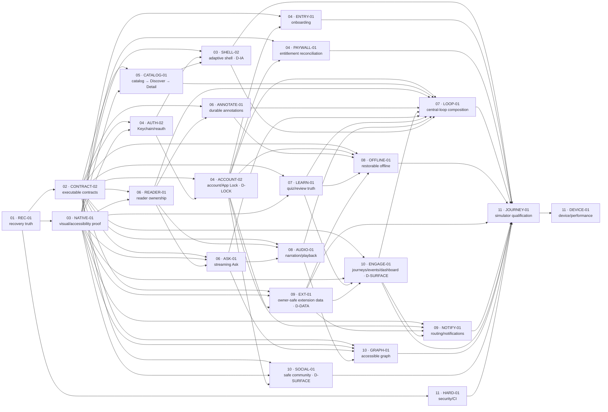

# ChapterFlow iOS Upgrade Program

This is the operator entrypoint for completing ChapterFlow's native learning loop. The program is
**planned, not started**. It was reconstructed from iOS `main`
`22da44d27bc18771f4d7db7681e17c10970ccb13` and static backend source
`858d2d7ffd620a7c28cdad5a75007536ccd5b391` at the 2026-07-18 cutoff. The deployed backend
revision and environment are unknown; a source merge never proves deployment.

Read the current user request and live `AGENTS.md` files first. Then read the
[program charter](PROGRAM_CHARTER.md), [current-state audit](CURRENT_STATE.md), selected package,
[skill router](SKILLS.md), [validation policy](VALIDATION_POLICY.md), and
[delivery policy](DELIVERY_POLICY.md). Live code, tests, backend contracts, CI, and current official
Apple documentation outrank this plan when evidence drifts.

## Program state and milestones

- State: `planned-not-started`; no app or backend implementation is part of the planning artifact.
- Scale: 11 outcome workstreams, 24 bounded work packages, five owner decisions, and 20 critical
  prompt/evaluation cases.
- Initial ready package: `WP-REC-01` only.
- Concurrency: at most two editors, only with disjoint write sets and no common high-contention
  lock. One package owns every writable file.
- Frozen work: PR #117 and `codex/wp-rel-01` are read-only and never a base or target.

| Milestone | Meaning | Gate |
|---|---|---|
| Feature complete | Every in-scope central-loop transition and visible control is wired and truthful. | Package ACs plus deterministic end-to-end loop and exact resume. |
| Development-quality complete | Correctness, contracts, architecture, native UI, accessibility, localization, offline behavior, privacy, performance, tests, CI, and maintainability pass. | Every applicable row in the [completion rubric](COMPLETION_RUBRIC.md) on one exact revision. |
| Device validated | Simulator-insufficient behavior is proven on approved signed devices and nonproduction services. | Keychain/SIWA, APNs/widgets/extensions, audio/background/interruption, memory, and real-network matrix. |
| Release ready — deferred | Deployment, TestFlight, App Store, signing, production, and release evidence are separately authorized. | Explicitly outside this program. |

The [design standard](DESIGN_STANDARD.md) defines the calm editorial native-iOS bar and its iOS 18
fallback contract.

## Dependency and workstream map

The machine authorities are [dependency-dag.json](program/dependency-dag.json) and the
[predeclared performance budgets](program/performance-budgets.json); this view shows the execution
shape. Decision gates still block a node after dependencies are green.

The authoritative queue, inverse dependencies, estimates, decisions, and statuses are in
[backlog.json](program/backlog.json); [resource-locks.json](program/resource-locks.json) contains
only genuinely contended resources.

## Select and launch one ready package

1. Run `python3 upgrade/scripts/validate_upgrade_plan.py` from the iOS repository root.
2. Reverify remote `main`, current instructions, protected checkouts, open PRs/worktrees, required
   CI, backend source/deployed evidence, and every selected skill path.
3. Derive readiness from immutable package metadata and live state: base `status` is `planned` and
   live status is either not-yet-integrated or an evidence-backed `reopened`; the package is not
   superseded, every `blockedBy` package is integrated, all decisions are resolved, there is no active
   path/atomic claim/lock collision, and the base is revalidated. Sort by priority, integration order,
   then ID.
4. For the initial run, open
   [WP-REC-01/RUN.md](workstreams/01-current-work-recovery/WP-REC-01/RUN.md) and paste its complete
   contents into one fresh Codex task. That runner is the sole editor/Git operator for the package.
5. Do not start a second editor unless both declared write sets are disjoint and locks permit it.

A downstream JOURNEY/DEVICE failure may reopen the existing owning package ID only through the root
scheduler's immutable external `reopen.json`, whose schema is in
[backlog.json](program/backlog.json). It records the exact defect, head set, declared-versus-observed
scope, invalidated gates, and owner/lock evidence. Reopening invalidates that package's integration
proof and every affected downstream JOURNEY/DEVICE gate; it does not add a 25th package or permit scope
drift. Package lanes never mutate `upgrade/**` or the reopen record.

Every package directory contains the machine contract (`package.json`), outcome and invariants
(`SPEC.md`), fresh-task handoff (`RUN.md`), and exact evidence map (`VALIDATE.md`). Workstream indexes:

- [01 current-work recovery](workstreams/01-current-work-recovery/README.md)
- [02 contracts and foundations](workstreams/02-contracts-and-foundations/README.md)
- [03 native design, accessibility, and localization](workstreams/03-native-design-accessibility-localization/README.md)
- [04 identity, account, and entitlements](workstreams/04-identity-account-entitlements/README.md)
- [05 catalog and discovery](workstreams/05-catalog-discovery/README.md)
- [06 reader, annotations, and AI](workstreams/06-reader-annotations-ai/README.md)
- [07 learning, progress, and resume](workstreams/07-learning-progress-resume/README.md)
- [08 media and offline](workstreams/08-media-offline/README.md)
- [09 routing, notifications, and extensions](workstreams/09-routing-notifications-extensions/README.md)
- [10 engagement and community](workstreams/10-engagement-community/README.md)
- [11 qualification, performance, security, and CI](workstreams/11-qualification-performance-security-ci/README.md)

## Resume, review, merge, and cleanup

- Resume an interrupted or stalled lane with the shared
  [recovery prompt](prompts/RECOVERY_AND_RESUME.md), its last bounded handoff, exact Git state, and
  privacy-safe evidence. Never replay completed discovery or add a second writer.
- Implement through [LANE_RUNNER.md](prompts/LANE_RUNNER.md). Create a local candidate commit, run
  validation, then review that immutable head through [RISK_REVIEWER.md](prompts/RISK_REVIEWER.md);
  deduplicate findings, preserve co-located issues,
  adjudicate severity from impact/likelihood, and resolve every P0/P1/P2.
- Push/publish only the reviewed candidate head. Use one `codex/` branch/PR per affected repository and enable
  auto-merge only when all ACs, local lanes, independent review, required checks,
  protection/review, mergeability, declared scope, compatibility/merge order, deployment truth,
  and authority gates pass on every affected PR head.
- After GitHub records the merge, verify target ancestry/tree and post-merge required CI. Only then
  prove no live PID/open file, a clean worktree, and no unmerged commit; remove with
  `git worktree remove`, delete only package-owned merged branches, and recheck the protected primary
  checkout. Never use `rm -rf` for worktree cleanup.

The shared templates are [work-package spec](prompts/templates/WORK_PACKAGE_SPEC.md),
[runner](prompts/templates/WORK_PACKAGE_RUN.md), and
[validation](prompts/templates/WORK_PACKAGE_VALIDATE.md). They are maintenance contracts, not extra
per-package roles.

## Current blockers and decisions

- `D-IA-01`: approve top-level information architecture before `WP-SHELL-02`.
- `D-DATA-01`: approve ownerless legacy private-data attribution/discard policy before `WP-EXT-01`;
  quarantine is the default.
- `D-SURFACE-01`: choose coordinated completion versus truthful removal/disablement for unsupported
  journey/event and community/moderation surfaces before `WP-ENGAGE-01` and `WP-SOCIAL-01`.
- `D-LOCK-01`: approve App Lock threat/recovery policy or remove/label the false surface before
  `WP-ACCOUNT-02`.
- `D-ANNOTATION-01`: approve source-derived cross-device annotation sync or an explicitly local-only
  truthful policy; preserve/quarantine existing data meanwhile and do not silently remove it.
- Deployed backend revision, credentials/provider configuration, signed-device access, backend
  deployment, and external configuration remain evidence/authority gates, never inferred success.

See the resumable [planning checkpoint](results/PLANNING_CHECKPOINT.md) and evidence-writing
[results contract](results/README.md).

## Plan validation and evaluation artifacts

All 20 critical cases in [prompt-cases.json](evals/prompt-cases.json) retain fixed expected
behaviors in [expected-behaviors.md](evals/expected-behaviors.md). The old plan and draft-v0
baselines are preserved separately from the final result:

- [old v02 baseline](evals/baselines/old-v02-orchestrator.json)
- [draft-v0 shared-prompt baseline](evals/baselines/draft-v0-shared-prompts.json)
- [final semantic evaluation](evals/results/final-semantic-evaluation.json)
- [prompt static analysis](evals/results/prompt-static-analysis.json)

These are static prompt/plan evidence, not app-runtime proof. The stdlib
[validator](scripts/validate_upgrade_plan.py) checks structure, JSON, package envelopes, skills,
acceptance traceability, DAG/inverse edges/cycles, parallel ownership, locks, eval identity/hashes,
and internal links.

## Bounded package-count rationale

The 24-package hard cap is deliberate. Independent review kept onboarding and paywall separate
because their authority, native owners, validation, and rollback differ, while Home/Library/Search,
Discover, and Book Detail were consolidated into one LibraryFeature catalog-to-detail vertical.
Concept Graph remains separate from engagement because its interaction/accessibility/performance
oracle differs, and exact-final signed-device/performance qualification remains separate from
simulator integration because the evidence environments invalidate independently. Further splits
require consolidation without weakening ownership/evidence or an explicit charter revision and full
plan re-review. The qualification package openly budgets 390 total minutes as four resumable
authorization sublanes capped at 120 minutes each; it is one evidence owner, not a false 120-minute
total or four concurrent device writers.

## Release exclusion

This is a development program only. It authorizes no backend deployment, infrastructure or data
mutation, production probing, App Store Connect, TestFlight, signing/certificates/profiles, pricing,
purchases, release evidence, submission, production feature flag, or PR #117 action. No development
merge may be described as deployed or release ready.
